## Reference:

- Original article, https://edgar-andres-crespo.space/linear-stage
- [Video], [Arduino Motor Shield tutorial- Controlling two DC Motors](https://www.youtube.com/watch?v=HHlwZWwpTIw) 

# About Arduino Motor Shield


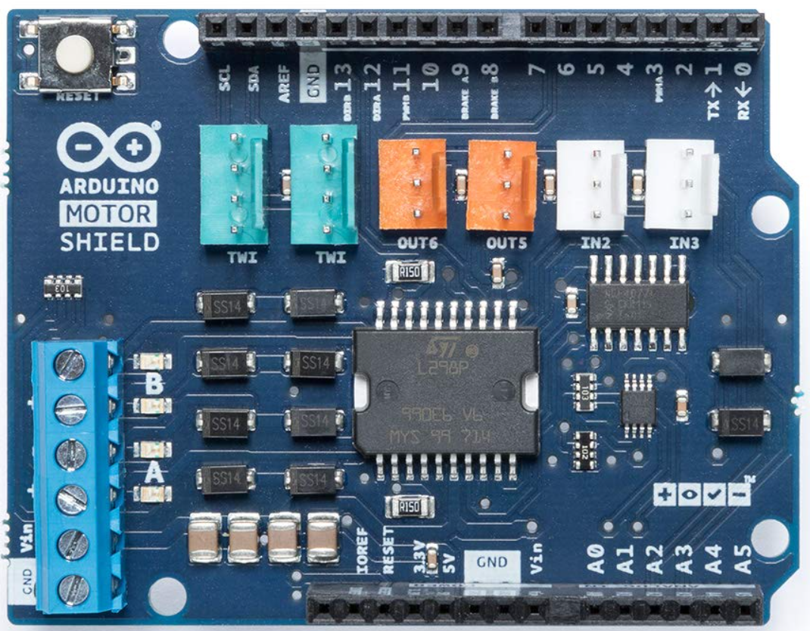


### Arduino Motor Shield Rev3 Specifications

| Operating voltage | 5 V to 12 V                                                  |
| ----------------- | ------------------------------------------------------------ |
| Motor controller  | L298P, Drives 2 DC motors or 1 stepper motor                 |
| Max current       | 2A per channel or 4A max (with external power supply)        |
| Current sensing   | 1.65V/A                                                      |
| Functions         | Free running, stop and brake                                 |
| Cost              | [Check price](https://assoc-redirect.amazon.com/g/r/https://www.amazon.com/Arduino-A000079-Motor-Shield-12V/dp/B0084ZQF3O/ref=as_li_ss_tl?dchild=1&keywords=arduino+motor+shield+rev3&qid=1591346314&sr=8-3&linkCode=ll1&tag=makerguides1-20&linkId=ecf158a90f472cf1aff6ffd372c9da84&language=en_US) |

### Input and Output

| Function          | Pins Channel A | Pins Channel B |
| ----------------- | -------------- | -------------- |
| *Direction*       | D12            | D13            |
| *PWM*             | D3             | D11            |
| *Brake*           | D9             | D8             |
| *Current sensing* | A0             | A1             |

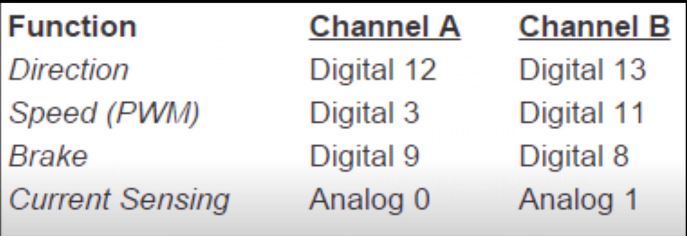

### Arduino Motor Shield Rev3 Connections

| Arduino Motor Shield Rev3 | Connection                  |
| ------------------------- | --------------------------- |
| Vin                       | 5 – 12 V                    |
| GND                       | Power supply ground         |
| A-                        | Coil 1 of the stepper motor |
| A+                        | Coil 1 of the stepper motor |
| B-                        | Coil 2 of the stepper motor |
| B+                        | Coil 2 of the stepper motor |


# Linear Stage with Open-Loop Control

​         The following  project had the goal of  is to design, build and test a linear stage to move a 1 lb. or 0.5 kg rigid load horizontally according to a pre-programmed motion sequence on a platform that is at least 5” x 5”. An automated open-loop control system will position the load and a limit switch is used for the homing sequence. The linear stage is driven by a stepper motor, which moves a carriage through a lead screw and nut. The carriage is supported on linear guide rods, to which it is coupled through linear bearings. The linear guide rods are fixed by means of aluminum mounting blocks that are attached to a structure that you will design and build. The code used to test the linear stage with open-loop control follows a homing sequence with both full-stepping and half-stepping for validation at different speeds and precision settings.

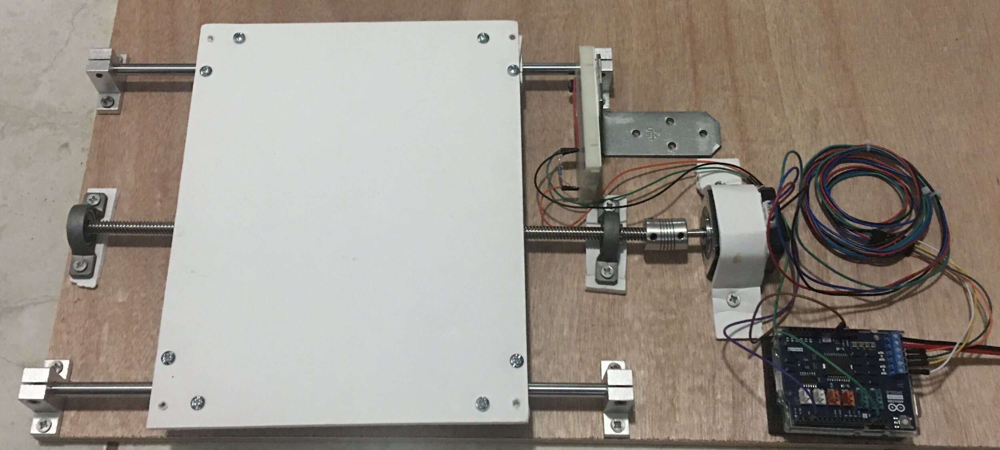

## Background Information

​         The fundamental concept behind this linear stage revolves around the conversion of rotational motion from the motor into linear motion. This transfer can be achieved through a carriage system that utilizes a lead screw and nut. A lead screw allows for the nut to travel linearly along the screw by a certain amount per revolution. This amount is called, unsurprisingly, the lead of the screw. The lead of the screw can be empirically calculated through testing but in theory it is the pitch of the screw times the number of starts. A coupler block connects the lead nut and the carriage platform, thus completing the mechanical system.

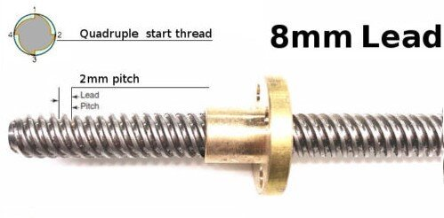

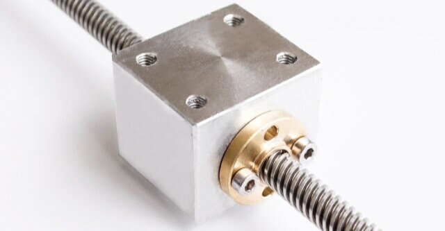

​         The other fundamental part of this linear stage configuration is the use of a stepper motor. Because the control system is an open-loop, the motor itself must be precisely controlled in a  predictable manner. The solution to this is to use a stepper motor. Stepper motors, as their name suggest, rotate in “steps.” The steps correspond, in their most basic from, to magnetic poles formed via coils. The coils are energized and deenergized sequentially. Because the angle from one step to the other is known for each motor (or calculated via testing), it is easy to determine how many steps you would need to complete a rotation (or any amount of rotations. The process of energizing one coil at a time while keeping the other deenergized is called full-stepping. Half-stepping can be done by adding intermediate steps where both coils are energized. This half-stepping process will double the required steps for a revolution, decreasing the minimum travel distance and thus increasing precision. The stepper motor uses a two-phase stator, that is, there are four poles with each pole forming a pair with one other (they’re part of the same wire).

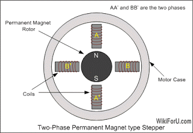

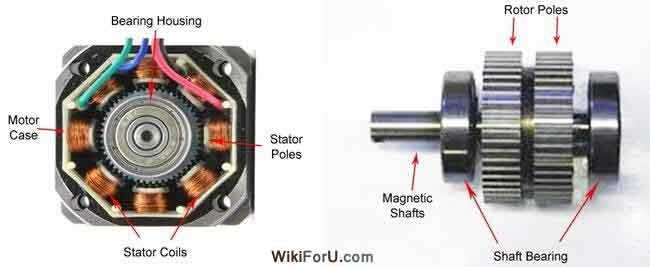

## Carriage Construction

​         This project was built amidst the COVID-19 pandemic. The quality of the materials and tools available for the build dictated the fabrication methods I would employ to meet the engineering requirements for a functioning linear stage. Through the use of prototyping techniques and some ingenuity in material usage the build manages to be sturdy and durable, surpassing its design load requirement by a minimum factor of 3 (I did not test the max limit as I did not want to redo the whole thing in case of disaster).

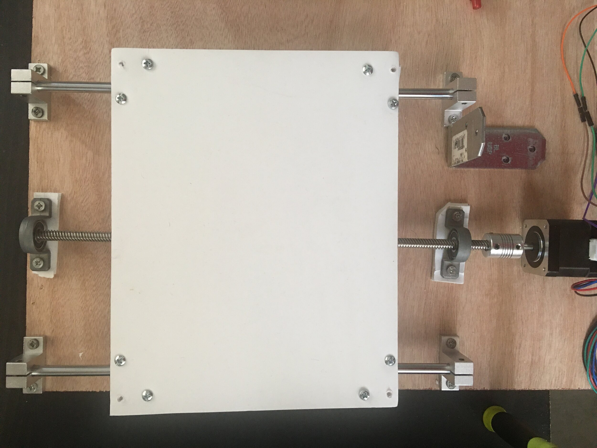

​         The basic carriage assembly consists on two guide rails (one on each flank) and the lead screw and nut in the center. The lead screw is supported by a bearing on each end. These special pillow block bearings allow transverse movement easing the alignment requirements between both bearings. The guide rail supports and bearings are fixed to the 1/2” thick plywood base using 10-32 woodscrews. The 8” x 10” x 1/8” platform (in charge of handling the payload) is made out of foam board and screws in to the bearing blocks in the guide rails while being connected to the nut housing bracket (also improvised out of foam board) with hot glue (I’m also impressed this actually worked btw). 

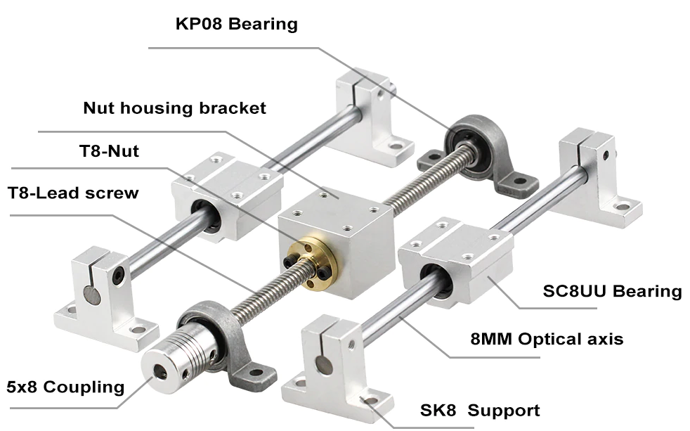

​         The carriage system connects to the motor via a coupler that attached to the lead screw on one end and to the motor shaft on the other. The coupler is purpose built to account for small differences in alignment between the lead screw and the motor shaft, ensuring a smooth transfer of power even if not perfectly aligned. The stepper motor is held to the wood base with a DIY foam board motor mount screwed in from both sides. This simple motor mount is made of sheet metal but had to be improvised with the materials on hand, in this case foam board. For the limit switch assembly, a simple L bracket I found in a corner of my closet supports the breadboard containing the limit switch facing the platform.

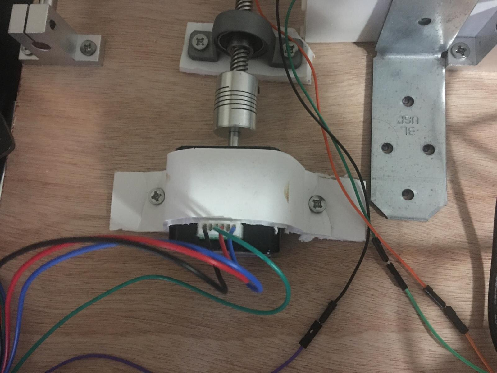

## Wiring and Electrical Diagrams

​         The first electrical element installed was the limit switch. The switch was created using a simple button, a 1M Ohm resistor (pulldown), some jumper wires, and a breadboard as the base. one end of the button connects to the ground pin in the motor shield, the other end splits between the pulldown resister that connects to the 5V pin in the motor shield and the signal wire that connects to pin 7.


​         The second element is the heart of the system, the motor. The stepper motor has four connections, each connection is coupled with on other. In general, these sets are referred to as A and B. The two ends of the A pair are wired to the motor shield where it is labeled “-” and “+” on the A section. The same was done with the B pair but in the B section of the motor shield. Power to the motor shield came from the power supply where the black cable is connected to the GND and the red wire to V in.

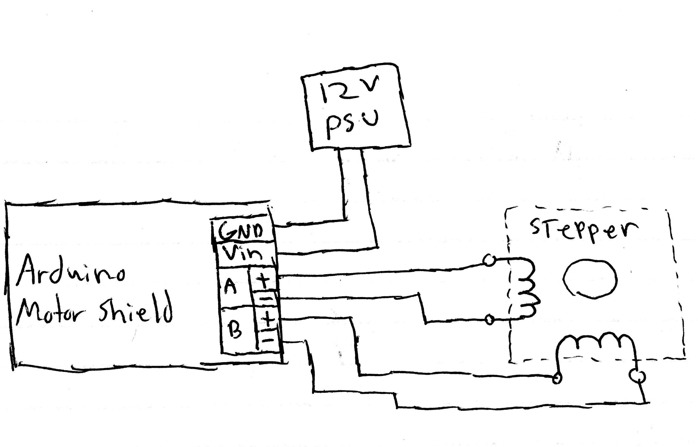

## Open-Loop Control Arduino Code


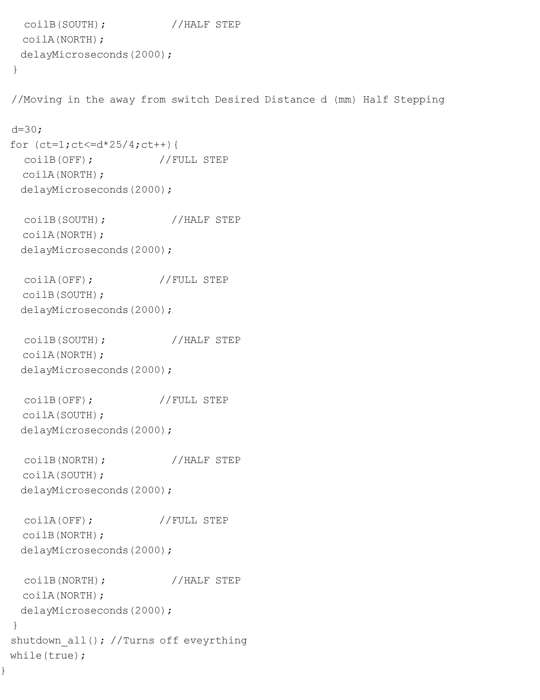

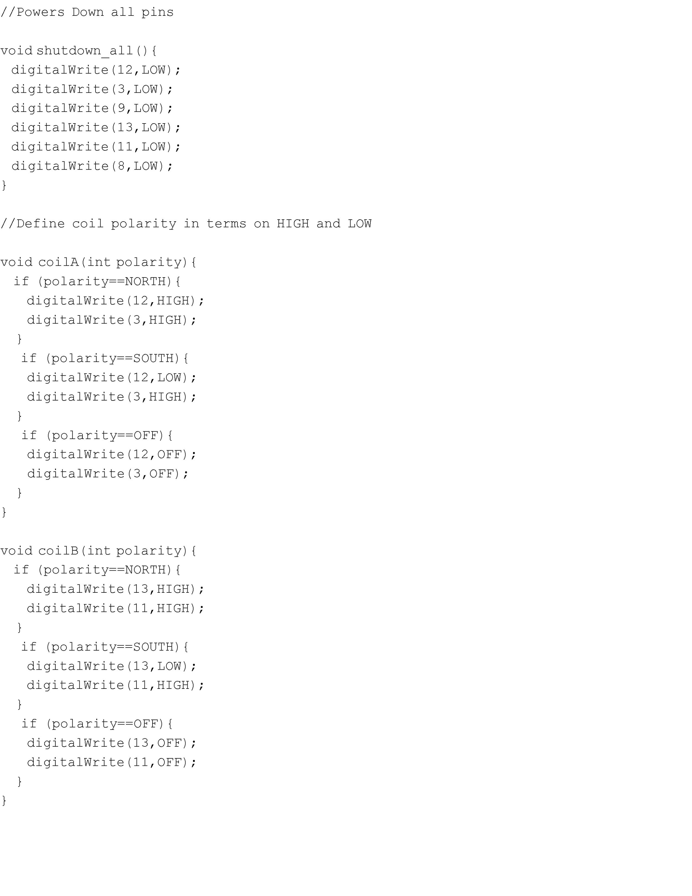

​         The code is a homing test sequence where the user presses the limit switch to initialize, the carriage moves towards the limit switch at max speed and full-stepping, retracts 5mm, then moves towards the switch again but half-stepping, then retracts 30mm half-stepping. The start of the code introduces the set up, where the I/O pins and some constants. Additionally, the set up contains the starting conditions for the pins, in this case deenergized. There is a “while loop” that will prevent the sequence from executing until the limit switch, pin 7, is activated by the user and a 1 second delay is introduced from the time of pressing the switch to the time it’s executed. On the first section of the code, the motor is set to turn clockwise at the maximum stable speed (2000ms delay between steps) until it reaches the limit switch. Then a variable “d” is defined as the retracting distance in millimeters; 5 in this case. A “for loop” iterates a full motor cycle consisting of 4 steps d*25/4 (conversion from mm to required steps/4) times. Once at 5mm, the code is similar to the  first section but uses a 8 step cycle instead for increase precision (half-stepping). After the limit switch is hit, the direction is reverted and the variable “d” is set to 30 so the carriage will retract 30 mm from the switch and the function “shutdown_all” deenergizes the system and a sink ends the code, thus ending the homing sequence. At the tail end of the code some subroutines are defined:  “shutdown_all” deenergizes all pins in the Arduino and “coilA” and “coilB” define the polarity state of their respective coil from HIGH and LOW values into simple NORTH, SOUTH, and OFF terms.

## Development Testing and Data Acquisition

​         Four tests were conducted to develop the code and to validated the performance of the linear stage. The first of these tests related to measuring the current across the coils using a built in capability from the motor shield and a small piece of code. The coils were energized for a short burst and the value was recorded when it stabilized. The graph below shows the result from this test.


​         The second test sought to figure out what speeds the motor would be able to operate at. The code made the motor do two revolutions in one direction and then two more in the opposite direction. The curve below shows the results for several different speeds in terms of the delay in milliseconds between motor steps. In delays smaller than 2000ms there was heavy vibrations and steps seemed to skip and at sometimes did not even turn. Therefore the fastest possible speed allowed turned out to be about 90 rpms when the delay was 2000ms.


​         The third test ran the motor at full step and half step. The displacement versus time was measured to corroborate that running the motor at half steps would indeed half the rpms. The results below show this seemingly obvious relationship but nevertheless it was important to show that there were no weird behaviors when intermediate steps were added to the motion sequence.


​         The fourth test was on the limit switch and served as a general first run for the entire system. On activation, the switch would activate the carriage to move towards it. When the carriage hit the limit switch it would retract 30 mm then switch direction and travel 15 mm.

<iframe width="560" height="315" src="https://www.youtube.com/embed/DOvV3MBGTQU" title="YouTube video player" frameborder="0" allow="accelerometer; autoplay; clipboard-write; encrypted-media; gyroscope; picture-in-picture" allowfullscreen></iframe>

## Final Test: Open-Loop Homing Sequence

​         The fifth and final test for the linear stage runs the main homing sequence code discussed in the “Open-Loop Control Arduino Code” section above. A half-empty bottle of Baileys (which greatly helped in the project’s development) served as the test load weighing in at about 1.5lb. A ruler was used to mark key distances the program was supposed to reach on a paper set beside the linear stage. Overall the project was successful. The requirements were met and the carriage managed to work better than expected considering the available materials and tools on hand. If this were for a course I’d give it an A++.

<iframe width="560" height="315" src="https://www.youtube.com/embed/0f54OC9OWpU" title="YouTube video player" frameborder="0" allow="accelerometer; autoplay; clipboard-write; encrypted-media; gyroscope; picture-in-picture" allowfullscreen></iframe>

# Linear Stage with Closed-Loop Control

​         The second “phase” of the project had the goal of  using the same linear stage but replacing the stepper motor with a dc servo motor. Servos have much faster rpm capacity but are inherently imprecise, therefore this dc motor has an inclkuded encoder for precision and a gearbox to reduce the motor output rpms. An automated cleased-loop control system will position the load and a limit switch is used for the homing sequence. The control system is also in Arduino code and will be using the signal from the encoder to measure the rpms and control the speed of the motor as it translates the carriage.

## Wiring and Electrical Diagrams

​         The first electrical element installed was the limit switch. The switch was created using a simple button, a 1M Ohm resistor (pullup), some jumper wires, and a breadboard as the base. One end of the button connects to the ground pin in the motor shield, the other end splits between the pullup resistor that connects to the 5V pin in the motor shield and the signal wire that connects to pin 6.


​         The dc motor used has an included encoder. This configuration gives 6 connections to the motor shield. Labeled in the motor are M2, VCC, A,  B, GND, and M1. M1 and M2 connect to the motor shield’s A terminals (the order doesn’t matter). The VCC connects to the 5V power and the GND to the ground pin. The last two connections correcpond to the encoder connections. A goes to a high speed pin connection, in this case 2, and B connects to any input pin of your choosing, in this case pin 7.


## Closed-Loop Control Arduino Code


```c
void setup()
{
  pinMode(12, OUTPUT);  // Group A: Direction
  pinMode(3, OUTPUT);   // Group A: Current
  pinMode(13, OUTPUT);  // Group A: Direction
  pinMode(11, OUTPUT);   // Group A: Current
  digitalWrite(12,LOW); // Everything off
  digitalWrite(3,LOW);
  digitalWrite(13,LOW);
  digitalWrite(11,LOW);
}
void loop()
{
    // STEP 0
    digitalWrite(12,LOW);  // A is south
    digitalWrite(11,LOW);  // B is off
    delay(10);
    digitalWrite(3,HIGH);   // Energize A
    delay(500);
    digitalWrite(3,LOW);    // Turn off A
    delay(1500);
    // STEP 1
    digitalWrite(13,LOW);  // B is south
    digitalWrite(3,LOW);  // A is off
    delay(10);
    digitalWrite(11,HIGH);   // Energize B
    delay(500);
    digitalWrite(11,LOW);    // Turn off B
    delay(1500);
    // STEP 2
    digitalWrite(12,HIGH);  // A is north
    digitalWrite(11,LOW);  // B is off
    delay(10);
    digitalWrite(3,HIGH);   // Energize A
    delay(500);
    digitalWrite(3,LOW);    // Turn off A
    delay(1500);
    // STEP 3
    digitalWrite(13,HIGH);  // B is north
    digitalWrite(3,LOW);  // A is off
    delay(10);
    digitalWrite(11,HIGH);   // Energize B
    delay(500);
    digitalWrite(11,LOW);    // Turn off B
    delay(1500);
}
```


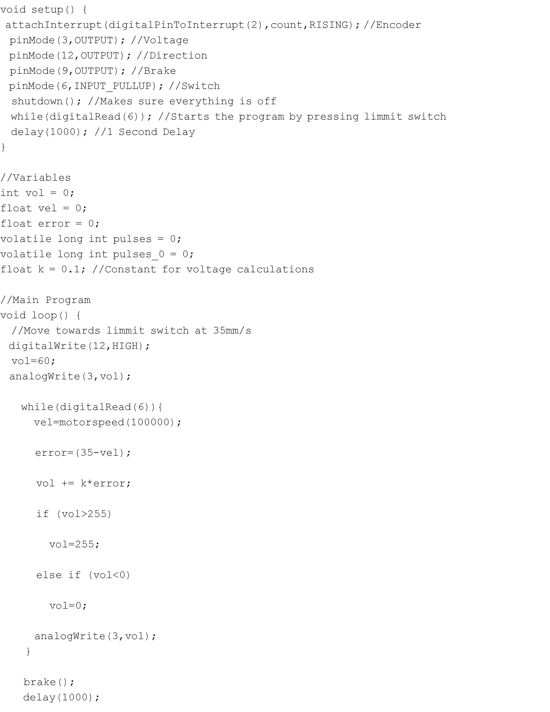

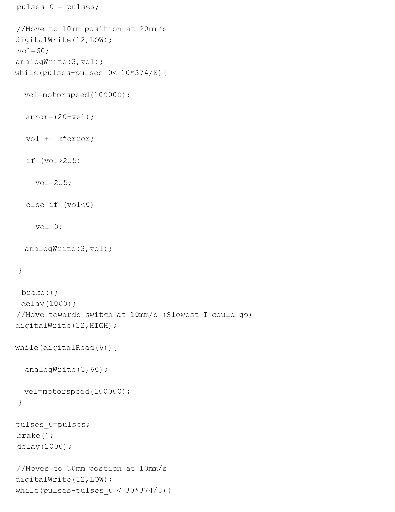

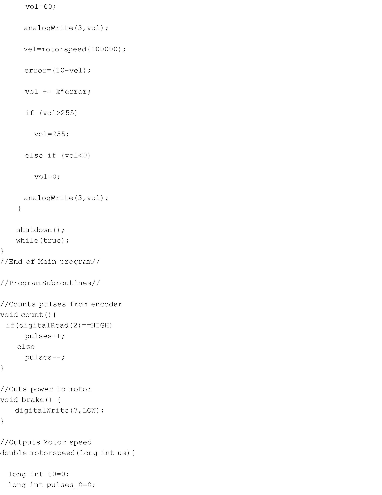

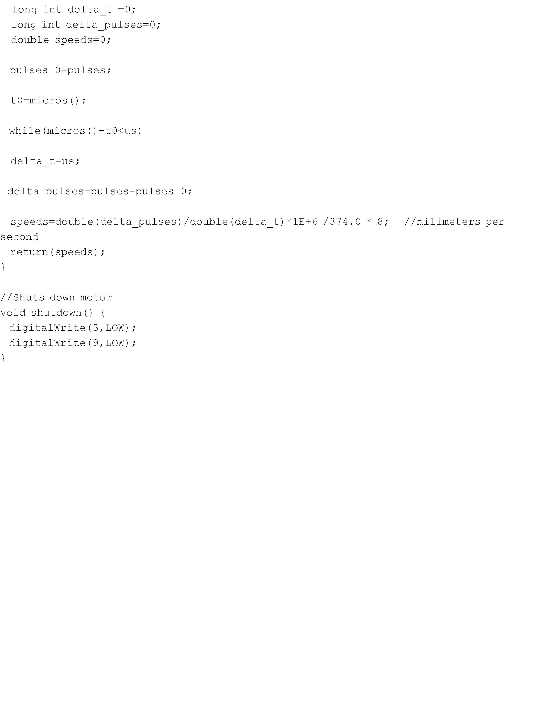

 The code is a homing test sequence where the user presses the limit switch to initialize, the carriage moves towards the limit switch at a speed of 35 mm/s. It then retracts to a position 10mm away from the limit switch at 20mm/s. Then it moves towards the switch at the lowest possible speed, in our case that was 10mm/s sdaly. The homing sequence ends with the carriage moving towards a position 30mm away from the limit switch. The are 1 second pauses between each step. The start of the code introduces the set up, where the I/O pins and some constants. Additionally, the set up contains the starting conditions for the pins, in this case deenergized. There is a “while loop” that will prevent the sequence from executing until the limit switch, pin 6, is activated by the user and a 1 second delay is introduced from the time of pressing the switch to the time it’s executed. Throughout the program, the speed and displacement is measured using pulses from an encoder. Speed is set by using a base voltage, reading the pulses to get the current speed, and then using a control algorythm that iterates to reach the voltage that will produce the target speed. At the end opf the program we have our “brake” function that sets motor voltage to 0, “shutdown” which shuts off the motor, and the “motorspeed” function that outputs the motor speed used on the control calculations.

## Final Test: Open-Loop Homing Sequence

​        To test the control algorithm in motion, a homing sequence similar to the open-loop control test was conducted. The sequence is as follows:

- The user manually presses the switch to begin the sequence. 

- After a one-second delay, the carriage begins to move towards the switch at a speed of 35 mm/s. 

- The switch will detect contact with the carriage. 

- The carriage will then retract 10 mm from the switch at a speed of 20 mm/s. 

- The carriage will stop and move again towards the switch at the lowest speed at which you can reliably move the motor (may vary from one motor to another). 

- The carriage will stop and move away 30 mm from the switch at a speed of 10 mm/s. 

- Power to the motor is shut off. This finalizes the homing process.

  The video below shows this test running flawlessly thanks to countless hours of off-camera testing to figure out the control system. Curves of linear displacement vs. time and linear velocity vs. time were recorded for the duration of the homing sequence.

<iframe width="560" height="315" src="https://www.youtube.com/embed/_ouTDDez1BI" title="YouTube video player" frameborder="0" allow="accelerometer; autoplay; clipboard-write; encrypted-media; gyroscope; picture-in-picture" allowfullscreen></iframe>


