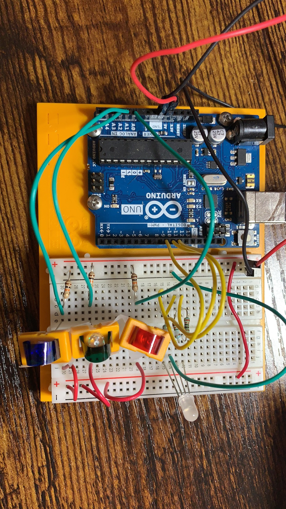

  In this project, we will use a tri-color LED and three Phototransistors. You'll create a lamp that smoothly changes colors depending on external lighting conditions.


## **Introduction:**
* PWM(Pulse Width Modulation): 
  * Motivation: Difital signals have two position: on and off, or in shorthand 1 or 0. On the other hand, analog signal can be on, off, half-way, two-thirds, or any position between 0 and 1. The two are handled very differently in electronics, but we often need to work them together. Often, engineers will translate the analog input into difital input via analog-to-digital converter for MCU(microncontroller), but what about outpust? That's why we introduce you the PWM.
    * 
  * Idea: The purpos of PWM is provide a way to control analog devices with a digital output, such that PWM rapidly turns the output pin on and off with a certain frequency and a certain pulse-width(like wave period). And then you can use it for things like variable-speed motors, dimmable lights, actuatrs, and speakers. For example, you can apply full voltage to a motor, and the motor will pulse for a certain intervals, like the voltage being applied and remove many times. However, its motor won't stop instantly due to inertia, and so by the time you re-apply power it has only slowed a bit.Therefore, you do not experience an abrupt stop in power if a motor is driven by PWM.


## **Lab Components:**


- 1 x Arduino UNO
- 1 x Breadboard
- 8 x Jumper wires
- 3 x phototransistors
- 3 x 220-ohm resistors
- 1 x 4 leg RGB LED
- 3 x 10 kilohm resistors
- red, green, and blue colored gels


**Phototransistors**: It generate a current that is proportional to quantity of light it absorbed. They looks like LEDs and are polarized coomponents, which means they only allow electricity to flow through them in one direction, so attach long end to the power. On the other side, attach a 10 killohm resistor to ground. 

**4 leg RGB LED**: This LED has 4 legs, consisted of three input, red, green, and blue elements inside, and one longer leg to the ground(the catode). By creating a voltage difference beween the cathode and the voltage coming out of the Arduino's PWM pin(which are connected to the anodes through 220-ohm resistors), you'll cause the LED to fade between its three colors. 

---
## **BUILD THE CIRCUIT:**

Schematic view:


Wire up your breadboaord so you have power and ground on both sides.

Circuit diagrame from [Fritzing](http://fritzing.org/home/):


The actually setup:


## **THE CODE:**
---

```c
/**

 * Project Name: Arduino Projects Book - Project 4 - Color Mixing Lamp*
 * File Name: Project3_Love-o-Meter.ino
 * Description: 
 * Author: Zhengqi Dong
 * Created:
 * Updated:

**/

// For 4 legs RGB LEDG
const int greenLEDPin = 9;    // LED connected to digital pin 9
const int redLEDPin = 10;     // LED connected to digital pin 10
const int blueLEDPin = 11;    // LED connected to digital pin 11

int redValue = 0; // value to write to the red LED
int greenValue = 0; // value to write to the green LED
int blueValue = 0; // value to write to the blue LED

// For 3 phototransistors
const int redSensorPin = A0;  // pin with the photoresistor with the red gel
const int greenSensorPin = A1;   // pin with the photoresistor with the green gel
const int blueSensorPin = A2;   // pin with the photoresistor with the blue gel

int redSensorValue = 0; // variable to hold the value from the red sensor
int greenSensorValue = 0; // variable to hold the value from the green sensor
int blueSensorValue = 0; // variable to hold the value from the blue sensor

void setup() {
  // initialize serial communications at 9600 bps:
  Serial.begin(9600);

  // set the digital pins as outputs
  pinMode(greenLEDPin, OUTPUT);
  pinMode(redLEDPin, OUTPUT);
  pinMode(blueLEDPin, OUTPUT);
}

void loop() {
  // Read the sensors first:

  // read the value from the red-filtered photoresistor:
  redSensorValue = analogRead(redSensorPin);
  // give the ADC a moment to settle
  delay(5);
  // read the value from the green-filtered photoresistor:
  greenSensorValue = analogRead(greenSensorPin);
  // give the ADC a moment to settle
  delay(5);
  // read the value from the blue-filtered photoresistor:
  blueSensorValue = analogRead(blueSensorPin);

  // print out the values to the Serial Monitor
  Serial.print("raw sensor Values \t red: ");
  Serial.print(redSensorValue);
  Serial.print("\t green: ");
  Serial.print(greenSensorValue);
  Serial.print("\t Blue: ");
  Serial.println(blueSensorValue);

  /*
    In order to use the values from the sensor for the LED, you need to do some
    math. The ADC provides a 10-bit number, but analogWrite() uses 8 bits.
    You'll want to divide your sensor readings by 4 to keep them in range
    of the output.
  */
  redValue = redSensorValue / 4;
  greenValue = greenSensorValue / 4;
  blueValue = blueSensorValue / 4;

  // print out the mapped values
  Serial.print("Mapped sensor Values \t red: ");
  Serial.print(redValue);
  Serial.print("\t green: ");
  Serial.print(greenValue);
  Serial.print("\t Blue: ");
  Serial.println(blueValue);

  /*
    Now that you have a usable value, it's time to PWM the LED.
  */
  analogWrite(redLEDPin, redValue);
  analogWrite(greenLEDPin, greenValue);
  analogWrite(blueLEDPin, blueValue);
}
```

## **Video Explanation:**

Here is more detailed explanation of those electronic componenet that I used in this lab:

<iframe width="1280" height="720" src="https://www.youtube.com/embed/Xq8EYTnCiiY?start=44" frameborder="0" allow="accelerometer; autoplay; clipboard-write; encrypted-media; gyroscope; picture-in-picture" allowfullscreen></iframe>

## **Reference:**
- Fitzgerald, S., & Shiloh, M. _Arduino Projects Book_. Arduino AG, 2017
- Heath, Janet. "PWM: Pulse Width Modulation: What is it and how does it work?" _Analog IC Tips_, Apr 04. 2017, <https://www.analogictips.com/pulse-width-modulation-pwm/>
