## Table of contents

{: .no_toc .text-delta }

1. TOC
{: toc }

# Completed Tutorial to NVIDIA Jetson AI JetBot Robot Car Project

# Introduction:

I was first inspired by the Jetson Nano Developer kit that Nvidia has released on March 18th, 2019 (Check out this post, [NVIDIA Announces Jetson Nano: $99 Tiny, Yet Mighty NVIDIA CUDA-X AI Computer That Runs All AI Models](https://nvidianews.nvidia.com/news/nvidia-announces-jetson-nano-99-tiny-yet-mighty-nvidia-cuda-x-ai-computer-that-runs-all-ai-models)). As there are more and more supporting resource published, such as [JetsonHack channel](https://www.youtube.com/channel/UCQs0lwV6E4p7LQaGJ6fgy5Q) – I’ve been following for a year. Also, here are many and many [Jetson AI project](https://developer.nvidia.com/embedded/learn/get-started-jetson-nano-devkit#next) had been created since then, such as [JetBot](https://jetbot.org/master/), [JetRacer](https://github.com/NVIDIA-AI-IOT/jetracer) (Check out this link to read more, [link](https://developer.nvidia.com/embedded/community/jetson-projects#jetracer)). Therefore, I also want to build one for myself as a electronic hobbyist. 

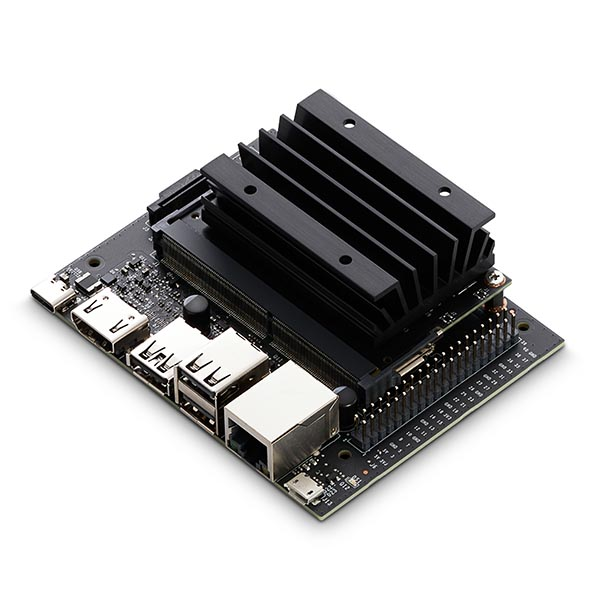


Without further ado, let’s start the journey. The following article is everything you need to begin from nothing to fully running JetBot. 


# Hardware

First step, You need to obtain the hardware. If you really want to built one for yourself, you can check out this website, for the [Bill of Materials](https://jetbot.org/master/bill_of_materials.html).  However, if you are someone like me, only want to focus on the software component and building some intelligent robot, then you can purchase from [Theird Party Kit](https://jetbot.org/master/third_party_kits.html) (For me, I purchased from [YahBoom](http://www.yahboom.net/study/JETBOT) at Amazon). 

If you also purchased from [YahBoom](http://www.yahboom.net/study/JETBOT), you can use their website for all the hardware assembling, and they also provided some deep learning module, such as Face recognition, object detection, mobile tracking and more. (But, I figured out, all those code are actually already provided by NVIDIA Jetson Hello World Project, here is their [Github repo](https://github.com/dusty-nv/jetson-inference))

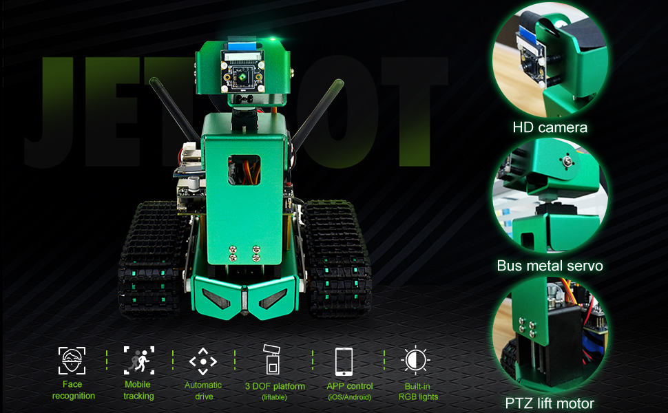

## Comparison of Jetson Nano: A02 vs B01 2GB vs B01 4GB

### B01: 2GB vs 4GB

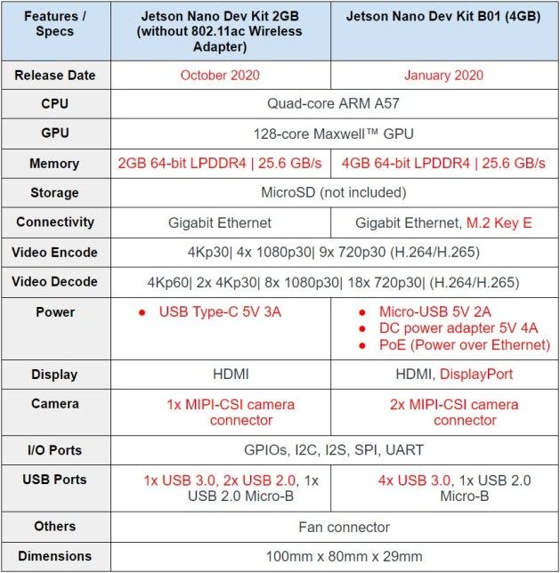

Table of comparisons between Nvidia Jetson Nano Developer Kit 2GB and 4GB(B01).

#### Hardware Changes from 4GB(B01) to 2GB

1. Removed camera slot (J49)

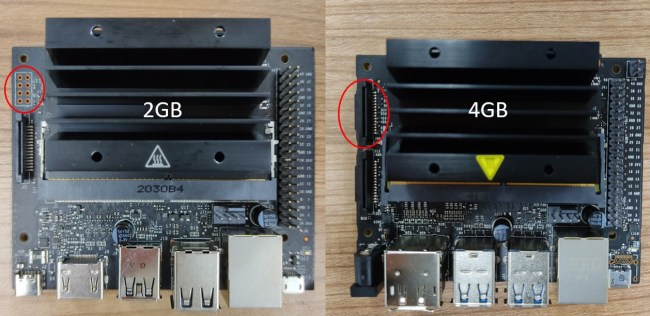

2. Changed DC barrel jack to USB Type-C port


3. Changed the USB Type-A ports

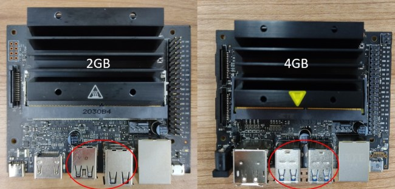


4. Removed Display Port

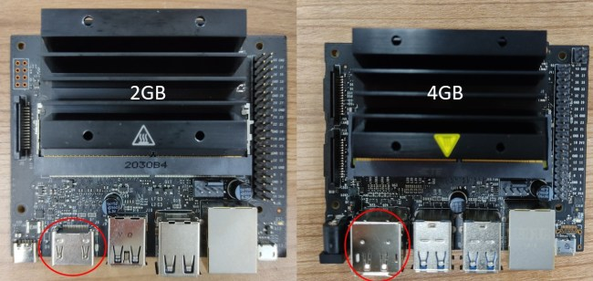

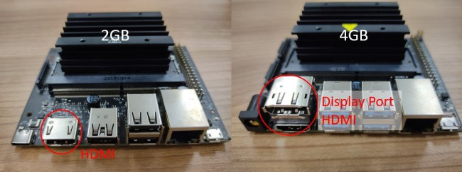

5. Removed PoE – Power over Ethernet port (J38)

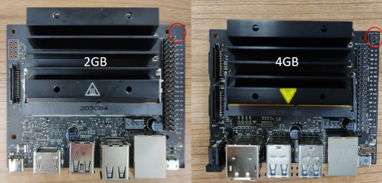

6. Removed M.2 Key E slot (J18)

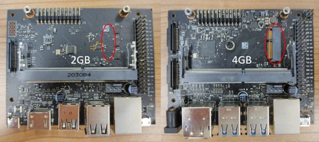

#### **Compatibility Issues 2GB vs 4GB**

1. You cannot use the [JetPack 4.4 image](https://developer.nvidia.com/embedded/learn/get-started-jetson-nano-devkit#write) in the Jetson Nano 2GB. You can only use the provided Ubuntu 18.04 in LXDE desktop environment with Openbox window manager given in [Nvidia’s Getting Started with Jetson Nano 2GB Developer Kit Website](https://developer.nvidia.com/embedded/learn/get-started-jetson-nano-devkit#intro).


### A02 vs B01

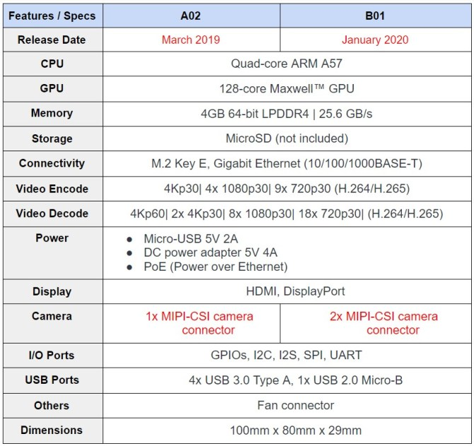

Table of comparisons between Nvidia Jetson Nano Developer Kit A02 and B01.


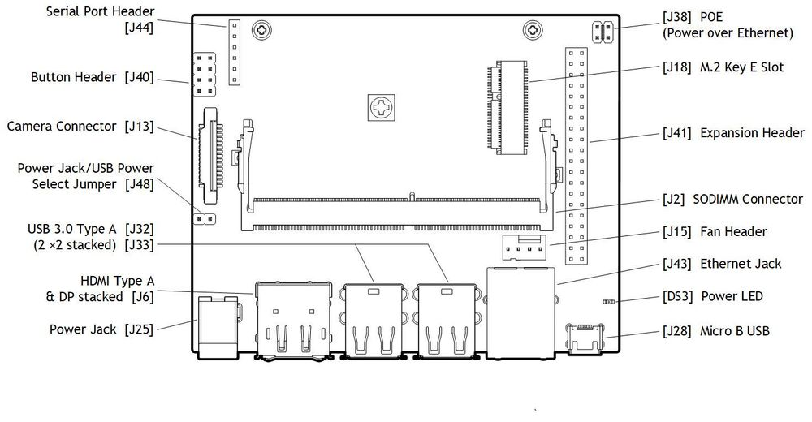

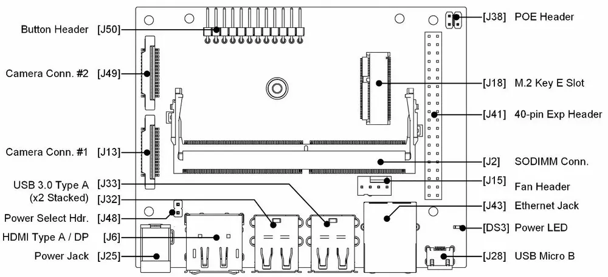

Figure 2: Jetson Nano A02 Pinout (left), Jetson Nano B01 Pinout (right)


### Hardware Changes from A02 to B01

1. Removed Serial Port Header (J44)


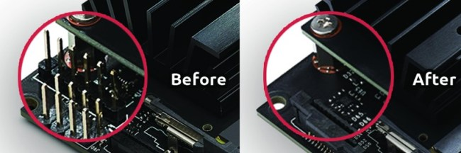

2. Changed the button header (J40) under the module

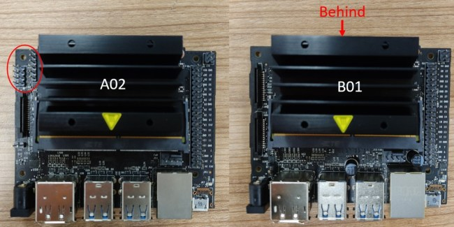

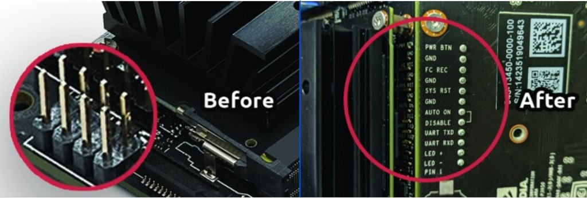

3. Changed the position of Power Select Header (J48)


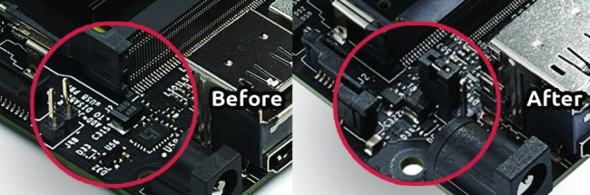

4. Added a camera slot (J13)

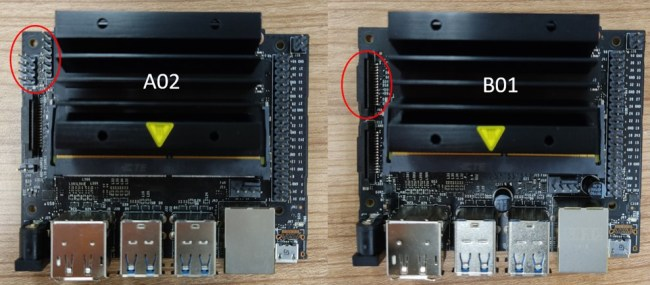

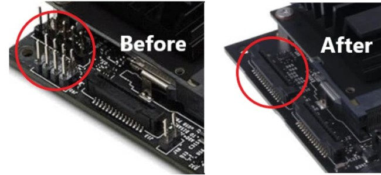


#### **Compatibility Issues A02 vs B01**

1. The hardware of Jetson Nano Developer Kit A02 cannot boot with Intel 8260 WiFi plugged in. This issue is fixed in the newer B01 version of the hardware. Refer to [release notes](https://developer.nvidia.com/tegra-linux-driver-package-release-notes-r3222-ga).
2. B0x images will work on A02 boards without issue. There are some pinmux differences between the two hardware revisions, but the B0x pinmux settings will work fine on an A02 board. However, A0x pinmux (dtb) does not work on B0x board.

The CoM modules and carrier boards of the older (A02) and newer models (B01) are **not interchangeable**. That means you can not plug the A02 CoM module into the B01 carrier board, and vice versa. You need to upgrade the whole developer kit for an update.


## Other Equipment

Besides the Jetson Nano Developer Kit you'll also need **a microSD card**, a power Supply (5V 2A), and an **ethernet cable or WiFi adapter**.

### microSD card

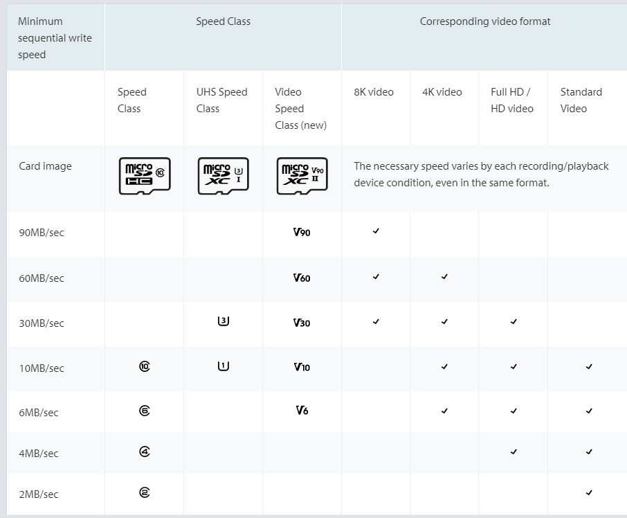

The Jetson Nano uses a microSD card as a boot device and primary storage. The minimum size for the microSD card is 16GB, but I would strongly recommend getting at least 32GB, or 64GB. It's also essential to get a fast microSD as this will make working on the Jetson Nano a lot more fluent. 

There are many different standard for microSD card – If you want to read more, check out these two article:  [A Guide to Speed Classes for SD and microSD Cards](https://www.kingston.com/unitedstates/us/solutions/personal-storage/memory-card-speed-classes), and [Fastest SD Card Speed Tests](https://havecamerawilltravel.com/photographer/fastest-sd-cards/). For this project, you can get this one, [SanDisk 64GB Extreme microSDXC UHS-I Memory Card with Adapter - Up to 160MB/s, C10, U3, V30, 4K, A2, Micro SD](https://www.amazon.com/gp/product/B07FCMBLV6/ref=ppx_yo_dt_b_asin_title_o00_s00?ie=UTF8&psc=1). 

### Power Supply

The Jetson Nano can be powered in three different ways: over <u>USB Micro-B, Barrel Jack connector, or through the GPIO Header.</u>

To power the Jetson Nano over USB Micro-B, the power supply needs to supply 5V 2A. Not every power supply is capable of providing this. NVIDIA specifically recommends a [5V 2.5A power supply from Adafruit](https://www.adafruit.com/product/1995), but I use a Raspberry Pi power supply, and it works just fine.

If you want to get the full performance out of the Jetson Nano, I'd recommend using the Barrel Jack instead of powering over USB because you can supply 5V 4A over the Barrel Jack.

Before connecting the Barrel Jack, you need to place a jumper on J48. The power jumper location can vary depending on if you have the [older A02 model or the newer B01 model](https://www.arducam.com/nvidia-jetson-nano-b01-update-dual-camera/).

### Camera:

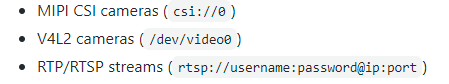

Here is a list of camera that work for Jetson Nano, [list](https://elinux.org/Jetson_Nano#Cameras), but I will suggest two to purchase, 1) [Raspberry Pi Camera Module v2](https://www.raspberrypi.org/products/camera-module-v2/), 2) [IMX219-160 8-Megapixels Camera Module 3280 × 2464 Resolution](https://www.amazon.com/Jetson-Nano-Camera-IMX219-160-8-Megapixels/dp/B07T43K7LC). If you lighting as well get this one, [IMX219-77IR 8-Megapixels Infrared Night Vision IR Camera Module 3280 × 2464 Resolution with IMX219 Sensor](https://www.amazon.com/Jetson-Nano-Camera-IMX219-77IR-8-Megapixels/dp/B07TT9Q4YL/ref=sr_1_2_sspa?dchild=1&keywords=jetson+nano+IR+camera&qid=1629082263&sr=8-2-spons&psc=1&smid=A2SA28G0M1VPHD&spLa=ZW5jcnlwdGVkUXVhbGlmaWVyPUEzVDNIWUFIWjU5UVBaJmVuY3J5cHRlZElkPUEwMDUxNjE5MkVGTjhUOEhJVzJYUyZlbmNyeXB0ZWRBZElkPUEwMjcxMzk2MTBKVjhNWUxMWU5HJndpZGdldE5hbWU9c3BfYXRmJmFjdGlvbj1jbGlja1JlZGlyZWN0JmRvTm90TG9nQ2xpY2s9dHJ1ZQ==)

Note: If you don’t get the camera right, you might get into some troble when running their Deep Learning code, check this article first, [Camera Streaming and Multimedia](https://github.com/dusty-nv/jetson-inference/blob/master/docs/aux-streaming.md#mipi-csi-cameras)

### Fan

Get this, [Noctua NF-A4x10 5V, Premium Quiet Fan, 3-Pin, 5V Version](https://www.amazon.com/Noctua-Cooling-Bearing-NF-A4X10-FLX-5V/dp/B00NEMGCIA?ref_=ast_slp_dp&th=1&psc=1), if you don’t have one

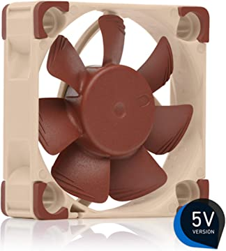

### Ethernet cable or WiFi Adapter

Lastly, you'll need an ethernet cable or a WiFi Adapter since the Jetson Nano doesn't come with one.  For the WiFi Adapter, you can either use one that connects through USB, or you can use a PCIe WiFi Card like the [Intel® Dual Band Wireless-AC 8265](https://www.intel.com/content/www/us/en/products/wireless/wireless-products/dual-band-wireless-ac-8265.html). 

For me, I have this one, [Wireless-AC8265 Dual Mode Intel AC8265 Wireless NIC Module for Jetson Nano Developer Kit B01/A02, Support 2.4GHz/5GHz 300Mbps/867Mbps Dual Band WiFi and Bluetooth 4.2](https://www.amazon.com/dp/B07V9B5C6M/ref=sspa_dk_detail_9?psc=1&pd_rd_i=B07V9B5C6M&pd_rd_w=msL8R&pf_rd_p=887084a2-5c34-4113-a4f8-b7947847c308&pd_rd_wg=KLBmG&pf_rd_r=T7DNQPVT44YR60JTGK10&pd_rd_r=c00dd53c-b60b-4b7d-ae40-f60e02b57dfd&smid=A3B0XDFTVR980O&spLa=ZW5jcnlwdGVkUXVhbGlmaWVyPUEzVjdUVlFVOTVaVlROJmVuY3J5cHRlZElkPUEwMDU0MDk3M1BRRk5DNTA3TEZYUyZlbmNyeXB0ZWRBZElkPUExMDM4NDE4MkZQM09YOTJIQ0hYMiZ3aWRnZXROYW1lPXNwX2RldGFpbCZhY3Rpb249Y2xpY2tSZWRpcmVjdCZkb05vdExvZ0NsaWNrPXRydWU=)

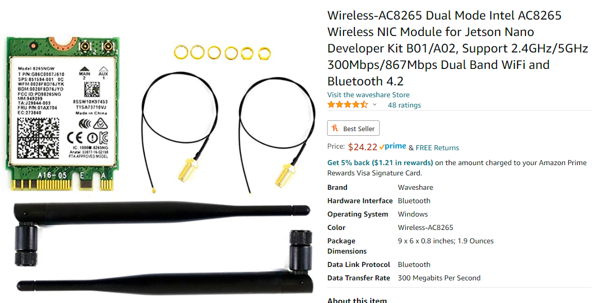

### Reference:

- Jetson Nano B01 vs A02: What’s New for the Compute on Module (CoM) and Carrier Board, https://www.arducam.com/nvidia-jetson-nano-b01-update-dual-camera/
- Nvidia Jetson Nano Developer Kit A02 vs B01 vs 2GB, https://tutorial.cytron.io/2020/10/14/nvidia-jetson-nano-developer-kit-a02-vs-b01-vs-2gb/

## Setup

Note: you need to download some software for this [balenaEtcher](https://www.balena.io/etcher/) – For Flash OS image, and [SD Card Formatter](https://www.sdcard.org/downloads/formatter/) – For formating SD Memory Card. Also, instead of using the following SD Card Image provided by Nvida, use this one with Deep learning module integrated ( [Yahboom_jetbot_64GB](https://drive.google.com/drive/folders/1bEY7TtjdmsftUsVksEg8w02F5NnwSnOy), and [32GB](https://drive.google.com/drive/folders/1N7msGC-kr0gMUwPphmaRsUaLdYtkzDEW)). 

==> the following article can be outdated

Before we can get started setting up a Python environment and running some deep learning demos, we have to download the [Jetson Nano Developer Kit SD Card Image](https://developer.nvidia.com/jetson-nano-sd-card-image) and [flash it to the microSD card](https://developer.nvidia.com/embedded/learn/get-started-jetson-nano-devkit#write).

After that is done you need to insert the microSD card into the microSD slot as shown in the following image:

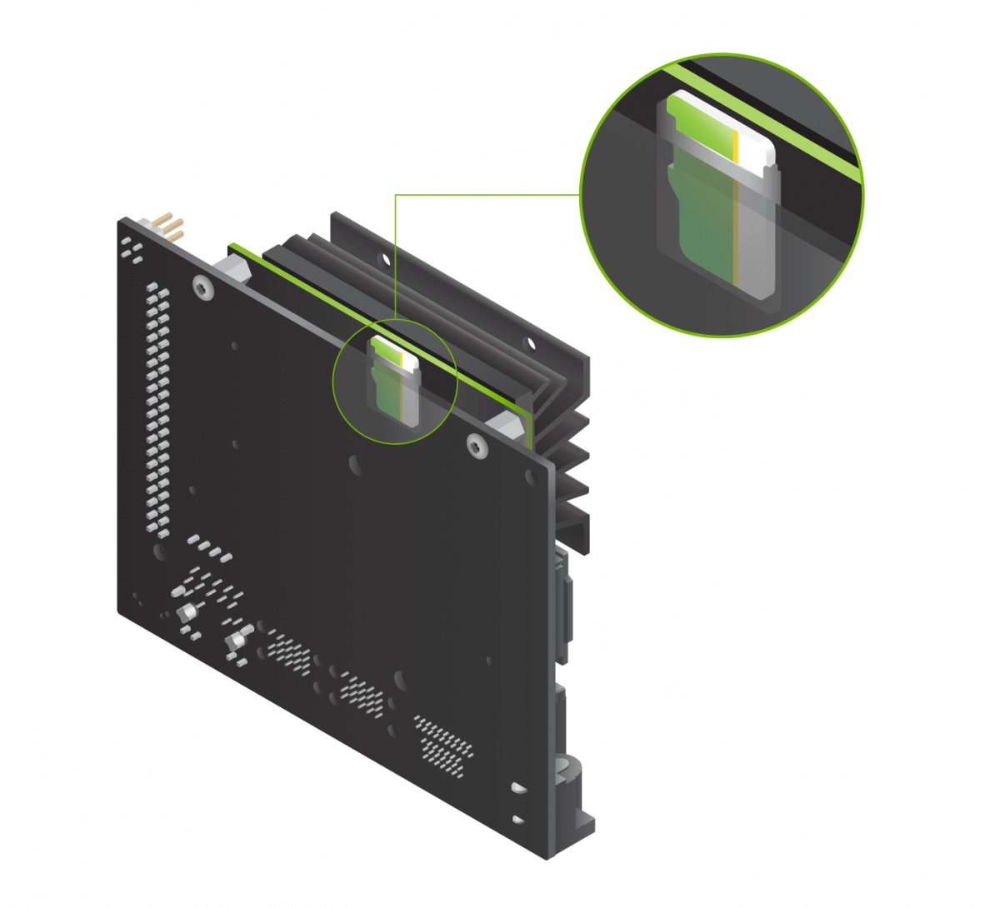Figure 3: Insert microSD card ([Source](https://developer.nvidia.com/embedded/learn/get-started-jetson-nano-devkit#setup))

After inserting the microSD card, you can connect the power supply, which will automatically boot up the system.

When you boot the system for the first time, you'll be taken through some initial setup, including:

- Review and accept NVIDIA Jetson software EULA
- Select system language, keyboard layout, and time zone
- Create username, password, and computer name
- Log in

After the initial setup, you should see the following screen:


Figure 4: Desktop

### Increasing swap memory (optional)

Recent releases of JetPack enable swap memory as part of the default distribution using the [zram module](https://en.wikipedia.org/wiki/Zram). By default, 2GB of swap memory is enabled. To change the amount of swap memory, you can either edit the /etc/systemd/nvzramconfig.sh file directly, or you can use the [resizeSwapMemory repository](https://github.com/JetsonHacksNano/resizeSwapMemory) from [JetsonNanoHacks](https://www.jetsonhacks.com/2019/11/28/jetson-nano-even-more-swap/).

```bash
git clone https://github.com/JetsonHacksNano/resizeSwapMemory
cd resizeSwapMemory
 ./setSwapMemorySize.sh -g 4
```

After executing the above command, you'll have to restart the Jetson Nano for the changes to take effect.

### Installing prerequisites and configuring your Python environment

Now, that the Jetson Nano is ready to go we will go through creating a deep learning environment. We will start of by installing all prerequsites and configuring a Python environment as well as how to code remote using VSCode Remote SSH.

### Installing prerequisites

```bash
sudo apt-get update
sudo apt-get upgrade

sudo apt-get install git cmake python3-dev nano

sudo apt-get install libhdf5-serial-dev hdf5-tools libhdf5-dev zlib1g-dev zip libjpeg8-dev
```

### Configuring your Python environment

Next we will configure our Python environment. There are three way for configuring the Python environment. 1) pip + virtualenv; 2)Conda (or miniconda)

- pip: a package manager
- virtualenv: an environemnt manage (And required sudo priority to use it) ==> **Choose Virtualenv only when you have sudo access** to the machine you are working on. It is much easier to setup *conda* rather than virtualenv for a regular (i.e., non sudo/root) user on a linux/Mac machine.
- conda: a environemnt manager and package installer ==> **Choose Anaconda if you: **Have the time and disk space (a few minutes and 3 GB), and/or Don’t want to install each of the packages you want to use individually.
- conda vs miniconda: Both *Anaconda* and *Miniconda* uses [*Conda*](https://conda.io/docs/index.html) as the package manager. The difference among *Anaconda* and *Miniconda* is that *Miniconda* only comes the package management system. So when you install it, there is just the management system and not coming with a bundle of pre-installed packages like *Anaconda* does. Once *Conda* is installed, you can then install whatever package you need from scratch along with any desired version of Python. ==> **Choose Miniconda** if you don’t have time or disk space (about 3 GB) to install over 720+ packages (many of the packages are never used and could be easily installed when needed)

If you want to learn more about their difference, check this article, [Anaconda vs. Miniconda vs. Virtualenv](https://deeplearning.lipingyang.org/2018/12/23/anaconda-vs-miniconda-vs-virtualenv/)

**Method 1: pip3 and virtualenv**

Install pip:

```bash
sudo apt-get install python3-pip
sudo pip3 install -U pip testresources setuptools
```

For managing virtual environments we'll be using [virtualenv](https://virtualenv.readthedocs.io/en/latest/), which can be installed like below:

```bash
sudo pip install virtualenv virtualenvwrapper
```

To get virtualenv to work we need to add the following lines to the *~/.bashrc* file:

```bash
# virtualenv and virtualenvwrapper
export WORKON_HOME=$HOME/.virtualenvs
export VIRTUALENVWRAPPER_PYTHON=/usr/bin/python3
source /usr/local/bin/virtualenvwrapper.sh
```

To activate the changes the following command must be executed:

```bash
source ~/.bashrc
```

Now we can create a virtual environment using the *mkvirtualenv* command.

```bash
mkvirtualenv latest_tf -p python3
workon latest_tf
```


**Method 2: Miniconda(not completed)**

Step1: Decide what miniconda version to download, 

Go to this website, and find the [Latest Miniconda Installer Links](https://repo.anaconda.com/miniconda/Miniconda3-latest-Linux-x86_64.sh)。

Before that, we need to figure out the system architecture of our machine, for linux, you can do:

```bash
jetbot@jetbot-desktop:~$ lscpu
Architecture:        aarch64
Byte Order:          Little Endian
CPU(s):              4
On-line CPU(s) list: 0-3
Thread(s) per core:  1
Core(s) per socket:  4
Socket(s):           1
Vendor ID:           ARM
Model:               1
Model name:          Cortex-A57
Stepping:            r1p1
CPU max MHz:         1479.0000
CPU min MHz:         102.0000
BogoMIPS:            38.40
L1d cache:           32K
L1i cache:           48K
L2 cache:            2048K
Flags:               fp asimd evtstrm aes pmull sha1 sha2 crc32
```

==> So, we need to download the latest miniconda with aarch64 architecture:

```bash
wget https://repo.anaconda.com/miniconda/Miniconda3-latest-Linux-aarch64.sh
sh Miniconda3-latest-Linux-x86_64.sh -b -p $PWD/miniconda3
#  -b,  --background                go to background after startup
# -d,  --debug                     print lots of debugging information
```

Above command will create “miniconda3” directory. From now on, we will refer the path to “miniconda3” directory as “/PATH/TO” 

Activate Conda 

```bash
-bash-4.2$ source /PATH/TO/miniconda3/bin/activate 
-bash-4.2$ export PYTHONNOUSERSITE=true
```

Create new environment and activate it

```bash
-bash-4.2$ conda create -n tf_latest python=3.6.9
-bash-4.2$ conda activate tf_latest
# You can list all discoverable environments with `conda info --envs`.
```


Verify pip points to correct library.

```bash
-bash-4.2$ which pip
Expected Outcome: /PATH/TO/miniconda3/envs/tf_latest/bin/pip
Install latest TensorFlow
-bash-4.2$ pip install tensorflow-gpu==2.3.0
```

Install latest TensorFlow 

```bash
-bash-4.2$ pip install tensorflow-gpu==2.3.0
```


**Reference**： 

- https://deeplearning.lipingyang.org/2018/12/23/anaconda-vs-miniconda-vs-virtualenv/
- [Miniconda](https://repo.anaconda.com/miniconda/Miniconda3-latest-Linux-x86_64.sh)
- [10 Useful Commands to Collect System and Hardware Information in Linux](https://www.tecmint.com/commands-to-collect-system-and-hardware-information-in-linux/)


### Coding remote with Visual Studio Code (optional)

If you are like me and hate writing long scripts in nano or vim, the VSCode remote development plugin is for you. It allows you to develop remotely inside VSCode by establishing an SSH remote connection.

To use VSCode remote development, you'll first have to install the remote development plugin. After that, you need to create an SSH-Key on your local machine and then copy it over to the Jetson Nano.

Note: Perform this on your local machine!!

```bash
# Create Key
ssh-keygen -t rsa
# Copy key to jetson nano 
cat ~/.ssh/id_rsa.pub | ssh user@hostname 'cat >> .ssh/authorized_keys'
```

Now you only need to add the SSH Host. Ctrl + Shift + P -> Remote SSH: Connect to Host.

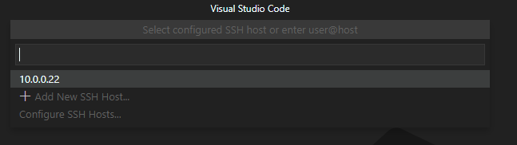Figure 5: Added new host.

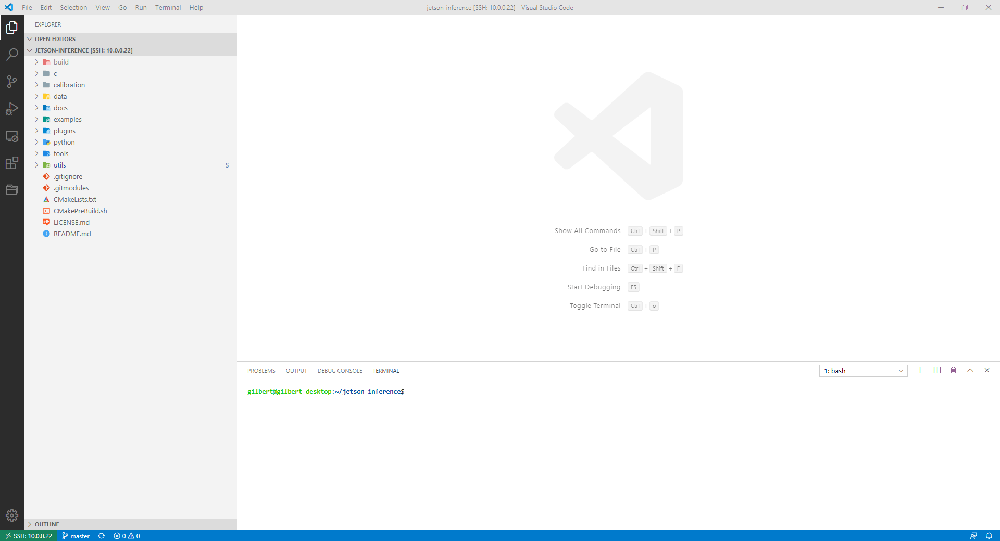Figure 6: VSCode Remote Controll

## Installing deep learning libraries

Now that we have our development and python environments set up, we can start installing some deep learning libraries. NVIDIA provides [a guide on how to install deep learning libraries on the Jetson Nano](https://elinux.org/Jetson_Zoo). I simply put the commands for some installations below.

### [TensorFlow](https://docs.nvidia.com/deeplearning/frameworks/install-tf-jetson-platform/index.html)

Note: TensorFlow 2.0 is problematic, check out this website, https://forums.developer.nvidia.com/t/tensorflow-2-0/72530, and search with “TensorFlow 2.0 can be installed with JetPack4.3 now.”, Also you might need to know the  version of your JetPack, so use command `jtop` to figure that out!

```bash
# install prerequisites
$ sudo apt-get install libhdf5-serial-dev hdf5-tools libhdf5-dev zlib1g-dev zip libjpeg8-dev liblapack-dev libblas-dev gfortran

# User virtual env, instead of using root privilege(sudo)
workon latest_tf

# install and upgrade pip3
$ sudo apt-get install python3-pip
$ pip3 install -U pip testresources setuptools==49.6.0 

# install the following python packages
$ pip3 install -U numpy==1.16.1 future==0.18.2 mock==3.0.5 h5py==2.10.0 keras_preprocessing==1.1.1 keras_applications==1.0.8 gast==0.2.2 futures protobuf pybind11
$ pip3 install -U numpy grpcio absl-py py-cpuinfo psutil portpicker six mock requests gast h5py astor termcolor protobuf keras-applications keras-preprocessing wrapt google-pasta setuptools testresources
# Note Use this if you got error with h5pf (refers to, https://stackoverflow.com/questions/64942239/unable-to-install-h5py-on-windows-using-pip)
$pip install versioned-hdf5

# to install TensorFlow 1.15 for JetPack 4.4:
$ sudo pip3 install --pre --extra-index-url https://developer.download.nvidia.com/compute/redist/jp/v44 ‘tensorflow<2’

# or install the latest version of TensorFlow (2.3) for JetPack 4.4:
$ sudo pip3 install --pre --extra-index-url https://developer.download.nvidia.com/compute/redist/jp/v44 tensorflow

sudo pip3 install -U pip==20.2.4
sudo pip3 install --pre --extra-index-url https://developer.download.nvidia.com/compute/redist/jp/v43 tensorflow-gpu==1.15.0+nv19.12
```

Reference:

- [Installing TensorFlow For Jetson Platform - NVIDIA](https://docs.nvidia.com/deeplearning/frameworks/install-tf-jetson-platform/index.html) 
- [Upgrade Jetson Jetpack to 4.4 (From 4.3)](https://code.luasoftware.com/tutorials/jetson-nano/upgrade-jetson-jetpack-to-44/)

### Keras

```bash
# beforehand, install TensorFlow (https://eLinux.org/Jetson_Zoo#TensorFlow)
$ sudo apt-get install -y build-essential libatlas-base-dev gfortran
$ sudo pip3 install keras
```

### [PyTorch](https://forums.developer.nvidia.com/t/pytorch-for-jetson-nano-version-1-5-0-now-available/72048)

Note: Instead of running the following step, I will suggest you following this [instruction](https://github.com/dusty-nv/jetson-inference/blob/master/docs/building-repo-2.md), because they write a scipt for downing PyTorch and have the correct environment building up for you!

```bash
# install OpenBLAS and OpenMPI
$ sudo apt-get install libopenblas-base libopenmpi-dev

# Python 2.7
$ wget https://nvidia.box.com/shared/static/yhlmaie35hu8jv2xzvtxsh0rrpcu97yj.whl -O torch-1.4.0-cp27-cp27mu-linux_aarch64.whl
$ pip install future torch-1.4.0-cp27-cp27mu-linux_aarch64.whl

# Python 3.6
$ sudo apt-get install python3-pip
$ pip3 install Cython
$ wget https://nvidia.box.com/shared/static/9eptse6jyly1ggt9axbja2yrmj6pbarc.whl -O torch-1.6.0-cp36-cp36m-linux_aarch64.whl
$ pip3 install numpy torch-1.6.0-cp36-cp36m-linux_aarch64.whl
```

### Torchvision

Select the version of torchvision to download depending on the version of PyTorch that you have installed:

- PyTorch v1.0 - torchvision v0.2.2
- PyTorch v1.1 - torchvision v0.3.0
- PyTorch v1.2 - torchvision v0.4.0
- PyTorch v1.3 - torchvision v0.4.2
- PyTorch v1.4 - torchvision v0.5.0
- PyTorch v1.5 - torchvision v0.6.0
- PyTorch v1.5.1 - torchvision v0.6.1
- PyTorch v1.6 - torchvision v0.7.0
- PyTorch v1.7 - torchvision v0.8.0

```bash
$ sudo apt-get install libjpeg-dev zlib1g-dev
$ git clone --branch <version> https://github.com/pytorch/vision torchvision   # see below for version of torchvision to download
$ cd torchvision
$ sudo python3 setup.py install
$ cd ../  # attempting to load torchvision from build dir will result in import error
$ sudo pip install 'pillow<7' # always needed for Python 2.7, not needed torchvision v0.5.0+ with Python 3.6
```

### OpenCV

Installing OpenCV on the Jetson Nano can be a bit more complicated, but frankly, [JetsonHacks.com](https://www.jetsonhacks.com/) has a [great guide](https://www.jetsonhacks.com/2019/11/22/opencv-4-cuda-on-jetson-nano/).

### Compiling and installing Jetson Inference

NVIDIA's Jetson Inference repository includes lots of great scripts that allow you to perform image classification, object detection, and semantic segmentation on both images and a live video stream. In this article, we will go through how to compile and install the Jetson Inference repository and how to run some of the provided demos. Maybe I will go through the repository in more detail in an upcoming article.

To install Jetson Inference, you need to run the following commands(Or following this instruction, [Building the Project from Source](https://github.com/dusty-nv/jetson-inference/blob/master/docs/building-repo-2.md) ):

```bash
# download the repo
$ git clone --recursive https://github.com/dusty-nv/jetson-inference
$ cd jetson-inference

# configure build tree
$ mkdir build
$ cd build
$ cmake ../

# build and install
$ make -j$(nproc)
$ sudo make install
$ sudo ldconfig
```

## Running the Jetson Inference demos

After [building](https://github.com/dusty-nv/jetson-inference/blob/master/docs/building-repo-2.md) the project, you can go to the *jetson-inference/build/aarch64/bin* directory. Inside you'll find multiple C++ and Python scripts. Below we'll go through how to run image classification, object detection, and semantic segmentation.

### Image Classification

Inside the folder there are two imagenet examples. One for a image and one for a camera. Both are available in C++ and Python.

- [imagenet-console.cpp](https://github.com/dusty-nv/jetson-inference/blob/master/examples/imagenet-console/imagenet-console.cpp) (C++)
- [imagenet-console.py](https://github.com/dusty-nv/jetson-inference/blob/master/python/examples/imagenet-console.py) (C++)
- [imagenet-camera.cpp](https://github.com/dusty-nv/jetson-inference/blob/master/examples/imagenet-camera/imagenet-camera.cpp) (C++)
- [imagenet-camera.py](https://github.com/dusty-nv/jetson-inference/blob/master/python/examples/imagenet-camera.py) (C++)

```bash
# C++
$ ./imagenet-console --network=resnet-18 images/jellyfish.jpg output_jellyfish.jpg

# Python
$ ./imagenet-console.py --network=resnet-18 images/jellyfish.jpg output_jellyfish.jpg
```

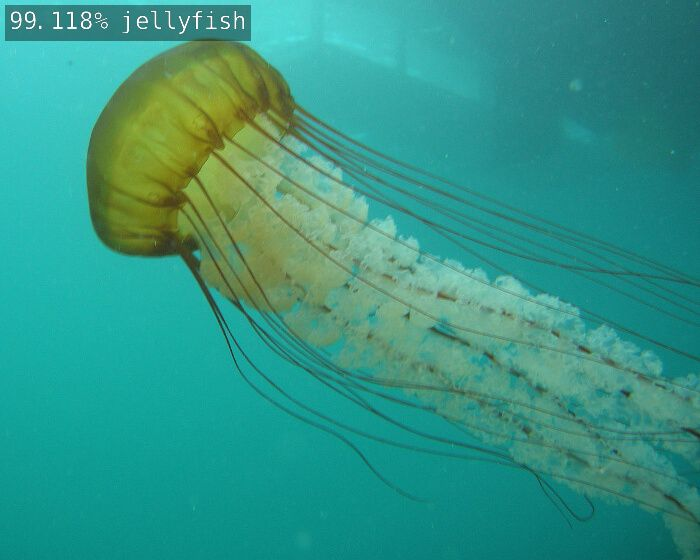Figure 7: Image Classification Example

### Object Detection

- [detectnet-console.cpp](https://github.com/dusty-nv/jetson-inference/blob/master/examples/detectnet-console/detectnet-console.cpp) (C++)
- [detectnet-console.py](https://github.com/dusty-nv/jetson-inference/blob/master/python/examples/detectnet-console.py) (Python)
- [detectnet-camera.cpp](https://github.com/dusty-nv/jetson-inference/blob/master/examples/detectnet-camera/detectnet-camera.cpp) (C++)
- [detectnet-camera.py](https://github.com/dusty-nv/jetson-inference/blob/master/python/examples/detectnet-camera.py) (Python)

```bash
# C++
$ ./detectnet-console --network=ssd-mobilenet-v2 images/peds_0.jpg output.jpg     # --network flag is optional

# Python
$ ./detectnet-console.py --network=ssd-mobilenet-v2 images/peds_0.jpg output.jpg  # --network flag is optional
```

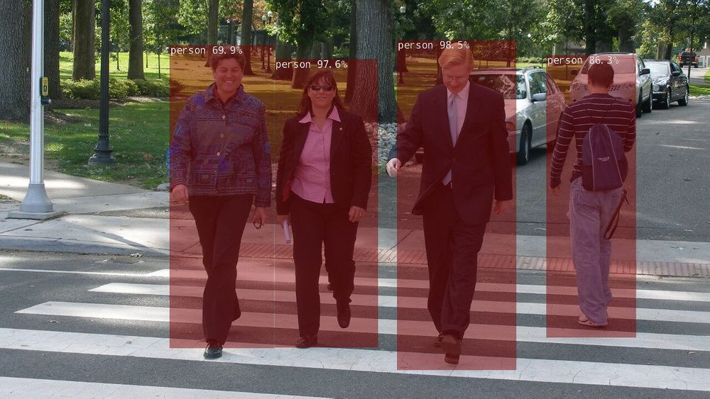Figure 8: Object Detection Example

### Semantic Segmentation

- [segnet-console.cpp](https://github.com/dusty-nv/jetson-inference/blob/master/examples/segnet-console/segnet-console.cpp) (C++)
- [segnet-console.py](https://github.com/dusty-nv/jetson-inference/blob/master/python/examples/segnet-console.py) (Python)
- [segnet-camera.cpp](https://github.com/dusty-nv/jetson-inference/blob/master/examples/segnet-camera/segnet-camera.cpp) (C++)
- [segnet-camera.py](https://github.com/dusty-nv/jetson-inference/blob/master/python/examples/segnet-camera.py) (Python)

```bash
# C++
$ ./segnet-console --network=fcn-resnet18-cityscapes images/city_0.jpg output.jpg

# Python
$ ./segnet-console.py --network=fcn-resnet18-cityscapes images/city_0.jpg output.jpg
```

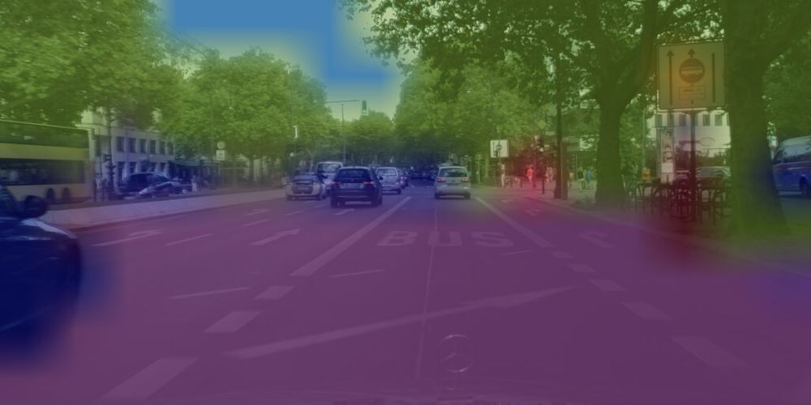Figure 9: Semantic Segmentation

## JetPack 4.5.1 CUDA and VisionWorks samples

JetPack 4.5.1 includes multiple CUDA and VisionWork demos.

### CUDA samples

Installation:

```bash
./usr/local/cuda/bin/cuda-install-samples-10.2.sh ~
cd ~/NVIDIA_CUDA-10.2_Samples/
make
cd bin/aarch64/linux/release
```

After compiling, you can find multiple examples inside the bin/aarch64/linux/release directory.

oceanFFT sample:

```bash
./oceanFFT
```

<iframe width="200" height="150" src="https://www.youtube.com/embed/EiM85VNrbAk?feature=oembed" frameborder="0" allow="accelerometer; autoplay; clipboard-write; encrypted-media; gyroscope; picture-in-picture" allowfullscreen="" style="vertical-align: middle; border: 0px; width: 881px; height: 60vh;"></iframe>

Figure 10: oceanFFT sample

particles sample:

```bash
./particles
```

<iframe width="200" height="150" src="https://www.youtube.com/embed/5nh1ya8pRJo?feature=oembed" frameborder="0" allow="accelerometer; autoplay; clipboard-write; encrypted-media; gyroscope; picture-in-picture" allowfullscreen="" style="vertical-align: middle; border: 0px; width: 881px; height: 60vh;"></iframe>

Figure 11: particles sample

smokeParticles sample:

```bash
./smokeParticles
```

<iframe width="200" height="150" src="https://www.youtube.com/embed/usovVzxaHV4?feature=oembed" frameborder="0" allow="accelerometer; autoplay; clipboard-write; encrypted-media; gyroscope; picture-in-picture" allowfullscreen="" style="vertical-align: middle; border: 0px; width: 881px; height: 60vh;"></iframe>

Figure 12: smoke particles sample

### VisionWorks samples

Installation:

```bash
./usr/share/visionworks/sources/install-samples.sh
cd ~/VisionWorks-1.6-Samples
make
cd bin/aarch64/linux/release
```

After compiling, you can find multiple examples inside the bin/aarch64/linux/release directory.

Feature Tracker sample:

```bash
./nvx_demo_feature_tracker
```

<iframe width="200" height="113" src="https://www.youtube.com/embed/u3OOYDR7I6w?feature=oembed" frameborder="0" allow="accelerometer; autoplay; clipboard-write; encrypted-media; gyroscope; picture-in-picture" allowfullscreen="" style="vertical-align: middle; border: 0px; width: 881px; height: 60vh;"></iframe>

Figure 13: Feature tracker sample

Motion Detection sample:

```bash
./nvx_demo_motion_estimation
```

<iframe width="200" height="113" src="https://www.youtube.com/embed/lgRKUS3YwfI?feature=oembed" frameborder="0" allow="accelerometer; autoplay; clipboard-write; encrypted-media; gyroscope; picture-in-picture" allowfullscreen="" style="vertical-align: middle; border: 0px; width: 881px; height: 60vh;"></iframe>

Figure 14: Motion Detection sample

Object Tracker sample:

```bash
./nvx_sample_object_tracker_nvxcu
```

<iframe width="200" height="113" src="https://www.youtube.com/embed/cG9m6wVgLrs?feature=oembed" frameborder="0" allow="accelerometer; autoplay; clipboard-write; encrypted-media; gyroscope; picture-in-picture" allowfullscreen="" style="vertical-align: middle; border: 0px; width: 881px; height: 60vh;"></iframe>

Figure 15: Object Tracker sample

## Conclusion

That's it from this article. In follow-up articles, I will go further into developing Artificial Intelligence on the Jetson Nano, including:

- Deploying custom models on the Jetson Nano
- [NVIDIA Jetbot](https://github.com/NVIDIA-AI-IOT/jetbot)

If you have any questions or just want to chat with me, feel free to leave a comment below or contact me on social media. If you want to get  continuous updates about my blog make sure to [join my newsletter](http://eepurl.com/gq-u4X)


## Reference:

- 
- [Blog] Getting a Running Start with the NVIDIA Jetson Nano, [https://www.farsightsecurity.com/blog/txt-record/nvidia-20200124/](https://www.farsightsecurity.com/blog/txt-record/nvidia-20200124/) ==> Software Intro
- [Blog] Getting Started with the NVIDIA Jetson Nano Developer Kit, [https://dronebotworkshop.com/nvidia-jetson-developer-kit/](https://dronebotworkshop.com/nvidia-jetson-developer-kit/)
- [NVIDIA Site] Getting Started with Jetson Nano Developer Kit, [https://developer.nvidia.com/embedded/learn/get-started-jetson-nano-devkit](https://developer.nvidia.com/embedded/learn/get-started-jetson-nano-devkit)
- [Github] Hello AI World, jetson-inference, [https://github.com/dusty-nv/jetson-inference](https://github.com/dusty-nv/jetson-inference)
- [Blog] 深入使用NVIDIA Jetson Inference机器学习项目 - 计算机视觉图片分类任务, [https://www.rs-online.com/designspark/nvidia-jetson-inference-1-cn](https://www.rs-online.com/designspark/nvidia-jetson-inference-1-cn)
- [Blog], Getting Started With NVIDIA Jetson Nano Developer Kit, [https://gilberttanner.com/blog/jetson-nano-getting-started#overview](https://gilberttanner.com/blog/jetson-nano-getting-started#overview)
- [JetBot] Getting Started, [https://jetbot.org/master/getting_started.html](https://jetbot.org/master/getting_started.html)
- Yahboom Documentation, [http://www.yahboom.net/study/JETBOT](http://www.yahboom.net/study/JETBOT)
- Embedded Linux Wiki, Jetson/Performance, [https://elinux.org/Jetson/Performance](https://elinux.org/Jetson/Performance) ==> (For how to control CPU performance)
- Jetson Nano Wiki – A wiki for the NVIDIA Jetson Nano, [https://elinux.org/Jetson_Nano](https://elinux.org/Jetson_Nano)
- How to Establish Remote Desktop Access to Ubuntu From Windows, [https://www.makeuseof.com/tag/how-to-establish-simple-remote-desktop-access-between-ubuntu-and-windows/](https://www.makeuseof.com/tag/how-to-establish-simple-remote-desktop-access-between-ubuntu-and-windows/)
- How To Set Up a Firewall with UFW on Ubuntu 18.04, [https://www.digitalocean.com/community/tutorials/how-to-set-up-a-firewall-with-ufw-on-ubuntu-18-04](https://www.digitalocean.com/community/tutorials/how-to-set-up-a-firewall-with-ufw-on-ubuntu-18-04)
- What are the risks of running 'sudo pip'?, [https://stackoverflow.com/questions/21055859/what-are-the-risks-of-running-sudo-pip](https://stackoverflow.com/questions/21055859/what-are-the-risks-of-running-sudo-pip)


# Appendix A: quick reference for Jetson Inference demo

```sh
# ===========================>  Using the ImageNet Program on Jetson
cd jetson-inference/build/aarch64/bin
./imagenet images/orange_0.jpg images/test/output_0.jpg     # (default network is googlenet)

# Using anothher image
./imagenet images/strawberry_0.jpg images/test/output_1.jpg
# Using Different Classification Models
./imagenet --network=resnet-18 images/jellyfish.jpg images/test/output_jellyfish.jpg

# Processing a Video
# Download test video (thanks to jell.yfish.us)
wget https://nvidia.box.com/shared/static/tlswont1jnyu3ix2tbf7utaekpzcx4rc.mkv -O jellyfish.mkv
# C++
./imagenet --network=resnet-18 jellyfish.mkv images/test/jellyfish_resnet18.mkv

# Running the Live Camera Recognition Demo
# The imagenet.cpp / imagenet.py samples that we used previously can also be used for realtime camera streaming. The types of supported cameras include:
# MIPI CSI cameras (csi://0)
# V4L2 cameras (/dev/video0)
# RTP/RTSP streams (rtsp://username:password@ip:port)
# For more information about video streams and protocols, please see the Camera Streaming and Multimedia page, https://github.com/dusty-nv/jetson-inference/blob/master/docs/aux-streaming.md
./imagenet csi://0                    # MIPI CSI camera
./imagenet /dev/video0                # V4L2 camera
./imagenet /dev/video0 output.mp4     # save to video file


# ===========================>  Locating Objects with DetectNet: Detecting Objects from Images
./detectnet --network=ssd-mobilenet-v2 images/peds_0.jpg images/test/output.jpg     # --network flag is optional
./detectnet images/peds_1.jpg images/test/output.jpg
# Python
./detectnet.py --network=ssd-mobilenet-v2 images/peds_0.jpg images/test/output.jpg  # --network flag is optional
./detectnet.py images/peds_1.jpg images/test/output.jpg

# Processing a Directory or Sequence of Images: If you have multiple images that you'd like to process at one time, you can launch the detectnet program with the path to a directory that contains images or a wildcard sequence:
./detectnet "images/peds_*.jpg" images/test/peds_output_%i.jpg

# Processing Video Files: You can also process videos from disk. There are some test videos found on your Jetson under /usr/share/visionworks/sources/data
./detectnet /usr/share/visionworks/sources/data/pedestrians.mp4 images/test/pedestrians_ssd.mp4
./detectnet /usr/share/visionworks/sources/data/parking.avi images/test/parking_ssd.avi

# Running the Live Camera Detection Demo
./detectnet csi://0                    # MIPI CSI camera
./detectnet /dev/video0                # V4L2 camera
./detectnet /dev/video0 output.mp4     # save to video file


# ======================= Semantic Segmentation with SegNet
./segnet --network=<model> input.jpg output.jpg                  # overlay segmentation on original
./segnet --network=<model> --alpha=200 input.jpg output.jpg      # make the overlay less opaque
./segnet --network=<model> --visualize=mask input.jpg output.jpg # output the solid segmentation mask
# Cityscapes: Let's look at some different scenarios. Here's an example of segmenting an urban street scene with the Cityscapes model:
./segnet --network=fcn-resnet18-cityscapes images/city_0.jpg images/test/output.jpg

# DeepScene: The DeepScene dataset consists of off-road forest trails and vegetation, aiding in path-following for outdoor robots. Here's an example of generating the segmentation overlay and mask by specifying the --visualize argument:
./segnet --network=fcn-resnet18-deepscene images/trail_0.jpg images/test/output_overlay.jpg                # overlay
./segnet --network=fcn-resnet18-deepscene --visualize=mask images/trail_0.jpg images/test/output_mask.jpg  # mask

# Multi-Human Parsing (MHP): Multi-Human Parsing provides dense labeling of body parts, like arms, legs, head, and different types of clothing. See the handful of test images named humans-*.jpg found under images/ for trying out the MHP model:
./segnet --network=fcn-resnet18-mhp images/humans_0.jpg images/test/output.jpg

# Pascal VOC: Pascal VOC is one of the original datasets used for semantic segmentation, containing various people, animals, vehicles, and household objects. There are some sample images included named object-*.jpg for testing out the Pascal VOC model:
./segnet --network=fcn-resnet18-voc images/object_0.jpg images/test/output.jpg
# SUN RGB-D: The SUN RGB-D dataset provides segmentation ground-truth for many indoor objects and scenes commonly found in office spaces and homes. See the images named room-*.jpg found under the images/ subdirectory for testing out the SUN models:
./segnet --network=fcn-resnet18-sun images/room_0.jpg images/test/output.jpg
# Processing a Directory or Sequence of Images: If you want to process a directory or sequence of images, you can launch the program with the path to the directory that contains images or a wildcard sequence:
./segnet --network=fcn-resnet18-sun "images/room_*.jpg" images/test/room_output_%i.jpg

# *** Running the Live Camera Segmentation Demo***
./segnet --network=<model> csi://0                    # MIPI CSI camera
./segnet --network=<model> /dev/video0                # V4L2 camera
./segnet --network=<model> /dev/video0 output.mp4     # save to video file
# Visualization: Displayed in the OpenGL window are the live camera stream overlayed with the segmentation output, alongside the solid segmentation mask for clarity. Here are some examples of it being used with different models that are available to try:
./segnet --network=fcn-resnet18-mhp csi://0
./segnet --network=fcn-resnet18-sun csi://0
./segnet --network=fcn-resnet18-deepscene csi://0


# ===========================>  Pose Estimation with PoseNet
# Pose Estimation on Images
./posenet "images/humans_*.jpg" images/test/pose_humans_%i.jpg

# Pose Estimation from Video: To run pose estimation on a live camera stream or video, pass in a device or file path from the Camera Streaming and Multimedia page.
./posenet /dev/video0     # csi://0 if using MIPI CSI camera
./posenet --network=resnet18-hand /dev/video0

# All available model
# 1 "\ZbImage Recognition - all models  (2.2 GB)\Zn" off \
# 2 "   > AlexNet                    (244 MB)" off \
# 3 "   > GoogleNet                  (54 MB)" on \
# 4 "   > GoogleNet-12               (42 MB)" off \
# 5 "   > ResNet-18                  (47 MB)" on \
# 6 "   > ResNet-50                  (102 MB)" off \
# 7 "   > ResNet-101                 (179 MB)" off \
# 8 "   > ResNet-152                 (242 MB)" off \
# 9 "   > VGG-16                     (554 MB)" off \
# 10 "   > VGG-19                     (575 MB)" off \
# 11 "   > Inception-v4               (172 MB)" off \
# 12 "\ZbObject Detection - all models   (395 MB)\Zn" off \
# 13 "   > SSD-Mobilenet-v1           (27 MB)" off \
# 14 "   > SSD-Mobilenet-v2           (68 MB)" on \
# 15 "   > SSD-Inception-v2           (100 MB)" off \
# 16 "   > PedNet                     (30 MB)" off \
# 17 "   > MultiPed                   (30 MB)" off \
# 18 "   > FaceNet                    (24 MB)" off \
# 19 "   > DetectNet-COCO-Dog         (29 MB)" off \
# 20 "   > DetectNet-COCO-Bottle      (29 MB)" off \
# 21 "   > DetectNet-COCO-Chair       (29 MB)" off \
# 22 "   > DetectNet-COCO-Airplane    (29 MB)" off \
# 23 "\ZbMono Depth - all models         (146 MB)\Zn" off \
# 24 "   > MonoDepth-FCN-Mobilenet    (5 MB)" on \
# 25 "   > MonoDepth-FCN-ResNet18     (40 MB)" off \
# 26 "   > MonoDepth-FCN-ResNet50     (100 MB)" off \
# 27 "\ZbPose Estimation - all models    (222 MB)\Zn" off \
# 28 "   > Pose-ResNet18-Body         (74 MB)" on \
# 29 "   > Pose-ResNet18-Hand         (74 MB)" on \
# 30 "   > Pose-DenseNet121-Body      (74 MB)" off \
# 31 "\ZbSemantic Segmentation - all            (518 MB)\Zn" off \
# 32 "   > FCN-ResNet18-Cityscapes-512x256   (47 MB)" on \
# 33 "   > FCN-ResNet18-Cityscapes-1024x512  (47 MB)" on \
# 34 "   > FCN-ResNet18-Cityscapes-2048x1024 (47 MB)" off \
# 35 "   > FCN-ResNet18-DeepScene-576x320    (47 MB)" on \
# 36 "   > FCN-ResNet18-DeepScene-864x480    (47 MB)" off \
# 37 "   > FCN-ResNet18-MHP-512x320          (47 MB)" on \
# 38 "   > FCN-ResNet18-MHP-640x360          (47 MB)" off \
# 39 "   > FCN-ResNet18-Pascal-VOC-320x320   (47 MB)" on \
# 40 "   > FCN-ResNet18-Pascal-VOC-512x320   (47 MB)" off \
# 41 "   > FCN-ResNet18-SUN-RGBD-512x400     (47 MB)" on \
# 42 "   > FCN-ResNet18-SUN-RGBD-640x512     (47 MB)" off \
# 43 "\ZbSemantic Segmentation - legacy     (1.4 GB)\Zn" off \
# 44 "   > FCN-Alexnet-Cityscapes-SD     (235 MB)" off \
# 45 "   > FCN-Alexnet-Cityscapes-HD     (235 MB)" off \
# 46 "   > FCN-Alexnet-Aerial-FPV        (7 MB)" off \
# 47 "   > FCN-Alexnet-Pascal-VOC        (235 MB)" off \
# 48 "   > FCN-Alexnet-Synthia-CVPR      (235 MB)" off \
# 49 "   > FCN-Alexnet-Synthia-Summer-SD (235 MB)" off \
# 50 "   > FCN-Alexnet-Synthia-Summer-HD (235 MB)" off \
# 51 "\ZbImage Processing - all models   (138 MB)\Zn" off \
# 52 "   > Deep-Homography-COCO       (137 MB)" off \
# 53 "   > Super-Resolution-BSD500    (1 MB)" off )
```

 