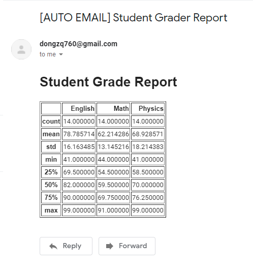

## Table of contents

{: .no_toc .text-delta }

1. TOC
{: toc }

# Introduction

This article is for solving questions like: 1) How to send bulks of email in less than a minute? 2) How to automate the process of sending email to multiple user? And doing this regularlly? So here is sample sample data and the result we will obtained at the end.

Sample Data:


Result:



In this tutorial, we are going to write a program that will read some information from Excel and print a summarized report to a designated email address.


# Preparation:

First, you need to have a Gmail account. To set up a Gmail address for testing your code, do the following:

- [Create a new Google account](https://accounts.google.com/signup).
- Turn [*Allow less secure apps* to *ON*](https://myaccount.google.com/lesssecureapps). Be aware that this makes it easier for others to gain access to your account.

If you don’t want to lower the security settings of your Gmail account, check out Google’s [documentation](https://developers.google.com/gmail/api/quickstart/python) on how to gain access credentials for your Python script, using the OAuth2 authorization framework.


# Explanation:

## Import package

```python
# Type: Data Analysis, Python
import pandas as pd
import smtplib, ssl
# 用于构造可视化的content
from email.mime.text import MIMEText
from email.header import Header
```

pandas: use for reading data from excel, with “read_excel()” method, read more about its usage and example, see [here](https://pythonbasics.org/read-excel/)

smtplib: Use Simple Mail Transfer Protocol (SMTP)  for sending email. It’s an internet standard communication protocol for electronic mail transmission. Mail servers and other message transfer agents use SMTP to send and receive mail messages.

ssl: Use to make a secure connection. As per Python’s [Security considerations](https://docs.python.org/3/library/ssl.html#ssl-security), it is highly recommended that you use `create_default_context()` from the [`ssl`](https://docs.python.org/3/library/ssl.html) module. This will load the system’s trusted CA certificates, enable host name checking and certificate validation, and try to choose reasonably secure protocol and cipher settings.

email: use for constructing emall messages


# Editing Email Info

```python
# Editing Email Info
host = "smtp.gmail.com"     # Using Gmail server to send the email
subject = "[AUTO EMAIL] Student Grader Report"
body = f"""<h1> Student Grade Report </h1> {df.describe().to_html()}"""
from_addr, to_addr = "dongzq760@gmail.com", "dongzq760@gmail.com"
```

host: For the rest of the tutorial, I’ll assume you’re using a Gmail account, but if you’re using a [local debugging server](https://realpython.com/python-send-email/#option-2-setting-up-a-local-smtp-server), just make sure to use `localhost` as your SMTP server and use port 1025 rather than port 465 or 587. Besides this, you won’t need to use `login()` or encrypt the communication using SSL/TLS.

subject: or email title

body: The Email Content. If you use want some simple plain text email, you can do something like:


# Instantiate MIMEText Wrapper


```python
# Getting Email server password or token_id
import getpass
password = getpass.getpass() 
```

It’s not safe practice to store your email password in your code, especially if you intend to share it with others. Instead, use `input()` to let the user type in their password when running the script, as in the example above. If you don’t want your password to show on your screen when you type it, you can import the [`getpass`](https://docs.python.org/3/library/getpass.html) module and use `.getpass()` instead for blind input of your password.

```python
# Instantiate MIMEText object
message = MIMEText(body, 'html', 'utf-8')
message['From'], message['To'] = from_addr, to_addr
message['Subject'] = Header(subject, "utf-8")
message = message.as_string()   # Because SMTP.sendmail, required bytes-like string. Otherwise you will see error like: Error: expected string or bytes-like object
"""
SMTP.sendmail(from_addr, to_addrs, msg, mail_options=(), rcpt_options=())
@msg: may be a string containing characters in the ASCII range, or a byte string. A string is encoded to bytes using the ascii codec, and lone `\r` and `\n` characters are converted to `\r\n` characters. A byte string is not modified. Read more in here, https://docs.python.org/3/library/smtplib.html#smtplib.SMTP.sendmail
"""
```


Note: If you don't want an MEMEText object as a wrapper, you can write those protocal body as Plain-text, but by yourself.  For example:

```python
message = f'''From: From Person <{from_addr}>
To: To Person <{to_addr}
MIME-Version: 1.0
Content-type: text/html
Subject:{subject}
{body}'''
```

## Sending Email

```python
try:
    import ssl
    context = ssl.create_default_context()
    server = smtplib.SMTP_SSL(host, 465, context=context)
    server.login(from_addr, password)
    server.sendmail(from_addr, [to_addr], message)
except Exception as e:
    print(f"Error: {e}")
finally:
    server.quit()
    print("Email Sent!")
```

**Starting a Secure SMTP Connection**

When you send emails through Python, you should make sure that your SMTP connection is encrypted, so that your message and login credentials are not easily accessed by others. SSL (Secure Sockets Layer) and TLS (Transport Layer Security) are two protocols that can be used to encrypt an SMTP connection. It’s not necessary to use either of these when using a local debugging server.

There are two ways to start a secure connection with your email server:

- Start an SMTP connection that is secured from the beginning using `SMTP_SSL()`.
- Start an unsecured SMTP connection that can then be encrypted using `.starttls()`.

In both instances, Gmail will encrypt emails using TLS, as this is the more secure successor of SSL. As per Python’s [Security considerations](https://docs.python.org/3/library/ssl.html#ssl-security), it is highly recommended that you use `create_default_context()` from the [`ssl`](https://docs.python.org/3/library/ssl.html) module. This will load the system’s trusted CA certificates, enable host name checking and certificate validation, and try to choose reasonably secure protocol and cipher settings.


# Completed Code:

```python
# Author: Zhengqi Dong
# Date: 08/17/2021
# Type: Data Analysis, Python
import pandas as pd
import smtplib  
# 用于构造可视化的content
from email.mime.text import MIMEText
from email.header import Header

# No attachements, just simple plain-text or html content
def send_simple_email(host, subject, from_addr, to_addr, body, password):
    # Instantiate MIMEText object
    message = MIMEText(body, 'html', 'utf-8')
    message['From'], message['To'] = from_addr, to_addr
    message['Subject'] = Header(subject, "utf-8")
    message = message.as_string()   # Because SMTP.sendmail, required bytes-like string. Otherwise you will see error like: Error: expected string or bytes-like object

    try:
        import ssl
        context = ssl.create_default_context()
        server = smtplib.SMTP_SSL(host, 465, context=context)
        server.login(from_addr, password)
        server.sendmail(from_addr, [to_addr], message)
    except Exception as e:
        print(f"Error: {e}")
    finally:
        server.quit()
        print("Email Sent!")


if __name__ == "__main__":
    # Reading excel content
    df = pd.read_excel("Student_Grade.xlsx")

    # Editing Email Info
    host = "smtp.gmail.com"     # Using Gmail server to send the email
    subject = "[AUTO EMAIL] Student Grader Report"
    html_body = f"""<h1> Student Grade Report </h1> {df.describe().to_html()}"""
    from_addr, to_addr = "dongzq760@gmail.com", "dongzq760@gmail.com"

    # Get Passwork from user
    import getpass
    password = getpass.getpass()

    # Sending Email
    send_simple_email(host, subject, from_addr, to_addr, html_body, password)


# Debug:
# 1） xlrd.biffh.XLRDError: Excel xlsx file; not supported ===》 Because, the latest version of xlrd (2.0.1) only supports .xls files. so try this `pip install xlrd==1.2.0`, refers to https://stackoverflow.com/questions/65254535/xlrd-biffh-xlrderror-excel-xlsx-file-not-supported
# 2) smtplib.SMTPAuthenticationError: (535, b'5.7.8 Username and Password not accepted. Learn more at\n5.7.8  https://support.google.com/mail/?p=BadCredentials j18sm735815qke.75 - gsmtp') ==> Mean wrong username or password.
# 3) smtplib.SMTPServerDisconnected: Connection unexpectedly closed ==> This means you need do something on your Gmail Setting: Turn Allow less secure apps to ON(https://myaccount.google.com/lesssecureapps). Be aware that this makes it easier for others to gain access to your account.

```


# Reference:

- [Text Tutorial] RealPython, Sending Emails With Python, [https://realpython.com/python-send-email/](https://realpython.com/python-send-email/)
- [example] Chapter 17 - The email / smtplib Module, [https://python101.pythonlibrary.org/chapter17_smtplib.html](https://python101.pythonlibrary.org/chapter17_smtplib.html)
- [python getpass method] Read more about how to use ‘getpass’ method to hide the password from terminal, [https://docs.python.org/3/library/getpass.html](https://docs.python.org/3/library/getpass.html)
- [Video tutorial] 0 Python导师-蚂蚁发布了一篇小红书笔记，快来看吧！ 😆 ijPtXC2t9ByCjP8 😆 [http://xhslink.com/QXj1Od]( http://xhslink.com/QXj1Od)
- [Python MIME Module]Creating email and MIME objects from scratch, [https://docs.python.org/3/library/email.mime.html](https://docs.python.org/3/library/email.mime.html)
- [Python SSL Module] [https://docs.python.org/3/library/ssl.html#ssl-security](https://docs.python.org/3/library/ssl.html#ssl-security)
- [Python smtplib Module], smtplib — SMTP protocol client, [https://docs.python.org/3/library/smtplib.html#smtplib.SMTPNotSupportedError]( https://docs.python.org/3/library/smtplib.html#smtplib.SMTPNotSupportedError)

