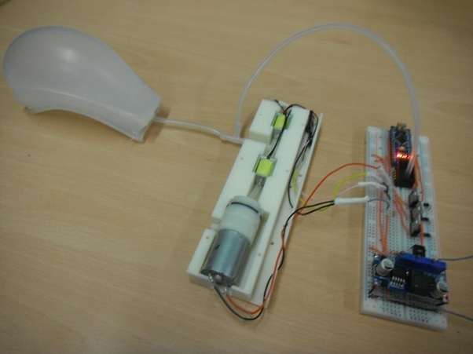
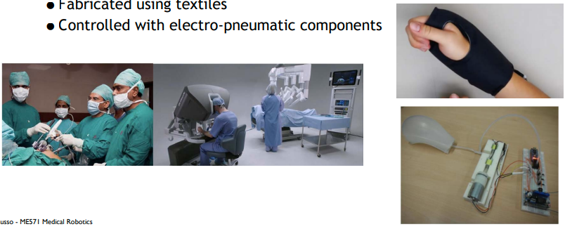
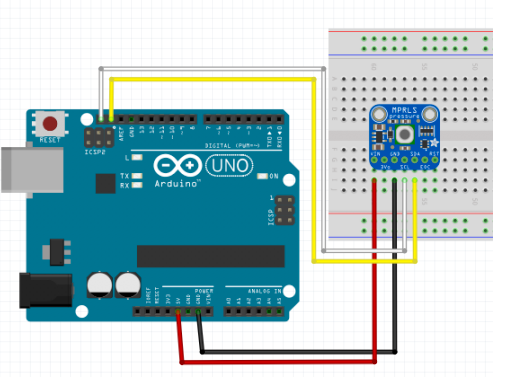
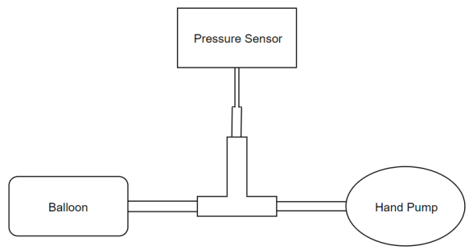

## Table of contents

{: .no_toc .text-delta }

1. TOC
{: toc }


This is a serials of lab tutorial, and the following is what we gonna built at the end of serials.



# Intro

- A soft robotic sleeve for haptic feedback during robotic-assisted surgery 
  - Fabricated using textiles

  - Controlled with electro-pneumatic components



- Material
  - Based on this [prototype](https://softroboticstoolkit.com/resources-for-educators/pneuwrist-brace) and controlled with this l[ow-cost circuit](https://softroboticstoolkit.com/low-cost-ep-circuit)

- Resource
  - Soft Robotics Toolkit, [[Website](https://softroboticstoolkit.com/)], [[Youtube Channel](https://softroboticstoolkit.com/)]


# Lab 1 Overview

- Setting up and using your I2C      pressure sensor

- Fabrication
  1. Soldering the pin headers to the board
  2. Place the sensor on the bread board
  3. Wire the sensor to the Arduino
  4. Build simple hand-pump tubing the testing the sensor
- Wiring Diagram 



- Coding

  1. Install the Adafruit MPRLS Arduino Library using the Arduino IDE library        manager.
  2. Open the example sketch:
     1. File/Examples/Adafruit MPRLS Library/ mprls_simpletest
  3. Verify and Compile onto your Arduino.
     1. Watch out for common errors such as:
        1. Do you have the correct COM port selected?
        2. Do you have the right model of Arduino selected? You are using an Arduino Uno (Processor: ATmega2560) 
        3. In the Serial Monitor, verify the BAUD rate for your COM port matches the rate indicated in the code. The example uses 115200.

  ```c
  /*!
   * @file mprls_simpletest.ino
   *
   * A basic test of the sensor with default settings. Designed specifically to work with the MPRLS sensor from Adafruit ----> https://www.adafruit.com/products/3965
   *
   * These sensors use I2C to communicate, 2 pins (SCL+SDA) are required to interface with the breakout.
   */
   
  #include <Wire.h>
  #include "Adafruit_MPRLS.h"
  
  // You dont *need* a reset and EOC pin for most uses, so we set to -1 and don't connect
  #define RESET_PIN  -1  // set to any GPIO pin # to hard-reset on begin()
  #define EOC_PIN    -1  // set to any GPIO pin to read end-of-conversion by pin
  Adafruit_MPRLS mpr = Adafruit_MPRLS(RESET_PIN, EOC_PIN);
  
  void setup() {
    Serial.begin(115200);
    Serial.println("MPRLS Simple Test");
    if (!mpr.begin()) {
      Serial.println("Failed to communicate with MPRLS sensor, check wiring?");
      while (1) {
        delay(10);
      }
    }
    Serial.println("Found MPRLS sensor");
  }
  
  
  void loop() {
    float pressure_hPa = mpr.readPressure();
    Serial.print("Pressure (hPa): "); Serial.println(pressure_hPa);
    Serial.print("Pressure (PSI): "); Serial.println(pressure_hPa / 68.947572932);
    delay(1000);
  }
  ```

  

- Hamd Pump Tubing Setup




# More Reading Material

- Project Idea:
  - Pandemic Ventilator, https://www.instructables.com/Pandemic-Ventilator/
- UIUC, Kris Hauser, Robotic Systems, [[Book](http://motion.cs.illinois.edu/RoboticSystems/)]
  - Ashitava Ghosal, https://mecheng.iisc.ac.in/~asitava/pers.html
  - Research -- Selected interesting Paper/Publication
    - Improved Laparoscopic Surgical Tool, https://mecheng.iisc.ac.in/~asitava/lap_tool_writeup.pdf, [[Drawing](https://patentscope.wipo.int/search/en/detail.jsf?docId=WO2011024200&tab=DRAWINGS)]
  - Course:
    - NPTEL Online Course, https://nptel.ac.in/noc/noc_course.html

| [NOC:Robotics: Basics    and Selected Advanced Concepts](https://nptel.ac.in/courses/112/108/112108298/) | Mechanical   Engineering | Prof.   Ashitava Ghosal | IISc   Bangalore | Video |
| ------------------------------------------------------------ | ------------------------ | ----------------------- | ---------------- | ----- |
| [Robotics: Advanced    Concepts and Analysis](https://nptel.ac.in/courses/112/108/112108093/) | Mechanical   Engineering | Prof.   Ashitava Ghosal | IISc   Bangalore | Web   |

- MOOC: NOC:Robotics: Basics      and Selected Advanced Concepts, https://nptel.ac.in/courses/112/108/112108298/
  - Youtube Video, https://www.youtube.com/watch?v=s00h55Zv3p0&list=PLgMDNELGJ1CZT9pdEEkDylXFPLdcqxn0t
  - Slides, https://nptel.ac.in/courses/112/108/112108093


Lab 1 Walkthrough Video:
<iframe width="560" height="315" src="https://www.youtube.com/embed/73X4BPZW4Ok" title="YouTube video player" frameborder="0" allow="accelerometer; autoplay; clipboard-write; encrypted-media; gyroscope; picture-in-picture" allowfullscreen></iframe>


Lab Report Demo:
<iframe width="560" height="315" src="https://www.youtube.com/embed/lezi3ZBBtRs" title="YouTube video player" frameborder="0" allow="accelerometer; autoplay; clipboard-write; encrypted-media; gyroscope; picture-in-picture" allowfullscreen></iframe>

