# Table of contents
{: .no_toc .text-delta }

1. TOC
{: toc }


# Docker Installation on Windows 10

Note: The code listed here is based on this tutorial on YouTube, [WSL with Docker installation on windows 11 | Docker Desktop WSL backend](https://www.youtube.com/watch?v=BMBwyadxokc) 

Step 1: Follow this documents, [Docker Desktop WSL 2 backend](https://docs.docker.com/desktop/windows/wsl/), get Docker Desktop Install and configured correctly:


Step 2: Open PowerShell, and make sure you have the following result:

- WSL has updated to version 2
- The default wsl is the latest Ubuntu
- Ubuntu and docker-desktop are running
  - 
- Checking docker is installed
  - 

Step 3: Verify the Ubuntu Version

- Open Linux Ubuntu Terminal, and type with the following command:


Step 4: Using Docker to run an toy app

```
docker run -d -p 80:80 docker/getting-started
# -d for detach, run container in background
# -p pushlish-list, publish a container's port(s) to the host
```


Let’s run the hello-world container

```
docker run hello-world
```

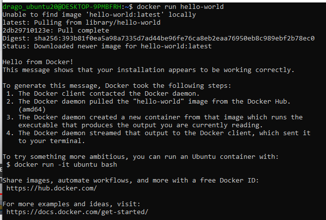


All code in one:

```bash
docker build -t getting-started .
docker run -d -p 80:80 docker/getting-started
docker run hello-world
docker run -it ubuntu bash
lsb_release -a //check docker ubuntu version
apt update 	//update package in docker ubuntu instance
apt install lsb-release 	// to install lsb-release in docker ubuntu instance
```


**Building a Django app with docker**

```bash
mkdir django-docer-demo 	// Create a folder
cd django-docer-demo		// move into directory
code .						// launch VS code
```


**Dockerfile**

create a file called Dockerfile, and add the following code

```dockerfile
FROM python:3		# define the based image
ENV PYTHONUNBUFFERED 1	# Allowing you to see the real time logging output in a buffer 
RUN mkdie /code			# Create a directory in container called /code
WORKDIR /code			# define it for working directory
ADD	requirements.txt /code/	# move add requirments.txt file to container
RUN pip install -r requirements.txt	# Install dependencies
ADD . /code/			# 
```


**Docker Compose**

Docker compose command run on docker.compose.yml file, and it allows you to execute multiple command operations at once

```yaml
version: '3'	# The latest format version

services:
	db:
		image: postgres
	web:
		build: .
		command: python3 manage.py runserver 0.0.0.0:8000
		volumes:
			- .:/code
		ports:
			- "8000:8000"
		depends_on:
			- db
            
```


Open an Ubuntu 20 terminal, and type the following command:

```bash
sudo docker-compose run web django-admin startproject composeexample . # ==> An django application called "composeexample" will be created
ls -al
su chown -R $USER:$USER .	# ==> Change the file owner to user
ls -al
```

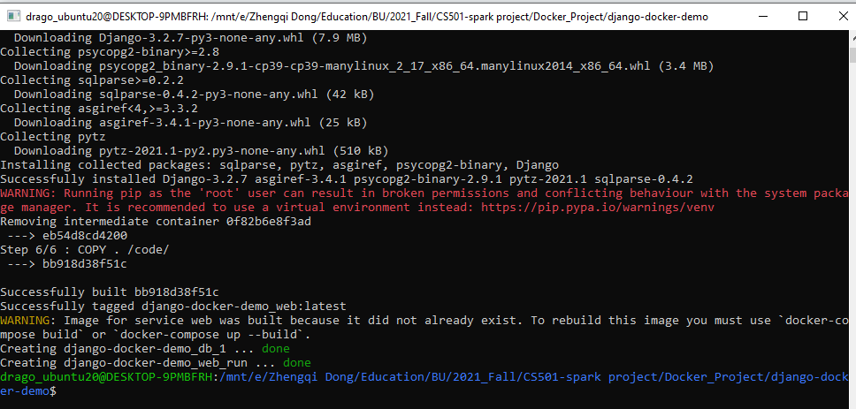

Open the settings.py file, and configure it as below:

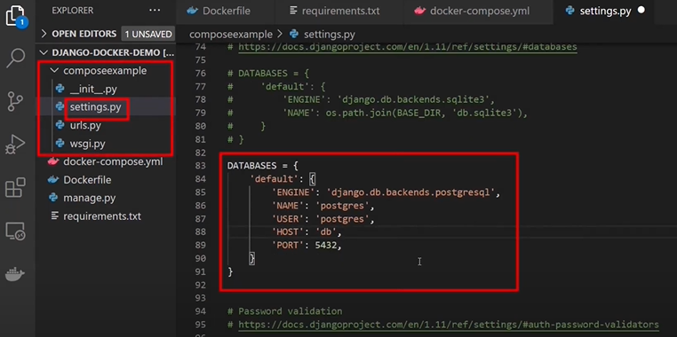


Note: Now start the django server with docker with docker compose up.

```bash
docker-compose up
```


If you got db error, e..g, “Could not translate hosname ”db” to address: Name or service not known. ==> GO to docker-compose.yml file, and configure as below:

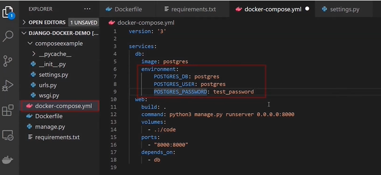

as well as the settings.py file:


Now, let’s launch the server again with `docker compose`, and you should be about to see it in `localhost:8000`


If you need to change the language, do it in settings.py as well:


How to stop the server:

```bash
docker-compose down
```


**Reference:**

- Using Docker in WSL2， https://code.visualstudio.com/blogs/2020/03/02/docker-in-wsl2
- Get started with Docker remote containers on WSL 2, https://docs.microsoft.com/en-us/windows/wsl/tutorials/wsl-containers
- [Introduction to Docker      containers](https://docs.microsoft.com/en-us/learn/modules/intro-to-docker-containers/)
- [Get started using Python for      web development on Windows](https://docs.microsoft.com/en-us/windows/python/web-frameworks#hello-world-tutorial-for-django)
- [Docker Desktop WSL 2 backend](https://docs.docker.com/desktop/windows/wsl/)


# Building Docker for node.js


Dockerfile

```dockerfile
FROM node:12.16.3
WORKDIR /code
ENV PORT 80
COPY package.json /code/package.json
RUN npm install
COPY . /code
CMD ["node", "src/server.js"]
```


With Explanation

```dockerfile
FROM node:12.16.3	# Define the latest node base image, [name]:[tag]
WORKDIR /code		# Create /code as working directory
ENV PORT 80			# The env port will be expose in for image
COPY package.json /code/package.json	# package.json define all required package
RUN npm install		# npm is node package manager, and it will install all packages
COPY . /code		# Copy all the file in current dir to /code folder in docker image
CMD ["node", "src/server.js"]	# Start running your image as container
```


Terminal command:

```bash
docker build --help
docker build -t hello-world .	# . --> use the path of current directory
docker run hello-world
docker ps 			# only display the running images
docker ps -a		# display all images
docker stop image_name	# stop running
docker rm image_name
```


# Building Docker for Flask

Dockerfile

```dockerfile
# syntax=docker/dockerfile:1
FROM python:3
ENV PYTHONUNBUFFERED=1
WORKDIR /code
COPY requirements.txt /code/
RUN pip install -r requirements.txt
COPY . /code/
```


docker-compose.yml

```yaml
version: "3.9"
   
services:
  db:
    image: postgres
    volumes:
      - ./data/db:/var/lib/postgresql/data
    environment:
      - POSTGRES_DB=postgres
      - POSTGRES_USER=postgres
      - POSTGRES_PASSWORD=postgres
  web:
    build: .
    command: python manage.py runserver 0.0.0.0:8000
    volumes:
      - .:/code
    ports:
      - "8000:8000"
    depends_on:
      - db
```


settings.py

```python
DATABASES = {
    'default': {
        'ENGINE': 'django.db.backends.postgresql',
        'NAME': 'postgres',
        'USER': 'postgres',
        'PASSWORD': 'postgres',
        'HOST': 'db',
        'PORT': 5432,
    }
}

```


# How to Create Django Docker Images

**January 22, 2021**

[Docker](https://docs.docker.com/) is a containerization platform that makes it possible to build, ship, and run distributed applications in controlled environments with defined rules.

### Prerequisites

1. Have [Python 3.6](https://www.python.org/downloads/) or newer installed on your computer.
2. Get Python package manager, [pip](https://pypi.org/project/pip/) installed on your computer.
3. You will need [Docker](https://docs.docker.com/docker-for-windows/install/) installed on your computer.

For Docker installation, setup, and a quick start, visit [Getting started with Docker](https://www.section.io/getting-started-with-docker/).

### Project setup

We will be creating a Docker image for the Todo application that we created in [this](https://www.section.io/django-crud-api/) tutorial. The `Todo` application that allows us to `create`, `read`, `update`, and `delete` Todo items via a REST API.

Ensure `virtualenv` is installed on your computer by executing the command below.

```bash
$ virtualenv --version
virtualenv 20.2.2 from /home/username/.local/lib/python3.8/site-packages/virtualenv/__init__.py
```

If you get an error executing the command above, run the command below to install `virtualenv` on your computer.

```bash
$ pip install virtualenv
```

Create a working directory for the project by executing the command below.

```bash
$ mkdir todo
$ cd todo
```

Create a virtual environment for our project using the `virtualenv` module that we just installed. Execute the command below to create and activate the virtual environment.

```bash
$ virtualenv venv
$ source venv/bin/activate
```

In the working directory, clone the project from Github to your computer using the command below.

```bash
$ git clone https://github.com/paulodhiambo/django_todo.git
```

Move into the project directory by executing the command below.

```bash
$ cd django_todo
```

Execute the command below to install all the required dependencies for the project to run.

```bash
$ pip install -r requirements.txt
```

Run the application to verify that nothing is broken and the application runs without errors.

```bash
$ ./manage.py runserver
```

Below is the project structure.

```bash
└── django_todo         # < project root package
    ├── todo             # < todo app
    │   ├── admin.py
    │   ├── apps.py
    │   ├── migrations
    │   ├── models.py
    │   ├── serializers.py
    │   ├── urls.py
    │   └── views.py
    ├── manage.py  
    ├── requirements.txt    # < Django dependencies list
    └── django_todo    
        ├── settings.py # Django settings file
        ├── urls.py
        └── wsgi.py
```

### Creating a Dockerfile

A Dockerfile is a text file that contains instructions on how the Docker image will be built. A Dockerfile contains the directives below.

- **FROM**: directive sets the base image from which the Docker container will be built.
- **WORKDIR**: directive sets the working directory in the image created.
- **RUN**: directive executes commands in the container.
- **COPY**: directive copies files from the file system into the container.
- **CMD**: directive sets the executable commands within the container.

In the root project directory, create a file with the name `Dockerfile` with no file extension. In the `Dockerfile` created above, add the code below.

```Docker
# pull the official base image
FROM python:3.8.3-alpine

# set work directory
WORKDIR /usr/src/app

# set environment variables
ENV PYTHONDONTWRITEBYTECODE 1
ENV PYTHONUNBUFFERED 1

# install dependencies
RUN pip install --upgrade pip 
COPY ./requirements.txt /usr/src/app
RUN pip install -r requirements.txt

# copy project
COPY . /usr/src/app

EXPOSE 8000

CMD ["python", "manage.py", "runserver", "0.0.0.0:8000"]
```

- `FROM python:3.8.3-alpine` sets the base image from which the Docker container will be created.
- `WORKDIR /usr/src/app` sets the working directory inside the container to `/usr/src/app`.
- `ENV PYTHONDONTWRITEBYTECODE 1` prevents Python from copying pyc files to the container.
- `ENV PYTHONUNBUFFERED 1` ensures that Python output is logged to the terminal, making it possible to monitor Django logs in realtime.
- `RUN pip install --upgrade pip `installs and upgrades the pip version that is in the container.
- `COPY ./requirements.txt /usr/src/app` copies the `requirements.txt` file into the work directory in the container.
- `RUN pip install -r requirements.txt` installs all the required modules for the `django_todo` application to run in the container.
- `COPY . /usr/src/app` copies all the project source code to the working directory in the container.
- `EXPOSE 8000` exposes port 8000 for access from other applications.
- `CMD ["python", "manage.py", "runserver", "0.0.0.0:8000"]` sets the executable commands in the container.

### Building the Docker image

To build the Docker image from the Dockerfile we created above, execute the command below.

```bash
$ docker build --tag django_todo:latest .
```

- `--tag` sets the tag for the image. For example, we are creating a Docker image from `python:3.8.3` that has the tag `alpine`. In our Docker image, `latest` is the tag set.
- The trailing `.` indicates that the `Dockerfile` is within the current working directory.

To list all the available images on your computer, execute the command below.

```bash
$ docker image ls
REPOSITORY    TAG            IMAGE ID       CREATED         SIZE
django_todo   latest         6e06c89267f1   3 hours ago     147MB
todo          latest         b10c177c6d58   4 hours ago     162MB
<none>        <none>         2f418d359923   4 hours ago     162MB
centos        latest         300e315adb2f   3 weeks ago     209MB
python        3.8.3-alpine   8ecf5a48c789   6 months ago    78.9MB
hello-world   latest         bf756fb1ae65   12 months ago   13.3kB
```

From the above list, we see the `django_todo` image that we have created.

### Creating and running the Docker Container

To build and run a Docker container from the Docker image we created above, run the command below.

```bash
$ docker run --name django_todo -d -p 8000:8000 django_todo:latest
```

- `--name` sets the name of the Docker container.
- `-d` makes the image run in detached mode. The image is capable of running in the background.
- `-p 8000:8000` maps port 8000 in the Docker container to port 8000 in localhost.
- `django_todo: latest` specifies which image is used to build the Docker container.

To list all the running Docker containers, execute the command below.

```bash
$ docker container ps
CONTAINER ID   IMAGE                COMMAND                  CREATED       STATUS       PORTS                    NAMES
d73306a9fb04   django_todo:latest   "python manage.py ru…"   3 hours ago   Up 3 hours   0.0.0.0:8000->8000/tcp   django_todo
```

1. On your browser visit `localhost` on port 8000 to confirm if the `django_todo` application is running in the container. 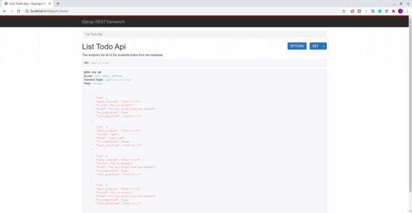

### Publishing the Docker image to Docker Hub

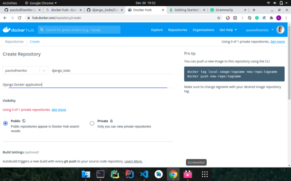

Docker Hub is a repository of container images that can be used to create Docker containers.

Visit [Docker Hub](https://hub.docker.com/) and create an account if you don’t have one.

Once you have created an account and logged in to Docker Hub, create a repository with the name `django_todo` and the description `Django Docker Image`.

Now that we have created a repository in Docker Hub, to push the Docker image to the repository we have created we execute the command below.

```bash
$ docker login

$ docker tag django_todo:latest <Docker Hub username>/django_todo:latest

$ docker push <Docker Hub username>/django_todo:latest
```

- `docker login` command logs you into your Docker Hub account on the command line, making it possible to push Docker images to Docker Hub.
- `docker tag django_todo: latest <Docker Hub username>/django_todo: latest` command modifies the tag of our local Docker image to include the Docker Hub username.
- `docker push <Docker Hub username>/django_todo: latest` pushes the image to Docker Hub repository we created earlier.

**Note:** Replace `<Docker Hub username>` with your actual Docker Hub username.

The full source code for the application is in [this](https://github.com/paulodhiambo/django_todo/tree/token_auth) GitHub repository.

### Conclusion

Docker is a great tool for packaging applications with the required dependencies to run them both locally and in production. [Docker playground](https://labs.play-with-docker.com/) is an online playground that you can use to test various Docker commands without installing Docker locally on your computer.

Happy Coding!


### Q&A

```
docker run -it --rm -v ${PWD}:/code -v /code/node_modules -p 8000:8000 front-end:dev
```

### Reference

1. [Section: How to Create Django Docker Images](https://www.section.io/engineering-education/django-docker/)
2. Semaphore:[Dockerizing a Python Django Web Application:](https://semaphoreci.com/community/tutorials/dockerizing-a-python-django-web-application) 


# Docker file Overview

- **FROM**: directive sets the base image from which the Docker container will be built.
- **WORKDIR**: directive sets the working directory in the image created.
- **RUN**: directive executes commands in the container.

  - `RUN` is a command that allows you to do any bash shell command you'd do normally. In our case, we just do some basic system updates and basic installs.
- **EXPOSE**

  - `EXPOSE` allows your docker image to have a `port` or posts exposed to outside the image. This is important for web applications and software you want to receive requests.
- **COPY**: directive copies files from the file system into the container.
  - `COPY`:  copy is another command we haven't yet added to our `Dockerfile`. This will allow you to copy local files to your Docker image.
- **CMD**: directive sets the executable commands within the container.

  - `CMD` this is the final command your docker image will run. It's typically reserved for something like running a web application.


### **Example for Django**

```bash
# Create a virtual env with pipenv
mkdir simple_dj_docker
cd simple_dj_docker
sudo pip install pipenv
# python -m pip install pipenv
pipenv install django==3.1.1 gunicorn --python 3.8
# To activate this project's virtualenv, run pipenv shell.
pipenv shell
# Check the packages are installed
pip freeze
# Alternative you can use virtualenv
# virtualenv simpleenv
# source simpleenv/bin/activate
# OR more traditional way
# python -m venv venv
# echo venv/ >> .gitignore
# source venv/bin/activate

# Create Django Project
django-admin startproject cfehome .
# Run migration and create superuser
python manage.py makemigrations
python manage.py migrate
python manage.py createsuperuser
# To run the test case:
# python manage.py test

# Update Django settings.py
# DEBUG can be True/False or 1/0
DEBUG = int(os.environ.get('DEBUG', default=1))

# Create a `.env` file, and append 'DEBUG=1'
echo 'DEBUG=1' >> .env

# Test Gunicorn
gunicorn app_namge.wsgi:application
# Or you want to make it avaialble to the public as well
gunicorn app_namge.wsgi:application --bind 0.0.0.0:8000

# Create your Dockerfile
touch Dockerfile
```

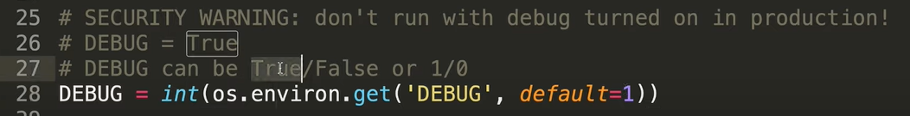


Dockerfile

```dockerfile
# syntax=docker/dockerfile:1
# pull the official base image (This is the defacto image. If you are unsure about what your needs are, you probably want to use this one. )
FROM python:3.8
# python:<version>-slim ==> This image does not contain the common packages contained in the default tag and only contains the minimal packages needed to run python. 
# python:<version>-alpine ==> This image is based on the popular Alpine Linux project, available in the alpine official image. Alpine Linux is much smaller than most distribution base images (~5MB), and thus leads to much slimmer images in general.

# set environment variables
ENV PYTHONDONTWRITEBYTECODE 1
ENV PYTHONUNBUFFERED 1
ENV DEBUG=0

# install dependencies
WORKDIR /app

# Install Customized system dependencies
# install psycopg2 dependencies
# RUN apk update
# RUN apk add postgresql-dev musl-dev 
# RUN apt-get install -qy python3-dev postgresql-dev build-essential
# RUN pip install pyzmq
RUN apt-get update && apt-get install -y --no-install-recommends \
        python3-setuptools \
        python3-pip \
        python3-dev \
        python3-venv \
        git \
        && \
    apt-get clean && \
    rm -rf /var/lib/apt/lists/*

# copy requirements.txt to /app/requirements.txt
COPY requirements.txt requirements.txt
RUN pip3 install --upgrade pip 
# Install project dependencies to entire system with pipenv
# RUN pip3 install pipenv
# RUN pipenv install -r requirements.txt
# RUN pipenv shell
# RUN pipenv install django==3.1.1 gunicorn --python 3.8
# RUN pipenv install --skip-lock --system --dev
RUN pip3 install -r requirements.txt
# python -m venv venv
# echo venv/ >> .gitignore
# source venv/bin/activate
# RUN pip3 freeze

# copies all the project source code to the working directory in the container.
COPY . .

# Make 5000 as the default port to be exposed(so we can access the container from localhost, or even anywhere at internet)
EXPOSE 5000
ENV PORT 5000

# FOR Node.js use
# ENV PORT 80
# EXPOSE 80
# COPY package.json /code/package.json
# RUN npm install

# sets the executable commands in the container.
CMD ["python3", "chatbot/manage.py", "runserver", "0.0.0.0:5000"]
# CMD gunicorn app_name.wsgi:application --bind 0.0.0.0:5000
# CMD ["npm", "start"]
# CMD ["python3", "-m", "flask", "run", "--host=0.0.0.0"]

# Build a image and Run a container
# docker build -t hello_world_app .
# docker run -it -p 5000:5000 hello_world_app 
# 8888 is default for Jupyter Notebook
# 5000 is default for Nodejs

## Extra command
# lsb_release -a
# wsl -l -v

# Publishing the Docker image to Docker Hub
# docker login
# docker tag django_todo:latest <Docker Hub username>/django_todo:latest
# docker push <Docker Hub username>/django_todo:latest

# Reference:
# Section: https://www.section.io/engineering-education/django-docker/
# Semaphore Dockerizing a Python Django Web Application: https://semaphoreci.com/community/tutorials/dockerizing-a-python-django-web-application
# Basic Usage of Pipenv: https://pipenv-fork.readthedocs.io/en/latest/basics.html
# Django on Docker Tutorial - A Simple Introduction, https://www.youtube.com/watch?v=KaSJMDo-aPs
```


### Example of Prisma Backend deployment with Docker

Here is an example of docker file that I used for CS501 project backend:

Dockerfile

```dockerfile
FROM node:16.8.0
WORKDIR /code

COPY . .

# add `/app/node_modules/.bin` to $PATH
ENV PATH ./node_modules/.bin:$PATH
# ENV PATH="./node_modules/.bin:$PATH"

ENV PORT 5000
EXPOSE 5000

# install app dependencies
COPY package.json package.json
COPY package-lock.json package-lock.json
# RUN apt-get update    # ==> not a good idea to run in container
# RUN apt-get install libssl1.1 libssl-dev  # ==> Those package doesn't exist in 16.8.0-slim. Slim version took out the openssl-y package to compress the size to make it smaller, but out backend required it to build container successfully
# RUN apt-get install openssl-y   

RUN npm ci --production
RUN npm install

# RUN npm run build

# start app
CMD ["bash", "./launch.sh"]

# docker build -t sample:dev .
# docker run -it -p 3000:3000 simple-react-app
# $ docker run -it --rm -v ${PWD}:/app -v /app/node_modules -p 3001:3000 -e CHOKIDAR_USEPOLLING=true sample:dev


# Reference:
# Dockerizing a React App, https://mherman.org/blog/dockerizing-a-react-app/
# Heroku + Docker with Secure React in 10 Minutes, https://developer.okta.com/blog/2020/06/24/heroku-docker-react
```


You need a launch.sh file because there is some database setup we need to go through before running the backend aplication.

launch.sh

```bash
#!/bin/bash

npx prisma migrate dev --name init
npx prisma generate
# RUN npx prisma introspect
npx ts-node ./src/scripts.ts

npm start
```


docker-compose.yml

```dockerfile
version: '3'

services:
  backend:
    container_name: backend-dev
    image: prismagraphql/prisma:1.34
    build: ./backend
      # When the value supplied is a relative path, it is interpreted as relative to the location of the Compose file. This directory is also the build context that is sent to the Docker daemon.
      # context: ./backend
      # dockerfile: ./Dockerfiles
    ports:
      - '5000:5000'
    depends_on: 
      - postgres
    # env_file:
    #   - ./backend/.env
    # [named vol­umes](https://docs.docker.com/compose/compose-file/#volumes) that are mount­ed and can be shared amongst your Dock­er con­tain­ers (but not your host com­put­er), for stor­ing per­sis­tent data
    # volumes:
    #   - .:/code
    environment:
      PRISMA_CONFIG: |
        port: 5000
        managementApiSecret: 6LeX8LMcAAAAANzYvwbZl34R0wh4LfB027rpMFJh
        databases:
          default:
            connector: postgresql
            host: localhost
            port: 5432
            user: postgres
            password: postgresql
    # allows processes to ter­mi­nate quick­ly when you halt them with Control-C
    init: true
    restart: always
  postgres:
    image: postgres:13
    container_name: postgres
    restart: 'always'
    expose: 
      - '5432'
    ports:
      - 5432:5432  
    # env_file:
    #   - .env
    environment:
      - POSTGRES_DB=test  # Database name
      - POSTGRES_HOST_AUTH_METHOD=trust # Trust anyone connect to database, so no authentication as password, easy the development
      - POSTGRES_USER=postgres
      - POSTGRES_PASSWORD=postgresql
    volumes:  # volumes help us persist the data between the restart and container, so when we restart the container, the data will be kept in db/data and specified path
      - postgres:/var/lib/postgresql/data
    
  # frontend:
  #   image: node:16.8.0-slim
  #   build:
  #     context: ./frontend
  #     dockerfile: ./Dockerfile
  #   ports:
  #     - '8000:8000'
  #   env_file:
  #     - ./frontend/.env.development
  #   volumes:
  #     - ./frontend:/opt/frontend
  #   restart: always
  #   init: true
  # postgres-db:
  #   image: postgres:10.3
  #   restart: always
  #   environment:
  #     POSTGRES_USER: "postgres"
  #     POSTGRES_PASSWORD: "postgres"
  #   volumes:
  #     - postgres:/var/lib/postgresql/data
  #   init: true
volumes:
  postgres: ~

# Reference: 1) Run postgres database in docker container, https://egghead.io/lessons/egghead-run-postgres-database-in-docker-container
```


Error 1:

The backend cannot connect to your database. (Note: listening on IPv3 address ‘0.0.0.0’ means the database is open to all in-bound request, can receive request anywhere in the internet. ) The problem here is the configuration of your backend application is not set up correctly, so it cannot find the correct address of database to communicate with.


Solution to that is configure your `DATABASE_URL` at your Prisma backend application, to match the configuration that you defined for the database, as an example shown below:

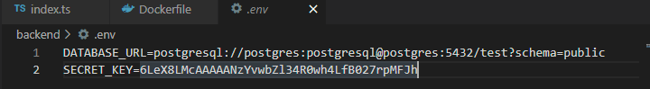


### Reference:

1) https://www.section.io/engineering-education/django-docker/
2) Dockerizing a React App, https://mherman.org/blog/dockerizing-a-react-app/
3) FROM python:version meaning, https://hub.docker.com/_/python
4) Awesome Docker, https://github.com/veggiemonk/awesome-docker
5) Run postgres database in docker container, https://egghead.io/lessons/egghead-run-postgres-database-in-docker-container


# Building Docker container for Python App


## Build Images

**Simple Application**

Let’s create a simple Python application using the Flask framework that we’ll use as our example. Create a directory in your local machine named `python-docker` and follow the steps below to create a simple web server.

```cmd
 cd /path/to/python-docker
 pip3 install Flask
 pip3 freeze > requirements.txt
 touch app.py
```


Now, let’s add some code to handle simple web requests. Open this working directory in your favorite IDE and enter the following code into the `app.py` file.

```python
from flask import Flask
app = Flask(__name__)

@app.route('/')
def hello_world():
    return 'Hello, Docker!'
```

Let’s start our application and make sure it’s running properly. Open your terminal and navigate to the working directory you created.

```python
$ python3 -m flask run
```


**Create a Dockerfile**

The default filename to use for a Dockerfile is `Dockerfile` (without a file- extension). Using the default name allows you to run the `docker build` command without having to specify additional command flags.

```dockerfile
# syntax=docker/dockerfile:1    # Optional, but it instructs the Docker builder what docker syntax to use, here points to the latest release of version 1
# Define the base image we would like to use for our application. 
FROM python:3.8-slim-buster
# Instructs Docker to use this path as the default working direction for all subsequent command.
WORKDIR /app 
# Copy requirement file into new image ($ COPY src_dir target_dir). Here we copy it into /app/requirements.txt, but since we already define the working direction, so no need to specify again
COPY requirements.txt requirements.txt
# use the RUN command to execute the command pip3 install
RUN pip3 install -r requirements.txt
# Add our source code into the image: this takes all the files located in the current directory and copies them into the WORKDIR of docker image
COPY . .
# Expose the host's port 5000 for the application running in container, so the application can map its port to host port, so you can use "localhost:5000" to check the app.
# Alternatively, you can use publish command, with syntax "--publish [host port]:[container port]". For example, this command, "$ docker run --publish 5000:5000 python-docker", will expose port 5000 inside the container to port 3000 outside the container,
EXPOSE 5000
# Use CMD to run the command that required to be executed inside a container. 
# --host=0.0.0.0 ==> This make application externally visible from everythere in the Internet
CMD ["python3", "-m", "flask", "run", "--host=0.0.0.0"]
```

More about Dockerfile:

- Dockerfile Reference, https://docs.docker.com/engine/reference/builder/#syntax
- [Best practices for writing Dockerfiles](https://docs.docker.com/develop/develop-images/dockerfile_best-practices/#expose)


**Build an image based on Dockerfile defined previously:** 

After this point, you can close this file, and start to build the docker image.

```
$ docker build --tag python-docker . 
```

- `docker build` command builds Docker images from a Dockerfile and a “context”. A build’s context is the set of files located in the specified PATH or URL. The Docker build process can access any of the files located in this context.

- `--tag python-docker`: The build command optionally takes a --tag flag.  The tag is used to set the name of the image and an optional tag in the format `name:tag`. We’ll leave off the optional `tag` for now to help simplify things. If you do not pass a tag, Docker uses “latest” as its default tag.
- ` .`: This 


**Container Tag [Optional]**

- Alias/Tags/Names

Just like Linux alias, an image can have multiple tag as well (It’s like a extra pointer/name for same image).

To create a alias tag, use the following command:

To create a new tag for the image we’ve built above, run the following command.

```bash
$ docker tag python-docker:latest python-docker:v1.0.0
# The docker tag command creates a new tag for an image. It does not create a new image. The tag points to the same image and is just another way to reference the image.
# Run the docker images command to see a list of our local images.
```

- `docker rmi [image_name]`:  Use to remove image.

For example:

```
# This will remove the image, or an alias tag if it has one
$ docker rmi python-docker:v1.0.0
Untagged: python-docker:v1.0.0
```


**How to view local images:**

Two way to do this: 1) CLI with command `docker images`; 2) Use Docker Desktop


**How to run your image as a container?**

```$ docker run python-app```


## Run your image as a container

### Overview

A container is a normal operating system process except that this process is isolated in that it has its own file system, its own networking, and its own isolated process tree separate from the host.

To run an image inside of a container, we use the `docker run` command. The `docker run` command requires one parameter which is the name of the image. Let’s start our image and make sure it is running correctly. Run the following command in your terminal.

```
$ docker run python-docker
```


You can try to open a new terminal, and use curl command to make a GET requests:

```cmd
$ curl localhost:5000
```


```
# display all runing container on our machine
$ docker ps
CONTAINER ID   IMAGE               COMMAND                  CREATED      STATUS      PORTS
 NAMES
20b974b48881   docker101tutorial   "/docker-entrypoint.…"   2 days ago   Up 2 days   0.0.0.0:80->80/tcp, :::80->80/tcp   docker-tutorial

# Stop a running container
$ docker stop wonderful_kalam

# Display all container (both running and stop)
$ docker ps -a

# Restart a containers
$ docker restart wonderful_kalam

# Remove one container
$ docker rm wonderful_kalam

# Remove three containers at a time
$ docker rm wonderful_kalam agitated_moser goofy_khayyam

# Name a running container: Optional, but it is easier to identify what is running in the container and what application or service it is associated with.
$ docker run -d -p 5000:5000 --name rest-server python-docker
```


## Use containers for Development

### Overview

**Introduction**

In this module, we’ll walk through setting up a local development environment for the application we built in the previous modules. We’ll use Docker to build our images and Docker Compose to make everything a whole lot easier.

**Run a database in a container**

First, we’ll take a look at running a database in a container and how we use volumes and networking to persist our data and allow our application to talk with the database. Then we’ll pull everything together into a Compose file which allows us to setup and run a local development environment with one command. Finally, we’ll take a look at connecting a debugger to our application running inside a container.

Instead of downloading MySQL, installing, configuring, and then running the MySQL database as a service, we can use the Docker Official Image for MySQL and run it in a container.

Before we run MySQL in a container, we’ll create a couple of volumes that Docker can manage to store our persistent data and configuration. Let’s use the managed volumes feature that Docker provides instead of using bind mounts. You can read all about [Using volumes](https://docs.docker.com/storage/volumes/) in our documentation.

Let’s create our volumes now. We’ll create one for the data and one for configuration of MySQL.

Let’s create our volumes now. We’ll create one for the data and one for configuration of MySQL.

```python
$ docker volume create mysql
$ docker volume create mysql_config
```

– Read more here, https://docs.docker.com/language/python/develop/


## Configure CI/CD


Figure2: DevOps Tools Ecosystem:

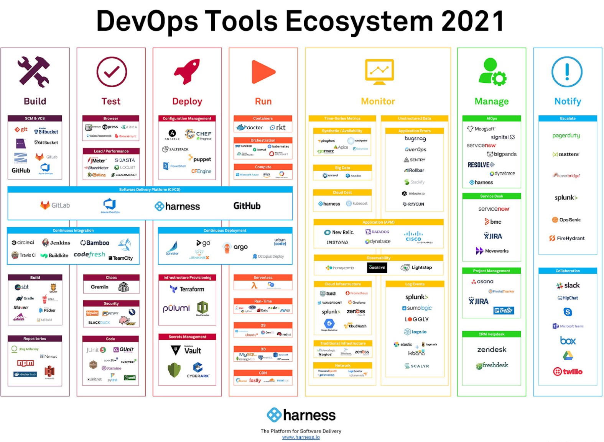

Figure1: CI/CD Tool chain, https://www.suntechnologies.com/wp-content/uploads/2021/02/tools.png

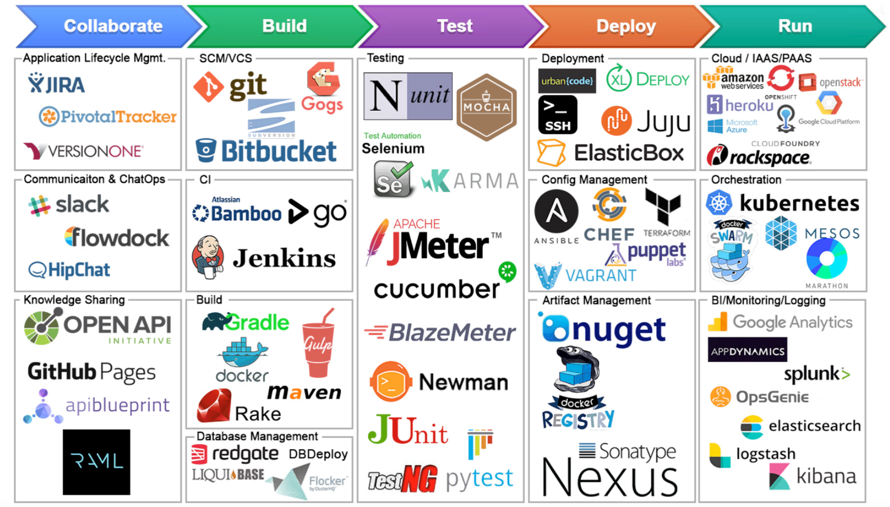


### Overview

This page guides you through the process of setting up a GitHub Action CI/CD pipeline with Docker containers. Before setting up a new pipeline, we recommend that you take a look at [Ben’s blog](https://www.docker.com/blog/best-practices-for-using-docker-hub-for-ci-cd/) on CI/CD best practices .

This guide contains instructions on how to:

1. Use a sample Docker project as an example to configure GitHub Actions
2. Set up the GitHub Actions workflow
3. Optimize your workflow to reduce the number of pull requests and the total build time, and finally,
4. Push only specific versions to Docker Hub.

– Read more here, https://docs.docker.com/language/python/configure-ci-cd/


Reference:

- Best 14 CI/CD Tools You Must Know | Updated for 2021, https://www.katalon.com/resources-center/blog/ci-cd-tools/
- Best practices for using Docker Hub for CI/CD, https://www.docker.com/blog/best-practices-for-using-docker-hub-for-ci-cd/
- 

## Deploy your app

### Overview

Now, that we have configured a CI/CD pipleline, let’s look at how we can deploy the application. Docker supports deploying containers on Azure ACI and AWS ECS. You can also deploy your application to Kubernetes if you have enabled Kubernetes in Docker Desktop.


– Read more here, https://docs.docker.com/language/python/deploy/


## Troubleshoot:

Problem Definition

```
curl localhost:5000
curl: (7) Failed to connect to localhost port 5000: Connection refused
```

As you can see, our `curl` command failed because the connection to our server was refused. This means, we were not able to connect to the localhost on port 5000. This is expected because our container is running in isolation which includes networking. Let’s stop the container and restart with port 5000 published on our local network.

Solution: 1) Add `EXPOSE 5000` to Dockerfile; 2) try command `$ docker run --publish 5000:5000 python-docker`

```
# Expose the host's port 5000 for the application running in container, so the application can map its port to host port, so you can use "localhost:5000" to check the app.
# Alternatively, you can use publish command, with syntax "--publish [host port]:[container port]". For example, this command, "$ docker run --publish 5000:5000 python-docker", will expose port 5000 inside the container to port 3000 outside the container,
EXPOSE 5000
```


## **Common Docker commands**

| Command                                                      | Explanation                                                  |
| ------------------------------------------------------------ | ------------------------------------------------------------ |
| docker --help                                                | show all helping command and info                            |
| docker container logs [container_name]                       | show all building logs for container  [container_name]       |
| docker built -t [tag_name]                                   | Build an image with tagname                                  |
| `docker build -t <your-tag> -f Dockerfile .`                 | Build an image with `-t` tagname, and `-f` the dockerfile used to build image, in `.` current directory. |
|                                                              | `-t` portion means "tag" and you can add your *own tag name* I used `hello-world` since this might be your first time using Docker. When in doubt, include a tag. |
|                                                              | `-f` is the path to the `Dockerfile` you're going to use to build your image. |
| `docker run -it <your-tag>`                                  | This creates a "container" from your tagged image. In other words, a **container is an instance of an image**. |
|                                                              | `-i`: interactive mode                                       |
|                                                              | `-t` Tag name is ?                                           |
| docker run -it -p 8888:8888 hello_world                      | run a image with interactive mode, and port forward container port 8888 to localhost port 8888, e.g., [localhost_port]:[container_port] |
| docker run -d hello_world                                    | run a image in background, so you need to type `docker ps -a` in order to see it |
| docker images                                                | show all the docker images available in local machine        |
| docker ps                                                    | list all the process running in your docker – 列出所有当前正在运行的容器 |
| docker ps -a                                                 | show all the containers being executed or ran – 列出所有之前运行过的容器。 |
| docker stop [container_id]                                   | stop running                                                 |
| docker rm  **[container_id … ]**                             | Remove one or more **containers ** (stop it, before remove – container only not image, and 可以一次性删除多个 |
| docker rm $(docker ps -a -q -f status=exited)                | deletes all containers that have a status of `exited`. In case you're wondering, the `-q` flag, only returns the numeric IDs and `-f` filters output based on conditions provided. |
| `docker image rm [tag_name]  --force `                       | Remove container  with all alias tag                         |
| docker image tag react-docker <your-username>/react-docker:1.0 | Provide an new tagname called `<your-username>/react-docker` with 1.0 version, for container  `react-docker` |
| `docker rmi [image_id]`                                      | remove the **docker images**                                 |
| `docker rm $(docker ps -a -q) + docker rmi $(docker images -q)` | Pro tip, to remove all of these images just run `docker rm $(docker ps -a -q)` then `docker rmi $(docker images -q)` |
| docker create                                                | create your own container                                    |
| docker pull                                                  | get from docker hub                                          |
| docker push                                                  | push to docker hub                                           |
|                                                              |                                                              |
|                                                              |                                                              |
|                                                              |                                                              |
|                                                              |                                                              |
|                                                              |                                                              |

`docker image rm d2d0a95aa16ce0711013e07666301b34c2f1f144c9d7061487edaf87f1acbfac  --force `

Open specific running container’s in a bash shell

docker ps

docker exec -it 3e7 /bin/bash


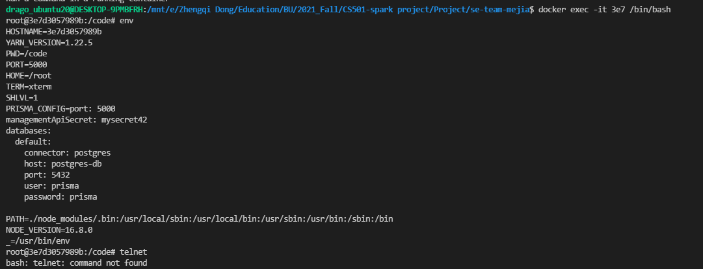


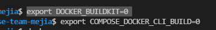

$ ps -Af | grep -i docker ==> show docker process in linux

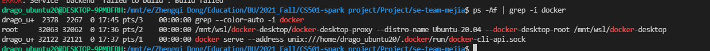

Other Good Resources:

- Docker Cheat Sheet, https://github.com/wsargent/docker-cheat-sheet

- Integration with WSL2
  - Docker Desktop WSL 2 backend


### [Container Management Commands](https://github.com/MrinmoiHossain/Docker-Essential)

**Status**

- show a list of running containers : `$ docker ps` or `$ docker container ls`
- show a list of all containers : `$ docker ps -a` or `$ docker ps --all` or `$ docker container ls -a`

**Create**

- create a new container from an image : `$ docker create IMAGE`

**Start**

- start a container after create : `$ docker start -a ID`
- start a stopped container : `$ docker start ContainerID` or `$ docker start ContainerName`

**Run**

- start a new container from an image : `$ docker run Image`
- start a new container from an image and change default commands : `$ docker run Image Commands`
- start a new container from an image and assign it a name : `$ docker run --name Name Image`
- start a new container from an image and run in the background : `$ docker run -d Image`
- start a new container from an image and map all ports : `$ docker run -p HostPort:DockerPort Image`
- start a new container from an image and removes a container after it exits : `$ docker run --rm Image`

**Pause / Unpause / Wait**

- suspends all processes in the specified containers : `$ docker pause ContainerID` or `$ docker pause ContainerName`
- un-suspends all processes in the specified containers : `$ docker unpause ContainerID` or `$ docker unpause ContainerName`
- block until one or more containers stop and then print their exit codes : `$ docker wait ContainerID` or `$ docker wait ContainerName`

**Stop** / Kill

- stop a running container : `$ docker stop ContainerID` or `$ docker stop ContainerName`
- kill a running container : `$ docker kill ContainerID` or `$ docker stop ContainerName`

**Restart**

- restart a container : `$ docker restart ContainerID` or `docker start ContainerName`

**Delete**

- delete a container : `$ docker rm ContainerID` or `docker rm ContainerName`
- delete a running container : `$ docker rm -f ContainerID` or `docker rm -f ContainerName`
- delete stopped containers : `$ docker container prune`

**Rename**

- rename a container : `$ docker rename ContainerName NewContainerName`

**Update**

- update the configuration of one or more containers : `$ docker update ContainerName`

**Attach**

- attach local standard input, output, and error streams to a running container : `$ docker attach ContainerID` or `$ docker attach ContainerName`

**Information**

- show the container output (stdout & stderror) : `$ docker logs ContainerID` or `$ docker logs ContainerName`
- show low level information on the container : `$ docker inspect ContainerID` or `$ docker inspect ContainerName`
- list the process running inside the container : `$ docker top ContainerID` or `$ docker top ContainerName`
- to get real-time events from the server : `$ docker events`
- list port mappings or a specific mapping for the container : `$ docker port ContainerID` or `$ docker port ContainerName`
- display a live stream of container(s) resource usage statistics : `$ docker stats`
- inspect changes to files or directories on a container’s filesystem : `$ docker diff ContainerID` or `$ docker diff ContainerName`


# Docker Compose


## Dockmer-compose Command


## Basic Understanding


## CS501 Prisma Project Specific:


Reference:

- Run postgres database in docker container, https://egghead.io/lessons/egghead-run-postgres-database-in-docker-container
- Dockerizing a NestJS app with Prisma and PostgreSQL, https://notiz.dev/blog/dockerizing-nestjs-with-prisma-and-postgresql

- Docker official documents:
  - dockersamples/example-voting-app, https://github.com/dockersamples/example-voting-app/tree/master/vote
  - Overview of docker-compose CLI, https://docs.docker.com/compose/reference/

### Common workflows

The [Docker CLI](https://docs.docker.com/engine/reference/commandline/cli) and [Docker Compose CLI](https://docs.docker.com/compose/reference/) are used to manage the Prisma servers.

Here's a quick rundown of the most important commands:

- docker-compose build: build or rebuild the container
- [`docker-compose up -d`](https://docs.docker.com/compose/reference/up/): Start a new Prisma server to which you can deploy your Prisma services.
- [`docker-compose stop`](https://docs.docker.com/compose/reference/stop/): Stops the Prisma server.
- [`docker-compose pull`](https://docs.docker.com/compose/reference/pull/): Downloads the [latest Prisma images](https://hub.docker.com/r/prismagraphql/prisma/tags/) from Docker Hub
- [`docker logs`](https://docs.docker.com/compose/reference/logs/): Shows the logs of the Prisma server (helpful for debugging).

- docker-compose down -v: To destroy the cluster and the data volumes
- docker container ls


## File Structure

This [.yaml file](https://yaml.org/) has 3 top-lev­el keys:

- version — the ver­sion num­ber of the [Dock­er Com­pose file,](https://docs.docker.com/compose/compose-file/) which cor­re­sponds to dif­fer­ent capa­bil­i­ties offered by dif­fer­ent ver­sions of the [Dock­er Engine](https://docs.docker.com/engine/)
- services — each ser­vice cor­re­sponds to a sep­a­rate Dock­er con­tain­er that is cre­at­ed using a sep­a­rate Dock­er image
- volumes — [named vol­umes](https://docs.docker.com/compose/compose-file/#volumes) that are mount­ed and can be shared amongst your Dock­er con­tain­ers (but not your host com­put­er), for stor­ing per­sis­tent data


## docker-compose.yml Reference

**BUILD**

When you’re cre­at­ing a Dock­er con­tain­er, you can either base it on an exist­ing image (either a local image or one pulled down from [DockerHub.com](https://dockerhub.com/)), or you can build it local­ly via a Dockerfile.

As men­tioned above, I chose the method­ol­o­gy that each ser­vice would be cre­at­ing as a build from a Dockerfile (all of which extend FROM an image up on [DockerHub.com](https://dockerhub.com/)) to keep things consistent.

This means that some of our Dockerfiles we use are noth­ing more than a sin­gle line, e.g.: FROM mariadb:10.3, but this set­up does allow for expansion.

The two keys used for build are:

- context — this spec­i­fies where the work­ing direc­to­ry for the build should be, rel­a­tive to the docker-compose.yaml file. This is set to the root direc­to­ry of each service
- dockerfile — this spec­i­fies a path to the Dockerfile to use to build the ser­vice Dock­er con­tain­er. Think of the Dockerfile as a local Dock­er image

So the con­text is always the root direc­to­ry of each ser­vice, with the Dockerfile and any sup­port­ing files for each ser­vice are off in a sep­a­rate direc­to­ry. We do it this way so that we’re [not pass­ing down more than is need­ed](https://docs.docker.com/develop/develop-images/dockerfile_best-practices/#understand-build-context) when build­ing the Dock­er images, which slows down the build process sig­nif­i­cant­ly (thanks to Mizux Sei­ha & Patrick Har­ring­ton for point­ing this out!).


**ENV_FILE**

The env_file set­ting spec­i­fies a path to your .env file for key/value pairs that will be inject­ed into a Dock­er container.

[Dock­er does not allow for quotes](https://github.com/docker/compose/issues/3702) in its .env file, which is con­trary to how .env files work almost every­where else… so remove any quotes you have in your .env file.

You’ll notice that for the nginx ser­vice, there’s a strange &env val­ue in the env_file set­ting, and for the oth­er ser­vices, the set­ting is *env. This is tak­ing advan­tage of [YAML alias­es](https://github.com/cyklo/Bukkit-OtherBlocks/wiki/Aliases-(advanced-YAML-usage)), so if w

**INIT**

Set­ting init: true for an image caus­es [sig­nals to be for­ward­ed](https://docs.docker.com/compose/compose-file/#init) to the process, which allows them to ter­mi­nate quick­ly when you halt them with Control-C.

**DEPENDS_ON**

This just lets you spec­i­fy what oth­er ser­vices this par­tic­u­lar ser­vice depends on; this allows you to ensure that oth­er con­tain­ers are up and run­ning before this con­tain­er starts up.


## Extra Note:

- [Dock­er does not allow for quotes](https://github.com/docker/compose/issues/3702) in its .env file, which is con­trary to how .env files work almost every­where else… so remove any quotes you have in your .env file.


## Reference:

- An Annotated Docker Config for Frontend Web Development, https://nystudio107.com/blog/an-annotated-docker-config-for-frontend-web-development
- Dockerizing a NestJS app with Prisma and PostgreSQL, https://notiz.dev/blog/dockerizing-nestjs-with-prisma-and-postgresql
- Connect prisma to PostgreSQL database running in docker container, https://egghead.io/lessons/egghead-connect-prisma-to-postgresql-database-running-in-docker-container
