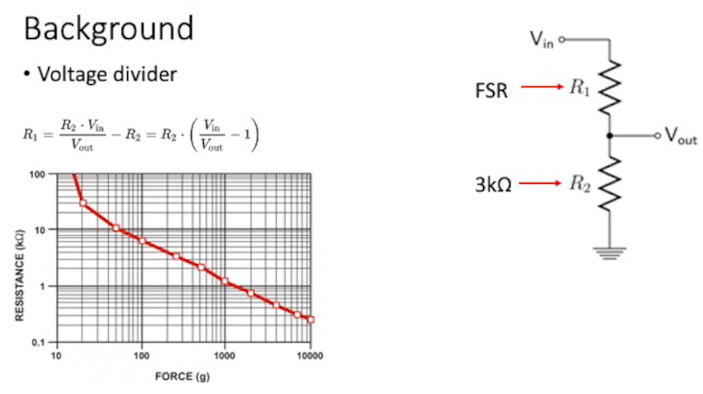
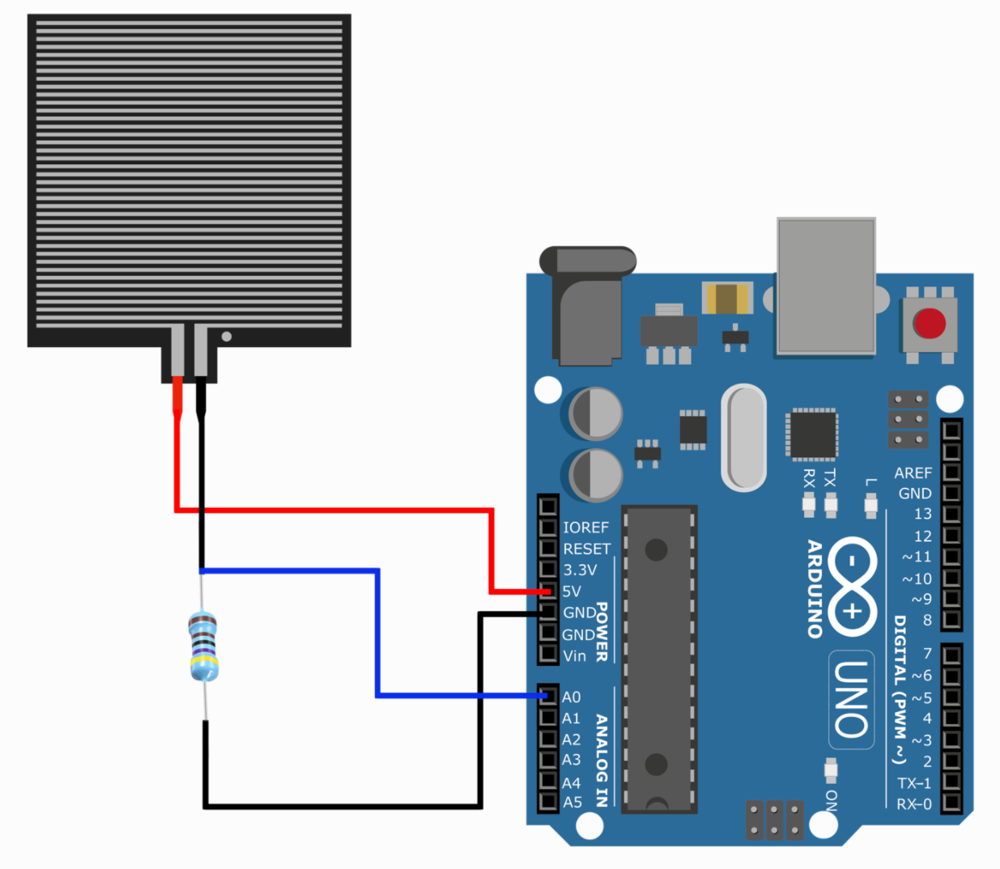
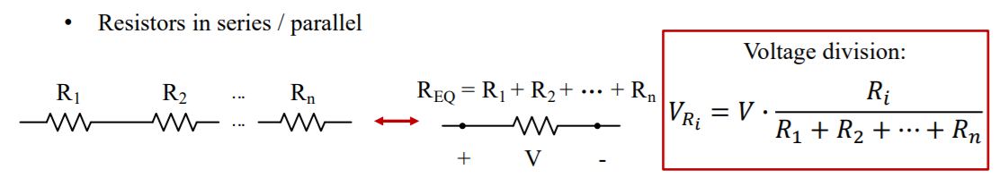
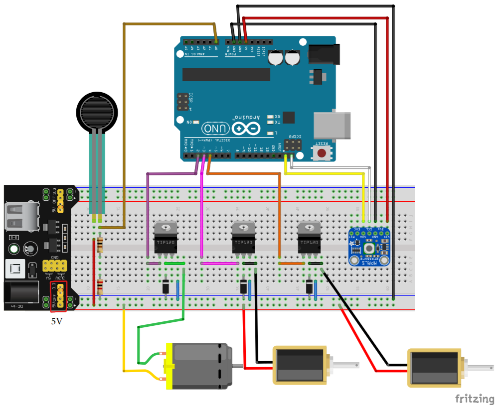
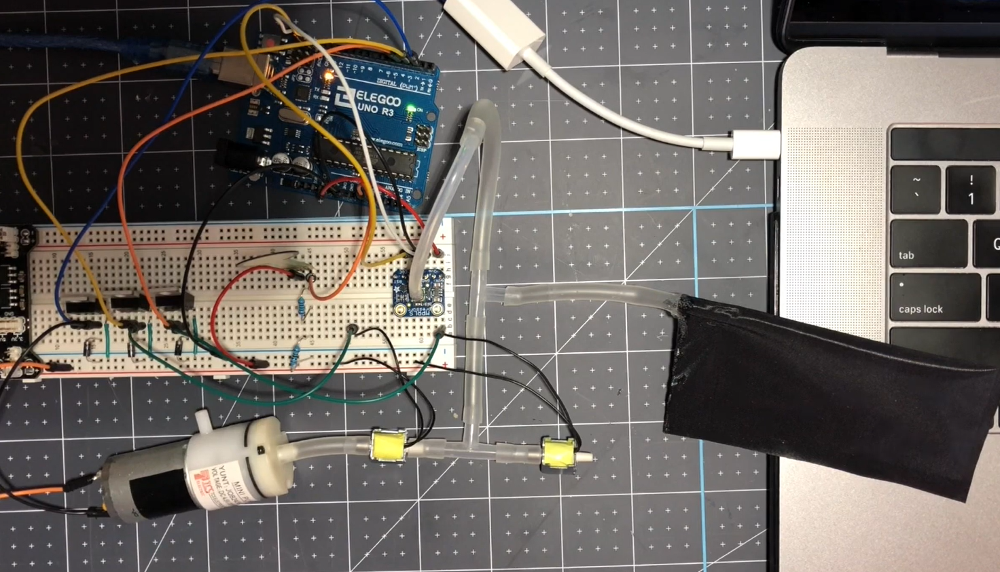

## Table of contents

{: .no_toc .text-delta }

1. TOC
   {: toc }


# Lab 3 Overview

This lab has two part

## Part 1: Testing Force Sensitive Resistor(FSR)

---

Testing Force Sensitive Resistor(FSR): Setup and collect data from FSR

- Wire the FSR onto breadboard
- Run FSR sample code
- Use serial monitor/plotter to visualize data


### Concept/Methodology:



To determine the force pressure, we need to place a sensor in a voltage divider circuit, by measuring the voltage out and voltage in, we can determine/calculate the resistance of the sensor.



The idea of using FSR here is, the resistance of FSR changes as the force being pressured. Based on above graph, we can see higher the pressure, larger the resistance(K ohm).
$$
\frac{V_{out}}{V_{in}} = \frac{R_{2}}{R_{1}+R_{2}}	\\
R_{1} = \frac{R_{2}*V_{in}}{V_{out}} - R_{2}	\\
R_{1} = R_{2} * (\frac{V_{in}}{V_{out}} - 1)	\\
$$
where, $R_{1}$ is the resistance being sensed by FSR; $R_{2}$ is the external resistor, and $V_{in}$ and  $V_{out}$ are the voltage being measured!


- What is Voltage divider

记住，1) 电阻是串联分压，并联分流; 2) 串联电路，电流处处相；并联电路；电压处处相等；然后就是记住下面两个公式，上面的就都能推到出来了！

1. Voltage division:



2. Current Division:


- When to use Voltage Divider?
  - Anytime you want to reduce the magnitude of a voltage so it can be measured!

- **Reference** 
  - Wikipedia, [Voltage divider](https://en.wikipedia.org/wiki/Voltage_divider)

### Circuit Setup

- **Wire Diagram**




Note: Make sure the power supply module is plugged in and turned on using 5V not 3.3V. The wires for the solenoids are also extremely sensitive, so make sure all connections are secure before testing.

### Code:

```c
/******************************************************************************
ME 571 Tutorial 3 - Part 0
Reading values off of your Force Sensitive Resistor 
Using a Force Sensitive Resistor (FSR) to trigger the mini-pump on/off.

This tutorial relies on creating a voltage divider circuit with the FSR 
and reading the analog voltage at pin A0. A conversion equation will
return the force in grams. 

Create a voltage divider circuit combining an FSR with a 3kOhm resistor.
- The resistor should connect from A0 to GND.
- The FSR should connect from A0 to R_DIV
As the resistance of the FSR decreases (meaning an increase in pressure), the
voltage at A0 should increase.

Use the serial monitor to see the values reorted from the sensor.Alternatively,
use the serial plotter to see a graphical representation of the vlaues.

To use serial plotter, go to "Tools -> Serial Plotter".
******************************************************************************/
const int FSR_PIN = A0; // Pin connected to FSR/resistor divider
const float VCC = 5.0; 
const float R_DIV = 3000.0; 

void setup() 
{
  Serial.begin(115200);
  pinMode(FSR_PIN, INPUT);
}

void loop(){
  float forceVal;
  forceVal = readForce();
  
  Serial.println("Force: " + String(forceVal) + " g");
  Serial.println();
  delay(500);
}


float readForce() 
{
  int fsrADC = analogRead(FSR_PIN);
  // If the FSR has no pressure, the resistance will be
  // near infinite. So the voltage should be near 0.
  if (fsrADC != 0) // If the analog reading is non-zero
  {
    // Use ADC reading to calculate voltage:
    float fsrV = fsrADC * VCC / 1023.0;
    // Use voltage and static resistor value to 
    // calculate FSR resistance:
    float fsrR = R_DIV * (VCC / fsrV - 1.0);
    // Linearized estimate of force based on slopes in figure 3 of
    // FSR datasheet:
    float force;
    float fsrG = 1.0 / fsrR; // Calculate conductance
    // Break parabolic curve down into two linear slopes:
    if (fsrR <= 600){
        force = (fsrG - 0.00075) / 0.00000032639;
      	return force;
    }else{
        force =  fsrG / 0.000000642857;
        return force;
    }
  }
}
```


### Expected Result:


## Part 2: Using the FSR to trigger the mini-pump

---

### Circuit Setup

- **Overall Configuration**




### Idea:

Use the force sensitive resistor(FSR) to control the mini-pump to turn on and off. After turn on the power, motor activates and pumps air into the pneumatic actuator. When the value of the force move above certain threshold, it triggers mini pump to turn on, when the force goes back to zero, the solenoid exhaust valve opens, and all remaining air will be released or exhausted:


### Code:

```c
/******************************************************************************
ME 571 Tutorial 3 - Part 1
Using a Force Sensitive Resistor (FSR) to trigger the mini-pump on/off.

This tutorial relies on creating a voltage divider circuit with the FSR 
and reading the analog voltage at pin A0. A conversion equation will
return the force in grams. 

Create a voltage divider circuit combining an FSR with a 3kOhm resistor.
- The resistor should connect from A0 to GND.
- The FSR should connect from A0 to R_DIV
As the resistance of the FSR decreases (meaning an increase in pressure), the
voltage at A0 should increase.

******************************************************************************/
#include <Wire.h>
#include <Adafruit_MPRLS.h>

#define RESET_PIN  -1  // set to any GPIO pin # to hard-reset on begin()
#define EOC_PIN    -1  // set to any GPIO pin to read end-of-conversion by pin
Adafruit_MPRLS mpr = Adafruit_MPRLS(RESET_PIN, EOC_PIN);
/**************************/
int pumpPin = 2;
int solenoidInlet = 3;
int solenoidExhaust = 4;
/**************************/
const int FSR_PIN = A0; // Pin connected to FSR/resistor divider
const float VCC = 5.0; 
const float R_DIV = 3000.0; 
/******************************************************************************/

void setup() {

  //Begin Serial Monitor ******************************************************
  Serial.begin(115200);

  //Establish communication with MPRLS Pressure Sensor ************************
  if (! mpr.begin()) {
    Serial.println("Failed to communicate with MPRLS sensor, check wiring?");
    while (1) {
      delay(10);
    }
  }
  Serial.println("Found MPRLS sensor");
  
  //declare pin I/O ************************************************************
  pinMode(pumpPin, OUTPUT);
  pinMode(solenoidInlet,OUTPUT);
  pinMode(solenoidExhaust,OUTPUT);
  
  //Initial deflate routine that will run once. Will depressurize any air that's
  //already in the line. 
  digitalWrite(solenoidInlet, HIGH);   //open inlet valve 
  digitalWrite(solenoidExhaust, HIGH); //open exhaust valve
  delay(5000);                         //wait 5 seconds for system to deflate

}

void loop() {
  float forceVal = readForce();
  float pressure_hPa = mpr.readPressure();

  if (forceVal > 600) {
    digitalWrite(solenoidInlet, HIGH);
    digitalWrite(solenoidExhaust, LOW);
    digitalWrite(pumpPin, HIGH);
  }
  else {
   digitalWrite(solenoidInlet, HIGH);
   digitalWrite(solenoidExhaust, HIGH);
   digitalWrite(pumpPin, LOW); 
  }
  Serial.print("Pressure (PSI): "); Serial.println(pressure_hPa / 68.947572932);
}


//Functions
/**********************************************************************************/
float readForce() 
{
  int fsrADC = analogRead(FSR_PIN);
  // If the FSR has no pressure, the resistance will be
  // near infinite. So the voltage should be near 0.
  if (fsrADC != 0) // If the analog reading is non-zero
  {
    // Use ADC reading to calculate voltage:
    float fsrV = fsrADC * VCC / 1023.0;
    // Use voltage and static resistor value to 
    // calculate FSR resistance:
    float fsrR = R_DIV * (VCC / fsrV - 1.0);
    // Linearized estimate of force based on slopes in figure 3 of
    // FSR datasheet:
    float force;
    float fsrG = 1.0 / fsrR; // Calculate conductance
    // Break parabolic curve down into two linear slopes:
    if (fsrR <= 600) 
  {force = (fsrG - 0.00075) / 0.00000032639;
      return force;}
    else
      {force =  fsrG / 0.000000642857;
      return force;}
  }
  else
  {
    // No pressure detected
  }
}
```


## Reference:

- Force Sensing Resistor (FSR) with Arduino Tutorial, https://www.makerguides.com/fsr-arduino-tutorial/
- Force Sensitive Resistors (FSRs) with Arduino, https://makersportal.com/blog/2020/5/24/force-sensitive-resistors-fsrs-arduino
- Force Sensitive Resistor (FSR)  Using an FSR, https://learn.adafruit.com/force-sensitive-resistor-fsr/using-an-fsr
- Or just Google “arduino Testing Force Sensitive Resistor(FSR)”

## Bonus

**Tutorial Video**

<iframe width="560" height="315" src="https://www.youtube.com/embed/5nQ-zSS9MEY" title="YouTube video player" frameborder="0" allow="accelerometer; autoplay; clipboard-write; encrypted-media; gyroscope; picture-in-picture" allowfullscreen></iframe>


**Lab3 Demo Video**


