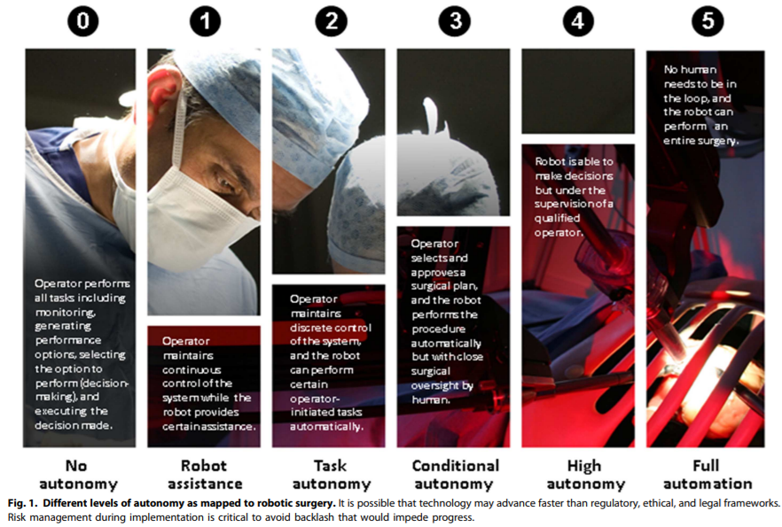

## Table of contents

{: .no_toc .text-delta }

1. TOC
   {: toc }

## **Medical robotic 6 level of autonomy:**

- Level 0: No autonomy
  - No autonomy. This level includes <u>tele-operated robots or prosthetic devices that respond to and follow the user’s command</u>. A surgical robot with motion scaling also fits this category because the output represents the surgeon’s desired motion.
- Level 1: Robot assistance
  - Robot assistance. The robot provides some mechanical guidance or assistance during a task while the human has continuous control of the system. Examples include <u>surgical robots with virtual fixtures (or active constraints) (2) and lower-limb devices with balance control</u>.
- Level 2: Task/Partial autonomy
  - The robot is <u>autonomous for specific tasks initiated by a human.</u> The difference from Level 1 is that the operator has discrete, rather than continuous, control of the system. An example is <u>surgical suturing (3)—the surgeon indicates where a running suture should be placed, and the robot performs the task autonomously</u> while the surgeon monitors and intervenes as needed.
- Level 3: Conditional autonomy
  - A system <u>generates task strategies but relies on the human to select from</u> among different strategies or to approve an autonomously selected strategy. This type of surgical robot <u>can perform a task without close oversight</u>. An active lower-limb prosthetic device can sense the wearer’s desire to move and adjusts automatically without any direct attention from the wearer.
- Level 4: High autonomy
  - The robot can make medical decisions <u>but under the supervision of a qualified doctor.</u> A surgical analogy would be a robotic resident(住院医生实习期, Residency or postgraduate training is specifically a stage of graduate medical education), who <u>performs the surgery under the supervision of an attending surgeon</u>主治外科医生.
- Level 5: Full autonomy
  - This is a “robotic surgeon”that can perform an entire surgery. This can be construed broadly as a system <u>capable of all procedures performed by a general surgeon.</u> A robotic surgeon is currently <u>in the realm of science fiction</u>.

## **6 level of vehicle autonomy:**

- **Level 0 (No Driving Automation):** <u>manually controlled. e.g., emergency braking system</u>―since it technically doesn’t "drive" the vehicle, it does not qualify as automation. 

- **Level 1 (Driver Assistance):** the lowest level of automation, e.g., <u>such as steering or accelerating (cruise control); Adaptive cruise control(ACC)</u> – where the vehicle can be kept at a safe distance behind the next car, qualifies as Level 1 because the human driver monitors the other aspects of driving such as steering and braking. 

- **Level 2 (Partial Driving Automation):** This means <u>[advanced driver assistance systems](https://www.synopsys.com/automotive/what-is-adas.html) or [ADAS](https://www.synopsys.com/automotive/what-is-adas.html). The vehicle can control both steering and accelerating/decelerating.</u> Here the automation falls short of self-driving because a human sits in the driver’s seat and can take control of the car at any time. Tesla Autopilot and Cadillac (General Motors) Super Cruise systems both qualify as Level 2.

- **Level 3 (Conditional Driving Automation)**: The jump from Level 2 to Level 3 is substantial from a technological perspective, but subtle if not negligible from a human perspective.

  Level 3 vehicles have “environmental detection” capabilities and can make informed decisions for themselves, such as accelerating past a slow-moving vehicle. But―they <u>still require human override.</u> <u>The driver must remain alert and ready to take control if the system is unable to execute the task.</u>

  Almost two years ago, Audi (Volkswagen) announced that the next generation of the A8―their flagship sedan―would be the world’s first production Level 3 vehicle. And they delivered. The 2019 Audi A8L arrives in commercial dealerships this Fall. It features Traffic Jam Pilot, which combines a lidar scanner with advanced sensor fusion and processing power (plus built-in redundancies should a component fail).

  However, while Audi was developing their marvel of engineering, the regulatory process in the U.S. shifted from federal guidance to state-by-state mandates for autonomous vehicles. So for the time being, the A8L is [still classified as a Level 2](https://www.cnet.com/roadshow/news/2019-audi-a8-level-3-traffic-jam-pilot-self-driving-automation-not-for-us/) vehicle in the United States and will ship without key hardware and software required to achieve Level 3 functionality. In Europe, however, Audi will roll out the full Level 3 A8L with Traffic Jam Pilot (in Germany first). 

- Level 4 (High Driving Automation):

  - The key difference between Level 3 and Level 4 automation is that <u>Level 4 vehicles can intervene if things go wrong or there is a system failure. I</u>n this sense, these cars do not require human interaction *in most circumstances*. However, a human still has the option to manually override.

    Level 4 vehicles can operate in self-driving mode. But until legislation and infrastructure evolves, they can only do so within a limited area (usually an urban environment where top speeds reach an average of 30mph). This is known as geofencing. As such, most Level 4 vehicles in existence are geared toward ridesharing. For example:

    - [NAVYA](https://www.motorauthority.com/news/1118809_navya-already-sells-fully-self-driving-cars-including-in-us), a French company, is already building and selling Level 4 shuttles and cabs in the U.S. that run fully on electric power and can reach a top speed of 55 mph.
    - Alphabet's [Waymo](https://www.reuters.com/article/us-waymo-selfdriving-focus/waymo-unveils-self-driving-taxi-service-in-arizona-for-paying-customers-idUSKBN1O41M2) recently unveiled a Level 4 self-driving taxi service in Arizona, where they had been testing driverless cars―without a safety driver in the seat―for more than a year and over 10 million miles.
    - Canadian automotive supplier [Magna](https://www.magna.com/insights/article/max4-magna-s-formula-for-winning-the-self-driving-car-race) has developed technology (MAX4) to enable Level 4 capabilities in both urban and highway environments. They are working with Lyft to supply high-tech kits that turn vehicles into self-driving cars.
    - Just a few months ago, [Volvo and Baidu](https://www.autonews.com/article/20181101/MOBILITY/311019997/volvo-baidu-team-up-for-level-4-autonomous-evs-in-china) announced a strategic partnership to jointly develop Level 4 electric vehicles that will serve the robotaxi market in China.

- **Level 5 (Full Driving Automation):** vehicles <u>do not require human attention</u>―the “dynamic driving task” is eliminated. Level 5 cars won’t even have steering wheels or acceleration/braking pedals. They will be free from geofencing, able to go anywhere and do anything that an experienced human driver can do. Fully autonomous cars are undergoing testing in several pockets of the world, but none are yet available to the general public. 

===> 两个标准都得规划都差不多的，只是不同的邻域在每个level得边界上会有些区别！

## Take Away Message

- Contribution: Proposed 6 level of autonomy for medical robotic, and draw people attention to the consideration of some regulatory, ethical, and legal issues as the level of autonomy increased in the future!
- Six level autonomy: No autonomy –> Robot assistance –> Task autonomy –> Conditional autonomy –> High autonomy –> Full autonomy
- The higher level autonomy required more technical sophistication, expected less human intervention or supervision, but also more regulatory challenged!
- As the autonomous capabilities of medical robotics grow, the role of medical specialist will shift toward diagnosis and decision-making.

## Opinion? Open Questions? and challenges?

- As we reached higher level autonomous, even technician have tested the machine many times, but will patient trust that robot? and will they be more comfortable that the surgery being operated by robot than a surgeon? ==> You know, the robot cannot feel your pain, and cannot talk to you, so during surgery, everything will be controlled by a robot. ==> But what if some accident happen, e.g., electrical surge, power trip, or the power just went off suddenly, how can we guarantee the patient will still have the protection they need, to keep them out of the brink/edge/precipice of death, or the verge of destruction?
- What is the cost for a robot comparing to the human surgeon?
- Any underlying or potential risk that the patient are assumed to accept for being operated by a autonomous robot? e.g., some risk they have to agree with for the surgery being operated by the robot (maybe we don’t need to tell, but do we know it exist?).

## Reference:

- Paper Reference: [Medical robotics—Regulatory, ethical, and legal considerations for increasing levels of autonomy]( http://robotics.tch.harvard.edu/publications/pdfs/yang2017medical.pdf)
- [The 6 Levels of Vehicle Autonomy Explained](https://www.synopsys.com/automotive/autonomous-driving-levels.html)