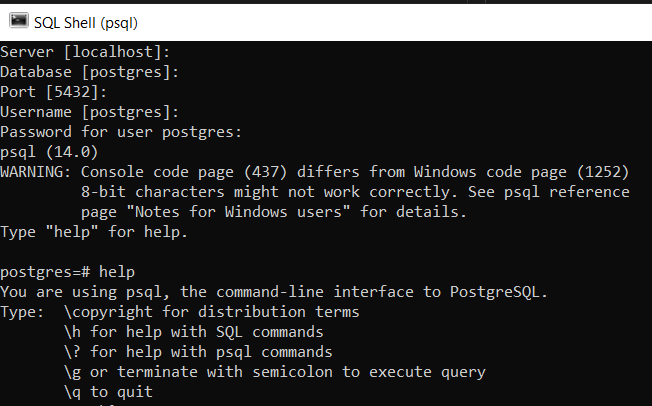
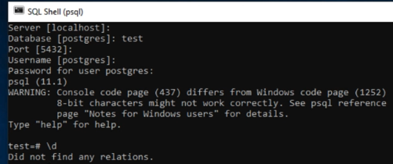
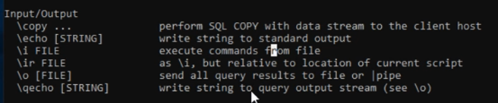

## Table of contents

{: .no_toc .text-delta }

TOC
{: toc }


## Installation on Window:


Download from here, https://www.postgresql.org/download/. For any general setting in Windows 10, follow this tutorial, [Getting Started with PostgreSQL for Windows | 2021](https://www.youtube.com/watch?v=BLH3s5eTL4Y)


password: postgresql

default port: 5432




- Cheatsheet

| PostgreSQL Command | Explanation                         |
| ------------------ | ----------------------------------- |
| \q                 | quit                                |
| \h or help         | get help with SQL command           |
| \?                 | get help with psql command          |
| \? [command]       | Get help with specific psql command |
| \g                 | to execute query                    |


### Create a brand new database

```sql
# Create a new databased with name as "test"
CREATE DATABASE test;
\l	# list all database
```

Close and reopen the terminal




```bash
# Change password
\password

# show relationship
\d

# To create a new table
CREATE TABLE person(
	id BIGSERIAL NOT NULL PRIMARY KEY,
    name VARCHAR(100) NOT NULL,
    country VARCHAR(50) NOT NULL);
   
# LIST all relationship
\d

# Show all tables
\dt

# insert few data
INSERT INTO person(name, country) VALUES ('Amigoscode', 'UK');
INSERT INTO person(name, country) VALUES ('Sarah', 'Albania');
INSERT INTO person(name, country) VALUES ('Julio', 'Argentina');

# Run some query
SELECT * FROM person;

SELECT COUNT(id) FROM person;

UPDATE person SET name = 'Antonio' WHERE id = 3;

DELETE FROM person WHERE id = 2;

# activate expanded display on ==> Usefull for table with large column
\x
````


Create a sql file (useful for running multiple, or long query command)

```sql
SELECT id, name, country
FROM person
WHERE id = 1;
```


Execute this sql file

```cmd
\?
\i [path_tofile\sql.sql]
```




## Installation on Linux (tested on Ubuntu 20.04)

- Download the package

```bash
sudo apt-get update
sudo apt-get install postgresql postgresql-contrib
# postgresql ==> This, by default, will download the latest version of postgresql
# postgresql-contrib ==> This will download with additional supplied modules (part of the postgresql-xx package in version 10 and later)
# More refers to official doc, https://www.postgresql.org/download/linux/ubuntu/
```

Reference: [How to Install PostgreSQL on Ubuntu Linux](https://www.youtube.com/watch?v=VNy2nhho9Pg)


- Go to postgre

```bah
sudo -u postgres psql
# Enter passwor
# ..
\q		# quit

# Create a new user
sudo -u postgres createuser --interactive
# Superuser? --> Yes


sudo -u postgres createdb linuxhint
# sudo: sudo is an abbreviation of "super user do" and is a Linux command that allows programs to be executed as a super user (aka root user)
# -u postgres: user name is postgres
# createdb linuxhint: create a database with name as "linuxhint"

# Checking connection:
sudo -u postgres psql
\conninfo

# Login as new user as "linuxhint"
sudo -u linuxhint psql
```


- More code

```bash
Commands that we have used in this Video:
$ sudo apt-get update
$sudo apt-get install postgresql postgresql-contrib
$ sudo -i -u postgres

$ postgres          
OR
$ sudo -u postgres psql

$ sudo -u postgres createuser –interactive
$ sudo -u postgres createdb dbname
```


## Prisma


```bash
PS E:\Zhengqi Dong\Education\BU\2021_Fall\CS501-spark project\Project\se-team-mejia\backend> npx prisma

Prisma is a modern DB toolkit to query, migrate and model your database (https://prisma.io)

Usage

  $ prisma [command]

Commands

            init   Setup Prisma for your app
        generate   Generate artifacts (e.g. Prisma Client)
              db   Manage your database schema and lifecycle
         migrate   Migrate your database
          studio   Browse your data with Prisma Studio
          format   Format your schema

Flags

     --preview-feature   Run Preview Prisma commands

Examples

  Setup a new Prisma project
  $ prisma init

  Generate artifacts (e.g. Prisma Client)
  $ prisma generate

  Browse your data
  $ prisma studio

  Create migrations from your Prisma schema, apply them to the database, generate artifacts (e.g. Prisma Client)
  $ prisma migrate dev

  Pull the schema from an existing database, updating the Prisma schema
  $ prisma db pull

  Push the Prisma schema state to the database
  $ prisma db push
```

