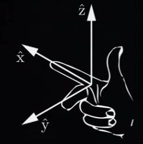
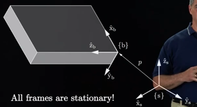
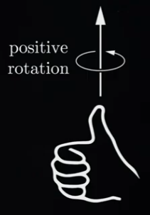

## Table of contents

{: .no_toc .text-delta }

1. TOC
   {: toc }
2. 

# [Introduction to Rigid-Body Motions](https://modernrobotics.northwestern.edu/nu-gm-book-resource/introduction-to-rigid-body-motions/#department)

- In Chapter 3, we learn representations of configurations, velocities, and forces that we'll use throughout the rest of the book. As discussed in the last chapter, we'll use <u>implicit representations of configurations</u>, considering the C-space as a surface embedded in a higher-dimensional space. In other words, our representation of a     configuration will not use a minimum set of coordinates, and velocities will not be the time derivative of coordinates. This approach may be new to you if you haven't taken a course in three-dimensional kinematics before.

- Rigit-body configuration:

  - Configuration:

    - 

  - <u>Rigid-body configurations are represented using frames.</u>

  - Right hand rule:

  - - ==> product positive determinant, and clock-wise rotation
    - The cross product of x and y creates z-axis
    - Left hand rule ==> negative determinant, rotated counter clock-wise(CCW)

- Frame:

- - A **frame** <u>consists of an origin and orthogonal x, y, and z coordinate axes.</u>
  - <u>All frames are right-handed</u>, which means that <u>the cross product of the x and y axes creates the z-axis</u>.
  - You can create a **right-handed frame** using your right hand: your index finger is the x-axis, your middle finger is the y-axis, and your thumb is the z-axis.
  - <u>In this book, all frames are considered to be stationary.</u> Even if the body is moving, when we talk about the **body frame**, we <u>mean the stationary frame coincident with the frame attached to the body at a particular instant in time</u>.
    - 
  - Positive rotation about an axis is defined by the right-hand rule. If you align the thumb of your right hand with the axis of rotation, positive rotation is the direction that your fingers curl.
    - 
  - With those preliminaries out of the way, in the next video we move on to representing the orientation of a rigid body.
