## Table of contents

{: .no_toc .text-delta }

1. TOC
    {: toc }

 

## Plan:

1. ROS tutorial #1: Introduction, Installing ROS, and running the Turtlebot simulator, https://www.youtube.com/watch?v=9U6GDonGFHw&list=PLJNGprAk4DF5PY0kB866fEZfz6zMLJTF8


# Resources:


## Paper:


## Course Video

- Udemy
  - ROS2 For Beginners (ROS Foxy - 2021), https://www.udemy.com/cart/success/704244436/
  - ROS for Beginners II: Localization, Navigation and SLAM, https://www.udemy.com/course/ros-navigation/learn/lecture/11785182#overview

Books:


# Implementing ORB-SLAM on Ubuntu 18.04 & ROS Melodic


# Robot Category:

**我定义的类别：**

1. Mobile Robot: 只要是带轮子的，履带也算，反正以轮子作为驱动 ==》 这研究就是 robot motion control, path planning/navigation 这一块，还有就是些是视觉的东西，比如 object detection, object avoidance, object following. 
2. 爬虫类：所有考腿来移动的，用的都是rigit body作为支架，比如robot dog, 模拟人的/动物的腿的，都算
3. Drone：所有带翅膀的，天上飞的
4. Industrial robot: 带机械臂的，不用移动的那种 ==> 这个可以研究的东西就很多了, 但大多都是控制上面的，robot arm manipulation 这些，比如 forward/backward kinematic, 

==》 搞懂上面这4种基本就够了

**别人的定义**

==>大多数人都是按照应用场景来分，但作为研究或者开发人员，我认为还是我那一套合适。

==》 比如 Drone, Entertainment(那种智能娃娃狗, involve Human-Robot Interaction， NLP 之类的research), Disaster Response， Educational (和3D Printing, Lego, Toy project相关，能够快速落地的，快速assemble的robot), Medical robot (da vinci), Underwater, Self-Driving car, Military & Security, Industrial, Humanoids 

==> 具体参考这里， https://robots.ieee.org/learn/types-of-robots/

Consumer: Consumer robots are robots you can buy and use just for fun or to help you with tasks and chores. Examples are the robot dog Aibo, the Roomba vacuum, AI-powered robot assistants, and a growing variety of robotic toys and kits.

Entertainment: These robots are designed to evoke an emotional response and make us laugh or feel surprise or in awe. Among them are robot comedian RoboThespian, Disney’s theme park robots like Navi Shaman, and musically inclined bots like Partner.

Disaster Response: These robots perform dangerous jobs like searching for survivors in the aftermath of an emergency. For example, after an earthquake and tsunami struck Japan in 2011, Packbots were used to inspect damage at the Fukushima Daiichi nuclear power station.

Drones: Also called unmanned aerial vehicles, drones come in different sizes and have different levels of autonomy. Examples include DJI’s popular Phantom series and Parrot’s Anafi, as well as military systems like Global Hawk, used for long-duration surveillance.

Education: This broad category is aimed at the next generation of roboticists, for use at home or in classrooms. It includes hands-on programmable sets from Lego, 3D printers with lesson plans, and even teacher robots like EMYS.

Medical: Medical and health-care robots include systems such as the da Vinci surgical robot and bionic prostheses, as well as robotic exoskeletons. A system that may fit in this category but is not a robot is Watson, the IBM question-answering supercomputer, which has been used in healthcare applications.

Industrial: The traditional industrial robot consists of a manipulator arm designed to perform repetitive tasks. An example is the Unimate, the grandfather of all factory robots. This category includes also systems like Amazon's warehouse robots and collaborative factory robots that can operate alongside human workers.


Humanoids: This is probably the type of robot that most people think of when they think of a robot. Examples of humanoid robots include Honda’s Asimo, which has a mechanical appearance, and also androids like the Geminoid series, which are designed to look like people.

Military & Security: Military robots include ground systems like Endeavor Robotics' PackBot, used in Iraq and Afghanistan to scout for improvised explosive devices, and BigDog, designed to assist troops in carrying heavy gear. Security robots include autonomous mobile systems such as Cobalt.

Self-Driving Cars: Many robots can drive themselves around, and an increasing number of them can now drive *you* around. Early autonomous vehicles include the ones built for DARPA’s autonomous-vehicle competitions and also Google’s pioneering self-driving Toyota Prius, later spun out to form Waymo.

Underwater: The favorite place for these robots is in the water. They consist of deep-sea submersibles like Aquanaut, diving humanoids like Ocean One, and bio-inspired systems like the ACM-R5H snakebot.


Written by Erico Guizzo. Date published: 2018-08-01; Date modified: 2020-05-28


# Overview of SLAM

## Installation & Env Setup

```bash
# Installs the navigation stack.
sudo apt-get install ros-noetic-navigation
# Installs the SLAM package.
sudo apt-get install ros-noetic-slam-gmapping

sudo apt-get update
sudo apt-get upgrade

# This will install the core packages of Turtlebot3.
$ cd ~/catkin_ws/src/
$ git clone https://github.com/ROBOTIS-GIT/turtlebot3_msgs.git -b melodic-devel
$ git clone  https://github.com/ROBOTIS-GIT/turtlebot3.git -b melodic-devel
$ cd ~/catkin_ws && catkin_make

# Install Turtlebot3 simulator
$ cd ~/catkin_ws/src/
$ git clone https://github.com/ROBOTIS-GIT/turtlebot3_simulations.git
$ cd ~/catkin_ws && catkin_make

# made the modification in .bashrch file as follows:
vim ~/.bashrc
# Making alias is optional but recommended to speed-up typing the commands.
alias burger='export TURTLEBOT3_MODEL=burger'
alias waffle='export TURTLEBOT3_MODEL=waffle'
alias tb3fake='roslaunch turtlebot3_fake turtlebot3_fake.launch'
alias tb3teleop='roslaunch turtlebot3_teleop turtlebot3_teleop_key.launch'
alias tb3='roslaunch turtlebot3_gazebo turtlebot3_empty_world.launch'
alias tb3maze='roslaunch turtlebot3_gazebo turtlebot3_world.launch'
alias tb3house='roslaunch turtlebot3_gazebo turtlebot3_house.launch'

# Reuired: At the end of the file, write the following commands. The last command will let you open Gazebo on a Virtual Machine and avoid crashing its display.
source /opt/ros/noetic/setup.bash
source /home/akoubaa/catkin_ws/devel/setup.bash
export TURTLEBOT3_MODEL=waffle
export SVGA_VGPU10=0

```


```bash


roslaunch turtlebot3_gazebo turtlebot3_gazebo_rviz.launch
```


## Resources

- The Construct ROS for Beginners, https://www.theconstructsim.com/intro-to-robot-programming-ros-learning-path/
- mithi/robotics-coursework, https://github.com/mithi/robotics-coursework
- CMU Lecture note:
  - Chap8-Kalman-Mapping_howie.ppt, Localization, Mapping, SLAM and The Kalman Filter according to George， https://www.cs.cmu.edu/~motionplanning/lecture/Chap8-Kalman-Mapping_howie.pdf
  - Chap9-Bayesian-Mapping_howie.ppt, Bayesian Approaches to Localization, Mapping, and SLAM, https://www.cs.cmu.edu/~motionplanning/lecture/Chap9-Bayesian-Mapping_howie.pdf
  - lec 24 – Range‐Only SLAM for Robots Operating Cooperatively with Sensor Networks, https://www.cs.cmu.edu/~motionplanning/lecture/lec24.pdf
  - Artificial Intelligence: Final review, https://www.cs.cmu.edu/afs/cs/academic/class/15381-s07/www/slides/final-review.pdf
  - Search based Planning in Dynamic Environments, https://www.cs.cmu.edu/afs/cs/academic/class/15381-s07/www/slides/013007dynplanning.pdf
  - Robotic Motion Planning: RRT’s, https://www.cs.cmu.edu/~motionplanning/lecture/lec20.pdf
  - Robotic Motion Planning: Controls Primer, https://www.cs.cmu.edu/~motionplanning/lecture/lec22.pdf
- Math review
  - Multivariable calculus, https://www.youtube.com/watch?v=J08-L2buigM&list=PLSQl0a2vh4HC5feHa6Rc5c0wbRTx56nF7&index=24
- Standford Courses:
  - Sebastian Thrun Course page, http://robots.stanford.edu/courses.html
  - Stanford University CS 226: Statistical Techniques in Robotics (Prof. Sebastian Thrun)	, http://cs226.stanford.edu/schedule.html

People

- Influent CS people at Boston University: https://research.com/university/computer-science/boston-university
  - Stephen Grossberg,  https://research.com/u/stephen-grossberg
- 

Learning Material(slide, Paper, Blog)

- The GraphSLAM Algorithm Daniel Holman CS 5391: AI Robotics March 12, 2014, https://slideplayer.com/slide/4546909/
- ROBOT MAPPING AND EKF SLAM, https://slideplayer.com/slide/5983202/

What is ORM-SLAM: [paper](http://webdiis.unizar.es/~raulmur/MurMontielTardosTRO15.pdf), github repo, 

- Based on a monocular camera was first proposed in: Raúl Mur-Artal, J. M. M. Montiel and Juan D. Tardós. ORB-SLAM: A Versatile and Accurate Monocular SLAM System. IEEE Transactions on Robotics, vol. 31, no. 5, pp. 1147–1163, 2015. [PDF](http://webdiis.unizar.es/~raulmur/MurMontielTardosTRO15.pdf)
- source code for the ROS package can be found on this [GitHub page](https://github.com/appliedAI-Initiative/orb_slam_2_ros)
  - appliedAI-Initiative/orb_slam_2_ros, https://github.com/appliedAI-Initiative/orb_slam_2_ros
  - raulmur/ORB_SLAM2, https://github.com/raulmur/ORB_SLAM2
  - castiel520/ORB_SLAM2-Semi-Dense, https://github.com/castiel520/ORB_SLAM2-Semi-Dense
- 2D grid mapping and navigation with ORB-SLAM 2- KITTI Dataset, https://www.youtube.com/watch?v=FCd6p25131I
  - My Projects: https://jahaniam.github.io/index.html
  - Abhineet personal page : http://webdocs.cs.ualberta.ca/~vis/asingh1/
  - source code: https://github.com/abhineet123/ORB_SLAM2


Tutorial:

- EKF SLAM on Turtlebot3, https://shangzhouye.tech/featured-projects/ekf_slam/

- ORB-Slam2: Implementation on my Ubuntu 16.04 with ROS Kinect, https://medium.com/@j.zijlmans/orb-slam-2052515bd84c
- 


# ROS

## Installation:

!!! Use the bash script here to download directly, https://github.com/ROBOTIS-GIT/robotis_tools/blob/master/install_ros_melodic.sh

ROS1 Noetic Installation in Windows: [1-2 hr]

- Just follow the tutorial here, http://wiki.ros.org/noetic/Installation.
- !! There is a YouTube video for Windows 10 installation, [How to Install ROS Melodic on Windows natively in just 3 Simple Steps || Install ROS without Ubuntu](https://www.youtube.com/watch?v=8QC7-Odeqhc)

ROS Noetic Installation in Ubuntu:

- Follow this tutorial, [ROS Noetic Installation and Path Sourcing](https://www.youtube.com/watch?v=PowY8dV36DY)

ROS2 Foxy on WIndows:

- Installation, http://wiki.ros.org/Installation/Windows
- !!! Video,How to Install ROS Melodic on Windows natively in just 3 Simple Steps || Install ROS,  https://www.youtube.com/watch?v=8QC7-Odeqhc
  - Installation Code snippet, https://github.com/PranshuTople/Installing_ROS
- [TO-DO] Configuration setup, https://docs.ros.org/en/foxy/Tutorials/Configuring-ROS2-Environment.html


```bash
# Run master node
roscore
# Show all urls
rostopic list
# Launch gazebo
roslaunch gazebo_ros empty_world.launch
# Launch rviz
rosrun rviz rviz
```


ROS Melodic Installation in Ubuntu 18.04 (recommended)

- Installation, http://wiki.ros.org/melodic/Installation/Ubuntu
- !!! Video, INSTALLING & GETTING STARTED WITH ROS | How to install ROS & How to setup Catkin Workspace on Ubuntu, https://www.youtube.com/watch?v=GBBQqiGvOSw

```bash
# 1.2 Setup your sources.list
# Setup your computer to accept software from packages.ros.org.
sudo sh -c 'echo "deb http://packages.ros.org/ros/ubuntu $(lsb_release -sc) main" > /etc/apt/sources.list.d/ros-latest.list'

# 1.3 Set up your keys
sudo apt install curl # if you haven't already installed curl
curl -s https://raw.githubusercontent.com/ros/rosdistro/master/ros.asc | sudo apt-key add -
sudo apt update

# 1.4 Installaltion begin
sudo apt install ros-melodic-desktop-full
# To find available packages, use:
apt search ros-melodic

# 1.5 Environment setup
# It's convenient if the ROS environment variables are automatically added to your bash session every time a new shell is launched:
echo "source /opt/ros/melodic/setup.bash" >> ~/.bashrc
# Or printf "source /opt/ros/melodic/setup.bash" >> ~/.bashrc
source ~/.bashrc

# 1.6 Dependencies for building packages
# Up to now you have installed what you need to run the core ROS packages. To create and manage your own ROS workspaces, there are various tools and requirements that are distributed separately. For example, rosinstall is a frequently used command-line tool that enables you to easily download many source trees for ROS packages with one command.
# To install this tool and other dependencies for building ROS packages, run:
sudo apt install python-catkin-tools python-rosinstall python-rosinstall-generator python-wstool build-essential

# 1.6.1 Initialize rosdep
# Before you can use many ROS tools, you will need to initialize rosdep. rosdep enables you to easily install system dependencies for source you want to compile and is required to run some core components in ROS. If you have not yet installed rosdep, do so as follows.
sudo apt install python-rosdep
# With the following, you can initialize rosdep.
sudo rosdep init
rosdep update
```

Tutorial

```bash
# Allow you to install ros dependency
sudo rosdep init

# update ros package
rosdep update

# 

source ~/.bashrc

# CTRL + H show hidden file
mkdir -p src

```

- !!! About catkin_make, read more here, http://wiki.ros.org/camera_calibration/Tutorials/MonocularCalibration

```bash
If you would like to build specific packages in the workspace, invoke the following in the root of your workspace:

$ catkin_make -DCATKIN_WHITELIST_PACKAGES="package1;package2"
If you want to revert back to building all packages, do the following:

$ catkin_make -DCATKIN_WHITELIST_PACKAGES=""
```


## ROS Important Concept

**What is ROS**?

- Peer-to-Peer: individual programs communicate over defined API(ROS message, services, etc.)
- Distributed: Programs can be run on multiple computer (distributed system) and communicate over the network
- Multi-lingual: ROS module can be written in any language (C++, Python, MATLAB, Java, etc). 
- Light-weight: It’s a wrapper, Stand-alone libraries are wrapped around with a thin ROS layer.  For example, you can write your control algorithm in non-ros code, and wrap it with some ros communication call.
- Free and open-source

**Motivation and philosophy:**

- ROS allows the collaboration and robotic software development on a world-scale.

- ROS also offers powerful debugging tools, data logging & analysis capabilities, and an open-source 3D robotics simulator called Gazebo.

- ROS provides a lot of industry standard packages for robotic system development.


### Important Component

**ROS Nodes:**

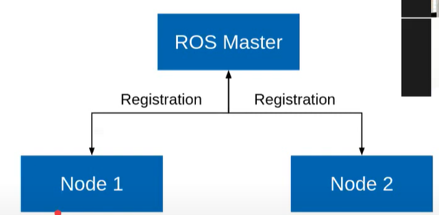

- Single -purpose, executable program
- Organized by packages

```bash
rosrun <package_name> <node_name>	# Run a node
rosnode list	# see all active nodes
rosnode info <node_name>	# Retrieve info about a node
```


ROS Topics:

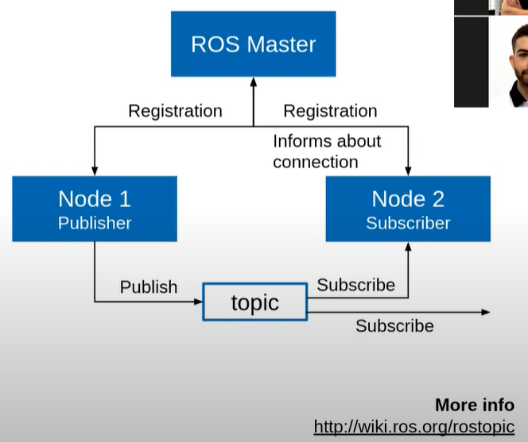

- Nodes communicate over topics
- Nodes can publish or subscribe to a topic. Typically, 1:N communication

```bash
rostopic list	# list all active topic
rostopic echo /topic	# subscribe and print the contents of a topic
rostopic info /topic	# Show info about a topic
```


**ROS Messages**

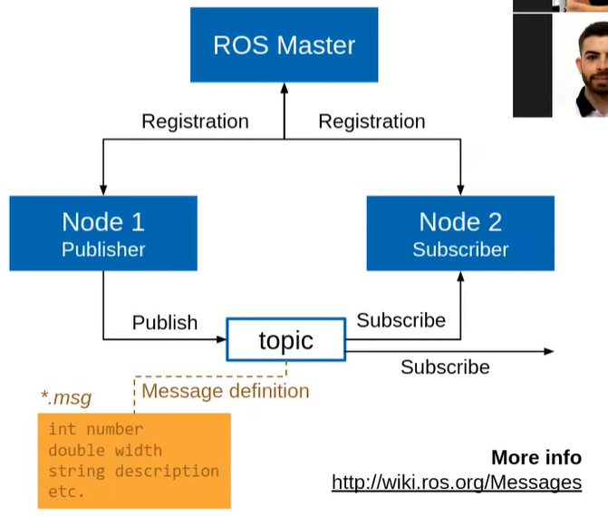

- Data structure defining the type of a topic
- Composed of a nested structure of integers, gloats, Booleans, string, and arrays of object.

```bash
rostopic type 		# see the type of a topic
rostopic pub /topic type data	# Publish a message to a topic
```

Example: 

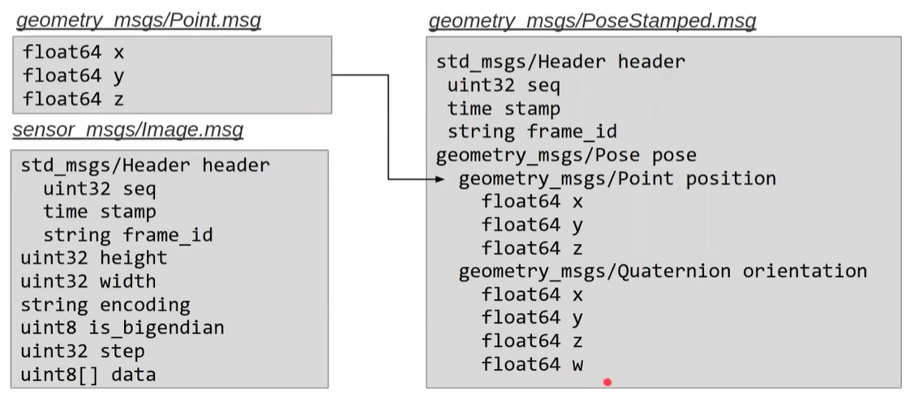


ROS Nodelets

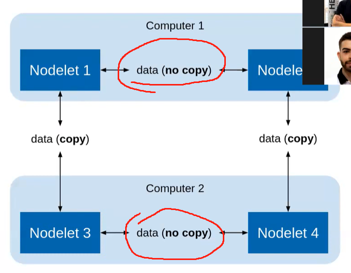

- Used to reduce communication overhead when running on same machine.  
- Try to use ROS nodes first, because Nodelets are more complicated to implement. (Only considered when it’s necessary, and optimization is crucial.)


### ROS Terminology

Reference: ROS Free book, https://community.robotsource.org/t/download-the-ros-robot-programming-book-for-free/51

Publisher == Server, Subscriber == Client

**ROS**: 

ROS provides standard operating system services such as hardware abstraction, device drivers, implementation of commonly used features including sensing, recognizing, mapping, motion planning, message passing between processes, package management, visualizers and libraries for development as well as debugging tools.

**Master:** 

acts as a name server for node-to-node connections and message communication. (Removed in ROS2, for eliminating the “single point of failure” issue.)

The master communicates with slaves using XMLRPC (XML-Remote Procedure Call)3, which is an HTTP-based protocol that does not maintain connectivity.

When you execute ROS, the master will be configured with the URI address and port configured in the ROS_MASTER_URI. By default, the URI address uses the IP address of local PC, and port number 11311, unless otherwise modified.

**Node:**  

the smallest unit of processor running in ROS.

The **node** uses 

- <u>XMLRPC for communicating with the master</u> 
- and uses <u>XMLRPC or TCPROS of the TCP/IP protocols when communicating between nodes</u>. 
- <u>Connection request and response between nodes use XMLRPC</u>, 
- and message communication uses TCPROS because it is a direct communication between nodes independent from the master. 
- As for the URI address and port number, a variable called ROS_HOSTNAME, which is stored on the computer where the node is running, is used as the URI address, and the port is set to an arbitrary unique value.

**Package:**

The basic unit of ROS.

The ROS application is developed on a package basis, and the package contains either a configuration file to launch other packages or nodes. <u>The package also contains all the files necessary for running the package, including ROS dependency libraries for running various processes, datasets, and configuration file.</u> The number of official packages is about 2,500 for ROS Indigo as of July 2017 (http://repositories.ros.org/status_page/ ros_indigo_default.html) and about 1,600 packages for ROS Kinetic (http://repositories.ros.org/status_page/ros_kinetic_default.html). In addition, although there could be some redundancies, there are about 4,600 packages developed and released by users (http://rosindex.github.io/stats/).

**Metapackage:**

A metapackage is a set of packages that have a common purpose. For example, the Navigation metapackage consists of 10 packages including AMCL, DWA, EKF, and map_server.

**Message:**

A node sends or receives data between nodes via a message. Messages are variables such as integer, floating point, and boolean. Nested message structure that contains another messages or an array of messages can be used in the message. 

TCPROS and UDPROS communication protocol is used for message delivery. Topic is used in unidirectional message delivery while service is used in bidirectional message delivery that request and response are involved.

**Topic:** 

The topic is literally like a topic in a conversation. 

The **publisher node** first <u>registers its topic with the master and then starts publishing messages on a topic</u>. **Subscriber nodes** th<u>at want to receive the topic request information of the publisher node corresponding to the name of the topic registered in the master</u>. Based on this information, the subscriber node directly connects to the publisher node to exchange messages as a topic.

**Publish and Publisher:** 
The term **‘publish’** <u>stands for the action of transmitting relative messages corresponding to the topic</u>. 

The **publisher node** <u>registers its own information and topic with the master, and sends a message to connected subscriber nodes that are interested in the same topic.</u> The publisher is declared in the node and can be declared multiple times in one node.

**Subscribe and Subscriber:**

The term **‘subscribe’** stan<u>ds for the action of receiving relative messages corresponding to the topic</u>. 

The **subscriber node** <u>registers its own information and topic with the master, and receives publisher information that publishes relative topic from the master.</u> Based on received publisher information, <u>the subscriber node directly requests connection to the publisher node and receives messages from the connected publisher node</u>. A subscriber is declared in the node and can be declared multiple times in one node.

The **topic communication** is <u>an asynchronous communication which is based on publisher and subscriber</u>, and it is <u>useful to transfer certain data</u>. Since the topic continuously transmits and receives stream of messages once connected, it is <u>often used for sensors that must periodically transmit data</u>. 

On the other hands, there is a need for synchronous communication with which request and response are used. Therefore, ROS provides a message **synchronization method called ‘service’**. <u>A **service** consists of the **service server** that responds to requests and the **service client** that requests to respond.</u> Unlike the topic, <u>the service is a one-time message communication.</u> When the request and response of the service is completed, the connection
between two nodes is disconnected.

// Subscriber 就挂在那，通过TCPROS 的TCP/IP方式，建立synchronization连接，之后就可以进行信息的交换。但和TCP不同的是，这个信息交换的过程就只有一次，交换完，就马上断了。之后需要，得重新建立。

**Service:**  
The service is <u>synchronous bidirectional communication between the service client</u> that requests a service regarding a particular task and the service server that is responsible for responding to requests.

**Service Server：**

The ‘service server’ is <u>a server receives a request as an input and transmits a response as an output</u>. 

Both request and response are in the form of messages. Upon the service request, the server performs the designated service and delivers the
result to the service client as a response. The service server is implemented in the node that receives and executes a given request.

**Service Client：**

The ‘service client’ is <u>a client in the service message communication that requests service to the server and receives a response as an input.</u> Both request and response are in the form of message.
The client sends a request to the service server and receives the response. The service client is implemented in the node which requests specified command and receives results.

**Action: **
The action is 

- another message communication method <u>used for an asynchronous bidirectional communication.</u> 
- used where it takes longer time to respond after receiving a request and intermediate responses are required until the result is returned. 
- The structure of action file is also similar to that of service. However, feedback data section for intermediate response is added along with goal and result data section which are represented as request and response in service respectively. 
- There are action client that sets the goal of the action and action server that performs the action specified by the goal and returns feedback and result to the action client.

**Action Server:**

The ‘action server’ is <u>in charge of receiving goal from the client and responding with feedback and result.</u> Once the server receives goal from the client, it performs predefined process.

**Action Client:**

The ‘action client’ is <u>in charge of transmitting the goal to the server and receives result or feedback data as inputs from the action server.</u> The client delivers the goal to the action server, then receives corresponding result or feedback, and transmits follow up instructions or cancel instruction.

**Parameter:**

- The parameter in ROS refers to parameters used in the node. <u>Think of it as *.ini configuration files in Windows program</u>. 

- Default values are set in the parameter and can be read or written if necessary. 
- In particular, it is <u>very useful when configured values can be modified in real-time.</u> For example, you can specify settings such as USB port number, camera calibration parameters, maximum and minimum values of the motor speed.

**Parameter Server:**

When parameters are called in the package, they are registered with the parameter server which is loaded in the master.

**Catkin:**

The catkin refers to <u>the build system of ROS</u>. 

The build system basically uses CMake (Cross Platform Make), and the build environment is described in the ‘CMakeLists.txt’ file in the package folder. CMake was modified in ROS to create a ROS-specific build system. Catkin started the alpha test from ROS Fuerte and the core packages began to switch to Catkin in the ROS Groovy version. Catkin has been applied to most packages in the ROS Hydro version. The Catkin build system makes it easy to use ROS-related builds, package management, and dependencies among packages. If you are going to use ROS at this point, you should use Catkin instead of ROS build (rosbuild).

**roscore**:

roscore is the command that runs the ROS master. 

If multiple computers are within the same network, it can be run from another computer in the network. However, except for special case that supports multiple roscore, only one roscore should be running in the network. When ROS master is running, the URI address and port number assigned for ROS_MASTER_URI nvironment variables are used. If the user has not set the environment variable, the current local IP address is used as the URI address and port number 11311 is used which is a default port number for the master.

**rosrun:**

rosrun is the basic execution command of ROS. 

It is used to run a single node in the package. The node uses the ROS_HOSTNAME environment variable stored in the computer on which the node is running as the URI address, and the port is set to an arbitrary unique value.

**roslaunch:**

While <u>**rosrun** is a command to execute a single node</u>, **roslaunch** in contrast <u>executes multiple nodes.</u> It is a ROS command specialized in node execution with additional functions such as changing package parameters or node names, configuring namespace of nodes, <u>setting ROS_ROOT and ROS_PACKAGE_PATH, and changing environment variables when executing nodes</u>.

roslaunch uses the ‘*.launch’ file to define which nodes to be executed. The file is based on XML (Extensible Markup Language) and offers a variety of options in the form of XML tags.

**Graph:**

The relationship between nodes, topics, publishers, and subscribers introduced above can be visualized as a graph. The graphical representation of message communication does not include the service as it only happens one time. <u>The graph can be displayed by running the ‘rqt_graph’ node in the ‘rqt_graph’ package.</u> There are two execution commands, ‘rqt_graph’ and **‘rosrun rqt_graph rqt_graph**’.

**Name:**

Nodes, parameters, topics, and services all have names. These names are registered on the master and searched by the name to transfer messages when using the parameters, topics, and services of each node. 

Names are flexible because they can be changed when being executed, and different names can be assigned when executing identical nodes, parameters, topics, and services multiple times. Use of names makes ROS suitable for large-scale projects and complex systems.

**Client Library:**

ROS provides development environments for various languages by using client library23 in order to reduce the dependency on the language used. The main client libraries are C++, Python, Lisp, and other languages such as Java, Lua, .NET, EusLisp, and R are also supported. For this purpose, client libraries such as roscpp, rospy, roslisp, rosjava, roslua, roscs, roseus, PhaROS, and rosR
have been developed.

**MD5:**

MD5 (Message-Digest algorithm 5)24 is a 128-bit cryptographic hash function. It is used primarily to verify data integrity, such as checking whether programs or files are in its unmodified original form. The integrity of the message transmission/reception in ROS is verified with MD5.

**RPC:**
<u>RPC (Remote Procedure Call)</u> stands for the function that calls a sub procedure on a remote computer from another computer in the network. RPC uses protocols such as TCP/IP and IPX, and allows execution of functions or procedures without having the developer to write a program for remote control.

**XML:**

<u>XML (Extensible Markup Language)</u> is a broad and versatile markup language that W3C recommends for creating other special purpose markup languages. XML utilizes tags in order to describe the structure of data. In ROS, it is used in various components such as *.launch, *.urdf, and package.xml.

**XMLRPC:**

**XMLRPC (XML-Remote Procedure Call)** is <u>a type of RPC protocol that uses XML as the encoding format and uses the request and response method of the HTTP protocol which does not maintain nor check the connection</u>. XMLRPC is a very simple protocol, used only to define small data types or commands. As a result, XMLRPC is very lightweight and supports a variety of programming languages, making it well suited for ROS, which supports a variety of hardware and languages.

**TCP/IP:**

TCP stands for Transmission Control Protocol. It is often called TCP/IP. The Internet protocol layer guarantees data transmission using TCP, which is based on the IP (Internet Protocol) layer in the Internet Protocol Layers. It guarantees the sequential transmission and reception of data. 

TCPROS is a message format based on TCP/IP and UDPROS is a message format based on UDP. TCPROS is more frequently used in ROS.

**CMakeLists.txt**

Catkin, which is the build system of ROS, uses CMake by default. The build environment is specified in the ‘CMakeLists.txt’26 file in each package folder.

**package.xml:**

An XML file27 contains package information that describes the package name, author, license, and dependent packages.


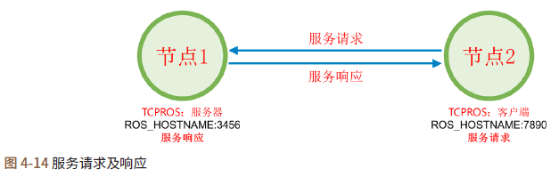

Establish connection only once，the connection terminated immediately after client/subscriber received response from server/publisher.

上述内容相当于消息通信中的话题。话题消息通信是只要发布者或订阅者不停止，会 持续地发布和订阅。服务分为下面两种。

- 服务客户端： 请求服务后等待响应
- 服务服务器： 收到服务请求后执行指定的任务，并发送响应。

服务服务器和客户端之间的连接与上述发布者和订阅者之间的TCPROS连接相同，但
是与话题不同，服务只连接一次，在执行请求和响应之后彼此断开连接。如果有必要，需
要重新连接。


**Action:** 

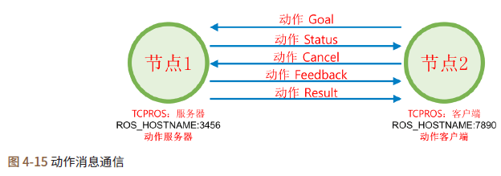

动作（action）在执行的方式上好像是在服务（service）的请求（goal）和响应(result）之间仅仅多了中途反馈环节，但实际的运作方式与话题相同。事实上，如果使用rostopic命令来查阅话题，那么可以看到该动作的goal、status、cancel、result和feedback等五个话题。动作服务器和客户端之间的连接与上述发布者和订阅中的TCPROS连接相同，但某些用法略有不同。例如，动作客户端发送取消命令或服务器发送结果值会中断连接，等。

Action may look similar to the request and the response of the service with an additional feedback message in order to provide intermediate result between the request (goal) and the response(result), but in practice it is rather more like a topic. In fact, if you use the ‘rostopic’ command to list up topics, there are five topics such as goal, status, cancel, result, and feedback
that are used in the action. The connection between the action server and the client is similar to the TCPROS connection of the publisher and subscriber, but the usage is slightly different. For example, when an action client sends a cancel command or the server sends a result value, the connection will be terminated.

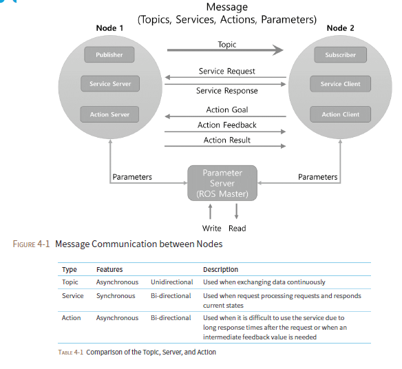


**Short Summary:**

- Nodes
  - Can pass messages to one another through topics, make service calls to other nodes, provide a service for other nodes, or set or retrieve shared data from a communal database called the parameter server.
- Topics
- Master


### Message Communication

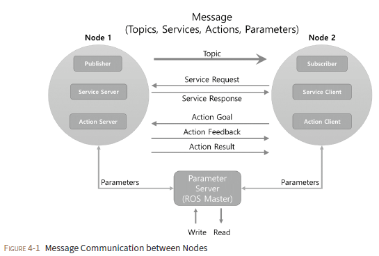

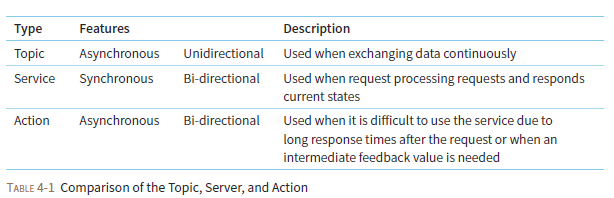


Topic:

- A communication channel between publisher and subscriber
- One-way communication

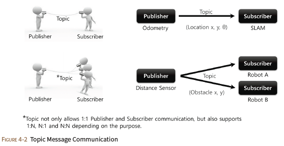

Service

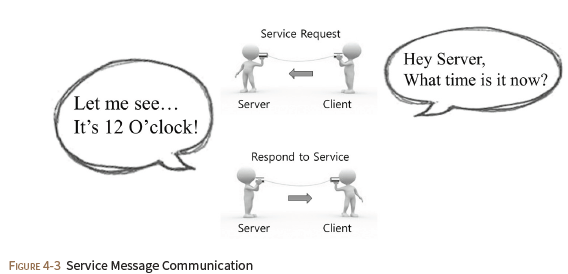

Action:

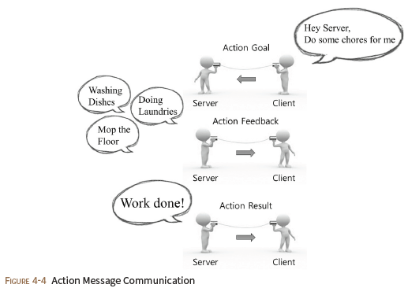


Example:

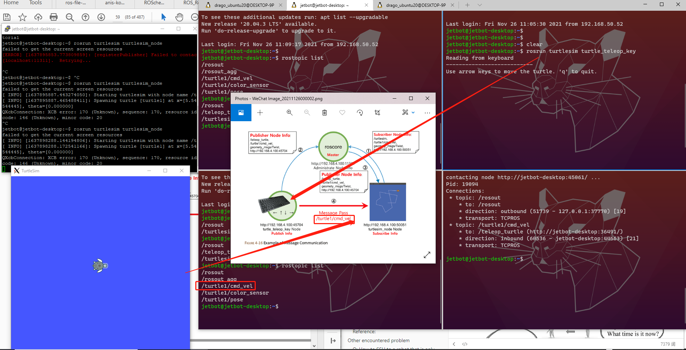


## Core ROS Tutorials

### Beginner Level


1. Navigating the ROS Filesystem

   This tutorial introduces ROS filesystem concepts, and covers using the roscd, rosls, and [rospack](http://wiki.ros.org/rospack) commandline tools.

2. Creating a ROS Package

   This tutorial covers using [roscreate-pkg](http://wiki.ros.org/roscreate) or [catkin](http://wiki.ros.org/catkin) to create a new package, and [rospack](http://wiki.ros.org/rospack) to list package dependencies.

3. Building a ROS Package

   This tutorial covers the toolchain to build a package.

#### Understanding ROS Nodes

This tutorial introduces ROS graph concepts and discusses the use of [roscore](http://wiki.ros.org/roscore), [rosnode](http://wiki.ros.org/rosnode), and [rosrun](http://wiki.ros.org/rosrun) commandline tools.

```bash
# start master node
$ roscore
# If roscore does not initialize and sends a message about lack of permissions, probably the ~/.ros folder is owned by root, change recursively the ownership of that folder with:
$ sudo chown -R <your_username> ~/.ros

# Lists all active nodes:
$ rosnode list
You will see:
/rosout	# The `rosout` node for subscribing, logging, and republishing the messages. See more here, http://wiki.ros.org/rosout

# The rosnode info command returns information about a specific node.
$ rosnode info /rosout


# Let's bring up another node
$ rosrun turtlesim turtlesim_node

$ rosnode list
You will see something similar to:
/rosout
/turtlesim

# Close/Terminal that window, and relaunch it with a custom node name:
$ rosrun turtles

# Now, if we go back and use rosnode list:
$ rosnode list
You will see something similar to:
/my_turtle
/rosoutim turtlesim_node __name:=my_turtle


# to test that it's up:
$ rosnode ping my_turtle
rosnode: node is [/my_turtle]
pinging /my_turtle with a timeout of 3.0s
xmlrpc reply from http://aqy:42235/     time=1.152992ms
xmlrpc reply from http://aqy:42235/     time=1.120090ms
xmlrpc reply from http://aqy:42235/     time=1.700878ms
xmlrpc reply from http://aqy:42235/     time=1.127958ms
```

**Review What was covered:**

- **roscore = ros+core :** master (provides name service for ROS) + rosout (stdout/stderr) + parameter server (parameter server will be introduced later)
- rosnode = ros+node : ROS tool to get information about a node.
- **rosrun = ros+run :** runs a node from a given package.


#### [Understanding ROS Topics](http://wiki.ros.org/ROS/Tutorials/UnderstandingTopics)

This tutorial introduces ROS topics as well as using the [rostopic](http://wiki.ros.org/rostopic) and [rqt_plot](http://wiki.ros.org/rqt_plot) commandline tools.

**Setup**

```bash
# Let's start by making sure that we have roscore running, in a new terminal:
$ roscore

# run turtlesim in a new terminal:
$ rosrun turtlesim turtlesim_node

# run turtle keyboard teleoperation in a new terminal, which allow us to drive the turtle around with
$ rosrun turtlesim turtle_teleop_key
```

##### **ROS Topics**

The `turtlesim_node` and the `turtle_teleop_key` node are communicating with each other over a ROS **Topic**. `turtle_teleop_key` is **publishing** the key strokes on a topic, while `turtlesim` **subscribes** to the same topic to receive the key strokes. Let's use [rqt_graph](http://wiki.ros.org/rqt_graph) which shows the nodes and topics currently running.

```bash
# Using rqt_graph: rqt_graph creates a dynamic graph of what's going on in the system. rqt_graph is part of the rqt package. Unless you already have it installed, run:
$ sudo apt-get install ros-<distro>-rqt
$ sudo apt-get install ros-<distro>-rqt-common-plugins

# In a new terminal:
$ rosrun rqt_graph rqt_graph
```

You will see something similar to:


Introducing rostopic

The `rostopic` tool allows you to get information about ROS **topics**.

You can use the help option to get the available sub-commands for `rostopic`

```bash
$ rostopic -h
# Or pressing tab key after rostopic prints the possible sub-commands:
$ rostopic 
bw    echo  find  hz    info  list  pub   type 
```

##### Using rostopic echo

`rostopic echo` shows the data published on a topic.

Usage:

```
rostopic echo [topic]
```

Let's look at the command velocity data published by the `turtle_teleop_key` node.

*For ROS Hydro and later,* this data is published on the `/turtle1/cmd_vel` topic. **In a new terminal, run:**

```bash
$ rostopic echo /turtle1/cmd_vel
linear: 
  x: 2.0
  y: 0.0
  z: 0.0
angular: 
  x: 0.0
  y: 0.0
  z: 0.0
```

You probably won't see anything happen because no data is being published on the topic. Let's make `turtle_teleop_key` publish data by pressing the arrow keys. **Remember if the turtle isn't moving you need to select the `turtle_teleop_key` terminal again.**

Now let's look at `rqt_graph` again. Press the refresh button in the upper-left to show the new node. As you can see `rostopic echo`, shown here in red, is now also **subscribed** to the `turtle1/command_velocity` topic.

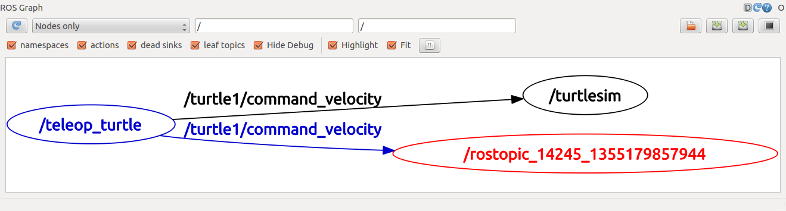


##### Using rostopic list

`rostopic list` returns a list of all topics currently subscribed to and published.

Let's figure out what argument the `list` sub-command needs. In a **new terminal** run:

```bash
$ rostopic list -h
# Or use the verbose option:
$ rostopic list -v
Published topics:
 * /turtle1/color_sensor [turtlesim/Color] 1 publisher
 * /turtle1/cmd_vel [geometry_msgs/Twist] 1 publisher
 * /rosout [rosgraph_msgs/Log] 2 publishers
 * /rosout_agg [rosgraph_msgs/Log] 1 publisher
 * /turtle1/pose [turtlesim/Pose] 1 publisher

Subscribed topics:
 * /turtle1/cmd_vel [geometry_msgs/Twist] 1 subscriber
 * /rosout [rosgraph_msgs/Log] 1 subscriber
```


##### ROS Messages

Communication on topics happens by sending ROS **messages** between nodes. For the publisher (`turtle_teleop_key`) and subscriber (`turtlesim_node`) to communicate, the publisher and subscriber must send and receive the same **type** of message. This means that a topic **type** is defined by the message **type** published on it. The **type** of the message sent on a topic can be determined using `rostopic type`.

`rostopic type` returns the message type of any topic being published.

Usage:

```
rostopic type [topic]
```

*For ROS Hydro and later,*

- Try:

  ```bash
  $ rostopic type /turtle1/cmd_vel
  geometry_msgs/Twist
  
  # We can look at the details of the message using rosmsg:
  $ rosmsg show geometry_msgs/Twist
  geometry_msgs/Vector3 linear
    float64 x
    float64 y
    float64 z
  geometry_msgs/Vector3 angular
    float64 x
    float64 y
    float64 z
  ```


ROS_Robot_Programming – 4.3. Message:

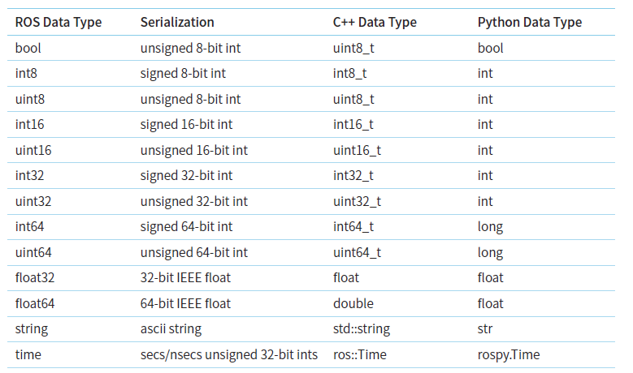

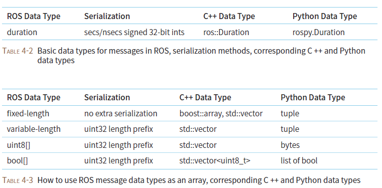


##### rostopic pub

`rostopic pub` publishes data on to a topic currently advertised.

Usage:

```
rostopic pub [topic] [msg_type] [args]
```

*For ROS Hydro and later,* example:

```bash
# rostopic pub [topic] [msg_type] [args]
$ rostopic pub -1 /turtle1/cmd_vel geometry_msgs/Twist -- '[2.0, 0.0, 0.0]' '[0.0, 0.0, 1.8]'
# rostopic pub -1 ==> publish one message then exit:
# /turtle1/cmd_vel ==> the name of the topic to publish to:
# geometry_msgs/Twist ==> the message type to use when publishing to the topic
# -- '[2.0, 0.0, 0.0]' '[0.0, 0.0, 1.8]'  ==> required arguments, with linear velocity value x=2.0, y=0.0, and z=0.0, and angular velocity value x=0.0, y=0.0, and z=1.8 

$ rostopic pub /turt1/cmd_vel geometry_msgs/Twist -r 1 -- '[2.0, 0.0, 0.0]' '[0.0, 0.0, 1.8]'
# -r 1 -- '[2.0, 0.0, 0.0]' '[0.0, 0.0, 1.8]' ==>  keep moving at 1 Hz steady stream of commands
```

The First command will send a single message to turtlesim telling it to move with a linear velocity of 2.0, and an angular velocity of 1.8 .

- .png)

The second command publishes the velocity commands at a rate of 1 Hz on the velocity topic.

- 2.png)

We can also look at what is happening in `rqt_graph`. Press the refresh button in the upper-left. The rostopic pub node (here in red) is communicating with the rostopic echo node (here in green):


As you can see the turtle is running in a continuous circle. In a **new terminal**, we can use `rostopic echo` to see the data published by our turtlesim:

```
rostopic echo /turtle1/pose
```


##### Using rostopic hz

`rostopic hz` reports the rate at which data is published.

Usage:

```
rostopic hz [topic]
```

Let's see how fast the `turtlesim_node` is publishing `/turtle1/pose`:

```bash
$ rostopic hz /turtle1/pose
subscribed to [/turtle1/pose]
average rate: 59.354
        min: 0.005s max: 0.027s std dev: 0.00284s window: 58
average rate: 59.459
        min: 0.005s max: 0.027s std dev: 0.00271s window: 118
average rate: 59.539
        min: 0.004s max: 0.030s std dev: 0.00339s window: 177
average rate: 59.492
        min: 0.004s max: 0.030s std dev: 0.00380s window: 237
average rate: 59.463
        min: 0.004s max: 0.030s std dev: 0.00380s window: 290
```


##### Using rqt_plot

`rqt_plot` displays a scrolling time plot of the data published on topics. Here we'll use `rqt_plot` to plot the data being published on the `/turtle1/pose` topic. First, start rqt_plot by typing

```
$ rosrun rqt_plot rqt_plot
```

in a new terminal. In the new window that should pop up, a text box in the upper left corner gives you the ability to add any topic to the plot. Typing `/turtle1/pose/x` will highlight the plus button, previously disabled. Press it and repeat the same procedure with the topic `/turtle1/pose/y`. You will now see the turtle's x-y location plotted in the graph.


##### All in one

```bash
# Let's start by making sure that we have roscore running, in a new terminal:
$ roscore

# run turtlesim in a new terminal:
$ rosrun turtlesim turtlesim_node

# run turtle keyboard teleoperation in a new terminal, which allow us to drive the turtle around with
$ rosrun turtlesim turtle_teleop_key

# Let's check all the nodes/process that are running
$ rosnode list
/rosout
/rostopic_16241_1637995735167
/rqt_gui_py_node_12850
/teleop_turtle
/turtlesim

# Let's see the communication topic that are running:
$ rostopic list		
/rosout
/rosout_agg
/statistics
/turtle1/cmd_vel
/turtle1/color_sensor
/turtle1/pose

# Now, we want to send some message in topic '/turtle1/cmd_vel' ==> But we first need to understand the data type for this topic, 
$ rostopic type /turtle1/cmd_vel
geometry_msgs/Twist
$ rosmsg show geometry_msgs/Twist
geometry_msgs/Vector3 linear
  float64 x
  float64 y
  float64 z
geometry_msgs/Vector3 angular
  float64 x
  float64 y
  float64 z
# ==> Combine two command in one
$ rostopic type /turtle1/cmd_vel | rosmsg show
geometry_msgs/Vector3 linear
  float64 x
  float64 y
  float64 z
geometry_msgs/Vector3 angular
  float64 x
  float64 y
  float64 z

# After understanding the data type, now, we can construct our message and send the command.
# rostopic pub [topic] [msg_type] [args]
$ rostopic pub -1 /turtle1/cmd_vel geometry_msgs/Twist -- '[2.0, 0.0, 0.0]' '[0.0, 0.0, 1.8]'
# rostopic pub -1 ==> publish one message then exit:
# /turtle1/cmd_vel ==> the name of the topic to publish to:
# geometry_msgs/Twist ==> the message type to use when publishing to the topic
# -- '[2.0, 0.0, 0.0]' '[0.0, 0.0, 1.8]'  ==> required arguments, with linear velocity value x=2.0, y=0.0, and z=0.0, and angular velocity value x=0.0, y=0.0, and z=1.8 

$ rostopic pub /turt1/cmd_vel geometry_msgs/Twist -r 1 -- '[2.0, 0.0, 0.0]' '[0.0, 0.0, 1.8]'
# -r 1 -- '[2.0, 0.0, 0.0]' '[0.0, 0.0, 1.8]' ==>  keep moving at 1 Hz steady stream of commands


# In a new terminal, we can use rostopic echo to see the real-time command_velocity data being published on a topic, in a new terminal, run:
$ rostopic echo /turtle1/cmd_vel
linear:
  x: 2.0
  y: 0.0
  z: 0.0
angular:
  x: 0.0
  y: 0.0
  z: 1.8
---

# In a new terminal, we can use rostopic echo to see the real-time pose data published by our turtlesim:
$ rostopic echo /turtle1/pose
x: 10.5013017654
y: 4.91405010223
theta: 1.550532341
linear_velocity: 2.0
angular_velocity: 1.79999995232

# rostopic hz reports the rate at which data is published.
$ rostopic hz /turtle1/pose
subscribed to [/turtle1/pose]
average rate: 16.485
        min: 0.016s max: 0.196s std dev: 0.07393s window: 16
average rate: 15.658
        min: 0.015s max: 0.206s std dev: 0.07571s window: 29
average rate: 15.525
```

You will see it’s running in a circle:

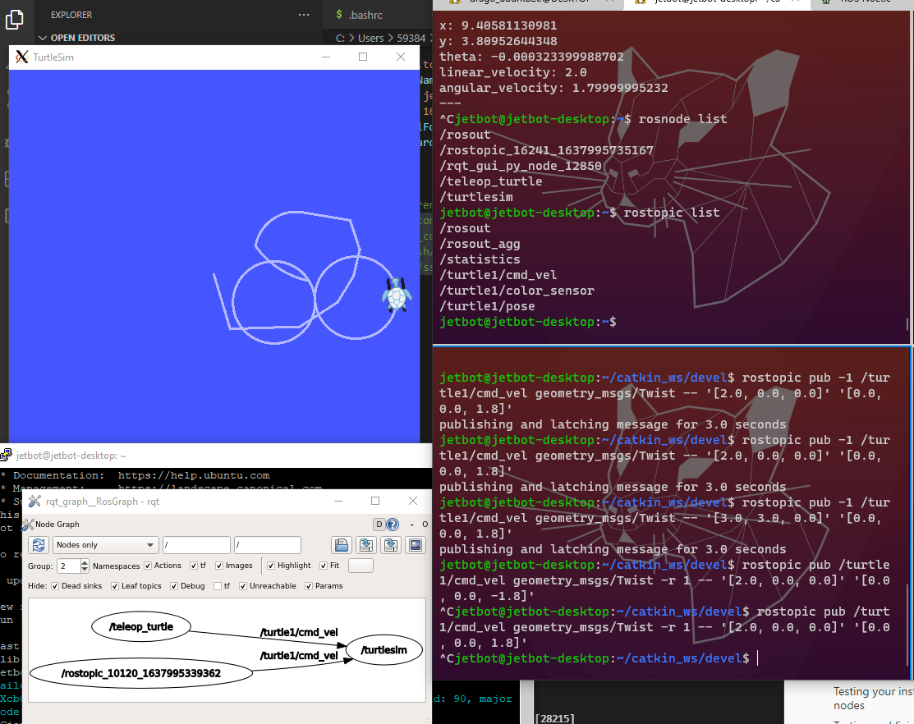


2. Understanding ROS Services and Parameters

   This tutorial introduces ROS services, and parameters as well as using the [rosservice](http://wiki.ros.org/rosservice) and [rosparam](http://wiki.ros.org/rosparam) commandline tools.

3. Using rqt_console and roslaunch

   This tutorial introduces ROS using [rqt_console](http://wiki.ros.org/rqt_console) and [rqt_logger_level](http://wiki.ros.org/rqt_logger_level) for debugging and [roslaunch](http://wiki.ros.org/roslaunch) for starting many nodes at once. If you use `ROS fuerte` or ealier distros where [rqt](http://wiki.ros.org/rqt) isn't fully available, please see this page with [this page](http://wiki.ros.org/ROS/Tutorials/UsingRxconsoleRoslaunch) that uses old `rx` based tools.

4. Using rosed to edit files in ROS

   This tutorial shows how to use [rosed](http://wiki.ros.org/rosbash) to make editing easier.

5. Creating a ROS msg and srv

   This tutorial covers how to create and build msg and srv files as well as the [rosmsg](http://wiki.ros.org/rosmsg), rossrv and roscp commandline tools.

6. Writing a Simple Publisher and Subscriber (C++)

   This tutorial covers how to write a publisher and subscriber node in C++.

7. Writing a Simple Publisher and Subscriber (Python)

   This tutorial covers how to write a publisher and subscriber node in python.

8. Examining the Simple Publisher and Subscriber

   This tutorial examines running the simple publisher and subscriber.

9. Writing a Simple Service and Client (C++)

   This tutorial covers how to write a service and client node in C++.

10. Writing a Simple Service and Client (Python)

    This tutorial covers how to write a service and client node in python.

11. Examining the Simple Service and Client

    This tutorial examines running the simple service and client.

12. Recording and playing back data

    This tutorial will teach you how to record data from a running ROS system into a .bag file, and then to play back the data to produce similar behavior in a running system

13. Reading messages from a bag file

    Learn two ways to read messages from desired topics in a bag file, including using the `ros_readbagfile` script.

14. Getting started with roswtf

    Basic introduction to the [roswtf](http://wiki.ros.org/roswtf) tool.

15. Navigating the ROS wiki

    This tutorial discusses the layout of the ROS wiki ([wiki.ros.org](http://wiki.ros.org/Documentation)) and talks about how to find what you want to know.

16. Where Next?

    This tutorial discusses options for getting to know more about using ROS on real or simulated robots.


### Intermediate Level


More client API tutorials can be found in the relevant package ([roscpp](http://wiki.ros.org/roscpp/Tutorials), [rospy](http://wiki.ros.org/rospy/Tutorials), [roslisp](http://wiki.ros.org/roslisp/Tutorials))


1. Creating a ROS package by hand.

   This tutorial explains how to manually create a ROS package.

2. Managing System dependencies

   This explains how to use [rosdep](http://wiki.ros.org/rosdep) to install system dependencies.

3. Roslaunch tips for large projects

   This tutorial describes some tips for writing roslaunch files for large projects. The focus is on how to structure launch files so they may be reused as much as possible in different situations. We'll use the 2dnav_pr2 package as a case study.

4. Running ROS across multiple machines

   This tutorial explains how to start a ROS system using two machines. It explains the use of `ROS_MASTER_URI` to configure multiple machines to use a single master.

5. Defining Custom Messages

   This tutorial will show you how to define your own custom message data types using the ROS [Message Description Language](http://wiki.ros.org/ROS/Message_Description_Language).

6. Using a C++ class in Python

   This tutorial illustrates a way to use a C++ class with ROS messages in Python.

7. Packaging your ROS project as a snap

   This tutorial covers how to package and deploy your ROS project as a snap.

8. How to Write a Tutorial

   This tutorial covers useful template and macros for writing tutorials, along with example tutorials that are available for guidance on [ros.org](http://wiki.ros.org/Documentation)


ROS2 Galactic Installation in WIndows:

- If you are a window user, follow this tutorial, [Building ROS 2 on Windows](http://docs.ros.org/en/galactic/Installation/Windows-Development-Setup.html)


This ROS node requires catkin_make_isolated or catkin build to build. This package depends on a number of other ROS packages which ship with the default installation of ROS. If they are not installed use [rosdep](http://wiki.ros.org/rosdep) to install them. In your catkin folder run

```bash
sudo rosdep init
rosdep update
rosdep install --from-paths src --ignore-src -r -y
```


### Fist time testing:

- Checking ros is running:

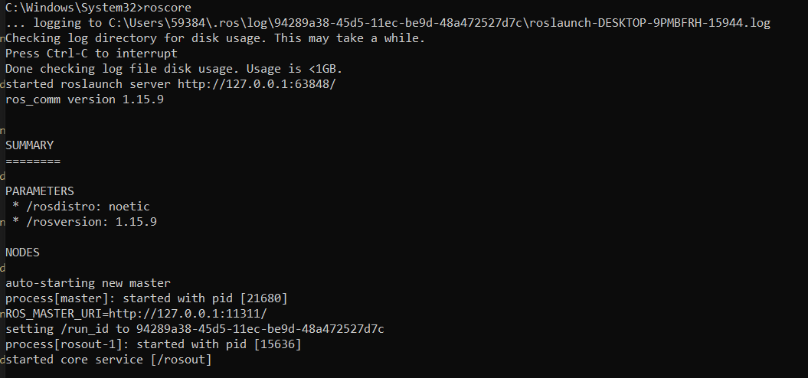

- See a list of topics with command: `rostopic list`

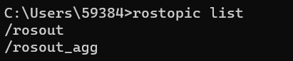

- Running Gazebo with command: `roslaunch gazebo_ros empty_world.launch`

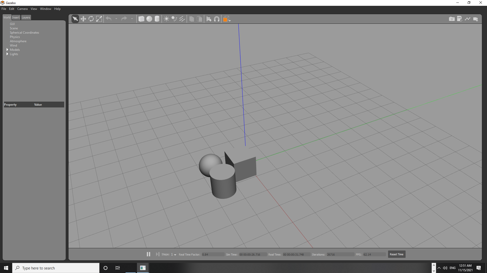

- Running ruiz with command: `rosrun rviz rviz`

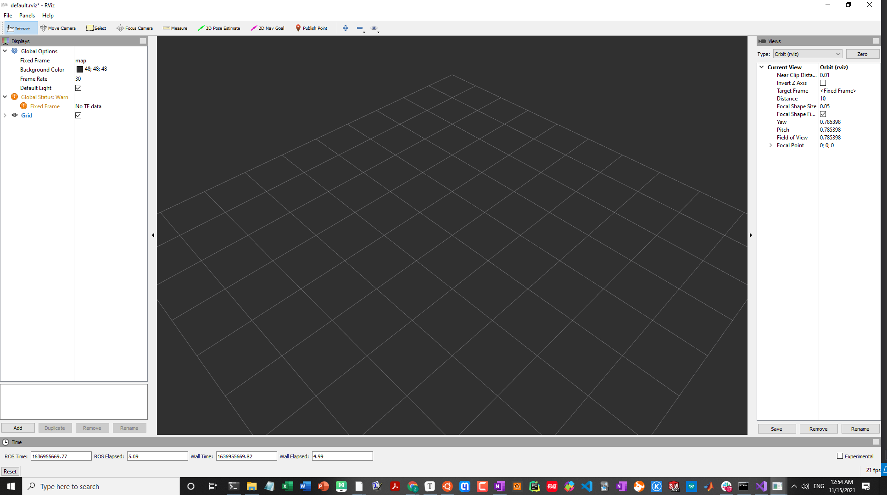


## Udemy: [ROS for Beginners: Basics, Motion, and OpenCV](https://www.udemy.com/course/ros-essentials/)

### Intro, Installation, Env Setup, and Test code

#### Installation

```bash
 1111  git clone https://github.com/aniskoubaa/ros_essentials_cpp.git
 1112  pip install -U rosdep rosinstall_generator wstool rosinstall six vcstools
 1113  cmake 
 1117  sudo apt-get install python3-opencv
 1118  python -V
 1123  roscd
 1129  sudo ln -s /usr/include/opencv4/opencv2/ /usr/include/opencv
 1130  cd catkin_ws/
 1134  catkin_make
```


Error1:

```bash
-- Using these message generators: gencpp;geneus;genlisp;gennodejs;genpy
CMake Error at /opt/ros/melodic/share/cv_bridge/cmake/cv_bridgeConfig.cmake:113 (message):
  Project 'cv_bridge' specifies '/usr/include/opencv' as an include dir,
  which is not found.  It does neither exist as an absolute directory nor in
  '${{prefix}}//usr/include/opencv'.  Check the issue tracker
  'https://github.com/ros-perception/vision_opencv/issues' and consider
  creating a ticket if the problem has not been reported yet.
Call Stack (most recent call first):
```

Solu: https://answers.ros.org/question/199279/installation-from-source-fails-because-of-cv_bridge-include-dir/

Add that thing to the symlink directory:

`sudo ln -s /usr/include/opencv4/opencv2/ /usr/include/opencv`


Error2:

```bash
[ 10%] Built target image_pub_sub_cpp
/home/jetbot/catkin_ws/src/ros_essentials_cpp/src/topic03_perception/cpp/open_copy.cpp:1:10: fatal error: opencv/highgui.h: No such file or directory
 #include <highgui.h>
          ^~~~~~~~~~~~~~~~~~
compilation terminated.
ros_essentials_cpp/CMakeFiles/open_copy_cpp.dir/build.make:62: recipe for target 'ros_essentials_cpp/CMakeFiles/open_copy_cpp.dir/src/topic03_perception/cpp/open_copy.cpp.o' failed
make[2]: *** [ros_essentials_cpp/CMakeFiles/open_copy_cpp.dir/src/topic03_perception/cpp/open_copy.cpp.o] Error 1
CMakeFiles/Makefile2:538: recipe for target 'ros_essentials_cpp/CMakeFiles/open_copy_cpp.dir/all' failed
make[1]: *** [ros_essentials_cpp/CMakeFiles/open_copy_cpp.dir/all] Error 2
make[1]: *** Waiting for unfinished jobs....
```

Solu:

https://stackoverflow.com/questions/14665245/compiling-in-opencv

 Replace that things with

```bash
#include "opencv2/highgui/highgui.hpp"
```


Error3:

```bash
[ 52%] Generating EusLisp code from ros_essentials_cpp/FibonacciResult.msg
/home/jetbot/catkin_ws/src/ros_essentials_cpp/src/topic03_perception/cpp/open_copy.cpp: In function ‘int main()’:
/home/jetbot/catkin_ws/src/ros_essentials_cpp/src/topic03_perception/cpp/open_copy.cpp:18:111: error: ‘CV_LOAD_IMAGE_COLOR’ was not declared in this scope
        image = imread("/home/riotu/catkin_ws/src/ros_essentials_cpp/src/topic03_perception/images/chess.jpg", CV_LOAD_IMAGE_COLOR);   // Read the file "image.jpg".
                                                                                                               ^~~~~~~~~~~~~~~~~~~
/home/jetbot/catkin_ws/src/ros_essentials_cpp/src/topic03_perception/cpp/open_copy.cpp:29:31: error: ‘CV_WINDOW_AUTOSIZ
’ was not declared in this scope
        namedWindow( "window", CV_WINDOW_AUTOSIZE ); // Create a window for display.
                               ^~~~~~~~~~~~~~~~~~
/home/jetbot/catkin_ws/src/ros_essentials_cpp/src/topic03_perception/cpp/open_copy.cpp:29:31: note: suggested alternative: ‘CV_MINOR_VERSION’
        namedWindow( "window", CV_WINDOW_AUTOSIZE ); // Create a window for display.
                               ^~~~~~~~~~~~~~~~~~
                               CV_MINOR_VERSION
```

Solu:

- https://stackoverflow.com/questions/24439548/opencv-tutorial-load-and-display-an-image-codeblocks-fedora20
- https://stackoverflow.com/questions/18682201/opencv-where-can-i-find-cv-window-autosize-constants


#### Testing your installation with C++ nodes


```bash
$ roscore
$ rosrun ros_essentials_cpp talker_node
$ rosrun ros_essentials_cpp listener_node
```


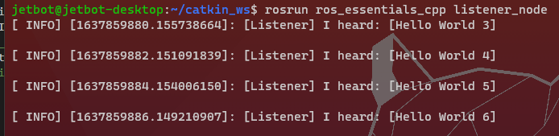

#### Testing and fixing installation with Python nodes

```bash
$ rosrun ros_essentials_cpp talker.py
$ rosrun ros_essentials_cpp listener.py
```

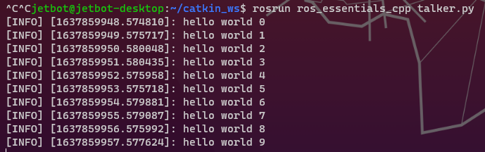

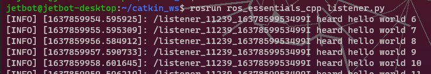


#### Creating ROS workspace

```bash
mkdir -p ~/catkin_ws/src
# Managing Your Environment
$ printenv | grep ROS
# ROS_ETC_DIR=/opt/ros/melodic/etc/ros
# ROS_ROOT=/opt/ros/melodic/share/ros
# ROS_MASTER_URI=http://localhost:11311
# ROS_VERSION=1
# ROS_PYTHON_VERSION=2
# ROS_PACKAGE_PATH=/opt/ros/melodic/share
# ROSLISP_PACKAGE_DIRECTORIES=
# ROS_DISTRO=melodic

source /opt/ros/melodic/setup.sh

# Create a ROS Workspace
mkdir catkin_ws
cd catkin_ws
mkdir -p src
cd src
catkin_init_workspace
printf "source ~/catkin_ws/devel/setup.bash" >> ~/.bashrc
cd ~/catkin_ws
catkin_make
source ~/catkin_ws/devel/setup.bash

# Checking ROS & Gazebo Versions
# On Ubunutu 16.04, you should have ROS Kinetic with Gazebo 7, whereas on Ubuntu 18.04, you should have ROS Melodic with Gazebo 9
rosversion -d
gazebo -v
```

Configuring Your ROS Environment (Optional)

```bash
$ export ROS_HOSTNAME=localhost
$ export ROS_MASTER_URI=http://localhost:11311	# Default port, just FYI
```


####  Creating ROS packages

```bash
cd ~/catkin_ws/src
catkin_create_pkg ros_basics_tutorial std_msgs rospy roscpp	# catkin_create_pkg <pkg_name> <dependencies...>
cd ..
ckin_make
cd ~/catkin_ws/src
ls
# Then you will see the package that you created for your project

# ...
# After you made some change, e.g., add some files(node) to the src, and you can call `catkin_make` to compile them and generate executable.
catkin_make
```


Error:

```bash
-- ros_essentials_cpp: 8 messages, 1 services
CMake Warning at /opt/ros/melodic/share/catkin/cmake/catkin_package.cmake:166 (message):
  catkin_package() DEPENDS on 'system_lib' but neither
  'system_lib_INCLUDE_DIRS' nor 'system_lib_LIBRARIES' is defined.
Call Stack (most recent call first):
```

Solu: 

https://get-help.robotigniteacademy.com/t/catkin-package-depends-on-the-catkin-package-other-catkin-pkg-which-must-therefore-be-listed-as-a-run-dependency-in-the-package-xml-help-needed-with-unit-6-on-services-in-ros-servers-messages/8237/2

Because you have multiple package and you want to catkin on a new package. it’s a good idea to specify the package you want to build with.

```bash
catkin_make --only-pkg-with-deps ros_basics_tutorial
```


#### Short Quiz:

> ### Check all correct answers for the CMakeLists.txt file.
>
> - CMakeLists.txt file describes how to build the code and where to install it to
> - The file CMakeLists.txt is the input to the CMake build system for building software packages
>
> ### It is a good practice to source your overlay workspace in the .bashrc rather than sourcing it every time when you open a new terminal
>
> - True
>
> ### Image you have create a new workspace called catkin_ws in the path /home/user/ and you use a ROS Kinetic version. What is the command you must execute to enable the workspace that you have created?
>
> - source /home/user/catkin_ws/devel/setup.bash
>
> ### `roscd` this command takes you to the last ROS workspace that you have sourced its `setup.bash`.
>
> - True
>
> ### `roscd` this command takes you to the default ROS package
>
> - False
>
> ### Check all correct answers
>
> - A ROS workspace contains three main folders: a `source` folder, a `devel` folder and a `build` folder.
> - A ROS workspace is a user directory that we will used to create the user ROS packages
> - A ROS workspace is built using `catkin_make` command
>
> ### Check all correct answers for the file `package.xml`.
>
> - `package.xml` is used to describe the package and set its dependencies
> - `package.xml` is automatically generated when creating a new ROS package
> - `package.xml` defines two types of dependencies: (1) dependencies needed to build a package, (2) dependencies needed to execute the package
> - You can define a liencese of your package in `package.xml`.
>
> ### What is the command used to create a new ROS package called my_package
>
> - cd ~/catkin_ws/src
> - catkin_create_pkg my_package std_msgs rospy roscpp


### ROS Computation Graph

- What is ROS computation graph?

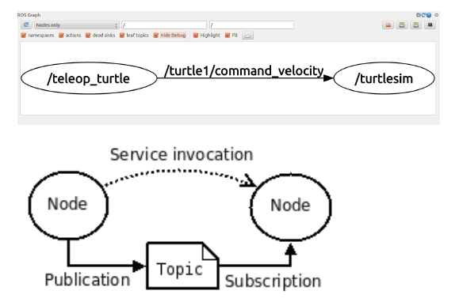

- Run a new node: Turtlesim Simulator

```bash
rosrun turtlesim turtlesim_node
rosnode list
rostopic list
rosrun turtlesim turtle_teleop_key
```


### TurtuleSim simulation demo

- After launch the turtlesim with command,  `rosrun turtlesim turtlesim_node`

terminal 1

```bash
jetbot@jetbot-desktop:~$ rosrun turtlesim turtlesim_node
failed to get the current screen resources
[ INFO] [1637895887.443274050]: Starting turtlesim with node name /turtlesim
[ INFO] [1637895887.465488411]: Spawning turtle [turtle1] at x=[5.544445], y=[5.544445], theta=[0.000000]
QXcbConnection: XCB error: 170 (Unknown), sequence: 170, resource id: 90, major code: 146 (Unknown), minor code: 20

```

terminal 2:

```bash
jetbot@jetbot-desktop:~$ rostopic list
/rosout
/rosout_agg
/turtle1/cmd_vel
/turtle1/color_sensor
/turtle1/pose
```

terminal 3:

```bash
jetbot@jetbot-desktop:~$ rosnode list
/rosout
/turtlesim
```

- After launched the turtle`$ rosrun turtlesim turtle_teleop_key`

terminal 1

```bash
jetbot@jetbot-desktop:~$ rosrun turtlesim turtle_teleop_key
Reading from keyboard
---------------------------
Use arrow keys to move the turtle. 'q' to quit.
```

terminal 2:

```bash
jetbot@jetbot-desktop:~$ rostopic list
/rosout
/rosout_agg
/turtle1/cmd_vel
/turtle1/color_sensor
/turtle1/pose
```

terminal 3:

```bash
jetbot@jetbot-desktop:~$ rosnode list
/rosout
/teleop_turtle
/turtlesim
```

terminal 4:

```bash
jetbot@jetbot-desktop:~$ rosnode info /turtlesim
--------------------------------------------------------------------------------
Node [/turtlesim]
Publications:
 * /rosout [rosgraph_msgs/Log]
 * /turtle1/color_sensor [turtlesim/Color]
 * /turtle1/pose [turtlesim/Pose]

Subscriptions:
 * /turtle1/cmd_vel [geometry_msgs/Twist]

Services:
 * /clear
 * /kill
 * /reset
 * /spawn
 * /turtle1/set_pen
 * /turtle1/teleport_absolute
 * /turtle1/teleport_relative
 * /turtlesim/get_loggers
 * /turtlesim/set_logger_level


contacting node http://jetbot-desktop:45061/ ...
Pid: 19094
Connections:
 * topic: /rosout
    * to: /rosout
    * direction: outbound (51739 - 127.0.0.1:37770) [19]
    * transport: TCPROS
 * topic: /turtle1/cmd_vel
    * to: /teleop_turtle (http://jetbot-desktop:36491/)
    * direction: inbound (60536 - jetbot-desktop:44663) [21]
    * transport: TCPROS
```


```bash
# Getting more information about certain node
rosnode info /turtlesim

# Getting more information about certain topics
rostopic info /turtle1/cmd_vel

# Show all running topics
rostopic list

# List all the running node/process
rosnode list
```


Getting more information about certain topics, with command, `rostopic info /turtle1/cmd_vel`

See the figure below, the /turtlesim is listening/subscribing at /teleop_turtle 

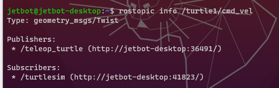

Let’s check more information about /turtlesim node:

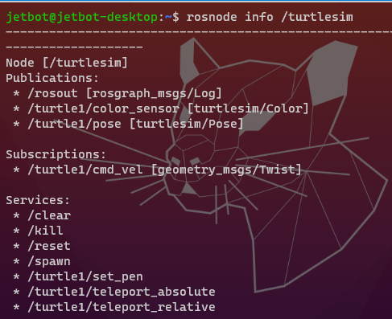

As /turtlesim node itself, we see it


ROS topic

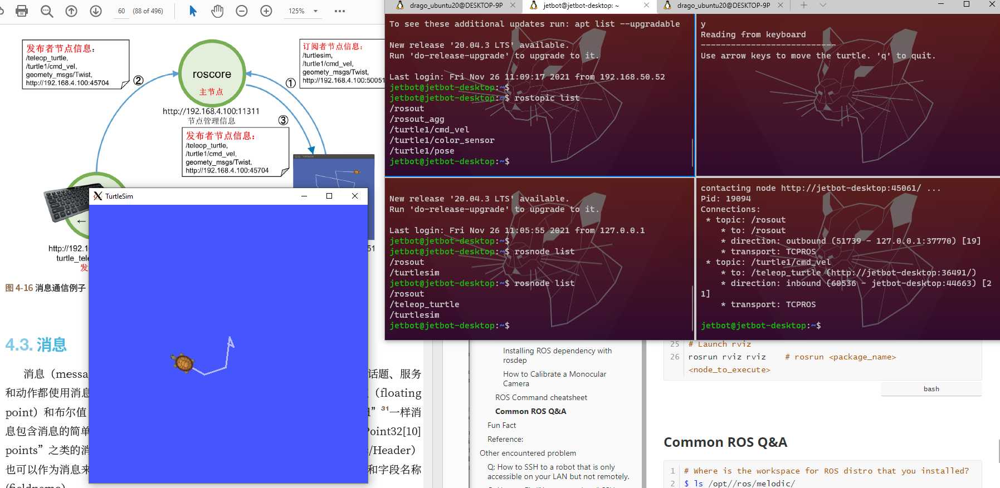

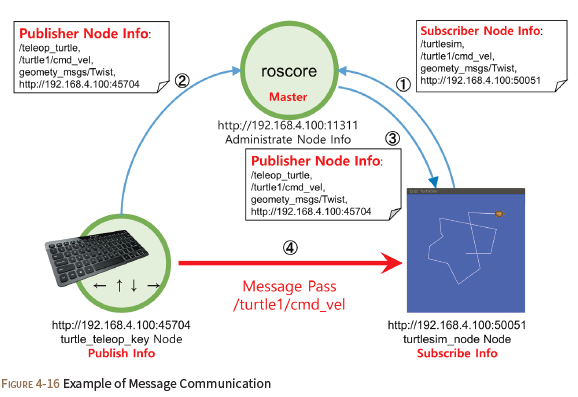

- 


### Optional Setup


#### How to enable GUI on windows

- With Visual Studio ssh remote access
  - With VcXsrv, https://stackoverflow.com/questions/39695166/visual-studio-code-on-linux-xwindow-forwarding/40013437#40013437 ==> Basically you need to download VcXsrv 
  - With FastX3, https://www.starnet.com/xwin32kb/fastx-3-installation/#UbuntuDebian_Based_Systems
  - Troubleshooting X server, https://www.cs.odu.edu/~zeil/cs252/sum21/Public/xtrouble/index.html#/
  - 
- 


#### Installing ROS dependency with rosdep

- [http://wiki.ros.org/rosdep](http://wiki.ros.org/rosdep)

```bash
# ROS Noetic
sudo apt-get install python3-rosdep
# ROS Melodic and earlier
sudo apt-get install python-rosdep
# On non ubuntu platforms, Use pip:
sudo pip install -U rosdep

# Initializing rosdep
sudo rosdep init
rosdep update

### Using rosdep: Install dependency of a particular package
$  rosdep install AMAZING_PACKAGE
### Install dependency of all packages in the workspace
# This usecase shows even more powerful feature of rosdep. Go to the top directory of your catkin workspace where the source code of the ROS packages you'd like to use are. Then run:
$ rosdep install --from-paths src --ignore-src -r -y
# This command magically installs all the packages that the packages in your catkin workspace depend upon but are missing on your computer.

### Use source-installed rosdep
# Clone the development repository. This doesn't need to be done in a directory in ROS_PACKAGE_PATH. Then at its top directory, source setup.sh. In concrete:
$ git clone https://github.com/ros-infrastructure/rosdep
$ cd rosdep
$ source setup.sh


```


#### How to Calibrate a Monocular Camera

- http://wiki.ros.org/camera_calibration/Tutorials/MonocularCalibration

```bash
# Start by getting the dependencies and compiling the driver. Make sure that your monocular camera is publishing images over ROS. Let's list the topics to check that the images are published:
$ rosdep install camera_calibration

# This will show you all the topics published, check to see that there is an image_raw topic. The default topics provided by most ROS camera drivers are:
$ rostopic list

# This will open up the calibration window which will highlight the checkerboard:
$ rosrun camera_calibration cameracalibrator.py --size 8x6 --square 0.108 image:=/camera/image_raw camera:=/camera


$ rosrun camera_calibration cameracalibrator.py --size 7x7 --square 0.045 image:=/camera/image_raw camera:=/camera video_device:=csi://0
```


### ROS Command cheatsheet	


```bash
# Starting ros master node
roscore	

# Takes you to the last ROS workspace that you have sourced in setup.bash
$ roscd	
# Navigat to the shared folder of build-in node:
$ rosnode list
/rosout
/rostopic_22930_1637998293550
/teleop_turtle
/turtlesim
jetbot@jetbot-desktop:/opt/ros/melodic/share/usb_cam$ roscd t
urtlesim
jetbot@jetbot-desktop:/opt/ros/melodic/share/turtlesim$ ls
cmake  images  msg  package.xml  srv
# Now, we can find out more information about turtlesim node, such as:
$ cd launch
$ sudo nano usb_cam-test.launch


# Run some ros package
# rosrun <package_name> <node_name>
$ rosrun ros_essentials_cpp talker_node
$ rosrun ros_essentials_cpp listener_node
$ rosrun ros_essentials_cpp talker.py
$ rosrun ros_essentials_cpp listener.py

# Getting more information about certain node
rosnode info /turtlesim

# Getting more information about certain topics
rostopic info /turtle1/cmd_vel

# Show all running topics
rostopic list

# List all the running node/process
rosnode list

# Launch gazebo
# roslaunch <package_name> <launch_name>
roslaunch gazebo_ros empty_world.launch

# Launch rviz
rosrun rviz rviz	# rosrun <package_name> <node_to_execute>
```


### Common ROS Q&A

```bash
# Where is the workspace for ROS distro that you installed?
$ ls /opt//ros/melodic/
```

- How to check all the env variable define for ROS?

```bash
jetbot@jetbot-desktop:~$ printenv | grep ROS
# ==> Output
ROS_ETC_DIR=/opt/ros/melodic/etc/ros
ROS_ROOT=/opt/ros/melodic/share/ros
ROS_MASTER_URI=http://localhost:11311
ROS_VERSION=1
ROS_PYTHON_VERSION=2
ROS_PACKAGE_PATH=/home/jetbot/catkin_ws/src:/opt/ros/melodic/share
ROSLISP_PACKAGE_DIRECTORIES=/home/jetbot/catkin_ws/devel/share/common-lisp
ROS_DISTRO=melodic
```


## Fun Fact

- Types of Robots, https://robots.ieee.org/learn/types-of-robots/
- The PR2 is one of the most advanced research robots ever built. Each PR2, short for Personal Robot 2, costs U.S. $400,000


## Reference:

- Implementing ORB-SLAM on Ubuntu 18.04 & ROS Melodic, https://medium.com/@mhamdaan/implementing-orb-slam-on-ubuntu-18-04-ros-melodic-606e668deffa
- YouTube, Justin Huang ROS Tutorial, https://www.youtube.com/watch?v=9U6GDonGFHw&list=PLJNGprAk4DF5PY0kB866fEZfz6zMLJTF8


# Other encountered problem


## Q: How to SSH to a robot that is only accessible on your LAN but not remotely.  

- Problem Description: Basically, your ISP didn’t provide you with a public IP address, so that IP address that you saw in your robot is a private IP address, and it’s not possible to connect to your machine directly via the internet.  Therefore, if you want to expose your localhost server behind a NAT or firewall to the public internet for development of testing purpose, there are two solution for this problem: **1) Router Configuration:** This can be solved by configuring NAT (Network Address Translation) on your router, but this doesn’t always work, and it requires you to change the configuration on your router, which isn’t always desirable. This solution also doesn’t work when you don’t have admin access on your network. **2) Ngrok**. Ngrok is a free, open source and cross-platform reverse proxy server for exposing local servers behind NATs and firewalls to the public Internet over secure tunnels. It is a remarkable computer program that you can use to implement personal cloud services directly from home. It essentially establishes secure tunnels to your localhost, thus enabling you to: run demos of web sites before actual deployment, testing mobile apps connected to your locally running backend and building web-hook consumers on your development machine.

- Code:

```
$ mkdir ngrok
$ cd ngrok/
$ wget -c https://bin.equinox.io/c/4VmDzA7iaHb/ngrok-stable-linux-arm64.zip	# Note: you need to check your CPU architecture first, with command 'lscpu', and 'chmod +rx ngrok' to make it executable.
$ unzip ngrok-stable-linux-arm64.zip
$ ls
$ ./ngrok authtoken <your_auth_token>
$ ./ngrok tcp 22	# ngrok TCP tunnels allow you to expose any networked service that runs over TCP. This is commonly used to expose SSH, game servers, databases and more.
```

- Reference: [1-3 are important, 4-6 doesn’t work for this case]
  1. ngrok Dashboard, https://dashboard.ngrok.com/get-started/tutorials
  2. How to Test Local Websites or Apps on Internet Using Ngrok, https://www.tecmint.com/test-local-websites-on-internet-using-ngrok/
  3. How to use ngrok to remote ssh to rpi(Raspberry Pi)?, https://forums.raspberrypi.com/viewtopic.php?t=77499
  4. How to Create SSH Tunneling or Port Forwarding in Linux, https://www.tecmint.com/create-ssh-tunneling-port-forwarding-in-linux/
  5. 11 Best Tools to Access Remote Linux Desktop, https://www.tecmint.com/best-remote-linux-desktop-sharing-software/
  6. How to Install and Configure VNC Server in CentOS 7, https://www.tecmint.com/install-and-configure-vnc-server-in-centos-7/


## Q: How to Fix “No route to host” SSH Error in Linux, https://www.tecmint.com/fix-no-route-to-host-ssh-error-in-linux/

