# Table of contents

{: .no_toc .text-delta }

1. TOC
{: toc }

 

[TOC]


# Robot Category:

**我定义的类别：**

1. Mobile Robot: 只要是带轮子的，履带也算，反正以轮子作为驱动 ==》 这研究就是 robot motion control, path planning/navigation 这一块，还有就是些是视觉的东西，比如 object detection, object avoidance, object following. 
2. 爬虫类：所有考腿来移动的，用的都是rigit body作为支架，比如robot dog, 模拟人的/动物的腿的，都算, 这主要研究的就是static and dynamic mechanics了
3. Drone：所有能在天上飞的，不管是翅膀驱动，还是螺旋桨驱动的
4. Industrial robot: 带机械臂的，不用移动的那种 ==> 这个可以研究的东西就很多了, 但大多都是控制上面的，robot arm manipulation, 3D space configuration, forward/backward kinematic,  还有robustness and safety 层面的，比如如何不伤害到人, 紧急情况能安全的停下来。。。

==》 搞懂上面这4种基本就够了

**别人的定义**

==>大多数人都是按照应用场景来分，但作为研究或者开发人员，我认为还是我那一套合适。

==》 比如 Drone, Entertainment(那种智能娃娃狗, involve Human-Robot Interaction， NLP 之类的research), Disaster Response， Educational (和3D Printing, Lego, Toy project相关，能够快速落地的，快速assemble的robot), Medical robot (da vinci), Underwater, Self-Driving car, Military & Security, Industrial, Humanoids 

==> 具体参考这里， https://robots.ieee.org/learn/types-of-robots/

Consumer: Consumer robots are robots you can buy and use just for fun or to help you with tasks and chores. Examples are the robot dog Aibo, the Roomba vacuum, AI-powered robot assistants, and a growing variety of robotic toys and kits.

Entertainment: These robots are designed to evoke an emotional response and make us laugh or feel surprise or in awe. Among them are robot comedian RoboThespian, Disney’s theme park robots like Navi Shaman, and musically inclined bots like Partner.

Disaster Response: These robots perform dangerous jobs like searching for survivors in the aftermath of an emergency. For example, after an earthquake and tsunami struck Japan in 2011, Packbots were used to inspect damage at the Fukushima Daiichi nuclear power station.

Drones: Also called unmanned aerial vehicles, drones come in different sizes and have different levels of autonomy. Examples include DJI’s popular Phantom series and Parrot’s Anafi, as well as military systems like Global Hawk, used for long-duration surveillance.

Education: This broad category is aimed at the next generation of roboticists, for use at home or in classrooms. It includes hands-on programmable sets from Lego, 3D printers with lesson plans, and even teacher robots like EMYS.

Medical: Medical and health-care robots include systems such as the da Vinci surgical robot and bionic prostheses, as well as robotic exoskeletons. A system that may fit in this category but is not a robot is Watson, the IBM question-answering supercomputer, which has been used in healthcare applications.

Industrial: The traditional industrial robot consists of a manipulator arm designed to perform repetitive tasks. An example is the Unimate, the grandfather of all factory robots. This category includes also systems like Amazon's warehouse robots and collaborative factory robots that can operate alongside human workers.


Humanoids: This is probably the type of robot that most people think of when they think of a robot. Examples of humanoid robots include Honda’s Asimo, which has a mechanical appearance, and also androids like the Geminoid series, which are designed to look like people.

Military & Security: Military robots include ground systems like Endeavor Robotics' PackBot, used in Iraq and Afghanistan to scout for improvised explosive devices, and BigDog, designed to assist troops in carrying heavy gear. Security robots include autonomous mobile systems such as Cobalt.

Self-Driving Cars: Many robots can drive themselves around, and an increasing number of them can now drive *you* around. Early autonomous vehicles include the ones built for DARPA’s autonomous-vehicle competitions and also Google’s pioneering self-driving Toyota Prius, later spun out to form Waymo.

Underwater: The favorite place for these robots is in the water. They consist of deep-sea submersibles like Aquanaut, diving humanoids like Ocean One, and bio-inspired systems like the ACM-R5H snakebot.


Written by Erico Guizzo. Date published: 2018-08-01; Date modified: 2020-05-28


# Overview of SLAM

## About Jetbot:

- NVIDIA JetBot: Jetson Nano Vision-Controlled AI Robot, https://www.youtube.com/watch?v=wKMWjIKaU68
- Github, [NVIDIA-AI-IOT/jetbot](https://github.com/NVIDIA-AI-IOT/jetbot/)
- [Github], [dusty-nv/jetson-inference](https://github.com/dusty-nv/jetson-inference)
- Completed Tutorial to NVIDIA Jetson AI JetBot Robot Car Project, https://drago1234.github.io/ai-Jetbot-car-project.html#reference-1
- Explaining Jetbot AI Kit Hector SLAM, https://www.youtube.com/watch?v=Noo3RmavB6I


## Important Concept:

SLAM的就两件事：建图和定位

- Build a map of the environment
- Locate the device within that environment

比如，一个最经典的例子就是扫地机器人。一开始，你不知道你在哪，你也不知大周围的环境是怎么样的，障碍物在哪。

对，你有Camera，但你能通过camera来定位吗？确定的位置有一定是真实的吗？

==》现实是，所有的的定位装置，sensor都是impect, 都会带有误差的，哪怕GPS，也是一样。那怎么样才能最大的减小误差呢？ 

==》 The key is, those landmark or points have spatial relationship to each other. As a result, you get a probability distribution of where every position could be. For some points, you might have a higher precision. For others, the uncertainty might be large. Frequently used algorithms to calculate the positions based on uncertainties are the **Extended Kalman Filter**, Maximum a Posteriori (MAP) estimation or **Bundle Adjustment (BA)**.


EKF 很好理解，检测到闭环后，决定是要相信观测到的值多一些，还是估计的值多一些？然后做一次更新，

However, there are some challenges:

- Huge Computation Cost: Because of the relationships between the points, every new sensor update influences all positions and updates the whole map. Keeping everything up to date requires a significant amount of math.
- Accumulated inaccuracy: In [“Globally consistent range scan alignment for environment mapping”](https://link.springer.com/article/10.1023/A:1008854305733) (1997), Lu and Milios describe the basics of the issue. In the figure above, (a) shows how range scan errors accumulate over time. Going from one position P*1* … P*n*, each little measurement error accumulates over time, until the resulting environment map isn’t consistent anymore.


### Bundle Adjustment

TO-READ:

- [Visual SLAM -- Why Bundle Adjust?](https://arxiv.org/pdf/1902.03747.pdf)


Based on [Bundle Adjustment - 5 Minutes with Cyrill](https://www.youtube.com/watch?v=lmj2Jk5tl60)

- An estimation technique that is used to estimate the 3D location of points in the environment, and those points have been estimated from camera images, as well as where the camera was when taking the images and where it was looking to 
- So estimate the location of the cameras and the points jointly, so that the error of twhere the points are projected to is minimized. 
- So, we wanna to minimize the reprojection error, that means we assume we know the location of camera and the location of the points in the environment and then we are projecting point into a camera image, which gives us a pixel coordinate of that point
- So where would that point be projected to if my estimated would be correct
-  And we compare this location to the actual location where we observed this point in our image, and what we’re trying to do is to minimize this discrepancy, 
- Bundle adjustiment is a statistical optimal solution, making some assumption, such as gaussian noise and the dependencies, how the mapping of the features into your camera images actually happen, and also assuming known data associatio.  

### ORB-SLAM

Reference:

- [ORB-SLAM3] Carlos Campos, Richard Elvira, Juan J. Gómez Rodríguez, José M. M. Montiel and Juan D. Tardós, **ORB-SLAM3: An Accurate Open-Source Library for Visual, Visual-Inertial and Multi-Map SLAM**, *IEEE Transactions on Robotics, 2021* **[PDF](https://arxiv.org/abs/2007.11898)**. [[Github](https://github.com/UZ-SLAMLab/ORB_SLAM3), [Demo Video](https://www.youtube.com/channel/UCXVt-kXG6T95Z4tVaYlU80Q)]
- [ORB-SLAM2] Raúl Mur-Artal and Juan D. Tardós. **ORB-SLAM2: an Open-Source SLAM System for Monocular, Stereo and RGB-D Cameras**. *IEEE Transactions on Robotics,* vol. 33, no. 5, pp. 1255-1262, 2017. **[PDF](https://arxiv.org/pdf/1610.06475.pdf)**
- [ORB_SLAM] Raúl Mur-Artal, José M. M. Montiel and Juan D. Tardós. **ORB-SLAM: A Versatile and Accurate Monocular SLAM System**. *IEEE Transactions on Robotics,* vol. 31, no. 5, pp. 1147-1163, 2015. (**2015 IEEE Transactions on Robotics Best Paper Award**). **[PDF](https://arxiv.org/pdf/1502.00956.pdf)**.
- [DBoW2 Place Recognition] Dorian Gálvez-López and Juan D. Tardós. **Bags of Binary Words for Fast Place Recognition in Image Sequences**. *IEEE Transactions on Robotics,* vol. 28, no. 5, pp. 1188-1197, 2012. **[PDF](http://doriangalvez.com/php/dl.php?dlp=GalvezTRO12.pdf)**
- [IMU-Initialization] Carlos Campos, J. M. M. Montiel and Juan D. Tardós, **Inertial-Only Optimization for Visual-Inertial Initialization**, *ICRA 2020*. **[PDF](https://arxiv.org/pdf/2003.05766.pdf)**
- [ORBSLAM-Atlas] Richard Elvira, J. M. M. Montiel and Juan D. Tardós, **ORBSLAM-Atlas: a robust and accurate multi-map system**, *IROS 2019*. **[PDF](https://arxiv.org/pdf/1908.11585.pdf)**
- [ORBSLAM-VI] Raúl Mur-Artal, and Juan D. Tardós, **Visual-inertial monocular SLAM with map reuse**, IEEE Robotics and Automation Letters, vol. 2 no. 2, pp. 796-803, 2017. **[PDF](https://arxiv.org/pdf/1610.05949.pdf)**
- 
- 
- 


### Anatomy of SLAM

How to apply and solve this in an Augmented Reality scenario?

A good starting point for understanding SLAM principles is: [“Past, Present, and Future of Simultaneous Localization and Mapping: Towards the Robust-Perception Age”](https://ieeexplore.ieee.org/abstract/document/7747236/) (2016) by Cadena et. al. They describe the typical architecture of SLAM as follows:

SLAM Algorithm Overview


## Installation & Env Setup

```bash
# Installs the navigation stack.
sudo apt-get install ros-noetic-navigation
# Installs the SLAM package.
sudo apt-get install ros-noetic-slam-gmapping

sudo apt-get update
sudo apt-get upgrade

# This will install the core packages of Turtlebot3.
$ cd ~/catkin_ws/src/
$ git clone https://github.com/ROBOTIS-GIT/turtlebot3_msgs.git -b melodic-devel
$ git clone  https://github.com/ROBOTIS-GIT/turtlebot3.git -b melodic-devel
$ cd ~/catkin_ws && catkin_make

# Install Turtlebot3 simulator
$ cd ~/catkin_ws/src/
$ git clone https://github.com/ROBOTIS-GIT/turtlebot3_simulations.git
$ cd ~/catkin_ws && catkin_make

catkin_make


# made the modification in .bashrch file as follows:
vim ~/.bashrc
# Making alias is optional but recommended to speed-up typing the commands.
alias burger='export TURTLEBOT3_MODEL=burger'
alias waffle='export TURTLEBOT3_MODEL=waffle'
alias tb3fake='roslaunch turtlebot3_fake turtlebot3_fake.launch'
alias tb3teleop='roslaunch turtlebot3_teleop turtlebot3_teleop_key.launch'
alias tb3='roslaunch turtlebot3_gazebo turtlebot3_empty_world.launch'
alias tb3maze='roslaunch turtlebot3_gazebo turtlebot3_world.launch'
alias tb3house='roslaunch turtlebot3_gazebo turtlebot3_house.launch'

# Reuired: At the end of the file, write the following commands. The last command will let you open Gazebo on a Virtual Machine and avoid crashing its display.
source /opt/ros/noetic/setup.bash
source /home/akoubaa/catkin_ws/devel/setup.bash
export TURTLEBOT3_MODEL=waffle
export SVGA_VGPU10=0

```


```bash


roslaunch turtlebot3_gazebo turtlebot3_gazebo_rviz.launch
```


## Hector SLAM – [Explaining Jetbot AI Kit Hector SLAM](https://www.youtube.com/watch?v=Noo3RmavB6I)

[video], https://www.youtube.com/watch?v=Noo3RmavB6I

[code] https://github.com/issaiass/jetbot_diff_drive

ROS.org [hector_mapping documentation](http://wiki.ros.org/hector_mapping)

- Github
  - [HECTOR SLAM INSTALLATION GUIDE & TUTORIALS](https://github.com/samialperen/oko_slam/blob/master/doc/hector_slam_tutorial.md)
  - [Cartographer_ROS SLAM INSTALLATION GUIDE & TUTORIALS](https://github.com/samialperen/oko_slam/blob/master/doc/cartographer_slam_tutorial.md)

```bash
# Create a ROS ros workspace and compile an empty package:
cd ~
mkdir -p catkin_ws/src
cd catkin_ws
catkin_make

ROS.org Open the .bashrc with nano:
nano ~/.bashrc

# Insert this line at the end of the ~/.bashrc file for sourcing your workspace:
source ~/catkin_ws/devel/setup.bash

# Clone this repo in the ~/catkin_ws/src folder by typing:
cd ~/catkin_ws/src
git clone https://github.com/issaiass/jetbot_diff_drive --recursive
git clone https://github.com/issaiass/realsense_gazebo_plugin
git clone https://github.com/issaiass/hector_gazebo_plugins
cd ..

catkin_make
source ~/catkin_ws/devel/setup.bash

roslaunch jetbot_gazebo spawn_jetbot.launch world_name:='$(find jetbot_gazebo)/worlds/turtle3_house.world'
# roslaunch jetbot_gazebo spawn_jetbot.launch world_name:=<your_world>

roslaunch jetbot_slam jetbot_slam.launch slam_methods:=hector


# Go to the root folder ~/catkin_ws and make the folder running catkin_make to ensure the application compiles. Now, let's test the robot simulation.
# 1st terminal - mount only the robot description
roslaunch jetbot_description description.launch
# 2nd terminal (optional) - get the robot description
rosparam get /robot_description
# Visualizing the robot in rviz
roslaunch jetbot_viz view_model.launch
# example... visualize the robot in rviz and disable intel realsense
roslaunch jetbot_viz view_model.launch realsense_enable:=false


# ========> For just view gazebo simulation (no control)
# There are more parameters for enabling sensors
# Basic spawning of the robot: spawn jetbot model in gazebo in turtlebot3_world
roslaunch jetbot_gazebo spawn_jetbot.launch
# example... spawn jetbot model in gazebo, other world
roslaunch jetbot_gazebo spawn_jetbot.launch world_name:='$(find jetbot_gazebo)/worlds/turtle3_house.world'
# roslaunch jetbot_gazebo spawn_jetbot.launch world_name:=<your_world>

# ========> For controlling the jetbot in gazebo and visualize in rviz
# launch the jetbot to control it in gazebo and visualize in rviz simultaneously
roslaunch jetbot_control control.launch
# OR
# Same as above but with multiple terminals (4 terminals to launch)
roslaunch jetbot_gazebo spawn_jetbot.launch
roslaunch jetbot_viz view_model.launch
roslaunch jetbot_control jetbot_controller_manager.launch
roslaunch jetbot_rqt_robot_steering.launch
# Finally, control the robot with the rqt steering controller


# ========> For robot navigation (it is not fine tuned at this checkpoint):
# 1st terminal, launch gazebo
roslaunch jetbot_gazebo spawn_jetbot.launch
# 2nd terminal, launch navigation node (dynamic window approach or time elastic band)
# <option> = teb or dwa
roslaunch jetbot_navigation jetbot_navigation.launch local_planner:=<option>
# 2nd terminal, or launch navigation node (dynamic window approach only)
# <option> = 0 or 1, 0 = move_base 1 = move_base_flex
# Let's say we want move_base_flex, then the argument is 1
roslaunch jetbot_navigation jetbot_navigation.launch move_base_flex:=<option>

# ========> For robot slam:
# 1st terminal, launch gazebo
roslaunch jetbot_gazebo spawn_jetbot.launch
# 2nd terminal, launch slam node
# <option>: gmapping, hector or karto
roslaunch jetbot_navigation jetbot_slam.launch slam_methods:=<option>
# 3rd terminal, launch a controller (option 1)
roslaunch jetbot_control jetbot_rqt_control_steering.launch
# 3rd terminal, launch a controller (option 2)
rosrun jetbot_twist_keyboard teleop_twist_keyboard.py
# 4rt terminal, save the map when finished
rosrun map_server map_saver -f <path_and_name_of_map>
```


Udemy ROS for Beginner II: SLAM Demo and Discussion:

```bash
$ roslaunch turtlebot3_gazebo turtlebot3_house.launch


process[robot_state_publisher-1]: started with pid [6838]
ERROR: cannot launch node of type [hector_mapping/hector_mapping]: hector_mapping
ROS path [0]=/opt/ros/melodic/share/ros
ROS path [1]=/home/jetbot/catkin_ws/src
ROS path [2]=/opt/ros/melodic/share

```


## Implementation of ORB-SLAM2 on Windows

### Reference:

- !! [phdsky](https://github.com/phdsky)/**[ORBSLAM24Windows](https://github.com/phdsky/ORBSLAM24Windows)**
- !!! [Video] [ORB SLAM2 安装](https://www.youtube.com/watch?v=Lq3Z1wvlbok)
- [Github] [ORB-SLAM2](https://github.com/raulmur/ORB_SLAM2)
- [TUM Dataset download](https://vision.in.tum.de/data/datasets/rgbd-dataset/download)

- [Phylliida](https://github.com/Phylliida)/**[orbslam-windows](https://github.com/Phylliida/orbslam-windows)**
- [CSDN] [ORB-SLAM2在window下的配置 (1)](https://blog.csdn.net/yfic000/article/details/75635424)  
  - [ORB-SLAM2在window下的配置 (2)](https://blog.csdn.net/yfic000/article/details/75645136?spm=1001.2101.3001.6650.5&utm_medium=distribute.pc_relevant.none-task-blog-2%7Edefault%7ECTRLIST%7Edefault-5.fixedcolumn&depth_1-utm_source=distribute.pc_relevant.none-task-blog-2%7Edefault%7ECTRLIST%7Edefault-5.fixedcolumn)
  - [ORB-SLAM2在window下的配置 (3)](https://blog.csdn.net/yfic000/article/details/75716518?spm=1001.2101.3001.6650.1&utm_medium=distribute.pc_relevant.none-task-blog-2%7Edefault%7EBlogCommendFromBaidu%7Edefault-1.fixedcolumn&depth_1-utm_source=distribute.pc_relevant.none-task-blog-2%7Edefault%7EBlogCommendFromBaidu%7Edefault-1.fixedcolumn)
  - [ORB-SLAM2在window下的配置 (4)](https://blog.csdn.net/yfic000/article/details/75773105?spm=1001.2101.3001.6650.4&utm_medium=distribute.pc_relevant.none-task-blog-2%7Edefault%7EBLOGCOLUMN%7Edefault-4.fixedcolumn&depth_1-utm_source=distribute.pc_relevant.none-task-blog-2%7Edefault%7EBLOGCOLUMN%7Edefault-4.fixedcolumn)
  - [ORB-SLAM2在window下的配置 (5)](https://blog.csdn.net/yfic000/article/details/75790975?spm=1001.2101.3001.6650.2&utm_medium=distribute.pc_relevant.none-task-blog-2%7Edefault%7Eessearch%7Evector-2.fixedcolumn&depth_1-utm_source=distribute.pc_relevant.none-task-blog-2%7Edefault%7Eessearch%7Evector-2.fixedcolumn)
  - [ORB-SLAM2在window下的配置 (6)](https://blog.csdn.net/yfic000/article/details/75799853?spm=1001.2101.3001.6650.3&utm_medium=distribute.pc_relevant.none-task-blog-2%7Edefault%7EBLOGCOLUMN%7Edefault-3.fixedcolumn&depth_1-utm_source=distribute.pc_relevant.none-task-blog-2%7Edefault%7EBLOGCOLUMN%7Edefault-3.fixedcolumn)
  - [ORB-SLAM2在window下的配置 (7)[END]](https://blog.csdn.net/yfic000/article/details/75908256?spm=1001.2101.3001.6650.4&utm_medium=distribute.pc_relevant.none-task-blog-2%7Edefault%7ECTRLIST%7Edefault-4.highlightwordscore&depth_1-utm_source=distribute.pc_relevant.none-task-blog-2%7Edefault%7ECTRLIST%7Edefault-4.highlightwordscore)
- [CMake Tutorial](https://cmake.org/cmake/help/latest/guide/tutorial/index.html)
  - [Configuring CMake to build OpenCV on Windows](https://perso.uclouvain.be/allan.barrea/opencv/cmake_config.html)

**Prerequisite**

1. OpenCV

- Version is not required, but not too old. In this tutorial is 2.4.13.
- Add `YOUR_OWN_PATH\opencv\build;` `YOUR_OWN_PATH\opencv\build\x64\vc12\bin;` to your environment variable "PATH", you can also add `YOUR_OWN_PATH\opencv\build\x86\vc12\bin;` if you want to bulid a x86 type application.

1. Cmake

- Version should at least be 2.8.

1. Visual Studio

- In this tutorial is VS2013(Corresponding to opencv's vc12).

So, we'll build a visual studio 2013 project of ORB_SLAM2 using cmake and then make a x64 app.

**Steps**

First, we'll compile the projects in **Thirdparty** folder.

### **DBoW2**

1. Open cmake-gui, select DBow2 folder as the source path and the DBow2/build folder as the binaries path.
2. Click configure, select Visual Studio 16 2019 Win64(or your own) as the generator, click finish.
3. After configure done, click Generate.
4. Go to the DBow2/build folder, double click the DBoW2.sln to open the peoject.
5. Build ALL_BUILD in either debug or release mode you want.
6. After success build, the libraries will be in the lib folder of the DBow2 project source folder.

`========== Build: 1 succeeded, 0 failed, 2 up-to-date, 0 skipped ==========`


**eigen**

**eigen is not need to be built**

### **g2o**

1. Open cmake-gui, select g2o folder as the source path and the g2o/build folder as the binaries path.
2. Click configure, select Visual Studio 12 2013 Win64(or your own) as the generator, click finish.
3. After configure done, click Generate.
4. Go to the g2o/build folder, double click the g2o.sln to open the peoject.
5. Right click on the g2o project->Properties->C/C++->Preprocessor Definitions, add WINDOWS at the end row, click Apply and OK.
6. Build ALL_BUILD in either debug or release mode you want. **(Remind to repeat step 5 && Mode should be the same as DBoW2)**
7. After success build, the libraries will be in the lib folder of the g2o project source folder.

The result you might see:

`========== Build: 1 succeeded, 0 failed, 2 up-to-date, 0 skipped ==========`

```txt
Build started...
1>------ Build started: Project: g2o, Configuration: Release x64 ------
1>cl : command line warning D9002: ignoring unknown option '-O3'
1>cl : command line warning D9002: ignoring unknown option '-march=native'
1>types_sba.cpp
1>C:\ORB_SLAM_Project\ORBSLAM24Windows\Thirdparty\g2o\g2o\types\../core/base_vertex.h(62,74): warning C4996: 'Eigen::AlignedBit': was declared deprecated
1>C:\ORB_SLAM_Project\ORBSLAM24Windows\Thirdparty\g2o\g2o\types\types_sba.h(41): message : see reference to class template instantiation 'g2o::BaseVertex<3,Eigen::Vector3d>' being compiled
1>C:\ORB_SLAM_Project\ORBSLAM24Windows\Thirdparty\g2o\g2o\types\../core/base_vertex.h(99,1): warning C4267: 'return': conversion from 'size_t' to 'int', possible loss of data
1>C:\ORB_SLAM_Project\ORBSLAM24Windows\Thirdparty\g2o\g2o\types\../core/base_vertex.h(99): message : while compiling class template member function 'int g2o::BaseVertex<3,Eigen::Vector3d>::stackSize(void) const'
1>C:\ORB_SLAM_Project\ORBSLAM24Windows\Thirdparty\g2o\g2o\types\types_sba.h(41): message : see reference to class template instantiation 'g2o::BaseVertex<3,Eigen::Vector3d>' being compiled
1>types_six_dof_expmap.cpp
1>C:\ORB_SLAM_Project\ORBSLAM24Windows\Thirdparty\g2o\g2o\types\../core/base_vertex.h(62,74): warning C4996: 'Eigen::AlignedBit': was declared deprecated
1>C:\ORB_SLAM_Project\ORBSLAM24Windows\Thirdparty\g2o\g2o\types\types_sba.h(41): message : see reference to class template instantiation 'g2o::BaseVertex<3,Eigen::Vector3d>' being compiled
1>C:\ORB_SLAM_Project\ORBSLAM24Windows\Thirdparty\g2o\g2o\types\../core/base_binary_edge.h(59,82): warning C4996: 'Eigen::AlignedBit': was declared deprecated
1>C:\ORB_SLAM_Project\ORBSLAM24Windows\Thirdparty\g2o\g2o\types\types_six_dof_expmap.h(80): message : see reference to class template instantiation 'g2o::BaseBinaryEdge<2,Eigen::Vector2d,g2o::VertexSBAPointXYZ,g2o::VertexSE3Expmap>' being compiled
1>C:\ORB_SLAM_Project\ORBSLAM24Windows\Thirdparty\g2o\g2o\types\../core/base_binary_edge.h(60,82): warning C4996: 'Eigen::AlignedBit': was declared deprecated
1>C:\ORB_SLAM_Project\ORBSLAM24Windows\Thirdparty\g2o\g2o\types\types_six_dof_expmap.h(126,67): warning C4244: 'argument': conversion from 'double' to 'const float', possible loss of data
1>C:\ORB_SLAM_Project\ORBSLAM24Windows\Thirdparty\g2o\g2o\types\types_six_dof_expmap.cpp(151,26): warning C4244: 'initializing': conversion from 'double' to 'float', possible loss of data
1>C:\ORB_SLAM_Project\ORBSLAM24Windows\Thirdparty\g2o\g2o\types\types_six_dof_expmap.cpp(151,20): warning C4244: 'initializing': conversion from 'double' to 'const float', possible loss of data
1>C:\ORB_SLAM_Project\ORBSLAM24Windows\Thirdparty\g2o\g2o\types\types_six_dof_expmap.cpp(300,26): warning C4244: 'initializing': conversion from 'double' to 'float', possible loss of data
1>C:\ORB_SLAM_Project\ORBSLAM24Windows\Thirdparty\g2o\g2o\types\types_six_dof_expmap.cpp(300,20): warning C4244: 'initializing': conversion from 'double' to 'const float', possible loss of data
1>C:\ORB_SLAM_Project\ORBSLAM24Windows\Thirdparty\g2o\g2o\types\../core/base_vertex.h(99,1): warning C4267: 'return': conversion from 'size_t' to 'int', possible loss of data
1>C:\ORB_SLAM_Project\ORBSLAM24Windows\Thirdparty\g2o\g2o\types\../core/base_vertex.h(99): message : while compiling class template member function 'int g2o::BaseVertex<6,g2o::SE3Quat>::stackSize(void) const'
1>C:\ORB_SLAM_Project\ORBSLAM24Windows\Thirdparty\g2o\g2o\types\types_six_dof_expmap.h(59): message : see reference to class template instantiation 'g2o::BaseVertex<6,g2o::SE3Quat>' being compiled
1>types_seven_dof_expmap.cpp
1>C:\ORB_SLAM_Project\ORBSLAM24Windows\Thirdparty\g2o\g2o\types\../core/base_vertex.h(62,74): warning C4996: 'Eigen::AlignedBit': was declared deprecated
1>C:\ORB_SLAM_Project\ORBSLAM24Windows\Thirdparty\g2o\g2o\types\types_sba.h(41): message : see reference to class template instantiation 'g2o::BaseVertex<3,Eigen::Vector3d>' being compiled
1>C:\ORB_SLAM_Project\ORBSLAM24Windows\Thirdparty\g2o\g2o\types\../core/base_binary_edge.h(59,82): warning C4996: 'Eigen::AlignedBit': was declared deprecated
1>C:\ORB_SLAM_Project\ORBSLAM24Windows\Thirdparty\g2o\g2o\types\types_six_dof_expmap.h(80): message : see reference to class template instantiation 'g2o::BaseBinaryEdge<2,Eigen::Vector2d,g2o::VertexSBAPointXYZ,g2o::VertexSE3Expmap>' being compiled
1>C:\ORB_SLAM_Project\ORBSLAM24Windows\Thirdparty\g2o\g2o\types\../core/base_binary_edge.h(60,82): warning C4996: 'Eigen::AlignedBit': was declared deprecated
1>C:\ORB_SLAM_Project\ORBSLAM24Windows\Thirdparty\g2o\g2o\types\types_six_dof_expmap.h(126,67): warning C4244: 'argument': conversion from 'double' to 'const float', possible loss of data
1>C:\ORB_SLAM_Project\ORBSLAM24Windows\Thirdparty\g2o\g2o\types\../core/base_vertex.h(99,1): warning C4267: 'return': conversion from 'size_t' to 'int', possible loss of data
1>C:\ORB_SLAM_Project\ORBSLAM24Windows\Thirdparty\g2o\g2o\types\../core/base_vertex.h(99): message : while compiling class template member function 'int g2o::BaseVertex<7,g2o::Sim3>::stackSize(void) const'
1>C:\ORB_SLAM_Project\ORBSLAM24Windows\Thirdparty\g2o\g2o\types\types_seven_dof_expmap.h(49): message : see reference to class template instantiation 'g2o::BaseVertex<7,g2o::Sim3>' being compiled
1>hyper_graph_action.cpp
1>hyper_graph.cpp
1>marginal_covariance_cholesky.cpp
1>C:\ORB_SLAM_Project\ORBSLAM24Windows\Thirdparty\g2o\g2o\core\marginal_covariance_cholesky.cpp(160,43): warning C4267: 'argument': conversion from 'size_t' to 'int', possible loss of data
1>matrix_structure.cpp
1>batch_stats.cpp
1>parameter.cpp
1>cache.cpp
1>optimizable_graph.cpp
1>C:\ORB_SLAM_Project\ORBSLAM24Windows\Thirdparty\g2o\g2o\core\optimizable_graph.cpp(447,38): warning C4267: 'initializing': conversion from 'size_t' to 'int', possible loss of data
1>solver.cpp
1>optimization_algorithm_factory.cpp
1>C:\ORB_SLAM_Project\ORBSLAM24Windows\Thirdparty\g2o\g2o\core\optimization_algorithm_factory.cpp(106,47): warning C4267: 'initializing': conversion from 'size_t' to 'int', possible loss of data
1>C:\ORB_SLAM_Project\ORBSLAM24Windows\Thirdparty\g2o\g2o\core\optimization_algorithm_factory.cpp(107,38): warning C4267: 'initializing': conversion from 'size_t' to 'int', possible loss of data
1>estimate_propagator.cpp
1>factory.cpp
1>sparse_optimizer.cpp
1>C:\ORB_SLAM_Project\ORBSLAM24Windows\Thirdparty\g2o\g2o\core\sparse_optimizer.cpp(179,31): warning C4267: 'argument': conversion from 'size_t' to 'int', possible loss of data
1>C:\ORB_SLAM_Project\ORBSLAM24Windows\Thirdparty\g2o\g2o\core\sparse_optimizer.cpp(383,46): warning C4267: '=': conversion from 'size_t' to 'int', possible loss of data
1>C:\ORB_SLAM_Project\ORBSLAM24Windows\Thirdparty\g2o\g2o\core\sparse_optimizer.cpp(384,51): warning C4267: '=': conversion from 'size_t' to 'int', possible loss of data
1>C:\ORB_SLAM_Project\ORBSLAM24Windows\Thirdparty\g2o\g2o\core\sparse_optimizer.cpp(463,34): warning C4267: 'argument': conversion from 'size_t' to 'int', possible loss of data
1>hyper_dijkstra.cpp
1>parameter_container.cpp
1>optimization_algorithm.cpp
1>optimization_algorithm_with_hessian.cpp
1>Generating Code...
1>Compiling...
1>optimization_algorithm_levenberg.cpp
1>jacobian_workspace.cpp
1>C:\ORB_SLAM_Project\ORBSLAM24Windows\Thirdparty\g2o\g2o\core\jacobian_workspace.cpp(63,41): warning C4267: 'initializing': conversion from 'size_t' to 'int', possible loss of data
1>robust_kernel.cpp
1>robust_kernel_factory.cpp
1>robust_kernel_impl.cpp
1>C:\ORB_SLAM_Project\ORBSLAM24Windows\Thirdparty\g2o\g2o\core\robust_kernel_impl.cpp(67,14): warning C4244: '=': conversion from 'double' to 'float', possible loss of data
1>C:\ORB_SLAM_Project\ORBSLAM24Windows\Thirdparty\g2o\g2o\core\robust_kernel_impl.cpp(74,9): warning C4244: '=': conversion from 'const double' to 'float', possible loss of data
1>C:\ORB_SLAM_Project\ORBSLAM24Windows\Thirdparty\g2o\g2o\core\robust_kernel_impl.cpp(95,14): warning C4244: '=': conversion from 'const double' to 'float', possible loss of data
1>C:\ORB_SLAM_Project\ORBSLAM24Windows\Thirdparty\g2o\g2o\core\robust_kernel_impl.cpp(96,17): warning C4244: '=': conversion from 'const double' to 'float', possible loss of data
1>timeutil.cpp
1>string_tools.cpp
1>property.cpp
1>Generating Code...
1>cl : command line warning D9002: ignoring unknown option '-O3'
1>cl : command line warning D9002: ignoring unknown option '-march=native'
1>os_specific.c
1>g2o.vcxproj -> C:\ORB_SLAM_Project\ORBSLAM24Windows\Thirdparty\g2o\lib\Release\g2o.lib
1>Done building project "g2o.vcxproj".
========== Build: 1 succeeded, 0 failed, 2 up-to-date, 0 skipped ==========
```


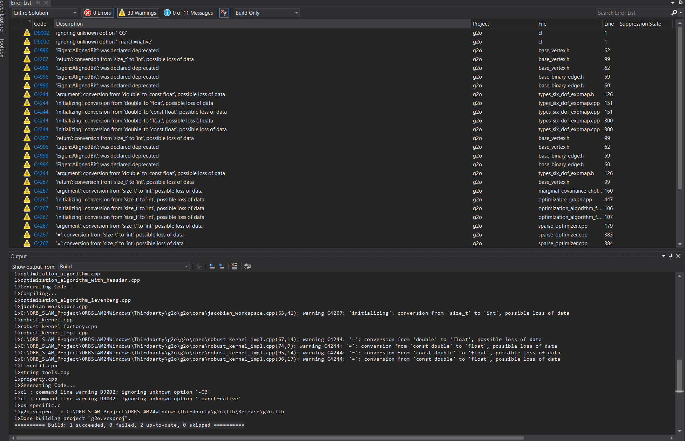


### **Pangolin**

1. Open cmake-gui, select Pangolin folder as the source path and the Pangolin/build folder as the binaries path.
2. Click configure, select Visual Studio 12 2013 Win64(or your own) as the generator, click finish.
3. After configure done, click Generate.
4. Go to the Pangolin/build folder, double click the Pangolin.sln to open the peoject.
5. Build ALL_BUILD in either debug or release mode you want. **(Mode should be the same as DBoW2 && g2o)**.
6. You'll get a error of "cannot open input file 'pthread.lib'", just ignore it.
7. After success build, the libraries will be in the lib folder of the Pangolin project source folder.

The result you might see after built:

Pangolin Library

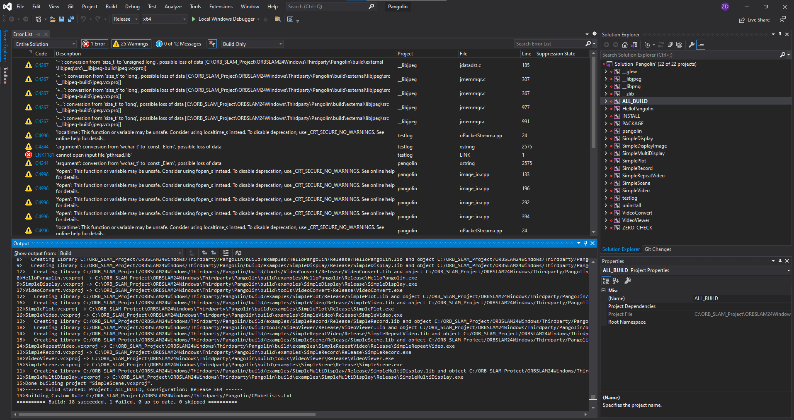

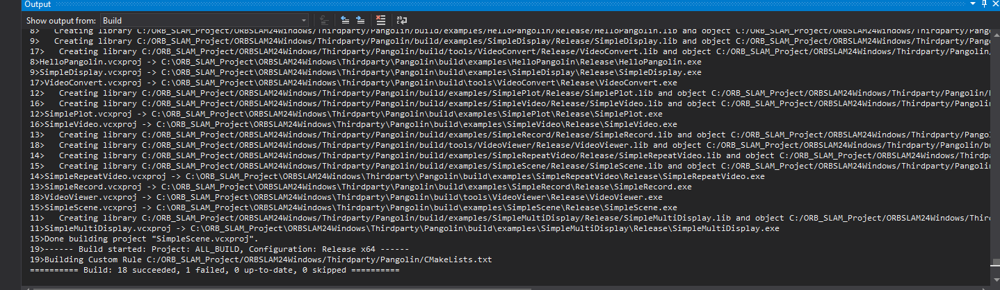


### **ORBSLAM24Windows**

1. Open cmake-gui, select ORBSLAM24Windows folder as the source path and the ORBSLAM24Windows/build folder as the binaries path.

2. Click configure, select Visual Studio 12 2013 Win64(or your own) as the generator, click finish.

3. After configure done, click Generate.

4. Go to the ORBSLAM24Windows/build folder, double click the ORB_SLAM2.sln to open the peoject.

5. Choose either debug or release mode you want. **(Mode should be the same as DBoW2 && g2o && Pangolin)**.

6. Right click the ORB_SLAM2 project and then click generate.

7. After success build, the libraries will be in the lib folder of the ORB_SLAM2 project source folder, and here is the result you might see:

   1. ORB_SLAM2 build successfully

      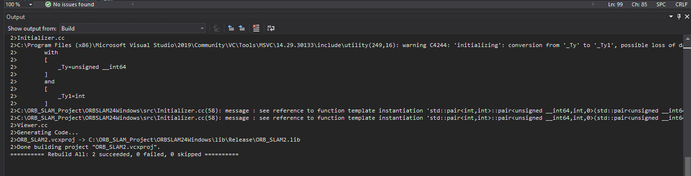


### **Applications**

If you want to make apps, you can also build the mono-stero-RGBD projects provided.

**Example1:  mono-tum**

Take mono_tum app as an example, you can follow the steps below.

1. Go to the ORBSLAM24Windows/build folder, double click the ORB_SLAM2.sln to open the peoject.

2. Choose either debug or release mode you want. **(Build mode should be the same as DBoW2 && g2o && Pangolin && ORB_SLAM2)**.

3. Right click the mono_tum project and then click generate.

4. Download tum dataset sequence, for example [freiburg2_desk](http://filecremers3.informatik.tu-muenchen.de/rgbd/dataset/freiburg2/rgbd_dataset_freiburg2_desk.tgz)

5. Right click on the mono_tum project->Properties->C/C++->**Preprocessor Definitions**, add COMPILEDWITHC11 at the end row, click Apply and OK.

   1. 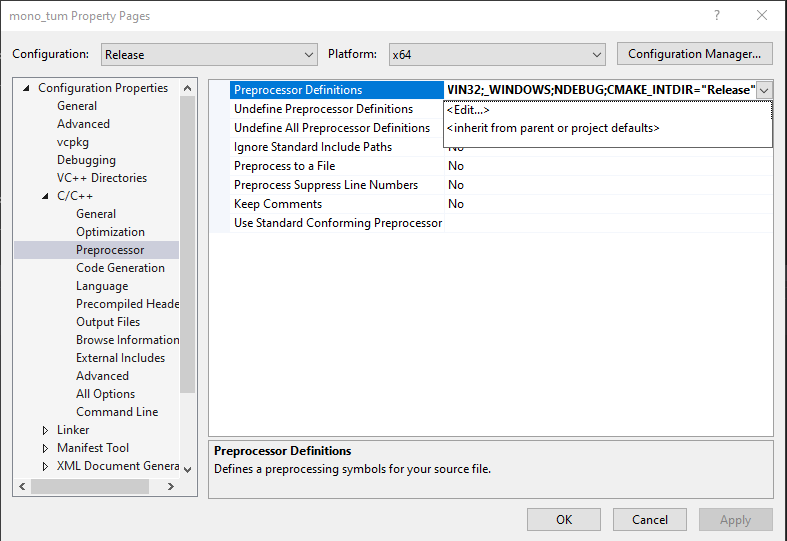

   2. Build for mono_tum

      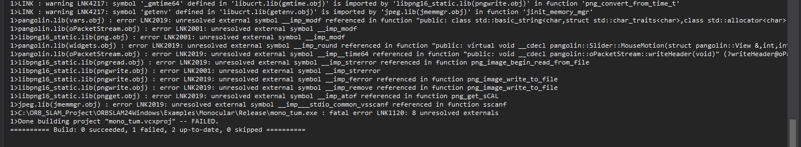

6. Right click the mono_tum project and then click Property->Config Property->Debug, input three parameters (Usage: ./mono_tum path_to_vocabulary path_to_settings path_to_sequence, the first can be ignored in windows)

- **path_to_vocabulary** In ORBSLAM24Windows/Vocabulary folder, unpack the tar, a .txt file
- **path_to_settings** In ORBSLAM24Windows/Examples/Monocular folder, rgbd_dataset_freiburg2_desk corresponding to TUM2.yaml
- **path_to_sequence** rgbd_dataset_freiburg2_desk folder path

1. Run app, it'll take a few minutes to load the vocabulary dictionary, and then you'll get the result as below:

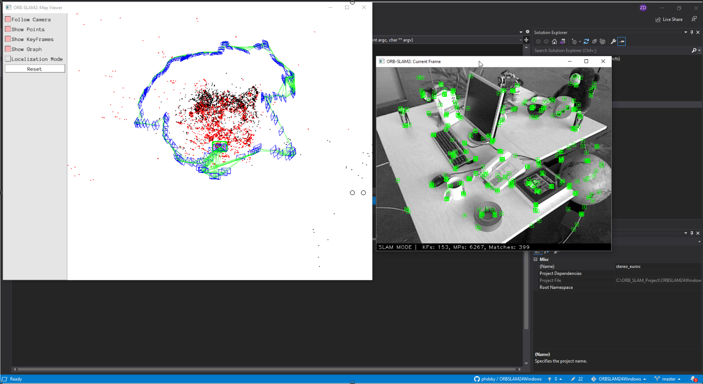

<iframe width="560" height="315" src="https://www.youtube.com/embed/zPW0AYSO0H8" title="YouTube video player" frameborder="0" allow="accelerometer; autoplay; clipboard-write; encrypted-media; gyroscope; picture-in-picture" allowfullscreen></iframe>

If you don't satisfied with the speed of loading dictionary, you can reference issue [vocabulary convert](https://github.com/raulmur/ORB_SLAM2/pull/21) to convert the txt vocabulary to bin vocabulary, it speeds up a lot.


**Example2： rgbd_tum**

Take rgbd_tum app as an example, you can follow the steps below.

1. Go to the ORBSLAM24Windows/build folder, double click the ORB_SLAM2.sln to open the peoject.

2. Choose either debug or release mode you want. **(Build mode should be the same as DBoW2 && g2o && Pangolin && ORB_SLAM2)**.

3. Right click the rgbd_tum project and then click generate.

4. Download tum dataset sequence, for example [freiburg2_desk](http://filecremers3.informatik.tu-muenchen.de/rgbd/dataset/freiburg2/rgbd_dataset_freiburg2_desk.tgz)

5. Right click on the mono_tum project->Properties->C/C++->**Preprocessor Definitions**, add COMPILEDWITHC11 at the end row, click Apply and OK.

6.  Run the executable

   1. Download a sequence from http://vision.in.tum.de/data/datasets/rgbd-dataset/download and uncompress it.
   2. Associate RGB images and depth images using the python script [associate.py](http://vision.in.tum.de/data/datasets/rgbd-dataset/tools). We already provide associations for some of the sequences in *Examples/RGB-D/associations/*. You can generate your own associations file executing:

   ```bash
   $ sudo apt install subversion
   $ svn checkout https://svncvpr.in.tum.de/cvpr-ros-pkg/trunk/rgbd_benchmark/rgbd_benchmark_tools
   $ cd rgbd_benchmark_tools/
   # python associate.py PATH_TO_SEQUENCE/rgb.txt PATH_TO_SEQUENCE/depth.txt > associations.txt
   /mnt/c/ORB_SLAM_Project/rgbd_benchmark_tools$ python3 ../rgbd_benchmark_tools/scripts/associate.py rgb.txt depth.txt > associations.txt
   ```

   1. Execute the following command. Change `TUMX.yaml` to TUM1.yaml,TUM2.yaml or TUM3.yaml for freiburg1, freiburg2 and freiburg3 sequences respectively. Change `PATH_TO_SEQUENCE_FOLDER`to the uncompressed sequence folder. Change `ASSOCIATIONS_FILE` to the path to the corresponding associations file.

- **path_to_vocabulary** In ORBSLAM24Windows/Vocabulary folder, unpack the tar, a .txt file
- **path_to_settings** rgbd_dataset_freiburg3_walking_static corresponding to TUM1.yaml
- **path_to_sequence **rgbd_dataset_freiburg3_walking_static folder path

1. Run app with following commadn:

   1. `PS C:\ORB_SLAM_Project\ORBSLAM24Windows> .\Examples\RGB-D\Debug\rgbd_tum.exe .\Vocabulary\ORBvoc.txt\ORBvoc.txt .\Examples\RGB-D\TUM3.yaml ..\rgbd_dataset_freiburg3_walking_static ..\rgbd_dataset_freiburg3_walking_static\associations.txt`

2.  it'll take a few minutes to load the vocabulary dictionary, and then you'll get the result.

   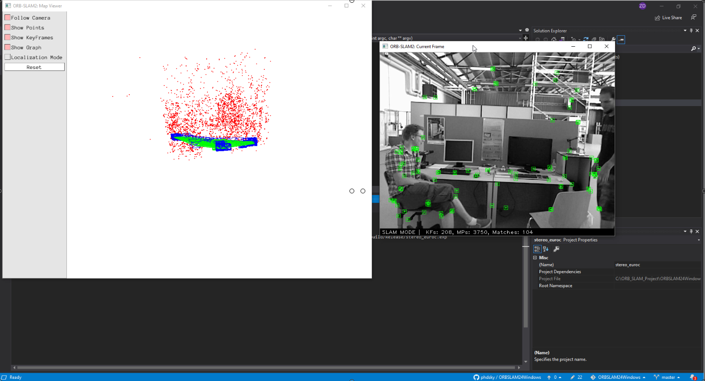

Here is the full video:

<iframe width="560" height="315" src="https://www.youtube.com/embed/4wvgU-I8RI4" title="YouTube video player" frameborder="0" allow="accelerometer; autoplay; clipboard-write; encrypted-media; gyroscope; picture-in-picture" allowfullscreen></iframe>


###  Monocular Examples

**TUM Dataset**

1. Download a sequence from http://vision.in.tum.de/data/datasets/rgbd-dataset/download and uncompress it.
2. Execute the following command. Change `TUMX.yaml` to TUM1.yaml,TUM2.yaml or TUM3.yaml for freiburg1, freiburg2 and freiburg3 sequences respectively. Change `PATH_TO_SEQUENCE_FOLDER`to the uncompressed sequence folder.

```powershell
./Examples/Monocular/mono_tum Vocabulary/ORBvoc.txt Examples/Monocular/TUMX.yaml PATH_TO_SEQUENCE_FOLDER
# My example
PS C:\ORB_SLAM_Project\ORBSLAM24Windows> .\Examples\Monocular\Release\mono_tum.exe .\Vocabulary\ORBvoc.txt\ORBvoc.txt .\Examples\Monocular\TUM2.yaml ..\rgbd_dataset_freiburg2_desk\^C
```

**KITTI Dataset**

1. Download the dataset (grayscale images) from http://www.cvlibs.net/datasets/kitti/eval_odometry.php
2. Execute the following command. Change `KITTIX.yaml`by KITTI00-02.yaml, KITTI03.yaml or KITTI04-12.yaml for sequence 0 to 2, 3, and 4 to 12 respectively. Change `PATH_TO_DATASET_FOLDER` to the uncompressed dataset folder. Change `SEQUENCE_NUMBER` to 00, 01, 02,.., 11.

```
./Examples/Monocular/mono_kitti Vocabulary/ORBvoc.txt Examples/Monocular/KITTIX.yaml PATH_TO_DATASET_FOLDER/dataset/sequences/SEQUENCE_NUMBER
```

**EuRoC Dataset**

1. Download a sequence (ASL format) from http://projects.asl.ethz.ch/datasets/doku.php?id=kmavvisualinertialdatasets
2. Execute the following first command for V1 and V2 sequences, or the second command for MH sequences. Change PATH_TO_SEQUENCE_FOLDER and SEQUENCE according to the sequence you want to run.

```
./Examples/Monocular/mono_euroc Vocabulary/ORBvoc.txt Examples/Monocular/EuRoC.yaml PATH_TO_SEQUENCE_FOLDER/mav0/cam0/data Examples/Monocular/EuRoC_TimeStamps/SEQUENCE.txt 
./Examples/Monocular/mono_euroc Vocabulary/ORBvoc.txt Examples/Monocular/EuRoC.yaml PATH_TO_SEQUENCE/cam0/data Examples/Monocular/EuRoC_TimeStamps/SEQUENCE.txt 
```


### RGB-D Example

**TUM Dataset**

1. Download a sequence from http://vision.in.tum.de/data/datasets/rgbd-dataset/download and uncompress it.
2. Associate RGB images and depth images using the python script [associate.py](http://vision.in.tum.de/data/datasets/rgbd-dataset/tools). We already provide associations for some of the sequences in *Examples/RGB-D/associations/*. You can generate your own associations file executing:

```
python associate.py PATH_TO_SEQUENCE/rgb.txt PATH_TO_SEQUENCE/depth.txt > associations.txt
```

1. Execute the following command. Change `TUMX.yaml` to TUM1.yaml,TUM2.yaml or TUM3.yaml for freiburg1, freiburg2 and freiburg3 sequences respectively. Change `PATH_TO_SEQUENCE_FOLDER`to the uncompressed sequence folder. Change `ASSOCIATIONS_FILE` to the path to the corresponding associations file.

```powershell
./Examples/RGB-D/rgbd_tum Vocabulary/ORBvoc.txt Examples/RGB-D/TUMX.yaml PATH_TO_SEQUENCE_FOLDER ASSOCIATIONS_FILE
# My Example
PS C:\ORB_SLAM_Project\ORBSLAM24Windows> .\Examples\RGB-D\Release\rgbd_tum.exe .\Vocabulary\ORBvoc.txt\ORBvoc.txt .\Examples\RGB-D\TUM3.yaml ..\rgbd_dataset_freiburg3_walking_static ..\rgbd_dataset_freiburg3_walking_static\associations.txt


```


## Implementing ORB-SLAM on Ubuntu 18.04 & ROS Melodic


```bash
# Step 1: Plugin your USB WebCam and open up a new terminal window and enter the following:
$ sudo apt install ros-melodic-usb-cam
$ roslaunch usb_cam usb_cam-test.launch

# If you get an error message try changing the /dev/video0 to /dev/video1 or any other number in the launch file.


# Step 2: The camera_calibration module will already be installed for Melodic. To make sure all the dependencies for the package have been installed, run:
$ rosdep install camera_calibration

# Once all the dependencies have been installed, you run can the camera_calibration node by giving in the required parameters. To know about each parameter, see this page. (You’ll also need a checkerboard to perform the calibration).
$ rosrun usb_cam usb_cam_node
$ rosrun camera_calibration cameracalibrator. --size 9x6 --square 0.02517 image:=/usb_cam/image_raw camera:=/usb_cam --no-service-check

# [Create a .yaml file, and copy the parameter from tutorial, and skip it]
# Step 3:Now, we need to convert the .ost file to a .yaml file. To do that, enter the following in the terminal:
$ rosrun  camera_calibration_parsers convert  <filename>.ost <filename>.yaml
# Read more here, http://wiki.ros.org/camera_calibration_parsers

# Step 4: When you run the usb_cam node, it publishes two important topics that will be subscribed by your orb_slam2_ros node. One is the /camera/image_raw and /camera/camera_info. The latter is the topic that sends your camera parameters to the orb_slam2_ros node. Therefore, you need to make your usb_cam node to publish your .yaml file parameters to that topic. To do so, enter the following commands in your terminal:
$ roscd usb_cam
$ cd launch
$ sudo nano usb_cam-test.launch
# The nano text editor will open up your launch file. Enter the highlighted line of code as shown in the image below: <param name="camera_info_url" value="file:///home/jetbot/.ros/camera_info/head_camera.yaml/>


# Final Step: Setting up your orb_slam2_ros node
# cd into your catkin workspace and enter the following commands:
$ cd src
$ git clone https://github.com/appliedAI-Initiative/orb_slam_2_ros.git
$ cd ..
$ catkin_make
$ source devel/setup.bash


# Running it all together
# Make sure your camera is connected to your PC. Run each of the following commands in new terminals.
$ roscore
$ roslaunch usb_cam usb_cam-test.launch
$ roslaunch orb_slam2_ros orb_slam2_logitech_c920_mono.launch
$ rosrun orb_slam2_ros debug_image_info.py
$ rviz
```


Error1:

>[ INFO] [1638032855.903411694]: Unable to open camera calibration file [/home/jetbot/.ros/camera_info/head_camera.yaml]
>[ WARN] [1638032855.903490081]: Camera calibration file /home/jetbot/.ros/camera_info/head_camera.yaml not found.
>[ INFO] [1638032855.903564926]: Starting 'head_camera' (/dev/video1) at 640x480 via mmap (yuyv) at 30 FPS
>
>

Solu:

Create such file in directory, `.ros/camera_info/head_camera.yaml`, with following parameter

```yaml
image_width: 2448 # 640  
image_height: 2050  # 480 
camera_name: head_camera  # Logitech_HD_Pro_C920
camera_matrix:
  rows: 3
  cols: 3
  data: [4827.94, 0, 1223.5, 0, 4835.62, 1024.5, 0, 0, 1]  #  [430.215550, 0.000000, 306.691343, 0.000000, 430.531693, 227.224800, 0.000000, 0.000000, 1.000000] 
distortion_model: plumb_bob
distortion_coefficients:
  rows: 1
  cols: 5
  data: [-0.41527, 0.31874, -0.00197, 0.00071, 0]   # [-0.337586, 0.111612, -0.000218, -0.000030, 0.0000] 
rectification_matrix:
  rows: 3
  cols: 3
  data: [1, 0, 0, 0, 1, 0, 0, 0, 1]
projection_matrix:
  rows: 3
  cols: 4
  data: [4827.94, 0, 1223.5, 0, 0, 4835.62, 1024.5, 0, 0, 0, 1, 0]   # [1, 0, 0, 0, 0, 1, 0, 0, 0, 0, 0, 1, 0] 

# Read more: 1) http://wiki.ros.org/camera_calibration/Tutorials/MonocularCalibration, and http://wiki.ros.org/camera_calibration_parsers
```


Error 2:

> **MESA-LOADER: failed to open swrast (search paths /usr/lib/aarch64-linux-gnu/dri:${ORIGIN}/dri:/usr/lib/dri)**
> **libGL error: failed to load driver: swrast**

Solu:

https://forums.developer.nvidia.com/t/jetpack-4-3-mesa-loader-failed-to-open-swrast-while-in-xrdp-session/111199/9

> Sorry again but I really want know what is the exact step to reproduce issue… there are 4 people here asking about similar error but the causes look different.
>
> I guess the purpose here is use gnome with xrdp setup and even in a headless case. Is that correct?
>
> Not sure why everyone is trying glxinfo. As my previous comment, for any usecase that runs with X API, you need to configure env variable “DISPLAY”. And this variable is valid when xorg detects a screen.
>
> For example, if I want to run glxinfo with no monitor.
>
> 1. Boot up device without hdmi cable
> 2. Disable gdm3 manually
>
> ```
> sudo service gdm3 stop
> ```
>
> 1. Run the X manually again.
>
> ```
> nvidia@nvidia-desktop:~$ sudo X
> ```
>
> 1. Tell the X which screen to use, see if xrandr can see this screen and run glxinfo.
>
> ```
> nvidia@nvidia-desktop:~$ export DISPLAY=:0
> nvidia@nvidia-desktop:~$ xrandr
> Screen 0: minimum 8 x 8, current 640 x 480, maximum 32767 x 32767
> HDMI-0 disconnected primary (normal left inverted right x axis y axis)
> nvidia@nvidia-desktop:~$ glxinfo 
> name of display: :0
> display: :0  screen: 0
> direct rendering: Yes
> server glx vendor string: NVIDIA Corporation
> server glx version string: 1.4
> server glx extensions:
> ----it is too long so skip the rest---
> ```


## Q: How to run both cpp and python code?


Reference:

- When to use Python vs Cpp with ROS,  https://roboticsbackend.com/python-vs-cpp-with-ros/
- Python vs C++ – How to run Python and C++ code in ROS, https://www.theconstructsim.com/difference-run-code-ros-python-cpp/


## Resources

- The Construct ROS for Beginners, https://www.theconstructsim.com/intro-to-robot-programming-ros-learning-path/
- mithi/robotics-coursework, https://github.com/mithi/robotics-coursework
- CMU Lecture note:
  - Chap8-Kalman-Mapping_howie.ppt, Localization, Mapping, SLAM and The Kalman Filter according to George， https://www.cs.cmu.edu/~motionplanning/lecture/Chap8-Kalman-Mapping_howie.pdf
  - Chap9-Bayesian-Mapping_howie.ppt, Bayesian Approaches to Localization, Mapping, and SLAM, https://www.cs.cmu.edu/~motionplanning/lecture/Chap9-Bayesian-Mapping_howie.pdf
  - lec 24 – Range‐Only SLAM for Robots Operating Cooperatively with Sensor Networks, https://www.cs.cmu.edu/~motionplanning/lecture/lec24.pdf
  - Artificial Intelligence: Final review, https://www.cs.cmu.edu/afs/cs/academic/class/15381-s07/www/slides/final-review.pdf
  - Search based Planning in Dynamic Environments, https://www.cs.cmu.edu/afs/cs/academic/class/15381-s07/www/slides/013007dynplanning.pdf
  - Robotic Motion Planning: RRT’s, https://www.cs.cmu.edu/~motionplanning/lecture/lec20.pdf
  - Robotic Motion Planning: Controls Primer, https://www.cs.cmu.edu/~motionplanning/lecture/lec22.pdf
- Math review
  - Multivariable calculus, https://www.youtube.com/watch?v=J08-L2buigM&list=PLSQl0a2vh4HC5feHa6Rc5c0wbRTx56nF7&index=24
- Standford Courses:
  - Sebastian Thrun Course page, http://robots.stanford.edu/courses.html
  - Stanford University CS 226: Statistical Techniques in Robotics (Prof. Sebastian Thrun)	, http://cs226.stanford.edu/schedule.html

People

- Influent CS people at Boston University: https://research.com/university/computer-science/boston-university
  - Stephen Grossberg,  https://research.com/u/stephen-grossberg
- 

Learning Material(slide, Paper, Blog)

- The GraphSLAM Algorithm Daniel Holman CS 5391: AI Robotics March 12, 2014, https://slideplayer.com/slide/4546909/
- ROBOT MAPPING AND EKF SLAM, https://slideplayer.com/slide/5983202/

What is ORM-SLAM: [paper](http://webdiis.unizar.es/~raulmur/MurMontielTardosTRO15.pdf), github repo, 

- Based on a monocular camera was first proposed in: Raúl Mur-Artal, J. M. M. Montiel and Juan D. Tardós. ORB-SLAM: A Versatile and Accurate Monocular SLAM System. IEEE Transactions on Robotics, vol. 31, no. 5, pp. 1147–1163, 2015. [PDF](http://webdiis.unizar.es/~raulmur/MurMontielTardosTRO15.pdf)
- source code for the ROS package can be found on this [GitHub page](https://github.com/appliedAI-Initiative/orb_slam_2_ros)
  - appliedAI-Initiative/orb_slam_2_ros, https://github.com/appliedAI-Initiative/orb_slam_2_ros
  - raulmur/ORB_SLAM2, https://github.com/raulmur/ORB_SLAM2
  - castiel520/ORB_SLAM2-Semi-Dense, https://github.com/castiel520/ORB_SLAM2-Semi-Dense
- 2D grid mapping and navigation with ORB-SLAM 2- KITTI Dataset, https://www.youtube.com/watch?v=FCd6p25131I
  - My Projects: https://jahaniam.github.io/index.html
  - Abhineet personal page : http://webdocs.cs.ualberta.ca/~vis/asingh1/
  - source code: https://github.com/abhineet123/ORB_SLAM2


Tutorial:

- EKF SLAM on Turtlebot3, https://shangzhouye.tech/featured-projects/ekf_slam/

- ORB-Slam2: Implementation on my Ubuntu 16.04 with ROS Kinect, https://medium.com/@j.zijlmans/orb-slam-2052515bd84c
- 


# ROS

## ROS with Windows


ROS1 Noetic Installation in Windows: [1-2 hr]

- Just follow the tutorial here, http://wiki.ros.org/noetic/Installation.
- !! There is a YouTube video for Windows 10 installation, [How to Install ROS Melodic on Windows natively in just 3 Simple Steps || Install ROS without Ubuntu](https://www.youtube.com/watch?v=8QC7-Odeqhc)

ROS2 Foxy on WIndows:

- Installation, http://wiki.ros.org/Installation/Windows
- !!! Video,How to Install ROS Melodic on Windows natively in just 3 Simple Steps || Install ROS,  https://www.youtube.com/watch?v=8QC7-Odeqhc
  - Installation Code snippet, https://github.com/PranshuTople/Installing_ROS
- [TO-DO] Configuration setup, https://docs.ros.org/en/foxy/Tutorials/Configuring-ROS2-Environment.html

- Other solution: VirtualBox 
  - How to Install Ubuntu 20.04 LTS on VirtualBox in Windows 10, https://www.youtube.com/watch?v=x5MhydijWmc

```bash
# Run master node
roscore
# Show all urls
rostopic list
# Launch gazebo
roslaunch gazebo_ros empty_world.launch
# Launch rviz
rosrun rviz rviz
```


Other Reference:

- Medium, Robot Operating System (ROS) in Windows 10, https://medium.com/geekculture/ros-in-windows-649c0f0fd036
- [Basic ROS programming on Windows 10 - Publisher and Subscriber nodes](https://decrypthere.blogspot.com/2020/05/basic-ros-programming-on-windows-10.html)

- [ROS on Windows](https://ms-iot.github.io/ROSOnWindows/GettingStarted/UsingROSonWindows.html)


### [Install ROS on windows 10 using WSL and WSL2 (Full guide)](https://github.com/MohanadSinan/Smart-Methods/wiki/Install-ROS-on-windows-10-using-WSL-(Full-guide)) 

Here a full guide how to install ROS on Windows 10 using [Windows Subsystem for Linux (WSL)](https://github.com/MohanadSinan/Smart-Methods/wiki/What-is-the-Windows-Subsystem-for-Linux-(WSL)%3F).

> **Note:** WSL is only available in Windows 10 version 1607 (the Anniversary update) or higher.

#### **Step1: Install the Windows Subsystem for Linux (WSL).**

1. **Enabling WSL in Windows 10**

Before installing any Linux distributions on Windows, you must enable the "Windows Subsystem for Linux" optional feature in one of the following two ways:

1.1.a Using the GUI for enabling Windows features:

1. Open the Start Menu and search ***Turn Windows features on or off***

2. Select ***Windows Subsystem for Linux***

   

3. Click ***OK***

> **Note:** To only install [WSL 1](https://github.com/MohanadSinan/Smart-Methods/wiki/What-is-the-Windows-Subsystem-for-Linux-(WSL)%3F#what-is-wsl-1), you should now restart your machine and move on to [**Step2:** Install Ubuntu distribution.](https://github-wiki-see.page/m/MohanadSinan/Smart-Methods/wiki/Install-ROS-on-windows-10-using-WSL-(Full-guide)#step2-install-ubuntu-distribution)

1.1.b Using PowerShell:

1. Open [PowerShell](https://docs.microsoft.com/en-us/powershell/scripting/overview?view=powershell-6) as Administrator and run:

```
dism.exe /online /enable-feature /featurename:Microsoft-Windows-Subsystem-Linux /all /norestart
```

> **Note:** To only install [WSL 1](https://github.com/MohanadSinan/Smart-Methods/wiki/What-is-the-Windows-Subsystem-for-Linux-(WSL)%3F#what-is-wsl-1), you should now restart your machine and move on to [**Step2:** Install Ubuntu distribution.](https://github-wiki-see.page/m/MohanadSinan/Smart-Methods/wiki/Install-ROS-on-windows-10-using-WSL-(Full-guide)#step2-install-ubuntu-distribution)

2. **Update to WSL 2 `(Optional)`**

[WSL 2](https://github.com/MohanadSinan/Smart-Methods/wiki/What-is-the-Windows-Subsystem-for-Linux-(WSL)%3F#what-is-wsl-2) is a new version of the architecture in WSL that changes how Linux distributions interact with Windows. WSL 2 has the primary goals of increasing file system performance and adding full system call compatibility. Each Linux distribution can run as WSL 1 or as WSL 2, and can be switched between at any time. WSL 2 is a major overhaul of the underlying architecture and uses virtualization technology and a Linux kernel to enable its new features.

> **Note:** WSL 2 is only available in Windows 10, updated to version 2004, **Build 19041** or higher.

2.1 Enable the 'Virtual Machine Platform' optional component:

Before installing [WSL 2](https://github.com/MohanadSinan/Smart-Methods/wiki/What-is-the-Windows-Subsystem-for-Linux-(WSL)%3F#what-is-wsl-2), you must enable the "Virtual Machine Platform" optional feature.

1. Open [PowerShell](https://docs.microsoft.com/en-us/powershell/scripting/overview?view=powershell-6) as Administrator and run:

```
dism.exe /online /enable-feature /featurename:VirtualMachinePlatform /all /norestart
```

1. **Restart** your computer when prompted

2.2 Updating the WSL 2 Linux kernel:

To manually update the Linux kernel inside of [WSL 2](https://github.com/MohanadSinan/Smart-Methods/wiki/What-is-the-Windows-Subsystem-for-Linux-(WSL)%3F#what-is-wsl-2) please **download and install** the [Linux kernel update package](https://wslstorestorage.blob.core.windows.net/wslblob/wsl_update_x64.msi) for x64 machines.

> **Note:** If you're using an ARM64 machine, please download the [ARM64 package](https://wslstorestorage.blob.core.windows.net/wslblob/wsl_update_arm64.msi) instead.

2.3 Set WSL 2 as your default version:

Once you have the kernel installed, please run the following command in [PowerShell](https://docs.microsoft.com/en-us/powershell/scripting/overview?view=powershell-6) to set [WSL 2](https://github.com/MohanadSinan/Smart-Methods/wiki/What-is-the-Windows-Subsystem-for-Linux-(WSL)%3F#what-is-wsl-2) as the default version when installing a new Linux distribution:

```
wsl --set-default-version 2
```

> | **Additional Installation Resources**:                       |
> | ------------------------------------------------------------ |
> | [WSL1 Installation Guide](https://docs.microsoft.com/en-us/windows/wsl/install-win10) from Microsoft |
> | [WSL2 Installation Guide](https://docs.microsoft.com/en-us/windows/wsl/wsl2-install) from Microsoft |
> | [Windows Server Installation Guide](https://docs.microsoft.com/en-us/windows/wsl/install-on-server) from Microsoft |


#### Step2: Install Ubuntu distribution.

1. **Installing Ubuntu on WSL**

1.1.a Installing Ubuntu on WSL via the Microsoft Store: `(Recommended)`

The following Ubuntu releases are available as apps on the Microsoft Store:

- [Ubuntu](https://www.microsoft.com/en-us/p/ubuntu/9nblggh4msv6) (*without the release version*) always follows the **recommended** release, switching over to the next one when it gets the first point release.
- [Ubuntu 20.04 LTS](https://www.microsoft.com/store/apps/9N6SVWS3RX71) (*Focal*) is the current LTS release, supporting both x64 and ARM64 architecture.
- [Ubuntu 18.04 LTS](https://www.microsoft.com/en-us/p/ubuntu-1804/9n9tngvndl3q) (*Bionic*) is the second LTS release and the first one supporting ARM64 systems, too.
- [Ubuntu 16.04 LTS](https://www.microsoft.com/en-us/p/ubuntu-1604/9pjn388hp8c9) (*Xenial*) is the first release available for WSL. It supports the x64 architecture only.

Each app creates a separate root file system in which Ubuntu shells are opened but app updates don’t change the root file system afterwards. Installing a different app in parallel creates a different root file system allowing you to have both Ubuntu LTS releases installed and running in case you need it for keeping compatibility with other external systems. You can also upgrade your Ubuntu 16.04 to 18.04 by running `do-release-upgrade` and have three different systems running in parallel, separating production and sandboxes for experiments.

1.1.b Installing Ubuntu on WSL via rootfs:

Ubuntu WSL distribution rootfs daily builds are available for download:

- [Ubuntu 20.04 LTS](https://cloud-images.ubuntu.com/focal/current/) (*Focal*)
- [Ubuntu 19.10](https://cloud-images.ubuntu.com/eoan/current/) (*Eoan*)
- [Ubuntu 18.04 LTS](https://cloud-images.ubuntu.com/bionic/current/) (*Bionic*)
- [Ubuntu 16.04 LTS](https://cloud-images.ubuntu.com/xenial/current/) (*Xenial*)

They can be installed using the [wsl](https://docs.microsoft.com/en-us/windows/wsl/reference) command:

```
wsl --import <DistributionName> <InstallLocation> <FileName>
```

1.1.c Installing Ubuntu on WSL by sideloading the `.appx`:

Ubuntu WSL distribution .appx builds are available for download:

- [Ubuntu 20.04 LTS](https://aka.ms/wslubuntu2004) (*Focal*)
- [Ubuntu 20.04 LTS arm64](https://aka.ms/wslubuntu2004arm)
- [Ubuntu 18.04 LTS](https://aka.ms/wsl-ubuntu-1804) (*Bionic*)
- [Ubuntu 18.04 LTS arm64](https://aka.ms/wsl-ubuntu-1804-arm)
- [Ubuntu 16.04 LTS](https://aka.ms/wsl-ubuntu-1604) (*Xenial*)

They can be installed by enabling sideloading in Windows 10 and double-clicking the .appx and clicking Install or with [PowerShell](https://docs.microsoft.com/en-us/powershell/scripting/overview?view=powershell-6):

```
Add-AppxPackage .\Ubuntu_2004.2020.424.0_x64.appx
```

**2. Set up a new Ubuntu distribution on WSL**

2.1 Starting Ubuntu on WSL:

The Ubuntu on WSL terminal can be started via:

- The app tile in the Windows Start menu (or pinned to your taskbar)
- [WSL - Remote extension](https://marketplace.visualstudio.com/items?itemName=ms-vscode-remote.remote-wsl) for [Visual Studio Code](https://code.visualstudio.com/).
- The [wsl](https://docs.microsoft.com/en-us/windows/wsl/reference) command on the Windows command prompt or [PowerShell](https://docs.microsoft.com/en-us/powershell/scripting/overview?view=powershell-6)
- By running `ubuntu2004.exe`, etc. on the Windows command prompt or [PowerShell](https://docs.microsoft.com/en-us/powershell/scripting/overview?view=powershell-6)

2.2 Create a user account and password:

The first time you launch a newly installed Linux distribution, a console window will open and you'll be asked to wait for a minute or two for files to de-compress and be stored on your PC. All future launches should take less than a second.

Once you have [installed Ubuntu on WSL](https://github-wiki-see.page/m/MohanadSinan/Smart-Methods/wiki/Install-ROS-on-windows-10-using-WSL-(Full-guide)#1-installing-ubuntu-on-wsl), the first step you will be asked to complete when opening your newly installed Linux distribution is to create an account, including a **User Name** and **Password**.

- This **User Name** and **Password** is specific to your Linux distribution and has no bearing on your Windows user name.
- Once you create this **User Name** and **Password**, the account will be your default user for the distribution and automatically sign-in on launch.
- This account will be considered the Linux administrator, with the ability to run `sudo` (Super User Do) administrative commands.
- Each Linux distribution running on the Windows Subsystem for Linux has its own Linux user accounts and passwords. You will have to configure a Linux user account every time you add a distribution, reinstall, or reset.


**2.3 Update and upgrade packages**

Most distributions ship with an empty or minimal package catalog. We strongly recommend regularly updating your package catalog and upgrading your installed packages using your distribution's preferred package manager. For Ubuntu, use apt:

```
sudo apt update && sudo apt upgrade
```

Windows does not automatically update or upgrade your Linux distribution(s). This is a task that the most Linux users prefer to control themselves.

#### Step3: Install ROS distribution.

1. Choose a ROS distribution

There is more than one ROS distribution supported at a time. Some are older releases with long term support, making them more stable, while others are newer with shorter support life times, but with binaries for more recent platforms and more recent versions of the ROS packages that make them up. See the [Distributions](https://github.com/MohanadSinan/Smart-Methods/wiki/What-is--Robot-Operating-System-(ROS)%3F) page for more details.

We recommend one of the versions below:

| [ROS Kinetic Kame](http://wiki.ros.org/kinetic/Installation) | [ROS Melodic Morenia](http://wiki.ros.org/melodic/Installation) | [ROS Noetic Ninjemys](http://wiki.ros.org/noetic/Installation) |
| ------------------------------------------------------------ | ------------------------------------------------------------ | ------------------------------------------------------------ |
| **Released May, 2016**                                       | **Released May, 2018**                                       | **Released May, 2020**                                       |
| *LTS, supported until April, 2021*                           | *LTS, supported until May, 2023*                             | ***Latest LTS*** *,supported until May, 2025*                |
| `Isn't recommended for new installs`                         | `Recommended for Ubuntu 18.04`                               | `Recommended for Ubuntu 20.04`                               |
|                                                              |                                                              |                                                              |

2. Ubuntu install of ROS Noetic

2.1 Setup your `sources.list`:

Setup your computer to accept software from packages.ros.org.

```
sudo sh -c 'echo "deb http://packages.ros.org/ros/ubuntu $(lsb_release -sc) main" > /etc/apt/sources.list.d/ros-latest.list'
```

2.2 Set up your keys:

```
sudo apt-key adv --keyserver 'hkp://keyserver.ubuntu.com:80' --recv-key C1CF6E31E6BADE8868B172B4F42ED6FBAB17C654
```

> If you experience issues connecting to the keyserver, you can try substituting `hkp://pgp.mit.edu:80` or `hkp://keyserver.ubuntu.com:80` in the previous command.

Alternatively, you can use curl instead of the apt-key command, which can be helpful if you are behind a proxy server:

```
curl -sSL 'http://keyserver.ubuntu.com/pks/lookup?op=get&search=0xC1CF6E31E6BADE8868B172B4F42ED6FBAB17C654' | sudo apt-key add -
```

2.3 Installation:

First, make sure your Debian package index is up-to-date:

```
sudo apt update
```

Now pick how much of ROS you would like to install.

- **Desktop-Full Install: `(Recommended)`** : Everything in **Desktop** plus 2D/3D simulators and 2D/3D perception packages

  ```
  sudo apt install ros-noetic-desktop-full
  ```

- **Desktop Install:** Everything in **ROS-Base** plus tools like [rqt](http://wiki.ros.org/rqt) and [rviz](http://wiki.ros.org/rviz)

  ```
  sudo apt install ros-noetic-desktop
  ```

- **ROS-Base: (Bare Bones)** ROS packaging, build, and communication libraries. No GUI tools.

  ```
  sudo apt install ros-noetic-ros-base
  ```

> There are even more packages available in ROS. You can always install a specific package directly.
>
> ```
> sudo apt install ros-noetic-PACKAGE
> ```
>
> e.g.
>
> ```
> sudo apt install ros-noetic-slam-gmapping
> ```

> To find available packages, see [ROS Index](https://index.ros.org/packages/page/1/time/#noetic) or use:
>
> ```
> apt search ros-noetic
> ```

2.4 Environment setup

You must source this script in every **bash** terminal you use ROS in.

```
source /opt/ros/noetic/setup.bash
```

It can be convenient to automatically source this script every time a new shell is launched. These commands will do that for you.

**Bash**

> **Note:** If you have more than one ROS distribution installed, `~/.bashrc` must only source the `setup.bash` for the version you are currently using.

```
echo "source /opt/ros/noetic/setup.bash" >> ~/.bashrc
source ~/.bashrc
```

**zsh**

```
echo "source /opt/ros/noetic/setup.zsh" >> ~/.zshrc
source ~/.zshrc
```

#### Step4: Test your installation.

Now, to test your installation, A good way to check is to ensure that [environment variables](http://wiki.ros.org/ROS/EnvironmentVariables) like [ROS_ROOT](http://wiki.ros.org/ROS/EnvironmentVariables#ROS_ROOT) and [ROS_PACKAGE_PATH](http://wiki.ros.org/ROS/EnvironmentVariables#ROS_PACKAGE_PATH) are set:

```
printenv | grep ROS
```

If they are not then you might need to 'source' some setup.


```bash

:: activate the ROS environment
c:\opt\ros\noetic\x64\setup.bat

:: create a empty workspace
mkdir c:\catkin_ws\src
cd c:\catkin_ws

:: generate the released package sources list and its ROS dependencies
:: you can customize the command line to checkout the sources from different channels
:: see the tips section for more details
rosinstall_generator <package_name> --deps --exclude RPP --tar --flat > pkg.rosinstall
rosinstall_generator python-catkin-tools python-rosinstall python-rosinstall-generator python-wstool build-essential --deps --exclude RPP --tar --flat > pkg.rosinstall

choco install python-catkin-tools python-rosinstall python-rosinstall-generator python-wstool build-essential

python-catkin-tools python-rosinstall python-rosinstall-generator python-wstool build-essential

# Installs the navigation stack.
rosinstall_generator ros-noetic-navigation --deps --exclude RPP --tar --flat > pkg.rosinstall
sudo apt-get install 
# Installs the SLAM package.
choco install ros-noetic-slam-gmapping ros-noetic-navigation


:: you can manually edit the pkg.rosinstall for more customizations.
:: see the tips section for more details

:: checkout the sources for real
vcs import --force src < pkg.rosinstall

:: attempt to acquire the external dependencies
rosdep update
rosdep install --from-paths src --ignore-src -r -y

:: now catkin make to build the workspace
catkin_make


# Installs the navigation stack.
sudo apt-get install ros-noetic-navigation
# Installs the SLAM package.
sudo apt-get install ros-noetic-slam-gmapping

sudo apt-get update
sudo apt-get upgrade

# This will install the core packages of Turtlebot3.
$ cd ~/catkin_ws/src/
$ git clone https://github.com/ROBOTIS-GIT/turtlebot3_msgs.git -b melodic-devel
$ git clone  https://github.com/ROBOTIS-GIT/turtlebot3.git -b melodic-devel
$ cd ~/catkin_ws && catkin_make

# Install Turtlebot3 simulator
$ cd ~/catkin_ws/src/
$ git clone https://github.com/ROBOTIS-GIT/turtlebot3_simulations.git
$ cd ~/catkin_ws && catkin_make

# made the modification in .bashrch file as follows:
vim ~/.bashrc
# Making alias is optional but recommended to speed-up typing the commands.
alias burger='export TURTLEBOT3_MODEL=burger'
alias waffle='export TURTLEBOT3_MODEL=waffle'
alias tb3fake='roslaunch turtlebot3_fake turtlebot3_fake.launch'
alias tb3teleop='roslaunch turtlebot3_teleop turtlebot3_teleop_key.launch'
alias tb3='roslaunch turtlebot3_gazebo turtlebot3_empty_world.launch'
alias tb3maze='roslaunch turtlebot3_gazebo turtlebot3_world.launch'
alias tb3house='roslaunch turtlebot3_gazebo turtlebot3_house.launch'

# Reuired: At the end of the file, write the following commands. The last command will let you open Gazebo on a Virtual Machine and avoid crashing its display.
source /opt/ros/noetic/setup.bash
source /home/akoubaa/catkin_ws/devel/setup.bash
export TURTLEBOT3_MODEL=waffle
export SVGA_VGPU10=0

```


#### Step 5: WSL GUI setup


Other Reference:

- [How to run Gazebo + RVIZ on Windows 10 using WSL2](https://www.youtube.com/watch?v=DW7l9LHdK5c)

- [How to Install Programs With a Graphical User Interface in WSL2](https://david-littlefield.medium.com/how-to-install-programs-with-a-graphical-user-interface-gui-in-wsl2-e8ea9476cb78)

Basically, here is the command that you need to type in before launching and GUI applicaiton.

```bash
# First find you localhost ip addr
cat /etc/resolv.conf
# Or ipconfig in CMD terminal


export DISPLAY=$(cat /etc/resolv.conf | grep nameserver | awk '{print $2}'):0 
cd src
git clone https://github.com/ROBOTIS-GIT/turtlebot3
git clone https://github.com/ROBOTIS-GIT/turtlebot3_msgs
git clone https://github.com/ROBOTIS-GIT/turtlebot3_simulations
cd .. && catkin_make
source devel/setup.bash
export DISPLAY="grep nameserver /etc/resolv.conf | sed 's/nameserver //':0"

export GAZEBO_IP=127.0.0.1	# Setting to local host
export DISPLAY=172.30.192.1:0 # it will choose the first local display that was started, read more here, https://unix.stackexchange.com/questions/193827/what-is-display-0
export LIBGL_ALWAYS_INDIRECT=1
```

As you can see the ROS Gazebo simulation is running under WSL2 on Wi:

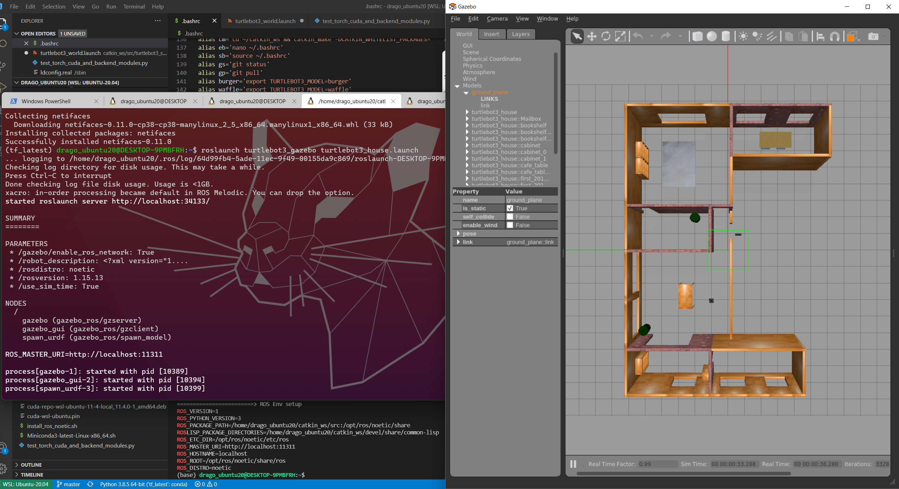


**Debug:**

Error 1:

```bash
drago_ubuntu20@DESKTOP-9PMBFRH:~$ export DISPLAY=172.30.192.1:0.0
drago_ubuntu20@DESKTOP-9PMBFRH:~$ export LIBGL_ALWAYS_INDIRECT=1
drago_ubuntu20@DESKTOP-9PMBFRH:~$ gedit
Unable to init server: Could not connect: Connection refused

(gedit:16150): Gtk-WARNING **: 11:59:37.329: cannot open display: 172.30.192.1:0.0
```

Solu: https://github.com/microsoft/WSL/issues/6430

Basically, it’s not about the DISPLAY, it’s about the firewall for VcXsrv application. You need to create an new inbound rule in your Windows Firewall. See below:

> I changed my display to this as you suggested:
>
> ```bash
> export DISPLAY=`grep nameserver /etc/resolv.conf | sed 's/nameserver //'`:0
> ```
>
> This didn't solve this issue... BUT in that link you posted, I looked at some of the solutions people were offering. I decided to check VcXsrv's firewall permissions and discovered it never even created a profile for itself when I installed it.
>
> I went to Control Panel > System and Security > Windows Defender Firewall > Advanced Settings > Inbound Rules > New Rule...
> \> Program > %ProgramFiles%\VcXsrv\vcxsrv.exe > Allow the connection > checked Domain/Private/Public > Named and Confirmed Rule.
>
> And it worked!!! I've been working on this for 3 days, I don't know how it has taken this long to find the solution, but I am so grateful for your help [@moloned](https://github.com/moloned)!

Error2: 

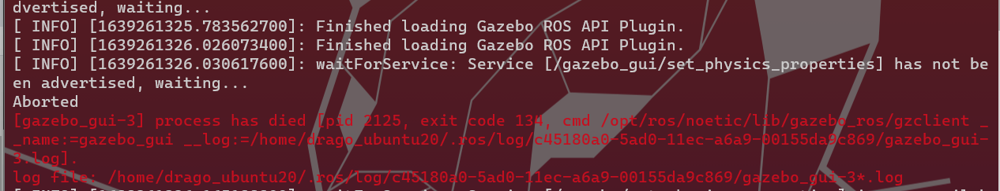

Or

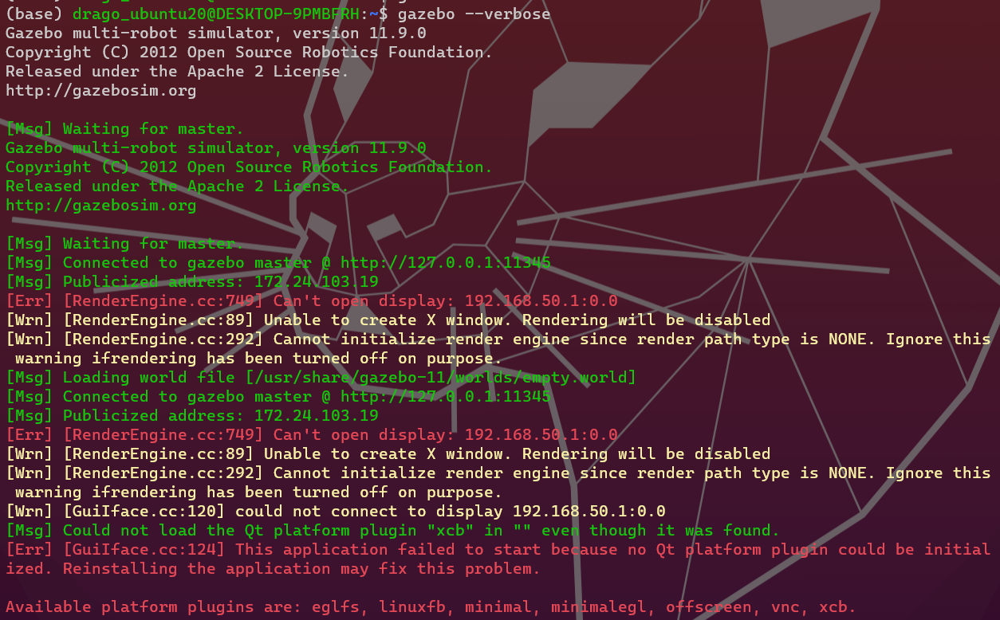

After running `gazebo`, you see some error related to gazebo_gui, or say something like, `[Err] [RenderEngine.cc:749] Can't open display: 192.168.50.1:0.0` 

==> There are two things you need to make sure are configured correctly: 

1) The value for`$DISPLAY` must match to the IPv4 address in your Windows Terminal (you can figure out with `ipconfig`); 

 open an cmd or powerShell terminal, and type, `ipconfig`. Note down IPv4 address and DNS Servers in Wi-Fi

```bash
   IPv4 Address. . . . . . . . . . . : 192.168.51.52(Preferred)
   DNS Servers . . . . . . . . . . . : 192.168.51.1
```

Second, go to WSL terminal, type `sudo vim /etc/resolv.conf`, and edit it as below:

```
nameserver 192.168.51.52	
nameserver 192.168.51.1
```

2. You need to uncheck the OpenGL setting, any application requires OpenGL setting won’t work in WSL2, check this blog — [Announcing Windows 11 Insider Preview Build 22518](https://blogs.windows.com/windows-insider/2021/12/08/announcing-windows-11-insider-preview-build-22518/) ==> When launching X-Launch, make sure you uncheck this one:

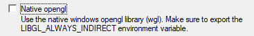

And setting `LIBGL_ALWAYS_INDIRECT` to 0 with `export LIBGL_ALWAYS_INDIRECT=0 `

Then check again with following command:

```bash
export GAZEBO_IP=127.0.0.1	# Setting to local host
# it will choose the first local display that was started, read more here, https://unix.stackexchange.com/questions/193827/what-is-display-0
export DISPLAY=$(cat /etc/resolv.conf | grep nameserver | awk 'NR==1{print $2}'):0.0
export LIBGL_ALWAYS_INDIRECT=0
gazeo --verbose
```


#### Step6: [Enable NVIDIA CUDA on WSL 2](https://docs.microsoft.com/en-us/windows/ai/directml/gpu-cuda-in-wsl)

Reference:

- [Enable NVIDIA CUDA on WSL 2](https://docs.microsoft.com/en-us/windows/ai/directml/gpu-cuda-in-wsl) 
- [Run Linux GUI apps on the Windows Subsystem for Linux (preview)](https://docs.microsoft.com/en-us/windows/wsl/tutorials/gui-apps)
- [How to run Gazebo + RVIZ on Windows 10 using WSL2](https://www.youtube.com/watch?v=DW7l9LHdK5c)
  - [Windows Subsystem for Linux 2: Installing VcXsrv X Server](https://www.rickmakes.com/windows-subsystem-for-linux-2-installing-vcxrv-x-server/) 
- [Install the CUDA Driver and Toolkit in WSL2](https://levelup.gitconnected.com/install-the-cuda-driver-and-toolkit-in-wsl2-be38703fed5c)
- [Announcing CUDA on Windows Subsystem for Linux 2](https://developer.nvidia.com/blog/announcing-cuda-on-windows-subsystem-for-linux-2/)
- [CUDA Toolkit Installation, CUDA Toolkit 11.5 Update 1 Downloads](https://developer.nvidia.com/cuda-downloads?target_os=Linux&target_arch=x86_64&Distribution=WSL-Ubuntu&target_version=2.0&target_type=deb_network)
- Nvidia cuda download repo, I[ndex of /compute/cuda/repos/ubuntu2004/x86_64](http://developer.download.nvidia.com/compute/cuda/repos/ubuntu2004/x86_64/)


Let’s verify the WSL can access the GPU, follow this article here, https://docs.nvidia.com/cuda/wsl-user-guide/index.html#installing-insider-preview-builds

```bash
$ nvidia-smi		# Check you have GPU driver installed
Sat Dec 11 18:12:25 2021
+-----------------------------------------------------------------------------+
| NVIDIA-SMI 470.81       Driver Version: 472.39       CUDA Version: 11.4     |
|-------------------------------+----------------------+----------------------+
| GPU  Name        Persistence-M| Bus-Id        Disp.A | Volatile Uncorr. ECC |
| Fan  Temp  Perf  Pwr:Usage/Cap|         Memory-Usage | GPU-Util  Compute M. |
|                               |                      |               MIG M. |
|===============================+======================+======================|
|   0  NVIDIA GeForce ...  Off  | 00000000:01:00.0  On |                  N/A |
| N/A   61C    P8     7W /  N/A |    663MiB /  8192MiB |    ERR!      Default |
|                               |                      |                  N/A |
+-------------------------------+----------------------+----------------------+

+-----------------------------------------------------------------------------+
| Processes:                                                                  |
|  GPU   GI   CI        PID   Type   Process name                  GPU Memory |
|        ID   ID                                                   Usage      |
|=============================================================================|
|  No running processes found                                                 |
+-----------------------------------------------------------------------------+


$ nvcc --version	# Checking you have CUDA compiler
nvcc: NVIDIA (R) Cuda compiler driver
Copyright (c) 2005-2019 NVIDIA Corporation
Built on Sun_Jul_28_19:07:16_PDT_2019
Cuda compilation tools, release 10.1, V10.1.243


# Check WSL can access the GPU
$ cd /usr/local/cuda-11.4/samples/4_Finance/BlackScholes/
$ sudo make
$ ./BlackScholes	
# You should see something similar below
[/usr/local/cuda-11.4/samples/4_Finance/BlackScholes/BlackScholes] - Starting...
GPU Device 0: "Turing" with compute capability 7.5

Initializing data...
...allocating CPU memory for options.
...allocating GPU memory for options.
...generating input data in CPU mem.
...copying input data to GPU mem.
Data init done.

Executing Black-Scholes GPU kernel (512 iterations)...
Options count             : 8000000
BlackScholesGPU() time    : 0.244465 msec
Effective memory bandwidth: 327.245417 GB/s
Gigaoptions per second    : 32.724542

BlackScholes, Throughput = 32.7245 GOptions/s, Time = 0.00024 s, Size = 8000000 options, NumDevsUsed = 1, Workgroup = 128

Reading back GPU results...
Checking the results...
...running CPU calculations.

Comparing the results...
L1 norm: 1.741792E-07
Max absolute error: 1.192093E-05

Shutting down...
...releasing GPU memory.
...releasing CPU memory.
Shutdown done.

[BlackScholes] - Test Summary

NOTE: The CUDA Samples are not meant for performance measurements. Results may vary when GPU Boost is enabled.

Test passed
```

As you can see CUDA driven GPU is running under WSL 2: walalala….

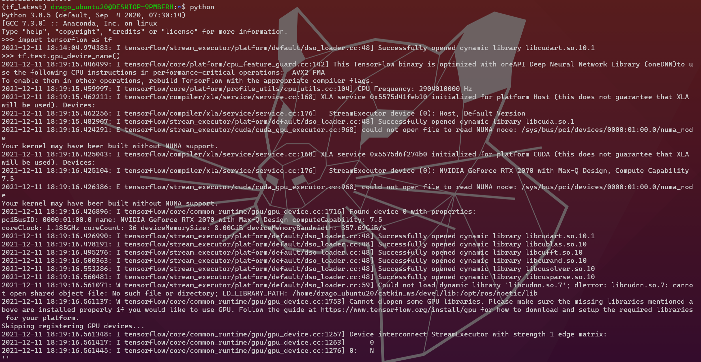


### Installationon Script with Ubuntu:

!!! Use the bash script here to download directly, https://github.com/ROBOTIS-GIT/robotis_tools/blob/master/install_ros_melodic.sh

ROS Noetic Installation in Ubuntu (Recommended for 20.04)

- Follow this tutorial, [ROS Noetic Installation and Path Sourcing](https://www.youtube.com/watch?v=PowY8dV36DY)

ROS Melodic Installation in Ubuntu 18.04 (recommended)

- Installation, http://wiki.ros.org/melodic/Installation/Ubuntu
- !!! Video, INSTALLING & GETTING STARTED WITH ROS | How to install ROS & How to setup Catkin Workspace on Ubuntu, https://www.youtube.com/watch?v=GBBQqiGvOSw

```bash
# 1.2 Setup your sources.list
# Setup your computer to accept software from packages.ros.org.
sudo sh -c 'echo "deb http://packages.ros.org/ros/ubuntu $(lsb_release -sc) main" > /etc/apt/sources.list.d/ros-latest.list'

# 1.3 Set up your keys
sudo apt install curl # if you haven't already installed curl
curl -s https://raw.githubusercontent.com/ros/rosdistro/master/ros.asc | sudo apt-key add -
sudo apt update

# 1.4 Installaltion begin
sudo apt install ros-melodic-desktop-full
# To find available packages, use:
apt search ros-melodic

# 1.5 Environment setup
# It's convenient if the ROS environment variables are automatically added to your bash session every time a new shell is launched:
echo "source /opt/ros/melodic/setup.bash" >> ~/.bashrc
# Or printf "source /opt/ros/melodic/setup.bash" >> ~/.bashrc
source ~/.bashrc

# 1.6 Dependencies for building packages
# Up to now you have installed what you need to run the core ROS packages. To create and manage your own ROS workspaces, there are various tools and requirements that are distributed separately. For example, rosinstall is a frequently used command-line tool that enables you to easily download many source trees for ROS packages with one command.
# To install this tool and other dependencies for building ROS packages, run:
sudo apt install python-catkin-tools python-rosinstall python-rosinstall-generator python-wstool build-essential

# 1.6.1 Initialize rosdep
# Before you can use many ROS tools, you will need to initialize rosdep. rosdep enables you to easily install system dependencies for source you want to compile and is required to run some core components in ROS. If you have not yet installed rosdep, do so as follows.
sudo apt install python-rosdep
# With the following, you can initialize rosdep.
sudo rosdep init
rosdep update
```

Tutorial

```bash
# Allow you to install ros dependency
sudo rosdep init

# update ros package
rosdep update

# 

source ~/.bashrc

# CTRL + H show hidden file
mkdir -p src

```

- !!! About catkin_make, read more here, http://wiki.ros.org/camera_calibration/Tutorials/MonocularCalibration

```bash
If you would like to build 
specific packages in the workspace, invoke the following in the root of your workspace:

$ catkin_make -DCATKIN_WHITELIST_PACKAGES="package1;package2"
If you want to revert back to building all packages, do the following:

$ catkin_make -DCATKIN_WHITELIST_PACKAGES=""
```

melodict_isntallation_script.bash

```bash
#!/bin/bash
# Apache License 2.0
# Copyright (c) 2018, ROBOTIS CO., LTD.

echo ""
echo "[Note] Target OS version  >>> Ubuntu 18.04.x (Bionic Beaver) or Linux Mint 19.x"
echo "[Note] Target ROS version >>> ROS Melodic Morenia"
echo "[Note] Catkin workspace   >>> $HOME/catkin_ws"
echo ""
echo "PRESS [ENTER] TO CONTINUE THE INSTALLATION"
echo "IF YOU WANT TO CANCEL, PRESS [CTRL] + [C]"
read

echo "[Set the target OS, ROS version and name of catkin workspace]"
name_os_version=${name_os_version:="bionic"}
name_ros_version=${name_ros_version:="melodic"}
name_catkin_workspace=${name_catkin_workspace:="catkin_ws"}

echo "[Update the package lists]"
sudo apt update -y

echo "[Install build environment, the chrony, ntpdate and set the ntpdate]"
sudo apt install -y chrony ntpdate curl build-essential
sudo ntpdate ntp.ubuntu.com

echo "[Add the ROS repository]"
if [ ! -e /etc/apt/sources.list.d/ros-latest.list ]; then
  sudo sh -c "echo \"deb http://packages.ros.org/ros/ubuntu ${name_os_version} main\" > /etc/apt/sources.list.d/ros-latest.list"
fi

echo "[Download the ROS keys]"
roskey=`apt-key list | grep "Open Robotics"`
if [ -z "$roskey" ]; then
  curl -s https://raw.githubusercontent.com/ros/rosdistro/master/ros.asc | sudo apt-key add -
fi

echo "[Check the ROS keys]"
roskey=`apt-key list | grep "Open Robotics"`
if [ -n "$roskey" ]; then
  echo "[ROS key exists in the list]"
else
  echo "[Failed to receive the ROS key, aborts the installation]"
  exit 0
fi

echo "[Update the package lists]"
sudo apt update -y

echo "[Install the ros-desktop-full and all rqt plugins]"
sudo apt install -y ros-$name_ros_version-desktop-full ros-$name_ros_version-rqt-*

echo "[Environment setup and getting rosinstall]"
source /opt/ros/$name_ros_version/setup.sh
sudo apt install -y python-rosinstall python-rosinstall-generator python-wstool build-essential git

echo "[Install rosdep]"
sudo apt install python-rosdep

echo "[Initialize rosdep and Update]"
sudo sh -c "rosdep init"
rosdep update

echo "[Make the catkin workspace and test the catkin_make]"
mkdir -p $HOME/$name_catkin_workspace/src
cd $HOME/$name_catkin_workspace/src
catkin_init_workspace
cd $HOME/$name_catkin_workspace
catkin_make

echo "[Set the ROS evironment]"
sh -c "echo \"alias eb='nano ~/.bashrc'\" >> ~/.bashrc"
sh -c "echo \"alias sb='source ~/.bashrc'\" >> ~/.bashrc"
sh -c "echo \"alias gs='git status'\" >> ~/.bashrc"
sh -c "echo \"alias gp='git pull'\" >> ~/.bashrc"
sh -c "echo \"alias cw='cd ~/$name_catkin_workspace'\" >> ~/.bashrc"
sh -c "echo \"alias cs='cd ~/$name_catkin_workspace/src'\" >> ~/.bashrc"
sh -c "echo \"alias cm='cd ~/$name_catkin_workspace && catkin_make'\" >> ~/.bashrc"

sh -c "echo \"source /opt/ros/$name_ros_version/setup.bash\" >> ~/.bashrc"
sh -c "echo \"source ~/$name_catkin_workspace/devel/setup.bash\" >> ~/.bashrc"

sh -c "echo \"export ROS_MASTER_URI=http://localhost:11311\" >> ~/.bashrc"
sh -c "echo \"export ROS_HOSTNAME=localhost\" >> ~/.bashrc"

source $HOME/.bashrc

echo "[Complete!!!]"
exit 0
```


### ERROR Debug:

==> Use `sudo apt install <package> -y`

```bash
$ sudo apt install ros-noetic-turtle3-gazebo
Reading package lists... Done
Building dependency tree
Reading state information... Done
E: Unable to locate package ros-noetic-turtle3-gazebo
$ sudo apt install ros-noetic-turtle3-ga^C
$ sudo apt-get install -y ros-noetic-turtlebot3-gazebo
Reading package lists... Done
Building dependency tree
Reading state information... Done
```

==> Use `python3-rosinstall`

```bash
$ sudo apt install -y python-rosinstall python-rosinstall-generat
or python-wstool build-essential git
Reading package lists... Done
Building dependency tree
Reading state information... Done
Package python-rosinstall-generator is not available, but is referred to by another package.
This may mean that the package is missing, has been obsoleted, or
is only available from another source
However the following packages replace it:
  python3-rosinstall-generator

Package python-wstool is not available, but is referred to by another package.
This may mean that the package is missing, has been obsoleted, or
is only available from another source
However the following packages replace it:
  python3-wstool

E: Unable to locate package python-rosinstall2
E: Package 'python-rosinstall-generator' has no installation candidate
E: Package 'python-wstool' has no installation candidate

## ==> Solu: 
$ sudo apt install python3-rosinstall*
Reading package lists... Done
Building dependency tree
Reading state information... Done
Note, selecting 'python3-rosinstall' for glob 'python3-rosinstall*'
Note, selecting 'python3-rosinstall-generator' for glob 'python3-rosinstall*'
```


## ROS Important Concept (excerpted from ROS Robot Porgramming Book)

**What is ROS**?

- Peer-to-Peer: individual programs communicate over defined API(ROS message, services, etc.)
- Distributed: Programs can be run on multiple computer (distributed system) and communicate over the network
- Multi-lingual: ROS module can be written in any language (C++, Python, MATLAB, Java, etc). 
- Light-weight: It’s a wrapper, Stand-alone libraries are wrapped around with a thin ROS layer.  For example, you can write your control algorithm in non-ros code, and wrap it with some ros communication call.
- Free and open-source

**Motivation and philosophy:**

- ROS allows the collaboration and robotic software development on a world-scale.

- ROS also offers powerful debugging tools, data logging & analysis capabilities, and an open-source 3D robotics simulator called Gazebo.

- ROS provides a lot of industry standard packages for robotic system development.


### Important Component

**ROS Nodes:**


- Single -purpose, executable program
- Organized by packages

```bash
rosrun <package_name> <node_name>	# Run a node
rosnode list	# see all active nodes
rosnode info <node_name>	# Retrieve info about a node
```


ROS Topics:


- Nodes communicate over topics
- Nodes can publish or subscribe to a topic. Typically, 1:N communication

```bash
rostopic list	# list all active topic
rostopic echo /topic	# subscribe and print the contents of a topic
rostopic info /topic	# Show info about a topic
```


**ROS Messages**


- Data structure defining the type of a topic
- Composed of a nested structure of integers, gloats, Booleans, string, and arrays of object.

```bash
rostopic type 		# see the type of a topic
rostopic pub /topic type data	# Publish a message to a topic
```

Example: 


ROS Nodelets


- Used to reduce communication overhead when running on same machine.  
- Try to use ROS nodes first, because Nodelets are more complicated to implement. (Only considered when it’s necessary, and optimization is crucial.)


### ROS Terminology

Reference: ROS Free book, https://community.robotsource.org/t/download-the-ros-robot-programming-book-for-free/51

Publisher == Server, Subscriber == Client

**ROS**: 

ROS provides standard operating system services such as hardware abstraction, device drivers, implementation of commonly used features including sensing, recognizing, mapping, motion planning, message passing between processes, package management, visualizers and libraries for development as well as debugging tools.

**Master:** 

acts as a name server for node-to-node connections and message communication. (Removed in ROS2, for eliminating the “single point of failure” issue.)

The master communicates with slaves using XMLRPC (XML-Remote Procedure Call), which is an HTTP-based protocol that does not maintain connectivity. When you execute ROS, the master will be configured with the URI address and port configured in the ROS_MASTER_URI. By default, the URI address uses the IP address of local PC, and port number 11311, unless otherwise modified.

You might ask, why node cannot directly communicate with each other? Why do we need master?  ==> Imagine, if we have millions of nodes, how do you know where is the xxx you want to connect with? ==> That’s it. We need an agancy who can provides those registration and searching/identification service. That’s the job of master node, and that’s why Master node must run first before any other nodes. 

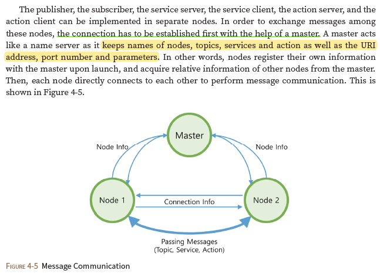

As you saw the picture above, “A master node act like a name server as it keeps names of nodes, topics, services and action, as well as the URI address, port number and parameters.”, and in http://wiki.ros.org/Master, “<u>The role of the Master is to enable individual ROS nodes to locate one another. Once these nodes have located each other they communicate with each other peer-to-peer.</u>”


Q: What happen if ROS Master crashes?

> The communication amount nodes will continue.  But if they stopped, they can’t connect to each other again. You can verify this by running the talker and listener node, and stop the master while they were communication.


**Node:**  

<u>The smallest unit of processor running in ROS</u>.  Can pass messages to one another through topics, make service calls to other nodes, provide a service for other nodes, or set or retrieve shared data from a communal database called the parameter server.

The **node** uses 

- <u>XMLRPC for communicating with the master</u> 
- and uses <u>XMLRPC or TCPROS of the TCP/IP protocols when communicating between nodes</u>. 
- <u>Connection request and response between nodes use XMLRPC</u>, 
- and message communication uses TCPROS because it is a direct communication between nodes independent from the master. 
- As for the URI address and port number, a variable called ROS_HOSTNAME, which is stored on the computer where the node is running, is used as the URI address, and the port is set to an arbitrary unique value.

**Package:**

The basic unit of ROS.

The ROS application is developed on a package basis, and the package contains either a configuration file to launch other packages or nodes. <u>The package also contains all the files necessary for running the package, including ROS dependency libraries for running various processes, datasets, and configuration file.</u> The number of official packages is about 2,500 for ROS Indigo as of July 2017 (http://repositories.ros.org/status_page/ ros_indigo_default.html) and about 1,600 packages for ROS Kinetic (http://repositories.ros.org/status_page/ros_kinetic_default.html). In addition, although there could be some redundancies, there are about 4,600 packages developed and released by users (http://rosindex.github.io/stats/).

To create a package:

`catkin_create_pkg package_name {dependencies}`


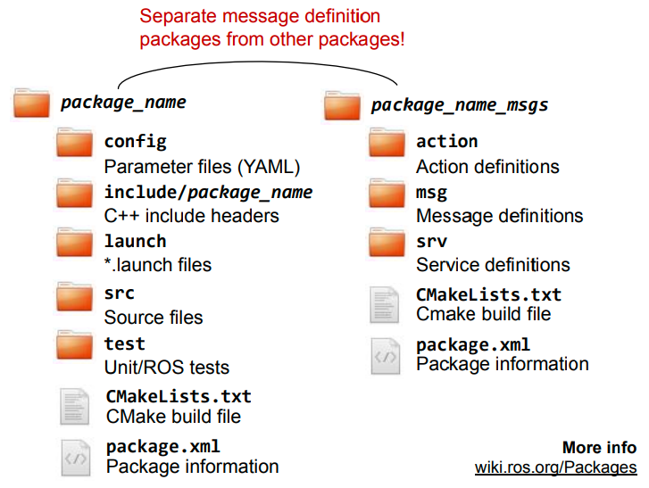

Courtesy: [https://ethz.ch/content/dam/ethz/special-interest/mavt/robotics-n-intelligent-systems/rsl-dam/ROS2021/lec2/ROS%20Course%20Slides%20Course%202.pdf](https://ethz.ch/content/dam/ethz/special-interest/mavt/robotics-n-intelligent-systems/rsl-dam/ROS2021/lec2/ROS%20Course%20Slides%20Course%202.pdf)

**Metapackage:**

A metapackage is a set of packages that have a common purpose. For example, the Navigation metapackage consists of 10 packages including AMCL, DWA, EKF, and map_server.

**Message:**

A node sends or receives data between nodes via a message. Messages are variables such as integer, floating point, and boolean. Nested message structure that contains another messages or an array of messages can be used in the message. 

TCPROS and UDPROS communication protocol is used for message delivery. Topic is used in unidirectional message delivery while service is used in bidirectional message delivery that request and response are involved.

==>其实就是ROS版的 TCP and UDP communication protocal, 但也基本一样的，communication 之前，需要建立three-way handshake, connection建立之后，就可以互相发消息了。

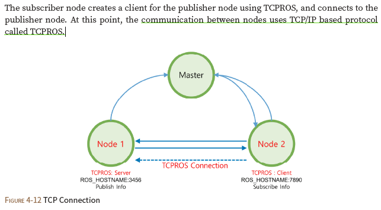

**Topic:** 

The topic is literally like a topic in a conversation. 

The **publisher node** first <u>registers its topic with the master and then starts publishing messages on a topic</u>. **Subscriber nodes** th<u>at want to receive the topic request information of the publisher node corresponding to the name of the topic registered in the master</u>. Based on this information, the subscriber node directly connects to the publisher node to exchange messages as a topic.

**Publish and Publisher:** 
The term **‘publish’** <u>stands for the action of transmitting relative messages corresponding to the topic</u>. 

The **publisher node** <u>registers its own information and topic with the master, and sends a message to connected subscriber nodes that are interested in the same topic.</u> The publisher is declared in the node and can be declared multiple times in one node.

**Subscribe and Subscriber:**

The term **‘subscribe’** stan<u>ds for the action of receiving relative messages corresponding to the topic</u>. 

The **subscriber node** <u>registers its own information and topic with the master, and receives publisher information that publishes relative topic from the master.</u> Based on received publisher information, <u>the subscriber node directly requests connection to the publisher node and receives messages from the connected publisher node</u>. A subscriber is declared in the node and can be declared multiple times in one node.

The **topic communication** is <u>an asynchronous communication which is based on publisher and subscriber</u>, and it is <u>useful to transfer certain data</u>. Since the topic continuously transmits and receives stream of messages once connected, it is <u>often used for sensors that must periodically transmit data</u>. 

On the other hands, there is a need for synchronous communication with which request and response are used. Therefore, ROS provides a message **synchronization method called ‘service’**. <u>A **service** consists of the **service server** that responds to requests and the **service client** that requests to respond.</u> Unlike the topic, <u>the service is a one-time message communication.</u> When the request and response of the service is completed, the connection
between two nodes is disconnected.

// Subscriber 就挂在那，通过TCPROS 的TCP/IP方式，建立synchronization连接，之后就可以进行信息的交换。但和TCP不同的是，这个信息交换的过程就只有一次，交换完，就马上断了。之后需要，得重新建立。

**Service:**  
The service is <u>synchronous bidirectional communication between the service client</u> that requests a service regarding a particular task and the service server that is responsible for responding to requests.

**Service Server：**

The ‘service server’ is <u>a server receives a request as an input and transmits a response as an output</u>. 

Both request and response are in the form of messages. Upon the service request, the server performs the designated service and delivers the
result to the service client as a response. The service server is implemented in the node that receives and executes a given request.

**Service Client：**

The ‘service client’ is <u>a client in the service message communication that requests service to the server and receives a response as an input.</u> Both request and response are in the form of message.
The client sends a request to the service server and receives the response. The service client is implemented in the node which requests specified command and receives results.

**Action: **
The action is 

- another message communication method <u>used for an asynchronous bidirectional communication.</u> 
- used where it takes longer time to respond after receiving a request and intermediate responses are required until the result is returned. 
- The structure of action file is also similar to that of service. However, feedback data section for intermediate response is added along with goal and result data section which are represented as request and response in service respectively. 
- There are action client that sets the goal of the action and action server that performs the action specified by the goal and returns feedback and result to the action client.

**Action Server:**

The ‘action server’ is <u>in charge of receiving goal from the client and responding with feedback and result.</u> Once the server receives goal from the client, it performs predefined process.

**Action Client:**

The ‘action client’ is <u>in charge of transmitting the goal to the server and receives result or feedback data as inputs from the action server.</u> The client delivers the goal to the action server, then receives corresponding result or feedback, and transmits follow up instructions or cancel instruction.

**Parameter:**

- The parameter in ROS refers to parameters used in the node. <u>Think of it as *.ini configuration files in Windows program</u>. 

- Default values are set in the parameter and can be read or written if necessary. 
- In particular, it is <u>very useful when configured values can be modified in real-time.</u> For example, you can specify settings such as USB port number, camera calibration parameters, maximum and minimum values of the motor speed.

**Parameter Server:**

When parameters are called in the package, they are registered with the parameter server which is loaded in the master.

**Catkin:**

The catkin refers to <u>the build system of ROS</u>. 

The build system basically uses CMake (Cross Platform Make), and the build environment is described in the ‘CMakeLists.txt’ file in the package folder. CMake was modified in ROS to create a ROS-specific build system. Catkin started the alpha test from ROS Fuerte and the core packages began to switch to Catkin in the ROS Groovy version. Catkin has been applied to most packages in the ROS Hydro version. The Catkin build system makes it easy to use ROS-related builds, package management, and dependencies among packages. If you are going to use ROS at this point, you should use Catkin instead of ROS build (rosbuild).

**roscore**:

roscore is the command that runs the ROS master. 

If multiple computers are within the same network, it can be run from another computer in the network. However, except for special case that supports multiple roscore, only one roscore should be running in the network. When ROS master is running, the URI address and port number assigned for ROS_MASTER_URI nvironment variables are used. If the user has not set the environment variable, the current local IP address is used as the URI address and port number 11311 is used which is a default port number for the master.

**rosrun:**

rosrun is the basic execution command of ROS. 

It is used to run a single node in the package. The node uses the ROS_HOSTNAME environment variable stored in the computer on which the node is running as the URI address, and the port is set to an arbitrary unique value.

**roslaunch:**

While <u>**rosrun** is a command to execute a single node</u>, **roslaunch** in contrast <u>executes multiple nodes.</u> It is a ROS command specialized in node execution with additional functions such as changing package parameters or node names, configuring namespace of nodes, <u>setting ROS_ROOT and ROS_PACKAGE_PATH, and changing environment variables when executing nodes</u>.

roslaunch uses the ‘*.launch’ file to define which nodes to be executed. The file is based on XML (Extensible Markup Language) and offers a variety of options in the form of XML tags.

**Graph:**

The relationship between nodes, topics, publishers, and subscribers introduced above can be visualized as a graph. The graphical representation of message communication does not include the service as it only happens one time. <u>The graph can be displayed by running the ‘rqt_graph’ node in the ‘rqt_graph’ package.</u> There are two execution commands, ‘rqt_graph’ and **‘rosrun rqt_graph rqt_graph**’.

**Name:**

Nodes, parameters, topics, and services all have names. These names are registered on the master and searched by the name to transfer messages when using the parameters, topics, and services of each node. 

Names are flexible because they can be changed when being executed, and different names can be assigned when executing identical nodes, parameters, topics, and services multiple times. Use of names makes ROS suitable for large-scale projects and complex systems.

**Client Library:**

ROS provides development environments for various languages by using client library23 in order to reduce the dependency on the language used. The main client libraries are C++, Python, Lisp, and other languages such as Java, Lua, .NET, EusLisp, and R are also supported. For this purpose, client libraries such as roscpp, rospy, roslisp, rosjava, roslua, roscs, roseus, PhaROS, and rosR
have been developed.

**MD5:**

MD5 (Message-Digest algorithm 5)24 is a 128-bit cryptographic hash function. It is used primarily to verify data integrity, such as checking whether programs or files are in its unmodified original form. The integrity of the message transmission/reception in ROS is verified with MD5.

**RPC:**
<u>RPC (Remote Procedure Call)</u> stands for the function that calls a sub procedure on a remote computer from another computer in the network. RPC uses protocols such as TCP/IP and IPX, and allows execution of functions or procedures without having the developer to write a program for remote control.

**XML:**

<u>XML (Extensible Markup Language)</u> is a broad and versatile markup language that W3C recommends for creating other special purpose markup languages. XML utilizes tags in order to describe the structure of data. In ROS, it is used in various components such as *.launch, *.urdf, and package.xml.

**XMLRPC:**

**XMLRPC (XML-Remote Procedure Call)** is <u>a type of RPC protocol that uses XML as the encoding format and uses the request and response method of the HTTP protocol which does not maintain nor check the connection</u>. XMLRPC is a very simple protocol, used only to define small data types or commands. As a result, XMLRPC is very lightweight and supports a variety of programming languages, making it well suited for ROS, which supports a variety of hardware and languages.

**TCP/IP:**

TCP stands for Transmission Control Protocol. It is often called TCP/IP. The Internet protocol layer guarantees data transmission using TCP, which is based on the IP (Internet Protocol) layer in the Internet Protocol Layers. It guarantees the sequential transmission and reception of data. 

TCPROS is a message format based on TCP/IP and UDPROS is a message format based on UDP. TCPROS is more frequently used in ROS.

TCP and UDP的区别就是TCP需要three-handshake process, but UDP doesn’t, they just keep communicating without worrying whether package has dropped or not.

**CMakeLists.txt**

Catkin, which is the build system of ROS, uses CMake by default. The build environment is specified in the ‘CMakeLists.txt’26 file in each package folder.

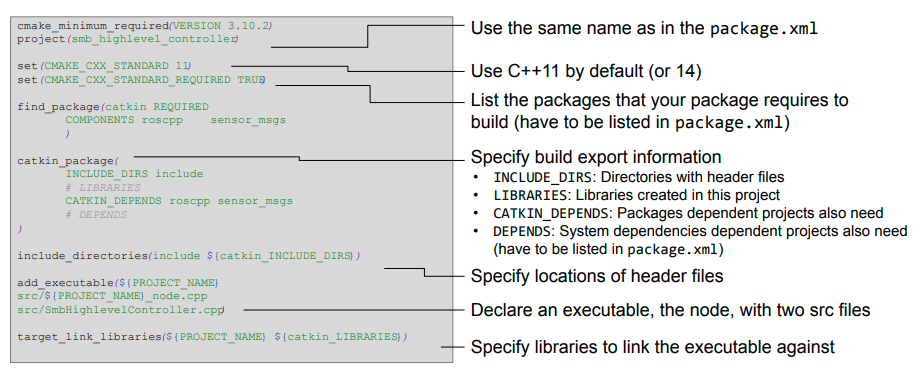

```cmake
cmake_minimum_required(VERSION 2.8.3)	# the minimum required version of ‘cmake’ installed on the operating system.

project(my_first_ros_pkg)		# Use the package name entered in ‘package.xml’ when building the package

# The ‘find_package’ entry is the component package required to perform a build on Catkin. In this example, ‘roscpp’ and ‘std_msgs’ are set as dependent packages. 
# If the package entered here is not found in the system, an error will occur when building the package.
find_package(catkin REQUIRED COMPONENTS	
    roscpp
    std_msgs
)

# The following is a method used when using packages other than ROS. 
# For example, when using Boost, the ‘system’ package must be installed beforehand. This feature is an option that allows you to install indirect dependent packages.
find_package(Boost REQUIRED COMPONENTS system)

# The ‘catkin_python_setup()’ is an option when using Python with ‘rospy’. It invokes the Python installation process ‘setup.py’.
catkin_python_setup()

# The ‘FILES’ option will automatically generate a header file (*.h) by referring to the ‘.msg’ files in the ‘msg’ folder of the current package. In this example, message files Message1.msg and Message2.msg are used.
add_message_files(
    FILES
    Message1.msg
    Message2.msg
)

# ‘add_service_files’ is an option to add a service file to use. The ‘FILES’ option will refer to ‘.srv’ files in the ‘srv’ folder in the package. In this example, you have the option to use the service files Service1.srv and Service2.srv.
add_service_files(
    FILES
    Service1.srv
    Service2.srv
)

# generate_messages is necessary for creating a message.
# ‘generate_messages’ is an option to set dependent messages. This example sets the DEPENDENCIES option to use the ‘std_msgs’ message package.
generate_messages(
    DEPENDENCIES
    std_msgs
)

# ‘generate_dynamic_reconfigure_options’ loads configuration files that are referred when using ‘dynamic_reconfigure’.
generate_dynamic_reconfigure_options(
    cfg/DynReconf1.cfg
    cfg/DynReconf2.cfg
)

# The following are the options when performing a build on Catkin. 
# ‘INCLUDE_DIRS’ is a setting that specifiesused to specify the header file in the ‘include’ folder, which is the internal folder of the package. 
# ‘LIBRARIES’ is a setting used to specify the package library in the following configuration.
# ‘CATKIN_DEPENDS’ specifies dependent packages and in this example, the dependent packages are set to ‘roscpp’ and ‘std_msgs’. ‘DEPENDS’ is a setting that describes system-dependent packages.
catkin_package(
    INCLUDE_DIRS include
    LIBRARIES my_first_ros_pkg
    CATKIN_DEPENDS roscpp std_msgs
    DEPENDS system_lib
)

# ‘include_directories’ is an option to specify folders to include. In the example, ‘${catkin_INCLUDE_DIRS}’ is configured, which refers to the header file the ‘include’ folder in the package. To specify an additional include folder, append it to the next line of ‘${catkin_INCLUDE_DIRS}’.
include_directories(
	${catkin_INCLUDE_DIRS}
)

# ‘add_library’ declares the library to be created after the build. The following option will create ‘my_first_ros_pkg’ library from ‘my_first_ros_pkg.cpp’ file in the ‘src’ folder.
add_library(my_first_ros_pkg
	src/${PROJECT_NAME}/my_first_ros_pkg.cpp
)

# ‘add_dependencies’ is a command to perform certain tasks prior to the build process such as creating dependent messages or dynamic reconfigurations. The following options describe the creation of dependent messages and dynamic reconfiguration, which are the dependencies of the ‘my_first_ros_pkg’ library.
add_dependencies(my_first_ros_pkg ${${PROJECT_NAME}_EXPORTED_TARGETS} ${catkin_EXPORTED_TARGETS})

# 'add_executable’ specifies the executable to be created after the build. The option specifies the system to refer to the ‘src/my_first_ros_pkg_node.cpp’ file to generate the ‘my_first_ros_pkg_node’ executable file. If there are multiple ‘*.cpp’ files to be referenced, append them after ‘my_first_ros_pkg_node.cpp’. If there are two or more executable files to be created, add an additional ‘add_executable’ entry.
add_executable(my_first_ros_pkg_node src/my_first_ros_pkg_node.cpp)

# ‘add_dependencies’ option is like the ‘add_dependencies’ previously described, which is required to perform certain tasks such as creating dependent messages or dynamic reconfigurations prior to building libraries or executable files. The following describes the dependency of the executable file named ‘my_first_ros_pkg_node’, not the library mentioned above. It is most often used when creating message files prior to building executable files.
add_dependencies(my_first_ros_pkg_node
	${${PROJECT_NAME}_EXPORTED_TARGETS} ${catkin_EXPORTED_TARGETS}
)

# ‘target_link_libraries’ is an option that links libraries and executables that need to be linked before creating an executable file.
target_link_libraries(my_first_ros_pkg_node
	${catkin_LIBRARIES}
)

```

The following is the modified build configuration file (CMakeLists.txt). Modify the file for
your package. For more information on how to use the configuration file, please refer to the packages of TurtleBot3 and ROBOTIS OP3 published at ‘https://github.com/ROBOTIS-GIT’.

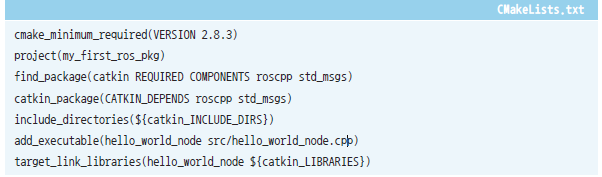

**package.xml:**

An XML file contains package information that describes the package name, author, license, and dependent packages.

- <buildtool_depend> Describes the dependencies of the build system. As we are using the Catkin build system, write ‘catkin’.
- <build_depend> Dependent package name when building the package.
- <run_depend> Dependent package name when running the package.
- <test_depend> Dependent package name when testing the package.

For example:

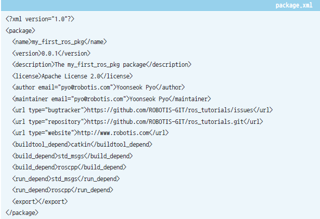


**Short Summary: about three Communication Methods**

**Topic:**

- A communication channel between publisher and subscriber
- One-way communication


**Service**


Establish connection only once，the connection terminated immediately after client/subscriber received response from server/publisher.

上述内容相当于消息通信中的话题。话题消息通信是只要发布者或订阅者不停止，会 持续地发布和订阅。服务分为下面两种。

- 服务客户端： 请求服务后等待响应
- 服务服务器： 收到服务请求后执行指定的任务，并发送响应。

服务服务器和客户端之间的连接与上述发布者和订阅者之间的TCPROS连接相同，但
是与话题不同，服务只连接一次，在执行请求和响应之后彼此断开连接。如果有必要，需
要重新连接。


**Action:** 


动作（action）在执行的方式上好像是在服务（service）的请求（goal）和响应(result）之间仅仅多了中途反馈环节，但实际的运作方式与话题相同。事实上，如果使用rostopic命令来查阅话题，那么可以看到该动作的goal、status、cancel、result和feedback等五个话题。动作服务器和客户端之间的连接与上述发布者和订阅中的TCPROS连接相同，但某些用法略有不同。例如，动作客户端发送取消命令或服务器发送结果值会中断连接，等。

Action may look similar to the request and the response of the service with an additional feedback message in order to provide intermediate result between the request (goal) and the response(result), but in practice it is rather more like a topic. In fact, if you use the ‘rostopic’ command to list up topics, there are five topics such as goal, status, cancel, result, and feedback
that are used in the action. The connection between the action server and the client is similar to the TCPROS connection of the publisher and subscriber, but the usage is slightly different. For example, when an action client sends a cancel command or the server sends a result value, the connection will be terminated.


**Example:**

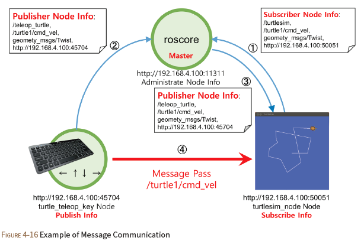


#### Writing Source Code (create a new C++ file )

The following setting is configured in the executable file creation section (add_executable) of the ‘CMakeLists.txt’ file mentioned above.
`add_executable(hello_world_node src/hello_world_node.cpp)`
This is the setting to create the executable ‘hello_world_node’ by referring to the ‘hello_
world_node’ source code in the ‘src’ folder of the package. As ‘hello_world_node.cpp’ source code has to be manually created and written by developer, let’s write a simple example.
First, move to the source code folder (src) in your package folder by using ‘cd’ command and create the ‘hello_world_node.cpp’ file as shown below. This example uses the gedit editor, but you can use your preferred editor, such as vi, gedit, qtcreator, vim, or emacs.

```bash
$ cd ~/catkin_ws/src/my_first_ros_pkg/src/
$ gedit hello_world_node.cpp
```

Then, write the following source code in the created file, `hello_world_node.cpp`

```c++
#include <ros/ros.h>
#include <std_msgs/String.h>
#include <sstream>
int main(int argc, char **argv){
    ros::init(argc, argv, "hello_world_node");
    ros::NodeHandle nh;
    ros::Publisher chatter_pub = nh.advertise<std_msgs::String>("say_hello_world", 1000);
    ros::Rate loop_rate(10);
    int count = 0;
    while (ros::ok()){
        std_msgs::String msg;
        std::stringstream ss;
        ss << "hello world!" << count;
        msg.data = ss.str();
        ROS_INFO("%s", msg.data.c_str());
        chatter_pub.publish(msg);
        ros::spinOnce();
        loop_rate.sleep();
        ++count;
	}
	return 0;
}
```

Once above code is saved in the file, all the necessary work for building a package is completed. Before building the package, update the profile of the ROS package with the below command. It is a command to apply the previously created package to the ROS package list. Although this is not mandatory, it is convenient to update after creating a new package as it will allows to find the package using auto-completion feature with the Tab key.

```bash
$ rospack profile
The following is a Catkin build. Go to the Catkin workspace and build the package.
$ cd ~/catkin_ws && catkin_make
```


### Chap 5 ROS Important Commands:


#### **ROS Shell Commands:**

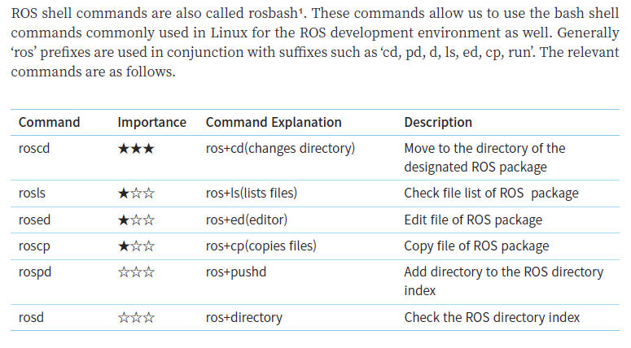

#### **ROS Execution Commands:**

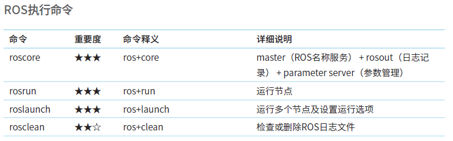

rosclean: 

- For checking and clearning ROS log file.

The following is an example for examining the log usage.

```bash
$ rosclean check
320K ROS node logs → This means the total usage for the ROS node is 320KB
```

When running ‘roscore’, if the following WARNING message appears, it means that the log file exceeds 1GB. If the system is running out of space for the log, clean up the space with
`rosclean` command.

`WARNING: disk usage in log directory [/xxx/.ros/log] is over 1GB.`

The following is an example of deleting logs in the ROS log repository (it is `/home/rt/.ros/log` in this example). If you wish to delete, press the `y` key to proceed.

```bash
$ rosclean purge
Purging ROS node logs.
PLEASE BE CAREFUL TO VERIFY THE COMMAND BELOW!
Okay to perform:
rm -rf /home/pyo/.ros/log
(y/n)?
```


#### **ROS information Commands:**

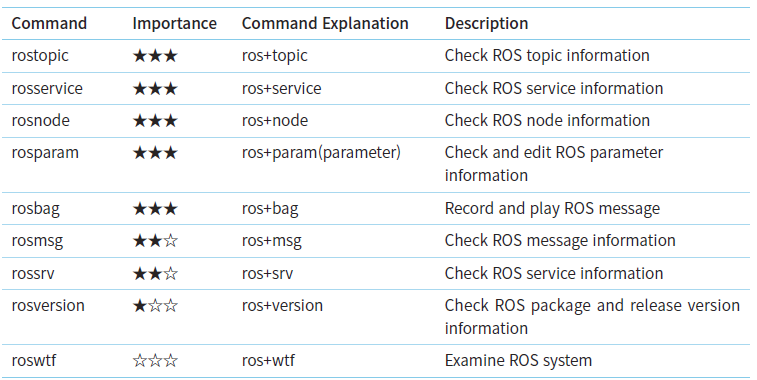


#### **ROS Catkin Commands:**

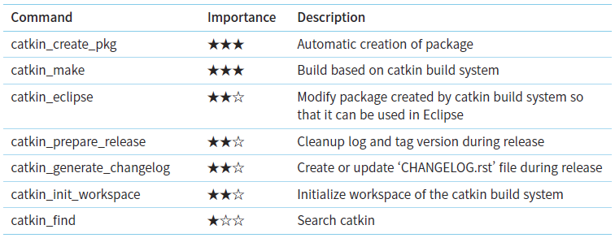

```bash
$ catkin_make -DCATKIN_WHITELIST_PACKAGES="" -DPYTHON_EXECUTABLE=/usr/bin/python3
# Build all packages with python3 interpreter

$ catkin_make -DCATKIN_WHITELIST_PACKAGES="ros_essentials_cpp" -DPYTHON_EXECUTABLE=/usr/bin/python3
# Only build ros_essentials_cpp with python3 interpreter
```

After you finished editing file, don’t forget to run catkin_make and soruce:

```bash
# In your catkin workspace
$ cd ~/catkin_ws
$ source ./devel/setup.bash
```


Error 1:

If you see the following error, that means the source src didn’t define correctly.

```bash
CMake Error at /opt/ros/melodic/share/catkin/cmake/catkin_install_python.cmake:68 (message):
  catkin_install_python() called with non-existing file
  '/home/jetbot/catkin_ws/src/ros_basics_tutorial/scripts/talker.py'.
Call Stack (most recent call first):
  ros_basics_tutorial/CMakeLists.txt:213 (catkin_install_python)
```

Solu:

Maybe try?

```bash
catkin_install_python(PROGRAMS src/scripts/talker.py
  DESTINATION ${CATKIN_PACKAGE_BIN_DESTINATION}
)
```

And this is my file tree:

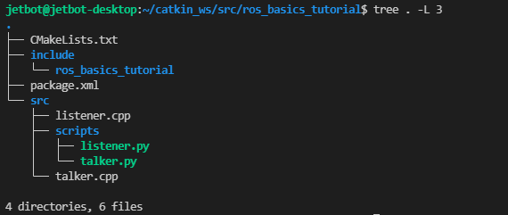


Error 2:

```bash
jetbot@jetbot-desktop:~/catkin_ws$ rosrun ros_basics_tutorial
 talker.py
[rosrun] Couldn't find executable named talker.py below /home/jetbot/catkin_ws/src/ros_basics_tutorial
[rosrun] Found the following, but they're either not files,
[rosrun] or not executable:
[rosrun]   /home/jetbot/catkin_ws/src/ros_basics_tutorial/src/scripts/talker.py
```

Solu:

https://discourse.ros.org/t/couldnt-find-executable-named-talker-py/9474

```bash
$ sudo chmod +x talker.py
```


**ROS Package Command:**

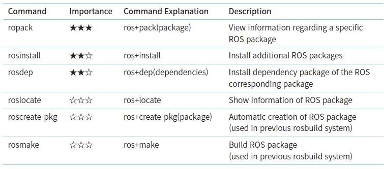


#### **ROS Communication Commands:**

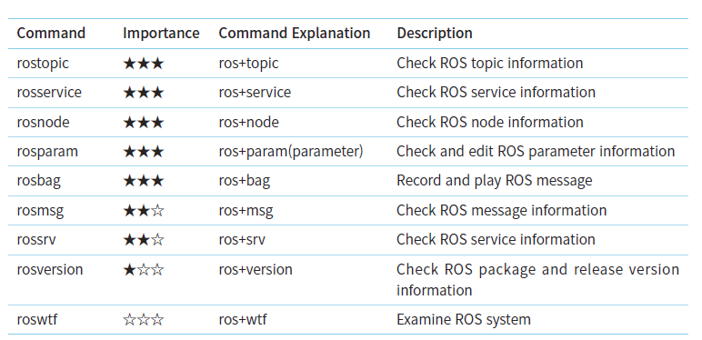

**rosnode:**

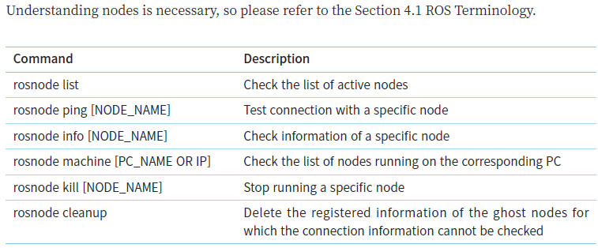

**rostopic: ROS Topic**

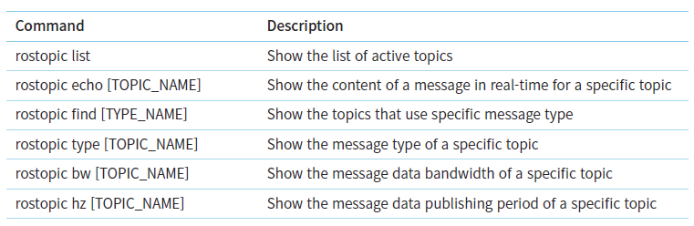

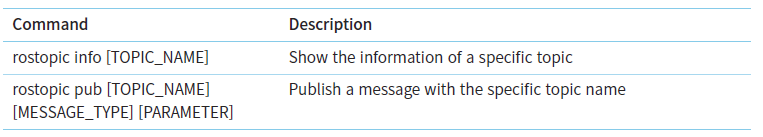

Example of rostopic pub:

```bash
# Let's see the communication topic that are running:
$ rostopic list		
/rosout
/rosout_agg
/statistics
/turtle1/cmd_vel
/turtle1/color_sensor
/turtle1/pose

# Now, we want to send some message in topic '/turtle1/cmd_vel' ==> But we first need to understand the data type for this topic, 
$ rostopic type /turtle1/cmd_vel | rosmsg show
geometry_msgs/Vector3 linear
  float64 x
  float64 y
  float64 z
geometry_msgs/Vector3 angular
  float64 x
  float64 y
  float64 z

# After understanding the data type, now, we can construct our message and send the command.
# rostopic pub [topic] [msg_type] [args]
$ rostopic pub -1 /turtle1/cmd_vel geometry_msgs/Twist -- '[2.0, 0.0, 0.0]' '[0.0, 0.0, 1.8]'
```

**5.4.4. rosservice: ROS Service**

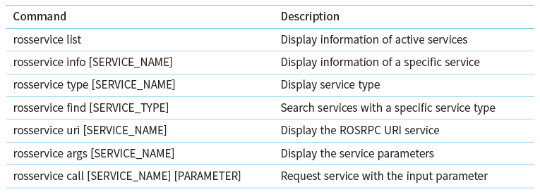

```bash
# Close all nodes before running the example regarding ROS service. Then run ‘roscore’, ‘turtlesim_node’ and ‘turtle_teleop_key’ in different terminal windows by running the following commands.
$ roscore
$ rosrun turtlesim turtlesim_node
$ rosrun turtlesim turtle_teleop_key

# rosservice list: Display information of active services ==> This command displays information about the active services. All services that are in use in the same network will be displayed.
$ rosservice list
/clear
/kill
/reset
/rosout
/get_loggers
/rosout
/set_logger_level
/spawn
/teleop_turtle/get_loggers
/teleop_turtle/set_logger_level
/turtle1/set_pen
/turtle1/teleport_absolute
/turtle1/teleport_relative
/turtlesim/get_loggers
/turtlesim/set_logger_level

# rosservice info [SERVICE_NAME]: Display information of a specific service. ==> The following is an example of checking the node name, URI, type, and parameter of the ‘/turtle1/set_pen’ service using the info option of ‘rosservice’
$ rosservice info /turtle1/set_pen
Node: /turtlesim
URI: rosrpc://192.168.1.100:34715
Type: turtlesim/SetPen
Args: r g b width off

# rosservice type [SERVICE_NAME]: Display service type ==> In the following example, we can see that the ‘/turtle1/set_pen’ service is the type of ‘turtlesim/SetPen’.
$ rosservice type /turtle1/set_pen
turtlesim/SetPen

# rosservice find [SERVICE_TYPE]: Search services with a specific service type ==> The following example is a command to search for services with the type ‘turtlesim/SetPen’. We can see that the result is ‘/turtle1/set_pen’.
$ rosservice find turtlesim/SetPen
/turtle1/set_pen

# rosservice uri [SERVICE_NAME]: Display the ROSRPC URI service ==> By using the uri option of ‘rosservice’, we can check the ROSRPC URI of the ‘/turtle1/set_pen’ service as shown below.
$ rosservice uri /turtle1/set_pen
rosrpc://192.168.1.100:50624

# rosservice args [SERVICE_NAME]: Display the service parameters ==> Let us check each parameter of the ‘/turtle1/set_pen’ service as shown in the following example. Through this command, we can check that the parameters being used in the ‘/turtle1/set_pen’ service are ‘r’, ‘g’, ‘b’, ‘width’, and ‘off’.
$ rosservice args /turtle1/set_pen
r g b width off

# rosservice call [SERViCE_NAME] [PARAMETER]: Request service with the input parameter ==> The following example is a command that requests the ‘/turtle1/set_pen’ service. The values ‘255 0 0 5 0’ correspond to the parameters (r, g, b, width, off) used for the ‘/turtle1/set_pen’ service. The value of ‘r’ which represents red has the maximum value of 255 while ‘g’ and ‘b’ are both ‘0’, so the color of the pen will be red. The ‘width’ is set to a thickness of 5, and ‘off’ is set to 0 (false), so the line will be displayed. ‘rosservice call’ is an extremely useful command that is used for testing when using a service, and is frequently used.
$ rosservice call /turtle1/set_pen 255 0 0 5 0
# Using the command above, we requested for a service that changes the properties of the pen used in turtlesim, and by ordering a command to move in ‘turtle_teleop_key’, we can see that the color of pen that was white is now displayed in red as below.

```


### Chap 7: Basic ROS Programming:

**7.1. Things to Know Before Programming ROS**

**Standard Unit:**

The messages used in ROS follows SI units, the most widely used standard in the world.

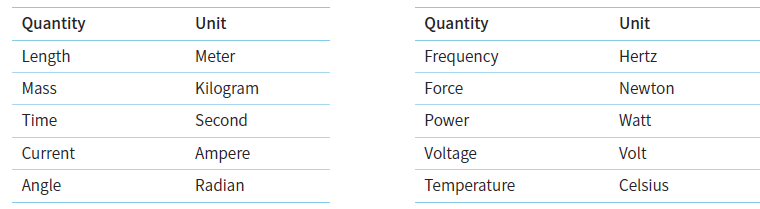

#### **Coordinate Representation**

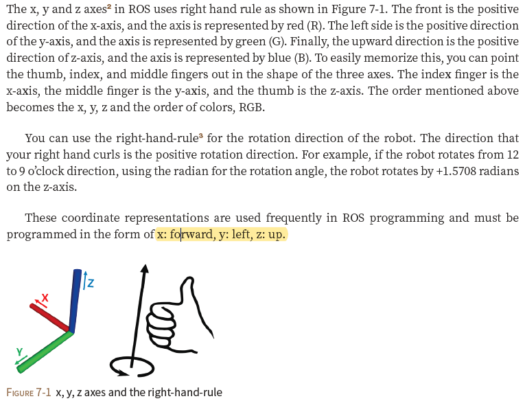

==> Just remember: 

- Right hand rule
- RGB represent the color for X, Y, Z axis

#### **Programming Rules**:

- Reusability: This reduces the amount of additional work that developers frequently need to do when working with source code, enhances code understanding among other collaborators, and facilitates code reviews between developers. This is not a requirement, but many ROS users agree and adhere to this rule.
- **Naming Convention:**
  - <u>Package, Topic, Service, and File following snake_case</u> convention
    - 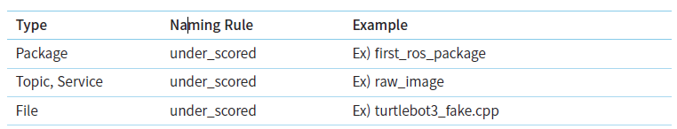
  - messages, services and action file names placed in the /msg and /srv folders follow CamelCased rules, and those *.msg, *.srv, and *.action files are converted to header files and then used as structures or types (e.g. TransformStamped.msg, SetSpeed.srv)
    - 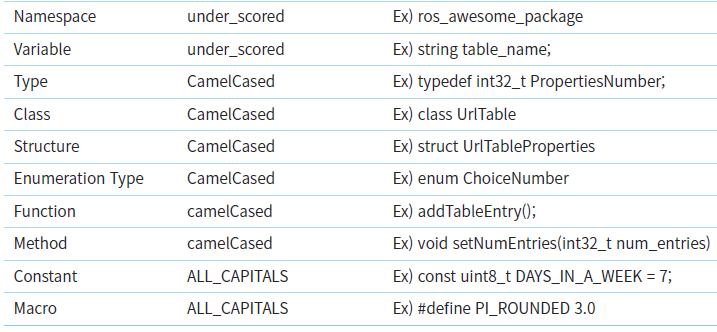

#### **Creating a Package:**

The following command creates a `'ros_tutorials_topic'`package. This package is dependent on the ‘`message_generation`’, ‘`std_msgs`’, and ‘`roscpp`’ packages, as they are appended as dependency options followed by the custom package name. 

- The **‘message_generation’** package will be <u>required to create a new message.</u> 
- ‘**std_msgs’** is the ROS standard message package 
- and **‘roscpp’** is <u>the client library to use C/C++</u> in ROS. 

These dependent packages can be included while creating the package, but they can also be added after creating the ‘`package.xml`’ in the package folder.

```bash
$ cd ~/catkin_ws/src
$ catkin_create_pkg ros_tutorials_topic message_generation std_msgs roscpp
```

When the package is created, the `ros_tutorials_topic `package folder is created in the `~/catkin_ws/src` folder. In this package folder, the `CMakeLists.txt` and `package.xml `files are created along with default folders. You can inspect it with the ‘ls’ command as below, or check the inside of the package using the GUI-based Nautilus, which is similar to Windows File Explorer.

```bash
$ cd ros_tutorials_topic
$ ls
include → Header File Folder
src → Source Code Folder
CMakeLists.txt → Build Configuration File
package.xml → Package Configuration File
```


Writing the Publisher Node


## Core ROS Tutorials

### Beginner Level

#### Installing and Configuring Your ROS Environment

**Install ROS**
Before starting these tutorials please complete installation as described in the ROS installation instructions.

**Managing Your Environment**

you are ever having problems finding or using your ROS packages make sure that you have your environment properly setup. A good way to check is to ensure that [environment variables](http://wiki.ros.org/ROS/EnvironmentVariables) like [ROS_ROOT](http://wiki.ros.org/ROS/EnvironmentVariables#ROS_ROOT) and [ROS_PACKAGE_PATH](http://wiki.ros.org/ROS/EnvironmentVariables#ROS_PACKAGE_PATH) are set:

```
$ printenv | grep ROS
```

If you just installed ROS from `apt` on Ubuntu then you will have setup.*sh files in '`/opt/ros/<distro>/`', and you could source them like so:

```
$ source /opt/ros/<distro>/setup.bash
```

**Create a ROS Workspace**

Let's create and build a [catkin workspace](http://wiki.ros.org/catkin/workspaces):

```bash
$ mkdir -p ~/catkin_ws/src
$ cd ~/catkin_ws/
# Python 3 users in ROS Melodic and earlier: note, if you are building ROS from source to achieve Python 3 compatibility, and have setup your system appropriately (ie: have the Python 3 versions of all the required ROS Python packages installed, such as catkin) the first catkin_make command in a clean catkin workspace must be:
$ catkin_make -DPYTHON_EXECUTABLE=/usr/bin/python3

# Additionally, if you look in your current directory you should now have a 'build' and 'devel' folder. Inside the 'devel' folder you can see that there are now several setup.*sh files. Sourcing any of these files will overlay this workspace on top of your environment. To understand more about this see the general catkin documentation: catkin. Before continuing source your new setup.*sh file:
$ source devel/setup.bash

# To make sure your workspace is properly overlayed by the setup script, make sure ROS_PACKAGE_PATH environment variable includes the directory you're in.
$ echo $ROS_PACKAGE_PATH
/home/youruser/catkin_ws/src:/opt/ros/kinetic/share
```


#### Navigating the ROS Filesystem

This tutorial introduces ROS filesystem concepts, and covers using the roscd, rosls, and [rospack](http://wiki.ros.org/rospack) commandline tools.

**Review**
You may have noticed a pattern with the naming of the ROS tools:

- rospack = ros + pack(age)
- roscd = ros + cd
- rosls = ros + ls


---

#### [Creating a ROS Package ](http://wiki.ros.org/ROS/Tutorials/CreatingPackage)+ [Building a ROS Package](http://wiki.ros.org/ROS/Tutorials/BuildingPackages)

This tutorial covers using [roscreate-pkg](http://wiki.ros.org/roscreate) or [catkin](http://wiki.ros.org/catkin) to create a new package, and [rospack](http://wiki.ros.org/rospack) to list package dependencies, and the toolchain to build a package.

**File structure for a typical catkin packages:**

```bash
The recommended method of working with catkin packages is using a catkin workspace, but you can also build catkin packages standalone. A trivial workspace might look like this:

workspace_folder/        -- WORKSPACE
  src/                   -- SOURCE SPACE
    CMakeLists.txt       -- 'Toplevel' CMake file, provided by catkin
    package_1/
      CMakeLists.txt     -- CMakeLists.txt file for package_1
      package.xml        -- Package manifest for package_1
    ...
    package_n/
      CMakeLists.txt     -- CMakeLists.txt file for package_n
      package.xml        -- Package manifest for package_n
```


**Procedure:** 

```bash
# Step1: You should have created this in the Creating a Workspace Tutorial
$ cd ~/catkin_ws/src

# Step2: Now use the catkin_create_pkg script to create a new package called 'beginner_tutorials' which depends on std_msgs, roscpp, and rospy:
# catkin_create_pkg <package_name> [depend1] [depend2] [depend3]
$ catkin_create_pkg beginner_tutorials std_msgs rospy roscpp
Created file beginner_tutorials/package.xml
Created file beginner_tutorials/CMakeLists.txt
Created folder beginner_tutorials/include/beginner_tutorials
Created folder beginner_tutorials/src
Successfully created files in /home/jetbot/catkin_ws/src/beginner_tutorials. Please adjust the values in package.xml.


# Step3: Building a catkin workspace and sourcing the setup file in the catkin workspace:
$ cd ~/catkin_ws
catkin_make
# To add the workspace to your ROS environment you need to source the generated setup file:
$ . ~/catkin_ws/devel/setup.bash

# Step 4: Checking First-order dependencies
# When using catkin_create_pkg earlier, a few package dependencies were provided. These first-order dependencies can now be reviewed with the rospack tool.
# $ rospack depends1 <package_name> 
$ rospack depends1 beginner_tutorials 
roscpp
rospy
std_msgs

# As you can see, rospack lists the same dependencies that were used as arguments when running catkin_create_pkg. These dependencies for a package are stored in the package.xml file:
$ roscd beginner_tutorials
$ cat package.xml
<package format="2">
...
  <buildtool_depend>catkin</buildtool_depend>
  <build_depend>roscpp</build_depend>
  <build_depend>rospy</build_depend>
  <build_depend>std_msgs</build_depend>
...
</package>

# Checking Indirect dependencies
# In many cases, a dependency will also have its own dependencies. For instance, rospy has other dependencies.
$ rospack depends1 rospy
genpy
roscpp
rosgraph
rosgraph_msgs
roslib
std_msgs

# A package can have quite a few indirect dependencies. Luckily rospack can recursively determine all nested dependencies.
$ rospack depends beginner_tutorials
cpp_common
rostime
roscpp_traits
roscpp_serialization
catkin
genmsg
genpy
message_runtime
gencpp
geneus
gennodejs
genlisp
message_generation
rosbuild
rosconsole
std_msgs
rosgraph_msgs
xmlrpcpp
roscpp
rosgraph
ros_environment
rospack
roslib
rospy

# Step 5: Customizing Your Package
# The generated package.xml should be in your new package. Now lets go through the new package.xml and touch up any elements that need your attention.

# description tag
 <description>The beginner_tutorials package</description>
# maintainer tags
<maintainer email="you@yourdomain.tld">Your Name</maintainer>
# license tags
 <license>BSD</license>
# dependencies tags
<!-- Use build_depend for packages you need at compile time: -->
<build_depend>genmsg</build_depend>
<!-- Use buildtool_depend for build tool packages: -->
<buildtool_depend>catkin</buildtool_depend>
<!-- Use exec_depend for packages you need at runtime: -->
<exec_depend>python-yaml</exec_depend>
<!-- Use test_depend for packages you need only for testing: -->
<test_depend>gtest</test_depend>

# Step 6: Building Packages with catkin_make
# $ catkin_make [make_targets] [-DCMAKE_VARIABLES=...]

$ catkin_make -DCMAKE_VARIABLES=""

-- Build files have been written to: /home/jetbot/catkin_ws/build
####
#### Running command: "make -j4 -l4" in "/home/jetbot/catkin_ws/build"
####
[  0%] Built target std_msgs_generate_messages_nodejs
[  0%] Built target std_msgs_generate_messages_cpp
[  0%] Built target std_msgs_generate_messages_lisp
[  0%] Built target std_msgs_generate_messages_py
[  0%] Built target std_msgs_generate_messages_eus
[  0%] Built target sketch_generate_messages_nodejs
[  0%] Built target sketch_generate_messages_cpp
[  0%] Built target sketch_generate_messages_py
[  0%] Built target sketch_generate_messages_lisp
[100%] Built target sketch_generate_messages_eus
[100%] Built target sketch_generate_messages
```

Appendix

```bash
Appendix: Complicated package.xml
<?xml version="1.0"?>
<package format="2">
  <name>beginner_tutorials</name>
  <version>0.1.0</version>
  <description>The beginner_tutorials package</description>

  <maintainer email="you@yourdomain.tld">Your Name</maintainer>
  <license>BSD</license>
  <url type="website">http://wiki.ros.org/beginner_tutorials</url>
  <author email="you@yourdomain.tld">Jane Doe</author>

  <buildtool_depend>catkin</buildtool_depend>

  <build_depend>roscpp</build_depend>
  <build_depend>rospy</build_depend>
  <build_depend>std_msgs</build_depend>

  <exec_depend>roscpp</exec_depend>
  <exec_depend>rospy</exec_depend>
  <exec_depend>std_msgs</exec_depend>

</package>
```


---

#### Understanding ROS Nodes

This tutorial introduces ROS graph concepts and discusses the use of [roscore](http://wiki.ros.org/roscore), [rosnode](http://wiki.ros.org/rosnode), and [rosrun](http://wiki.ros.org/rosrun) commandline tools.

```bash
# start master node
$ roscore
# If roscore does not initialize and sends a message about lack of permissions, probably the ~/.ros folder is owned by root, change recursively the ownership of that folder with:
$ sudo chown -R <your_username> ~/.ros

# Lists all active nodes:
$ rosnode list
You will see:
/rosout	# The `rosout` node for subscribing, logging, and republishing the messages. See more here, http://wiki.ros.org/rosout

# The rosnode info command returns information about a specific node.
$ rosnode info /rosout


# Let's bring up another node
$ rosrun turtlesim turtlesim_node

$ rosnode list
You will see something similar to:
/rosout
/turtlesim

# Close/Terminal that window, and relaunch it with a custom node name:
$ rosrun turtles

# Now, if we go back and use rosnode list:
$ rosnode list
You will see something similar to:
/my_turtle
/rosoutim turtlesim_node __name:=my_turtle


# to test that it's up:
$ rosnode ping my_turtle
rosnode: node is [/my_turtle]
pinging /my_turtle with a timeout of 3.0s
xmlrpc reply from http://aqy:42235/     time=1.152992ms
xmlrpc reply from http://aqy:42235/     time=1.120090ms
xmlrpc reply from http://aqy:42235/     time=1.700878ms
xmlrpc reply from http://aqy:42235/     time=1.127958ms
```

**Review What was covered:**

- **roscore = ros+core :** master (provides name service for ROS) + rosout (stdout/stderr) + parameter server (parameter server will be introduced later)
- rosnode = ros+node : ROS tool to get information about a node.
- **rosrun = ros+run :** runs a node from a given package.


---

#### [Understanding ROS Topics](http://wiki.ros.org/ROS/Tutorials/UnderstandingTopics)

This tutorial introduces ROS topics as well as using the [rostopic](http://wiki.ros.org/rostopic) and [rqt_plot](http://wiki.ros.org/rqt_plot) commandline tools.

**Setup**

```bash
# Let's start by making sure that we have roscore running, in a new terminal:
$ roscore

# run turtlesim in a new terminal:
$ rosrun turtlesim turtlesim_node
failed to get the current screen resources
[ INFO] [1638072023.930022732]: Starting turtlesim with node name /turtlesim
[ INFO] [1638072023.962090265]: Spawning turtle [turtle1] at x=[5.544445], y=[5.544445], theta=[0.000000]
QXcbConnection: XCB error: 170 (Unknown), sequence: 170, resource id: 90, major code: 146 (Unknown), minor code: 20


# run turtle keyboard teleoperation in a new terminal, which allow us to drive the turtle around with
$ rosrun turtlesim turtle_teleop_key
jetbot@jetbot-desktop:~/catkin_ws$ rosrun turtlesim turtle_teleop_key
Reading from keyboard
---------------------------
Use arrow keys to move the turtle. 'q' to quit.
```

##### **ROS Topics**

The `turtlesim_node` and the `turtle_teleop_key` node are communicating with each other over a ROS **Topic**. `turtle_teleop_key` is **publishing** the key strokes on a topic, while `turtlesim` **subscribes** to the same topic to receive the key strokes. Let's use [rqt_graph](http://wiki.ros.org/rqt_graph) which shows the nodes and topics currently running.

```bash
# Using rqt_graph: rqt_graph creates a dynamic graph of what's going on in the system. rqt_graph is part of the rqt package. Unless you already have it installed, run:
$ sudo apt-get install ros-<distro>-rqt
$ sudo apt-get install ros-<distro>-rqt-common-plugins

# In a new terminal:
$ rosrun rqt_graph rqt_graph
```

You will see something similar to:


Introducing rostopic

The `rostopic` tool allows you to get information about ROS **topics**.

You can use the help option to get the available sub-commands for `rostopic`

```bash
$ rostopic -h
# Or pressing tab key after rostopic prints the possible sub-commands:
$ rostopic 
bw    echo  find  hz    info  list  pub   type 
```

**Using rostopic echo**

`rostopic echo` shows the data published on a topic.

Usage:

```
rostopic echo [topic]
```

Let's look at the command velocity data published by the `turtle_teleop_key` node.

*For ROS Hydro and later,* this data is published on the `/turtle1/cmd_vel` topic. **In a new terminal, run:**

```bash
$ rostopic echo /turtle1/cmd_vel
linear: 
  x: 2.0
  y: 0.0
  z: 0.0
angular: 
  x: 0.0
  y: 0.0
  z: 0.0
```

You probably won't see anything happen because no data is being published on the topic. Let's make `turtle_teleop_key` publish data by pressing the arrow keys. **Remember if the turtle isn't moving you need to select the `turtle_teleop_key` terminal again.**

Now let's look at `rqt_graph` again. Press the refresh button in the upper-left to show the new node. As you can see `rostopic echo`, shown here in red, is now also **subscribed** to the `turtle1/command_velocity` topic.


**Using rostopic list**

`rostopic list` returns a list of all topics currently subscribed to and published.

Let's figure out what argument the `list` sub-command needs. In a **new terminal** run:

```bash
$ rostopic list -h
# Or use the verbose option:
$ rostopic list -v
Published topics:
 * /turtle1/color_sensor [turtlesim/Color] 1 publisher
 * /turtle1/cmd_vel [geometry_msgs/Twist] 1 publisher
 * /rosout [rosgraph_msgs/Log] 2 publishers
 * /rosout_agg [rosgraph_msgs/Log] 1 publisher
 * /turtle1/pose [turtlesim/Pose] 1 publisher

Subscribed topics:
 * /turtle1/cmd_vel [geometry_msgs/Twist] 1 subscriber
 * /rosout [rosgraph_msgs/Log] 1 subscriber
```


##### ROS Messages

Communication on topics happens by sending ROS **messages** between nodes. For the publisher (`turtle_teleop_key`) and subscriber (`turtlesim_node`) to communicate, the publisher and subscriber must send and receive the same **type** of message. This means that a topic **type** is defined by the message **type** published on it. The **type** of the message sent on a topic can be determined using `rostopic type`.

`rostopic type` returns the message type of any topic being published.

Usage:

```
rostopic type [topic]
```

*For ROS Hydro and later,*

- Try:

  ```bash
  $ rostopic type /turtle1/cmd_vel
  geometry_msgs/Twist
  # <package dirctory>/<ROS message>
  
  jetbot@jetbot-desktop:/opt/ros/melodic/share/geometry_msgs/msg$ cat Twist.msg
  # This expresses velocity in free space broken into its linear and angular parts.
  Vector3  linear
  Vector3  angular
  
  jetbot@jetbot-desktop:/opt/ros/melodic/share/geometry_msgs/msg$ cat Vector3.msg
  # This represents a vector in free space.
  # It is only meant to represent a direction. Therefore, it does not
  # make sense to apply a translation to it (e.g., when applying a
  # generic rigid transformation to a Vector3, tf2 will only apply the
  # rotation). If you want your data to be translatable too, use the
  # geometry_msgs/Point message instead.
  
  float64 x
  float64 y
  float64 z
  
  # We can look at the details of the message using rosmsg:
  $ rosmsg show geometry_msgs/Twist
  geometry_msgs/Vector3 linear
    float64 x
    float64 y
    float64 z
  geometry_msgs/Vector3 angular
    float64 x
    float64 y
    float64 z
  ```

  As we can see below, `geometry_msgs` represents the name of package directory, and `Twist `is the ROS message for file Twist.msg, which shown below:

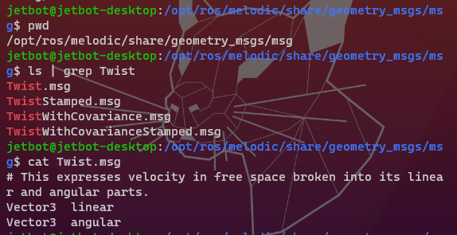

and the Vector3 is also an ROS message defined in Vector3.msg file, shown below:

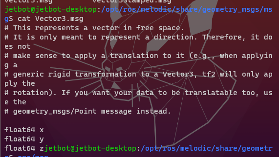


**msg File**

The ‘msg’ file is the message file used by topics, with has the file extension of ‘*.msg’. The ‘Twist’ message in the ‘geometry_msgs’ described above is an example of message. Such msg file <u>consists of field types and field names</u>.

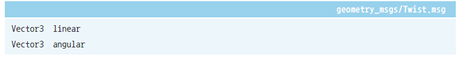

**srv File**

The ‘srv’ file is the message file used by services, with the file extension of ‘*.srv’. For example, the SetCameraInfo message in the ‘sensor_msgs’ described above is a typical srv file. The major difference from the msg file is that the series of three hyphens (---) serve as a delimiter; the upper message being the service request message and the lower message being the service response message.

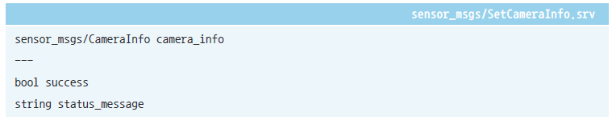


ROS_Robot_Programming – 4.3. Message:


**rostopic pub**

`rostopic pub` publishes data on to a topic currently advertised.

Usage:

```
rostopic pub [topic] [msg_type] [args]
```

*For ROS Hydro and later,* example:

```bash
# rostopic pub [topic] [msg_type] [args]
$ rostopic pub -1 /turtle1/cmd_vel geometry_msgs/Twist -- '[2.0, 0.0, 0.0]' '[0.0, 0.0, 1.8]'
publishing and latching message for 3.0 seconds
# rostopic pub -1 ==> publish one message then exit:
# /turtle1/cmd_vel ==> the name of the topic to publish to:
# geometry_msgs/Twist ==> the message type to use when publishing to the topic
# -- '[2.0, 0.0, 0.0]' '[0.0, 0.0, 1.8]'  ==> required arguments, with linear velocity value x=2.0, y=0.0, and z=0.0, and angular velocity value x=0.0, y=0.0, and z=1.8 

$ rostopic pub /turtle1/cmd_vel geometry_msgs/Twist -r 1 -- '[2.0, 0.0, 0.0]' '[0.0, 0.0, 1.8]'
# -r 1 -- '[2.0, 0.0, 0.0]' '[0.0, 0.0, 1.8]' ==>  keep moving at 1 Hz steady stream of commands

```

The First command will send a single message to turtlesim telling it to move with a linear velocity of 2.0, and an angular velocity of 1.8 .

- .png)

The second command publishes the velocity commands at a rate of 1 Hz on the velocity topic.

- 2.png)

We can also look at what is happening in `rqt_graph`. Press the refresh button in the upper-left. The rostopic pub node (here in red) is communicating with the rostopic echo node (here in green):


As you can see the turtle is running in a continuous circle. In a <u>new terminal,</u> we can use `rostopic echo` to see the data published by our turtlesim:

```bash
$ rostopic echo /turtle1/pose
x: 6.24901485443
y: 5.80964660645
theta: 0.691200017929
linear_velocity: 0.0
angular_velocity: 0.0
---
x: 6.24901485443
y: 5.80964660645
theta: 0.691200017929
linear_velocity: 0.0
angular_velocity: 0.0
---
```


**Using rostopic hz**

`rostopic hz` reports the rate at which data is published.

Usage:

```
rostopic hz [topic]
```

Let's see how fast the `turtlesim_node` is publishing `/turtle1/pose`:

```bash
$ rostopic hz /turtle1/pose
subscribed to [/turtle1/pose]
average rate: 59.354
        min: 0.005s max: 0.027s std dev: 0.00284s window: 58
average rate: 59.459
        min: 0.005s max: 0.027s std dev: 0.00271s window: 118
average rate: 59.539
        min: 0.004s max: 0.030s std dev: 0.00339s window: 177
average rate: 59.492
        min: 0.004s max: 0.030s std dev: 0.00380s window: 237
average rate: 59.463
        min: 0.004s max: 0.030s std dev: 0.00380s window: 290
```


##### Using rqt_plot

`rqt_plot` displays a scrolling time plot of the data published on topics. Here we'll use `rqt_plot` to plot the data being published on the `/turtle1/pose` topic. First, start rqt_plot by typing

```bash
$ rosrun rqt_plot rqt_plot
```

in a new terminal. In the new window that should pop up, a text box in the upper left corner gives you the ability to add any topic to the plot. Typing `/turtle1/pose/x` will highlight the plus button, previously disabled. Press it and repeat the same procedure with the topic `/turtle1/pose/y`. You will now see the turtle's x-y location plotted in the graph.


Pressing the minus button shows a menu that allows you to hide the specified topic from the plot. Hiding both the topics you just added and adding `/turtle1/pose/theta` will result in the plot shown in the next figure.

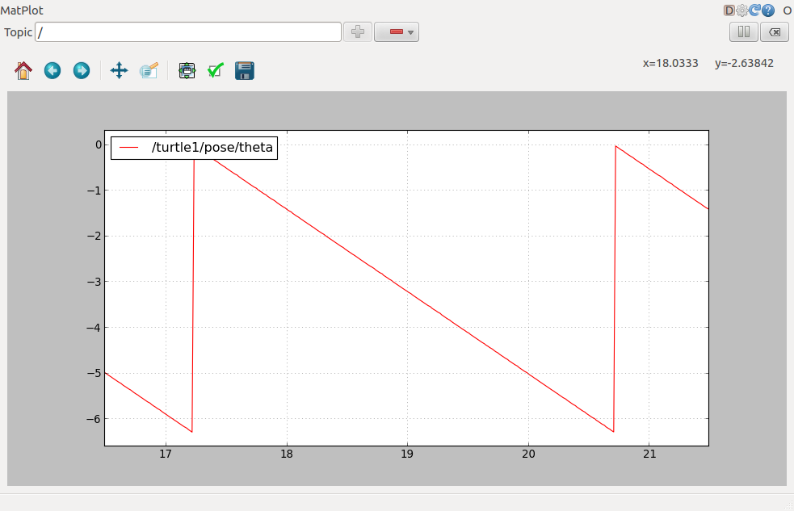

That's it for this section, use `Ctrl-C` to kill the `rostopic` terminals but keep your turtlesim running.


##### All in one

```bash
# Let's start by making sure that we have roscore running, in a new terminal:
$ roscore

# run turtlesim in a new terminal:
$ rosrun turtlesim turtlesim_node

# run turtle keyboard teleoperation in a new terminal, which allow us to drive the turtle around with
$ rosrun turtlesim turtle_teleop_key

# Let's check all the nodes/process that are running
$ rosnode list
/rosout
/rostopic_16241_1637995735167
/rqt_gui_py_node_12850
/teleop_turtle
/turtlesim

# Let's see the communication topic that are running:
$ rostopic list		
/rosout
/rosout_agg
/statistics
/turtle1/cmd_vel
/turtle1/color_sensor
/turtle1/pose

# Now, we want to send some message in topic '/turtle1/cmd_vel' ==> But we first need to understand the data type for this topic, 
$ rostopic type /turtle1/cmd_vel
geometry_msgs/Twist
$ rosmsg show geometry_msgs/Twist
geometry_msgs/Vector3 linear
  float64 x
  float64 y
  float64 z
geometry_msgs/Vector3 angular
  float64 x
  float64 y
  float64 z
# ==> Combine two command in one
$ rostopic type /turtle1/cmd_vel | rosmsg show
geometry_msgs/Vector3 linear
  float64 x
  float64 y
  float64 z
geometry_msgs/Vector3 angular
  float64 x
  float64 y
  float64 z

# After understanding the data type, now, we can construct our message and send the command.
# rostopic pub [topic] [msg_type] [args]
$ rostopic pub -1 /turtle1/cmd_vel geometry_msgs/Twist -- '[2.0, 0.0, 0.0]' '[0.0, 0.0, 1.8]'
# rostopic pub -1 ==> publish one message then exit:
# /turtle1/cmd_vel ==> the name of the topic to publish to:
# geometry_msgs/Twist ==> the message type to use when publishing to the topic
# -- '[2.0, 0.0, 0.0]' '[0.0, 0.0, 1.8]'  ==> required arguments, with linear velocity value x=2.0, y=0.0, and z=0.0, and angular velocity value x=0.0, y=0.0, and z=1.8 
$ rostopic pub  -r 1 /turtle1/cmd_vel geometry_msgs/Twist '{linear: {x: -100.0, y: 0.0, z: 0.0}, angular: {x: 0.0,y: 0.0,z: 50.0}}'
# rostopic pub  -r 5 ==> publish five message then exit:
# /turtle1/cmd_vel ==> the name of the topic to publish to:
# geometry_msgs/Twist ==> the message type to use when publishing to the topic
# '{linear: {x: -0.9, y: 0.0, z: 0.0}, angular: {x: 0.0,y: 0.0,z: 0.5}}'  ==> with json format, moving in x axis with 0.9 velocity, and in backward direction and counter-clockwise.

$ rostopic pub /turt1/cmd_vel geometry_msgs/Twist -r 1 -- '[2.0, 0.0, 0.0]' '[0.0, 0.0, 1.8]'
# -r 1 -- '[2.0, 0.0, 0.0]' '[0.0, 0.0, 1.8]' ==>  keep moving at 1 Hz steady stream of commands
# Or with yam format
$ rostopic pub /turtle1/cmd_vel geometry_msgs/Twist -r 1 -- '{linear: {x: 2.0, y: 0.0, z: 0.0}, angular: {x: 0.0,y: 0.0,z: 0.0}}'


# In a new terminal, we can use rostopic echo to see the real-time command_velocity data being published on a topic, in a new terminal, run:
$ rostopic echo /turtle1/cmd_vel
linear:
  x: 2.0
  y: 0.0
  z: 0.0
angular:
  x: 0.0
  y: 0.0
  z: 1.8
---

# In a new terminal, we can use rostopic echo to see the real-time pose data published by our turtlesim:
$ rostopic echo /turtle1/pose
x: 10.5013017654
y: 4.91405010223
theta: 1.550532341
linear_velocity: 2.0
angular_velocity: 1.79999995232

# rostopic hz reports the rate at which data is published.
$ rostopic hz /turtle1/pose
subscribed to [/turtle1/pose]
average rate: 16.485
        min: 0.016s max: 0.196s std dev: 0.07393s window: 16
average rate: 15.658
        min: 0.015s max: 0.206s std dev: 0.07571s window: 29
average rate: 15.525

# Note about turtlesim:
# ==> For velocity, you can move in x and y direction, but no in z direction ==> Because this is a 2D plane
# ==> For angular vel, you only can control z, because it's a 2D plane, thinking a arrow pointing outward!!!
$ rostopic pub  -r 1 /turtle1/cmd_vel geometry_msgs/Twist '{linear: {x: 0.9, y: 0.0, z: 0.0}, angular: {x: 0.0,y: 0.0,z: 5.0}}'  # ==> moving clockwise and forward direction
$ rostopic pub  -r 10 /turtle1/cmd_vel geometry_msgs/Twist '{linear: {x: 0.0, y: 0.0, z: 0.0}, angular: {x: 0.0,y: 0.0,z: -5.0}}'  # ==>  Rotate clockwise
```

You will see it’s running in a circle:


##### More Fun about ROS Turtlesim 

- ROS.org, [turtlesim Tutoria](http://wiki.ros.org/turtlesim/Tutorials/Go%20to%20Goal)l, 

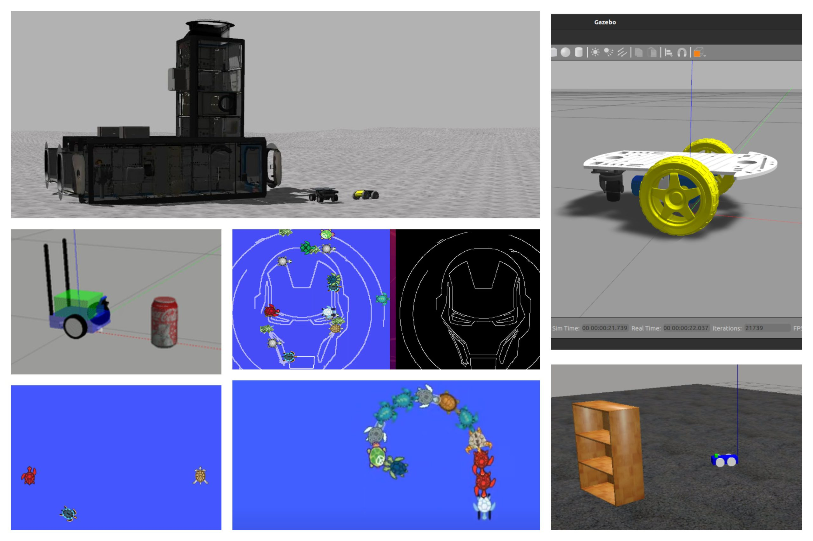

**Snake Game using ROS Turtlesim**

**Project: Turtle-Sketch**

- In this project, the image on the left is taken as input and the image on the right is obtained as output by using turtlesim

[](https://github.com/Shilpaj1994/TurtleSim-Sketch/blob/master/sketch/docs/Output.png)

```bash
# Download the packages
git clone https://github.com/Shilpaj1994/TurtleSim-Sketch.git
catkin_make -DCATKIN_WHITELIST_PACKAGES="orb_slam2_ros"
# Move sketch, image_thresholding, and dynamic-reconfigure-no
tic-devel to ROS_ws/src

# Build the workspace
catkin_make -DCATKIN_WHITELIST_PACKAGES="sketch;image_thresholding; dynamic_reconfigure"
source ~/catkin_ws/devel/setup.bash

```


---

#### [Understanding ROS Services and Parameters]()

This tutorial introduces ROS services, and parameters as well as using the [rosservice](http://wiki.ros.org/rosservice) and [rosparam](http://wiki.ros.org/rosparam) commandline tools.

- [**msg**](http://wiki.ros.org/msg): msg files are <u>simple text files that describe the fields of a ROS message</u>. They are used to generate source code for messages in different languages.
- [**srv**](http://wiki.ros.org/srv): an srv file <u>describes a service</u>. It is <u>composed of two parts: a request and a response</u>.

msg files are stored in the `msg` directory of a package, and srv files are stored in the `srv` directory.

**msgs** are just <u>simple text files with a field type and field name per line</u>. The field types you can use are:

- int8, int16, int32, int64 (plus uint*)
- float32, float64
- string
- time, duration
- other msg files
- variable-length array[] and fixed-length array[C]

Here is an example of Twist message that we saw previously:

```bash
jetbot@jetbot-desktop:/opt/ros/melodic/share/geometry_msgs/msg$ cat Twist.msg
# This expresses velocity in free space broken into its linear and angular parts.
Vector3  linear
Vector3  angular
```

There is also a <u>special type in ROS</u>: `Header`, the **header** <u>contains a timestamp and coordinate frame information</u> that are commonly used in ROS. You will frequently see the first line in a msg file have `Header header`.

Here is an example of a msg that uses a Header, a string primitive, and two other msgs :

```
  Header header
  string child_frame_id
  geometry_msgs/PoseWithCovariance pose
  geometry_msgs/TwistWithCovariance twist
```

**srv files** are just like msg files, except they contain two parts: <u>a request and a response.</u> The two parts are separated by a '---' line. Here is an example of a srv file:

```
int64 A
int64 B
---
int64 Sum
```

In the above example, <u>`A` and `B` are the request, and `Sum` is the response</u>.

##### Using msg

**Creating a msg**

Step 1: Define a new msg in the package that was created in the previous tutorial.

```bash
$ roscd beginner_tutorials
$ mkdir msg
$ echo "int64 num" > msg/Num.msg
```

The example `.msg` file above contains only 1 line. You can, of course, create a more complex file by adding multiple elements, one per line, like this:

```
string first_name
string last_name
uint8 age
uint32 score
```


Step2: There's one more step, though. We need to make sure that the msg files are turned into source code for C++, Python, and other languages. Open `package.xml`, and make sure these two lines are in it and [uncommented](http://www.htmlhelp.com/reference/wilbur/misc/comment.html):

```
  <build_depend>message_generation</build_depend>
  <exec_depend>message_runtime</exec_depend>
```

Note that at build time, we need "message_generation", while at runtime, we only need "message_runtime". 


Step 3: Open `CMakeLists.txt` in your favorite text editor ([rosed](http://wiki.ros.org/ROS/Tutorials/UsingRosEd) from the previous tutorial is a good option). Add the `message_generation` dependency to the `find_package` call which already exists in your `CMakeLists.txt` so that you can generate messages. You can do this by simply adding `message_generation` to the list of `COMPONENTS` such that it looks like this:

```
# Do not just add this to your CMakeLists.txt, modify the existing text to add message_generation before the closing parenthesis
find_package(catkin REQUIRED COMPONENTS
   roscpp
   rospy
   std_msgs
   message_generation
)
```

You may notice that sometimes your project builds fine even if you did not call `find_package` with all dependencies. This is because catkin combines all your projects into one, so if an earlier project calls `find_package`, yours is configured with the same values. But forgetting the call means your project can easily break when built in isolation.

Also make sure you export the message runtime dependency.

```
catkin_package(
  ...
  CATKIN_DEPENDS message_runtime ...
  ...)
```

Find the following block of code:

```
# add_message_files(
#   FILES
#   Message1.msg
#   Message2.msg
# )
```

Uncomment it by removing the `#` symbols and then replace the stand in `Message*.msg` files with your `.msg` file, such that it looks like this:

```
add_message_files(
  FILES
  Num.msg
)
```

By adding the .msg files manually, we make sure that CMake knows when it has to reconfigure the project after you add other .msg files.

Now we must ensure the `generate_messages()` function is called.

*For ROS Hydro and later,* you need to uncomment these lines:

```
# generate_messages(
#   DEPENDENCIES
#   std_msgs
# )
```

- so it looks like:

  ```
  generate_messages(
    DEPENDENCIES
    std_msgs
  )
  ```

*In earlier versions,* you may just need to uncomment one line:

```
generate_messages()
```

Now you're ready to generate source files from your msg definition. If you want to do so right now, skip next sections to [Common step for msg and srv](http://wiki.ros.org/ROS/Tutorials/CreatingMsgAndSrv#Common_step_for_msg_and_srv).


**Using rosmsg**

That's all you need to do to create a msg. Let's make sure that ROS can see it using the `rosmsg show` command.

Usage:

```bash
$ rosmsg show [message type]
```

Example:

```bash
$ rosmsg show beginner_tutorials/Num
```

You will see:

```
int64 num
```

In the previous example, the message type consists of two parts:

- `beginner_tutorials` -- the package where the message is defined
- `Num` -- The name of the msg `Num`.

If you can't remember which Package a msg is in, you can leave out the package name. Try:

```bash
$ rosmsg show Num
```

You will see:

```bash
[beginner_tutorials/Num]:
int64 num
```


##### Using srv

**Creating a srv**

Let's use the package we just created to create a srv:

```bash
$ roscd beginner_tutorials
$ mkdir srv
```

Instead of creating a new srv definition by hand, we will copy an existing one from another package. For that, `roscp` is a useful commandline tool for copying files from one package to another.

Usage:

```bash
$ roscp [package_name] [file_to_copy_path] [copy_path]
```

Now we can copy a service from the [rospy_tutorials](http://wiki.ros.org/rospy_tutorials) package:

```bash
$ roscp rospy_tutorials AddTwoInts.srv srv/AddTwoInts.srv
```

There's one more step, though. We need to make sure that the srv files are turned into source code for C++, Python, and other languages.

Unless you have done so already, open `package.xml`, and make sure these two lines are in it and [uncommented](http://www.htmlhelp.com/reference/wilbur/misc/comment.html):

```
  <build_depend>message_generation</build_depend>
  <exec_depend>message_runtime</exec_depend>
```

As before, note that at build time, we need "message_generation", while at runtime, we only need "message_runtime".

Unless you have done so already for messages in the previous step, add the `message_generation` dependency to generate messages in `CMakeLists.txt`:

```
# Do not just add this line to your CMakeLists.txt, modify the existing line
find_package(catkin REQUIRED COMPONENTS
  roscpp
  rospy
  std_msgs
  message_generation
)
```

(Despite its name, `message_generation` works for both `msg` and `srv`.)

Also you need the same changes to package.xml for services as for messages, so look above for the additional dependencies required.

Remove `#` to uncomment the following lines:

```
# add_service_files(
#   FILES
#   Service1.srv
#   Service2.srv
# )
```

And replace the placeholder `Service*.srv` files for your service files:

```
add_service_files(
  FILES
  AddTwoInts.srv
)
```

Now you're ready to generate source files from your service definition. If you want to do so right now, skip next sections to [Common step for msg and srv](http://wiki.ros.org/ROS/Tutorials/CreatingMsgAndSrv#Common_step_for_msg_and_srv).


##### Using rossrv

That's all you need to do to create a srv. Let's make sure that ROS can see it using the `rossrv show` command.

Usage:

```bash
$ rossrv show <service type>
```

Example:

```bash
$ rossrv show beginner_tutorials/AddTwoInts
```

You will see:

```
int64 a
int64 b
---
int64 sum
```

Similar to `rosmsg`, you can find service files like this without specifying package name:

```
$ rossrv show AddTwoInts
[beginner_tutorials/AddTwoInts]:
int64 a
int64 b
---
int64 sum

[rospy_tutorials/AddTwoInts]:
int64 a
int64 b
---
int64 sum
```

Here, two services are shown. The first is the one you just created in the beginner_tutorials package, and the second is the pre-existing one from the rospy_tutorials package.


##### Common step for msg and srv

Unless you have already done this in the previous steps, change in `CMakeLists.txt`. :

```
# generate_messages(
#   DEPENDENCIES
# #  std_msgs  # Or other packages containing msgs
# )
```

Uncomment it and add any packages you depend on which contain `.msg` files that your messages use (in this case `std_msgs`), such that it looks like this:

```
generate_messages(
  DEPENDENCIES
  std_msgs
)
```

Now that we have made some new messages we need to make our package again:

```bash
# In your catkin workspace
$ roscd beginner_tutorials
$ cd ../..
$ catkin_make
$ cd -
```

Any .msg file in the msg directory will generate code for use in all supported languages. The C++ message header file will be generated in `~/catkin_ws/devel/include/beginner_tutorials/`. The Python script will be created in `~/catkin_ws/devel/lib/python2.7/dist-packages/beginner_tutorials/msg`. The lisp file appears in `~/catkin_ws/devel/share/common-lisp/ros/beginner_tutorials/msg/`.

Similarly, any .srv files in the srv directory will have generated code in supported languages. For C++, this will generate header files in the same directory as the message header files. For Python and Lisp, there will be an 'srv' folder beside the 'msg' folders.

The full specification for the message format is available at the [Message Description Language](http://wiki.ros.org/ROS/Message_Description_Language) page.

If you are building C++ nodes which use your new messages, you will also need to declare a dependency between your node and your message, as described in the [catkin msg/srv build documentation](http://docs.ros.org/latest/api/catkin/html/howto/format2/building_msgs.html).


**Getting Help**

We've seen quite a few ROS tools already. It can be difficult to keep track of what arguments each command requires. Luckily, most ROS tools provide their own help.

Try:

```
$ rosmsg -h
```

- You should see a list of different `rosmsg` subcommands.

  ```
  Commands:
    rosmsg show     Show message description
    rosmsg list     List all messages
    rosmsg md5      Display message md5sum
    rosmsg package  List messages in a package
    rosmsg packages List packages that contain messages
  ```

You can also get help for subcommands

```
$ rosmsg show -h
```

- This shows the arguments that are needed for rosmsg show:

```
Usage: rosmsg show [options] <message type>

Options:
  -h, --help  show this help message and exit
  -r, --raw   show raw message text, including comments
```

##### **Review**

Let's just list some of the commands we've used so far:

- rospack = ros+pack(age) : provides information related to ROS packages
- roscd = ros+cd : **c**hanges **d**irectory to a ROS package or stack
- rosls = ros+ls : **l**ist**s** files in a ROS package
- roscp = ros+cp : **c**o**p**ies files from and to a ROS package
- rosmsg = ros+msg : provides information related to ROS message definitions
- rossrv = ros+srv : provides information related to ROS service definitions
- catkin_make : makes (compiles) a ROS package
  - rosmake = ros+make : makes (compiles) a ROS package (if you're not using a catkin workspace)


```bash
# ROS Services
# Services are another way that nodes can communicate with each other. Services allow nodes to send a request and receive a response.
```


1. Using rqt_console and roslaunch

   This tutorial introduces ROS using [rqt_console](http://wiki.ros.org/rqt_console) and [rqt_logger_level](http://wiki.ros.org/rqt_logger_level) for debugging and [roslaunch](http://wiki.ros.org/roslaunch) for starting many nodes at once. If you use `ROS fuerte` or ealier distros where [rqt](http://wiki.ros.org/rqt) isn't fully available, please see this page with [this page](http://wiki.ros.org/ROS/Tutorials/UsingRxconsoleRoslaunch) that uses old `rx` based tools.

2. Using rosed to edit files in ROS

   This tutorial shows how to use [rosed](http://wiki.ros.org/rosbash) to make editing easier.

3. Creating a ROS msg and srv

   This tutorial covers how to create and build msg and srv files as well as the [rosmsg](http://wiki.ros.org/rosmsg), rossrv and roscp commandline tools.

4. Writing a Simple Publisher and Subscriber (C++)

   This tutorial covers how to write a publisher and subscriber node in C++.


#### [Writing a Simple Publisher and Subscriber (Python)](http://wiki.ros.org/ROS/Tutorials/WritingPublisherSubscriber%28python%29)

This tutorial covers how to write a publisher and subscriber node in python.

**Regular Procedure for writing <u>Publisher</u> ROS Topics:**

> Step 1: Determine a name for the topic to publish, e.g., “chatter” ==> It’s up to you to decide the name, but once determined, publisher and subscriber have to agree on the same name.
>
> Step 2: Determine the type of the messages that the topic will publish, e.g., String ==> This is based on the type of data you need to send in a message, 
>
> Step 3: Determine the frequency of topic publication (how many message per second) ==> e.g., 1 msg/sec, 10 msgs/sec, or 100 msgs/sec, this depends on the requirement of application, or how critical of the data is for you application, e.g., if you want to build some real-world data in Drone, the real-time data can be important, so you might want higher updating frequency, like 100 hz or 100 msgs/sec
>
> Step 4: Create a publisher object with parameters chosen
>
> Step 5: Keep publishing the topic message at the selected frequency.

**Regular Procedure for writing <u>Subscriber</u> ROS Topics:**

> Step 1: Identify the name for the topic to listen to  ==> That name must match to the topic publisher you want to communicate with.
>
> Step 2: Identify the type of the messages to be received
>
> Step 3: Define a callback function that will automatically executed when a new message is received on the topic
>
> Step 4: Start listening for the topic messages
>
> Step 5: Spin to listen for ever (in C++)

**talker.py**

```python
#!/usr/bin/env python
# license removed for brevity
import rospy
from std_msgs.msg import String

def talker():
    #create a new publisher. we specify the topic name, then type of message then the queue size
    pub = rospy.Publisher('chatter', String, queue_size=10)
    #we need to initialize the node
    # In ROS, nodes are uniquely named. If two nodes with the same
    # node are launched, the previous one is kicked off. The
    # anonymous=True flag means that rospy will choose a unique
    # name for our 'talker' node 
    rospy.init_node('talker', anonymous=True)
    #set the loop rate
    rate = rospy.Rate(1) # 1hz
    #keep publishing until a Ctrl-C is pressed
    i = 0
    while not rospy.is_shutdown():
        hello_str = "hello world %s" % i
        rospy.loginfo(hello_str)
        pub.publish(hello_str)
        rate.sleep()
        i=i+1

if __name__ == '__main__':
    try:
        talker()
    except rospy.ROSInterruptException:
        pass

```

**listener.py**

```python
#!/usr/bin/env python
import rospy
from std_msgs.msg import String

def chatter_callback(message):
    #get_caller_id(): Get fully resolved name of local node
    rospy.loginfo(rospy.get_caller_id() + "I heard %s", message.data)
    
def listener():
    # In ROS, nodes are uniquely named. If two nodes with the same
    # node are launched, the previous one is kicked off. The
    # anonymous=True flag means that rospy will choose a unique
    # name for our 'listener' node so that multiple listeners can
    # run simultaneously.
    rospy.init_node('listener', anonymous=True)
    rospy.Subscriber("chatter", String, chatter_callback)
    # spin() simply keeps python from exiting until this node is stopped
    rospy.spin()

if __name__ == '__main__':
    listener()
```


Examining the Simple Publisher and Subscriber

This tutorial examines running the simple publisher and subscriber.


1. Writing a Simple Service and Client (C++)

   This tutorial covers how to write a service and client node in C++.


Writing a Simple Service and Client (Python)

This tutorial covers how to write a service and client node in python.


Examining the Simple Service and Client

This tutorial examines running the simple service and client.


1. Recording and playing back data

   This tutorial will teach you how to record data from a running ROS system into a .bag file, and then to play back the data to produce similar behavior in a running system

2. Reading messages from a bag file

   Learn two ways to read messages from desired topics in a bag file, including using the `ros_readbagfile` script.

3. Getting started with roswtf

   Basic introduction to the [roswtf](http://wiki.ros.org/roswtf) tool.

4. Navigating the ROS wiki

   This tutorial discusses the layout of the ROS wiki ([wiki.ros.org](http://wiki.ros.org/Documentation)) and talks about how to find what you want to know.

5. Where Next?

   This tutorial discusses options for getting to know more about using ROS on real or simulated robots.


### Intermediate Level


More client API tutorials can be found in the relevant package ([roscpp](http://wiki.ros.org/roscpp/Tutorials), [rospy](http://wiki.ros.org/rospy/Tutorials), [roslisp](http://wiki.ros.org/roslisp/Tutorials))


1. Creating a ROS package by hand.

   This tutorial explains how to manually create a ROS package.

2. Managing System dependencies

   This explains how to use [rosdep](http://wiki.ros.org/rosdep) to install system dependencies.

3. Roslaunch tips for large projects

   This tutorial describes some tips for writing roslaunch files for large projects. The focus is on how to structure launch files so they may be reused as much as possible in different situations. We'll use the 2dnav_pr2 package as a case study.

4. Running ROS across multiple machines

   This tutorial explains how to start a ROS system using two machines. It explains the use of `ROS_MASTER_URI` to configure multiple machines to use a single master.

5. Defining Custom Messages

   This tutorial will show you how to define your own custom message data types using the ROS [Message Description Language](http://wiki.ros.org/ROS/Message_Description_Language).

6. Using a C++ class in Python

   This tutorial illustrates a way to use a C++ class with ROS messages in Python.

7. Packaging your ROS project as a snap

   This tutorial covers how to package and deploy your ROS project as a snap.

8. How to Write a Tutorial

   This tutorial covers useful template and macros for writing tutorials, along with example tutorials that are available for guidance on [ros.org](http://wiki.ros.org/Documentation)


### [rosbash Overview:](http://wiki.ros.org/rosbash)

**Command line utilities**

`rosbash` includes the following command line utilities:

- [roscd](http://wiki.ros.org/rosbash#roscd) - change directory starting with package, stack, or location name
- [rospd](http://wiki.ros.org/rosbash#rospd) - `pushd` equivalent of `roscd`
- [rosd](http://wiki.ros.org/rosbash#rosd) - lists directories in the directory-stack
- [rosls](http://wiki.ros.org/rosbash#rosls) - list files of a ros package
- [rosed](http://wiki.ros.org/rosbash#rosed) - edit a file in a package
- [roscp](http://wiki.ros.org/rosbash#roscp) - copy a file from a package
- [rosrun](http://wiki.ros.org/rosbash#rosrun) - run executables of a ros package


**roscd**

`roscd` allows you to change directories using a package name, stack name, or special location.

Usage:

```bash
$ roscd <package-or-stack>[/subdir]
# For example:
$ roscd roscpp
```

You can continue to use a relative path after the package name to go further into the package:

```
roscd roscpp/include/ros
```

`roscd` without argument will take you to `$ROS_WORKSPACE`.

Additionally, the `ROS_LOCATIONS` environment variable can be used to add additional special locations for use with `roscd`. `ROS_LOCATIONS` is <u>a colon-separated list of `key=path` pairs.</u>

For example, adding the following to your `.bashrc` file:

```
export ROS_LOCATIONS="pkgs=~/ros/pkgs:dev=~/ros/dev"
```

Will then allow you to type:

```
$ roscd dev
```

and end up in `~/ros/dev`.

**roscp**

`roscp` allows you to conveniently copy a file from a package. Similar to `rosed` you can specify any file in the package regardless of hierarchy.

For example:

```
$ roscp roscpp_tutorials talker.cpp .
```

Will end up copying the file from `~/ros/pkgs/ros_tutorials/roscpp_tutorials/talker/talker.cpp` to current directory.


**rosls**

`rosls` allows you to view the contents of a package, stack, or location.

For example:

```bash
$ rosls roscpp
cmake  msg  package.xml  rosbuild  srv
$ rosls roscpp/rosbuild
roscpp.cmake  scripts
$ rosls roscpp/rosbuild/scripts
genmsg_cpp.py  gensrv_cpp.py  msg_gen.py
```


**rosed**

`rosed` allows you to easily edit files in a ROS package by typing the package name and the name of the file you want to edit:

```bash
$ rosed roscpp_tutorials add_two_ints_server.cpp
```

Note: you can specify ANY file in a package, including those further down within the file hierarchy. If you specify an ambiguous file you will be prompted to select one.

For example:

```bash
$ rosed roscpp CMakeLists.txt
You have chosen a non-unique filename, please pick one of the following:
1) ~/ros/ros/core/roscpp/test/CMakeLists.txt
2) ~/ros/ros/core/roscpp/CMakeLists.txt
3) ~/ros/ros/core/roscpp/src/CMakeLists.txt
4) ~/ros/ros/core/roscpp/src/libros/CMakeLists.txt
#?
```

The default editor for rosed is vim. To use a different editor, set the `EDITOR` environment variable. E.g., in your ~/.bashrc:

```bash
export EDITOR='emacs -nw'
```

This example makes emacs the default editor.

You also can change the editor for one `rosed` call on the fly:

```bash
EDITOR=geany rosed rosbash rosbash
```


**rosrun**

`rosrun` allows you to run an executable in an arbitrary package from anywhere without having to give its full path or `cd`/`roscd` there first.

Usage:

```bash
rosrun <package> <executable>
# Example:
rosrun roscpp_tutorials talker
```

It's also possible to pass a `~parameter` using the following syntax (replace the `~` with an `_`):

```
rosrun package node _parameter:=value
```

Example:

```
rosrun my_package my_node _my_param:=value
```

...or run with a given name:

```
rosrun package node __name:=name
```

Example:

```
rosrun my_package my_node __name:=my_name
```

For more information about remapping, see: [Remapping Arguments](https://wiki.ros.org/Remapping Arguments)

Starting in Indigo, rosrun has a `--prefix` option which can be used to run a node in gdb or valgrind. Example:

```
rosrun --prefix 'gdb -ex run --args' my_package my_node
```

For more example prefixes, see: [Roslaunch Nodes in Valgrind or GDB](http://wiki.ros.org/roslaunch/Tutorials/Roslaunch Nodes in Valgrind or GDB)


**Tab Completion**

`rosbash` enables tab-completion for its own tools and for a number of other ros utilities: [rosmake](http://wiki.ros.org/rosmake), [roslaunch](http://wiki.ros.org/roslaunch), [rosparam](http://wiki.ros.org/rosparam), [rosnode](http://wiki.ros.org/rosnode), [rostopic](http://wiki.ros.org/rostopic), [rosservice](http://wiki.ros.org/rosservice), [rosmsg](http://wiki.ros.org/rosmsg), [rossrv](http://wiki.ros.org/rossrv), [rosbag](http://wiki.ros.org/rosbag).


### Learning tf – [Tutorials](http://wiki.ros.org/tf/Tutorials)

#### [Introduction to tf](http://wiki.ros.org/tf/Tutorials/Introduction to tf)

Coordinate Transformation (TF)


1. Writing a tf broadcaster (Python)

   This tutorial teaches you how to broadcast the state of a robot to tf.

2. Writing a tf listener (Python)

   This tutorial teaches you how to use tf to get access to frame transformations.

3. Adding a frame (Python)

   This tutorial teaches you how to add an extra fixed frame to tf.

4. Learning about tf and time (Python)

   This tutorial teaches you to use the `waitForTransform` function to wait for a transform to be available on the `tf` tree.

5. Time travel with tf (Python)

   This tutorial teaches you about advanced time travel features of tf


ROS2 Galactic Installation in WIndows:

- If you are a window user, follow this tutorial, [Building ROS 2 on Windows](http://docs.ros.org/en/galactic/Installation/Windows-Development-Setup.html)


This ROS node requires catkin_make_isolated or catkin build to build. This package depends on a number of other ROS packages which ship with the default installation of ROS. If they are not installed use [rosdep](http://wiki.ros.org/rosdep) to install them. In your catkin folder run

```bash
sudo rosdep init
rosdep update
rosdep install --from-paths src --ignore-src -r -y
```


### Fist time testing:

- Checking ros is running:


- See a list of topics with command: `rostopic list`


- Running Gazebo with command: `roslaunch gazebo_ros empty_world.launch`


- Running ruiz with command: `rosrun rviz rviz`


## Udemy: [ROS for Beginners: Basics, Motion, and OpenCV](https://www.udemy.com/course/ros-essentials/)

Resource:

- Course Slide, [Github Robot-Operating-System-Udemy/Slides/](https://github.com/MrinmoiHossain/Robot-Operating-System-Udemy/tree/master/Slides)


### Intro, Installation, Env Setup, and Test code

#### Installation

```bash
 1111  git clone https://github.com/aniskoubaa/ros_essentials_cpp.git
 1112  pip install -U rosdep rosinstall_generator wstool rosinstall six vcstools
 1113  cmake 
 1117  sudo apt-get install python3-opencv
 1118  python -V
 1123  roscd
 1129  sudo ln -s /usr/include/opencv4/opencv2/ /usr/include/opencv
 1130  cd catkin_ws/
 1134  catkin_make
```


#### Creating ROS workspace

```bash
# Managing Your Environment
$ printenv | grep ROS
# ROS_ETC_DIR=/opt/ros/melodic/etc/ros
# ROS_ROOT=/opt/ros/melodic/share/ros
# ROS_MASTER_URI=http://localhost:11311
# ROS_VERSION=1
# ROS_PYTHON_VERSION=2
# ROS_PACKAGE_PATH=/opt/ros/melodic/share
# ROSLISP_PACKAGE_DIRECTORIES=
# ROS_DISTRO=melodic

source /opt/ros/melodic/setup.sh

# Create a ROS Workspace
mkdir -p ~/catkin_ws/src
# mkdir -p: create a directory with a sub-dir inside of it
cd src
catkin_init_workspace
# Initialize a new workspace  ==> It will create CMakeLists.txt, and the symlink point to catkin_make cmake tools
printf "source ~/catkin_ws/devel/setup.bash" >> ~/.bashrc
cd ~/catkin_ws
catkin_make
source ~/catkin_ws/devel/setup.bash

# Checking ROS & Gazebo Versions
# On Ubunutu 16.04, you should have ROS Kinetic with Gazebo 7, whereas on Ubuntu 18.04, you should have ROS Melodic with Gazebo 9
rosversion -d
gazebo -v
```

Configuring Your ROS Environment (Optional)

```bash
$ export ROS_HOSTNAME=localhost
$ export ROS_MASTER_URI=http://localhost:11311	# Default port, just FYI
```


####  Creating ROS packages

```bash
cd ~/catkin_ws/src
catkin_create_pkg ros_basics_tutorial std_msgs rospy roscpp	# catkin_create_pkg <pkg_name> <dependencies...>
cd ..
ckin_make
cd ~/catkin_ws/src
ls
# Then you will see the package that you created for your project

# ...
# After you made some change, e.g., add some files(node) to the src, and you can call `catkin_make` to compile them and generate executable.
catkin_make
```


Error:

```bash
-- ros_essentials_cpp: 8 messages, 1 services
CMake Warning at /opt/ros/melodic/share/catkin/cmake/catkin_package.cmake:166 (message):
  catkin_package() DEPENDS on 'system_lib' but neither
  'system_lib_INCLUDE_DIRS' nor 'system_lib_LIBRARIES' is defined.
Call Stack (most recent call first):
```

Solu: 

https://get-help.robotigniteacademy.com/t/catkin-package-depends-on-the-catkin-package-other-catkin-pkg-which-must-therefore-be-listed-as-a-run-dependency-in-the-package-xml-help-needed-with-unit-6-on-services-in-ros-servers-messages/8237/2

Because you have multiple package and you want to catkin on a new package. it’s a good idea to specify the package you want to build with.

```bash
catkin_make --only-pkg-with-deps ros_basics_tutorial
catkin_make -DCATKIN_WHITELIST_PACKAGES="orb_slam2_ros"
```


Error1:

```bash
-- Using these message generators: gencpp;geneus;genlisp;gennodejs;genpy
CMake Error at /opt/ros/melodic/share/cv_bridge/cmake/cv_bridgeConfig.cmake:113 (message):
  Project 'cv_bridge' specifies '/usr/include/opencv' as an include dir,
  which is not found.  It does neither exist as an absolute directory nor in
  '${{prefix}}//usr/include/opencv'.  Check the issue tracker
  'https://github.com/ros-perception/vision_opencv/issues' and consider
  creating a ticket if the problem has not been reported yet.
Call Stack (most recent call first):
```

Solu: https://answers.ros.org/question/199279/installation-from-source-fails-because-of-cv_bridge-include-dir/

Add that thing to the symlink directory:

`sudo ln -s /usr/include/opencv4/opencv2/ /usr/include/opencv`


Error2:

```bash
[ 10%] Built target image_pub_sub_cpp
/home/jetbot/catkin_ws/src/ros_essentials_cpp/src/topic03_perception/cpp/open_copy.cpp:1:10: fatal error: opencv/highgui.h: No such file or directory
 #include <highgui.h>
          ^~~~~~~~~~~~~~~~~~
compilation terminated.
ros_essentials_cpp/CMakeFiles/open_copy_cpp.dir/build.make:62: recipe for target 'ros_essentials_cpp/CMakeFiles/open_copy_cpp.dir/src/topic03_perception/cpp/open_copy.cpp.o' failed
make[2]: *** [ros_essentials_cpp/CMakeFiles/open_copy_cpp.dir/src/topic03_perception/cpp/open_copy.cpp.o] Error 1
CMakeFiles/Makefile2:538: recipe for target 'ros_essentials_cpp/CMakeFiles/open_copy_cpp.dir/all' failed
make[1]: *** [ros_essentials_cpp/CMakeFiles/open_copy_cpp.dir/all] Error 2
make[1]: *** Waiting for unfinished jobs....
```

Solu:

https://stackoverflow.com/questions/14665245/compiling-in-opencv

 Replace that things with

```bash
#include "opencv2/highgui/highgui.hpp"
```


Error3:

```bash
[ 52%] Generating EusLisp code from ros_essentials_cpp/FibonacciResult.msg
/home/jetbot/catkin_ws/src/ros_essentials_cpp/src/topic03_perception/cpp/open_copy.cpp: In function ‘int main()’:
/home/jetbot/catkin_ws/src/ros_essentials_cpp/src/topic03_perception/cpp/open_copy.cpp:18:111: error: ‘CV_LOAD_IMAGE_COLOR’ was not declared in this scope
        image = imread("/home/riotu/catkin_ws/src/ros_essentials_cpp/src/topic03_perception/images/chess.jpg", CV_LOAD_IMAGE_COLOR);   // Read the file "image.jpg".
                                                                                                               ^~~~~~~~~~~~~~~~~~~
/home/jetbot/catkin_ws/src/ros_essentials_cpp/src/topic03_perception/cpp/open_copy.cpp:29:31: error: ‘CV_WINDOW_AUTOSIZ
’ was not declared in this scope
        namedWindow( "window", CV_WINDOW_AUTOSIZE ); // Create a window for display.
                               ^~~~~~~~~~~~~~~~~~
/home/jetbot/catkin_ws/src/ros_essentials_cpp/src/topic03_perception/cpp/open_copy.cpp:29:31: note: suggested alternative: ‘CV_MINOR_VERSION’
        namedWindow( "window", CV_WINDOW_AUTOSIZE ); // Create a window for display.
                               ^~~~~~~~~~~~~~~~~~
                               CV_MINOR_VERSION
```

Solu:

- https://stackoverflow.com/questions/24439548/opencv-tutorial-load-and-display-an-image-codeblocks-fedora20
- https://stackoverflow.com/questions/18682201/opencv-where-can-i-find-cv-window-autosize-constants


#### Demo of Talker & listener nodes

**Talker & listener with C++ nodes**


```bash
$ roscore
$ rosrun ros_essentials_cpp talker_node
$ rosrun ros_essentials_cpp listener_node
```


**Talker & listener with with Python nodes:**

```bash
$ rosrun ros_essentials_cpp talker.py
$ rosrun ros_essentials_cpp listener.py
```


#### Short Quiz:

> ### Check all correct answers for the CMakeLists.txt file.
>
> - CMakeLists.txt file describes how to build the code and where to install it to
> - The file CMakeLists.txt is the input to the CMake build system for building software packages
>
> ### It is a good practice to source your overlay workspace in the .bashrc rather than sourcing it every time when you open a new terminal
>
> - True
>
> ### Image you have create a new workspace called catkin_ws in the path /home/user/ and you use a ROS Kinetic version. What is the command you must execute to enable the workspace that you have created?
>
> - source /home/user/catkin_ws/devel/setup.bash
>
> ### `roscd` this command takes you to the last ROS workspace that you have sourced its `setup.bash`.
>
> - True
>
> ### `roscd` this command takes you to the default ROS package
>
> - False
>
> ### Check all correct answers
>
> - A ROS workspace contains three main folders: a `source` folder, a `devel` folder and a `build` folder.
> - A ROS workspace is a user directory that we will used to create the user ROS packages
> - A ROS workspace is built using `catkin_make` command
>
> ### Check all correct answers for the file `package.xml`.
>
> - `package.xml` is used to describe the package and set its dependencies
> - `package.xml` is automatically generated when creating a new ROS package
> - `package.xml` defines two types of dependencies: (1) dependencies needed to build a package, (2) dependencies needed to execute the package
> - You can define a liencese of your package in `package.xml`.
>
> ### What is the command used to create a new ROS package called my_package
>
> - cd ~/catkin_ws/src
> - catkin_create_pkg my_package std_msgs rospy roscpp


### ROS Computation Graph

- What is ROS computation graph?


- Run a new node: Turtlesim Simulator

```bash
rosrun turtlesim turtlesim_node
rosnode list
rostopic list
rosrun turtlesim turtle_teleop_key
```


#### TurtuleSim simulation demo

- After launch the turtlesim with command,  `rosrun turtlesim turtlesim_node`

terminal 1

```bash
$ rosrun turtlesim turtlesim_node
failed to get the current screen resources
[ INFO] [1637895887.443274050]: Starting turtlesim with node name /turtlesim
[ INFO] [1637895887.465488411]: Spawning turtle [turtle1] at x=[5.544445], y=[5.544445], theta=[0.000000]
QXcbConnection: XCB error: 170 (Unknown), sequence: 170, resource id: 90, major code: 146 (Unknown), minor code: 20

```

terminal 2:

```bash
$ rostopic list
/rosout
/rosout_agg
/turtle1/cmd_vel
/turtle1/color_sensor
/turtle1/pose
```

terminal 3:

```bash
$ rosnode list
/rosout
/turtlesim
```

- After launched the turtle`$ rosrun turtlesim turtle_teleop_key`

terminal 1

```bash
$ rosrun turtlesim turtle_teleop_key
Reading from keyboard
---------------------------
Use arrow keys to move the turtle. 'q' to quit.
```

terminal 2:

```bash
$ rostopic list
/rosout
/rosout_agg
/turtle1/cmd_vel
/turtle1/color_sensor
/turtle1/pose
```

terminal 3:

```bash
$ rosnode list
/rosout
/teleop_turtle
/turtlesim
```

terminal 4:

```bash
$ rosnode info /turtlesim
--------------------------------------------------------------------------------
Node [/turtlesim]
Publications:
 * /rosout [rosgraph_msgs/Log]
 * /turtle1/color_sensor [turtlesim/Color]
 * /turtle1/pose [turtlesim/Pose]

Subscriptions:
 * /turtle1/cmd_vel [geometry_msgs/Twist]

Services:
 * /clear
 * /kill
 * /reset
 * /spawn
 * /turtle1/set_pen
 * /turtle1/teleport_absolute
 * /turtle1/teleport_relative
 * /turtlesim/get_loggers
 * /turtlesim/set_logger_level


contacting node http://jetbot-desktop:45061/ ...
Pid: 19094
Connections:
 * topic: /rosout
    * to: /rosout
    * direction: outbound (51739 - 127.0.0.1:37770) [19]
    * transport: TCPROS
 * topic: /turtle1/cmd_vel
    * to: /teleop_turtle (http://jetbot-desktop:36491/)
    * direction: inbound (60536 - jetbot-desktop:44663) [21]
    * transport: TCPROS
```


```bash
# Show all running topics
$ rostopic list
rosnode list
/rosout
/rosout_agg
/turtle1/cmd_vel
/turtle1/color_sensor
/turtle1/pose

# List all the running node/process
$ rosnode list
/rosout
/turtlesim

# !!! Getting more information about certain node
$ rosnode info /turtlesim
--------------------------------------------------------------------------------
Node [/turtlesim]
Publications:
 * /rosout [rosgraph_msgs/Log]
 * /turtle1/color_sensor [turtlesim/Color]
 * /turtle1/pose [turtlesim/Pose]

Subscriptions:
 * /turtle1/cmd_vel [unknown type]

Services:
 * /clear
 * /kill
 * /reset
 * /spawn
 * /turtle1/set_pen
 * /turtle1/teleport_absolute
 * /turtle1/teleport_relative
 * /turtlesim/get_loggers
 * /turtlesim/set_logger_level


contacting node http://jetbot-desktop:41333/ ...
Pid: 18076
Connections:
 * topic: /rosout
    * to: /rosout
    * direction: outbound (53495 - 127.0.0.1:46600) [19]
    * transport: TCPROS

# Getting more information about certain topics
$ rostopic info /turtle1/cmd_vel
Type: geometry_msgs/Twist
Publishers: None
Subscribers:
 * /turtlesim (http://jetbot-desktop:41333/)
 
 

```


Getting more information about certain topics, with command, `rostopic info /turtle1/cmd_vel`

See the figure below, the /turtlesim is listening/subscribing at /teleop_turtle 


Let’s check more information about /turtlesim node:


As /turtlesim node itself, we see it


ROS topic


#### Demo of ROS basic command:

```bash
$ rostopic pub -r 10 /turtle1/cmd_vel geometry_mesgs/Twist '{linear: {x: 0.1, y:0.0, z:0.0}, angular: {x:0.0, y:0.0, z:0.0}}'
# /turtle1/cmd_vel ==> Topic name
# geometry_mesgs/Twist ==> message type
# '{linear: {x: 0.1, y:0.0, z:0.0}, angular: {x:0.0, y:0.0, z:0.0}}' ==> args in json format

$ rostopic echo /turtle1/cmd_vel
linear: 
  x: 2.0
  y: 0.0
  z: 0.0
angular: 
  x: 0.0
  y: 0.0
  z: 0.0

# Checking the message type
# romsg show <package_name>/<type>
romsg show geometry_msgs/Twist
```


**Short Quiz:**

**Question 1**: You have written a ROS node A that implements a driver to a camera sensor and collect images from this camera. What is the best way to send images to other ROS nodes?

- It is better that we use a publisher/subscriber pattern using ROS topics, where images will be streamed to subscribed nodes over a pre-defined topic name

Question 2: Consider a robot navigation application, where a robot will send, from a ROS Node A, a goal location (x,y,theta) on the map to another ROS node (Node B), which will execute the mission and make the robot navigates to the desired location.

What is the best approach to implement communication between Node A and Node B?

- We use an action communication pattern, where a client sends the goal location to the server Node B and can continue to do other processing while the server Node B executes the mission.

**Question 3:** Consider the ROS message **geometry_msgs/Twist**. What does **geometry_msgs** represent?

- It represents the package where the message is located.

Question 4: What is the difference between a ROS workspace and a ROS package?

- A ROS workspace is a folder that can contain one ore more catkin packages

**Question 5:** Consider the following syntax to create a subscriber object.

**rospy.Subscriber('cmd_vel', Twist, f_velocity)**

Check all the correct answers.

- **f_velocity** is a function that is executed every time a new message is received by the subscriber.

**Question 6:** In a ROS topic, we have two nodes, where one node sends the request on the topic name and the second node will respond on the same topic. ==> False

**Question 7:** ROS does not provide any kind of real-time guarantee for the delivery of messages between nodes ==> It’s based on TCP/UDP communication protocol, so message can get drop without notice, and no priority specified amount nodes’ communication

- True

**Question 8:** When we create a new ROS node using Python, we need to add the required dependencies in both **package.xml** and **CMakeLists.txt**. ==> False

#### Assignment 1

**Note: please use {...} to format the instruction for better readability and make it easier for me to review.**

To respond to the questions, open a terminal and start turtlesim simulator and test commands before putting your answer.

- What is the first command you must run in ROS?  
- What is the command to run the Turtlesim simulator node?  
- What is the command to find the list of all ROS nodes?  
- What is the command to find the list of all ROS topics?  
- What is the topic that tells about the position of the turtle?  
- What is the topic that sends commands to the turtle to make it move?  
- What is the command that tells you the information about the velocity topic?  
- What is the node used to publish the velocity commands to the turtle?  
- What is the node used to subscribe to the velocity commands to the turtle?  
- What is the command that allows to see the type of message for velocity topic?  
- What is the content of the velocity message? Explain its content.  
- What is the content of the position message? Explain its content.  
- Write is the command that allows to publish velocity command to the turtle with a linear velocity 1.0 and angular velocity 0.5.

#### Questions for this assignment

What is the first command you must run in ROS?

`roscore`

What is the command to run the Turtlesim simulator?

`rosrun turtlesim turtlesim_node`

What is the command to find the list of all ROS nodes?

`rosnode list`

What is the command to find the list of all ROS topics?

`rostopic list`

What is the topic that tells about the position of the turtle?

`rostopic echo /turtle1/pose`

What is the topic that sends command to the turtle to make it move?

`cmd_vel`

What is the command that tells you information about the topic about velocity?

```bash
$ rostopic info /turtle1/cmd_vel
Type: geometry_msgs/Twist
Publishers:
 * /teleop_turtle (http://localhost:41049/)
Subscribers:
 * /turtlesim (http://jetbot-desktop:41333/
 
# Or use the folloing to get real-time data
$ rostopic echo /turtle1/cmd_vel
```

What is the node used to publish velocity commands to the turtle?

What is the node used to subscribe to velocity commands to the turtle?

```bash
$ rostopic info /turtle1/cmd_vel
Type: geometry_msgs/Twist

Publishers:
 * /teleop_turtle (http://localhost:41049/)

Subscribers:
 * /turtlesim (http://jetbot-desktop:41333/)
 
# ==> SO /teleop_turtle for publisher, and /turtlesim for subscriber
```

What is the command that allows to see the type of message for velocity topic?

```bash
$ rostopic info /turtle1/cmd_vel
Type: geometry_msgs/Twist

Publishers:
 * /teleop_turtle (http://localhost:41049/)

Subscribers:
 * /turtlesim (http://jetbot-desktop:41333/)
```

What is the content of the velocity message? Explain its content.

```bash
$ rostopic type /turtle1/cmd_vel | rosmsg show
geometry_msgs/Vector3 linear
  float64 x
  float64 y
  float64 z
geometry_msgs/Vector3 angular
  float64 x
  float64 y
  float64 z
# geometry_msgs: directory location of package
# Vector3, float64 : data type
# linear, x: data name
```

What is the content of the position message? Explain its content

```bash
$ rostopic type /turtle1/pose | rosmsg show
float32 x
float32 y
float32 theta
float32 linear_velocity
float32 angular_velocity
# <ROS msg type> <ROS msg name>
```


### ROS Topics (59-70)

#### Writing a publisher node in Python

talker.py	

```python
#!/usr/bin/env python
# license removed for brevity
import rospy
from std_msgs.msg import String
def talker():
    """
    create a new publisher object. We specify the 
    	topic name -- 'chatter', 
    	type of message -- ROS String, 
    	queue size -- 10, or the buffer size.
    """
    pub = rospy.Publisher('chatter', String, queue_size=10)
    """
    We need to initialize the node. In ROS, nodes are uniquely named. If two nodes with the same node are launched, the previous one is kicked off. 
	anonymous=True flag means that rospy will choose a unique name for our 'talker' node, so multiple subscriber name will be unique.
    """
    rospy.init_node('talker', anonymous=True)
    # set the loop rate
    rate = rospy.Rate(1) # How many message to send per sec? 1 ==> 1 msgs/sec, 10 ==> 10 msgs/sec 
    # 1hz ==> sleep 1 sec; if 10 hz, it would sleep 10/1 == 0.1 sec; if 2hz ==> it would sleep 2/1 = 0.5 sec 
    
    # keep publishing until a Ctrl-C is pressed
    i = 0
    while not rospy.is_shutdown():
        hello_str = "hello world %s" % i
        rospy.loginfo(hello_str)
        pub.publish(hello_str)	
        rate.sleep()
        i=i+1

if __name__ == '__main__':
    try:
        talker()
    except rospy.ROSInterruptException:
        pass

```


#### Writing a Subscriber Node in Python

listener.py

```python
#!/usr/bin/env python
import rospy
from std_msgs.msg import String

def chatter_callback(message):
    #get_caller_id(): Get fully resolved name of local node
    rospy.loginfo(rospy.get_caller_id() + " I heard %s", message.data)
    # you can use print() as well, for example:
    print("I heard ", message.data)
def listener():
    # In ROS, nodes are uniquely named. If two nodes with the same
    # node are launched, the previous one is kicked off. The
    # anonymous=True flag means that rospy will choose a unique
    # name for our 'listener' node so that multiple listeners can
    # run simultaneously.
    rospy.init_node('listener', anonymous=True)
    rospy.Subscriber("chatter", String, chatter_callback)	# chatter_callback will be executed whenever a new message is being published in the "chatter" topic.

    # spin() simply keeps python from exiting until this node is stopped
    rospy.spin()

if __name__ == '__main__':
    listener()
```

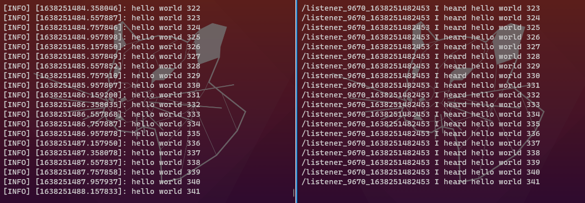


### Optional Setup


#### How to enable GUI on windows

- With Visual Studio ssh remote access
  - With VcXsrv, https://stackoverflow.com/questions/39695166/visual-studio-code-on-linux-xwindow-forwarding/40013437#40013437 ==> Basically you need to download VcXsrv 
  - With FastX3, https://www.starnet.com/xwin32kb/fastx-3-installation/#UbuntuDebian_Based_Systems
  - Troubleshooting X server, https://www.cs.odu.edu/~zeil/cs252/sum21/Public/xtrouble/index.html#/


#### Installing ROS dependency with rosdep

- [http://wiki.ros.org/rosdep](http://wiki.ros.org/rosdep)

```bash
# ROS Noetic
sudo apt-get install python3-rosdep
# ROS Melodic and earlier
sudo apt-get install python-rosdep
# On non ubuntu platforms, Use pip:
sudo pip install -U rosdep

# Initializing rosdep
sudo rosdep init
rosdep update

### Using rosdep: Install dependency of a particular package
$  rosdep install AMAZING_PACKAGE
### Install dependency of all packages in the workspace
# This usecase shows even more powerful feature of rosdep. Go to the top directory of your catkin workspace where the source code of the ROS packages you'd like to use are. Then run:
$ rosdep install --from-paths src --ignore-src -r -y
# This command magically installs all the packages that the packages in your catkin workspace depend upon but are missing on your computer.

### Use source-installed rosdep
# Clone the development repository. This doesn't need to be done in a directory in ROS_PACKAGE_PATH. Then at its top directory, source setup.sh. In concrete:
$ git clone https://github.com/ros-infrastructure/rosdep
$ cd rosdep
$ source setup.sh


```


#### How to Calibrate a Monocular Camera

- http://wiki.ros.org/camera_calibration/Tutorials/MonocularCalibration

```bash
# Start by getting the dependencies and compiling the driver. Make sure that your monocular camera is publishing images over ROS. Let's list the topics to check that the images are published:
$ rosdep install camera_calibration

# This will show you all the topics published, check to see that there is an image_raw topic. The default topics provided by most ROS camera drivers are:
$ rostopic list

# This will open up the calibration window which will highlight the checkerboard:
$ rosrun camera_calibration cameracalibrator.py --size 8x6 --square 0.108 image:=/camera/image_raw camera:=/camera


$ rosrun camera_calibration cameracalibrator.py --size 7x7 --square 0.045 image:=/camera/image_raw camera:=/camera video_device:=/dev/video1

rosrun camera_calibration cameracalibrator.py --approximate 0.1 --size 8x6 --square 0.108 right:=/my_stereo/right/image_raw left:=/my_stereo/left/image_raw

# Reference, https://askubuntu.com/questions/348838/how-to-check-available-webcams-from-the-command-line

```


### [ROS for Beginners II: Localization, Navigation and SLAM](https://www.udemy.com/course/ros-navigation/)

Installation

```bash
sudo apt-get install ros-noetic-navigation
sudo apt-get install ros-noetic-slam-gmapping

# Before installing Turtlebot3, make sure to make the following two commands:
sudo apt-get update
sudo apt-get upgrade
# The installation may fail if you do not an upgrade.

# This will install the core packages of Turtlebot3.
# Then, do the following (if you install for noetic, make -b noetic-devel to get the right branch)
$ cd ~/catkin_ws/src/
$ git clone https://github.com/ROBOTIS-GIT/turtlebot3_msgs.git -b noetic-devel
$ git clone  https://github.com/ROBOTIS-GIT/turtlebot3.git -b noetic-devel
$ cd ~/catkin_ws && catkin_make
# If you install on melodic, change -b noetic-devel with -b melodic-devel

# Afterward, and after the correct compilation of the catkin_ws, you can download and installation the simulation packages$ cd
~/catkin_ws/src/
$ git clone https://github.com/ROBOTIS-GIT/turtlebot3_simulations.git
$ cd ~/catkin_ws && catkin_make
# As such the Turtlebot3 simulator should be installed.

# Then, made the modification in .bashrch file as follows:

$ cd
$ gedit .bashrc
# Inside the bashrc file put the following aliases to make it easier access to different executables in the alias section.

alias burger='export TURTLEBOT3_MODEL=burger'
alias waffle='export TURTLEBOT3_MODEL=waffle'
alias tb3fake='roslaunch turtlebot3_fake turtlebot3_fake.launch'
alias tb3teleop='roslaunch turtlebot3_teleop turtlebot3_teleop_key.launch'
alias tb3='roslaunch turtlebot3_gazebo turtlebot3_empty_world.launch'
alias tb3maze='roslaunch turtlebot3_gazebo turtlebot3_world.launch'
alias tb3house='roslaunch turtlebot3_gazebo turtlebot3_house.launch'
# also at the end of the file, write the following commands

source /opt/ros/noetic/setup.bash
source /home/akoubaa/catkin_ws/devel/setup.bash
export TURTLEBOT3_MODEL=waffle
export SVGA_VGPU10=0
# The last command will let you open Gazebo on a Virtual Machine and avoid crashing its display.

# For Powershell
$Env:<variable-name> = "<new-value>"
$Env:TURTLEBOT3_MODEL = "waffle"
$Env:SVGA_VGPU10 = "0"
# For CMD
setx variable_name variable_value
setx TURTLEBOT3_MODEL waffle
setx SVGA_VGPU10 0


```


Starting Running the SLAM Simmulation

```bash
 catkin_make -DCATKIN_WHITELIST_PACKAGES=""
 devel\setup.bat
 
 
$ roslaunch turtlebot3_gazebo turtlebot3_house.launch
$ roslaunch turtlebot3_slam turtlebot3_slam.launch slamc_methods:=gmapping	# Other options: cartographer, hector_slam

# Saving map
$ rosrun map_server map_saver -f ~/tb3_house_map
# This commadn will generate two file, one with .pgm extension, store the image; Another one with .yaml extension, store the metadata about the image

resolution: m/pixel, means 
origin: x, y yaw(rotataion)

```

[TO-DO] ==> Can’t get noetic version of two package, `ros-noetic-navigation` and `ros-noetic-slam-gmapping`, install in Windows,  ==> There is no such package avail for Windows, so we cannot just use `choco` to install. Also, from [slam_gmapping github](https://github.com/ros-perception/slam_gmapping/tree/slam_gmapping-1.2.8), this package is not avail for neotic distro, so …. ==> you might need to install the melodic distro in Windows…


Error1: 

```bash
ERROR: cannot launch node of type [gmapping/slam_gmapping]: gmapping
ROS path [0]=c:\opt\ros\noetic\x64\share\ros
ROS path [1]=C:/catkin_ws/src
ROS path [2]=c:\opt\ros\noetic\x64\share
```

Solu: 

Install that slam_package manually, https://answers.ros.org/question/224502/slam_gmapping-installation/, and build from source:

```bash
# create a catkin workspace:
mkdir -p catkin_ws/src
cd catkin_ws/src
source /opt/ros/<DISTRO>/setup.bash
catkin_init_workspace
# clone the repository:
git clone https://github.com/ros-perception/slam_gmapping.git
# compile the workspace
cd ..
catkin_make -DCATKIN_WHITELIST_PACKAGES="gmapping;slam_gmapping"
# source the workspace
source devel/setup.bash
```


### ROS Command cheatsheet	

```bash
# Starting ros master node
roscore	

catkin_make -DCATKIN_WHITELIST_PACKAGES="ros_essentials_cpp" -DPYTHON_EXECUTABLE=/usr/bin/python3
$ catkin_make -DPYTHON_EXECUTABLE=/usr/bin/python3

# Takes you to the last ROS workspace that you have sourced in setup.bash
$ roscd	
# Navigat to the shared folder of build-in node:
$ rosnode list
/rosout
/rostopic_22930_1637998293550
/teleop_turtle
/turtlesim
$ roscd turtlesim
jetbot@jetbot-desktop:/opt/ros/melodic/share/turtlesim$ ls
cmake  images  msg  package.xml  srv
# Now, we can find out more information about turtlesim node, such as:
$ cd launch
$ sudo nano usb_cam-test.launch


# Run some ros package
# rosrun <package_name> <node_name>
$ rosrun ros_essentials_cpp talker_node
$ rosrun ros_essentials_cpp listener_node
$ rosrun ros_essentials_cpp talker.py
$ rosrun ros_essentials_cpp listener.py

# Getting more information about certain node
rosnode info /turtlesim

# Getting more information about certain topics
rostopic info /turtle1/cmd_vel

# Show all running topics
rostopic list

# List all the running node/process
rosnode list

# Launch gazebo
# roslaunch <package_name> <launch_name>
roslaunch gazebo_ros empty_world.launch

# Launch rviz
rosrun rviz rviz	# rosrun <package_name> <node_to_execute>
```


### Common ROS Q&A

```bash
# Where is the workspace for ROS distro that you installed?
$ ls /opt//ros/melodic/
```

- How to check all the env variable define for ROS?

```bash
jetbot@jetbot-desktop:~$ printenv | grep ROS
# ==> Output
ROS_ETC_DIR=/opt/ros/melodic/etc/ros
ROS_ROOT=/opt/ros/melodic/share/ros
ROS_MASTER_URI=http://localhost:11311
ROS_VERSION=1
ROS_PYTHON_VERSION=2
ROS_PACKAGE_PATH=/home/jetbot/catkin_ws/src:/opt/ros/melodic/share
ROSLISP_PACKAGE_DIRECTORIES=/home/jetbot/catkin_ws/devel/share/common-lisp
ROS_DISTRO=melodic
```


## Fun Fact

- Types of Robots, https://robots.ieee.org/learn/types-of-robots/
- The PR2 is one of the most advanced research robots ever built. Each PR2, short for Personal Robot 2, costs U.S. $400,000


## Reference:

- Implementing ORB-SLAM on Ubuntu 18.04 & ROS Melodic, https://medium.com/@mhamdaan/implementing-orb-slam-on-ubuntu-18-04-ros-melodic-606e668deffa
- YouTube, Justin Huang ROS Tutorial, https://www.youtube.com/watch?v=9U6GDonGFHw&list=PLJNGprAk4DF5PY0kB866fEZfz6zMLJTF8


### Paper:


### Course Video

- Udemy
  - ROS2 For Beginners (ROS Foxy - 2021), https://www.udemy.com/cart/success/704244436/
  - ROS for Beginners II: Localization, Navigation and SLAM, https://www.udemy.com/course/ros-navigation/learn/lecture/11785182#overview

ROS tutorial #1: Introduction, Installing ROS, and running the Turtlebot simulator, https://www.youtube.com/watch?v=9U6GDonGFHw&list=PLJNGprAk4DF5PY0kB866fEZfz6zMLJTF8

Books:


# Other encountered problem


## Q: How to SSH to a robot that is only accessible on your LAN but not remotely.  

- Problem Description: Basically, your ISP didn’t provide you with a public IP address, so that IP address that you saw in your robot is a private IP address, and it’s not possible to connect to your machine directly via the internet.  Therefore, if you want to expose your localhost server behind a NAT or firewall to the public internet for development of testing purpose, there are two solution for this problem: **1) Router Configuration:** This can be solved by configuring NAT (Network Address Translation) on your router, but this doesn’t always work, and it requires you to change the configuration on your router, which isn’t always desirable. This solution also doesn’t work when you don’t have admin access on your network. **2) Ngrok**. Ngrok is a free, open source and cross-platform reverse proxy server for exposing local servers behind NATs and firewalls to the public Internet over secure tunnels. It is a remarkable computer program that you can use to implement personal cloud services directly from home. It essentially establishes secure tunnels to your localhost, thus enabling you to: run demos of web sites before actual deployment, testing mobile apps connected to your locally running backend and building web-hook consumers on your development machine.

- Code:

```bash
$ mkdir ngrok
$ cd ngrok/
$ wget -c https://bin.equinox.io/c/4VmDzA7iaHb/ngrok-stable-linux-arm64.zip	# Note: you need to check your CPU architecture first, with command 'lscpu', and 'chmod +rx ngrok' to make it executable.
$ unzip ngrok-stable-linux-arm64.zip
$ ls
$ ./ngrok authtoken <your_auth_token>
$ ./ngrok tcp 22	# ngrok TCP tunnels allow you to expose any networked service that runs over TCP. This is commonly used to expose SSH, game servers, databases and more.
```

- Reference: [1-3 are important, 4-6 doesn’t work for this case]
  1. ngrok Dashboard, https://dashboard.ngrok.com/get-started/tutorials
  2. How to Test Local Websites or Apps on Internet Using Ngrok, https://www.tecmint.com/test-local-websites-on-internet-using-ngrok/
  3. How to use ngrok to remote ssh to rpi(Raspberry Pi)?, https://forums.raspberrypi.com/viewtopic.php?t=77499
  4. How to Create SSH Tunneling or Port Forwarding in Linux, https://www.tecmint.com/create-ssh-tunneling-port-forwarding-in-linux/
  5. 11 Best Tools to Access Remote Linux Desktop, https://www.tecmint.com/best-remote-linux-desktop-sharing-software/
  6. How to Install and Configure VNC Server in CentOS 7, https://www.tecmint.com/install-and-configure-vnc-server-in-centos-7/


## Q: How to Fix “No route to host” SSH Error in Linux, https://www.tecmint.com/fix-no-route-to-host-ssh-error-in-linux/


# Appendix A: File Structure

```bash
jetbot@jetbot-desktop:~/catkin_ws$ tree . -L 3
.
├── build
│   ├── atomic_configure
│   │   ├── env.sh
│   │   ├── local_setup.bash
│   │   ├── local_setup.sh
│   │   ├── local_setup.zsh
│   │   ├── setup.bash
│   │   ├── setup.sh
│   │   ├── _setup_util.py
│   │   └── setup.zsh
│   ├── catkin
│   │   └── catkin_generated
│   ├── catkin_generated
│   │   ├── env_cached.sh
│   │   ├── generate_cached_setup.py
│   │   ├── installspace
│   │   ├── metapackages
│   │   ├── order_packages.cmake
│   │   ├── order_packages.py
│   │   ├── setup_cached.sh
│   │   └── stamps
│   ├── CATKIN_IGNORE
│   ├── catkin_make.cache
│   ├── CMakeCache.txt
│   ├── CMakeFiles
│   │   ├── 3.10.2
│   │   ├── clean_test_results.dir
│   │   ├── cmake.check_cache
│   │   ├── CMakeDirectoryInformation.cmake
│   │   ├── CMakeError.log
│   │   ├── CMakeOutput.log
│   │   ├── CMakeRuleHashes.txt
│   │   ├── CMakeTmp
│   │   ├── download_extra_data.dir
│   │   ├── doxygen.dir
│   │   ├── feature_tests.bin
│   │   ├── feature_tests.c
│   │   ├── feature_tests.cxx
│   │   ├── FindOpenMP
│   │   ├── Makefile2
│   │   ├── Makefile.cmake
│   │   ├── progress.marks
│   │   ├── run_tests.dir
│   │   ├── TargetDirectories.txt
│   │   └── tests.dir
│   ├── cmake_install.cmake
│   ├── CTestConfiguration.ini
│   ├── CTestCustom.cmake
│   ├── CTestTestfile.cmake
│   ├── gtest
│   │   ├── CMakeFiles
│   │   ├── cmake_install.cmake
│   │   ├── CTestTestfile.cmake
│   │   ├── googlemock
│   │   └── Makefile
│   ├── Makefile
│   ├── orb_slam_2_ros
│   │   ├── catkin_generated
│   │   ├── cmake
│   │   ├── CMakeFiles
│   │   ├── cmake_install.cmake
│   │   ├── CTestTestfile.cmake
│   │   ├── docs
│   │   ├── Makefile
│   │   └── setup_custom_pythonpath.sh
│   ├── orb_slam2_ros
│   │   ├── catkin_generated
│   │   ├── cmake
│   │   ├── CMakeFiles
│   │   ├── cmake_install.cmake
│   │   ├── CTestTestfile.cmake
│   │   ├── docs
│   │   ├── Makefile
│   │   └── setup_custom_pythonpath.sh
│   ├── ros_basics_tutorial
│   │   ├── catkin_generated
│   │   ├── CMakeFiles
│   │   ├── cmake_install.cmake
│   │   ├── CTestTestfile.cmake
│   │   └── Makefile
│   ├── ros_essentials_cpp
│   │   ├── catkin_generated
│   │   ├── cmake
│   │   ├── CMakeFiles
│   │   ├── cmake_install.cmake
│   │   ├── CTestTestfile.cmake
│   │   └── Makefile
│   ├── test_results
│   ├── turtlebot3
│   │   ├── turtlebot3
│   │   ├── turtlebot3_bringup
│   │   ├── turtlebot3_description
│   │   ├── turtlebot3_example
│   │   ├── turtlebot3_navigation
│   │   ├── turtlebot3_slam
│   │   └── turtlebot3_teleop
│   ├── turtlebot3_msgs
│   │   ├── catkin_generated
│   │   ├── cmake
│   │   ├── CMakeFiles
│   │   ├── cmake_install.cmake
│   │   ├── CTestTestfile.cmake
│   │   └── Makefile
│   └── turtlebot3_simulations
│       ├── turtlebot3_fake
│       ├── turtlebot3_gazebo
│       └── turtlebot3_simulations
├── devel
│   ├── cmake.lock
│   ├── env.sh
│   ├── include
│   │   ├── orb_slam2_ros
│   │   ├── ros_essentials_cpp
│   │   ├── turtlebot3_example
│   │   └── turtlebot3_msgs
│   ├── lib
│   │   ├── liblaserscan_lib.so
│   │   ├── libutility_lib.so
│   │   ├── orb_slam2_ros
│   │   ├── pkgconfig
│   │   ├── python2.7
│   │   ├── ros_basics_tutorial
│   │   ├── ros_essentials_cpp
│   │   ├── turtlebot3_bringup
│   │   ├── turtlebot3_fake
│   │   ├── turtlebot3_gazebo
│   │   └── turtlebot3_slam
│   ├── local_setup.bash
│   ├── local_setup.sh
│   ├── local_setup.zsh
│   ├── setup.bash
│   ├── setup.sh
│   ├── _setup_util.py
│   ├── setup.zsh
│   └── share
│       ├── common-lisp
│       ├── gennodejs
│       ├── orb_slam2_ros
│       ├── ros_basics_tutorial
│       ├── ros_essentials_cpp
│       ├── roseus
│       ├── turtlebot3_bringup
│       ├── turtlebot3_description
│       ├── turtlebot3_example
│       ├── turtlebot3_fake
│       ├── turtlebot3_gazebo
│       ├── turtlebot3_msgs
│       ├── turtlebot3_navigation
│       ├── turtlebot3_slam
│       └── turtlebot3_teleop
└── src
    ├── CMakeLists.txt -> /opt/ros/melodic/share/catkin/cmake/toplevel.cmake
    ├── orb_slam2_ros
    │   ├── CMakeLists.txt
    │   ├── Dependencies.md
    │   ├── docker
    │   ├── License-gpl.txt
    │   ├── LICENSE.txt
    │   ├── orb_slam2
    │   ├── orb_slam2_ros_py
    │   ├── package.xml
    │   ├── README.md
    │   ├── ros
    │   └── srv
    ├── ros_basics_tutorial
    │   ├── CMakeLists.txt
    │   ├── include
    │   ├── package.xml
    │   └── src
    ├── ros_essentials_cpp
    │   ├── action
    │   ├── CMakeLists.txt
    │   ├── include
    │   ├── msg
    │   ├── package.xml
    │   ├── README.md
    │   ├── src
    │   └── srv
    ├── turtlebot3
    │   ├── ISSUE_TEMPLATE.md
    │   ├── LICENSE
    │   ├── README.md
    │   ├── turtlebot3
    │   ├── turtlebot3_bringup
    │   ├── turtlebot3_description
    │   ├── turtlebot3_example
    │   ├── turtlebot3_navigation
    │   ├── turtlebot3_slam
    │   └── turtlebot3_teleop
    ├── turtlebot3_msgs
    │   ├── CHANGELOG.rst
    │   ├── CMakeLists.txt
    │   ├── LICENSE
    │   ├── msg
    │   ├── package.xml
    │   └── README.md
    └── turtlebot3_simulations
        ├── LICENSE
        ├── README.md
        ├── turtlebot3_fake
        ├── turtlebot3_gazebo
        └── turtlebot3_simulations

116 directories, 86 files
```


# Appendix B: .bashrc


```bash
# ~/.bashrc: executed by bash(1) for non-login shells.
# see /usr/share/doc/bash/examples/startup-files (in the package bash-doc)
# for examples

# If not running interactively, don't do anything
case $- in
    *i*) ;;
      *) return;;
esac

# don't put duplicate lines or lines starting with space in the history.
# See bash(1) for more options
HISTCONTROL=ignoreboth

# append to the history file, don't overwrite it
shopt -s histappend

# for setting history length see HISTSIZE and HISTFILESIZE in bash(1)
HISTSIZE=1000
HISTFILESIZE=2000

# check the window size after each command and, if necessary,
# update the values of LINES and COLUMNS.
shopt -s checkwinsize

# If set, the pattern "**" used in a pathname expansion context will
# match all files and zero or more directories and subdirectories.
#shopt -s globstar

# make less more friendly for non-text input files, see lesspipe(1)
[ -x /usr/bin/lesspipe ] && eval "$(SHELL=/bin/sh lesspipe)"

# set variable identifying the chroot you work in (used in the prompt below)
if [ -z "${debian_chroot:-}" ] && [ -r /etc/debian_chroot ]; then
    debian_chroot=$(cat /etc/debian_chroot)
fi

# set a fancy prompt (non-color, unless we know we "want" color)
case "$TERM" in
    xterm-color|*-256color) color_prompt=yes;;
esac

# uncomment for a colored prompt, if the terminal has the capability; turned
# off by default to not distract the user: the focus in a terminal window
# should be on the output of commands, not on the prompt
#force_color_prompt=yes

if [ -n "$force_color_prompt" ]; then
    if [ -x /usr/bin/tput ] && tput setaf 1 >&/dev/null; then
	# We have color support; assume it's compliant with Ecma-48
	# (ISO/IEC-6429). (Lack of such support is extremely rare, and such
	# a case would tend to support setf rather than setaf.)
	color_prompt=yes
    else
	color_prompt=
    fi
fi

if [ "$color_prompt" = yes ]; then
    PS1='${debian_chroot:+($debian_chroot)}\[\033[01;32m\]\u@\h\[\033[00m\]:\[\033[01;34m\]\w\[\033[00m\]\$ '
else
    PS1='${debian_chroot:+($debian_chroot)}\u@\h:\w\$ '
fi
unset color_prompt force_color_prompt

# If this is an xterm set the title to user@host:dir
case "$TERM" in
xterm*|rxvt*)
    PS1="\[\e]0;${debian_chroot:+($debian_chroot)}\u@\h: \w\a\]$PS1"
    ;;
*)
    ;;
esac

# enable color support of ls and also add handy aliases
if [ -x /usr/bin/dircolors ]; then
    test -r ~/.dircolors && eval "$(dircolors -b ~/.dircolors)" || eval "$(dircolors -b)"
    alias ls='ls --color=auto'
    #alias dir='dir --color=auto'
    #alias vdir='vdir --color=auto'

    alias grep='grep --color=auto'
    alias fgrep='fgrep --color=auto'
    alias egrep='egrep --color=auto'
fi

# colored GCC warnings and errors
# export GCC_COLORS='error=01;31:warning=01;35:note=01;36:caret=01;32:locus=01:quote=01'

# some more ls aliases
alias ll='ls -alF'
alias la='ls -A'
alias l='ls -CF'

# Add an "alert" alias for long running commands.  Use like so:
#   sleep 10; alert
alias alert='notify-send --urgency=low -i "$([ $? = 0 ] && echo terminal || echo error)" "$(history|tail -n1|sed -e '\''s/^\s*[0-9]\+\s*//;s/[;&|]\s*alert$//'\'')"'

# Alias definitions.
# You may want to put all your additions into a separate file like
# ~/.bash_aliases, instead of adding them here directly.
# See /usr/share/doc/bash-doc/examples in the bash-doc package.

if [ -f ~/.bash_aliases ]; then
    . ~/.bash_aliases
fi

# enable programmable completion features (you don't need to enable
# this, if it's already enabled in /etc/bash.bashrc and /etc/profile
# sources /etc/bash.bashrc).
if ! shopt -oq posix; then
  if [ -f /usr/share/bash-completion/bash_completion ]; then
    . /usr/share/bash-completion/bash_completion
  elif [ -f /etc/bash_completion ]; then
    . /etc/bash_completion
  fi
fi
export CUDA_HOME=/usr/local/cuda-10.0
export LD_LIBRARY_PATH=/usr/local/cuda-10.0/lib64:$LD_LIBRARY_PATH
export PATH=/usr/local/cuda-10.0/bin:$PATH
export JP_VERSION=4.3   # Jetpack version

# export PATH="$HOME/.rbenv/bin:$PATH"
# eval "$(rbenv init -)"
# export PATH="$HOME/.rbenv/plugins/ruby-build/bin:$PATH"

export NVM_DIR="$HOME/.nvm"
[ -s "$NVM_DIR/nvm.sh" ] && \. "$NVM_DIR/nvm.sh"  # This loads nvm
[ -s "$NVM_DIR/bash_completion" ] && \. "$NVM_DIR/bash_completion"  # This loads nvm bash_completion


# ================================> Customized Section: @author: Drago, @date: 08/18/2021
# Remember to activate it with command: $ source ~/.bashrc
alias python=/usr/bin/python3
alias pip=pip3

# virtualenv and virtualenvwrapper
export WORKON_HOME=$HOME/.virtualenvs
export VIRTUALENVWRAPPER_PYTHON=/usr/bin/python3
source /usr/local/bin/virtualenvwrapper.sh

# Reference: 1) https://unix.stackexchange.com/questions/129143/what-is-the-purpose-of-bashrc-and-how-does-it-work 2) https://www.thegeekstuff.com/2008/09/bash-shell-take-control-of-ps1-ps2-ps3-ps4-and-prompt_command/

# Simple version:
export CLICOLOR=1
export LANG="en_US.UTF-8"
alias cp="cp -i"
alias ls="ls --color=auto"
# export PS1="\[\033[01;32m\]\u@\h\[\033[00m\]:\[\033[01;34m\]\w\[\033[00m\]\$ "
# set -o vi                                       # Set vi as the editor at the command line
export EDITOR="vim"                              # Set vi as the default editor

# Some awesome tri
HISTCONTROL=ignoreboth:erasedups HISTSIZE=1000 HISTFILESIZE=2000      # Set up my history file to ignore duplicates and be much larger than the default.
# ls --color=al > /dev/null 2>&1 && alias ls='ls -F --color=al' || alias ls='ls -G'   #  Color option for ls depending on if you are using linux or OSX
# md () { [ $# = 1 ] && mkdir -p "$@" && cd "$@" || echo "Error - no directory passed!"; }    # Function "md" to make and cd into a directory with one command
# git_branch () { git branch 2> /dev/null | sed -e '/^[^*]/d' -e 's/* \(.*\)/\1/'; }
# Define an awesome PS1 prompt
# HOST='\033[02;36m\]\h'; HOST=' '$HOST
# TIME='\033[01;31m\]\t \033[01;32m\]'
# LOCATION=' \033[01;34m\]`pwd | sed "s#\(/[^/]\{1,\}/[^/]\{1,\}/[^/]\{1,\}/\).*\(/[^/]\{1,\}/[^/]\{1,\}\)/\{0,1\}#\1_\2#g"`'
# BRANCH=' \033[00;33m\]$(git_branch)\[\033[00m\]\n\$ '
# PS1=$TIME$USER$HOST$LOCATION$BRANCH
# Improved PS2 prompt
# PS2='\[\033[01;36m\]>'

# test -f ~/.bash_aliases && . $_                 # execute my .bash_aliases file if it exists
# test -f ~/.git-completion.bash && . $_          # Execute my git tab completion script (for remotes and branches) if it exists.
# test -s ~/.autojump/etc/profile.d/autojump && . $_  # Execute autojump if it exists
# [ ${BASH_VERSINFO[0]} -ge 4 ] && shopt -s autocd    # Allow cd'ing without typing the cd part if the bash version >= 4
# [ -f /etc/bash_completion ] && ! shopt -oq posix && . /etc/bash_completion  # Execute a bash completion script if it exists
# [ -z $TMUX ] && export TERM=xterm-256color && exec tmux                     # Use TMUX if it is present
# export PATH="$PATH:$HOME/.rvm/bin"                                          # Add RVM to PATH for scripting
# [[ -s "$HOME/.rvm/scripts/rvm" ]] && source "$home/.rvm/scripts/rvm"        # Use rvm if it exists.

# echo $ROS_PACKAGE_PATH
# source /home/jetbot/catkin_ws/devel/setup.bash

alias burger='export TURTLEBOT3_MODEL=burger'
alias waffle='export TURTLEBOT3_MODEL=waffle'
alias tb3fake='roslaunch turtlebot3_fake turtlebot3_fake.launch'
alias tb3teleop='roslaunch turtlebot3_teleop turtlebot3_teleop_key.launch'
alias tb3='roslaunch turtlebot3_gazebo turtlebot3_empty_world.launch'
alias tb3maze='roslaunch turtlebot3_gazebo turtlebot3_world.launch'
alias tb3house='roslaunch turtlebot3_gazebo turtlebot3_house.launch'

# Also at the end of the file, write the following commands. The last command will let you open Gazebo on a Virtual Machine and avoid crashing its display.
source /opt/ros/melodic/setup.bash
source /home/jetbot/catkin_ws/devel/setup.bash
export TURTLEBOT3_MODEL=waffle # If you want to use TB3 BUrger, change to TURTLEBOT3_MODEL=burger
export SVGA_VGPU10=0
```

