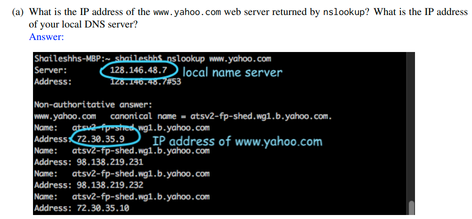
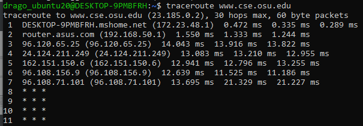

## Table of contents

{: .no_toc .text-delta }

1. TOC
{: toc }


Reference:

- !!! Linux入门教程, http://www.92csz.com/study/linux/

- !!! Basic UNIX commands, http://mally.stanford.edu/~sr/computing/basic-unix.html


# All linux command you will need as SDE

## Disk Space Storage


```bash
# Check File System Disk Space Usage
df
Filesystem      Size  Used Avail Use% Mounted on
05-AU21         932G  300G  632G  33% /media/sf_05-AU21
# 3. Show Disk Space Usage in Human Readable Format
df -h

4. Display Information of /home File System
```


Reference

- https://www.tecmint.com/how-to-check-disk-space-in-linux/


## Network related

```bash
# ------------------ Network related
# Check networking driver and usage ==> That's how you find out your localhost, private ip, and 
$ ifconfig
# (Windows)
ipconfig
ipconfig /all	# With details

# Checking network connection:
ping www.google.com

# query Internet name servers as well as your local name server
$ nslookup www.google.com
Server:         128.146.48.7
Address:        128.146.48.7#53

Non-authoritative answer:
Name:   www.google.com
Address: 142.251.35.164
Name:   www.google.com
Address: 2607:f8b0:4006:807::2004


# Checking Wireless Network Speed, Signal Strength And Other Information
# 1. Find out your Linux wireless card chipset information
lspci
# list network devices including Wi-Fi device on Linux:
sudo lshw -C network


```



**traceroute**:  traceroute is a tool to determine the router-level path between two end hosts on the Internet. To determine the path to a given destination address, say 8.8.8.8, run traceroute as follows traceroute 8.8.8.8 (if you have a windows machine use tracert instead).

`$ traceroute www.cse.osu.edu`

`tracert www.cse.osu.edu` For Windows user




```bash
# Checking all network statistic, such port connection. The netstat command is often used with other networking related Command Prompt commands like nslookup, ping, tracert, ipconfig, and others. See more here, https://www.lifewire.com/netstat-command-2618098

# you might need to run 'sudo apt install net-tools' if you dont have it installed
netstat -bq
# display the process's actual file name. Using -b over -o might seem like it's saving you a step or two but using it can sometimes greatly extend the time it takes netstat to fully execute.
netstat -anp| grep tcp
netstat -s -p tcp -f
# [-f] foreign addresses displayed in FQDN format 
# see protocol specific statistics [-s] but not all of them, just TCP stats [-p tcp]
netstat -e -t 5
# show some basic network interface statistics [-e] 
# and so that these statistics continually updated in the command window every five seconds [-t 5].


ubuntu@ip-172-31-23-71:~$ netstat -nltp
(Not all processes could be identified, non-owned process info
 will not be shown, you would have to be root to see it all.)
Active Internet connections (only servers)
Proto Recv-Q Send-Q Local Address           Foreign Address         State       PID/Program name    
tcp        0      0 0.0.0.0:22              0.0.0.0:*               LISTEN      -                   
tcp        0      0 0.0.0.0:5432            0.0.0.0:*               LISTEN      -                   
tcp        0      0 0.0.0.0:5000            0.0.0.0:*               LISTEN      -                   
tcp        0      0 127.0.0.1:33171         0.0.0.0:*               LISTEN      2658/node           
tcp        0      0 127.0.0.53:53           0.0.0.0:*               LISTEN      -                   
tcp6       0      0 :::22                   :::*                    LISTEN      -                   
tcp6       0      0 :::5432                 :::*                    LISTEN      -                   
tcp6       0      0 :::5000                 :::*                    LISTEN      - 


# For SLURM/PBS in HPC center
qstat

sudo iptables -L ==> Checking all route table

# Set Up a Firewall with UFW on Ubuntu 18.04, https://www.digitalocean.com/community/tutorials/how-to-set-up-a-firewall-with-ufw-on-ubuntu-18-04
sudo ufw status
sudo ufw enable
sudo ufw allow 22
sudo ufw reset


# Fun thing: Testing network speed
wget -O speedtest-cli https://raw.githubusercontent.com/sivel/speedtest-cli/master/speedtest.py
chmod +x speedtest-cli
# Run it with
./speedtest.py
# Reference, https://github.com/sivel/speedtest-cli
```


**Reference:**

- HowTo: Find Out DNS Server IP Address Used By My Router?, https://www.cyberciti.biz/faq/how-to-find-out-dns-for-router/


## System related

```bash

# ------------------ System related
sudo systemctl (system control) restart

# Checking process
ps -A
pstree 	# displays processes in a tree
ps aux 	# More info
# a = show processes for all users
# u = display the process's user/owner
# x = also show processes not attached to a terminal

kill -9 <pid> # Not sure why, but something you need -9 to make it work


passwd 		# lets you change your password, which you should do regularly (at least once a year). 
```


## Resource checking

```bash
# ------------------ Resource checking
# Checking CPU
lscpu
# Check CPU driver and usage(more detailed info)
$ cat /proc/cpuinfo

# Checking Nvidia gpu
$ nvidia-smi

# Display Linux process, e.g., resource(mem, cpu...) usage
top
htop 	# With interactive viewer
jtop	# For jetson nano
```


## Security related
```bash
# ------------------ Security related
ssh <user_name>@<DNS name server>	# Or ssh <user_name>@<IP>

ssh -i id_rsa dong.760@ri2.cse.ohio-state.edu	# With private key, so you don't need password

ssh -vvv jetbot@2.tcp.ngrok.io -p16318	# For debugging

ssh -N -L 8887:p0002.ten.osc.edu:8787 -L 8888:p0002.ten.osc.edu:8888 dong760@pitzer.osc.edu 
# Port forwarding port 8787 at p0002.ten.osc.edu to 8887 at my local address
# Yes you can forward multiple port
```
- -N: I don't want to run a command
- -L: I want to forward a port
- 8787: the default dask dashboard
- 8888: the default jupyter  board
- owens-login01.hpc.osc.edu: The public accessible cluster address
-  8888:owens-login01.hpc.osc.edu:8787: we want to forward the default dask dashboard to 8888 at local port
- Use '$ hostname' command to find out the public cluster address


```bash
$ cd ~/.ssh
$ ls
authorized_keys2  id_dsa       known_hosts
config            id_dsa.pub
$ ssh-keygen -o	# Regular case
$ ssh-keygen -t rsa -b 4096	# Specify certain algorithm

# More: 1) SSH Public Key, https://git-scm.com/book/en/v2/Git-on-the-Server-Generating-Your-SSH-Public-Key
# 2) gpg utility, https://drago1234.github.io/cryptography/2020/06/09/gpg-utility/

# The ssh_config file in client side ==> Use for ssh configuration
~/.ssh/config
# the sshd_config use for server side ssh connection configuration.
/etc/ssh/sshd_config
```


Reference:

- ssh_config usage, https://linux.die.net/man/5/ssh_config
- sshd_config — OpenSSH daemon configuration file, https://man.openbsd.org/sshd_config
-  


## Extra

```bash
# Checking hostname/username
hostname
# or 
echo $HOSTNAME

# ==> Return the directory recursive within 2 nodes 
tree . -L 2	


# How to find files in Linux
$find /home/username/ -name "*.err"		# return any name end with .err under that folder

# Alias
$ alias cf5='cat folio5'

# Ctrl-r: "r" is for reverse search. It's another way to find previous command without having to remember the whole command, and it's more flexible than the bang. ==>  Ctrl-r again will search for next one

# The Exclamation Point: The exclamation point is a way of telling linux you want to recall the last command which matches the text you type after it. So "!c" means recall the last command that starts with the letter c, the "cal" command in this case. 
$ !874	# re-executes the command number 874 in your history.


# Other things
$ whoami
$ cal
$ date 
$ which python	# Checking python.exe path/dir
$ source 	# ==> is a shell built-in command which is used to read and execute the content of a file(generally set of commands), passed as an argument in the current shell script.
$ export 	# ==> It is a bash shell BUILTINS commands, which means it is part of the shell. It marks an environment variables to be exported to child-processes.
chmod +x speedtest-cli
chmod ugo+rwx directory1 设置目录的所有人(u)、群组(g)以及其他人(o)以读（r ）、写(w)和执行(x)的权限

# Files
$ diff filename1 filename2 
$ zip file1.zip file1 创建一个zip格式的压缩包 
$ unzip temp.zip
$ touch file.sh		# Create a newfile
$ mv filename1 filename2 
$ ls -al	# long format, all files
$ wc filename	# tells you how many lines, words, and characters there are in a file

# Open/read file
$ cat file.sh
$ less file.sh
$ emacs file.sh
$ vi file.sh
$ vim file.sh
$ nano file.sh

# (Windows)
code .	#  open VS
notepad	# Open with notepad


# Vim:
0	# Beginning of line
$	# End of line
gg	# First line of file
G	# Last line of file
dd	# delete a line

:qa!	# quit and abandon all changes
:q!		# quit and overwrite/apply all changes
:wq		# write and quit
```


# Setting up a brand new Linux Env

- CTRL-ATL-t  to open an terminal
- Enter the following to install some useful packages (compilers and manual pages) which you’ll need in future labs:

```bash
sudo apt update
sudo apt-get install build-essential
sudo apt-get install manpages-dev
sudo apt-get install manpages-posix-dev
```


