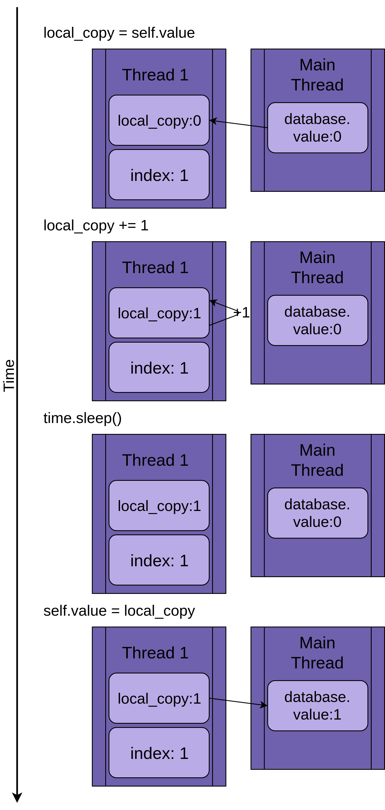
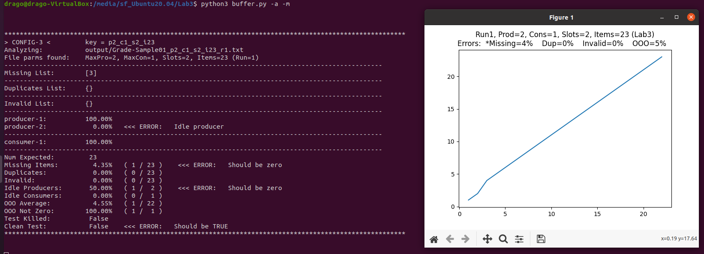
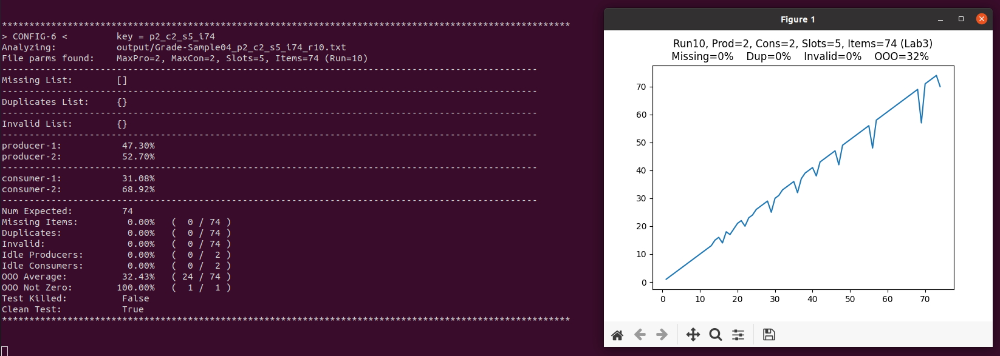

## Table of contents

{: .no_toc .text-delta }

1. TOC
{: toc }


**Reference:**

- [An Intro to Threading in Python](https://realpython.com/intro-to-python-threading/#starting-a-thread), https://realpython.com/intro-to-python-threading/#starting-a-thread
- [Speed Up Your Python Program With Concurrency](https://realpython.com/python-concurrency/)
- [Python library -- threading](https://docs.python.org/3/library/threading.html),  https://docs.python.org/3/library/threading.html


### **Starting a Thread**

`Thread`, in module [`threading`](https://docs.python.org/3/library/threading.html), nicely encapsulates threads, providing a clean interface to work with them.

To start a separate thread, you create a `Thread` instance and then tell it to `.start()`:

```python
import logging
import threading
import time

# thread_function() itself doesn’t do much. It simply logs some messages with a time.sleep() in between them.
def thread_function(name):
    logging.info("Thread %s: starting", name)
    time.sleep(2)
    logging.info("Thread %s: finishing", name)

if __name__ == "__main__":
    format = "%(asctime)s: %(message)s"
    logging.basicConfig(format=format, level=logging.INFO,
                        datefmt="%H:%M:%S")

    logging.info("Main    : before creating thread")
    x = threading.Thread(target=thread_function, args=(1,))
    logging.info("Main    : before running thread")
    x.start()
    logging.info("Main    : wait for the thread to finish")
    # x.join()
    logging.info("Main    : all done")
```

When you run this program as it is (with line twenty commented out), the output will look like this:

```shell
$ ./single_thread.py
Main    : before creating thread
Main    : before running thread
Thread 1: starting
Main    : wait for the thread to finish
Main    : all done
Thread 1: finishing
# You’ll notice that the Thread finished after the Main section of your code did. You’ll come back to why that is and talk about the mysterious line twenty-one 'x.join()' in the next section.
```


When you create a `Thread`, you pass it a function and a list containing the arguments to that function. In this case, you’re telling the `Thread` to run `thread_function()` and to pass it `1` as an argument.

```python
x = threading.Thread(target=thread_function, args=(1,))
x.start()
```


### [**Daemon process**](https://en.wikipedia.org/wiki/Daemon_(computing)):

A daemon (/ˈdiːmən/ or /ˈdeɪmən/) is a computer OS program that runs as a background process. 

Traditionally, the process names of a daemon end with the letter *d*, for clarification that the process is in fact a daemon, and for differentiation between a daemon and a normal computer program. For example, [syslogd](https://en.wikipedia.org/wiki/Syslogd) is a daemon that implements system logging facility, and sshd is a daemon that serves incoming [SSH](https://en.wikipedia.org/wiki/Secure_Shell) connections.

Python `threading` has a more specific meaning for `daemon`. A `daemon` thread will shut down immediately when the program exits. One way to think about these definitions is to consider the `daemon` thread a thread that runs in the background without worrying about shutting it down. <u>If a program is running `Threads` that are not `daemons`, then the program will wait for those threads to complete before it terminates. `Threads` that *are* daemons, however, are just killed wherever they are when the program is exiting</u>.


Let’s first repeat the program with a `daemon` thread. You do that by changing how you construct the `Thread`, adding the `daemon=True` flag:

```python
x = threading.Thread(target=thread_function, args=(1,), daemon=True)
```


When you run the program now, you should see this output:

```shell
$ ./daemon_thread.py
Main    : before creating thread
Main    : before running thread
Thread 1: starting
Main    : wait for the thread to finish
Main    : all done
```


### `join()` a Thread

Daemon threads are handy, but what about when you want to wait for a thread to stop? What about when you want to do that and not exit your program? Now let’s go back to your original program and look at that commented out line twenty:

```
# x.join()
```

Here is the output you will see ==> So the main program wait the Thread finished before exit.

```shell
$ ./daemon_thread.py
Main    : before creating thread
Main    : before running thread
Thread 1: starting
Main    : wait for the thread to finish
Thread 1: finishing
Main    : all done
```


## Working With Many Threads

```python
import logging
import threading
import time

def thread_function(name):
    logging.info("Thread %s: starting", name)
    time.sleep(2)
    logging.info("Thread %s: finishing", name)

if __name__ == "__main__":
    format = "%(asctime)s: %(message)s"
    logging.basicConfig(format=format, level=logging.INFO,
                        datefmt="%H:%M:%S")

    threads = list()
    for index in range(3):
        logging.info("Main    : create and start thread %d.", index)
        x = threading.Thread(target=thread_function, args=(index,))
        threads.append(x)
        x.start()

    for index, thread in enumerate(threads):
        logging.info("Main    : before joining thread %d.", index)
        thread.join()
        logging.info("Main    : thread %d done", index)
```

The order in which threads are run is determined by the operating system and can be quite hard to predict. It may (and likely will) vary from run to run, so you need to be aware of that when you design algorithms that use threading.


Running this code multiple times will likely produce some interesting results. Here’s an example output from my machine:

```shell
$ ./multiple_threads.py
Main    : create and start thread 0.
Thread 0: starting
Main    : create and start thread 1.
Thread 1: starting
Main    : create and start thread 2.
Thread 2: starting
Main    : before joining thread 0.
Thread 2: finishing
Thread 1: finishing
Thread 0: finishing
Main    : thread 0 done
Main    : before joining thread 1.
Main    : thread 1 done
Main    : before joining thread 2.
Main    : thread 2 done
```


Fortunately, Python gives you several primitives that you’ll look at later to help coordinate threads and get them running together. Before that, let’s look at how to make managing a group of threads a bit easier.

There’s an easier way to start up a group of threads than the one you saw above. It’s called a `ThreadPoolExecutor`, and it’s part of the standard library in [`concurrent.futures`](https://docs.python.org/3/library/concurrent.futures.html) (as of Python 3.2).

The easiest way to create it is as a context manager, using the [`with` statement](https://realpython.com/python-with-statement/) to manage the creation and destruction of the pool.

Here’s the `__main__` from the last example rewritten to use a `ThreadPoolExecutor`:

```python
import concurrent.futures

# [rest of code]

if __name__ == "__main__":
    format = "%(asctime)s: %(message)s"
    logging.basicConfig(format=format, level=logging.INFO,
                        datefmt="%H:%M:%S")

    with concurrent.futures.ThreadPoolExecutor(max_workers=3) as executor:
        executor.map(thread_function, range(3))
```

The code creates a `ThreadPoolExecutor` as a context manager, telling it how many worker threads it wants in the pool. It then uses `.map()` to step through an iterable of things, in your case `range(3)`, passing each one to a thread in the pool.

The end of the `with` block causes the `ThreadPoolExecutor` to do a `.join()` on each of the threads in the pool. <u>It is *strongly* recommended that you use `ThreadPoolExecutor` as a context manager when you can so that you never forget to `.join()` the threads</u>.

Running your corrected example code will produce output that looks like this:

```shell
$ ./executor.py
Thread 0: starting
Thread 1: starting
Thread 2: starting
Thread 1: finishing
Thread 0: finishing
Thread 2: finishing
```

Again, notice how `Thread 1` finished before `Thread 0`. The scheduling of threads is done by the operating system and does not follow a plan that’s easy to figure out.


## Race Conditions

**Race conditions** <u>can occur when two or more threads access a shared piece of data or resource</u>. In this example, you’re going to create a large race condition that happens every time, but be aware that most race conditions are not this obvious. Frequently, they only occur rarely, and they can produce confusing results. As you can imagine, this makes them quite difficult to debug.

Fortunately, this race condition will happen every time, and you’ll walk through it in detail to explain what is happening.

For this example, you’re going to write a class that updates a database. Okay, you’re not really going to have a database: you’re just going to fake it, because that’s not the point of this article.

Your `FakeDatabase` will have `.__init__()` and `.update()` methods:

```python
class FakeDatabase:
    def __init__(self):
        self.value = 0

    def update(self, name):
        logging.info("Thread %s: starting update", name)
        local_copy = self.value
        local_copy += 1
        time.sleep(0.1)
        self.value = local_copy
        logging.info("Thread %s: finishing update", name)
```

`FakeDatabase` is keeping track of a single number: `.value`. This is going to be the shared data on which you’ll see the race condition.

`.__init__()` simply initializes `.value` to zero. So far, so good.

`.update()` looks a little strange. It’s simulating reading a value from a database, doing some computation on it, and then writing a new value back to the database.

In this case, reading from the database just means copying `.value` to a local variable. The computation is just to add one to the value and then `.sleep()` for a little bit. Finally, it writes the value back by copying the local value back to `.value`.

Here’s how you’ll use this `FakeDatabase`:

```python
if __name__ == "__main__":
    format = "%(asctime)s: %(message)s"
    logging.basicConfig(format=format, level=logging.INFO,
                        datefmt="%H:%M:%S")

    database = FakeDatabase()
    logging.info("Testing update. Starting value is %d.", database.value)
    with concurrent.futures.ThreadPoolExecutor(max_workers=2) as executor:
        for index in range(2):
            executor.submit(database.update, index)
    logging.info("Testing update. Ending value is %d.", database.value)
```

The program creates a `ThreadPoolExecutor` with two threads and then calls `.submit()` on each of them, telling them to run `database.update()`.

`.submit()` has a signature that allows both positional and named arguments to be passed to the function running in the thread:

```python
.submit(function, *args, **kwargs)
```

In the usage above, `index` is passed as the first and only positional argument to `database.update()`. You’ll see later in this article where you can pass multiple arguments in a similar manner.

Since each thread runs `.update()`, and `.update()` adds one to `.value`, you might expect `database.value` to be `2` when it’s printed out at the end. But you wouldn’t be looking at this example if that was the case. If you run the above code, the output looks like this:

```shell
$ ./racecond.py
Testing unlocked update. Starting value is 0.
Thread 0: starting update
Thread 1: starting update
Thread 0: finishing update
Thread 1: finishing update
Testing unlocked update. Ending value is 1.
```

### One Thread

Before you dive into this issue with two threads, let’s step back and talk a bit about some details of how threads work.

You won’t be diving into all of the details here, as that’s not important at this level. We’ll also be simplifying a few things in a way that won’t be technically accurate but will give you the right idea of what is happening.

When you tell your `ThreadPoolExecutor` to run each thread, you tell it which function to run and what parameters to pass to it: `executor.submit(database.update, index)`.

The result of this is that each of the threads in the pool will call `database.update(index)`. Note that `database` is a reference to the one `FakeDatabase` object created in `__main__`. Calling `.update()` on that object calls an [instance method](https://realpython.com/instance-class-and-static-methods-demystified/) on that object.

Each thread is going to have a reference to the same `FakeDatabase` object, `database`. Each thread will also have a unique value, `index`, to make the logging statements a bit easier to read:

[](https://files.realpython.com/media/intro-threading-shared-database.267a5d8c6aa1.png)

When the thread starts running `.update()`, it has its own version of all of the data **local** to the function. In the case of `.update()`, this is `local_copy`. This is definitely a good thing. Otherwise, two threads running the same function would always confuse each other. It means that all variables that are scoped (or local) to a function are **thread-safe**.

Now you can start walking through what happens if you run the program above with a single thread and a single call to `.update()`.

The image below steps through the execution of `.update()` if only a single thread is run. The statement is shown on the left followed by a diagram showing the values in the thread’s `local_copy` and the shared `database.value`:

[](https://files.realpython.com/media/intro-threading-single-thread.6a11288bc199.png)

The diagram is laid out so that time increases as you move from top to bottom. It begins when `Thread 1` is created and ends when it is terminated.

When `Thread 1` starts, `FakeDatabase.value` is zero. The first line of code in the method, `local_copy = self.value`, copies the value zero to the local variable. Next it increments the value of `local_copy` with the `local_copy += 1` statement. You can see `.value` in `Thread 1` getting set to one.

Next `time.sleep()` is called, which makes the current thread pause and allows other threads to run. Since there is only one thread in this example, this has no effect.

When `Thread 1` wakes up and continues, it copies the new value from `local_copy` to `FakeDatabase.value`, and then the thread is complete. You can see that `database.value` is set to one.

So far, so good. You ran `.update()` once and `FakeDatabase.value` was incremented to one.

### Two Threads

Getting back to the race condition, the two threads will be running concurrently but not at the same time. They will each have their own version of `local_copy` and will each point to the same `database`. It is this shared `database` object that is going to cause the problems.

The program starts with `Thread 1` running `.update()`:

[](https://files.realpython.com/media/intro-threading-two-threads-part1.c1c0e65a8481.png)

When `Thread 1` calls `time.sleep()`, it allows the other thread to start running. This is where things get interesting.

`Thread 2` starts up and does the same operations. It’s also copying `database.value` into its private `local_copy`, and this shared `database.value` has not yet been updated:

[](https://files.realpython.com/media/intro-threading-two-threads-part2.df42d4fbfe21.png)

When `Thread 2` finally goes to sleep, the shared `database.value` is still unmodified at zero, and both private versions of `local_copy` have the value one.

`Thread 1` now wakes up and saves its version of `local_copy` and then terminates, giving `Thread 2` a final chance to run. `Thread 2` has no idea that `Thread 1` ran and updated `database.value` while it was sleeping. It stores *its* version of `local_copy` into `database.value`, also setting it to one:

[](https://files.realpython.com/media/intro-threading-two-threads-part3.18576920f88f.png)

The two threads have interleaving access to a single shared object, overwriting each other’s results. Similar race conditions can arise when one thread frees memory or closes a file handle before the other thread is finished accessing it.

## Basic Synchronization Using `Lock`

There are a number of ways to avoid or solve race conditions. You won’t look at all of them here, but there are a couple that are used frequently. Let’s start with `Lock`.

To solve your race condition above, you need to find a way to allow only one thread at a time into the read-modify-write section of your code. The most common way to do this is called `Lock` in Python. In some other languages this same idea is called a `mutex`. Mutex comes from MUTual EXclusion, which is exactly what a `Lock` does.

A `Lock` is an object that acts like a hall pass(通行证). Only one thread at a time can have the `Lock`. Any other thread that wants the `Lock` must wait until the owner of the `Lock` gives it up.

The basic functions to do this are `.acquire()` and `.release()`. A thread will call `my_lock.acquire()` to get the lock. If the lock is already held, the calling thread will wait until it is released. There’s an important point here. If one thread gets the lock but never gives it back, your program will be stuck. You’ll read more about this later.

<u>Fortunately, Python’s `Lock` will also operate as a context manager, so you can use it in a `with` statement, and it gets released automatically when the `with` block exits for any reason.</u>

Let’s look at the `FakeDatabase` with a `Lock` added to it. The calling function stays the same:

```python
class FakeDatabase:
    def __init__(self):
        self.value = 0
        self._lock = threading.Lock()

    def locked_update(self, name):
        logging.info("Thread %s: starting update", name)
        logging.debug("Thread %s about to lock", name)
        with self._lock:
            logging.debug("Thread %s has lock", name)
            local_copy = self.value
            local_copy += 1
            time.sleep(0.1)
            self.value = local_copy
            logging.debug("Thread %s about to release lock", name)
        logging.debug("Thread %s after release", name)
        logging.info("Thread %s: finishing update", name)
```


## Producer and Consumer problem


**1.**   **Purpose**

- a.   Gain experience with the classic producer/consumer problem
- b.   Gain additional familiarity with Linux, threads, processes, and python
- c.    Gain experience looking though code provided, then extending and completing it 
- d.   Gain experience debugging a multi-threaded solution

 

**2.**   **Submission:**

student.py 


**3.**   **Introduction**

To make sure your system has the required tools, you may want to first run:

```bash
sudo apt-get install build-essential

sudo apt install python3-pip

python3 -m pip install -U pip

python3 -m pip install -U matplotlib  
```

 

In this lab, you will implement a bounded buffer, producer-consumer solution using python.  While multiple files are provided, you will only need to modify one of them: student.py 

**buffer.py** will create the appropriate number of producer and consumer threads, which then run the corresponding functions in student.py. You do not have to worry about thread creation, this has been done for you. You also do not need to write code to terminate threads, merely having your functions return will cause the calling threads to gracefully terminate.

In this solution, the provided template code will augment the data flowing through the buffer with information about the producer and consumer threads to help us analyze and grade your code. Specifically, a producer thread will pick up a single item from the input file and place a python tuple into the buffer. The tuple is of the form:

```
(item, producer_thread_id)
```

 

A consumer thread will read this python tuple from the buffer and write a *logical tuple* to the output file (which is just text with tabs between the data):

```
item  producer_thread_id   consumer_thread_id
```

 

The code to write the python tuple to the buffer, to read the python tuple from the buffer, and to write the tab separated *logical tuple* to the output file have all been provided for you in the template functions inside of student.py. Please do not change this code as doing so will break the code that analyzes and grades your solution.

 

**4.**   **Running the lab and getting online help**

buffer.py is the ‘main’ code for this lab. It will help you run, test, and grade your code runs. To execute a simple test run, simply say:

```
python3 buffer.py
```

 

buffer.py has many optional parameters to configure and drive tests. To see them, view its online help via: 

```
python3 buffer.py -h
```

 

Once you think your code is working, be sure to run configurations more than once (e.g., use the -r parameter). Timing of threads absolutely hides coding issues that can be revealed merely by running multiple times.

Be sure run buffer.py with multiple ways to test your solution. An important part of this lab is figuring out the best way to test and debug your program. For instance, in addition to changing the runtime parameters of buffer.py, think about the VM environment itself. You should consider running your program from a shared folder, locally, and with multiple CPU configurations. Things that affect thread timing can reveal (or hide) coding errors.

Since many configurations will be run and tested, each configuration can have name and key that describes the configuration. Run the lab a few times and look in the input and output directories and you’ll get a sense for the names and keys. You’ll also see these types of names and keys in the analysis and grade output.

**Note**: buffer.py had been constructed to catch and process terminal interrupts (e.g., when you press Control-C to interrupt an infinite loop). It will try to gather information about the run that’s been terminated. However, this error handling only works under certain conditions and is not meant to be used during grading. It is your responsibility to make sure the code you turn in for grading has no infinite loops, and all runs execute cleanly.

 

**5.**   **Hints**

Feel free to consult the text book and class slides for the implementation and details of a bounded buffer. You will need to use the locks provided in the python code, and increment the corresponding buffer pointers in a manner similar to what you can find in the book examples.

More details on how to complete the lab are embedded in the template source file student.py. You should read the comments in student.py carefully. 

If you are unfamiliar with python, I suggest walking through an online tutorial such as that found at https://docs.python.org/3/tutorial/. We aren’t doing complicated python things, so walk through the first few pages to get the general introduction to python, then use the index to look up specific topics of interest or need.

 

**6.**   **Grading**

The largest portion of your lab grade will come from -g(--grade) runs similar to the following. Be sure to run the grade configs multiple times. Something like:

```bash
python3 buffer.py -g
python3 buffer.py -g -r10
```

 

The grader will test your solution in an Ubuntu VM using grade configurations similar to those in the sample_grade_configs.txt file that -g uses.

**Note**: Any program that does not complete all the runs specified in the grade configuration file used by the grader (e.g., hangs in a way the grader cannot easily interrupt on a single test basis) may receive a zero. The grader will not spend any time fixing or debugging your code while grading. It is your responsibility to make sure your solution runs, is well tested, and can pass the grading tests, even though the actual tests may be different from the sample grade configs.

Please note that you can accumulate many different runs and then see how you’ve done across different sets of them using the -a and -A parameters in buffer.py. See the details in the online help via: 

```bash
python3 buffer.py -h
```

As such, you may want to periodically delete or clean out the input and output directories so old, bad runs aren’t included when you analyze your test runs via the -a and -A parameters.

A couple of grading parameters have defaults by config or platform (like timeout and outOfOrder target) that we’ll be modifying before the final grade runs to make sure they’re appropriate for grading on the grader’s environment. You can adjust these command line parameters to watch their effect on your code, and I plan to talk about them in class when I introduce the lab. You may find the default outOfOrder target most meaningful with VCPU=2. (Again, we’ll be calibrating the grader environments before grading. The defaults are to help you find patterns in your code, and make sure it’s functioning well.)


### analyze.py

```python
import threading
import sys
import argparse
import pathlib
import importlib
import analyze
import re
import glob
import student

TARGET_OOO = 10  # This isn't a real meaningful target.  It's 'global' to this file for convenience, but buffer.py will try to make it a more meaningful value based on the environment.


# Some error/warning strings
error_zero        = "  <<< ERROR:   Should be zero"
error_hundred     = "  <<< ERROR:   Should be 100%"
error_star        = "  <<< ERROR:   Issues marked with a *"
ooo_error         = "  <<< ERROR:   Out of Order should NOT be zero"
ooo_target_warn   = "  <<< WARNING: OOO Low, target is %.1f%%.  Corresponding one-line summaries marked with 'L' but not as bad."
ooo_target_error  = "  <<< ERROR:   Out of Order target average is %.1f%%"
idle_prod_error   = "  <<< ERROR:   Idle producer"
idle_cons_error   = "  <<< ERROR:   Idle consumer"
error_true        = "  <<< ERROR:   Should be TRUE"
error_false       = "  <<< ERROR:   Should be FALSE"
kill_notice       = "  (Note: Test KILLED.)"


# Want to turn raw numbers into percents
def percent(number, base):
    try:              percent = number/base * 100     # Calc percent if good base
    except Exception: percent = 0                     # If bad base, assume percent is zero
    return percent     


# Helped function to consistently output labels for lines
def label(l, delta=0, num=20, colon=True):
    format_str  = "%%-%ds" % (num+delta)
    if colon: return (format_str % ("%s:" % l))
    else:     return (format_str % ("%s"  % l))


# The filename parts have letters next to the numbers.  
# Need to strip the letters, return the textual number as an int.
def filename_part_to_int(token):
    temp = re.sub('[a-zA-Z]','',token)
    try:              return int(temp)
    except Exception: return 0


# The config keys are built and parsed base on the first letter of the text in each part of the name
# While the keys built in the code use one character prefixes, someone could use longer ones
# when they hand edit files.  So, not doing a direct match, using startswith instead.
def parts_from_key(key):
    producers = consumers = slots = items = run_num = 0
    for part in key.split('_'):
        if   part.startswith('p'):  producers = filename_part_to_int(part)        # the producer part starts with 'p'
        elif part.startswith('c'):  consumers = filename_part_to_int(part)        # the consumer part starts with 'c'
        elif part.startswith('s'):  slots     = filename_part_to_int(part)        # the slots    part starts with 's'
        elif part.startswith('i'):  items     = filename_part_to_int(part)        # the items    part starts with 'i'
        elif part.startswith('r'):  run_num   = filename_part_to_int(part)        # the run      part starts with 'r'
    return producers, consumers, slots, items, run_num
    

# The filename will typically have a path, want just the stem to tokenize the parts.
# The stem should be CONFIGNAME_key where the key has a lot of structure.
def parts_from_filename(filename, with_run=True):
    pure  = pathlib.PurePath(filename)                    # Use a PurePath so it's more platform safe, etc.
    parts = pure.stem.lower().split('_')                  # Pull off the stem, put it in lower case, then split on '_' so we can pass on without the CONFIGNAME
    return parts_from_key('_'.join(parts[1:]))            # Return the tokens, but note that the string is rebuilt first without CONFIGNAME
     

# Simple text key for configs
def config_key(producers=0, consumers=0, slots=0, items=0):
    return "p%d_c%d_s%d_i%d" % (producers, consumers, slots, items)


# Want to group runs by their corresponding config keys.  
# So, maintain a dictionary of keys and a config for each
configs_by_key = {}


# Given a filename, find (or create) the corresponding config object for the run
# This function is just used to analyze runs, the 'timeout' isn't 'valid' here, but passing thru to config_object init for completeness.
def config_from_filename(filename, timeout):
    producers, consumers, slots, items, run_num = parts_from_filename(filename)                           # tokenize the name
    key = config_key(producers, consumers, slots, items)                                                  # get clean key from tokens
    if key in configs_by_key: config = configs_by_key[key]                                                # config for key already exists
    else:          
        name   = "CONFIG-%d" % (len(configs_by_key) + 1)                                                  # need to create config, build a 'fake' name
        config = configs_by_key[key] = config_object(name, producers, consumers, slots, items, timeout)   # Now, create config from the name and parts
    return config


SECTION_START = "\n\n\n********************************************************************************************************"
SECTION_END   =       "********************************************************************************************************\n\n"


# This is the main/top config class.  
# It maintains information about a configuration and all the runs that have this config
class config_object():
    def __init__(self, name, producers, consumers, slots, items, timeout):
        self.name = name
        nparts    = name.split('_')
        # Due to the key tokenization, names can't have a '_'
        if len(nparts)>1:
            print("\n\nERROR: config names cannot include an underscore '_'.  Please modify config name '%s' and rerun.\n\n" % name, file=sys.stderr)
            sys.exit(2)
        self.producers     = producers      
        self.consumers     = consumers
        self.slots         = slots
        self.items         = items
        self.key           = config_key(producers, consumers, slots, items) 
        self.timeout       = timeout 

        # Keys have to be unique for the configs.  If I have a collision, I've done something wrong
        if self.key in configs_by_key:
            print("CONFIG __INIT__ ERROR: key for this config '%s' already in use.  Should use 'add_run' instead of init at this point" % self.key, file=sys.stderr)
            sys.exit(1)
        else:
            configs_by_key[self.key] = self

        self.name_and_key  = "%s_%s" % (name, self.key)
        self.runs          = []            # list  of runs already added to this config
        self.queue         = []            # queue of runs waiting to be added to this config
        self.total_stats   = run_stats()   # stats on the runs added to this config


    # Make the output names consistant by building from the config name and key
    # Sometimes the caller wants a run number added to name. 
    def filename(self, dir, run_num=None):
        if run_num: return "%s/%s_r%d.txt" % (dir, self.name_and_key, run_num)
        else:       return "%s/%s.txt"     % (dir, self.name_and_key)


    # Queue a run to be added later.  Note that it's a tuple so it's easy to pull the parts back off the queue.
    # If a caller has a bunch of files to process, but doesn't have them in order, then they can walk over their files,
    # handing them to an appropriate config via queue_run, then when all done, call add_queued to process them all.
    def queue_run(self, outfile, killed, graph, print_details, print_section_start):
        self.queue.append((outfile, killed, graph, print_details, print_section_start))


    # Walk the queue, adding all the queued runs.  
    def add_queued(self, print_results=True):
        for (outfile, killed, graph, print_details, print_section_start) in self.queue:
            self.add_run(outfile, killed, graph, print_details, print_section_start)
        if print_results: self.print_all_run_results()


    # Adds a run to the config, printing info about it as it works thru the analysis
    def add_run(self, outfile, killed, graph, print_details, print_section_start):
        if (print_section_start): print(SECTION_START)    # Output section start, if needed
        print("%s %s" % (label("> " + self.name + " <", colon=False), "key = %s" % self.key))
        print("%s %s" % (label("Analyzing"), outfile))
        results = run_results_object(outfile, killed, graph, print_details, print_section_start)    # Get the run results
        self.runs.append(results)                         # Append the run to the list of runs

        if print_details: 
            results.print_details(print_section_start)
        print(SECTION_END)                                # Output section break ending

        if graph: results.show_graph()                    # If the caller wants graphed, show the graph
        self.total_stats.add(results.percents)            # Add the run to the running stats total
        return results                                    # Return the analyzed run stats to the caller


    # Runs index numbers are one off, since they are logical (not zero-based)
    def return_run_percents(self, run=None):
        if run: return self.runs[run-1].percents
        else:   return self.runs[-1].percents


    # This header is used by buffer, to make it look like the thread run themselves are part of the analysis
    def print_run_header(self, overall, run):
        print(SECTION_START)
        print("%s > %s <   (run %d)" % (label("Test-%d" % overall), self.name, run))


    def print_all_run_results(self, even_one_only=False, one_liners_only=False):
        if len(self.runs) > 1 or even_one_only:
            if not one_liners_only:
                print("\n\n===========================================================================================================================================================================================")
                print("Config '%s' Summary:" % self.name)
                print("===========================================================================================================================================================================================")

            # Print the 'header' rows for the table view
            temp = "%-15s %12s %13s %13s %13s %13s %13s %8s %s" % (self.name, "Idle_Prod", "Idle_Cons","Missing","Duplicates","Invalid","OutOfOrder","", "%s" % self.key)
            temp2 = re.sub('[a-zA-Z_0-9]','-',temp)
            print(temp)
            print(temp2)
            
            test = 1
            for run in self.runs:   # Print each row
                print("%s %s       %-45s     %s"     %  (label("Test-%d" % test, -4), run.percents.one_line_summary(), run.filename, run.percents.error_notice()))
                test+=1
                
            if len(self.runs) > 1 and not one_liners_only:  # Print a Combined details if more than one row (e.g., more than one test run)
                print("--------------------------------------------------------------------------------------------------")
                print("%s" % self.total_stats.main_data_as_str())

            if not one_liners_only:
                print("===========================================================================================================================================================================================\n\n\n\n\n")


# Class to do the actual analysis of a single run
class run_results_object():
    def __init__(self, outfile, killed, graph, print_details, print_section_start):
        self.filename = outfile
        self.producers, self.consumers, self.slots, self.num_expected, self.run_num = parts_from_filename(outfile)

        # Create an internal list of the expected items.  Will be used during compares and analysis of run.
        self.expected_list = []
        for i in range(1,self.num_expected+1):
            self.expected_list.append(i)

        read_kill = self.read_file_calc_prod_cons_and_ooo()   # Does the main reading of the file, initial value setting
        self.calc_missing_dups_and_invalid()                      # After initial read, now set the missing, dups, etc.
        self.percents = run_stats(True, self.num_missing, self.num_duplicates, self.num_invalid, self.num_expected, self.ooo_count, self.items, read_kill or killed,
                            self.producers, self.num_idle_producers, self.consumers, self.num_idle_consumers)


    # Want to default 'bad' or 'missing' data to zero
    def get_part(self, parts, offset):
        try:              val = int(parts[offset])    # Can fail if offset too large, or data no a string that can be turned into an int
        except Exception: val = 0                     # On any error, just set the part to zero
        return val


    def out_of_order(self, prev, current, items):
        res = False
        if   items  <= 1:        res = False          # The first item can't be out of order       
        elif prev   <= 0:        res = False          # If the previous item was invalid (e.g., zero) or KILL (e.g., -1) do not count current as out of order, not matter what it is
        elif prev   == current:  res = False          # Duplicates should not count towards out of order
        elif prev+1 != current:  res = True           # Meaningful, different prev from current.  If current isn't 1 more, we have an ooo instance.
        return res


    def read_file_calc_prod_cons_and_ooo(self):
        killed               = False         # Note if find KILLED tuple in output
        prev                 = None          # used to help determine out of order
        self.items           = 0             # number of items found in output
        self.ooo_count       = 0             # number of out of order items

        self.x_vals          = []            # list of items for ploting
        self.y_vals          = []            # value of items for ploting
        self.output_list     = []            # list of items found in the output

        self.item_counts     = {}            # items can be duplicated, keep a count of the number of times an item is found
        self.producer_counts = {}            # keep track of the number of items produced by each producer
        self.consumer_counts = {}            # keep track of the number of items consumed by each consumer

        self.max_prod = self.producers       # We might find a producer higher than expected, get ready to capture that as we go, use later
        self.max_cons = self.consumers       # We might find a consumer higher than expected, get ready to capture that as we go, use later

        f = open(self.filename, 'r')         # open the file to analyze
        for line in f.readlines():
            parts = line.strip().split()     # The output should be a 'tuple' of  'item <tab> producer <tab> consumer'
            item  = self.get_part(parts, 0)  # item should be in first position, 0

            if item < 0:                     # buffer.py tries to capture keyboard interrupts and place a -1,-1,-1 tuple in the output if it happens.
                killed = True                # Mark this run as 'KILLED'
                continue                     # but don't add this line to the stats

            self.items += 1

            if len(parts) > 3:
                # A corrupt output line, like no file lock.  Even though there may be partially good data, including the 'item', mark the entire row as bad by setting item to 0 (e.g., invalid).
                item = 0

            prod = self.get_part(parts, 1)   # get producer.  I've run this code on previous labs, where it wasn't a tuple in the output.  So, default missing to zero.
            cons = self.get_part(parts, 2)   # get consumer.  I've run this code on previous labs, where it wasn't a tuple in the output.  So, default missing to zero.

            self.add_one(self.item_counts,     item)        # Add one to the item     counts for this 'item'
            self.add_one(self.producer_counts, prod)        # Add one to the producer counts for this 'producer'
            self.add_one(self.consumer_counts, cons)        # Add one to the consumer counts for this 'consumer'

            if prod > self.max_prod: self.max_prod = prod   # Due to command line overrides, or failures, may find a higher producer than expected.  Keep that info.
            if cons > self.max_cons: self.max_cons = cons   # Due to command line overrides, or failures, may find a higher consumer than expected.  Keep that info.

            self.output_list.append(item)    # Add item read to list
            self.x_vals.append(self.items)   # Use the number of items read to this point as the X value for plotting...
            self.y_vals.append(item)         # ... and the item itself as the Y value
            if self.out_of_order(prev, item, self.items):   # if out of order...
                self.ooo_count+=1            # update ooo count
            prev = item                      # Set prev for next time thru loop

        f.close()

        self.num_idle_producers = 0
        for p in range(1, self.max_prod+1):
            number, percentage = self.num_percent(self.producer_counts, p, self.items)  # Find count, return it and it's percent
            if number == 0: self.num_idle_producers +=1  # This producer didn't produce anything, increment the idle count

        self.num_idle_consumers = 0
        for c in range(1, self.max_cons+1):
            number, percentage = self.num_percent(self.consumer_counts, c, self.items)  # Find count, return it and it's percent
            if number == 0: self.num_idle_consumers +=1  # This consumer didn't consumer anything, increment the idle count

        return killed


    def add_one(self, a_dict, key):
        try:              a_dict[key] += 1   # Add one to the ongoing count, if the key already present
        except Exception: a_dict[key]  = 1   # Otherwise, set value at key to one.


    # Using expected_list, determine what's missing or duplicated in the output
    def calc_missing_dups_and_invalid(self):
        self.missing_items   = []
        self.duplicate_items = {}
        self.num_duplicates  = 0

        for item in self.expected_list:
            if not item in self.output_list:
                self.missing_items.append(item)
            else:
                # Item found in the output, but it may have been there more than once
                count = self.item_counts[item]
                if count > 1:
                    self.duplicate_items[item]  = count              # Record as a duplicate, storing how many times the item appeared in the output
                    self.num_duplicates        += count - 1          # Tally the ongoing dup count.  Note that one of the instances is not a dup (e.g., first one was 'good')
        self.num_missing = len(self.missing_items)                   # Handy reference count, could have just done len() everytime

        # Now, check for data that's 'wrong' and shouldn't have been in the output
        self.invalid_items = {}
        self.num_invalid   = 0
        for item in self.output_list:
            if (not item in self.expected_list) and (not item in self.invalid_items):    # This item is invalid, and hasn't been recorded as such yet
                count = self.item_counts[item]                       # Get the number of instances of this item
                self.invalid_items[item] = count                     # Record the item as invalid, storing how many times the item appeared in the output
                self.num_invalid += count                            # Add to the ongoing, overall, invalid count
            

    # Driver function to make printing out the details easier to follow and update
    def print_details(self, print_section_start):
        print("%s MaxPro=%d, MaxCon=%d, Slots=%d, Items=%d (Run=%d)" % (label("File parms found"), self.max_prod, self.max_cons, self.slots, self.num_expected, self.run_num))
        if self.percents.killed.percent > 0:
            print("Partial data, run terminated.")
        print("--------------------------------------------------------------------------------------------------")
        print("%s %s" % (label("Missing List"),    self.missing_items))        # Outputs the Missing LIST
        print("--------------------------------------------------------------------------------------------------")
        print("%s %s" % (label("Duplicates List"), self.duplicate_items))      # Outputs the Duplicates LIST
        print("--------------------------------------------------------------------------------------------------")
        print("%s %s" % (label("Invalid List"),    self.invalid_items))        # Outputs the Invalid LIST
        print("--------------------------------------------------------------------------------------------------")
        self.print_prod_activity(print_section_start)                          # Outputs the producer idle %'s
        print("--------------------------------------------------------------------------------------------------")
        self.print_cons_activity(print_section_start)                          # Outputs the consumer idle %'s 
        print("--------------------------------------------------------------------------------------------------")
        print("%s" % self.percents.main_data_as_str(self.num_expected))        # Outputs %'s for missing, dup, invalid, and ooo 


    # Want to return a raw number from a dictionary, and turn it into percent
    def num_percent(self, a_dict, key, base):
        try:              number  = a_dict[key]           # Find the key's value
        except Exception: number  = 0                     # If not there, assume zero
        return number, percent(number, base)              # return number found (or zero), and corresponding percent


    # Print the producer stats, flagging idle producers, which could be an error
    def print_prod_activity(self, print_section_start):
        for p in range(1, self.max_prod+1):
            number, percentage = self.num_percent(self.producer_counts, p, self.items)  # Find count, return it and it's percent
            print("%s %6.2f%% %s" % (label("producer-%d" % p), percentage, (idle_prod_error if number==0 else "")))


    # Print the consumer stats, flagging idle consumers, which could be an error
    def print_cons_activity(self, print_section_start):
        for c in range(1, self.max_cons+1):
            number, percentage = self.num_percent(self.consumer_counts, c, self.items)  # Find count, return it and it's percent
            print("%s %6.2f%% %s" % (label("consumer-%d" % c), percentage, (idle_cons_error if number==0 else "")))


    # Using matlibplot, show a graph of the result to help visualize out of order
    def show_graph(self):
        if self.percents.error():            run_error   = "Errors:  "
        else:                                run_error   = ""

        if self.percents.killed.percent > 0: kill_string = "  KILLED  "
        else:                                kill_string = ""

        try:
            import matplotlib.pyplot as plt
            fig, ax = plt.subplots()             # Create a figure containing a single axes.
            plot_title = "Run%d, Prod=%d, Cons=%d, Slots=%d, Items=%d (%s)\n%s%s%s" % (self.run_num, self.max_prod, self.max_cons, self.slots, self.num_expected, pathlib.Path.cwd().name, run_error, kill_string, self.percents.subtitle_summary())
            plt.title(plot_title)                # set title
            plt.plot(self.x_vals, self.y_vals)   # Use the data built up during the analysis
            plt.show()                           # Now... call to display 

        except Exception as err:
            print("\n   >>>   WARNING:  Could not produce matplotlib graphs in this environment.               <<<")
            print(  "   >>>             Install matplotlib per instructions in lab write-up,                   <<<")
            print(  "   >>>             then re-run or call analyze directly via something like:               <<<")
            print(  "   >>>             %-70s <<<\n" % ("python3 buffer.py -m -A %s" % self.filename))
            print(  "   >>>   Actual system error message: ", err, file=sys.stderr)


# Convenience class to help build a single running count, base, and percent
# Will also be used to accumulate corresponding stat across runs
class a_stat:
    def __init__(self, count=0, base=0):
        if base: self.runs = 1                           # A Stat is either associated with a given run, or a collection of runs.  This is triggered off 'base' during init.  
        else:    self.runs = 0                           # If base was zero, this is going to be a collection of runs.

        self.count   = count                             # Count is the 'instances' of whatever we're interested in for this run or set of runs.
        self.base    = base                              # Base  is the 'base'  to use when we want to turn 'count' into a percent
        self.percent = percent(self.count, self.base)    # Build the percent

    def add(self, other):                                # Want to add in stats from another run, or set of runs
        self.runs  += other.runs                         # Add the number of runs together
        self.count += other.count                        # Add the counts together
        self.base  += other.base                         # Add the bases  together
        self.percent = percent(self.count, self.base)    # Construct new percent


# Convenience class to help maintain and print a set of stats about a run, each statistic primarily being a_stat class instance
# Will also be used to accumulate corresponding info across runs
class run_stats:
    def __init__(self, set_clean=False, num_missing=0, num_duplicates=0, num_invalid=0, num_expected=0, ooo_order=0, output_items=0, killed=False, producers=0, idle_producers=0, consumers=0, idle_consumers=0):
        self.missing          = a_stat(num_missing,             num_expected)       # Stats on the number of missing      items   (this init works with base = anything, even zero)
        self.duplicates       = a_stat(num_duplicates,          num_expected)       # Stats on the number of duplicate    items   (this init works with base = anything, even zero)
        self.invalid          = a_stat(num_invalid,             num_expected)       # Stats on the number of invalid      items   (this init works with base = anything, even zero)
        self.ooo              = a_stat(ooo_order,               output_items)       # Stats on the number of out of order items   (this init works with base = anything, even zero)
        self.idle_producers   = a_stat(idle_producers,          producers)          # Stats on the number of idle producers       (this init works with base = anything, even zero)
        self.idle_consumers   = a_stat(idle_consumers,          consumers)          # Stats on the number of idle producers       (this init works with base = anything, even zero)

        # There are a couple of stats that have to be set closely, only looking at non-zero info, or hand setting to zero
        if set_clean:                                                               # If set_clean, then initializing for 1 run (e.g, base = 1)
            self.killed       = a_stat(int(killed),              1)                 # Stats on the number of killed runs, with base 1
            self.clean_runs   = a_stat(int(not(self.error())),   1)                 # Stats on the number of clean runs,  with base 1
            self.ooo_not_zero = a_stat(int(self.ooo.percent!=0), 1)                 # Stats on the number of runs with OOO!=0, with base 1
        else:                                                                       # set_clean=False, so initialize as an object that will accumulate info later, thus base = 0
            self.killed       = a_stat()                                            # Stats on the number of killed runs, with base 0      (e.g., nothing yet)
            self.clean_runs   = a_stat()                                            # Stats on the number of clean runs,  with base 0      (e.g., nothing yet)
            self.ooo_not_zero = a_stat()                                            # Stats on the number of runs with OOO!=0, with base 0 (e.g., nothing yet)


    # Add the 'other' set of stats to this one.  Each is a simple call to 'add' for the corresponding 'a_stat' items
    def add(self, other):
        self.missing.add(        other.missing)
        self.duplicates.add(     other.duplicates)
        self.invalid.add(        other.invalid)
        self.ooo.add(            other.ooo)
        self.ooo_not_zero.add(   other.ooo_not_zero)
        self.idle_producers.add( other.idle_producers)
        self.idle_consumers.add( other.idle_consumers)
        self.killed.add(         other.killed)
        self.clean_runs.add(     other.clean_runs)


    # Want a logical view of a non-clean run (e.g., a run with an error)
    def error(self):
        return (self.idle_producers.percent != 0 or         # There can be no idle producer threads
                self.idle_consumers.percent != 0 or         # There can be no idle consumer threads
                self.missing.percent         > 0 or         # There can be no missing   items
                self.duplicates.percent      > 0 or         # There can be no duplicate items
                self.invalid.percent         > 0 or         # There can be no invalid   items
                self.ooo.percent            == 0 or         # OOO cannot be zero.  (Will check for average targets across configs, as opposed to a single config)
                self.killed.percent          > 0)           # There can be no killed runs


    # Want to have standard text flagging online summaries
    def error_notice(self):
        temp = ""
        if self.error():   temp += error_star
        if self.killed.percent > 0: temp += kill_notice
        return  temp


    # A 'simple' one line summary of a run, or set of runs.  
    def one_line_summary(self):
        format_num = "%10.2f%%"                                      # Base way to format the output, where each a_stat is going to focus on its percent
        format_err = format_num  + " * "                             # Add a '*' to percent outputs that are errors
        format_low = format_num  + " L "                             # Add a 'L' to ooo percent outputs that are below the target ooo
        dash_zero  = "%10s    "  % "-"                               # Where possible, change a zero, which is not an error, to a simple '-' so errors elsewhere jump out more
        good_ooo   = "%10s   "   % (format_num % self.ooo.percent)   # OOO is special.  Zero is it's error.  So, a positive value is not an error.

        temp  = format_err  %  self.idle_producers.percent  if self.idle_producers.percent > 0 else dash_zero
        temp += format_err  %  self.idle_consumers.percent  if self.idle_consumers.percent > 0 else dash_zero
        temp += format_err  %  self.missing.percent         if self.missing.percent        > 0 else dash_zero
        temp += format_err  %  self.duplicates.percent      if self.duplicates.percent     > 0 else dash_zero
        temp += format_err  %  self.invalid.percent         if self.invalid.percent        > 0 else dash_zero

        if   self.ooo.percent == 0:           temp += format_err  %  self.ooo.percent    # OOO zero is an error
        elif self.ooo.percent  < TARGET_OOO:  temp += format_low  %  self.ooo.percent    # OOO below target is a warning
        else:                                 temp += good_ooo                           # OOO otherwise is good, and still needs put out, instead of a -

        return temp
        

    # Want a short, meaningful subtitle that contains run stats for the matlibplot graphs
    def subtitle_summary(self):
        format_str = "%s%s=%0.0f%%   " # Consistent format with space to precede Key=Value with a '*' if there's an error.
        temp  = format_str % ("*" if self.missing.percent    > 0 else " ", "Missing", self.missing.percent)
        temp += format_str % ("*" if self.duplicates.percent > 0 else " ", "Dup",     self.duplicates.percent)
        temp += format_str % ("*" if self.invalid.percent    > 0 else " ", "Invalid", self.invalid.percent)
        temp += format_str % (                                        " ", "OOO",     self.ooo.percent)
        return temp


    # Want a string (that will be printed in context) that contains gory details about the run(s)
    def main_data_as_str(self, num_expected=-1, ooo_msg=ooo_target_warn):
        temp        = ""
        delta       = -4
        format_str1 = "%11.2f%%   %s  %s"
        format_str2 = format_str1     + "\n"
        format_str3 = "      %-5s  %s"
        format_str4 = format_str3  + "\n"

        # Notice that the errors per stat have been customized at the far end of the lines below.  The parts that start like... '(error_zero  if self' 
        if num_expected>=0:   # Have something expected, can show meaningful stats
            temp += label("Num Expected",     delta) + "%8d\n"     % num_expected
        temp     += label("Missing Items",    delta) + format_str2 % (self.missing.percent,         self.format_count_of_base_string(self.missing),        (error_zero            if self.missing.percent         > 0   else ""))
        temp     += label("Duplicates",       delta) + format_str2 % (self.duplicates.percent,      self.format_count_of_base_string(self.duplicates),     (error_zero            if self.duplicates.percent      > 0   else ""))
        temp     += label("Invalid",          delta) + format_str2 % (self.invalid.percent,         self.format_count_of_base_string(self.invalid),        (error_zero            if self.invalid.percent         > 0   else ""))
        temp     += label("Idle Producers",   delta) + format_str2 % (self.idle_producers.percent,  self.format_count_of_base_string(self.idle_producers), (error_zero            if self.idle_producers.percent        else ""))
        temp     += label("Idle Consumers",   delta) + format_str2 % (self.idle_consumers.percent,  self.format_count_of_base_string(self.idle_consumers), (error_zero            if self.idle_consumers.percent        else ""))
        temp     += label("OOO Average",      delta) + format_str2 % (self.ooo.percent,             self.format_count_of_base_string(self.ooo),            (ooo_msg % TARGET_OOO  if self.ooo.percent < TARGET_OOO      else ""))
        temp     += label("OOO Not Zero",     delta) + format_str2 % (self.ooo_not_zero.percent,    self.format_count_of_base_string(self.ooo_not_zero),   (error_hundred         if self.ooo_not_zero.percent   != 100 else ""))

        # Want the KILL output customized based on number of runs, so it's easier for people to read in context
        temp1     = label("Test Killed",      delta) + format_str4 % (self.killed.percent > 0,                                                              error_false           if self.killed.percent          > 0   else " ")
        temp2     = label("Killed Tests",     delta) + format_str2 % (self.killed.percent,  self.format_count_of_base_string(self.killed),                 (error_zero            if self.killed.percent          > 0   else ""))

        # Want the CLEAN output customized based on number of runs, so it's easier for people to read in context
        temp3     = label("Clean Test",       delta) + format_str3 % (self.clean_runs.percent == 100,                                                       error_true            if self.clean_runs.percent     != 100 else "")
        temp4     = label("Clean Tests",      delta) + format_str1 % (self.clean_runs.percent,self.format_count_of_base_string(self.clean_runs),           (error_hundred         if self.clean_runs.percent     != 100 else ""))

        # Num of runs in killed and clean should be the same, can just use killed.runs to pick right strings for both
        if self.killed.runs == 1:  temp += temp1 + temp3
        else:                      temp += temp2 + temp4

        return temp


    # Want to automatically put out a meaning evaluation of a set of runs across multiple configurations
    def print_sample_score(self):

        ooo_factor = 100 / TARGET_OOO     # Will use OOO target to adjust the actual OOO average to 'scale' to a possible 100% score on the OOO portion

        avail = 0                         # Running amount of available points
        total = 0                         # Running total of points achieved

        print("\n\n\n\n** SAMPLE ***  Grade of the analyzed test runs in %s:" % pathlib.Path.cwd().name)
        print("------------------------------------------------------")
        if self.clean_runs.base == 0:
            print("No runs to grade.")
        else:

            # Note the 'flip' variable.  Tells me if the value should be inverted to make a 'perfect' score 100% on that facet as compared to the original data.
            for (l, b, p, flip, extra) in (
                    ("No Missing Items",                10,  self.missing.percent,          1, ""),
                    ("No Duplicates",                   10,  self.duplicates.percent,       1, ""),
                    ("No Invalid Items",                10,  self.invalid.percent,          1, ""),
                    ("No Idle Producers",               10,  self.idle_producers.percent,   1, ""), 
                    ("No Idle Consumers",               10,  self.idle_consumers.percent,   1, ""), 
                    ("OOO Ave >= %.1f%%" % TARGET_OOO,  10,  self.ooo.percent * ooo_factor, 0, "  Score  =  min(100%%, OOO_Ave / OOO_Target)  =  min(100%%, %.2f / %.1f)  =  min(100%%, %.2f%%)  =  %.2f%%" % (self.ooo.percent, TARGET_OOO, 100*(self.ooo.percent / TARGET_OOO), 100*min(1, (self.ooo.percent / TARGET_OOO)))),
                    ("OOO Not Zero",                    10,  self.ooo_not_zero.percent,     0, ""),
                    ("No Killed Tests",                 10,  self.killed.percent,           1, ""),
                    ("All Clean Tests",                 20,  self.clean_runs.percent,       0, "")):

                if flip: percent = 1 - p/100          # Flip values if need to invert
                else:    percent =     p/100          # Otherwise, use as-is, just converting back to it's real number

                if percent < 0: percent = 0           # Scaling, rounding, flipping, or 'really bad' runs could have these outside ot ranges.  Don't go below zero. 
                if percent > 1: percent = 1           # Don't go above 1 (e.g., 100%)

                print("%s %6.2f%%   ( %6.3f of %3d points )   %s" % (label(l), percent*100, b*percent, b, extra))
                avail += b                            # Add this base, to running available
                total += b*percent                    # Add the percent of this base earned to the ongoing total achieved.

        print("------------------------------------------------------")
        print("%s %18.3f of %3d points"  % (label("Total"), total, avail))
        print("%s %17.2f  of %3d points       ===>>> Rubric 'GRADE Run' entry would be: -%.2f <<<===" % (label("Carmen 'Round'"), total, avail, avail-total))   # Carmen rounds, so show this, and have it handy for putting in our spreadsheets

        

    # Want consistent information in lines that includes a '( x / y )' string in detail lines to show the numbers, not just the %'s
    def format_count_of_base_string(self, stat, pad=0):
        # First, figure out out the largest numerator and demoninator so I can line everything up
        max_count = max([self.idle_producers.count, self.idle_consumers.count, self.missing.count, self.duplicates.count, self.invalid.count, self.ooo.count, self.ooo_not_zero.count, self.killed.count])        
        max_base  = max([self.idle_producers.base,  self.idle_consumers.base,  self.missing.base,  self.duplicates.base,  self.invalid.base,  self.ooo.base,  self.ooo_not_zero.base, self.killed.base])

        count_len = len("%d" % max_count) + pad                     # Turn largest numerator   into a string, then figure out it's length
        base_len  = len("%d" % max_base)  + pad                     # Turn largest denominator into a string, then figure out it's length

        format_str = "( %%%dd / %%%dd )" % (count_len, base_len)    # This is the key line.  Use the longest len of numerator and denominator to generate a format string
        return       format_str % (stat.count, stat.base)           # Now, use the format string to construct the a_stat info requested


# Given a list of configurations, print summaries for each and combine for an overall result, printing overall grade.
# Note: This only prints the Summary and Results of each config if there's more than one config in a_list because this function is called from some 
# places where printing the summary after a single config just doesn't make sense, cluttering the output with duplicate info.  
# But, to keep the caller code simple, putting the check here for the number of things being processed.

def print_summaries_and_grade(a_list, grade):
    overall_stats = run_stats()                          # Create overall stats
    num = len(a_list)                                    # if there's just one config passed in, will limit prints to avoid printing info that's already been output during the processing that just took place.

    if num > 1:                                          # Have multiple configs to process, need to put out summary header
        print("\n\n\n\nv-v-v-v-v-v-v-v-v-v-v-v-v-v       Config One-Line Summaries       v-v-v-v-v-v-v-v-v-v-v-v-v-v-v-v-v-v-v-v-v-v-v-v-v-v-v-v-v-v-v-v-v-v-v-v-v\n\n")

    for c in a_list:
        if type(c) == config_object: config = c          # Input might not be a list of things, could essentially be just one config
        else:                        config = a_list[c]  # Input was a list-like object, extract the config 'c' from it

        if num > 1:                                      # Have multiple configs to process, need to put out summary one-liners
            config.print_all_run_results(True, True)     # Have this config print out each one-liner for its runs
            print("\n")                                  # Separate the config one-liners

        overall_stats.add(config.total_stats)            # Add this config info to overall stats

    if num > 1:                                          # Have multiple configs to process, need to put out overall header and overall details
        print("\n\n\n\nv-v-v-v-v-v-v-v-v-v-v-v-v-v-v-v        Overall Results        v-v-v-v-v-v-v-v-v-v-v-v-v-v-v-v-v-v-v-v-v-v-v-v-v-v-v-v-v-v-v-v-v-v-v-v-v-v-v\n")
        print("%s" % overall_stats.main_data_as_str(ooo_msg=ooo_target_error))  

    overall_stats.print_sample_score()                   # Output the overall grade


   
# Each line should have this format, with data separated by whitespace:
# Name   Producers   Consumers   Slots   Items   Timeout(in seconds)
#
# Grade-Sample01    3   1    7    57   1

def read_configs_from_file(grade_file):
    try:
        g_file  = open(grade_file, 'r')                         # open grade config file
    except Exception as err:
        print("\nERROR: Invalid grade configuration file name '%s'\n" % grade_file, file=sys.stderr)
        print("Actual system error message: ", err, file=sys.stderr)
        sys.exit(1)

    configs = []                                                # set configs to empty
    i       = 0                                                 # Want to count put out error messages by line number
    for line in g_file.readlines():                             # Read each line from the file
        i += 1                                                  # Increment line number
        if line.startswith('#'):                                # Ignore comment lines
            continue

        parts = line.strip().split()                            # strip whitespace from ends of line, and then split on internal whitespace
        if len(parts) == 0:                                     # Ignore 'blank' lines (e.g., parts == 0)
            continue

        if len(parts) < 6:                                      # Non-blank line, but doesn't have required 6 parts.
            print("\nERROR: invalid GRADE config.  Need 6 parts.  See line %d: '%s'\n" % (i, line.strip()), file=sys.stderr)
            sys.exit(1)                                         # If not at least 6 parts, exit with error

        # Have 6 parts, but they not be 'good'
        name  = parts[0]                                        # Name will get checked as valid as part of config_object creation
        try:                                                    # Assume any 'int' is good, though really, should be doing some 'logical' check on them.
            producers = int(parts[1])                           # Maybe I'll add that to the config_object init at some point...
            consumers = int(parts[2])                     
            slots     = int(parts[3])                     
            items     = int(parts[4]) 
            timeout   = int(parts[5])
        except Exception as err:   
            print("\nERROR: Bad data in GRADE file.  See line %d: '%s'" % (i, line.strip()))
            print("       Make sure these are all integers: Producer='%s', Consumer='%s', Slots='%s', Items='%s', and Timeout='%s'.\n" % (parts[1], parts[2], parts[3], parts[4], parts[5]))
            print("Actual system error message: ", err, file=sys.stderr)
            sys.exit(1)

        # Use input line as parms to config_object, adding returned object to list of configs
        configs.append(analyze.config_object(name, producers, consumers, slots, items, timeout))  
            
    return configs  

```


### buffer.py

```python
import threading
import sys
import os
import argparse
import pathlib
import importlib
import analyze
import student
import time
import glob
import secrets
import multiprocessing

try:
    analyze.TARGET_OOO = min(40, 4.5 * multiprocessing.cpu_count())  # Cap this at 40%, but try to factor in the VCPU
except Exception:
    analyze.TARGET_OOO = 10                                          # Set to 10%, if call to find VCPU failed

orig_target = analyze.TARGET_OOO

# Convenience class for buffer related info, so it can be passed into functions all at once
class buffer_object:
    def __init__(self, slots):
        self.IN               = 0                         # Initialize IN and OUT to zero (e.g., they are equal, so the buffer is initially empty)
        self.OUT              = 0                         # Initialize IN and OUT to zero (e.g., they are equal, so the buffer is initially empty)
        self.KILL             = False                     # Variable to pass in user keyboard interrupts to help terminate the producer/consumer loops.  
        self.PRODUCER_DONE    = False                     # Denotes producer THREADS are done.  This is set by the wrapper code.  Student code should NOT set this, but it should CHECK it in the consumer function to break out of the 'while' loop.
        self.CONSUMER_DONE    = False                     # Denotes consumer THREADS are done.  This is set by the wrapper code.  Student code should NOT set or use this.  The wrapper code uses it to check timeouts and set buffer.KILL
        self.NUM_SLOTS        = slots                     # Prescribed logical size of buffer
        self.ITEMS            = [0] * slots               # Initialize the data item array to the right size


# Convenience class for locks, so they can be passed into functions all at once
class locks_object:
    def __init__(self):
        self.producer_file_in   = threading.Lock()        # producer lock for INPUT_FILE  access
        self.consumer_file_out  = threading.Lock()        # consumer lock for OUTPUT_FILE access

        self.producer_buffer    = threading.Lock()        # producer lock for buffer access
        self.consumer_buffer    = threading.Lock()        # consumer lock for buffer access


# Setup defaults and parse command line arguments.

DEFAULT_PRODUCERS    = 3            # Default number of producer threads
DEFAULT_CONSUMERS    = 1            # Default number of consumer threads
DEFAULT_BUFFER_SLOTS = 10           # Default size of buffer
DEFAULT_INPUT_LINES  = 100          # Default length of file INPUT_FILE to create
DEFAULT_RUNS         = 1            # Default number of runs per config
DEFAULT_TIMEOUT      = 2            # Default number of seconds to let a test run before trying to kill
DEFAULT_GLOB         = "output/*"   # As a default, analyze all the files in the output directory if called for analysis only
DEFAULT_CONFIG_NAME  = "CMD-LINE"   # Set default config name to show that it came from the command line, instead of the GRADE array.  User can override.
DEFAULT_GRADE_FILE   = "sample_grade_configs.txt"   # File with sample grade configs for testing
ANALYZE_HELP         ="""Glob style string of files to analyze.  Be sure to quote the string so your shell doesn't
expand it into a list (e.g., -A 'output/*p3*').    [ Default: None

-----------------------------------------------------------------------------------------
 """


parser = argparse.ArgumentParser(description=" \nBounded buffer implementation for OSU 2431 SP21.\n ", formatter_class=lambda prog: argparse.RawTextHelpFormatter(prog, width=200))
parser.add_argument("-p", "--producers",    type=int,   default=DEFAULT_PRODUCERS,     metavar = "#",   help="Number of producer threads                         [ Default:   %3d" % DEFAULT_PRODUCERS)
parser.add_argument("-c", "--consumers",    type=int,   default=DEFAULT_CONSUMERS,     metavar = "#",   help="Number of consumer threads                         [ Default:   %3d" % DEFAULT_CONSUMERS)
parser.add_argument("-s", "--slots",        type=int,   default=DEFAULT_BUFFER_SLOTS,  metavar = "#",   help="Number of buffer slots                             [ Default:   %3d" % DEFAULT_BUFFER_SLOTS)
parser.add_argument("-i", "--items",        type=int,   default=DEFAULT_INPUT_LINES,   metavar = "#",   help="Number of items initially placed in input.txt      [ Default:   %3d" % DEFAULT_INPUT_LINES)
parser.add_argument("-r", "--runs",         type=int,   default=DEFAULT_RUNS,          metavar = "#",   help="Number of times to run each configuration          [ Default:   %3d" % DEFAULT_RUNS)
parser.add_argument("-t", "--timeout",      type=float, default=DEFAULT_TIMEOUT,       metavar = "#",   help="Number of seconds before buffer.KILL is set        [ Default:   %3d" % DEFAULT_TIMEOUT)
parser.add_argument("-n", "--name",         type=str,   default=DEFAULT_CONFIG_NAME,   metavar = "s",   help="Name for config being run from command line        [ Default: '%s'"  % DEFAULT_CONFIG_NAME)
parser.add_argument("-o", "--outOfOrder",   type=int,   default=analyze.TARGET_OOO,    metavar = "#",   help="Target Out of Order percent                        [ Default:   %3d" % analyze.TARGET_OOO)
parser.add_argument("-m", "--matplot",                  action="store_true",                            help="Show matplotlib graph                              [ Default: False\n\n ")

parser.add_argument("-g", "--grade",                    action="store_true",                            help="Shorthand for -G '%s'        [ Default: False" % DEFAULT_GRADE_FILE)
parser.add_argument("-G", "--GradeFile",    type=str,   default=None,                  metavar = "s",   help="Run 'GRADE' configurations found in filename 's'   [ Default: None\n\n ")

parser.add_argument("-a", "--analyze",                  action="store_true",                            help="Shorthand for -A 'output/*'                        [ Default: False")
parser.add_argument("-A", "--AnalyzeFile",  type=str,   default=None,                  metavar = "s",   help=ANALYZE_HELP)

parser.add_argument("-l", "--list",                     action="store_true",                            help="List available teacher functions                   [ Requires access to teacher.py")
parser.add_argument("-x", "--tproducer",    type=int,   default=None,                  metavar = "#",   help="Use version # of teacher producer code             [ Requires access to teacher.py")
parser.add_argument("-y", "--tconsumer",    type=int,   default=None,                  metavar = "#",   help="Use version # of teacher consumer code             [ Requires access to teacher.py")
parser.add_argument("-z", "--tboth",        type=int,   default=None,                  metavar = "#",   help="Shorthand for  -x# -y#                             [ Requires access to teacher.py\n ")
args   = parser.parse_args()


# Update target with any command line input
if args.outOfOrder <= 0 or args.outOfOrder > 100:
    print("\nERROR: Parameter -o (--outOfOrder) value must be greater than 0 and less than or equal to 100.  Input was %d.\n" % args.outOfOrder, file=sys.stderr)
    sys.exit(1)
analyze.TARGET_OOO = args.outOfOrder


# If -a or -A flag set, just do analysis on specified previous run output, then exit
if args.analyze or args.AnalyzeFile:
    if args.AnalyzeFile: input_glob = args.AnalyzeFile                        # if -A parm set, use it for input glob
    else:                input_glob = DEFAULT_GLOB                            # otherwise, use default glob as a convenience

    for filename in sorted(glob.glob(input_glob)):
        config = analyze.config_from_filename(filename, args.timeout)         # Find the config that should manage this run, based on the filename
        config.queue_run(filename, False, args.matplot, True, True)           # Queue the run in that config for analyzing once we have all the filenames assigned to configs

    for key in sorted(analyze.configs_by_key):
        analyze.configs_by_key[key].add_queued()                              # Tell each config to process and print the queued runs.
    analyze.print_summaries_and_grade(analyze.configs_by_key, args.grade)     # Reprint the summaries (if needed, since there could have been a ton of info fly by when analyzing a bunch of files) and the grade

    print("\n\nUsed Target OOO = %5.2f%%.  %60s" % (analyze.TARGET_OOO, "" if orig_target != args.outOfOrder else "(You can override this target via the -o parameter.)"))
    print("Program Use Terminated -- Analysis Only.  (Run in directory '%s')\n" % pathlib.Path.cwd().name)
    sys.exit()


# -g and -G not set, build a single config from parm (and/or their defaults)
if not args.grade and not args.GradeFile:                       
    configs = [analyze.config_object(args.name, args.producers, args.consumers, args.slots, args.items, args.timeout)]

else: # -g or -G flag set, find file and use as Grade configurations
    if args.GradeFile: grade_file = args.GradeFile        # if -G parm set, use it for grade config input
    else:              grade_file = DEFAULT_GRADE_FILE    # otherwise, use default grade file 
    configs = analyze.read_configs_from_file(grade_file) 


p_target = student.student_producer   # set default producer function
c_target = student.student_consumer   # set default consumer function

# Manage override of producer/consumer function
if args.list or args.tproducer or args.tconsumer or args.tboth:
    try:   import teacher
    except Exception as err:
        print("\nERROR: You must have access to the file 'teacher.py' to run this part of the lab.\n", file=sys.stderr)
        print("Actual system error message: ", err, file=sys.stderr)
        sys.exit(1)

    # List the registered teacher functions 
    if args.list:
        teacher.list_functions()
        sys.exit()

    # Set both
    if args.tboth:
        args.tproducer = args.tboth
        args.tconsumer = args.tboth

    if args.tproducer: p_target = teacher.which_teacher_producer(args.tproducer)    # register appropriate function, if set
    if args.tconsumer: c_target = teacher.which_teacher_consumer(args.tconsumer)    # register appropriate function, if set


# Sets KILL to True in buffer, and writes 3-part 'tuple' to OUTPUT_FILE to show KILL happened
def kill_buffer(a_buffer, f_out):
    a_buffer.KILL = True
    try:
        f_out.write('%d\t%d\t%d\n' % (-1, -1, -1))                          
        f_out.flush()  
    except:
        print("\nERROR: Failed to cleanly write KILL tuple to file.  Grade for this run may be inflated.\n", file=sys.stderr)


# Timer function to try to kill off threads that are looping too long
def timer_thread(seconds, f_out, a_buffer, locks):
    time.sleep(seconds)
    if not a_buffer.PRODUCER_DONE or not a_buffer.CONSUMER_DONE:
        # Only set KILL if there are producer or consumer threads still running
        print("%s %s" % (analyze.label("Timer"), "Expired.  Setting buffer.KILL=True to stop threads and marking run as killed.  If threads don't gracefully stop, enter Control-C to forcefully stop them."))
        kill_buffer(a_buffer, f_out)
    


overall_test_num = 1                                          # Variable to keep track of the overall number of tests run during this program invocation

INPUT_DIR  = 'input'                                          # Default input  directory name
OUTPUT_DIR = 'output'                                         # Default output directory name

if not os.path.exists(INPUT_DIR):  os.makedirs(INPUT_DIR)     # Create the input  directory, if not present
if not os.path.exists(OUTPUT_DIR): os.makedirs(OUTPUT_DIR)    # Create the output directory, if not present


# Loop over each configuration, running each 
for config in configs:
    # Create the input file
    INPUT_FILE = config.filename(INPUT_DIR)                   # Get appropriate input filename for config
    f          = open(INPUT_FILE, 'w')                        # Create the input file
    for i in range(1, config.items+1):                        # For requested size...
        f.write("%d\n" % i)                                   #    put out each 'item'
    f.close()                                                 # Close the created input file.

    # number of times to run the test?
    for run in range(1, args.runs+1):                         # Execute this configuration the requested number of times
        aBuffer = buffer_object(config.slots)                 # Create a new buffer for each run, to avoid bad spill-over info
        locks   = locks_object()                              # Create new locks for each run, to avoid spill-over

        config.print_run_header(overall_test_num, run)        # Print the header, so the 'running' messages appear as part of the analysis
        overall_test_num += 1                                 # Increment overall test count, which is different than runs since multiple configs could be executed
        OUTPUT_FILE = config.filename(OUTPUT_DIR, run)        # Get appropriate output file for config

        try:
            # Launch producer and consumer threads
            producer_threads   = []                           # list to help manage producer threads for this run
            consumer_threads   = []                           # list to help manage consumer threads for this run

            f_in  = open(INPUT_FILE,  'r')                    # Open   READ  input  file handle
            f_out = open(OUTPUT_FILE, 'w')                    # Create WRITE output file handle
        
            print("%s Starting %d producers using '%s' ..." % (analyze.label("Threads"), config.producers, p_target.__name__))
            for x in range(config.producers):                 # Create producer threads, have them run the 'producer' function
                thread = threading.Thread(target=p_target, args=(x+1,f_in,aBuffer,locks), name="Producer-%d" % (x+1))           # Setup thread, function, args, and name
                producer_threads.append(thread)               # Add new thread to producer_threads list                                              
                thread.start()                                # Start the new producer thread
            
            print("%s Starting %d consumers using '%s' ..." % (analyze.label("Threads"), config.consumers, c_target.__name__))
            for x in range(config.consumers):                 # Create consumer threads, have them run the 'consumer' function
                thread = threading.Thread(target=c_target, args=(x+1,f_out,aBuffer,locks), name="Consumer-%d" % (x+1))          # Setup thread, function, args, and name
                consumer_threads.append(thread)               # Add new thread to consumer_threads list                                
                thread.start()                                # Start the new consumer thread

            #  Start the new timer thread
            thread = threading.Thread(target=timer_thread, args=(config.timeout,f_out,aBuffer,locks), name="Timer", daemon=True) # Setup timer thread, function, args, and name
            thread.start()                                    # Start the new timer thread

            # Wait for each individual producer threads
            for p in producer_threads: p.join()               # Wait for each individual producer threads
            aBuffer.PRODUCER_DONE = True                      # Let consumer threads know the producer threads are done
            print("%s Producers done." % analyze.label("Threads"))
            
            # Wait for each individual consumer threads
            for c in consumer_threads: c.join()               # Wait for each individual consumer threads
            aBuffer.CONSUMER_DONE = True                      # Let timer thread know the consumer threads are done
            print("%s Consumers done." % analyze.label("Threads"))

            if aBuffer.KILL:
                f_out.write('%d\t%d\t%d\n' % (-1, -1, -1))    # Writes 3-part 'tuple' to OUTPUT_FILE to show KILL happened       
            f_out.close()                                     # Close the raw output file
        

        except KeyboardInterrupt:
            print("\n\nControl-C from terminal captured by buffer.py.  Setting 'aBuffer.KILL = True'")
            print("so the main loops in the producer and consumer functions see this and gracefully terminate.")
            print("If your code is stuck in a tight inner infinite loop, you'll probably have to press")
            print("Control-C again multiple times to kill everything more forcefully.\n\n")
            
            print("If the program doesn't gracefully stop, you can try to get an analysis of this run by entering:\n")
            print("    python3 buffer.py -A %s\n\n" % OUTPUT_FILE)

            kill_buffer(aBuffer, f_out)                       # Sets buffer.KILL and notes that in f_out 

            for p in producer_threads: p.join()               # Wait for each individual producer thread
            aBuffer.PRODUCER_DONE = True                      # Let consumer threads know the producer threads are done
            print("Producer threads stopped.")

            for c in consumer_threads: c.join()               # Wait for each individual consumer thread
            aBuffer.CONSUMER_DONE = True                      # Let timer thread know the consumer threads are done
            print("Consumer threads stopped.")
            f_out.close()                                     # Close the raw output file

            print("\nCalling analyze after user interrupt.")
            print("If you think you broke out of an infinite loop, there may be a lot of data to analyze.")
            print("If you don't want to wait on that analysis, enter Control-C again.\n\n")
            
        # adds the current run to the config, and prints the 'live' stats on it
        this_run = config.add_run(OUTPUT_FILE, aBuffer.KILL, args.matplot, print_details=True, print_section_start=False) 
    config.print_all_run_results()                            # Per config, print out the summary results of each run, and a combined view
analyze.print_summaries_and_grade(configs, args.grade)        # Print out an overall view of all configs, all runs and grade

print("\n\nUsed Target OOO = %5.2f%%.  %s" % (analyze.TARGET_OOO, "" if orig_target != args.outOfOrder else "(You can override this target via the -o parameter.)"))
print("Program Use Terminated.    (Run in directory '%s')\n" % pathlib.Path.cwd().name)
sys.exit()
```


### student.py (core functionality)

```python
import threading

# This is the producer thread function.  
# It reads items from f_in (which points to the already opened file INPUT_FILE), and 
# places the read item into the bounded buffer at location IN (e.g., buffer[IN]).
#
# producer_num:  the id of the thread running the function
# f_in:          open file handle to INPUT_FILE
# buffer:        buffer class object, already created
# locks:         set of locks, already created
def student_producer(producer_num, f_in, buffer, locks):
    # The buffer.py code catches a terminal kill signal, and sets buffer.KILL so producers/consumers see it and stop.
    while not buffer.KILL:    
        # Please note: 
        #   - You must NOT use python 'with lock' statements.
        #   - You must use acquire() and release() explicitly.  That is, calls like:
        #          locks.producer_file_in.acquire() 
        #          locks.producer_file_in.release()
        #   - While you may add code in and around the labeled P-# lines below, do NOT edit or re-order the P-# lines.  

        locks.producer_file_in.acquire()
        if f_in.closed:    # file is closed
            locks.producer_file_in.release()
            return
        line = f_in.readline()    # Taking the entire file, and convert it to a list of intege(ConsumerID)
        if line == "":  # python returns empty string on EOF, and not "EOF" itself
            f_in.close()
            locks.producer_file_in.release()
            return
        locks.producer_file_in.release()

        # remove any trailing line or empty space
        line = line.strip()
        try:              item  = int(line)                                # LINE P-1:  DO NOT CHANGE OR REORDER THIS LINE RELATIVE TO P-# LABELED LINES!  Turns the read input line into an integer 'item'
        except Exception: item  = 0                                        # LINE P-2:  DO NOT CHANGE OR REORDER THIS LINE RELATIVE TO P-# LABELED LINES!  If input item bad, sets to invalid.  With good code, this shouldn't happen.  (e.g., shouldn't try to use data beyond end of file)

        # Spin if buffer is full
        locks.producer_buffer.acquire()
        while ( (buffer.IN + 1) % buffer.NUM_SLOTS == buffer.OUT):
            continue

        # put the item into buffer, and increment the producer counter
        buffer.ITEMS[buffer.IN] = (item, producer_num)                     # LINE P-3:  DO NOT CHANGE OR REORDER THIS LINE RELATIVE TO P-# LABELED LINES!  Inserts a 2-part tuple into buffer.   
        buffer.IN = (buffer.IN + 1) % buffer.NUM_SLOTS   
        locks.producer_buffer.release()
        # Yes, you are gonna waste a slot, but that's how the Algorithm only work this way. 
        # You just can't utilize all slot, and that will make buffer.IN == buffer.OUT --> which will trigger that condition
        # that buffer is empty, which is not true in this case.


# This is the consumer thread function.  
# It reads items from the bounded buffer at location OUT (e.g., buffer[OUT]) and 
# writes the output item to f_out (which points to the already opened file OUTPUT_FILE)
#
# consumer_num:  the id of the thread running the function
# f_out:         open file handle to OUTPUT_FILE
# buffer:        buffer class object, already created
# locks:         set of locks, already created
def student_consumer(consumer_num, f_out, buffer, locks):
    # The buffer.py code catches a terminal kill signal, and sets buffer.KILL so producers/consumers see it and stop.
    # Students do NOT need to write any code to handle these interrupts.
    # print(f"Running consumer {consumer_num}")
    while not buffer.KILL:
        # while not buffer.PRODUCER_DONE:
        # Spin/Wait if buffer is empty
        locks.consumer_buffer.acquire()
        while (buffer.IN == buffer.OUT):
            # Only proceed if the producer thread hasn't done yet
            if buffer.PRODUCER_DONE:
                locks.consumer_buffer.release()
                return
            continue
        
        # Take the item off buffer, and increment buffer.OUT to next slot
        try:              (item, producer_num) = buffer.ITEMS[buffer.OUT]          # LINE C-1:  DO NOT CHANGE OR MOVE THIS LINE RELATIVE TO C-# LABELED LINES!  Pulls a 2-part tuple out of buffer.
        except Exception: (item, producer_num) = (0, 0)                            # LINE C-2:  DO NOT CHANGE OR MOVE THIS LINE RELATIVE TO C-# LABELED LINES!  Sets the tuple to 'invalid' info if bad data pulled from buffer.
        buffer.OUT = (buffer.OUT + 1) % buffer.NUM_SLOTS
        locks.consumer_buffer.release()

        # Write the result to f_out
        locks.consumer_file_out.acquire()
        f_out.write('%d\t%d\t%d\n' % (item, producer_num, consumer_num))           # LINE C-3:  DO NOT CHANGE OR MOVE THIS LINE RELATIVE TO C-# LABELED LINES!  Writes a 3-part 'tuple' (really, tab-separated data) to f_out.
        locks.consumer_file_out.release()

```


### How to run it:

```bash
python3 buffer.py -h	# Asking for helping manual
python3 buffer.py -g	# Runnning in grading standard
python3 buffer.py -g -r10	# Run the grade configs multiple time
python3 buffer.py -g -o 8	# Run the grade configs with 8 cores CPU
python3 buffer.py -a -M	# With graphical analysis results (as example shown below)
```

Heads up: Because each run will produce an analyzed plot, therefore with grading parameter, you can have many plot being generated!







### 2cpu_vm_good.txt

```txt
********************************************************************************************************
Test-1:              > Grade-Sample01 <   (run 1)
Threads:             Starting 2 producers using 'teacher_producer_good' ...
Threads:             Starting 1 consumers using 'teacher_consumer_good' ...
Threads:             Producers done.
Threads:             Consumers done.
> Grade-Sample01 <   key = p2_c1_s2_i23
Analyzing:           output/Grade-Sample01_p2_c1_s2_i23_r1.txt
File parms found:    MaxPro=2, MaxCon=1, Slots=2, Items=23 (Run=1)
--------------------------------------------------------------------------------------------------
Missing List:        []
--------------------------------------------------------------------------------------------------
Duplicates List:     {}
--------------------------------------------------------------------------------------------------
Invalid List:        {}
--------------------------------------------------------------------------------------------------
producer-1:           47.83% 
producer-2:           52.17% 
--------------------------------------------------------------------------------------------------
consumer-1:          100.00% 
--------------------------------------------------------------------------------------------------
Num Expected:         23
Missing Items:         0.00%   (  0 / 23 )  
Duplicates:            0.00%   (  0 / 23 )  
Invalid:               0.00%   (  0 / 23 )  
Idle Producers:        0.00%   (  0 /  2 )  
Idle Consumers:        0.00%   (  0 /  1 )  
OOO Average:          56.52%   ( 13 / 23 )  
OOO Not Zero:        100.00%   (  1 /  1 )  
Test Killed:          False   
Clean Test:           True   
********************************************************************************************************


********************************************************************************************************
Test-2:              > Grade-Sample01 <   (run 2)
Threads:             Starting 2 producers using 'teacher_producer_good' ...
Threads:             Starting 1 consumers using 'teacher_consumer_good' ...
Threads:             Producers done.
Threads:             Consumers done.
> Grade-Sample01 <   key = p2_c1_s2_i23
Analyzing:           output/Grade-Sample01_p2_c1_s2_i23_r2.txt
File parms found:    MaxPro=2, MaxCon=1, Slots=2, Items=23 (Run=2)
--------------------------------------------------------------------------------------------------
Missing List:        []
--------------------------------------------------------------------------------------------------
Duplicates List:     {}
--------------------------------------------------------------------------------------------------
Invalid List:        {}
--------------------------------------------------------------------------------------------------
producer-1:           60.87% 
producer-2:           39.13% 
--------------------------------------------------------------------------------------------------
consumer-1:          100.00% 
--------------------------------------------------------------------------------------------------
Num Expected:         23
Missing Items:         0.00%   ( 0 / 23 )  
Duplicates:            0.00%   ( 0 / 23 )  
Invalid:               0.00%   ( 0 / 23 )  
Idle Producers:        0.00%   ( 0 /  2 )  
Idle Consumers:        0.00%   ( 0 /  1 )  
OOO Average:          17.39%   ( 4 / 23 )  
OOO Not Zero:        100.00%   ( 1 /  1 )  
Test Killed:          False   
Clean Test:           True   
********************************************************************************************************


********************************************************************************************************
Test-3:              > Grade-Sample01 <   (run 3)
Threads:             Starting 2 producers using 'teacher_producer_good' ...
Threads:             Starting 1 consumers using 'teacher_consumer_good' ...
Threads:             Producers done.
Threads:             Consumers done.
> Grade-Sample01 <   key = p2_c1_s2_i23
Analyzing:           output/Grade-Sample01_p2_c1_s2_i23_r3.txt
File parms found:    MaxPro=2, MaxCon=1, Slots=2, Items=23 (Run=3)
--------------------------------------------------------------------------------------------------
Missing List:        []
--------------------------------------------------------------------------------------------------
Duplicates List:     {}
--------------------------------------------------------------------------------------------------
Invalid List:        {}
--------------------------------------------------------------------------------------------------
producer-1:           52.17% 
producer-2:           47.83% 
--------------------------------------------------------------------------------------------------
consumer-1:          100.00% 
--------------------------------------------------------------------------------------------------
Num Expected:         23
Missing Items:         0.00%   ( 0 / 23 )  
Duplicates:            0.00%   ( 0 / 23 )  
Invalid:               0.00%   ( 0 / 23 )  
Idle Producers:        0.00%   ( 0 /  2 )  
Idle Consumers:        0.00%   ( 0 /  1 )  
OOO Average:          34.78%   ( 8 / 23 )  
OOO Not Zero:        100.00%   ( 1 /  1 )  
Test Killed:          False   
Clean Test:           True   
********************************************************************************************************


********************************************************************************************************
Test-4:              > Grade-Sample01 <   (run 4)
Threads:             Starting 2 producers using 'teacher_producer_good' ...
Threads:             Starting 1 consumers using 'teacher_consumer_good' ...
Threads:             Producers done.
Threads:             Consumers done.
> Grade-Sample01 <   key = p2_c1_s2_i23
Analyzing:           output/Grade-Sample01_p2_c1_s2_i23_r4.txt
File parms found:    MaxPro=2, MaxCon=1, Slots=2, Items=23 (Run=4)
--------------------------------------------------------------------------------------------------
Missing List:        []
--------------------------------------------------------------------------------------------------
Duplicates List:     {}
--------------------------------------------------------------------------------------------------
Invalid List:        {}
--------------------------------------------------------------------------------------------------
producer-1:           73.91% 
producer-2:           26.09% 
--------------------------------------------------------------------------------------------------
consumer-1:          100.00% 
--------------------------------------------------------------------------------------------------
Num Expected:         23
Missing Items:         0.00%   (  0 / 23 )  
Duplicates:            0.00%   (  0 / 23 )  
Invalid:               0.00%   (  0 / 23 )  
Idle Producers:        0.00%   (  0 /  2 )  
Idle Consumers:        0.00%   (  0 /  1 )  
OOO Average:          47.83%   ( 11 / 23 )  
OOO Not Zero:        100.00%   (  1 /  1 )  
Test Killed:          False   
Clean Test:           True   
********************************************************************************************************


********************************************************************************************************
Test-5:              > Grade-Sample01 <   (run 5)
Threads:             Starting 2 producers using 'teacher_producer_good' ...
Threads:             Starting 1 consumers using 'teacher_consumer_good' ...
Threads:             Producers done.
Threads:             Consumers done.
> Grade-Sample01 <   key = p2_c1_s2_i23
Analyzing:           output/Grade-Sample01_p2_c1_s2_i23_r5.txt
File parms found:    MaxPro=2, MaxCon=1, Slots=2, Items=23 (Run=5)
--------------------------------------------------------------------------------------------------
Missing List:        []
--------------------------------------------------------------------------------------------------
Duplicates List:     {}
--------------------------------------------------------------------------------------------------
Invalid List:        {}
--------------------------------------------------------------------------------------------------
producer-1:           78.26% 
producer-2:           21.74% 
--------------------------------------------------------------------------------------------------
consumer-1:          100.00% 
--------------------------------------------------------------------------------------------------
Num Expected:         23
Missing Items:         0.00%   ( 0 / 23 )  
Duplicates:            0.00%   ( 0 / 23 )  
Invalid:               0.00%   ( 0 / 23 )  
Idle Producers:        0.00%   ( 0 /  2 )  
Idle Consumers:        0.00%   ( 0 /  1 )  
OOO Average:          34.78%   ( 8 / 23 )  
OOO Not Zero:        100.00%   ( 1 /  1 )  
Test Killed:          False   
Clean Test:           True   
********************************************************************************************************


********************************************************************************************************
Test-6:              > Grade-Sample01 <   (run 6)
Threads:             Starting 2 producers using 'teacher_producer_good' ...
Threads:             Starting 1 consumers using 'teacher_consumer_good' ...
Threads:             Producers done.
Threads:             Consumers done.
> Grade-Sample01 <   key = p2_c1_s2_i23
Analyzing:           output/Grade-Sample01_p2_c1_s2_i23_r6.txt
File parms found:    MaxPro=2, MaxCon=1, Slots=2, Items=23 (Run=6)
--------------------------------------------------------------------------------------------------
Missing List:        []
--------------------------------------------------------------------------------------------------
Duplicates List:     {}
--------------------------------------------------------------------------------------------------
Invalid List:        {}
--------------------------------------------------------------------------------------------------
producer-1:           60.87% 
producer-2:           39.13% 
--------------------------------------------------------------------------------------------------
consumer-1:          100.00% 
--------------------------------------------------------------------------------------------------
Num Expected:         23
Missing Items:         0.00%   (  0 / 23 )  
Duplicates:            0.00%   (  0 / 23 )  
Invalid:               0.00%   (  0 / 23 )  
Idle Producers:        0.00%   (  0 /  2 )  
Idle Consumers:        0.00%   (  0 /  1 )  
OOO Average:          60.87%   ( 14 / 23 )  
OOO Not Zero:        100.00%   (  1 /  1 )  
Test Killed:          False   
Clean Test:           True   
********************************************************************************************************


********************************************************************************************************
Test-7:              > Grade-Sample01 <   (run 7)
Threads:             Starting 2 producers using 'teacher_producer_good' ...
Threads:             Starting 1 consumers using 'teacher_consumer_good' ...
Threads:             Producers done.
Threads:             Consumers done.
> Grade-Sample01 <   key = p2_c1_s2_i23
Analyzing:           output/Grade-Sample01_p2_c1_s2_i23_r7.txt
File parms found:    MaxPro=2, MaxCon=1, Slots=2, Items=23 (Run=7)
--------------------------------------------------------------------------------------------------
Missing List:        []
--------------------------------------------------------------------------------------------------
Duplicates List:     {}
--------------------------------------------------------------------------------------------------
Invalid List:        {}
--------------------------------------------------------------------------------------------------
producer-1:           56.52% 
producer-2:           43.48% 
--------------------------------------------------------------------------------------------------
consumer-1:          100.00% 
--------------------------------------------------------------------------------------------------
Num Expected:         23
Missing Items:         0.00%   (  0 / 23 )  
Duplicates:            0.00%   (  0 / 23 )  
Invalid:               0.00%   (  0 / 23 )  
Idle Producers:        0.00%   (  0 /  2 )  
Idle Consumers:        0.00%   (  0 /  1 )  
OOO Average:          52.17%   ( 12 / 23 )  
OOO Not Zero:        100.00%   (  1 /  1 )  
Test Killed:          False   
Clean Test:           True   
********************************************************************************************************


********************************************************************************************************
Test-8:              > Grade-Sample01 <   (run 8)
Threads:             Starting 2 producers using 'teacher_producer_good' ...
Threads:             Starting 1 consumers using 'teacher_consumer_good' ...
Threads:             Producers done.
Threads:             Consumers done.
> Grade-Sample01 <   key = p2_c1_s2_i23
Analyzing:           output/Grade-Sample01_p2_c1_s2_i23_r8.txt
File parms found:    MaxPro=2, MaxCon=1, Slots=2, Items=23 (Run=8)
--------------------------------------------------------------------------------------------------
Missing List:        []
--------------------------------------------------------------------------------------------------
Duplicates List:     {}
--------------------------------------------------------------------------------------------------
Invalid List:        {}
--------------------------------------------------------------------------------------------------
producer-1:           65.22% 
producer-2:           34.78% 
--------------------------------------------------------------------------------------------------
consumer-1:          100.00% 
--------------------------------------------------------------------------------------------------
Num Expected:         23
Missing Items:         0.00%   ( 0 / 23 )  
Duplicates:            0.00%   ( 0 / 23 )  
Invalid:               0.00%   ( 0 / 23 )  
Idle Producers:        0.00%   ( 0 /  2 )  
Idle Consumers:        0.00%   ( 0 /  1 )  
OOO Average:          21.74%   ( 5 / 23 )  
OOO Not Zero:        100.00%   ( 1 /  1 )  
Test Killed:          False   
Clean Test:           True   
********************************************************************************************************


********************************************************************************************************
Test-9:              > Grade-Sample01 <   (run 9)
Threads:             Starting 2 producers using 'teacher_producer_good' ...
Threads:             Starting 1 consumers using 'teacher_consumer_good' ...
Threads:             Producers done.
Threads:             Consumers done.
> Grade-Sample01 <   key = p2_c1_s2_i23
Analyzing:           output/Grade-Sample01_p2_c1_s2_i23_r9.txt
File parms found:    MaxPro=2, MaxCon=1, Slots=2, Items=23 (Run=9)
--------------------------------------------------------------------------------------------------
Missing List:        []
--------------------------------------------------------------------------------------------------
Duplicates List:     {}
--------------------------------------------------------------------------------------------------
Invalid List:        {}
--------------------------------------------------------------------------------------------------
producer-1:           60.87% 
producer-2:           39.13% 
--------------------------------------------------------------------------------------------------
consumer-1:          100.00% 
--------------------------------------------------------------------------------------------------
Num Expected:         23
Missing Items:         0.00%   (  0 / 23 )  
Duplicates:            0.00%   (  0 / 23 )  
Invalid:               0.00%   (  0 / 23 )  
Idle Producers:        0.00%   (  0 /  2 )  
Idle Consumers:        0.00%   (  0 /  1 )  
OOO Average:          47.83%   ( 11 / 23 )  
OOO Not Zero:        100.00%   (  1 /  1 )  
Test Killed:          False   
Clean Test:           True   
********************************************************************************************************


********************************************************************************************************
Test-10:             > Grade-Sample01 <   (run 10)
Threads:             Starting 2 producers using 'teacher_producer_good' ...
Threads:             Starting 1 consumers using 'teacher_consumer_good' ...
Threads:             Producers done.
Threads:             Consumers done.
> Grade-Sample01 <   key = p2_c1_s2_i23
Analyzing:           output/Grade-Sample01_p2_c1_s2_i23_r10.txt
File parms found:    MaxPro=2, MaxCon=1, Slots=2, Items=23 (Run=10)
--------------------------------------------------------------------------------------------------
Missing List:        []
--------------------------------------------------------------------------------------------------
Duplicates List:     {}
--------------------------------------------------------------------------------------------------
Invalid List:        {}
--------------------------------------------------------------------------------------------------
producer-1:           65.22% 
producer-2:           34.78% 
--------------------------------------------------------------------------------------------------
consumer-1:          100.00% 
--------------------------------------------------------------------------------------------------
Num Expected:         23
Missing Items:         0.00%   (  0 / 23 )  
Duplicates:            0.00%   (  0 / 23 )  
Invalid:               0.00%   (  0 / 23 )  
Idle Producers:        0.00%   (  0 /  2 )  
Idle Consumers:        0.00%   (  0 /  1 )  
OOO Average:          60.87%   ( 14 / 23 )  
OOO Not Zero:        100.00%   (  1 /  1 )  
Test Killed:          False   
Clean Test:           True   
********************************************************************************************************


===========================================================================================================================================================================================
Config 'Grade-Sample01' Summary:
===========================================================================================================================================================================================
Grade-Sample01     Idle_Prod     Idle_Cons       Missing    Duplicates       Invalid    OutOfOrder          p2_c1_s2_i23
--------------     ---------     ---------       -------    ----------       -------    ----------          ------------
Test-1:                   -             -             -             -             -         56.52%          output/Grade-Sample01_p2_c1_s2_i23_r1.txt         
Test-2:                   -             -             -             -             -         17.39%          output/Grade-Sample01_p2_c1_s2_i23_r2.txt         
Test-3:                   -             -             -             -             -         34.78%          output/Grade-Sample01_p2_c1_s2_i23_r3.txt         
Test-4:                   -             -             -             -             -         47.83%          output/Grade-Sample01_p2_c1_s2_i23_r4.txt         
Test-5:                   -             -             -             -             -         34.78%          output/Grade-Sample01_p2_c1_s2_i23_r5.txt         
Test-6:                   -             -             -             -             -         60.87%          output/Grade-Sample01_p2_c1_s2_i23_r6.txt         
Test-7:                   -             -             -             -             -         52.17%          output/Grade-Sample01_p2_c1_s2_i23_r7.txt         
Test-8:                   -             -             -             -             -         21.74%          output/Grade-Sample01_p2_c1_s2_i23_r8.txt         
Test-9:                   -             -             -             -             -         47.83%          output/Grade-Sample01_p2_c1_s2_i23_r9.txt         
Test-10:                  -             -             -             -             -         60.87%          output/Grade-Sample01_p2_c1_s2_i23_r10.txt        
--------------------------------------------------------------------------------------------------
Missing Items:         0.00%   (   0 / 230 )  
Duplicates:            0.00%   (   0 / 230 )  
Invalid:               0.00%   (   0 / 230 )  
Idle Producers:        0.00%   (   0 /  20 )  
Idle Consumers:        0.00%   (   0 /  10 )  
OOO Average:          43.48%   ( 100 / 230 )  
OOO Not Zero:        100.00%   (  10 /  10 )  
Killed Tests:          0.00%   (   0 /  10 )  
Clean Tests:         100.00%   (  10 /  10 )  
===========================================================================================================================================================================================


********************************************************************************************************
Test-11:             > Grade-Sample02 <   (run 1)
Threads:             Starting 2 producers using 'teacher_producer_good' ...
Threads:             Starting 1 consumers using 'teacher_consumer_good' ...
Threads:             Producers done.
Threads:             Consumers done.
> Grade-Sample02 <   key = p2_c1_s3_i40
Analyzing:           output/Grade-Sample02_p2_c1_s3_i40_r1.txt
File parms found:    MaxPro=2, MaxCon=1, Slots=3, Items=40 (Run=1)
--------------------------------------------------------------------------------------------------
Missing List:        []
--------------------------------------------------------------------------------------------------
Duplicates List:     {}
--------------------------------------------------------------------------------------------------
Invalid List:        {}
--------------------------------------------------------------------------------------------------
producer-1:           55.00% 
producer-2:           45.00% 
--------------------------------------------------------------------------------------------------
consumer-1:          100.00% 
--------------------------------------------------------------------------------------------------
Num Expected:         40
Missing Items:         0.00%   (  0 / 40 )  
Duplicates:            0.00%   (  0 / 40 )  
Invalid:               0.00%   (  0 / 40 )  
Idle Producers:        0.00%   (  0 /  2 )  
Idle Consumers:        0.00%   (  0 /  1 )  
OOO Average:          25.00%   ( 10 / 40 )  
OOO Not Zero:        100.00%   (  1 /  1 )  
Test Killed:          False   
Clean Test:           True   
********************************************************************************************************


********************************************************************************************************
Test-12:             > Grade-Sample02 <   (run 2)
Threads:             Starting 2 producers using 'teacher_producer_good' ...
Threads:             Starting 1 consumers using 'teacher_consumer_good' ...
Threads:             Producers done.
Threads:             Consumers done.
> Grade-Sample02 <   key = p2_c1_s3_i40
Analyzing:           output/Grade-Sample02_p2_c1_s3_i40_r2.txt
File parms found:    MaxPro=2, MaxCon=1, Slots=3, Items=40 (Run=2)
--------------------------------------------------------------------------------------------------
Missing List:        []
--------------------------------------------------------------------------------------------------
Duplicates List:     {}
--------------------------------------------------------------------------------------------------
Invalid List:        {}
--------------------------------------------------------------------------------------------------
producer-1:           70.00% 
producer-2:           30.00% 
--------------------------------------------------------------------------------------------------
consumer-1:          100.00% 
--------------------------------------------------------------------------------------------------
Num Expected:         40
Missing Items:         0.00%   (  0 / 40 )  
Duplicates:            0.00%   (  0 / 40 )  
Invalid:               0.00%   (  0 / 40 )  
Idle Producers:        0.00%   (  0 /  2 )  
Idle Consumers:        0.00%   (  0 /  1 )  
OOO Average:          25.00%   ( 10 / 40 )  
OOO Not Zero:        100.00%   (  1 /  1 )  
Test Killed:          False   
Clean Test:           True   
********************************************************************************************************


********************************************************************************************************
Test-13:             > Grade-Sample02 <   (run 3)
Threads:             Starting 2 producers using 'teacher_producer_good' ...
Threads:             Starting 1 consumers using 'teacher_consumer_good' ...
Threads:             Producers done.
Threads:             Consumers done.
> Grade-Sample02 <   key = p2_c1_s3_i40
Analyzing:           output/Grade-Sample02_p2_c1_s3_i40_r3.txt
File parms found:    MaxPro=2, MaxCon=1, Slots=3, Items=40 (Run=3)
--------------------------------------------------------------------------------------------------
Missing List:        []
--------------------------------------------------------------------------------------------------
Duplicates List:     {}
--------------------------------------------------------------------------------------------------
Invalid List:        {}
--------------------------------------------------------------------------------------------------
producer-1:           82.50% 
producer-2:           17.50% 
--------------------------------------------------------------------------------------------------
consumer-1:          100.00% 
--------------------------------------------------------------------------------------------------
Num Expected:         40
Missing Items:         0.00%   (  0 / 40 )  
Duplicates:            0.00%   (  0 / 40 )  
Invalid:               0.00%   (  0 / 40 )  
Idle Producers:        0.00%   (  0 /  2 )  
Idle Consumers:        0.00%   (  0 /  1 )  
OOO Average:          25.00%   ( 10 / 40 )  
OOO Not Zero:        100.00%   (  1 /  1 )  
Test Killed:          False   
Clean Test:           True   
********************************************************************************************************


********************************************************************************************************
Test-14:             > Grade-Sample02 <   (run 4)
Threads:             Starting 2 producers using 'teacher_producer_good' ...
Threads:             Starting 1 consumers using 'teacher_consumer_good' ...
Threads:             Producers done.
Threads:             Consumers done.
> Grade-Sample02 <   key = p2_c1_s3_i40
Analyzing:           output/Grade-Sample02_p2_c1_s3_i40_r4.txt
File parms found:    MaxPro=2, MaxCon=1, Slots=3, Items=40 (Run=4)
--------------------------------------------------------------------------------------------------
Missing List:        []
--------------------------------------------------------------------------------------------------
Duplicates List:     {}
--------------------------------------------------------------------------------------------------
Invalid List:        {}
--------------------------------------------------------------------------------------------------
producer-1:           47.50% 
producer-2:           52.50% 
--------------------------------------------------------------------------------------------------
consumer-1:          100.00% 
--------------------------------------------------------------------------------------------------
Num Expected:         40
Missing Items:         0.00%   (  0 / 40 )  
Duplicates:            0.00%   (  0 / 40 )  
Invalid:               0.00%   (  0 / 40 )  
Idle Producers:        0.00%   (  0 /  2 )  
Idle Consumers:        0.00%   (  0 /  1 )  
OOO Average:          25.00%   ( 10 / 40 )  
OOO Not Zero:        100.00%   (  1 /  1 )  
Test Killed:          False   
Clean Test:           True   
********************************************************************************************************


********************************************************************************************************
Test-15:             > Grade-Sample02 <   (run 5)
Threads:             Starting 2 producers using 'teacher_producer_good' ...
Threads:             Starting 1 consumers using 'teacher_consumer_good' ...
Threads:             Producers done.
Threads:             Consumers done.
> Grade-Sample02 <   key = p2_c1_s3_i40
Analyzing:           output/Grade-Sample02_p2_c1_s3_i40_r5.txt
File parms found:    MaxPro=2, MaxCon=1, Slots=3, Items=40 (Run=5)
--------------------------------------------------------------------------------------------------
Missing List:        []
--------------------------------------------------------------------------------------------------
Duplicates List:     {}
--------------------------------------------------------------------------------------------------
Invalid List:        {}
--------------------------------------------------------------------------------------------------
producer-1:           75.00% 
producer-2:           25.00% 
--------------------------------------------------------------------------------------------------
consumer-1:          100.00% 
--------------------------------------------------------------------------------------------------
Num Expected:         40
Missing Items:         0.00%   ( 0 / 40 )  
Duplicates:            0.00%   ( 0 / 40 )  
Invalid:               0.00%   ( 0 / 40 )  
Idle Producers:        0.00%   ( 0 /  2 )  
Idle Consumers:        0.00%   ( 0 /  1 )  
OOO Average:          15.00%   ( 6 / 40 )  
OOO Not Zero:        100.00%   ( 1 /  1 )  
Test Killed:          False   
Clean Test:           True   
********************************************************************************************************


********************************************************************************************************
Test-16:             > Grade-Sample02 <   (run 6)
Threads:             Starting 2 producers using 'teacher_producer_good' ...
Threads:             Starting 1 consumers using 'teacher_consumer_good' ...
Threads:             Producers done.
Threads:             Consumers done.
> Grade-Sample02 <   key = p2_c1_s3_i40
Analyzing:           output/Grade-Sample02_p2_c1_s3_i40_r6.txt
File parms found:    MaxPro=2, MaxCon=1, Slots=3, Items=40 (Run=6)
--------------------------------------------------------------------------------------------------
Missing List:        []
--------------------------------------------------------------------------------------------------
Duplicates List:     {}
--------------------------------------------------------------------------------------------------
Invalid List:        {}
--------------------------------------------------------------------------------------------------
producer-1:           37.50% 
producer-2:           62.50% 
--------------------------------------------------------------------------------------------------
consumer-1:          100.00% 
--------------------------------------------------------------------------------------------------
Num Expected:         40
Missing Items:         0.00%   ( 0 / 40 )  
Duplicates:            0.00%   ( 0 / 40 )  
Invalid:               0.00%   ( 0 / 40 )  
Idle Producers:        0.00%   ( 0 /  2 )  
Idle Consumers:        0.00%   ( 0 /  1 )  
OOO Average:          22.50%   ( 9 / 40 )  
OOO Not Zero:        100.00%   ( 1 /  1 )  
Test Killed:          False   
Clean Test:           True   
********************************************************************************************************


********************************************************************************************************
Test-17:             > Grade-Sample02 <   (run 7)
Threads:             Starting 2 producers using 'teacher_producer_good' ...
Threads:             Starting 1 consumers using 'teacher_consumer_good' ...
Threads:             Producers done.
Threads:             Consumers done.
> Grade-Sample02 <   key = p2_c1_s3_i40
Analyzing:           output/Grade-Sample02_p2_c1_s3_i40_r7.txt
File parms found:    MaxPro=2, MaxCon=1, Slots=3, Items=40 (Run=7)
--------------------------------------------------------------------------------------------------
Missing List:        []
--------------------------------------------------------------------------------------------------
Duplicates List:     {}
--------------------------------------------------------------------------------------------------
Invalid List:        {}
--------------------------------------------------------------------------------------------------
producer-1:           62.50% 
producer-2:           37.50% 
--------------------------------------------------------------------------------------------------
consumer-1:          100.00% 
--------------------------------------------------------------------------------------------------
Num Expected:         40
Missing Items:         0.00%   (  0 / 40 )  
Duplicates:            0.00%   (  0 / 40 )  
Invalid:               0.00%   (  0 / 40 )  
Idle Producers:        0.00%   (  0 /  2 )  
Idle Consumers:        0.00%   (  0 /  1 )  
OOO Average:          42.50%   ( 17 / 40 )  
OOO Not Zero:        100.00%   (  1 /  1 )  
Test Killed:          False   
Clean Test:           True   
********************************************************************************************************


********************************************************************************************************
Test-18:             > Grade-Sample02 <   (run 8)
Threads:             Starting 2 producers using 'teacher_producer_good' ...
Threads:             Starting 1 consumers using 'teacher_consumer_good' ...
Threads:             Producers done.
Threads:             Consumers done.
> Grade-Sample02 <   key = p2_c1_s3_i40
Analyzing:           output/Grade-Sample02_p2_c1_s3_i40_r8.txt
File parms found:    MaxPro=2, MaxCon=1, Slots=3, Items=40 (Run=8)
--------------------------------------------------------------------------------------------------
Missing List:        []
--------------------------------------------------------------------------------------------------
Duplicates List:     {}
--------------------------------------------------------------------------------------------------
Invalid List:        {}
--------------------------------------------------------------------------------------------------
producer-1:           55.00% 
producer-2:           45.00% 
--------------------------------------------------------------------------------------------------
consumer-1:          100.00% 
--------------------------------------------------------------------------------------------------
Num Expected:         40
Missing Items:         0.00%   (  0 / 40 )  
Duplicates:            0.00%   (  0 / 40 )  
Invalid:               0.00%   (  0 / 40 )  
Idle Producers:        0.00%   (  0 /  2 )  
Idle Consumers:        0.00%   (  0 /  1 )  
OOO Average:          30.00%   ( 12 / 40 )  
OOO Not Zero:        100.00%   (  1 /  1 )  
Test Killed:          False   
Clean Test:           True   
********************************************************************************************************


********************************************************************************************************
Test-19:             > Grade-Sample02 <   (run 9)
Threads:             Starting 2 producers using 'teacher_producer_good' ...
Threads:             Starting 1 consumers using 'teacher_consumer_good' ...
Threads:             Producers done.
Threads:             Consumers done.
> Grade-Sample02 <   key = p2_c1_s3_i40
Analyzing:           output/Grade-Sample02_p2_c1_s3_i40_r9.txt
File parms found:    MaxPro=2, MaxCon=1, Slots=3, Items=40 (Run=9)
--------------------------------------------------------------------------------------------------
Missing List:        []
--------------------------------------------------------------------------------------------------
Duplicates List:     {}
--------------------------------------------------------------------------------------------------
Invalid List:        {}
--------------------------------------------------------------------------------------------------
producer-1:           90.00% 
producer-2:           10.00% 
--------------------------------------------------------------------------------------------------
consumer-1:          100.00% 
--------------------------------------------------------------------------------------------------
Num Expected:         40
Missing Items:         0.00%   ( 0 / 40 )  
Duplicates:            0.00%   ( 0 / 40 )  
Invalid:               0.00%   ( 0 / 40 )  
Idle Producers:        0.00%   ( 0 /  2 )  
Idle Consumers:        0.00%   ( 0 /  1 )  
OOO Average:          17.50%   ( 7 / 40 )  
OOO Not Zero:        100.00%   ( 1 /  1 )  
Test Killed:          False   
Clean Test:           True   
********************************************************************************************************


********************************************************************************************************
Test-20:             > Grade-Sample02 <   (run 10)
Threads:             Starting 2 producers using 'teacher_producer_good' ...
Threads:             Starting 1 consumers using 'teacher_consumer_good' ...
Threads:             Producers done.
Threads:             Consumers done.
> Grade-Sample02 <   key = p2_c1_s3_i40
Analyzing:           output/Grade-Sample02_p2_c1_s3_i40_r10.txt
File parms found:    MaxPro=2, MaxCon=1, Slots=3, Items=40 (Run=10)
--------------------------------------------------------------------------------------------------
Missing List:        []
--------------------------------------------------------------------------------------------------
Duplicates List:     {}
--------------------------------------------------------------------------------------------------
Invalid List:        {}
--------------------------------------------------------------------------------------------------
producer-1:           57.50% 
producer-2:           42.50% 
--------------------------------------------------------------------------------------------------
consumer-1:          100.00% 
--------------------------------------------------------------------------------------------------
Num Expected:         40
Missing Items:         0.00%   (  0 / 40 )  
Duplicates:            0.00%   (  0 / 40 )  
Invalid:               0.00%   (  0 / 40 )  
Idle Producers:        0.00%   (  0 /  2 )  
Idle Consumers:        0.00%   (  0 /  1 )  
OOO Average:          25.00%   ( 10 / 40 )  
OOO Not Zero:        100.00%   (  1 /  1 )  
Test Killed:          False   
Clean Test:           True   
********************************************************************************************************


===========================================================================================================================================================================================
Config 'Grade-Sample02' Summary:
===========================================================================================================================================================================================
Grade-Sample02     Idle_Prod     Idle_Cons       Missing    Duplicates       Invalid    OutOfOrder          p2_c1_s3_i40
--------------     ---------     ---------       -------    ----------       -------    ----------          ------------
Test-1:                   -             -             -             -             -         25.00%          output/Grade-Sample02_p2_c1_s3_i40_r1.txt         
Test-2:                   -             -             -             -             -         25.00%          output/Grade-Sample02_p2_c1_s3_i40_r2.txt         
Test-3:                   -             -             -             -             -         25.00%          output/Grade-Sample02_p2_c1_s3_i40_r3.txt         
Test-4:                   -             -             -             -             -         25.00%          output/Grade-Sample02_p2_c1_s3_i40_r4.txt         
Test-5:                   -             -             -             -             -         15.00%          output/Grade-Sample02_p2_c1_s3_i40_r5.txt         
Test-6:                   -             -             -             -             -         22.50%          output/Grade-Sample02_p2_c1_s3_i40_r6.txt         
Test-7:                   -             -             -             -             -         42.50%          output/Grade-Sample02_p2_c1_s3_i40_r7.txt         
Test-8:                   -             -             -             -             -         30.00%          output/Grade-Sample02_p2_c1_s3_i40_r8.txt         
Test-9:                   -             -             -             -             -         17.50%          output/Grade-Sample02_p2_c1_s3_i40_r9.txt         
Test-10:                  -             -             -             -             -         25.00%          output/Grade-Sample02_p2_c1_s3_i40_r10.txt        
--------------------------------------------------------------------------------------------------
Missing Items:         0.00%   (   0 / 400 )  
Duplicates:            0.00%   (   0 / 400 )  
Invalid:               0.00%   (   0 / 400 )  
Idle Producers:        0.00%   (   0 /  20 )  
Idle Consumers:        0.00%   (   0 /  10 )  
OOO Average:          25.25%   ( 101 / 400 )  
OOO Not Zero:        100.00%   (  10 /  10 )  
Killed Tests:          0.00%   (   0 /  10 )  
Clean Tests:         100.00%   (  10 /  10 )  
===========================================================================================================================================================================================


********************************************************************************************************
Test-21:             > Grade-Sample03 <   (run 1)
Threads:             Starting 2 producers using 'teacher_producer_good' ...
Threads:             Starting 2 consumers using 'teacher_consumer_good' ...
Threads:             Producers done.
Threads:             Consumers done.
> Grade-Sample03 <   key = p2_c2_s4_i57
Analyzing:           output/Grade-Sample03_p2_c2_s4_i57_r1.txt
File parms found:    MaxPro=2, MaxCon=2, Slots=4, Items=57 (Run=1)
--------------------------------------------------------------------------------------------------
Missing List:        []
--------------------------------------------------------------------------------------------------
Duplicates List:     {}
--------------------------------------------------------------------------------------------------
Invalid List:        {}
--------------------------------------------------------------------------------------------------
producer-1:           49.12% 
producer-2:           50.88% 
--------------------------------------------------------------------------------------------------
consumer-1:           49.12% 
consumer-2:           50.88% 
--------------------------------------------------------------------------------------------------
Num Expected:         57
Missing Items:         0.00%   (  0 / 57 )  
Duplicates:            0.00%   (  0 / 57 )  
Invalid:               0.00%   (  0 / 57 )  
Idle Producers:        0.00%   (  0 /  2 )  
Idle Consumers:        0.00%   (  0 /  2 )  
OOO Average:          22.81%   ( 13 / 57 )  
OOO Not Zero:        100.00%   (  1 /  1 )  
Test Killed:          False   
Clean Test:           True   
********************************************************************************************************


********************************************************************************************************
Test-22:             > Grade-Sample03 <   (run 2)
Threads:             Starting 2 producers using 'teacher_producer_good' ...
Threads:             Starting 2 consumers using 'teacher_consumer_good' ...
Threads:             Producers done.
Threads:             Consumers done.
> Grade-Sample03 <   key = p2_c2_s4_i57
Analyzing:           output/Grade-Sample03_p2_c2_s4_i57_r2.txt
File parms found:    MaxPro=2, MaxCon=2, Slots=4, Items=57 (Run=2)
--------------------------------------------------------------------------------------------------
Missing List:        []
--------------------------------------------------------------------------------------------------
Duplicates List:     {}
--------------------------------------------------------------------------------------------------
Invalid List:        {}
--------------------------------------------------------------------------------------------------
producer-1:           24.56% 
producer-2:           75.44% 
--------------------------------------------------------------------------------------------------
consumer-1:           64.91% 
consumer-2:           35.09% 
--------------------------------------------------------------------------------------------------
Num Expected:         57
Missing Items:         0.00%   (  0 / 57 )  
Duplicates:            0.00%   (  0 / 57 )  
Invalid:               0.00%   (  0 / 57 )  
Idle Producers:        0.00%   (  0 /  2 )  
Idle Consumers:        0.00%   (  0 /  2 )  
OOO Average:          17.54%   ( 10 / 57 )  
OOO Not Zero:        100.00%   (  1 /  1 )  
Test Killed:          False   
Clean Test:           True   
********************************************************************************************************


********************************************************************************************************
Test-23:             > Grade-Sample03 <   (run 3)
Threads:             Starting 2 producers using 'teacher_producer_good' ...
Threads:             Starting 2 consumers using 'teacher_consumer_good' ...
Threads:             Producers done.
Threads:             Consumers done.
> Grade-Sample03 <   key = p2_c2_s4_i57
Analyzing:           output/Grade-Sample03_p2_c2_s4_i57_r3.txt
File parms found:    MaxPro=2, MaxCon=2, Slots=4, Items=57 (Run=3)
--------------------------------------------------------------------------------------------------
Missing List:        []
--------------------------------------------------------------------------------------------------
Duplicates List:     {}
--------------------------------------------------------------------------------------------------
Invalid List:        {}
--------------------------------------------------------------------------------------------------
producer-1:           47.37% 
producer-2:           52.63% 
--------------------------------------------------------------------------------------------------
consumer-1:           59.65% 
consumer-2:           40.35% 
--------------------------------------------------------------------------------------------------
Num Expected:         57
Missing Items:         0.00%   (  0 / 57 )  
Duplicates:            0.00%   (  0 / 57 )  
Invalid:               0.00%   (  0 / 57 )  
Idle Producers:        0.00%   (  0 /  2 )  
Idle Consumers:        0.00%   (  0 /  2 )  
OOO Average:          21.05%   ( 12 / 57 )  
OOO Not Zero:        100.00%   (  1 /  1 )  
Test Killed:          False   
Clean Test:           True   
********************************************************************************************************


********************************************************************************************************
Test-24:             > Grade-Sample03 <   (run 4)
Threads:             Starting 2 producers using 'teacher_producer_good' ...
Threads:             Starting 2 consumers using 'teacher_consumer_good' ...
Threads:             Producers done.
Threads:             Consumers done.
> Grade-Sample03 <   key = p2_c2_s4_i57
Analyzing:           output/Grade-Sample03_p2_c2_s4_i57_r4.txt
File parms found:    MaxPro=2, MaxCon=2, Slots=4, Items=57 (Run=4)
--------------------------------------------------------------------------------------------------
Missing List:        []
--------------------------------------------------------------------------------------------------
Duplicates List:     {}
--------------------------------------------------------------------------------------------------
Invalid List:        {}
--------------------------------------------------------------------------------------------------
producer-1:           43.86% 
producer-2:           56.14% 
--------------------------------------------------------------------------------------------------
consumer-1:           64.91% 
consumer-2:           35.09% 
--------------------------------------------------------------------------------------------------
Num Expected:         57
Missing Items:         0.00%   (  0 / 57 )  
Duplicates:            0.00%   (  0 / 57 )  
Invalid:               0.00%   (  0 / 57 )  
Idle Producers:        0.00%   (  0 /  2 )  
Idle Consumers:        0.00%   (  0 /  2 )  
OOO Average:          17.54%   ( 10 / 57 )  
OOO Not Zero:        100.00%   (  1 /  1 )  
Test Killed:          False   
Clean Test:           True   
********************************************************************************************************


********************************************************************************************************
Test-25:             > Grade-Sample03 <   (run 5)
Threads:             Starting 2 producers using 'teacher_producer_good' ...
Threads:             Starting 2 consumers using 'teacher_consumer_good' ...
Threads:             Producers done.
Threads:             Consumers done.
> Grade-Sample03 <   key = p2_c2_s4_i57
Analyzing:           output/Grade-Sample03_p2_c2_s4_i57_r5.txt
File parms found:    MaxPro=2, MaxCon=2, Slots=4, Items=57 (Run=5)
--------------------------------------------------------------------------------------------------
Missing List:        []
--------------------------------------------------------------------------------------------------
Duplicates List:     {}
--------------------------------------------------------------------------------------------------
Invalid List:        {}
--------------------------------------------------------------------------------------------------
producer-1:           42.11% 
producer-2:           57.89% 
--------------------------------------------------------------------------------------------------
consumer-1:           33.33% 
consumer-2:           66.67% 
--------------------------------------------------------------------------------------------------
Num Expected:         57
Missing Items:         0.00%   (  0 / 57 )  
Duplicates:            0.00%   (  0 / 57 )  
Invalid:               0.00%   (  0 / 57 )  
Idle Producers:        0.00%   (  0 /  2 )  
Idle Consumers:        0.00%   (  0 /  2 )  
OOO Average:          21.05%   ( 12 / 57 )  
OOO Not Zero:        100.00%   (  1 /  1 )  
Test Killed:          False   
Clean Test:           True   
********************************************************************************************************


********************************************************************************************************
Test-26:             > Grade-Sample03 <   (run 6)
Threads:             Starting 2 producers using 'teacher_producer_good' ...
Threads:             Starting 2 consumers using 'teacher_consumer_good' ...
Threads:             Producers done.
Threads:             Consumers done.
> Grade-Sample03 <   key = p2_c2_s4_i57
Analyzing:           output/Grade-Sample03_p2_c2_s4_i57_r6.txt
File parms found:    MaxPro=2, MaxCon=2, Slots=4, Items=57 (Run=6)
--------------------------------------------------------------------------------------------------
Missing List:        []
--------------------------------------------------------------------------------------------------
Duplicates List:     {}
--------------------------------------------------------------------------------------------------
Invalid List:        {}
--------------------------------------------------------------------------------------------------
producer-1:           63.16% 
producer-2:           36.84% 
--------------------------------------------------------------------------------------------------
consumer-1:           54.39% 
consumer-2:           45.61% 
--------------------------------------------------------------------------------------------------
Num Expected:         57
Missing Items:         0.00%   (  0 / 57 )  
Duplicates:            0.00%   (  0 / 57 )  
Invalid:               0.00%   (  0 / 57 )  
Idle Producers:        0.00%   (  0 /  2 )  
Idle Consumers:        0.00%   (  0 /  2 )  
OOO Average:          24.56%   ( 14 / 57 )  
OOO Not Zero:        100.00%   (  1 /  1 )  
Test Killed:          False   
Clean Test:           True   
********************************************************************************************************


********************************************************************************************************
Test-27:             > Grade-Sample03 <   (run 7)
Threads:             Starting 2 producers using 'teacher_producer_good' ...
Threads:             Starting 2 consumers using 'teacher_consumer_good' ...
Threads:             Producers done.
Threads:             Consumers done.
> Grade-Sample03 <   key = p2_c2_s4_i57
Analyzing:           output/Grade-Sample03_p2_c2_s4_i57_r7.txt
File parms found:    MaxPro=2, MaxCon=2, Slots=4, Items=57 (Run=7)
--------------------------------------------------------------------------------------------------
Missing List:        []
--------------------------------------------------------------------------------------------------
Duplicates List:     {}
--------------------------------------------------------------------------------------------------
Invalid List:        {}
--------------------------------------------------------------------------------------------------
producer-1:           57.89% 
producer-2:           42.11% 
--------------------------------------------------------------------------------------------------
consumer-1:           57.89% 
consumer-2:           42.11% 
--------------------------------------------------------------------------------------------------
Num Expected:         57
Missing Items:         0.00%   (  0 / 57 )  
Duplicates:            0.00%   (  0 / 57 )  
Invalid:               0.00%   (  0 / 57 )  
Idle Producers:        0.00%   (  0 /  2 )  
Idle Consumers:        0.00%   (  0 /  2 )  
OOO Average:          21.05%   ( 12 / 57 )  
OOO Not Zero:        100.00%   (  1 /  1 )  
Test Killed:          False   
Clean Test:           True   
********************************************************************************************************


********************************************************************************************************
Test-28:             > Grade-Sample03 <   (run 8)
Threads:             Starting 2 producers using 'teacher_producer_good' ...
Threads:             Starting 2 consumers using 'teacher_consumer_good' ...
Threads:             Producers done.
Threads:             Consumers done.
> Grade-Sample03 <   key = p2_c2_s4_i57
Analyzing:           output/Grade-Sample03_p2_c2_s4_i57_r8.txt
File parms found:    MaxPro=2, MaxCon=2, Slots=4, Items=57 (Run=8)
--------------------------------------------------------------------------------------------------
Missing List:        []
--------------------------------------------------------------------------------------------------
Duplicates List:     {}
--------------------------------------------------------------------------------------------------
Invalid List:        {}
--------------------------------------------------------------------------------------------------
producer-1:           38.60% 
producer-2:           61.40% 
--------------------------------------------------------------------------------------------------
consumer-1:           47.37% 
consumer-2:           52.63% 
--------------------------------------------------------------------------------------------------
Num Expected:         57
Missing Items:         0.00%   (  0 / 57 )  
Duplicates:            0.00%   (  0 / 57 )  
Invalid:               0.00%   (  0 / 57 )  
Idle Producers:        0.00%   (  0 /  2 )  
Idle Consumers:        0.00%   (  0 /  2 )  
OOO Average:          17.54%   ( 10 / 57 )  
OOO Not Zero:        100.00%   (  1 /  1 )  
Test Killed:          False   
Clean Test:           True   
********************************************************************************************************


********************************************************************************************************
Test-29:             > Grade-Sample03 <   (run 9)
Threads:             Starting 2 producers using 'teacher_producer_good' ...
Threads:             Starting 2 consumers using 'teacher_consumer_good' ...
Threads:             Producers done.
Threads:             Consumers done.
> Grade-Sample03 <   key = p2_c2_s4_i57
Analyzing:           output/Grade-Sample03_p2_c2_s4_i57_r9.txt
File parms found:    MaxPro=2, MaxCon=2, Slots=4, Items=57 (Run=9)
--------------------------------------------------------------------------------------------------
Missing List:        []
--------------------------------------------------------------------------------------------------
Duplicates List:     {}
--------------------------------------------------------------------------------------------------
Invalid List:        {}
--------------------------------------------------------------------------------------------------
producer-1:           57.89% 
producer-2:           42.11% 
--------------------------------------------------------------------------------------------------
consumer-1:           38.60% 
consumer-2:           61.40% 
--------------------------------------------------------------------------------------------------
Num Expected:         57
Missing Items:         0.00%   (  0 / 57 )  
Duplicates:            0.00%   (  0 / 57 )  
Invalid:               0.00%   (  0 / 57 )  
Idle Producers:        0.00%   (  0 /  2 )  
Idle Consumers:        0.00%   (  0 /  2 )  
OOO Average:          29.82%   ( 17 / 57 )  
OOO Not Zero:        100.00%   (  1 /  1 )  
Test Killed:          False   
Clean Test:           True   
********************************************************************************************************


********************************************************************************************************
Test-30:             > Grade-Sample03 <   (run 10)
Threads:             Starting 2 producers using 'teacher_producer_good' ...
Threads:             Starting 2 consumers using 'teacher_consumer_good' ...
Threads:             Producers done.
Threads:             Consumers done.
> Grade-Sample03 <   key = p2_c2_s4_i57
Analyzing:           output/Grade-Sample03_p2_c2_s4_i57_r10.txt
File parms found:    MaxPro=2, MaxCon=2, Slots=4, Items=57 (Run=10)
--------------------------------------------------------------------------------------------------
Missing List:        []
--------------------------------------------------------------------------------------------------
Duplicates List:     {}
--------------------------------------------------------------------------------------------------
Invalid List:        {}
--------------------------------------------------------------------------------------------------
producer-1:           54.39% 
producer-2:           45.61% 
--------------------------------------------------------------------------------------------------
consumer-1:           66.67% 
consumer-2:           33.33% 
--------------------------------------------------------------------------------------------------
Num Expected:         57
Missing Items:         0.00%   (  0 / 57 )  
Duplicates:            0.00%   (  0 / 57 )  
Invalid:               0.00%   (  0 / 57 )  
Idle Producers:        0.00%   (  0 /  2 )  
Idle Consumers:        0.00%   (  0 /  2 )  
OOO Average:          28.07%   ( 16 / 57 )  
OOO Not Zero:        100.00%   (  1 /  1 )  
Test Killed:          False   
Clean Test:           True   
********************************************************************************************************


===========================================================================================================================================================================================
Config 'Grade-Sample03' Summary:
===========================================================================================================================================================================================
Grade-Sample03     Idle_Prod     Idle_Cons       Missing    Duplicates       Invalid    OutOfOrder          p2_c2_s4_i57
--------------     ---------     ---------       -------    ----------       -------    ----------          ------------
Test-1:                   -             -             -             -             -         22.81%          output/Grade-Sample03_p2_c2_s4_i57_r1.txt         
Test-2:                   -             -             -             -             -         17.54%          output/Grade-Sample03_p2_c2_s4_i57_r2.txt         
Test-3:                   -             -             -             -             -         21.05%          output/Grade-Sample03_p2_c2_s4_i57_r3.txt         
Test-4:                   -             -             -             -             -         17.54%          output/Grade-Sample03_p2_c2_s4_i57_r4.txt         
Test-5:                   -             -             -             -             -         21.05%          output/Grade-Sample03_p2_c2_s4_i57_r5.txt         
Test-6:                   -             -             -             -             -         24.56%          output/Grade-Sample03_p2_c2_s4_i57_r6.txt         
Test-7:                   -             -             -             -             -         21.05%          output/Grade-Sample03_p2_c2_s4_i57_r7.txt         
Test-8:                   -             -             -             -             -         17.54%          output/Grade-Sample03_p2_c2_s4_i57_r8.txt         
Test-9:                   -             -             -             -             -         29.82%          output/Grade-Sample03_p2_c2_s4_i57_r9.txt         
Test-10:                  -             -             -             -             -         28.07%          output/Grade-Sample03_p2_c2_s4_i57_r10.txt        
--------------------------------------------------------------------------------------------------
Missing Items:         0.00%   (   0 / 570 )  
Duplicates:            0.00%   (   0 / 570 )  
Invalid:               0.00%   (   0 / 570 )  
Idle Producers:        0.00%   (   0 /  20 )  
Idle Consumers:        0.00%   (   0 /  20 )  
OOO Average:          22.11%   ( 126 / 570 )  
OOO Not Zero:        100.00%   (  10 /  10 )  
Killed Tests:          0.00%   (   0 /  10 )  
Clean Tests:         100.00%   (  10 /  10 )  
===========================================================================================================================================================================================


********************************************************************************************************
Test-31:             > Grade-Sample04 <   (run 1)
Threads:             Starting 2 producers using 'teacher_producer_good' ...
Threads:             Starting 2 consumers using 'teacher_consumer_good' ...
Threads:             Producers done.
Threads:             Consumers done.
> Grade-Sample04 <   key = p2_c2_s5_i74
Analyzing:           output/Grade-Sample04_p2_c2_s5_i74_r1.txt
File parms found:    MaxPro=2, MaxCon=2, Slots=5, Items=74 (Run=1)
--------------------------------------------------------------------------------------------------
Missing List:        []
--------------------------------------------------------------------------------------------------
Duplicates List:     {}
--------------------------------------------------------------------------------------------------
Invalid List:        {}
--------------------------------------------------------------------------------------------------
producer-1:           71.62% 
producer-2:           28.38% 
--------------------------------------------------------------------------------------------------
consumer-1:           45.95% 
consumer-2:           54.05% 
--------------------------------------------------------------------------------------------------
Num Expected:         74
Missing Items:         0.00%   (  0 / 74 )  
Duplicates:            0.00%   (  0 / 74 )  
Invalid:               0.00%   (  0 / 74 )  
Idle Producers:        0.00%   (  0 /  2 )  
Idle Consumers:        0.00%   (  0 /  2 )  
OOO Average:          13.51%   ( 10 / 74 )  
OOO Not Zero:        100.00%   (  1 /  1 )  
Test Killed:          False   
Clean Test:           True   
********************************************************************************************************


********************************************************************************************************
Test-32:             > Grade-Sample04 <   (run 2)
Threads:             Starting 2 producers using 'teacher_producer_good' ...
Threads:             Starting 2 consumers using 'teacher_consumer_good' ...
Threads:             Producers done.
Threads:             Consumers done.
> Grade-Sample04 <   key = p2_c2_s5_i74
Analyzing:           output/Grade-Sample04_p2_c2_s5_i74_r2.txt
File parms found:    MaxPro=2, MaxCon=2, Slots=5, Items=74 (Run=2)
--------------------------------------------------------------------------------------------------
Missing List:        []
--------------------------------------------------------------------------------------------------
Duplicates List:     {}
--------------------------------------------------------------------------------------------------
Invalid List:        {}
--------------------------------------------------------------------------------------------------
producer-1:           50.00% 
producer-2:           50.00% 
--------------------------------------------------------------------------------------------------
consumer-1:           66.22% 
consumer-2:           33.78% 
--------------------------------------------------------------------------------------------------
Num Expected:         74
Missing Items:         0.00%   (  0 / 74 )  
Duplicates:            0.00%   (  0 / 74 )  
Invalid:               0.00%   (  0 / 74 )  
Idle Producers:        0.00%   (  0 /  2 )  
Idle Consumers:        0.00%   (  0 /  2 )  
OOO Average:          22.97%   ( 17 / 74 )  
OOO Not Zero:        100.00%   (  1 /  1 )  
Test Killed:          False   
Clean Test:           True   
********************************************************************************************************


********************************************************************************************************
Test-33:             > Grade-Sample04 <   (run 3)
Threads:             Starting 2 producers using 'teacher_producer_good' ...
Threads:             Starting 2 consumers using 'teacher_consumer_good' ...
Threads:             Producers done.
Threads:             Consumers done.
> Grade-Sample04 <   key = p2_c2_s5_i74
Analyzing:           output/Grade-Sample04_p2_c2_s5_i74_r3.txt
File parms found:    MaxPro=2, MaxCon=2, Slots=5, Items=74 (Run=3)
--------------------------------------------------------------------------------------------------
Missing List:        []
--------------------------------------------------------------------------------------------------
Duplicates List:     {}
--------------------------------------------------------------------------------------------------
Invalid List:        {}
--------------------------------------------------------------------------------------------------
producer-1:           59.46% 
producer-2:           40.54% 
--------------------------------------------------------------------------------------------------
consumer-1:           68.92% 
consumer-2:           31.08% 
--------------------------------------------------------------------------------------------------
Num Expected:         74
Missing Items:         0.00%   (  0 / 74 )  
Duplicates:            0.00%   (  0 / 74 )  
Invalid:               0.00%   (  0 / 74 )  
Idle Producers:        0.00%   (  0 /  2 )  
Idle Consumers:        0.00%   (  0 /  2 )  
OOO Average:          18.92%   ( 14 / 74 )  
OOO Not Zero:        100.00%   (  1 /  1 )  
Test Killed:          False   
Clean Test:           True   
********************************************************************************************************


********************************************************************************************************
Test-34:             > Grade-Sample04 <   (run 4)
Threads:             Starting 2 producers using 'teacher_producer_good' ...
Threads:             Starting 2 consumers using 'teacher_consumer_good' ...
Threads:             Producers done.
Threads:             Consumers done.
> Grade-Sample04 <   key = p2_c2_s5_i74
Analyzing:           output/Grade-Sample04_p2_c2_s5_i74_r4.txt
File parms found:    MaxPro=2, MaxCon=2, Slots=5, Items=74 (Run=4)
--------------------------------------------------------------------------------------------------
Missing List:        []
--------------------------------------------------------------------------------------------------
Duplicates List:     {}
--------------------------------------------------------------------------------------------------
Invalid List:        {}
--------------------------------------------------------------------------------------------------
producer-1:           68.92% 
producer-2:           31.08% 
--------------------------------------------------------------------------------------------------
consumer-1:           82.43% 
consumer-2:           17.57% 
--------------------------------------------------------------------------------------------------
Num Expected:         74
Missing Items:         0.00%   (  0 / 74 )  
Duplicates:            0.00%   (  0 / 74 )  
Invalid:               0.00%   (  0 / 74 )  
Idle Producers:        0.00%   (  0 /  2 )  
Idle Consumers:        0.00%   (  0 /  2 )  
OOO Average:          18.92%   ( 14 / 74 )  
OOO Not Zero:        100.00%   (  1 /  1 )  
Test Killed:          False   
Clean Test:           True   
********************************************************************************************************


********************************************************************************************************
Test-35:             > Grade-Sample04 <   (run 5)
Threads:             Starting 2 producers using 'teacher_producer_good' ...
Threads:             Starting 2 consumers using 'teacher_consumer_good' ...
Threads:             Producers done.
Threads:             Consumers done.
> Grade-Sample04 <   key = p2_c2_s5_i74
Analyzing:           output/Grade-Sample04_p2_c2_s5_i74_r5.txt
File parms found:    MaxPro=2, MaxCon=2, Slots=5, Items=74 (Run=5)
--------------------------------------------------------------------------------------------------
Missing List:        []
--------------------------------------------------------------------------------------------------
Duplicates List:     {}
--------------------------------------------------------------------------------------------------
Invalid List:        {}
--------------------------------------------------------------------------------------------------
producer-1:           47.30% 
producer-2:           52.70% 
--------------------------------------------------------------------------------------------------
consumer-1:           63.51% 
consumer-2:           36.49% 
--------------------------------------------------------------------------------------------------
Num Expected:         74
Missing Items:         0.00%   (  0 / 74 )  
Duplicates:            0.00%   (  0 / 74 )  
Invalid:               0.00%   (  0 / 74 )  
Idle Producers:        0.00%   (  0 /  2 )  
Idle Consumers:        0.00%   (  0 /  2 )  
OOO Average:          18.92%   ( 14 / 74 )  
OOO Not Zero:        100.00%   (  1 /  1 )  
Test Killed:          False   
Clean Test:           True   
********************************************************************************************************


********************************************************************************************************
Test-36:             > Grade-Sample04 <   (run 6)
Threads:             Starting 2 producers using 'teacher_producer_good' ...
Threads:             Starting 2 consumers using 'teacher_consumer_good' ...
Threads:             Producers done.
Threads:             Consumers done.
> Grade-Sample04 <   key = p2_c2_s5_i74
Analyzing:           output/Grade-Sample04_p2_c2_s5_i74_r6.txt
File parms found:    MaxPro=2, MaxCon=2, Slots=5, Items=74 (Run=6)
--------------------------------------------------------------------------------------------------
Missing List:        []
--------------------------------------------------------------------------------------------------
Duplicates List:     {}
--------------------------------------------------------------------------------------------------
Invalid List:        {}
--------------------------------------------------------------------------------------------------
producer-1:           72.97% 
producer-2:           27.03% 
--------------------------------------------------------------------------------------------------
consumer-1:           68.92% 
consumer-2:           31.08% 
--------------------------------------------------------------------------------------------------
Num Expected:         74
Missing Items:         0.00%   (  0 / 74 )  
Duplicates:            0.00%   (  0 / 74 )  
Invalid:               0.00%   (  0 / 74 )  
Idle Producers:        0.00%   (  0 /  2 )  
Idle Consumers:        0.00%   (  0 /  2 )  
OOO Average:          16.22%   ( 12 / 74 )  
OOO Not Zero:        100.00%   (  1 /  1 )  
Test Killed:          False   
Clean Test:           True   
********************************************************************************************************


********************************************************************************************************
Test-37:             > Grade-Sample04 <   (run 7)
Threads:             Starting 2 producers using 'teacher_producer_good' ...
Threads:             Starting 2 consumers using 'teacher_consumer_good' ...
Threads:             Producers done.
Threads:             Consumers done.
> Grade-Sample04 <   key = p2_c2_s5_i74
Analyzing:           output/Grade-Sample04_p2_c2_s5_i74_r7.txt
File parms found:    MaxPro=2, MaxCon=2, Slots=5, Items=74 (Run=7)
--------------------------------------------------------------------------------------------------
Missing List:        []
--------------------------------------------------------------------------------------------------
Duplicates List:     {}
--------------------------------------------------------------------------------------------------
Invalid List:        {}
--------------------------------------------------------------------------------------------------
producer-1:           68.92% 
producer-2:           31.08% 
--------------------------------------------------------------------------------------------------
consumer-1:           36.49% 
consumer-2:           63.51% 
--------------------------------------------------------------------------------------------------
Num Expected:         74
Missing Items:         0.00%   (  0 / 74 )  
Duplicates:            0.00%   (  0 / 74 )  
Invalid:               0.00%   (  0 / 74 )  
Idle Producers:        0.00%   (  0 /  2 )  
Idle Consumers:        0.00%   (  0 /  2 )  
OOO Average:          13.51%   ( 10 / 74 )  
OOO Not Zero:        100.00%   (  1 /  1 )  
Test Killed:          False   
Clean Test:           True   
********************************************************************************************************


********************************************************************************************************
Test-38:             > Grade-Sample04 <   (run 8)
Threads:             Starting 2 producers using 'teacher_producer_good' ...
Threads:             Starting 2 consumers using 'teacher_consumer_good' ...
Threads:             Producers done.
Threads:             Consumers done.
> Grade-Sample04 <   key = p2_c2_s5_i74
Analyzing:           output/Grade-Sample04_p2_c2_s5_i74_r8.txt
File parms found:    MaxPro=2, MaxCon=2, Slots=5, Items=74 (Run=8)
--------------------------------------------------------------------------------------------------
Missing List:        []
--------------------------------------------------------------------------------------------------
Duplicates List:     {}
--------------------------------------------------------------------------------------------------
Invalid List:        {}
--------------------------------------------------------------------------------------------------
producer-1:           47.30% 
producer-2:           52.70% 
--------------------------------------------------------------------------------------------------
consumer-1:           52.70% 
consumer-2:           47.30% 
--------------------------------------------------------------------------------------------------
Num Expected:         74
Missing Items:         0.00%   (  0 / 74 )  
Duplicates:            0.00%   (  0 / 74 )  
Invalid:               0.00%   (  0 / 74 )  
Idle Producers:        0.00%   (  0 /  2 )  
Idle Consumers:        0.00%   (  0 /  2 )  
OOO Average:          20.27%   ( 15 / 74 )  
OOO Not Zero:        100.00%   (  1 /  1 )  
Test Killed:          False   
Clean Test:           True   
********************************************************************************************************


********************************************************************************************************
Test-39:             > Grade-Sample04 <   (run 9)
Threads:             Starting 2 producers using 'teacher_producer_good' ...
Threads:             Starting 2 consumers using 'teacher_consumer_good' ...
Threads:             Producers done.
Threads:             Consumers done.
> Grade-Sample04 <   key = p2_c2_s5_i74
Analyzing:           output/Grade-Sample04_p2_c2_s5_i74_r9.txt
File parms found:    MaxPro=2, MaxCon=2, Slots=5, Items=74 (Run=9)
--------------------------------------------------------------------------------------------------
Missing List:        []
--------------------------------------------------------------------------------------------------
Duplicates List:     {}
--------------------------------------------------------------------------------------------------
Invalid List:        {}
--------------------------------------------------------------------------------------------------
producer-1:           54.05% 
producer-2:           45.95% 
--------------------------------------------------------------------------------------------------
consumer-1:           54.05% 
consumer-2:           45.95% 
--------------------------------------------------------------------------------------------------
Num Expected:         74
Missing Items:         0.00%   (  0 / 74 )  
Duplicates:            0.00%   (  0 / 74 )  
Invalid:               0.00%   (  0 / 74 )  
Idle Producers:        0.00%   (  0 /  2 )  
Idle Consumers:        0.00%   (  0 /  2 )  
OOO Average:          21.62%   ( 16 / 74 )  
OOO Not Zero:        100.00%   (  1 /  1 )  
Test Killed:          False   
Clean Test:           True   
********************************************************************************************************


********************************************************************************************************
Test-40:             > Grade-Sample04 <   (run 10)
Threads:             Starting 2 producers using 'teacher_producer_good' ...
Threads:             Starting 2 consumers using 'teacher_consumer_good' ...
Threads:             Producers done.
Threads:             Consumers done.
> Grade-Sample04 <   key = p2_c2_s5_i74
Analyzing:           output/Grade-Sample04_p2_c2_s5_i74_r10.txt
File parms found:    MaxPro=2, MaxCon=2, Slots=5, Items=74 (Run=10)
--------------------------------------------------------------------------------------------------
Missing List:        []
--------------------------------------------------------------------------------------------------
Duplicates List:     {}
--------------------------------------------------------------------------------------------------
Invalid List:        {}
--------------------------------------------------------------------------------------------------
producer-1:           51.35% 
producer-2:           48.65% 
--------------------------------------------------------------------------------------------------
consumer-1:           51.35% 
consumer-2:           48.65% 
--------------------------------------------------------------------------------------------------
Num Expected:         74
Missing Items:         0.00%   (  0 / 74 )  
Duplicates:            0.00%   (  0 / 74 )  
Invalid:               0.00%   (  0 / 74 )  
Idle Producers:        0.00%   (  0 /  2 )  
Idle Consumers:        0.00%   (  0 /  2 )  
OOO Average:          17.57%   ( 13 / 74 )  
OOO Not Zero:        100.00%   (  1 /  1 )  
Test Killed:          False   
Clean Test:           True   
********************************************************************************************************


===========================================================================================================================================================================================
Config 'Grade-Sample04' Summary:
===========================================================================================================================================================================================
Grade-Sample04     Idle_Prod     Idle_Cons       Missing    Duplicates       Invalid    OutOfOrder          p2_c2_s5_i74
--------------     ---------     ---------       -------    ----------       -------    ----------          ------------
Test-1:                   -             -             -             -             -         13.51%          output/Grade-Sample04_p2_c2_s5_i74_r1.txt         
Test-2:                   -             -             -             -             -         22.97%          output/Grade-Sample04_p2_c2_s5_i74_r2.txt         
Test-3:                   -             -             -             -             -         18.92%          output/Grade-Sample04_p2_c2_s5_i74_r3.txt         
Test-4:                   -             -             -             -             -         18.92%          output/Grade-Sample04_p2_c2_s5_i74_r4.txt         
Test-5:                   -             -             -             -             -         18.92%          output/Grade-Sample04_p2_c2_s5_i74_r5.txt         
Test-6:                   -             -             -             -             -         16.22%          output/Grade-Sample04_p2_c2_s5_i74_r6.txt         
Test-7:                   -             -             -             -             -         13.51%          output/Grade-Sample04_p2_c2_s5_i74_r7.txt         
Test-8:                   -             -             -             -             -         20.27%          output/Grade-Sample04_p2_c2_s5_i74_r8.txt         
Test-9:                   -             -             -             -             -         21.62%          output/Grade-Sample04_p2_c2_s5_i74_r9.txt         
Test-10:                  -             -             -             -             -         17.57%          output/Grade-Sample04_p2_c2_s5_i74_r10.txt        
--------------------------------------------------------------------------------------------------
Missing Items:         0.00%   (   0 / 740 )  
Duplicates:            0.00%   (   0 / 740 )  
Invalid:               0.00%   (   0 / 740 )  
Idle Producers:        0.00%   (   0 /  20 )  
Idle Consumers:        0.00%   (   0 /  20 )  
OOO Average:          18.24%   ( 135 / 740 )  
OOO Not Zero:        100.00%   (  10 /  10 )  
Killed Tests:          0.00%   (   0 /  10 )  
Clean Tests:         100.00%   (  10 /  10 )  
===========================================================================================================================================================================================


********************************************************************************************************
Test-41:             > Grade-Sample05 <   (run 1)
Threads:             Starting 3 producers using 'teacher_producer_good' ...
Threads:             Starting 1 consumers using 'teacher_consumer_good' ...
Threads:             Producers done.
Threads:             Consumers done.
> Grade-Sample05 <   key = p3_c1_s6_i75
Analyzing:           output/Grade-Sample05_p3_c1_s6_i75_r1.txt
File parms found:    MaxPro=3, MaxCon=1, Slots=6, Items=75 (Run=1)
--------------------------------------------------------------------------------------------------
Missing List:        []
--------------------------------------------------------------------------------------------------
Duplicates List:     {}
--------------------------------------------------------------------------------------------------
Invalid List:        {}
--------------------------------------------------------------------------------------------------
producer-1:           32.00% 
producer-2:           32.00% 
producer-3:           36.00% 
--------------------------------------------------------------------------------------------------
consumer-1:          100.00% 
--------------------------------------------------------------------------------------------------
Num Expected:         75
Missing Items:         0.00%   (  0 / 75 )  
Duplicates:            0.00%   (  0 / 75 )  
Invalid:               0.00%   (  0 / 75 )  
Idle Producers:        0.00%   (  0 /  3 )  
Idle Consumers:        0.00%   (  0 /  1 )  
OOO Average:          17.33%   ( 13 / 75 )  
OOO Not Zero:        100.00%   (  1 /  1 )  
Test Killed:          False   
Clean Test:           True   
********************************************************************************************************


********************************************************************************************************
Test-42:             > Grade-Sample05 <   (run 2)
Threads:             Starting 3 producers using 'teacher_producer_good' ...
Threads:             Starting 1 consumers using 'teacher_consumer_good' ...
Threads:             Producers done.
Threads:             Consumers done.
> Grade-Sample05 <   key = p3_c1_s6_i75
Analyzing:           output/Grade-Sample05_p3_c1_s6_i75_r2.txt
File parms found:    MaxPro=3, MaxCon=1, Slots=6, Items=75 (Run=2)
--------------------------------------------------------------------------------------------------
Missing List:        []
--------------------------------------------------------------------------------------------------
Duplicates List:     {}
--------------------------------------------------------------------------------------------------
Invalid List:        {}
--------------------------------------------------------------------------------------------------
producer-1:           53.33% 
producer-2:           41.33% 
producer-3:            5.33% 
--------------------------------------------------------------------------------------------------
consumer-1:          100.00% 
--------------------------------------------------------------------------------------------------
Num Expected:         75
Missing Items:         0.00%   (  0 / 75 )  
Duplicates:            0.00%   (  0 / 75 )  
Invalid:               0.00%   (  0 / 75 )  
Idle Producers:        0.00%   (  0 /  3 )  
Idle Consumers:        0.00%   (  0 /  1 )  
OOO Average:          17.33%   ( 13 / 75 )  
OOO Not Zero:        100.00%   (  1 /  1 )  
Test Killed:          False   
Clean Test:           True   
********************************************************************************************************


********************************************************************************************************
Test-43:             > Grade-Sample05 <   (run 3)
Threads:             Starting 3 producers using 'teacher_producer_good' ...
Threads:             Starting 1 consumers using 'teacher_consumer_good' ...
Threads:             Producers done.
Threads:             Consumers done.
> Grade-Sample05 <   key = p3_c1_s6_i75
Analyzing:           output/Grade-Sample05_p3_c1_s6_i75_r3.txt
File parms found:    MaxPro=3, MaxCon=1, Slots=6, Items=75 (Run=3)
--------------------------------------------------------------------------------------------------
Missing List:        []
--------------------------------------------------------------------------------------------------
Duplicates List:     {}
--------------------------------------------------------------------------------------------------
Invalid List:        {}
--------------------------------------------------------------------------------------------------
producer-1:           56.00% 
producer-2:           37.33% 
producer-3:            6.67% 
--------------------------------------------------------------------------------------------------
consumer-1:          100.00% 
--------------------------------------------------------------------------------------------------
Num Expected:         75
Missing Items:         0.00%   (  0 / 75 )  
Duplicates:            0.00%   (  0 / 75 )  
Invalid:               0.00%   (  0 / 75 )  
Idle Producers:        0.00%   (  0 /  3 )  
Idle Consumers:        0.00%   (  0 /  1 )  
OOO Average:          13.33%   ( 10 / 75 )  
OOO Not Zero:        100.00%   (  1 /  1 )  
Test Killed:          False   
Clean Test:           True   
********************************************************************************************************


********************************************************************************************************
Test-44:             > Grade-Sample05 <   (run 4)
Threads:             Starting 3 producers using 'teacher_producer_good' ...
Threads:             Starting 1 consumers using 'teacher_consumer_good' ...
Threads:             Producers done.
Threads:             Consumers done.
> Grade-Sample05 <   key = p3_c1_s6_i75
Analyzing:           output/Grade-Sample05_p3_c1_s6_i75_r4.txt
File parms found:    MaxPro=3, MaxCon=1, Slots=6, Items=75 (Run=4)
--------------------------------------------------------------------------------------------------
Missing List:        []
--------------------------------------------------------------------------------------------------
Duplicates List:     {}
--------------------------------------------------------------------------------------------------
Invalid List:        {}
--------------------------------------------------------------------------------------------------
producer-1:           46.67% 
producer-2:           44.00% 
producer-3:            9.33% 
--------------------------------------------------------------------------------------------------
consumer-1:          100.00% 
--------------------------------------------------------------------------------------------------
Num Expected:         75
Missing Items:         0.00%   (  0 / 75 )  
Duplicates:            0.00%   (  0 / 75 )  
Invalid:               0.00%   (  0 / 75 )  
Idle Producers:        0.00%   (  0 /  3 )  
Idle Consumers:        0.00%   (  0 /  1 )  
OOO Average:          16.00%   ( 12 / 75 )  
OOO Not Zero:        100.00%   (  1 /  1 )  
Test Killed:          False   
Clean Test:           True   
********************************************************************************************************


********************************************************************************************************
Test-45:             > Grade-Sample05 <   (run 5)
Threads:             Starting 3 producers using 'teacher_producer_good' ...
Threads:             Starting 1 consumers using 'teacher_consumer_good' ...
Threads:             Producers done.
Threads:             Consumers done.
> Grade-Sample05 <   key = p3_c1_s6_i75
Analyzing:           output/Grade-Sample05_p3_c1_s6_i75_r5.txt
File parms found:    MaxPro=3, MaxCon=1, Slots=6, Items=75 (Run=5)
--------------------------------------------------------------------------------------------------
Missing List:        []
--------------------------------------------------------------------------------------------------
Duplicates List:     {}
--------------------------------------------------------------------------------------------------
Invalid List:        {}
--------------------------------------------------------------------------------------------------
producer-1:           29.33% 
producer-2:           46.67% 
producer-3:           24.00% 
--------------------------------------------------------------------------------------------------
consumer-1:          100.00% 
--------------------------------------------------------------------------------------------------
Num Expected:         75
Missing Items:         0.00%   (  0 / 75 )  
Duplicates:            0.00%   (  0 / 75 )  
Invalid:               0.00%   (  0 / 75 )  
Idle Producers:        0.00%   (  0 /  3 )  
Idle Consumers:        0.00%   (  0 /  1 )  
OOO Average:          20.00%   ( 15 / 75 )  
OOO Not Zero:        100.00%   (  1 /  1 )  
Test Killed:          False   
Clean Test:           True   
********************************************************************************************************


********************************************************************************************************
Test-46:             > Grade-Sample05 <   (run 6)
Threads:             Starting 3 producers using 'teacher_producer_good' ...
Threads:             Starting 1 consumers using 'teacher_consumer_good' ...
Threads:             Producers done.
Threads:             Consumers done.
> Grade-Sample05 <   key = p3_c1_s6_i75
Analyzing:           output/Grade-Sample05_p3_c1_s6_i75_r6.txt
File parms found:    MaxPro=3, MaxCon=1, Slots=6, Items=75 (Run=6)
--------------------------------------------------------------------------------------------------
Missing List:        []
--------------------------------------------------------------------------------------------------
Duplicates List:     {}
--------------------------------------------------------------------------------------------------
Invalid List:        {}
--------------------------------------------------------------------------------------------------
producer-1:           72.00% 
producer-2:            9.33% 
producer-3:           18.67% 
--------------------------------------------------------------------------------------------------
consumer-1:          100.00% 
--------------------------------------------------------------------------------------------------
Num Expected:         75
Missing Items:         0.00%   ( 0 / 75 )  
Duplicates:            0.00%   ( 0 / 75 )  
Invalid:               0.00%   ( 0 / 75 )  
Idle Producers:        0.00%   ( 0 /  3 )  
Idle Consumers:        0.00%   ( 0 /  1 )  
OOO Average:          12.00%   ( 9 / 75 )  
OOO Not Zero:        100.00%   ( 1 /  1 )  
Test Killed:          False   
Clean Test:           True   
********************************************************************************************************


********************************************************************************************************
Test-47:             > Grade-Sample05 <   (run 7)
Threads:             Starting 3 producers using 'teacher_producer_good' ...
Threads:             Starting 1 consumers using 'teacher_consumer_good' ...
Threads:             Producers done.
Threads:             Consumers done.
> Grade-Sample05 <   key = p3_c1_s6_i75
Analyzing:           output/Grade-Sample05_p3_c1_s6_i75_r7.txt
File parms found:    MaxPro=3, MaxCon=1, Slots=6, Items=75 (Run=7)
--------------------------------------------------------------------------------------------------
Missing List:        []
--------------------------------------------------------------------------------------------------
Duplicates List:     {}
--------------------------------------------------------------------------------------------------
Invalid List:        {}
--------------------------------------------------------------------------------------------------
producer-1:           58.67% 
producer-2:           22.67% 
producer-3:           18.67% 
--------------------------------------------------------------------------------------------------
consumer-1:          100.00% 
--------------------------------------------------------------------------------------------------
Num Expected:         75
Missing Items:         0.00%   ( 0 / 75 )  
Duplicates:            0.00%   ( 0 / 75 )  
Invalid:               0.00%   ( 0 / 75 )  
Idle Producers:        0.00%   ( 0 /  3 )  
Idle Consumers:        0.00%   ( 0 /  1 )  
OOO Average:          12.00%   ( 9 / 75 )  
OOO Not Zero:        100.00%   ( 1 /  1 )  
Test Killed:          False   
Clean Test:           True   
********************************************************************************************************


********************************************************************************************************
Test-48:             > Grade-Sample05 <   (run 8)
Threads:             Starting 3 producers using 'teacher_producer_good' ...
Threads:             Starting 1 consumers using 'teacher_consumer_good' ...
Threads:             Producers done.
Threads:             Consumers done.
> Grade-Sample05 <   key = p3_c1_s6_i75
Analyzing:           output/Grade-Sample05_p3_c1_s6_i75_r8.txt
File parms found:    MaxPro=3, MaxCon=1, Slots=6, Items=75 (Run=8)
--------------------------------------------------------------------------------------------------
Missing List:        []
--------------------------------------------------------------------------------------------------
Duplicates List:     {}
--------------------------------------------------------------------------------------------------
Invalid List:        {}
--------------------------------------------------------------------------------------------------
producer-1:           45.33% 
producer-2:           16.00% 
producer-3:           38.67% 
--------------------------------------------------------------------------------------------------
consumer-1:          100.00% 
--------------------------------------------------------------------------------------------------
Num Expected:         75
Missing Items:         0.00%   (  0 / 75 )  
Duplicates:            0.00%   (  0 / 75 )  
Invalid:               0.00%   (  0 / 75 )  
Idle Producers:        0.00%   (  0 /  3 )  
Idle Consumers:        0.00%   (  0 /  1 )  
OOO Average:          17.33%   ( 13 / 75 )  
OOO Not Zero:        100.00%   (  1 /  1 )  
Test Killed:          False   
Clean Test:           True   
********************************************************************************************************


********************************************************************************************************
Test-49:             > Grade-Sample05 <   (run 9)
Threads:             Starting 3 producers using 'teacher_producer_good' ...
Threads:             Starting 1 consumers using 'teacher_consumer_good' ...
Threads:             Producers done.
Threads:             Consumers done.
> Grade-Sample05 <   key = p3_c1_s6_i75
Analyzing:           output/Grade-Sample05_p3_c1_s6_i75_r9.txt
File parms found:    MaxPro=3, MaxCon=1, Slots=6, Items=75 (Run=9)
--------------------------------------------------------------------------------------------------
Missing List:        []
--------------------------------------------------------------------------------------------------
Duplicates List:     {}
--------------------------------------------------------------------------------------------------
Invalid List:        {}
--------------------------------------------------------------------------------------------------
producer-1:           44.00% 
producer-2:           33.33% 
producer-3:           22.67% 
--------------------------------------------------------------------------------------------------
consumer-1:          100.00% 
--------------------------------------------------------------------------------------------------
Num Expected:         75
Missing Items:         0.00%   (  0 / 75 )  
Duplicates:            0.00%   (  0 / 75 )  
Invalid:               0.00%   (  0 / 75 )  
Idle Producers:        0.00%   (  0 /  3 )  
Idle Consumers:        0.00%   (  0 /  1 )  
OOO Average:          14.67%   ( 11 / 75 )  
OOO Not Zero:        100.00%   (  1 /  1 )  
Test Killed:          False   
Clean Test:           True   
********************************************************************************************************


********************************************************************************************************
Test-50:             > Grade-Sample05 <   (run 10)
Threads:             Starting 3 producers using 'teacher_producer_good' ...
Threads:             Starting 1 consumers using 'teacher_consumer_good' ...
Threads:             Producers done.
Threads:             Consumers done.
> Grade-Sample05 <   key = p3_c1_s6_i75
Analyzing:           output/Grade-Sample05_p3_c1_s6_i75_r10.txt
File parms found:    MaxPro=3, MaxCon=1, Slots=6, Items=75 (Run=10)
--------------------------------------------------------------------------------------------------
Missing List:        []
--------------------------------------------------------------------------------------------------
Duplicates List:     {}
--------------------------------------------------------------------------------------------------
Invalid List:        {}
--------------------------------------------------------------------------------------------------
producer-1:           40.00% 
producer-2:           21.33% 
producer-3:           38.67% 
--------------------------------------------------------------------------------------------------
consumer-1:          100.00% 
--------------------------------------------------------------------------------------------------
Num Expected:         75
Missing Items:         0.00%   (  0 / 75 )  
Duplicates:            0.00%   (  0 / 75 )  
Invalid:               0.00%   (  0 / 75 )  
Idle Producers:        0.00%   (  0 /  3 )  
Idle Consumers:        0.00%   (  0 /  1 )  
OOO Average:          17.33%   ( 13 / 75 )  
OOO Not Zero:        100.00%   (  1 /  1 )  
Test Killed:          False   
Clean Test:           True   
********************************************************************************************************


===========================================================================================================================================================================================
Config 'Grade-Sample05' Summary:
===========================================================================================================================================================================================
Grade-Sample05     Idle_Prod     Idle_Cons       Missing    Duplicates       Invalid    OutOfOrder          p3_c1_s6_i75
--------------     ---------     ---------       -------    ----------       -------    ----------          ------------
Test-1:                   -             -             -             -             -         17.33%          output/Grade-Sample05_p3_c1_s6_i75_r1.txt         
Test-2:                   -             -             -             -             -         17.33%          output/Grade-Sample05_p3_c1_s6_i75_r2.txt         
Test-3:                   -             -             -             -             -         13.33%          output/Grade-Sample05_p3_c1_s6_i75_r3.txt         
Test-4:                   -             -             -             -             -         16.00%          output/Grade-Sample05_p3_c1_s6_i75_r4.txt         
Test-5:                   -             -             -             -             -         20.00%          output/Grade-Sample05_p3_c1_s6_i75_r5.txt         
Test-6:                   -             -             -             -             -         12.00%          output/Grade-Sample05_p3_c1_s6_i75_r6.txt         
Test-7:                   -             -             -             -             -         12.00%          output/Grade-Sample05_p3_c1_s6_i75_r7.txt         
Test-8:                   -             -             -             -             -         17.33%          output/Grade-Sample05_p3_c1_s6_i75_r8.txt         
Test-9:                   -             -             -             -             -         14.67%          output/Grade-Sample05_p3_c1_s6_i75_r9.txt         
Test-10:                  -             -             -             -             -         17.33%          output/Grade-Sample05_p3_c1_s6_i75_r10.txt        
--------------------------------------------------------------------------------------------------
Missing Items:         0.00%   (   0 / 750 )  
Duplicates:            0.00%   (   0 / 750 )  
Invalid:               0.00%   (   0 / 750 )  
Idle Producers:        0.00%   (   0 /  30 )  
Idle Consumers:        0.00%   (   0 /  10 )  
OOO Average:          15.73%   ( 118 / 750 )  
OOO Not Zero:        100.00%   (  10 /  10 )  
Killed Tests:          0.00%   (   0 /  10 )  
Clean Tests:         100.00%   (  10 /  10 )  
===========================================================================================================================================================================================


********************************************************************************************************
Test-51:             > Grade-Sample06 <   (run 1)
Threads:             Starting 3 producers using 'teacher_producer_good' ...
Threads:             Starting 1 consumers using 'teacher_consumer_good' ...
Threads:             Producers done.
Threads:             Consumers done.
> Grade-Sample06 <   key = p3_c1_s7_i88
Analyzing:           output/Grade-Sample06_p3_c1_s7_i88_r1.txt
File parms found:    MaxPro=3, MaxCon=1, Slots=7, Items=88 (Run=1)
--------------------------------------------------------------------------------------------------
Missing List:        []
--------------------------------------------------------------------------------------------------
Duplicates List:     {}
--------------------------------------------------------------------------------------------------
Invalid List:        {}
--------------------------------------------------------------------------------------------------
producer-1:           63.64% 
producer-2:           12.50% 
producer-3:           23.86% 
--------------------------------------------------------------------------------------------------
consumer-1:          100.00% 
--------------------------------------------------------------------------------------------------
Num Expected:         88
Missing Items:         0.00%   (  0 / 88 )  
Duplicates:            0.00%   (  0 / 88 )  
Invalid:               0.00%   (  0 / 88 )  
Idle Producers:        0.00%   (  0 /  3 )  
Idle Consumers:        0.00%   (  0 /  1 )  
OOO Average:          19.32%   ( 17 / 88 )  
OOO Not Zero:        100.00%   (  1 /  1 )  
Test Killed:          False   
Clean Test:           True   
********************************************************************************************************


********************************************************************************************************
Test-52:             > Grade-Sample06 <   (run 2)
Threads:             Starting 3 producers using 'teacher_producer_good' ...
Threads:             Starting 1 consumers using 'teacher_consumer_good' ...
Threads:             Producers done.
Threads:             Consumers done.
> Grade-Sample06 <   key = p3_c1_s7_i88
Analyzing:           output/Grade-Sample06_p3_c1_s7_i88_r2.txt
File parms found:    MaxPro=3, MaxCon=1, Slots=7, Items=88 (Run=2)
--------------------------------------------------------------------------------------------------
Missing List:        []
--------------------------------------------------------------------------------------------------
Duplicates List:     {}
--------------------------------------------------------------------------------------------------
Invalid List:        {}
--------------------------------------------------------------------------------------------------
producer-1:           47.73% 
producer-2:           23.86% 
producer-3:           28.41% 
--------------------------------------------------------------------------------------------------
consumer-1:          100.00% 
--------------------------------------------------------------------------------------------------
Num Expected:         88
Missing Items:         0.00%   (  0 / 88 )  
Duplicates:            0.00%   (  0 / 88 )  
Invalid:               0.00%   (  0 / 88 )  
Idle Producers:        0.00%   (  0 /  3 )  
Idle Consumers:        0.00%   (  0 /  1 )  
OOO Average:          21.59%   ( 19 / 88 )  
OOO Not Zero:        100.00%   (  1 /  1 )  
Test Killed:          False   
Clean Test:           True   
********************************************************************************************************


********************************************************************************************************
Test-53:             > Grade-Sample06 <   (run 3)
Threads:             Starting 3 producers using 'teacher_producer_good' ...
Threads:             Starting 1 consumers using 'teacher_consumer_good' ...
Threads:             Producers done.
Threads:             Consumers done.
> Grade-Sample06 <   key = p3_c1_s7_i88
Analyzing:           output/Grade-Sample06_p3_c1_s7_i88_r3.txt
File parms found:    MaxPro=3, MaxCon=1, Slots=7, Items=88 (Run=3)
--------------------------------------------------------------------------------------------------
Missing List:        []
--------------------------------------------------------------------------------------------------
Duplicates List:     {}
--------------------------------------------------------------------------------------------------
Invalid List:        {}
--------------------------------------------------------------------------------------------------
producer-1:           44.32% 
producer-2:           45.45% 
producer-3:           10.23% 
--------------------------------------------------------------------------------------------------
consumer-1:          100.00% 
--------------------------------------------------------------------------------------------------
Num Expected:         88
Missing Items:         0.00%   (  0 / 88 )  
Duplicates:            0.00%   (  0 / 88 )  
Invalid:               0.00%   (  0 / 88 )  
Idle Producers:        0.00%   (  0 /  3 )  
Idle Consumers:        0.00%   (  0 /  1 )  
OOO Average:          18.18%   ( 16 / 88 )  
OOO Not Zero:        100.00%   (  1 /  1 )  
Test Killed:          False   
Clean Test:           True   
********************************************************************************************************


********************************************************************************************************
Test-54:             > Grade-Sample06 <   (run 4)
Threads:             Starting 3 producers using 'teacher_producer_good' ...
Threads:             Starting 1 consumers using 'teacher_consumer_good' ...
Threads:             Producers done.
Threads:             Consumers done.
> Grade-Sample06 <   key = p3_c1_s7_i88
Analyzing:           output/Grade-Sample06_p3_c1_s7_i88_r4.txt
File parms found:    MaxPro=3, MaxCon=1, Slots=7, Items=88 (Run=4)
--------------------------------------------------------------------------------------------------
Missing List:        []
--------------------------------------------------------------------------------------------------
Duplicates List:     {}
--------------------------------------------------------------------------------------------------
Invalid List:        {}
--------------------------------------------------------------------------------------------------
producer-1:           28.41% 
producer-2:           57.95% 
producer-3:           13.64% 
--------------------------------------------------------------------------------------------------
consumer-1:          100.00% 
--------------------------------------------------------------------------------------------------
Num Expected:         88
Missing Items:         0.00%   (  0 / 88 )  
Duplicates:            0.00%   (  0 / 88 )  
Invalid:               0.00%   (  0 / 88 )  
Idle Producers:        0.00%   (  0 /  3 )  
Idle Consumers:        0.00%   (  0 /  1 )  
OOO Average:          14.77%   ( 13 / 88 )  
OOO Not Zero:        100.00%   (  1 /  1 )  
Test Killed:          False   
Clean Test:           True   
********************************************************************************************************


********************************************************************************************************
Test-55:             > Grade-Sample06 <   (run 5)
Threads:             Starting 3 producers using 'teacher_producer_good' ...
Threads:             Starting 1 consumers using 'teacher_consumer_good' ...
Threads:             Producers done.
Threads:             Consumers done.
> Grade-Sample06 <   key = p3_c1_s7_i88
Analyzing:           output/Grade-Sample06_p3_c1_s7_i88_r5.txt
File parms found:    MaxPro=3, MaxCon=1, Slots=7, Items=88 (Run=5)
--------------------------------------------------------------------------------------------------
Missing List:        []
--------------------------------------------------------------------------------------------------
Duplicates List:     {}
--------------------------------------------------------------------------------------------------
Invalid List:        {}
--------------------------------------------------------------------------------------------------
producer-1:           43.18% 
producer-2:           44.32% 
producer-3:           12.50% 
--------------------------------------------------------------------------------------------------
consumer-1:          100.00% 
--------------------------------------------------------------------------------------------------
Num Expected:         88
Missing Items:         0.00%   (  0 / 88 )  
Duplicates:            0.00%   (  0 / 88 )  
Invalid:               0.00%   (  0 / 88 )  
Idle Producers:        0.00%   (  0 /  3 )  
Idle Consumers:        0.00%   (  0 /  1 )  
OOO Average:          14.77%   ( 13 / 88 )  
OOO Not Zero:        100.00%   (  1 /  1 )  
Test Killed:          False   
Clean Test:           True   
********************************************************************************************************


********************************************************************************************************
Test-56:             > Grade-Sample06 <   (run 6)
Threads:             Starting 3 producers using 'teacher_producer_good' ...
Threads:             Starting 1 consumers using 'teacher_consumer_good' ...
Threads:             Producers done.
Threads:             Consumers done.
> Grade-Sample06 <   key = p3_c1_s7_i88
Analyzing:           output/Grade-Sample06_p3_c1_s7_i88_r6.txt
File parms found:    MaxPro=3, MaxCon=1, Slots=7, Items=88 (Run=6)
--------------------------------------------------------------------------------------------------
Missing List:        []
--------------------------------------------------------------------------------------------------
Duplicates List:     {}
--------------------------------------------------------------------------------------------------
Invalid List:        {}
--------------------------------------------------------------------------------------------------
producer-1:           19.32% 
producer-2:           48.86% 
producer-3:           31.82% 
--------------------------------------------------------------------------------------------------
consumer-1:          100.00% 
--------------------------------------------------------------------------------------------------
Num Expected:         88
Missing Items:         0.00%   (  0 / 88 )  
Duplicates:            0.00%   (  0 / 88 )  
Invalid:               0.00%   (  0 / 88 )  
Idle Producers:        0.00%   (  0 /  3 )  
Idle Consumers:        0.00%   (  0 /  1 )  
OOO Average:          14.77%   ( 13 / 88 )  
OOO Not Zero:        100.00%   (  1 /  1 )  
Test Killed:          False   
Clean Test:           True   
********************************************************************************************************


********************************************************************************************************
Test-57:             > Grade-Sample06 <   (run 7)
Threads:             Starting 3 producers using 'teacher_producer_good' ...
Threads:             Starting 1 consumers using 'teacher_consumer_good' ...
Threads:             Producers done.
Threads:             Consumers done.
> Grade-Sample06 <   key = p3_c1_s7_i88
Analyzing:           output/Grade-Sample06_p3_c1_s7_i88_r7.txt
File parms found:    MaxPro=3, MaxCon=1, Slots=7, Items=88 (Run=7)
--------------------------------------------------------------------------------------------------
Missing List:        []
--------------------------------------------------------------------------------------------------
Duplicates List:     {}
--------------------------------------------------------------------------------------------------
Invalid List:        {}
--------------------------------------------------------------------------------------------------
producer-1:           29.55% 
producer-2:           38.64% 
producer-3:           31.82% 
--------------------------------------------------------------------------------------------------
consumer-1:          100.00% 
--------------------------------------------------------------------------------------------------
Num Expected:         88
Missing Items:         0.00%   (  0 / 88 )  
Duplicates:            0.00%   (  0 / 88 )  
Invalid:               0.00%   (  0 / 88 )  
Idle Producers:        0.00%   (  0 /  3 )  
Idle Consumers:        0.00%   (  0 /  1 )  
OOO Average:          15.91%   ( 14 / 88 )  
OOO Not Zero:        100.00%   (  1 /  1 )  
Test Killed:          False   
Clean Test:           True   
********************************************************************************************************


********************************************************************************************************
Test-58:             > Grade-Sample06 <   (run 8)
Threads:             Starting 3 producers using 'teacher_producer_good' ...
Threads:             Starting 1 consumers using 'teacher_consumer_good' ...
Threads:             Producers done.
Threads:             Consumers done.
> Grade-Sample06 <   key = p3_c1_s7_i88
Analyzing:           output/Grade-Sample06_p3_c1_s7_i88_r8.txt
File parms found:    MaxPro=3, MaxCon=1, Slots=7, Items=88 (Run=8)
--------------------------------------------------------------------------------------------------
Missing List:        []
--------------------------------------------------------------------------------------------------
Duplicates List:     {}
--------------------------------------------------------------------------------------------------
Invalid List:        {}
--------------------------------------------------------------------------------------------------
producer-1:           35.23% 
producer-2:           13.64% 
producer-3:           51.14% 
--------------------------------------------------------------------------------------------------
consumer-1:          100.00% 
--------------------------------------------------------------------------------------------------
Num Expected:         88
Missing Items:         0.00%   ( 0 / 88 )  
Duplicates:            0.00%   ( 0 / 88 )  
Invalid:               0.00%   ( 0 / 88 )  
Idle Producers:        0.00%   ( 0 /  3 )  
Idle Consumers:        0.00%   ( 0 /  1 )  
OOO Average:          10.23%   ( 9 / 88 )  
OOO Not Zero:        100.00%   ( 1 /  1 )  
Test Killed:          False   
Clean Test:           True   
********************************************************************************************************


********************************************************************************************************
Test-59:             > Grade-Sample06 <   (run 9)
Threads:             Starting 3 producers using 'teacher_producer_good' ...
Threads:             Starting 1 consumers using 'teacher_consumer_good' ...
Threads:             Producers done.
Threads:             Consumers done.
> Grade-Sample06 <   key = p3_c1_s7_i88
Analyzing:           output/Grade-Sample06_p3_c1_s7_i88_r9.txt
File parms found:    MaxPro=3, MaxCon=1, Slots=7, Items=88 (Run=9)
--------------------------------------------------------------------------------------------------
Missing List:        []
--------------------------------------------------------------------------------------------------
Duplicates List:     {}
--------------------------------------------------------------------------------------------------
Invalid List:        {}
--------------------------------------------------------------------------------------------------
producer-1:           36.36% 
producer-2:           26.14% 
producer-3:           37.50% 
--------------------------------------------------------------------------------------------------
consumer-1:          100.00% 
--------------------------------------------------------------------------------------------------
Num Expected:         88
Missing Items:         0.00%   (  0 / 88 )  
Duplicates:            0.00%   (  0 / 88 )  
Invalid:               0.00%   (  0 / 88 )  
Idle Producers:        0.00%   (  0 /  3 )  
Idle Consumers:        0.00%   (  0 /  1 )  
OOO Average:          18.18%   ( 16 / 88 )  
OOO Not Zero:        100.00%   (  1 /  1 )  
Test Killed:          False   
Clean Test:           True   
********************************************************************************************************


********************************************************************************************************
Test-60:             > Grade-Sample06 <   (run 10)
Threads:             Starting 3 producers using 'teacher_producer_good' ...
Threads:             Starting 1 consumers using 'teacher_consumer_good' ...
Threads:             Producers done.
Threads:             Consumers done.
> Grade-Sample06 <   key = p3_c1_s7_i88
Analyzing:           output/Grade-Sample06_p3_c1_s7_i88_r10.txt
File parms found:    MaxPro=3, MaxCon=1, Slots=7, Items=88 (Run=10)
--------------------------------------------------------------------------------------------------
Missing List:        []
--------------------------------------------------------------------------------------------------
Duplicates List:     {}
--------------------------------------------------------------------------------------------------
Invalid List:        {}
--------------------------------------------------------------------------------------------------
producer-1:           79.55% 
producer-2:           15.91% 
producer-3:            4.55% 
--------------------------------------------------------------------------------------------------
consumer-1:          100.00% 
--------------------------------------------------------------------------------------------------
Num Expected:         88
Missing Items:         0.00%   (  0 / 88 )  
Duplicates:            0.00%   (  0 / 88 )  
Invalid:               0.00%   (  0 / 88 )  
Idle Producers:        0.00%   (  0 /  3 )  
Idle Consumers:        0.00%   (  0 /  1 )  
OOO Average:          13.64%   ( 12 / 88 )  
OOO Not Zero:        100.00%   (  1 /  1 )  
Test Killed:          False   
Clean Test:           True   
********************************************************************************************************


===========================================================================================================================================================================================
Config 'Grade-Sample06' Summary:
===========================================================================================================================================================================================
Grade-Sample06     Idle_Prod     Idle_Cons       Missing    Duplicates       Invalid    OutOfOrder          p3_c1_s7_i88
--------------     ---------     ---------       -------    ----------       -------    ----------          ------------
Test-1:                   -             -             -             -             -         19.32%          output/Grade-Sample06_p3_c1_s7_i88_r1.txt         
Test-2:                   -             -             -             -             -         21.59%          output/Grade-Sample06_p3_c1_s7_i88_r2.txt         
Test-3:                   -             -             -             -             -         18.18%          output/Grade-Sample06_p3_c1_s7_i88_r3.txt         
Test-4:                   -             -             -             -             -         14.77%          output/Grade-Sample06_p3_c1_s7_i88_r4.txt         
Test-5:                   -             -             -             -             -         14.77%          output/Grade-Sample06_p3_c1_s7_i88_r5.txt         
Test-6:                   -             -             -             -             -         14.77%          output/Grade-Sample06_p3_c1_s7_i88_r6.txt         
Test-7:                   -             -             -             -             -         15.91%          output/Grade-Sample06_p3_c1_s7_i88_r7.txt         
Test-8:                   -             -             -             -             -         10.23%          output/Grade-Sample06_p3_c1_s7_i88_r8.txt         
Test-9:                   -             -             -             -             -         18.18%          output/Grade-Sample06_p3_c1_s7_i88_r9.txt         
Test-10:                  -             -             -             -             -         13.64%          output/Grade-Sample06_p3_c1_s7_i88_r10.txt        
--------------------------------------------------------------------------------------------------
Missing Items:         0.00%   (   0 / 880 )  
Duplicates:            0.00%   (   0 / 880 )  
Invalid:               0.00%   (   0 / 880 )  
Idle Producers:        0.00%   (   0 /  30 )  
Idle Consumers:        0.00%   (   0 /  10 )  
OOO Average:          16.14%   ( 142 / 880 )  
OOO Not Zero:        100.00%   (  10 /  10 )  
Killed Tests:          0.00%   (   0 /  10 )  
Clean Tests:         100.00%   (  10 /  10 )  
===========================================================================================================================================================================================


********************************************************************************************************
Test-61:             > Grade-Sample07 <   (run 1)
Threads:             Starting 3 producers using 'teacher_producer_good' ...
Threads:             Starting 2 consumers using 'teacher_consumer_good' ...
Threads:             Producers done.
Threads:             Consumers done.
> Grade-Sample07 <   key = p3_c2_s8_i95
Analyzing:           output/Grade-Sample07_p3_c2_s8_i95_r1.txt
File parms found:    MaxPro=3, MaxCon=2, Slots=8, Items=95 (Run=1)
--------------------------------------------------------------------------------------------------
Missing List:        []
--------------------------------------------------------------------------------------------------
Duplicates List:     {}
--------------------------------------------------------------------------------------------------
Invalid List:        {}
--------------------------------------------------------------------------------------------------
producer-1:           30.53% 
producer-2:           65.26% 
producer-3:            4.21% 
--------------------------------------------------------------------------------------------------
consumer-1:           86.32% 
consumer-2:           13.68% 
--------------------------------------------------------------------------------------------------
Num Expected:         95
Missing Items:         0.00%   (  0 / 95 )  
Duplicates:            0.00%   (  0 / 95 )  
Invalid:               0.00%   (  0 / 95 )  
Idle Producers:        0.00%   (  0 /  3 )  
Idle Consumers:        0.00%   (  0 /  2 )  
OOO Average:          13.68%   ( 13 / 95 )  
OOO Not Zero:        100.00%   (  1 /  1 )  
Test Killed:          False   
Clean Test:           True   
********************************************************************************************************


********************************************************************************************************
Test-62:             > Grade-Sample07 <   (run 2)
Threads:             Starting 3 producers using 'teacher_producer_good' ...
Threads:             Starting 2 consumers using 'teacher_consumer_good' ...
Threads:             Producers done.
Threads:             Consumers done.
> Grade-Sample07 <   key = p3_c2_s8_i95
Analyzing:           output/Grade-Sample07_p3_c2_s8_i95_r2.txt
File parms found:    MaxPro=3, MaxCon=2, Slots=8, Items=95 (Run=2)
--------------------------------------------------------------------------------------------------
Missing List:        []
--------------------------------------------------------------------------------------------------
Duplicates List:     {}
--------------------------------------------------------------------------------------------------
Invalid List:        {}
--------------------------------------------------------------------------------------------------
producer-1:           55.79% 
producer-2:           25.26% 
producer-3:           18.95% 
--------------------------------------------------------------------------------------------------
consumer-1:           54.74% 
consumer-2:           45.26% 
--------------------------------------------------------------------------------------------------
Num Expected:         95
Missing Items:         0.00%   (  0 / 95 )  
Duplicates:            0.00%   (  0 / 95 )  
Invalid:               0.00%   (  0 / 95 )  
Idle Producers:        0.00%   (  0 /  3 )  
Idle Consumers:        0.00%   (  0 /  2 )  
OOO Average:          18.95%   ( 18 / 95 )  
OOO Not Zero:        100.00%   (  1 /  1 )  
Test Killed:          False   
Clean Test:           True   
********************************************************************************************************


********************************************************************************************************
Test-63:             > Grade-Sample07 <   (run 3)
Threads:             Starting 3 producers using 'teacher_producer_good' ...
Threads:             Starting 2 consumers using 'teacher_consumer_good' ...
Threads:             Producers done.
Threads:             Consumers done.
> Grade-Sample07 <   key = p3_c2_s8_i95
Analyzing:           output/Grade-Sample07_p3_c2_s8_i95_r3.txt
File parms found:    MaxPro=3, MaxCon=2, Slots=8, Items=95 (Run=3)
--------------------------------------------------------------------------------------------------
Missing List:        []
--------------------------------------------------------------------------------------------------
Duplicates List:     {}
--------------------------------------------------------------------------------------------------
Invalid List:        {}
--------------------------------------------------------------------------------------------------
producer-1:           40.00% 
producer-2:           45.26% 
producer-3:           14.74% 
--------------------------------------------------------------------------------------------------
consumer-1:           72.63% 
consumer-2:           27.37% 
--------------------------------------------------------------------------------------------------
Num Expected:         95
Missing Items:         0.00%   (  0 / 95 )  
Duplicates:            0.00%   (  0 / 95 )  
Invalid:               0.00%   (  0 / 95 )  
Idle Producers:        0.00%   (  0 /  3 )  
Idle Consumers:        0.00%   (  0 /  2 )  
OOO Average:          11.58%   ( 11 / 95 )  
OOO Not Zero:        100.00%   (  1 /  1 )  
Test Killed:          False   
Clean Test:           True   
********************************************************************************************************


********************************************************************************************************
Test-64:             > Grade-Sample07 <   (run 4)
Threads:             Starting 3 producers using 'teacher_producer_good' ...
Threads:             Starting 2 consumers using 'teacher_consumer_good' ...
Threads:             Producers done.
Threads:             Consumers done.
> Grade-Sample07 <   key = p3_c2_s8_i95
Analyzing:           output/Grade-Sample07_p3_c2_s8_i95_r4.txt
File parms found:    MaxPro=3, MaxCon=2, Slots=8, Items=95 (Run=4)
--------------------------------------------------------------------------------------------------
Missing List:        []
--------------------------------------------------------------------------------------------------
Duplicates List:     {}
--------------------------------------------------------------------------------------------------
Invalid List:        {}
--------------------------------------------------------------------------------------------------
producer-1:           62.11% 
producer-2:           18.95% 
producer-3:           18.95% 
--------------------------------------------------------------------------------------------------
consumer-1:           50.53% 
consumer-2:           49.47% 
--------------------------------------------------------------------------------------------------
Num Expected:         95
Missing Items:         0.00%   (  0 / 95 )  
Duplicates:            0.00%   (  0 / 95 )  
Invalid:               0.00%   (  0 / 95 )  
Idle Producers:        0.00%   (  0 /  3 )  
Idle Consumers:        0.00%   (  0 /  2 )  
OOO Average:          13.68%   ( 13 / 95 )  
OOO Not Zero:        100.00%   (  1 /  1 )  
Test Killed:          False   
Clean Test:           True   
********************************************************************************************************


********************************************************************************************************
Test-65:             > Grade-Sample07 <   (run 5)
Threads:             Starting 3 producers using 'teacher_producer_good' ...
Threads:             Starting 2 consumers using 'teacher_consumer_good' ...
Threads:             Producers done.
Threads:             Consumers done.
> Grade-Sample07 <   key = p3_c2_s8_i95
Analyzing:           output/Grade-Sample07_p3_c2_s8_i95_r5.txt
File parms found:    MaxPro=3, MaxCon=2, Slots=8, Items=95 (Run=5)
--------------------------------------------------------------------------------------------------
Missing List:        []
--------------------------------------------------------------------------------------------------
Duplicates List:     {}
--------------------------------------------------------------------------------------------------
Invalid List:        {}
--------------------------------------------------------------------------------------------------
producer-1:           48.42% 
producer-2:           48.42% 
producer-3:            3.16% 
--------------------------------------------------------------------------------------------------
consumer-1:           49.47% 
consumer-2:           50.53% 
--------------------------------------------------------------------------------------------------
Num Expected:         95
Missing Items:         0.00%   (  0 / 95 )  
Duplicates:            0.00%   (  0 / 95 )  
Invalid:               0.00%   (  0 / 95 )  
Idle Producers:        0.00%   (  0 /  3 )  
Idle Consumers:        0.00%   (  0 /  2 )  
OOO Average:          17.89%   ( 17 / 95 )  
OOO Not Zero:        100.00%   (  1 /  1 )  
Test Killed:          False   
Clean Test:           True   
********************************************************************************************************


********************************************************************************************************
Test-66:             > Grade-Sample07 <   (run 6)
Threads:             Starting 3 producers using 'teacher_producer_good' ...
Threads:             Starting 2 consumers using 'teacher_consumer_good' ...
Threads:             Producers done.
Threads:             Consumers done.
> Grade-Sample07 <   key = p3_c2_s8_i95
Analyzing:           output/Grade-Sample07_p3_c2_s8_i95_r6.txt
File parms found:    MaxPro=3, MaxCon=2, Slots=8, Items=95 (Run=6)
--------------------------------------------------------------------------------------------------
Missing List:        []
--------------------------------------------------------------------------------------------------
Duplicates List:     {}
--------------------------------------------------------------------------------------------------
Invalid List:        {}
--------------------------------------------------------------------------------------------------
producer-1:           30.53% 
producer-2:           50.53% 
producer-3:           18.95% 
--------------------------------------------------------------------------------------------------
consumer-1:           54.74% 
consumer-2:           45.26% 
--------------------------------------------------------------------------------------------------
Num Expected:         95
Missing Items:         0.00%   (  0 / 95 )  
Duplicates:            0.00%   (  0 / 95 )  
Invalid:               0.00%   (  0 / 95 )  
Idle Producers:        0.00%   (  0 /  3 )  
Idle Consumers:        0.00%   (  0 /  2 )  
OOO Average:          15.79%   ( 15 / 95 )  
OOO Not Zero:        100.00%   (  1 /  1 )  
Test Killed:          False   
Clean Test:           True   
********************************************************************************************************


********************************************************************************************************
Test-67:             > Grade-Sample07 <   (run 7)
Threads:             Starting 3 producers using 'teacher_producer_good' ...
Threads:             Starting 2 consumers using 'teacher_consumer_good' ...
Threads:             Producers done.
Threads:             Consumers done.
> Grade-Sample07 <   key = p3_c2_s8_i95
Analyzing:           output/Grade-Sample07_p3_c2_s8_i95_r7.txt
File parms found:    MaxPro=3, MaxCon=2, Slots=8, Items=95 (Run=7)
--------------------------------------------------------------------------------------------------
Missing List:        []
--------------------------------------------------------------------------------------------------
Duplicates List:     {}
--------------------------------------------------------------------------------------------------
Invalid List:        {}
--------------------------------------------------------------------------------------------------
producer-1:           43.16% 
producer-2:           22.11% 
producer-3:           34.74% 
--------------------------------------------------------------------------------------------------
consumer-1:           84.21% 
consumer-2:           15.79% 
--------------------------------------------------------------------------------------------------
Num Expected:         95
Missing Items:         0.00%   (  0 / 95 )  
Duplicates:            0.00%   (  0 / 95 )  
Invalid:               0.00%   (  0 / 95 )  
Idle Producers:        0.00%   (  0 /  3 )  
Idle Consumers:        0.00%   (  0 /  2 )  
OOO Average:          17.89%   ( 17 / 95 )  
OOO Not Zero:        100.00%   (  1 /  1 )  
Test Killed:          False   
Clean Test:           True   
********************************************************************************************************


********************************************************************************************************
Test-68:             > Grade-Sample07 <   (run 8)
Threads:             Starting 3 producers using 'teacher_producer_good' ...
Threads:             Starting 2 consumers using 'teacher_consumer_good' ...
Threads:             Producers done.
Threads:             Consumers done.
> Grade-Sample07 <   key = p3_c2_s8_i95
Analyzing:           output/Grade-Sample07_p3_c2_s8_i95_r8.txt
File parms found:    MaxPro=3, MaxCon=2, Slots=8, Items=95 (Run=8)
--------------------------------------------------------------------------------------------------
Missing List:        []
--------------------------------------------------------------------------------------------------
Duplicates List:     {}
--------------------------------------------------------------------------------------------------
Invalid List:        {}
--------------------------------------------------------------------------------------------------
producer-1:           53.68% 
producer-2:            5.26% 
producer-3:           41.05% 
--------------------------------------------------------------------------------------------------
consumer-1:           82.11% 
consumer-2:           17.89% 
--------------------------------------------------------------------------------------------------
Num Expected:         95
Missing Items:         0.00%   ( 0 / 95 )  
Duplicates:            0.00%   ( 0 / 95 )  
Invalid:               0.00%   ( 0 / 95 )  
Idle Producers:        0.00%   ( 0 /  3 )  
Idle Consumers:        0.00%   ( 0 /  2 )  
OOO Average:           7.37%   ( 7 / 95 )    <<< WARNING: OOO Low, target is 9.0%.  Corresponding one-line summaries marked with 'L' but not as bad.
OOO Not Zero:        100.00%   ( 1 /  1 )  
Test Killed:          False   
Clean Test:           True   
********************************************************************************************************


********************************************************************************************************
Test-69:             > Grade-Sample07 <   (run 9)
Threads:             Starting 3 producers using 'teacher_producer_good' ...
Threads:             Starting 2 consumers using 'teacher_consumer_good' ...
Threads:             Producers done.
Threads:             Consumers done.
> Grade-Sample07 <   key = p3_c2_s8_i95
Analyzing:           output/Grade-Sample07_p3_c2_s8_i95_r9.txt
File parms found:    MaxPro=3, MaxCon=2, Slots=8, Items=95 (Run=9)
--------------------------------------------------------------------------------------------------
Missing List:        []
--------------------------------------------------------------------------------------------------
Duplicates List:     {}
--------------------------------------------------------------------------------------------------
Invalid List:        {}
--------------------------------------------------------------------------------------------------
producer-1:           47.37% 
producer-2:           34.74% 
producer-3:           17.89% 
--------------------------------------------------------------------------------------------------
consumer-1:           66.32% 
consumer-2:           33.68% 
--------------------------------------------------------------------------------------------------
Num Expected:         95
Missing Items:         0.00%   (  0 / 95 )  
Duplicates:            0.00%   (  0 / 95 )  
Invalid:               0.00%   (  0 / 95 )  
Idle Producers:        0.00%   (  0 /  3 )  
Idle Consumers:        0.00%   (  0 /  2 )  
OOO Average:          17.89%   ( 17 / 95 )  
OOO Not Zero:        100.00%   (  1 /  1 )  
Test Killed:          False   
Clean Test:           True   
********************************************************************************************************


********************************************************************************************************
Test-70:             > Grade-Sample07 <   (run 10)
Threads:             Starting 3 producers using 'teacher_producer_good' ...
Threads:             Starting 2 consumers using 'teacher_consumer_good' ...
Threads:             Producers done.
Threads:             Consumers done.
> Grade-Sample07 <   key = p3_c2_s8_i95
Analyzing:           output/Grade-Sample07_p3_c2_s8_i95_r10.txt
File parms found:    MaxPro=3, MaxCon=2, Slots=8, Items=95 (Run=10)
--------------------------------------------------------------------------------------------------
Missing List:        []
--------------------------------------------------------------------------------------------------
Duplicates List:     {}
--------------------------------------------------------------------------------------------------
Invalid List:        {}
--------------------------------------------------------------------------------------------------
producer-1:           47.37% 
producer-2:           33.68% 
producer-3:           18.95% 
--------------------------------------------------------------------------------------------------
consumer-1:           46.32% 
consumer-2:           53.68% 
--------------------------------------------------------------------------------------------------
Num Expected:         95
Missing Items:         0.00%   (  0 / 95 )  
Duplicates:            0.00%   (  0 / 95 )  
Invalid:               0.00%   (  0 / 95 )  
Idle Producers:        0.00%   (  0 /  3 )  
Idle Consumers:        0.00%   (  0 /  2 )  
OOO Average:          15.79%   ( 15 / 95 )  
OOO Not Zero:        100.00%   (  1 /  1 )  
Test Killed:          False   
Clean Test:           True   
********************************************************************************************************


===========================================================================================================================================================================================
Config 'Grade-Sample07' Summary:
===========================================================================================================================================================================================
Grade-Sample07     Idle_Prod     Idle_Cons       Missing    Duplicates       Invalid    OutOfOrder          p3_c2_s8_i95
--------------     ---------     ---------       -------    ----------       -------    ----------          ------------
Test-1:                   -             -             -             -             -         13.68%          output/Grade-Sample07_p3_c2_s8_i95_r1.txt         
Test-2:                   -             -             -             -             -         18.95%          output/Grade-Sample07_p3_c2_s8_i95_r2.txt         
Test-3:                   -             -             -             -             -         11.58%          output/Grade-Sample07_p3_c2_s8_i95_r3.txt         
Test-4:                   -             -             -             -             -         13.68%          output/Grade-Sample07_p3_c2_s8_i95_r4.txt         
Test-5:                   -             -             -             -             -         17.89%          output/Grade-Sample07_p3_c2_s8_i95_r5.txt         
Test-6:                   -             -             -             -             -         15.79%          output/Grade-Sample07_p3_c2_s8_i95_r6.txt         
Test-7:                   -             -             -             -             -         17.89%          output/Grade-Sample07_p3_c2_s8_i95_r7.txt         
Test-8:                   -             -             -             -             -          7.37% L        output/Grade-Sample07_p3_c2_s8_i95_r8.txt         
Test-9:                   -             -             -             -             -         17.89%          output/Grade-Sample07_p3_c2_s8_i95_r9.txt         
Test-10:                  -             -             -             -             -         15.79%          output/Grade-Sample07_p3_c2_s8_i95_r10.txt        
--------------------------------------------------------------------------------------------------
Missing Items:         0.00%   (   0 / 950 )  
Duplicates:            0.00%   (   0 / 950 )  
Invalid:               0.00%   (   0 / 950 )  
Idle Producers:        0.00%   (   0 /  30 )  
Idle Consumers:        0.00%   (   0 /  20 )  
OOO Average:          15.05%   ( 143 / 950 )  
OOO Not Zero:        100.00%   (  10 /  10 )  
Killed Tests:          0.00%   (   0 /  10 )  
Clean Tests:         100.00%   (  10 /  10 )  
===========================================================================================================================================================================================


********************************************************************************************************
Test-71:             > Grade-Sample08 <   (run 1)
Threads:             Starting 3 producers using 'teacher_producer_good' ...
Threads:             Starting 2 consumers using 'teacher_consumer_good' ...
Threads:             Producers done.
Threads:             Consumers done.
> Grade-Sample08 <   key = p3_c2_s9_i100
Analyzing:           output/Grade-Sample08_p3_c2_s9_i100_r1.txt
File parms found:    MaxPro=3, MaxCon=2, Slots=9, Items=100 (Run=1)
--------------------------------------------------------------------------------------------------
Missing List:        []
--------------------------------------------------------------------------------------------------
Duplicates List:     {}
--------------------------------------------------------------------------------------------------
Invalid List:        {}
--------------------------------------------------------------------------------------------------
producer-1:           46.00% 
producer-2:           23.00% 
producer-3:           31.00% 
--------------------------------------------------------------------------------------------------
consumer-1:           69.00% 
consumer-2:           31.00% 
--------------------------------------------------------------------------------------------------
Num Expected:        100
Missing Items:         0.00%   (  0 / 100 )  
Duplicates:            0.00%   (  0 / 100 )  
Invalid:               0.00%   (  0 / 100 )  
Idle Producers:        0.00%   (  0 /   3 )  
Idle Consumers:        0.00%   (  0 /   2 )  
OOO Average:          15.00%   ( 15 / 100 )  
OOO Not Zero:        100.00%   (  1 /   1 )  
Test Killed:          False   
Clean Test:           True   
********************************************************************************************************


********************************************************************************************************
Test-72:             > Grade-Sample08 <   (run 2)
Threads:             Starting 3 producers using 'teacher_producer_good' ...
Threads:             Starting 2 consumers using 'teacher_consumer_good' ...
Threads:             Producers done.
Threads:             Consumers done.
> Grade-Sample08 <   key = p3_c2_s9_i100
Analyzing:           output/Grade-Sample08_p3_c2_s9_i100_r2.txt
File parms found:    MaxPro=3, MaxCon=2, Slots=9, Items=100 (Run=2)
--------------------------------------------------------------------------------------------------
Missing List:        []
--------------------------------------------------------------------------------------------------
Duplicates List:     {}
--------------------------------------------------------------------------------------------------
Invalid List:        {}
--------------------------------------------------------------------------------------------------
producer-1:           27.00% 
producer-2:           43.00% 
producer-3:           30.00% 
--------------------------------------------------------------------------------------------------
consumer-1:           48.00% 
consumer-2:           52.00% 
--------------------------------------------------------------------------------------------------
Num Expected:        100
Missing Items:         0.00%   (  0 / 100 )  
Duplicates:            0.00%   (  0 / 100 )  
Invalid:               0.00%   (  0 / 100 )  
Idle Producers:        0.00%   (  0 /   3 )  
Idle Consumers:        0.00%   (  0 /   2 )  
OOO Average:          15.00%   ( 15 / 100 )  
OOO Not Zero:        100.00%   (  1 /   1 )  
Test Killed:          False   
Clean Test:           True   
********************************************************************************************************


********************************************************************************************************
Test-73:             > Grade-Sample08 <   (run 3)
Threads:             Starting 3 producers using 'teacher_producer_good' ...
Threads:             Starting 2 consumers using 'teacher_consumer_good' ...
Threads:             Producers done.
Threads:             Consumers done.
> Grade-Sample08 <   key = p3_c2_s9_i100
Analyzing:           output/Grade-Sample08_p3_c2_s9_i100_r3.txt
File parms found:    MaxPro=3, MaxCon=2, Slots=9, Items=100 (Run=3)
--------------------------------------------------------------------------------------------------
Missing List:        []
--------------------------------------------------------------------------------------------------
Duplicates List:     {}
--------------------------------------------------------------------------------------------------
Invalid List:        {}
--------------------------------------------------------------------------------------------------
producer-1:           30.00% 
producer-2:           47.00% 
producer-3:           23.00% 
--------------------------------------------------------------------------------------------------
consumer-1:           57.00% 
consumer-2:           43.00% 
--------------------------------------------------------------------------------------------------
Num Expected:        100
Missing Items:         0.00%   (  0 / 100 )  
Duplicates:            0.00%   (  0 / 100 )  
Invalid:               0.00%   (  0 / 100 )  
Idle Producers:        0.00%   (  0 /   3 )  
Idle Consumers:        0.00%   (  0 /   2 )  
OOO Average:          17.00%   ( 17 / 100 )  
OOO Not Zero:        100.00%   (  1 /   1 )  
Test Killed:          False   
Clean Test:           True   
********************************************************************************************************


********************************************************************************************************
Test-74:             > Grade-Sample08 <   (run 4)
Threads:             Starting 3 producers using 'teacher_producer_good' ...
Threads:             Starting 2 consumers using 'teacher_consumer_good' ...
Threads:             Producers done.
Threads:             Consumers done.
> Grade-Sample08 <   key = p3_c2_s9_i100
Analyzing:           output/Grade-Sample08_p3_c2_s9_i100_r4.txt
File parms found:    MaxPro=3, MaxCon=2, Slots=9, Items=100 (Run=4)
--------------------------------------------------------------------------------------------------
Missing List:        []
--------------------------------------------------------------------------------------------------
Duplicates List:     {}
--------------------------------------------------------------------------------------------------
Invalid List:        {}
--------------------------------------------------------------------------------------------------
producer-1:           26.00% 
producer-2:           55.00% 
producer-3:           19.00% 
--------------------------------------------------------------------------------------------------
consumer-1:           37.00% 
consumer-2:           63.00% 
--------------------------------------------------------------------------------------------------
Num Expected:        100
Missing Items:         0.00%   (  0 / 100 )  
Duplicates:            0.00%   (  0 / 100 )  
Invalid:               0.00%   (  0 / 100 )  
Idle Producers:        0.00%   (  0 /   3 )  
Idle Consumers:        0.00%   (  0 /   2 )  
OOO Average:          13.00%   ( 13 / 100 )  
OOO Not Zero:        100.00%   (  1 /   1 )  
Test Killed:          False   
Clean Test:           True   
********************************************************************************************************


********************************************************************************************************
Test-75:             > Grade-Sample08 <   (run 5)
Threads:             Starting 3 producers using 'teacher_producer_good' ...
Threads:             Starting 2 consumers using 'teacher_consumer_good' ...
Threads:             Producers done.
Threads:             Consumers done.
> Grade-Sample08 <   key = p3_c2_s9_i100
Analyzing:           output/Grade-Sample08_p3_c2_s9_i100_r5.txt
File parms found:    MaxPro=3, MaxCon=2, Slots=9, Items=100 (Run=5)
--------------------------------------------------------------------------------------------------
Missing List:        []
--------------------------------------------------------------------------------------------------
Duplicates List:     {}
--------------------------------------------------------------------------------------------------
Invalid List:        {}
--------------------------------------------------------------------------------------------------
producer-1:           35.00% 
producer-2:           32.00% 
producer-3:           33.00% 
--------------------------------------------------------------------------------------------------
consumer-1:           59.00% 
consumer-2:           41.00% 
--------------------------------------------------------------------------------------------------
Num Expected:        100
Missing Items:         0.00%   ( 0 / 100 )  
Duplicates:            0.00%   ( 0 / 100 )  
Invalid:               0.00%   ( 0 / 100 )  
Idle Producers:        0.00%   ( 0 /   3 )  
Idle Consumers:        0.00%   ( 0 /   2 )  
OOO Average:           9.00%   ( 9 / 100 )  
OOO Not Zero:        100.00%   ( 1 /   1 )  
Test Killed:          False   
Clean Test:           True   
********************************************************************************************************


********************************************************************************************************
Test-76:             > Grade-Sample08 <   (run 6)
Threads:             Starting 3 producers using 'teacher_producer_good' ...
Threads:             Starting 2 consumers using 'teacher_consumer_good' ...
Threads:             Producers done.
Threads:             Consumers done.
> Grade-Sample08 <   key = p3_c2_s9_i100
Analyzing:           output/Grade-Sample08_p3_c2_s9_i100_r6.txt
File parms found:    MaxPro=3, MaxCon=2, Slots=9, Items=100 (Run=6)
--------------------------------------------------------------------------------------------------
Missing List:        []
--------------------------------------------------------------------------------------------------
Duplicates List:     {}
--------------------------------------------------------------------------------------------------
Invalid List:        {}
--------------------------------------------------------------------------------------------------
producer-1:           54.00% 
producer-2:           37.00% 
producer-3:            9.00% 
--------------------------------------------------------------------------------------------------
consumer-1:           56.00% 
consumer-2:           44.00% 
--------------------------------------------------------------------------------------------------
Num Expected:        100
Missing Items:         0.00%   ( 0 / 100 )  
Duplicates:            0.00%   ( 0 / 100 )  
Invalid:               0.00%   ( 0 / 100 )  
Idle Producers:        0.00%   ( 0 /   3 )  
Idle Consumers:        0.00%   ( 0 /   2 )  
OOO Average:           9.00%   ( 9 / 100 )  
OOO Not Zero:        100.00%   ( 1 /   1 )  
Test Killed:          False   
Clean Test:           True   
********************************************************************************************************


********************************************************************************************************
Test-77:             > Grade-Sample08 <   (run 7)
Threads:             Starting 3 producers using 'teacher_producer_good' ...
Threads:             Starting 2 consumers using 'teacher_consumer_good' ...
Threads:             Producers done.
Threads:             Consumers done.
> Grade-Sample08 <   key = p3_c2_s9_i100
Analyzing:           output/Grade-Sample08_p3_c2_s9_i100_r7.txt
File parms found:    MaxPro=3, MaxCon=2, Slots=9, Items=100 (Run=7)
--------------------------------------------------------------------------------------------------
Missing List:        []
--------------------------------------------------------------------------------------------------
Duplicates List:     {}
--------------------------------------------------------------------------------------------------
Invalid List:        {}
--------------------------------------------------------------------------------------------------
producer-1:           18.00% 
producer-2:           81.00% 
producer-3:            1.00% 
--------------------------------------------------------------------------------------------------
consumer-1:           28.00% 
consumer-2:           72.00% 
--------------------------------------------------------------------------------------------------
Num Expected:        100
Missing Items:         0.00%   ( 0 / 100 )  
Duplicates:            0.00%   ( 0 / 100 )  
Invalid:               0.00%   ( 0 / 100 )  
Idle Producers:        0.00%   ( 0 /   3 )  
Idle Consumers:        0.00%   ( 0 /   2 )  
OOO Average:           5.00%   ( 5 / 100 )    <<< WARNING: OOO Low, target is 9.0%.  Corresponding one-line summaries marked with 'L' but not as bad.
OOO Not Zero:        100.00%   ( 1 /   1 )  
Test Killed:          False   
Clean Test:           True   
********************************************************************************************************


********************************************************************************************************
Test-78:             > Grade-Sample08 <   (run 8)
Threads:             Starting 3 producers using 'teacher_producer_good' ...
Threads:             Starting 2 consumers using 'teacher_consumer_good' ...
Threads:             Producers done.
Threads:             Consumers done.
> Grade-Sample08 <   key = p3_c2_s9_i100
Analyzing:           output/Grade-Sample08_p3_c2_s9_i100_r8.txt
File parms found:    MaxPro=3, MaxCon=2, Slots=9, Items=100 (Run=8)
--------------------------------------------------------------------------------------------------
Missing List:        []
--------------------------------------------------------------------------------------------------
Duplicates List:     {}
--------------------------------------------------------------------------------------------------
Invalid List:        {}
--------------------------------------------------------------------------------------------------
producer-1:           44.00% 
producer-2:           53.00% 
producer-3:            3.00% 
--------------------------------------------------------------------------------------------------
consumer-1:           61.00% 
consumer-2:           39.00% 
--------------------------------------------------------------------------------------------------
Num Expected:        100
Missing Items:         0.00%   (  0 / 100 )  
Duplicates:            0.00%   (  0 / 100 )  
Invalid:               0.00%   (  0 / 100 )  
Idle Producers:        0.00%   (  0 /   3 )  
Idle Consumers:        0.00%   (  0 /   2 )  
OOO Average:          15.00%   ( 15 / 100 )  
OOO Not Zero:        100.00%   (  1 /   1 )  
Test Killed:          False   
Clean Test:           True   
********************************************************************************************************


********************************************************************************************************
Test-79:             > Grade-Sample08 <   (run 9)
Threads:             Starting 3 producers using 'teacher_producer_good' ...
Threads:             Starting 2 consumers using 'teacher_consumer_good' ...
Threads:             Producers done.
Threads:             Consumers done.
> Grade-Sample08 <   key = p3_c2_s9_i100
Analyzing:           output/Grade-Sample08_p3_c2_s9_i100_r9.txt
File parms found:    MaxPro=3, MaxCon=2, Slots=9, Items=100 (Run=9)
--------------------------------------------------------------------------------------------------
Missing List:        []
--------------------------------------------------------------------------------------------------
Duplicates List:     {}
--------------------------------------------------------------------------------------------------
Invalid List:        {}
--------------------------------------------------------------------------------------------------
producer-1:           35.00% 
producer-2:           44.00% 
producer-3:           21.00% 
--------------------------------------------------------------------------------------------------
consumer-1:           72.00% 
consumer-2:           28.00% 
--------------------------------------------------------------------------------------------------
Num Expected:        100
Missing Items:         0.00%   (  0 / 100 )  
Duplicates:            0.00%   (  0 / 100 )  
Invalid:               0.00%   (  0 / 100 )  
Idle Producers:        0.00%   (  0 /   3 )  
Idle Consumers:        0.00%   (  0 /   2 )  
OOO Average:          14.00%   ( 14 / 100 )  
OOO Not Zero:        100.00%   (  1 /   1 )  
Test Killed:          False   
Clean Test:           True   
********************************************************************************************************


********************************************************************************************************
Test-80:             > Grade-Sample08 <   (run 10)
Threads:             Starting 3 producers using 'teacher_producer_good' ...
Threads:             Starting 2 consumers using 'teacher_consumer_good' ...
Threads:             Producers done.
Threads:             Consumers done.
> Grade-Sample08 <   key = p3_c2_s9_i100
Analyzing:           output/Grade-Sample08_p3_c2_s9_i100_r10.txt
File parms found:    MaxPro=3, MaxCon=2, Slots=9, Items=100 (Run=10)
--------------------------------------------------------------------------------------------------
Missing List:        []
--------------------------------------------------------------------------------------------------
Duplicates List:     {}
--------------------------------------------------------------------------------------------------
Invalid List:        {}
--------------------------------------------------------------------------------------------------
producer-1:           90.00% 
producer-2:            1.00% 
producer-3:            9.00% 
--------------------------------------------------------------------------------------------------
consumer-1:           61.00% 
consumer-2:           39.00% 
--------------------------------------------------------------------------------------------------
Num Expected:        100
Missing Items:         0.00%   ( 0 / 100 )  
Duplicates:            0.00%   ( 0 / 100 )  
Invalid:               0.00%   ( 0 / 100 )  
Idle Producers:        0.00%   ( 0 /   3 )  
Idle Consumers:        0.00%   ( 0 /   2 )  
OOO Average:           5.00%   ( 5 / 100 )    <<< WARNING: OOO Low, target is 9.0%.  Corresponding one-line summaries marked with 'L' but not as bad.
OOO Not Zero:        100.00%   ( 1 /   1 )  
Test Killed:          False   
Clean Test:           True   
********************************************************************************************************


===========================================================================================================================================================================================
Config 'Grade-Sample08' Summary:
===========================================================================================================================================================================================
Grade-Sample08     Idle_Prod     Idle_Cons       Missing    Duplicates       Invalid    OutOfOrder          p3_c2_s9_i100
--------------     ---------     ---------       -------    ----------       -------    ----------          -------------
Test-1:                   -             -             -             -             -         15.00%          output/Grade-Sample08_p3_c2_s9_i100_r1.txt        
Test-2:                   -             -             -             -             -         15.00%          output/Grade-Sample08_p3_c2_s9_i100_r2.txt        
Test-3:                   -             -             -             -             -         17.00%          output/Grade-Sample08_p3_c2_s9_i100_r3.txt        
Test-4:                   -             -             -             -             -         13.00%          output/Grade-Sample08_p3_c2_s9_i100_r4.txt        
Test-5:                   -             -             -             -             -          9.00%          output/Grade-Sample08_p3_c2_s9_i100_r5.txt        
Test-6:                   -             -             -             -             -          9.00%          output/Grade-Sample08_p3_c2_s9_i100_r6.txt        
Test-7:                   -             -             -             -             -          5.00% L        output/Grade-Sample08_p3_c2_s9_i100_r7.txt        
Test-8:                   -             -             -             -             -         15.00%          output/Grade-Sample08_p3_c2_s9_i100_r8.txt        
Test-9:                   -             -             -             -             -         14.00%          output/Grade-Sample08_p3_c2_s9_i100_r9.txt        
Test-10:                  -             -             -             -             -          5.00% L        output/Grade-Sample08_p3_c2_s9_i100_r10.txt       
--------------------------------------------------------------------------------------------------
Missing Items:         0.00%   (   0 / 1000 )  
Duplicates:            0.00%   (   0 / 1000 )  
Invalid:               0.00%   (   0 / 1000 )  
Idle Producers:        0.00%   (   0 /   30 )  
Idle Consumers:        0.00%   (   0 /   20 )  
OOO Average:          11.70%   ( 117 / 1000 )  
OOO Not Zero:        100.00%   (  10 /   10 )  
Killed Tests:          0.00%   (   0 /   10 )  
Clean Tests:         100.00%   (  10 /   10 )  
===========================================================================================================================================================================================


********************************************************************************************************
Test-81:             > Grade-Sample09 <   (run 1)
Threads:             Starting 3 producers using 'teacher_producer_good' ...
Threads:             Starting 3 consumers using 'teacher_consumer_good' ...
Threads:             Producers done.
Threads:             Consumers done.
> Grade-Sample09 <   key = p3_c3_s10_i207
Analyzing:           output/Grade-Sample09_p3_c3_s10_i207_r1.txt
File parms found:    MaxPro=3, MaxCon=3, Slots=10, Items=207 (Run=1)
--------------------------------------------------------------------------------------------------
Missing List:        []
--------------------------------------------------------------------------------------------------
Duplicates List:     {}
--------------------------------------------------------------------------------------------------
Invalid List:        {}
--------------------------------------------------------------------------------------------------
producer-1:           51.21% 
producer-2:           16.91% 
producer-3:           31.88% 
--------------------------------------------------------------------------------------------------
consumer-1:           35.27% 
consumer-2:           43.96% 
consumer-3:           20.77% 
--------------------------------------------------------------------------------------------------
Num Expected:        207
Missing Items:         0.00%   (  0 / 207 )  
Duplicates:            0.00%   (  0 / 207 )  
Invalid:               0.00%   (  0 / 207 )  
Idle Producers:        0.00%   (  0 /   3 )  
Idle Consumers:        0.00%   (  0 /   3 )  
OOO Average:          10.14%   ( 21 / 207 )  
OOO Not Zero:        100.00%   (  1 /   1 )  
Test Killed:          False   
Clean Test:           True   
********************************************************************************************************


********************************************************************************************************
Test-82:             > Grade-Sample09 <   (run 2)
Threads:             Starting 3 producers using 'teacher_producer_good' ...
Threads:             Starting 3 consumers using 'teacher_consumer_good' ...
Threads:             Producers done.
Threads:             Consumers done.
> Grade-Sample09 <   key = p3_c3_s10_i207
Analyzing:           output/Grade-Sample09_p3_c3_s10_i207_r2.txt
File parms found:    MaxPro=3, MaxCon=3, Slots=10, Items=207 (Run=2)
--------------------------------------------------------------------------------------------------
Missing List:        []
--------------------------------------------------------------------------------------------------
Duplicates List:     {}
--------------------------------------------------------------------------------------------------
Invalid List:        {}
--------------------------------------------------------------------------------------------------
producer-1:           34.78% 
producer-2:           35.27% 
producer-3:           29.95% 
--------------------------------------------------------------------------------------------------
consumer-1:           46.86% 
consumer-2:           26.57% 
consumer-3:           26.57% 
--------------------------------------------------------------------------------------------------
Num Expected:        207
Missing Items:         0.00%   (  0 / 207 )  
Duplicates:            0.00%   (  0 / 207 )  
Invalid:               0.00%   (  0 / 207 )  
Idle Producers:        0.00%   (  0 /   3 )  
Idle Consumers:        0.00%   (  0 /   3 )  
OOO Average:          13.04%   ( 27 / 207 )  
OOO Not Zero:        100.00%   (  1 /   1 )  
Test Killed:          False   
Clean Test:           True   
********************************************************************************************************


********************************************************************************************************
Test-83:             > Grade-Sample09 <   (run 3)
Threads:             Starting 3 producers using 'teacher_producer_good' ...
Threads:             Starting 3 consumers using 'teacher_consumer_good' ...
Threads:             Producers done.
Threads:             Consumers done.
> Grade-Sample09 <   key = p3_c3_s10_i207
Analyzing:           output/Grade-Sample09_p3_c3_s10_i207_r3.txt
File parms found:    MaxPro=3, MaxCon=3, Slots=10, Items=207 (Run=3)
--------------------------------------------------------------------------------------------------
Missing List:        []
--------------------------------------------------------------------------------------------------
Duplicates List:     {}
--------------------------------------------------------------------------------------------------
Invalid List:        {}
--------------------------------------------------------------------------------------------------
producer-1:           55.07% 
producer-2:           24.64% 
producer-3:           20.29% 
--------------------------------------------------------------------------------------------------
consumer-1:           49.28% 
consumer-2:           32.37% 
consumer-3:           18.36% 
--------------------------------------------------------------------------------------------------
Num Expected:        207
Missing Items:         0.00%   (  0 / 207 )  
Duplicates:            0.00%   (  0 / 207 )  
Invalid:               0.00%   (  0 / 207 )  
Idle Producers:        0.00%   (  0 /   3 )  
Idle Consumers:        0.00%   (  0 /   3 )  
OOO Average:          10.14%   ( 21 / 207 )  
OOO Not Zero:        100.00%   (  1 /   1 )  
Test Killed:          False   
Clean Test:           True   
********************************************************************************************************


********************************************************************************************************
Test-84:             > Grade-Sample09 <   (run 4)
Threads:             Starting 3 producers using 'teacher_producer_good' ...
Threads:             Starting 3 consumers using 'teacher_consumer_good' ...
Threads:             Producers done.
Threads:             Consumers done.
> Grade-Sample09 <   key = p3_c3_s10_i207
Analyzing:           output/Grade-Sample09_p3_c3_s10_i207_r4.txt
File parms found:    MaxPro=3, MaxCon=3, Slots=10, Items=207 (Run=4)
--------------------------------------------------------------------------------------------------
Missing List:        []
--------------------------------------------------------------------------------------------------
Duplicates List:     {}
--------------------------------------------------------------------------------------------------
Invalid List:        {}
--------------------------------------------------------------------------------------------------
producer-1:           36.23% 
producer-2:           36.23% 
producer-3:           27.54% 
--------------------------------------------------------------------------------------------------
consumer-1:           28.99% 
consumer-2:           36.71% 
consumer-3:           34.30% 
--------------------------------------------------------------------------------------------------
Num Expected:        207
Missing Items:         0.00%   (  0 / 207 )  
Duplicates:            0.00%   (  0 / 207 )  
Invalid:               0.00%   (  0 / 207 )  
Idle Producers:        0.00%   (  0 /   3 )  
Idle Consumers:        0.00%   (  0 /   3 )  
OOO Average:          13.04%   ( 27 / 207 )  
OOO Not Zero:        100.00%   (  1 /   1 )  
Test Killed:          False   
Clean Test:           True   
********************************************************************************************************


********************************************************************************************************
Test-85:             > Grade-Sample09 <   (run 5)
Threads:             Starting 3 producers using 'teacher_producer_good' ...
Threads:             Starting 3 consumers using 'teacher_consumer_good' ...
Threads:             Producers done.
Threads:             Consumers done.
> Grade-Sample09 <   key = p3_c3_s10_i207
Analyzing:           output/Grade-Sample09_p3_c3_s10_i207_r5.txt
File parms found:    MaxPro=3, MaxCon=3, Slots=10, Items=207 (Run=5)
--------------------------------------------------------------------------------------------------
Missing List:        []
--------------------------------------------------------------------------------------------------
Duplicates List:     {}
--------------------------------------------------------------------------------------------------
Invalid List:        {}
--------------------------------------------------------------------------------------------------
producer-1:           32.37% 
producer-2:           34.30% 
producer-3:           33.33% 
--------------------------------------------------------------------------------------------------
consumer-1:           36.23% 
consumer-2:           38.65% 
consumer-3:           25.12% 
--------------------------------------------------------------------------------------------------
Num Expected:        207
Missing Items:         0.00%   (  0 / 207 )  
Duplicates:            0.00%   (  0 / 207 )  
Invalid:               0.00%   (  0 / 207 )  
Idle Producers:        0.00%   (  0 /   3 )  
Idle Consumers:        0.00%   (  0 /   3 )  
OOO Average:          14.98%   ( 31 / 207 )  
OOO Not Zero:        100.00%   (  1 /   1 )  
Test Killed:          False   
Clean Test:           True   
********************************************************************************************************


********************************************************************************************************
Test-86:             > Grade-Sample09 <   (run 6)
Threads:             Starting 3 producers using 'teacher_producer_good' ...
Threads:             Starting 3 consumers using 'teacher_consumer_good' ...
Threads:             Producers done.
Threads:             Consumers done.
> Grade-Sample09 <   key = p3_c3_s10_i207
Analyzing:           output/Grade-Sample09_p3_c3_s10_i207_r6.txt
File parms found:    MaxPro=3, MaxCon=3, Slots=10, Items=207 (Run=6)
--------------------------------------------------------------------------------------------------
Missing List:        []
--------------------------------------------------------------------------------------------------
Duplicates List:     {}
--------------------------------------------------------------------------------------------------
Invalid List:        {}
--------------------------------------------------------------------------------------------------
producer-1:           43.00% 
producer-2:           24.64% 
producer-3:           32.37% 
--------------------------------------------------------------------------------------------------
consumer-1:           46.86% 
consumer-2:           33.33% 
consumer-3:           19.81% 
--------------------------------------------------------------------------------------------------
Num Expected:        207
Missing Items:         0.00%   (  0 / 207 )  
Duplicates:            0.00%   (  0 / 207 )  
Invalid:               0.00%   (  0 / 207 )  
Idle Producers:        0.00%   (  0 /   3 )  
Idle Consumers:        0.00%   (  0 /   3 )  
OOO Average:          12.08%   ( 25 / 207 )  
OOO Not Zero:        100.00%   (  1 /   1 )  
Test Killed:          False   
Clean Test:           True   
********************************************************************************************************


********************************************************************************************************
Test-87:             > Grade-Sample09 <   (run 7)
Threads:             Starting 3 producers using 'teacher_producer_good' ...
Threads:             Starting 3 consumers using 'teacher_consumer_good' ...
Threads:             Producers done.
Threads:             Consumers done.
> Grade-Sample09 <   key = p3_c3_s10_i207
Analyzing:           output/Grade-Sample09_p3_c3_s10_i207_r7.txt
File parms found:    MaxPro=3, MaxCon=3, Slots=10, Items=207 (Run=7)
--------------------------------------------------------------------------------------------------
Missing List:        []
--------------------------------------------------------------------------------------------------
Duplicates List:     {}
--------------------------------------------------------------------------------------------------
Invalid List:        {}
--------------------------------------------------------------------------------------------------
producer-1:           44.93% 
producer-2:           44.44% 
producer-3:           10.63% 
--------------------------------------------------------------------------------------------------
consumer-1:           28.99% 
consumer-2:           39.13% 
consumer-3:           31.88% 
--------------------------------------------------------------------------------------------------
Num Expected:        207
Missing Items:         0.00%   (  0 / 207 )  
Duplicates:            0.00%   (  0 / 207 )  
Invalid:               0.00%   (  0 / 207 )  
Idle Producers:        0.00%   (  0 /   3 )  
Idle Consumers:        0.00%   (  0 /   3 )  
OOO Average:          14.01%   ( 29 / 207 )  
OOO Not Zero:        100.00%   (  1 /   1 )  
Test Killed:          False   
Clean Test:           True   
********************************************************************************************************


********************************************************************************************************
Test-88:             > Grade-Sample09 <   (run 8)
Threads:             Starting 3 producers using 'teacher_producer_good' ...
Threads:             Starting 3 consumers using 'teacher_consumer_good' ...
Threads:             Producers done.
Threads:             Consumers done.
> Grade-Sample09 <   key = p3_c3_s10_i207
Analyzing:           output/Grade-Sample09_p3_c3_s10_i207_r8.txt
File parms found:    MaxPro=3, MaxCon=3, Slots=10, Items=207 (Run=8)
--------------------------------------------------------------------------------------------------
Missing List:        []
--------------------------------------------------------------------------------------------------
Duplicates List:     {}
--------------------------------------------------------------------------------------------------
Invalid List:        {}
--------------------------------------------------------------------------------------------------
producer-1:           47.83% 
producer-2:           25.12% 
producer-3:           27.05% 
--------------------------------------------------------------------------------------------------
consumer-1:           35.27% 
consumer-2:           41.55% 
consumer-3:           23.19% 
--------------------------------------------------------------------------------------------------
Num Expected:        207
Missing Items:         0.00%   (  0 / 207 )  
Duplicates:            0.00%   (  0 / 207 )  
Invalid:               0.00%   (  0 / 207 )  
Idle Producers:        0.00%   (  0 /   3 )  
Idle Consumers:        0.00%   (  0 /   3 )  
OOO Average:          13.04%   ( 27 / 207 )  
OOO Not Zero:        100.00%   (  1 /   1 )  
Test Killed:          False   
Clean Test:           True   
********************************************************************************************************


********************************************************************************************************
Test-89:             > Grade-Sample09 <   (run 9)
Threads:             Starting 3 producers using 'teacher_producer_good' ...
Threads:             Starting 3 consumers using 'teacher_consumer_good' ...
Threads:             Producers done.
Threads:             Consumers done.
> Grade-Sample09 <   key = p3_c3_s10_i207
Analyzing:           output/Grade-Sample09_p3_c3_s10_i207_r9.txt
File parms found:    MaxPro=3, MaxCon=3, Slots=10, Items=207 (Run=9)
--------------------------------------------------------------------------------------------------
Missing List:        []
--------------------------------------------------------------------------------------------------
Duplicates List:     {}
--------------------------------------------------------------------------------------------------
Invalid List:        {}
--------------------------------------------------------------------------------------------------
producer-1:           33.33% 
producer-2:           41.55% 
producer-3:           25.12% 
--------------------------------------------------------------------------------------------------
consumer-1:           53.62% 
consumer-2:           17.39% 
consumer-3:           28.99% 
--------------------------------------------------------------------------------------------------
Num Expected:        207
Missing Items:         0.00%   (  0 / 207 )  
Duplicates:            0.00%   (  0 / 207 )  
Invalid:               0.00%   (  0 / 207 )  
Idle Producers:        0.00%   (  0 /   3 )  
Idle Consumers:        0.00%   (  0 /   3 )  
OOO Average:          16.43%   ( 34 / 207 )  
OOO Not Zero:        100.00%   (  1 /   1 )  
Test Killed:          False   
Clean Test:           True   
********************************************************************************************************


********************************************************************************************************
Test-90:             > Grade-Sample09 <   (run 10)
Threads:             Starting 3 producers using 'teacher_producer_good' ...
Threads:             Starting 3 consumers using 'teacher_consumer_good' ...
Threads:             Producers done.
Threads:             Consumers done.
> Grade-Sample09 <   key = p3_c3_s10_i207
Analyzing:           output/Grade-Sample09_p3_c3_s10_i207_r10.txt
File parms found:    MaxPro=3, MaxCon=3, Slots=10, Items=207 (Run=10)
--------------------------------------------------------------------------------------------------
Missing List:        []
--------------------------------------------------------------------------------------------------
Duplicates List:     {}
--------------------------------------------------------------------------------------------------
Invalid List:        {}
--------------------------------------------------------------------------------------------------
producer-1:           37.68% 
producer-2:           28.99% 
producer-3:           33.33% 
--------------------------------------------------------------------------------------------------
consumer-1:           43.48% 
consumer-2:           27.54% 
consumer-3:           28.99% 
--------------------------------------------------------------------------------------------------
Num Expected:        207
Missing Items:         0.00%   (  0 / 207 )  
Duplicates:            0.00%   (  0 / 207 )  
Invalid:               0.00%   (  0 / 207 )  
Idle Producers:        0.00%   (  0 /   3 )  
Idle Consumers:        0.00%   (  0 /   3 )  
OOO Average:          14.01%   ( 29 / 207 )  
OOO Not Zero:        100.00%   (  1 /   1 )  
Test Killed:          False   
Clean Test:           True   
********************************************************************************************************


===========================================================================================================================================================================================
Config 'Grade-Sample09' Summary:
===========================================================================================================================================================================================
Grade-Sample09     Idle_Prod     Idle_Cons       Missing    Duplicates       Invalid    OutOfOrder          p3_c3_s10_i207
--------------     ---------     ---------       -------    ----------       -------    ----------          --------------
Test-1:                   -             -             -             -             -         10.14%          output/Grade-Sample09_p3_c3_s10_i207_r1.txt       
Test-2:                   -             -             -             -             -         13.04%          output/Grade-Sample09_p3_c3_s10_i207_r2.txt       
Test-3:                   -             -             -             -             -         10.14%          output/Grade-Sample09_p3_c3_s10_i207_r3.txt       
Test-4:                   -             -             -             -             -         13.04%          output/Grade-Sample09_p3_c3_s10_i207_r4.txt       
Test-5:                   -             -             -             -             -         14.98%          output/Grade-Sample09_p3_c3_s10_i207_r5.txt       
Test-6:                   -             -             -             -             -         12.08%          output/Grade-Sample09_p3_c3_s10_i207_r6.txt       
Test-7:                   -             -             -             -             -         14.01%          output/Grade-Sample09_p3_c3_s10_i207_r7.txt       
Test-8:                   -             -             -             -             -         13.04%          output/Grade-Sample09_p3_c3_s10_i207_r8.txt       
Test-9:                   -             -             -             -             -         16.43%          output/Grade-Sample09_p3_c3_s10_i207_r9.txt       
Test-10:                  -             -             -             -             -         14.01%          output/Grade-Sample09_p3_c3_s10_i207_r10.txt      
--------------------------------------------------------------------------------------------------
Missing Items:         0.00%   (   0 / 2070 )  
Duplicates:            0.00%   (   0 / 2070 )  
Invalid:               0.00%   (   0 / 2070 )  
Idle Producers:        0.00%   (   0 /   30 )  
Idle Consumers:        0.00%   (   0 /   30 )  
OOO Average:          13.09%   ( 271 / 2070 )  
OOO Not Zero:        100.00%   (  10 /   10 )  
Killed Tests:          0.00%   (   0 /   10 )  
Clean Tests:         100.00%   (  10 /   10 )  
===========================================================================================================================================================================================


********************************************************************************************************
Test-91:             > Grade-Sample10 <   (run 1)
Threads:             Starting 4 producers using 'teacher_producer_good' ...
Threads:             Starting 3 consumers using 'teacher_consumer_good' ...
Threads:             Producers done.
Threads:             Consumers done.
> Grade-Sample10 <   key = p4_c3_s11_i236
Analyzing:           output/Grade-Sample10_p4_c3_s11_i236_r1.txt
File parms found:    MaxPro=4, MaxCon=3, Slots=11, Items=236 (Run=1)
--------------------------------------------------------------------------------------------------
Missing List:        []
--------------------------------------------------------------------------------------------------
Duplicates List:     {}
--------------------------------------------------------------------------------------------------
Invalid List:        {}
--------------------------------------------------------------------------------------------------
producer-1:           49.58% 
producer-2:            9.75% 
producer-3:           19.49% 
producer-4:           21.19% 
--------------------------------------------------------------------------------------------------
consumer-1:           59.75% 
consumer-2:           22.88% 
consumer-3:           17.37% 
--------------------------------------------------------------------------------------------------
Num Expected:        236
Missing Items:         0.00%   (  0 / 236 )  
Duplicates:            0.00%   (  0 / 236 )  
Invalid:               0.00%   (  0 / 236 )  
Idle Producers:        0.00%   (  0 /   4 )  
Idle Consumers:        0.00%   (  0 /   3 )  
OOO Average:           8.47%   ( 20 / 236 )    <<< WARNING: OOO Low, target is 9.0%.  Corresponding one-line summaries marked with 'L' but not as bad.
OOO Not Zero:        100.00%   (  1 /   1 )  
Test Killed:          False   
Clean Test:           True   
********************************************************************************************************


********************************************************************************************************
Test-92:             > Grade-Sample10 <   (run 2)
Threads:             Starting 4 producers using 'teacher_producer_good' ...
Threads:             Starting 3 consumers using 'teacher_consumer_good' ...
Threads:             Producers done.
Threads:             Consumers done.
> Grade-Sample10 <   key = p4_c3_s11_i236
Analyzing:           output/Grade-Sample10_p4_c3_s11_i236_r2.txt
File parms found:    MaxPro=4, MaxCon=3, Slots=11, Items=236 (Run=2)
--------------------------------------------------------------------------------------------------
Missing List:        []
--------------------------------------------------------------------------------------------------
Duplicates List:     {}
--------------------------------------------------------------------------------------------------
Invalid List:        {}
--------------------------------------------------------------------------------------------------
producer-1:           44.49% 
producer-2:           22.46% 
producer-3:           10.59% 
producer-4:           22.46% 
--------------------------------------------------------------------------------------------------
consumer-1:           36.86% 
consumer-2:           37.29% 
consumer-3:           25.85% 
--------------------------------------------------------------------------------------------------
Num Expected:        236
Missing Items:         0.00%   (  0 / 236 )  
Duplicates:            0.00%   (  0 / 236 )  
Invalid:               0.00%   (  0 / 236 )  
Idle Producers:        0.00%   (  0 /   4 )  
Idle Consumers:        0.00%   (  0 /   3 )  
OOO Average:           8.47%   ( 20 / 236 )    <<< WARNING: OOO Low, target is 9.0%.  Corresponding one-line summaries marked with 'L' but not as bad.
OOO Not Zero:        100.00%   (  1 /   1 )  
Test Killed:          False   
Clean Test:           True   
********************************************************************************************************


********************************************************************************************************
Test-93:             > Grade-Sample10 <   (run 3)
Threads:             Starting 4 producers using 'teacher_producer_good' ...
Threads:             Starting 3 consumers using 'teacher_consumer_good' ...
Threads:             Producers done.
Threads:             Consumers done.
> Grade-Sample10 <   key = p4_c3_s11_i236
Analyzing:           output/Grade-Sample10_p4_c3_s11_i236_r3.txt
File parms found:    MaxPro=4, MaxCon=3, Slots=11, Items=236 (Run=3)
--------------------------------------------------------------------------------------------------
Missing List:        []
--------------------------------------------------------------------------------------------------
Duplicates List:     {}
--------------------------------------------------------------------------------------------------
Invalid List:        {}
--------------------------------------------------------------------------------------------------
producer-1:           39.83% 
producer-2:           14.83% 
producer-3:           26.27% 
producer-4:           19.07% 
--------------------------------------------------------------------------------------------------
consumer-1:           36.86% 
consumer-2:           33.90% 
consumer-3:           29.24% 
--------------------------------------------------------------------------------------------------
Num Expected:        236
Missing Items:         0.00%   (  0 / 236 )  
Duplicates:            0.00%   (  0 / 236 )  
Invalid:               0.00%   (  0 / 236 )  
Idle Producers:        0.00%   (  0 /   4 )  
Idle Consumers:        0.00%   (  0 /   3 )  
OOO Average:          12.29%   ( 29 / 236 )  
OOO Not Zero:        100.00%   (  1 /   1 )  
Test Killed:          False   
Clean Test:           True   
********************************************************************************************************


********************************************************************************************************
Test-94:             > Grade-Sample10 <   (run 4)
Threads:             Starting 4 producers using 'teacher_producer_good' ...
Threads:             Starting 3 consumers using 'teacher_consumer_good' ...
Threads:             Producers done.
Threads:             Consumers done.
> Grade-Sample10 <   key = p4_c3_s11_i236
Analyzing:           output/Grade-Sample10_p4_c3_s11_i236_r4.txt
File parms found:    MaxPro=4, MaxCon=3, Slots=11, Items=236 (Run=4)
--------------------------------------------------------------------------------------------------
Missing List:        []
--------------------------------------------------------------------------------------------------
Duplicates List:     {}
--------------------------------------------------------------------------------------------------
Invalid List:        {}
--------------------------------------------------------------------------------------------------
producer-1:           44.07% 
producer-2:           20.34% 
producer-3:           22.88% 
producer-4:           12.71% 
--------------------------------------------------------------------------------------------------
consumer-1:           22.03% 
consumer-2:           37.71% 
consumer-3:           40.25% 
--------------------------------------------------------------------------------------------------
Num Expected:        236
Missing Items:         0.00%   (  0 / 236 )  
Duplicates:            0.00%   (  0 / 236 )  
Invalid:               0.00%   (  0 / 236 )  
Idle Producers:        0.00%   (  0 /   4 )  
Idle Consumers:        0.00%   (  0 /   3 )  
OOO Average:          12.29%   ( 29 / 236 )  
OOO Not Zero:        100.00%   (  1 /   1 )  
Test Killed:          False   
Clean Test:           True   
********************************************************************************************************


********************************************************************************************************
Test-95:             > Grade-Sample10 <   (run 5)
Threads:             Starting 4 producers using 'teacher_producer_good' ...
Threads:             Starting 3 consumers using 'teacher_consumer_good' ...
Threads:             Producers done.
Threads:             Consumers done.
> Grade-Sample10 <   key = p4_c3_s11_i236
Analyzing:           output/Grade-Sample10_p4_c3_s11_i236_r5.txt
File parms found:    MaxPro=4, MaxCon=3, Slots=11, Items=236 (Run=5)
--------------------------------------------------------------------------------------------------
Missing List:        []
--------------------------------------------------------------------------------------------------
Duplicates List:     {}
--------------------------------------------------------------------------------------------------
Invalid List:        {}
--------------------------------------------------------------------------------------------------
producer-1:           34.32% 
producer-2:           27.97% 
producer-3:           18.64% 
producer-4:           19.07% 
--------------------------------------------------------------------------------------------------
consumer-1:           41.53% 
consumer-2:           22.46% 
consumer-3:           36.02% 
--------------------------------------------------------------------------------------------------
Num Expected:        236
Missing Items:         0.00%   (  0 / 236 )  
Duplicates:            0.00%   (  0 / 236 )  
Invalid:               0.00%   (  0 / 236 )  
Idle Producers:        0.00%   (  0 /   4 )  
Idle Consumers:        0.00%   (  0 /   3 )  
OOO Average:          14.83%   ( 35 / 236 )  
OOO Not Zero:        100.00%   (  1 /   1 )  
Test Killed:          False   
Clean Test:           True   
********************************************************************************************************


********************************************************************************************************
Test-96:             > Grade-Sample10 <   (run 6)
Threads:             Starting 4 producers using 'teacher_producer_good' ...
Threads:             Starting 3 consumers using 'teacher_consumer_good' ...
Threads:             Producers done.
Threads:             Consumers done.
> Grade-Sample10 <   key = p4_c3_s11_i236
Analyzing:           output/Grade-Sample10_p4_c3_s11_i236_r6.txt
File parms found:    MaxPro=4, MaxCon=3, Slots=11, Items=236 (Run=6)
--------------------------------------------------------------------------------------------------
Missing List:        []
--------------------------------------------------------------------------------------------------
Duplicates List:     {}
--------------------------------------------------------------------------------------------------
Invalid List:        {}
--------------------------------------------------------------------------------------------------
producer-1:           23.73% 
producer-2:           26.69% 
producer-3:           26.27% 
producer-4:           23.31% 
--------------------------------------------------------------------------------------------------
consumer-1:           32.63% 
consumer-2:           35.17% 
consumer-3:           32.20% 
--------------------------------------------------------------------------------------------------
Num Expected:        236
Missing Items:         0.00%   (  0 / 236 )  
Duplicates:            0.00%   (  0 / 236 )  
Invalid:               0.00%   (  0 / 236 )  
Idle Producers:        0.00%   (  0 /   4 )  
Idle Consumers:        0.00%   (  0 /   3 )  
OOO Average:          13.56%   ( 32 / 236 )  
OOO Not Zero:        100.00%   (  1 /   1 )  
Test Killed:          False   
Clean Test:           True   
********************************************************************************************************


********************************************************************************************************
Test-97:             > Grade-Sample10 <   (run 7)
Threads:             Starting 4 producers using 'teacher_producer_good' ...
Threads:             Starting 3 consumers using 'teacher_consumer_good' ...
Threads:             Producers done.
Threads:             Consumers done.
> Grade-Sample10 <   key = p4_c3_s11_i236
Analyzing:           output/Grade-Sample10_p4_c3_s11_i236_r7.txt
File parms found:    MaxPro=4, MaxCon=3, Slots=11, Items=236 (Run=7)
--------------------------------------------------------------------------------------------------
Missing List:        []
--------------------------------------------------------------------------------------------------
Duplicates List:     {}
--------------------------------------------------------------------------------------------------
Invalid List:        {}
--------------------------------------------------------------------------------------------------
producer-1:           20.76% 
producer-2:           33.90% 
producer-3:           26.27% 
producer-4:           19.07% 
--------------------------------------------------------------------------------------------------
consumer-1:           41.95% 
consumer-2:           42.37% 
consumer-3:           15.68% 
--------------------------------------------------------------------------------------------------
Num Expected:        236
Missing Items:         0.00%   (  0 / 236 )  
Duplicates:            0.00%   (  0 / 236 )  
Invalid:               0.00%   (  0 / 236 )  
Idle Producers:        0.00%   (  0 /   4 )  
Idle Consumers:        0.00%   (  0 /   3 )  
OOO Average:          12.29%   ( 29 / 236 )  
OOO Not Zero:        100.00%   (  1 /   1 )  
Test Killed:          False   
Clean Test:           True   
********************************************************************************************************


********************************************************************************************************
Test-98:             > Grade-Sample10 <   (run 8)
Threads:             Starting 4 producers using 'teacher_producer_good' ...
Threads:             Starting 3 consumers using 'teacher_consumer_good' ...
Threads:             Producers done.
Threads:             Consumers done.
> Grade-Sample10 <   key = p4_c3_s11_i236
Analyzing:           output/Grade-Sample10_p4_c3_s11_i236_r8.txt
File parms found:    MaxPro=4, MaxCon=3, Slots=11, Items=236 (Run=8)
--------------------------------------------------------------------------------------------------
Missing List:        []
--------------------------------------------------------------------------------------------------
Duplicates List:     {}
--------------------------------------------------------------------------------------------------
Invalid List:        {}
--------------------------------------------------------------------------------------------------
producer-1:           32.20% 
producer-2:           19.49% 
producer-3:           23.73% 
producer-4:           24.58% 
--------------------------------------------------------------------------------------------------
consumer-1:           27.97% 
consumer-2:           46.61% 
consumer-3:           25.42% 
--------------------------------------------------------------------------------------------------
Num Expected:        236
Missing Items:         0.00%   (  0 / 236 )  
Duplicates:            0.00%   (  0 / 236 )  
Invalid:               0.00%   (  0 / 236 )  
Idle Producers:        0.00%   (  0 /   4 )  
Idle Consumers:        0.00%   (  0 /   3 )  
OOO Average:          15.25%   ( 36 / 236 )  
OOO Not Zero:        100.00%   (  1 /   1 )  
Test Killed:          False   
Clean Test:           True   
********************************************************************************************************


********************************************************************************************************
Test-99:             > Grade-Sample10 <   (run 9)
Threads:             Starting 4 producers using 'teacher_producer_good' ...
Threads:             Starting 3 consumers using 'teacher_consumer_good' ...
Threads:             Producers done.
Threads:             Consumers done.
> Grade-Sample10 <   key = p4_c3_s11_i236
Analyzing:           output/Grade-Sample10_p4_c3_s11_i236_r9.txt
File parms found:    MaxPro=4, MaxCon=3, Slots=11, Items=236 (Run=9)
--------------------------------------------------------------------------------------------------
Missing List:        []
--------------------------------------------------------------------------------------------------
Duplicates List:     {}
--------------------------------------------------------------------------------------------------
Invalid List:        {}
--------------------------------------------------------------------------------------------------
producer-1:           16.95% 
producer-2:           18.64% 
producer-3:           26.69% 
producer-4:           37.71% 
--------------------------------------------------------------------------------------------------
consumer-1:           41.10% 
consumer-2:           27.54% 
consumer-3:           31.36% 
--------------------------------------------------------------------------------------------------
Num Expected:        236
Missing Items:         0.00%   (  0 / 236 )  
Duplicates:            0.00%   (  0 / 236 )  
Invalid:               0.00%   (  0 / 236 )  
Idle Producers:        0.00%   (  0 /   4 )  
Idle Consumers:        0.00%   (  0 /   3 )  
OOO Average:          14.41%   ( 34 / 236 )  
OOO Not Zero:        100.00%   (  1 /   1 )  
Test Killed:          False   
Clean Test:           True   
********************************************************************************************************


********************************************************************************************************
Test-100:            > Grade-Sample10 <   (run 10)
Threads:             Starting 4 producers using 'teacher_producer_good' ...
Threads:             Starting 3 consumers using 'teacher_consumer_good' ...
Threads:             Producers done.
Threads:             Consumers done.
> Grade-Sample10 <   key = p4_c3_s11_i236
Analyzing:           output/Grade-Sample10_p4_c3_s11_i236_r10.txt
File parms found:    MaxPro=4, MaxCon=3, Slots=11, Items=236 (Run=10)
--------------------------------------------------------------------------------------------------
Missing List:        []
--------------------------------------------------------------------------------------------------
Duplicates List:     {}
--------------------------------------------------------------------------------------------------
Invalid List:        {}
--------------------------------------------------------------------------------------------------
producer-1:           37.29% 
producer-2:           19.49% 
producer-3:           19.49% 
producer-4:           23.73% 
--------------------------------------------------------------------------------------------------
consumer-1:           48.73% 
consumer-2:           28.81% 
consumer-3:           22.46% 
--------------------------------------------------------------------------------------------------
Num Expected:        236
Missing Items:         0.00%   (  0 / 236 )  
Duplicates:            0.00%   (  0 / 236 )  
Invalid:               0.00%   (  0 / 236 )  
Idle Producers:        0.00%   (  0 /   4 )  
Idle Consumers:        0.00%   (  0 /   3 )  
OOO Average:          16.53%   ( 39 / 236 )  
OOO Not Zero:        100.00%   (  1 /   1 )  
Test Killed:          False   
Clean Test:           True   
********************************************************************************************************


===========================================================================================================================================================================================
Config 'Grade-Sample10' Summary:
===========================================================================================================================================================================================
Grade-Sample10     Idle_Prod     Idle_Cons       Missing    Duplicates       Invalid    OutOfOrder          p4_c3_s11_i236
--------------     ---------     ---------       -------    ----------       -------    ----------          --------------
Test-1:                   -             -             -             -             -          8.47% L        output/Grade-Sample10_p4_c3_s11_i236_r1.txt       
Test-2:                   -             -             -             -             -          8.47% L        output/Grade-Sample10_p4_c3_s11_i236_r2.txt       
Test-3:                   -             -             -             -             -         12.29%          output/Grade-Sample10_p4_c3_s11_i236_r3.txt       
Test-4:                   -             -             -             -             -         12.29%          output/Grade-Sample10_p4_c3_s11_i236_r4.txt       
Test-5:                   -             -             -             -             -         14.83%          output/Grade-Sample10_p4_c3_s11_i236_r5.txt       
Test-6:                   -             -             -             -             -         13.56%          output/Grade-Sample10_p4_c3_s11_i236_r6.txt       
Test-7:                   -             -             -             -             -         12.29%          output/Grade-Sample10_p4_c3_s11_i236_r7.txt       
Test-8:                   -             -             -             -             -         15.25%          output/Grade-Sample10_p4_c3_s11_i236_r8.txt       
Test-9:                   -             -             -             -             -         14.41%          output/Grade-Sample10_p4_c3_s11_i236_r9.txt       
Test-10:                  -             -             -             -             -         16.53%          output/Grade-Sample10_p4_c3_s11_i236_r10.txt      
--------------------------------------------------------------------------------------------------
Missing Items:         0.00%   (   0 / 2360 )  
Duplicates:            0.00%   (   0 / 2360 )  
Invalid:               0.00%   (   0 / 2360 )  
Idle Producers:        0.00%   (   0 /   40 )  
Idle Consumers:        0.00%   (   0 /   30 )  
OOO Average:          12.84%   ( 303 / 2360 )  
OOO Not Zero:        100.00%   (  10 /   10 )  
Killed Tests:          0.00%   (   0 /   10 )  
Clean Tests:         100.00%   (  10 /   10 )  
===========================================================================================================================================================================================


v-v-v-v-v-v-v-v-v-v-v-v-v-v       Config One-Line Summaries       v-v-v-v-v-v-v-v-v-v-v-v-v-v-v-v-v-v-v-v-v-v-v-v-v-v-v-v-v-v-v-v-v-v-v-v-v


Grade-Sample01     Idle_Prod     Idle_Cons       Missing    Duplicates       Invalid    OutOfOrder          p2_c1_s2_i23
--------------     ---------     ---------       -------    ----------       -------    ----------          ------------
Test-1:                   -             -             -             -             -         56.52%          output/Grade-Sample01_p2_c1_s2_i23_r1.txt         
Test-2:                   -             -             -             -             -         17.39%          output/Grade-Sample01_p2_c1_s2_i23_r2.txt         
Test-3:                   -             -             -             -             -         34.78%          output/Grade-Sample01_p2_c1_s2_i23_r3.txt         
Test-4:                   -             -             -             -             -         47.83%          output/Grade-Sample01_p2_c1_s2_i23_r4.txt         
Test-5:                   -             -             -             -             -         34.78%          output/Grade-Sample01_p2_c1_s2_i23_r5.txt         
Test-6:                   -             -             -             -             -         60.87%          output/Grade-Sample01_p2_c1_s2_i23_r6.txt         
Test-7:                   -             -             -             -             -         52.17%          output/Grade-Sample01_p2_c1_s2_i23_r7.txt         
Test-8:                   -             -             -             -             -         21.74%          output/Grade-Sample01_p2_c1_s2_i23_r8.txt         
Test-9:                   -             -             -             -             -         47.83%          output/Grade-Sample01_p2_c1_s2_i23_r9.txt         
Test-10:                  -             -             -             -             -         60.87%          output/Grade-Sample01_p2_c1_s2_i23_r10.txt        


Grade-Sample02     Idle_Prod     Idle_Cons       Missing    Duplicates       Invalid    OutOfOrder          p2_c1_s3_i40
--------------     ---------     ---------       -------    ----------       -------    ----------          ------------
Test-1:                   -             -             -             -             -         25.00%          output/Grade-Sample02_p2_c1_s3_i40_r1.txt         
Test-2:                   -             -             -             -             -         25.00%          output/Grade-Sample02_p2_c1_s3_i40_r2.txt         
Test-3:                   -             -             -             -             -         25.00%          output/Grade-Sample02_p2_c1_s3_i40_r3.txt         
Test-4:                   -             -             -             -             -         25.00%          output/Grade-Sample02_p2_c1_s3_i40_r4.txt         
Test-5:                   -             -             -             -             -         15.00%          output/Grade-Sample02_p2_c1_s3_i40_r5.txt         
Test-6:                   -             -             -             -             -         22.50%          output/Grade-Sample02_p2_c1_s3_i40_r6.txt         
Test-7:                   -             -             -             -             -         42.50%          output/Grade-Sample02_p2_c1_s3_i40_r7.txt         
Test-8:                   -             -             -             -             -         30.00%          output/Grade-Sample02_p2_c1_s3_i40_r8.txt         
Test-9:                   -             -             -             -             -         17.50%          output/Grade-Sample02_p2_c1_s3_i40_r9.txt         
Test-10:                  -             -             -             -             -         25.00%          output/Grade-Sample02_p2_c1_s3_i40_r10.txt        


Grade-Sample03     Idle_Prod     Idle_Cons       Missing    Duplicates       Invalid    OutOfOrder          p2_c2_s4_i57
--------------     ---------     ---------       -------    ----------       -------    ----------          ------------
Test-1:                   -             -             -             -             -         22.81%          output/Grade-Sample03_p2_c2_s4_i57_r1.txt         
Test-2:                   -             -             -             -             -         17.54%          output/Grade-Sample03_p2_c2_s4_i57_r2.txt         
Test-3:                   -             -             -             -             -         21.05%          output/Grade-Sample03_p2_c2_s4_i57_r3.txt         
Test-4:                   -             -             -             -             -         17.54%          output/Grade-Sample03_p2_c2_s4_i57_r4.txt         
Test-5:                   -             -             -             -             -         21.05%          output/Grade-Sample03_p2_c2_s4_i57_r5.txt         
Test-6:                   -             -             -             -             -         24.56%          output/Grade-Sample03_p2_c2_s4_i57_r6.txt         
Test-7:                   -             -             -             -             -         21.05%          output/Grade-Sample03_p2_c2_s4_i57_r7.txt         
Test-8:                   -             -             -             -             -         17.54%          output/Grade-Sample03_p2_c2_s4_i57_r8.txt         
Test-9:                   -             -             -             -             -         29.82%          output/Grade-Sample03_p2_c2_s4_i57_r9.txt         
Test-10:                  -             -             -             -             -         28.07%          output/Grade-Sample03_p2_c2_s4_i57_r10.txt        


Grade-Sample04     Idle_Prod     Idle_Cons       Missing    Duplicates       Invalid    OutOfOrder          p2_c2_s5_i74
--------------     ---------     ---------       -------    ----------       -------    ----------          ------------
Test-1:                   -             -             -             -             -         13.51%          output/Grade-Sample04_p2_c2_s5_i74_r1.txt         
Test-2:                   -             -             -             -             -         22.97%          output/Grade-Sample04_p2_c2_s5_i74_r2.txt         
Test-3:                   -             -             -             -             -         18.92%          output/Grade-Sample04_p2_c2_s5_i74_r3.txt         
Test-4:                   -             -             -             -             -         18.92%          output/Grade-Sample04_p2_c2_s5_i74_r4.txt         
Test-5:                   -             -             -             -             -         18.92%          output/Grade-Sample04_p2_c2_s5_i74_r5.txt         
Test-6:                   -             -             -             -             -         16.22%          output/Grade-Sample04_p2_c2_s5_i74_r6.txt         
Test-7:                   -             -             -             -             -         13.51%          output/Grade-Sample04_p2_c2_s5_i74_r7.txt         
Test-8:                   -             -             -             -             -         20.27%          output/Grade-Sample04_p2_c2_s5_i74_r8.txt         
Test-9:                   -             -             -             -             -         21.62%          output/Grade-Sample04_p2_c2_s5_i74_r9.txt         
Test-10:                  -             -             -             -             -         17.57%          output/Grade-Sample04_p2_c2_s5_i74_r10.txt        


Grade-Sample05     Idle_Prod     Idle_Cons       Missing    Duplicates       Invalid    OutOfOrder          p3_c1_s6_i75
--------------     ---------     ---------       -------    ----------       -------    ----------          ------------
Test-1:                   -             -             -             -             -         17.33%          output/Grade-Sample05_p3_c1_s6_i75_r1.txt         
Test-2:                   -             -             -             -             -         17.33%          output/Grade-Sample05_p3_c1_s6_i75_r2.txt         
Test-3:                   -             -             -             -             -         13.33%          output/Grade-Sample05_p3_c1_s6_i75_r3.txt         
Test-4:                   -             -             -             -             -         16.00%          output/Grade-Sample05_p3_c1_s6_i75_r4.txt         
Test-5:                   -             -             -             -             -         20.00%          output/Grade-Sample05_p3_c1_s6_i75_r5.txt         
Test-6:                   -             -             -             -             -         12.00%          output/Grade-Sample05_p3_c1_s6_i75_r6.txt         
Test-7:                   -             -             -             -             -         12.00%          output/Grade-Sample05_p3_c1_s6_i75_r7.txt         
Test-8:                   -             -             -             -             -         17.33%          output/Grade-Sample05_p3_c1_s6_i75_r8.txt         
Test-9:                   -             -             -             -             -         14.67%          output/Grade-Sample05_p3_c1_s6_i75_r9.txt         
Test-10:                  -             -             -             -             -         17.33%          output/Grade-Sample05_p3_c1_s6_i75_r10.txt        


Grade-Sample06     Idle_Prod     Idle_Cons       Missing    Duplicates       Invalid    OutOfOrder          p3_c1_s7_i88
--------------     ---------     ---------       -------    ----------       -------    ----------          ------------
Test-1:                   -             -             -             -             -         19.32%          output/Grade-Sample06_p3_c1_s7_i88_r1.txt         
Test-2:                   -             -             -             -             -         21.59%          output/Grade-Sample06_p3_c1_s7_i88_r2.txt         
Test-3:                   -             -             -             -             -         18.18%          output/Grade-Sample06_p3_c1_s7_i88_r3.txt         
Test-4:                   -             -             -             -             -         14.77%          output/Grade-Sample06_p3_c1_s7_i88_r4.txt         
Test-5:                   -             -             -             -             -         14.77%          output/Grade-Sample06_p3_c1_s7_i88_r5.txt         
Test-6:                   -             -             -             -             -         14.77%          output/Grade-Sample06_p3_c1_s7_i88_r6.txt         
Test-7:                   -             -             -             -             -         15.91%          output/Grade-Sample06_p3_c1_s7_i88_r7.txt         
Test-8:                   -             -             -             -             -         10.23%          output/Grade-Sample06_p3_c1_s7_i88_r8.txt         
Test-9:                   -             -             -             -             -         18.18%          output/Grade-Sample06_p3_c1_s7_i88_r9.txt         
Test-10:                  -             -             -             -             -         13.64%          output/Grade-Sample06_p3_c1_s7_i88_r10.txt        


Grade-Sample07     Idle_Prod     Idle_Cons       Missing    Duplicates       Invalid    OutOfOrder          p3_c2_s8_i95
--------------     ---------     ---------       -------    ----------       -------    ----------          ------------
Test-1:                   -             -             -             -             -         13.68%          output/Grade-Sample07_p3_c2_s8_i95_r1.txt         
Test-2:                   -             -             -             -             -         18.95%          output/Grade-Sample07_p3_c2_s8_i95_r2.txt         
Test-3:                   -             -             -             -             -         11.58%          output/Grade-Sample07_p3_c2_s8_i95_r3.txt         
Test-4:                   -             -             -             -             -         13.68%          output/Grade-Sample07_p3_c2_s8_i95_r4.txt         
Test-5:                   -             -             -             -             -         17.89%          output/Grade-Sample07_p3_c2_s8_i95_r5.txt         
Test-6:                   -             -             -             -             -         15.79%          output/Grade-Sample07_p3_c2_s8_i95_r6.txt         
Test-7:                   -             -             -             -             -         17.89%          output/Grade-Sample07_p3_c2_s8_i95_r7.txt         
Test-8:                   -             -             -             -             -          7.37% L        output/Grade-Sample07_p3_c2_s8_i95_r8.txt         
Test-9:                   -             -             -             -             -         17.89%          output/Grade-Sample07_p3_c2_s8_i95_r9.txt         
Test-10:                  -             -             -             -             -         15.79%          output/Grade-Sample07_p3_c2_s8_i95_r10.txt        


Grade-Sample08     Idle_Prod     Idle_Cons       Missing    Duplicates       Invalid    OutOfOrder          p3_c2_s9_i100
--------------     ---------     ---------       -------    ----------       -------    ----------          -------------
Test-1:                   -             -             -             -             -         15.00%          output/Grade-Sample08_p3_c2_s9_i100_r1.txt        
Test-2:                   -             -             -             -             -         15.00%          output/Grade-Sample08_p3_c2_s9_i100_r2.txt        
Test-3:                   -             -             -             -             -         17.00%          output/Grade-Sample08_p3_c2_s9_i100_r3.txt        
Test-4:                   -             -             -             -             -         13.00%          output/Grade-Sample08_p3_c2_s9_i100_r4.txt        
Test-5:                   -             -             -             -             -          9.00%          output/Grade-Sample08_p3_c2_s9_i100_r5.txt        
Test-6:                   -             -             -             -             -          9.00%          output/Grade-Sample08_p3_c2_s9_i100_r6.txt        
Test-7:                   -             -             -             -             -          5.00% L        output/Grade-Sample08_p3_c2_s9_i100_r7.txt        
Test-8:                   -             -             -             -             -         15.00%          output/Grade-Sample08_p3_c2_s9_i100_r8.txt        
Test-9:                   -             -             -             -             -         14.00%          output/Grade-Sample08_p3_c2_s9_i100_r9.txt        
Test-10:                  -             -             -             -             -          5.00% L        output/Grade-Sample08_p3_c2_s9_i100_r10.txt       


Grade-Sample09     Idle_Prod     Idle_Cons       Missing    Duplicates       Invalid    OutOfOrder          p3_c3_s10_i207
--------------     ---------     ---------       -------    ----------       -------    ----------          --------------
Test-1:                   -             -             -             -             -         10.14%          output/Grade-Sample09_p3_c3_s10_i207_r1.txt       
Test-2:                   -             -             -             -             -         13.04%          output/Grade-Sample09_p3_c3_s10_i207_r2.txt       
Test-3:                   -             -             -             -             -         10.14%          output/Grade-Sample09_p3_c3_s10_i207_r3.txt       
Test-4:                   -             -             -             -             -         13.04%          output/Grade-Sample09_p3_c3_s10_i207_r4.txt       
Test-5:                   -             -             -             -             -         14.98%          output/Grade-Sample09_p3_c3_s10_i207_r5.txt       
Test-6:                   -             -             -             -             -         12.08%          output/Grade-Sample09_p3_c3_s10_i207_r6.txt       
Test-7:                   -             -             -             -             -         14.01%          output/Grade-Sample09_p3_c3_s10_i207_r7.txt       
Test-8:                   -             -             -             -             -         13.04%          output/Grade-Sample09_p3_c3_s10_i207_r8.txt       
Test-9:                   -             -             -             -             -         16.43%          output/Grade-Sample09_p3_c3_s10_i207_r9.txt       
Test-10:                  -             -             -             -             -         14.01%          output/Grade-Sample09_p3_c3_s10_i207_r10.txt      


Grade-Sample10     Idle_Prod     Idle_Cons       Missing    Duplicates       Invalid    OutOfOrder          p4_c3_s11_i236
--------------     ---------     ---------       -------    ----------       -------    ----------          --------------
Test-1:                   -             -             -             -             -          8.47% L        output/Grade-Sample10_p4_c3_s11_i236_r1.txt       
Test-2:                   -             -             -             -             -          8.47% L        output/Grade-Sample10_p4_c3_s11_i236_r2.txt       
Test-3:                   -             -             -             -             -         12.29%          output/Grade-Sample10_p4_c3_s11_i236_r3.txt       
Test-4:                   -             -             -             -             -         12.29%          output/Grade-Sample10_p4_c3_s11_i236_r4.txt       
Test-5:                   -             -             -             -             -         14.83%          output/Grade-Sample10_p4_c3_s11_i236_r5.txt       
Test-6:                   -             -             -             -             -         13.56%          output/Grade-Sample10_p4_c3_s11_i236_r6.txt       
Test-7:                   -             -             -             -             -         12.29%          output/Grade-Sample10_p4_c3_s11_i236_r7.txt       
Test-8:                   -             -             -             -             -         15.25%          output/Grade-Sample10_p4_c3_s11_i236_r8.txt       
Test-9:                   -             -             -             -             -         14.41%          output/Grade-Sample10_p4_c3_s11_i236_r9.txt       
Test-10:                  -             -             -             -             -         16.53%          output/Grade-Sample10_p4_c3_s11_i236_r10.txt      


v-v-v-v-v-v-v-v-v-v-v-v-v-v-v-v        Overall Results        v-v-v-v-v-v-v-v-v-v-v-v-v-v-v-v-v-v-v-v-v-v-v-v-v-v-v-v-v-v-v-v-v-v-v-v-v-v-v

Missing Items:         0.00%   (    0 / 9950 )  
Duplicates:            0.00%   (    0 / 9950 )  
Invalid:               0.00%   (    0 / 9950 )  
Idle Producers:        0.00%   (    0 /  270 )  
Idle Consumers:        0.00%   (    0 /  180 )  
OOO Average:          15.64%   ( 1556 / 9950 )  
OOO Not Zero:        100.00%   (  100 /  100 )  
Killed Tests:          0.00%   (    0 /  100 )  
Clean Tests:         100.00%   (  100 /  100 )  


** SAMPLE ***  Grade of the analyzed test runs in Lab3_Teacher_View:
------------------------------------------------------
No Missing Items:    100.00%   ( 10.000 of  10 points )   
No Duplicates:       100.00%   ( 10.000 of  10 points )   
No Invalid Items:    100.00%   ( 10.000 of  10 points )   
No Idle Producers:   100.00%   ( 10.000 of  10 points )   
No Idle Consumers:   100.00%   ( 10.000 of  10 points )   
OOO Ave >= 9.0%:     100.00%   ( 10.000 of  10 points )     Score  =  min(100%, OOO_Ave / OOO_Target)  =  min(100%, 15.64 / 9.0)  =  min(100%, 173.76%)  =  100.00%
OOO Not Zero:        100.00%   ( 10.000 of  10 points )   
No Killed Tests:     100.00%   ( 10.000 of  10 points )   
All Clean Tests:     100.00%   ( 20.000 of  20 points )   
------------------------------------------------------
Total:                          100.000 of 100 points
Carmen 'Round':                 100.00  of 100 points       ===>>> Rubric 'GRADE Run' entry would be: -0.00 <<<===


Used Target OOO =  9.00%.  (You can override this target via the -o parameter.)
Program Use Terminated.    (Run in directory 'Lab3_Teacher_View')

```


### 8cpu_physical_good.txt

```txt
********************************************************************************************************
Test-1:              > Grade-Sample01 <   (run 1)
Threads:             Starting 2 producers using 'teacher_producer_good' ...
Threads:             Starting 1 consumers using 'teacher_consumer_good' ...
Threads:             Producers done.
Threads:             Consumers done.
> Grade-Sample01 <   key = p2_c1_s2_i23
Analyzing:           output/Grade-Sample01_p2_c1_s2_i23_r1.txt
File parms found:    MaxPro=2, MaxCon=1, Slots=2, Items=23 (Run=1)
--------------------------------------------------------------------------------------------------
Missing List:        []
--------------------------------------------------------------------------------------------------
Duplicates List:     {}
--------------------------------------------------------------------------------------------------
Invalid List:        {}
--------------------------------------------------------------------------------------------------
producer-1:           52.17% 
producer-2:           47.83% 
--------------------------------------------------------------------------------------------------
consumer-1:          100.00% 
--------------------------------------------------------------------------------------------------
Num Expected:         23
Missing Items:         0.00%   (  0 / 23 )  
Duplicates:            0.00%   (  0 / 23 )  
Invalid:               0.00%   (  0 / 23 )  
Idle Producers:        0.00%   (  0 /  2 )  
Idle Consumers:        0.00%   (  0 /  1 )  
OOO Average:          43.48%   ( 10 / 23 )  
OOO Not Zero:        100.00%   (  1 /  1 )  
Test Killed:          False   
Clean Test:           True   
********************************************************************************************************


********************************************************************************************************
Test-2:              > Grade-Sample01 <   (run 2)
Threads:             Starting 2 producers using 'teacher_producer_good' ...
Threads:             Starting 1 consumers using 'teacher_consumer_good' ...
Threads:             Producers done.
Threads:             Consumers done.
> Grade-Sample01 <   key = p2_c1_s2_i23
Analyzing:           output/Grade-Sample01_p2_c1_s2_i23_r2.txt
File parms found:    MaxPro=2, MaxCon=1, Slots=2, Items=23 (Run=2)
--------------------------------------------------------------------------------------------------
Missing List:        []
--------------------------------------------------------------------------------------------------
Duplicates List:     {}
--------------------------------------------------------------------------------------------------
Invalid List:        {}
--------------------------------------------------------------------------------------------------
producer-1:           47.83% 
producer-2:           52.17% 
--------------------------------------------------------------------------------------------------
consumer-1:          100.00% 
--------------------------------------------------------------------------------------------------
Num Expected:         23
Missing Items:         0.00%   (  0 / 23 )  
Duplicates:            0.00%   (  0 / 23 )  
Invalid:               0.00%   (  0 / 23 )  
Idle Producers:        0.00%   (  0 /  2 )  
Idle Consumers:        0.00%   (  0 /  1 )  
OOO Average:          43.48%   ( 10 / 23 )  
OOO Not Zero:        100.00%   (  1 /  1 )  
Test Killed:          False   
Clean Test:           True   
********************************************************************************************************


********************************************************************************************************
Test-3:              > Grade-Sample01 <   (run 3)
Threads:             Starting 2 producers using 'teacher_producer_good' ...
Threads:             Starting 1 consumers using 'teacher_consumer_good' ...
Threads:             Producers done.
Threads:             Consumers done.
> Grade-Sample01 <   key = p2_c1_s2_i23
Analyzing:           output/Grade-Sample01_p2_c1_s2_i23_r3.txt
File parms found:    MaxPro=2, MaxCon=1, Slots=2, Items=23 (Run=3)
--------------------------------------------------------------------------------------------------
Missing List:        []
--------------------------------------------------------------------------------------------------
Duplicates List:     {}
--------------------------------------------------------------------------------------------------
Invalid List:        {}
--------------------------------------------------------------------------------------------------
producer-1:           47.83% 
producer-2:           52.17% 
--------------------------------------------------------------------------------------------------
consumer-1:          100.00% 
--------------------------------------------------------------------------------------------------
Num Expected:         23
Missing Items:         0.00%   (  0 / 23 )  
Duplicates:            0.00%   (  0 / 23 )  
Invalid:               0.00%   (  0 / 23 )  
Idle Producers:        0.00%   (  0 /  2 )  
Idle Consumers:        0.00%   (  0 /  1 )  
OOO Average:          43.48%   ( 10 / 23 )  
OOO Not Zero:        100.00%   (  1 /  1 )  
Test Killed:          False   
Clean Test:           True   
********************************************************************************************************


********************************************************************************************************
Test-4:              > Grade-Sample01 <   (run 4)
Threads:             Starting 2 producers using 'teacher_producer_good' ...
Threads:             Starting 1 consumers using 'teacher_consumer_good' ...
Threads:             Producers done.
Threads:             Consumers done.
> Grade-Sample01 <   key = p2_c1_s2_i23
Analyzing:           output/Grade-Sample01_p2_c1_s2_i23_r4.txt
File parms found:    MaxPro=2, MaxCon=1, Slots=2, Items=23 (Run=4)
--------------------------------------------------------------------------------------------------
Missing List:        []
--------------------------------------------------------------------------------------------------
Duplicates List:     {}
--------------------------------------------------------------------------------------------------
Invalid List:        {}
--------------------------------------------------------------------------------------------------
producer-1:           47.83% 
producer-2:           52.17% 
--------------------------------------------------------------------------------------------------
consumer-1:          100.00% 
--------------------------------------------------------------------------------------------------
Num Expected:         23
Missing Items:         0.00%   (  0 / 23 )  
Duplicates:            0.00%   (  0 / 23 )  
Invalid:               0.00%   (  0 / 23 )  
Idle Producers:        0.00%   (  0 /  2 )  
Idle Consumers:        0.00%   (  0 /  1 )  
OOO Average:          47.83%   ( 11 / 23 )  
OOO Not Zero:        100.00%   (  1 /  1 )  
Test Killed:          False   
Clean Test:           True   
********************************************************************************************************


********************************************************************************************************
Test-5:              > Grade-Sample01 <   (run 5)
Threads:             Starting 2 producers using 'teacher_producer_good' ...
Threads:             Starting 1 consumers using 'teacher_consumer_good' ...
Threads:             Producers done.
Threads:             Consumers done.
> Grade-Sample01 <   key = p2_c1_s2_i23
Analyzing:           output/Grade-Sample01_p2_c1_s2_i23_r5.txt
File parms found:    MaxPro=2, MaxCon=1, Slots=2, Items=23 (Run=5)
--------------------------------------------------------------------------------------------------
Missing List:        []
--------------------------------------------------------------------------------------------------
Duplicates List:     {}
--------------------------------------------------------------------------------------------------
Invalid List:        {}
--------------------------------------------------------------------------------------------------
producer-1:           65.22% 
producer-2:           34.78% 
--------------------------------------------------------------------------------------------------
consumer-1:          100.00% 
--------------------------------------------------------------------------------------------------
Num Expected:         23
Missing Items:         0.00%   (  0 / 23 )  
Duplicates:            0.00%   (  0 / 23 )  
Invalid:               0.00%   (  0 / 23 )  
Idle Producers:        0.00%   (  0 /  2 )  
Idle Consumers:        0.00%   (  0 /  1 )  
OOO Average:          52.17%   ( 12 / 23 )  
OOO Not Zero:        100.00%   (  1 /  1 )  
Test Killed:          False   
Clean Test:           True   
********************************************************************************************************


********************************************************************************************************
Test-6:              > Grade-Sample01 <   (run 6)
Threads:             Starting 2 producers using 'teacher_producer_good' ...
Threads:             Starting 1 consumers using 'teacher_consumer_good' ...
Threads:             Producers done.
Threads:             Consumers done.
> Grade-Sample01 <   key = p2_c1_s2_i23
Analyzing:           output/Grade-Sample01_p2_c1_s2_i23_r6.txt
File parms found:    MaxPro=2, MaxCon=1, Slots=2, Items=23 (Run=6)
--------------------------------------------------------------------------------------------------
Missing List:        []
--------------------------------------------------------------------------------------------------
Duplicates List:     {}
--------------------------------------------------------------------------------------------------
Invalid List:        {}
--------------------------------------------------------------------------------------------------
producer-1:           60.87% 
producer-2:           39.13% 
--------------------------------------------------------------------------------------------------
consumer-1:          100.00% 
--------------------------------------------------------------------------------------------------
Num Expected:         23
Missing Items:         0.00%   (  0 / 23 )  
Duplicates:            0.00%   (  0 / 23 )  
Invalid:               0.00%   (  0 / 23 )  
Idle Producers:        0.00%   (  0 /  2 )  
Idle Consumers:        0.00%   (  0 /  1 )  
OOO Average:          65.22%   ( 15 / 23 )  
OOO Not Zero:        100.00%   (  1 /  1 )  
Test Killed:          False   
Clean Test:           True   
********************************************************************************************************


********************************************************************************************************
Test-7:              > Grade-Sample01 <   (run 7)
Threads:             Starting 2 producers using 'teacher_producer_good' ...
Threads:             Starting 1 consumers using 'teacher_consumer_good' ...
Threads:             Producers done.
Threads:             Consumers done.
> Grade-Sample01 <   key = p2_c1_s2_i23
Analyzing:           output/Grade-Sample01_p2_c1_s2_i23_r7.txt
File parms found:    MaxPro=2, MaxCon=1, Slots=2, Items=23 (Run=7)
--------------------------------------------------------------------------------------------------
Missing List:        []
--------------------------------------------------------------------------------------------------
Duplicates List:     {}
--------------------------------------------------------------------------------------------------
Invalid List:        {}
--------------------------------------------------------------------------------------------------
producer-1:           60.87% 
producer-2:           39.13% 
--------------------------------------------------------------------------------------------------
consumer-1:          100.00% 
--------------------------------------------------------------------------------------------------
Num Expected:         23
Missing Items:         0.00%   (  0 / 23 )  
Duplicates:            0.00%   (  0 / 23 )  
Invalid:               0.00%   (  0 / 23 )  
Idle Producers:        0.00%   (  0 /  2 )  
Idle Consumers:        0.00%   (  0 /  1 )  
OOO Average:          56.52%   ( 13 / 23 )  
OOO Not Zero:        100.00%   (  1 /  1 )  
Test Killed:          False   
Clean Test:           True   
********************************************************************************************************


********************************************************************************************************
Test-8:              > Grade-Sample01 <   (run 8)
Threads:             Starting 2 producers using 'teacher_producer_good' ...
Threads:             Starting 1 consumers using 'teacher_consumer_good' ...
Threads:             Producers done.
Threads:             Consumers done.
> Grade-Sample01 <   key = p2_c1_s2_i23
Analyzing:           output/Grade-Sample01_p2_c1_s2_i23_r8.txt
File parms found:    MaxPro=2, MaxCon=1, Slots=2, Items=23 (Run=8)
--------------------------------------------------------------------------------------------------
Missing List:        []
--------------------------------------------------------------------------------------------------
Duplicates List:     {}
--------------------------------------------------------------------------------------------------
Invalid List:        {}
--------------------------------------------------------------------------------------------------
producer-1:           47.83% 
producer-2:           52.17% 
--------------------------------------------------------------------------------------------------
consumer-1:          100.00% 
--------------------------------------------------------------------------------------------------
Num Expected:         23
Missing Items:         0.00%   (  0 / 23 )  
Duplicates:            0.00%   (  0 / 23 )  
Invalid:               0.00%   (  0 / 23 )  
Idle Producers:        0.00%   (  0 /  2 )  
Idle Consumers:        0.00%   (  0 /  1 )  
OOO Average:          60.87%   ( 14 / 23 )  
OOO Not Zero:        100.00%   (  1 /  1 )  
Test Killed:          False   
Clean Test:           True   
********************************************************************************************************


********************************************************************************************************
Test-9:              > Grade-Sample01 <   (run 9)
Threads:             Starting 2 producers using 'teacher_producer_good' ...
Threads:             Starting 1 consumers using 'teacher_consumer_good' ...
Threads:             Producers done.
Threads:             Consumers done.
> Grade-Sample01 <   key = p2_c1_s2_i23
Analyzing:           output/Grade-Sample01_p2_c1_s2_i23_r9.txt
File parms found:    MaxPro=2, MaxCon=1, Slots=2, Items=23 (Run=9)
--------------------------------------------------------------------------------------------------
Missing List:        []
--------------------------------------------------------------------------------------------------
Duplicates List:     {}
--------------------------------------------------------------------------------------------------
Invalid List:        {}
--------------------------------------------------------------------------------------------------
producer-1:           52.17% 
producer-2:           47.83% 
--------------------------------------------------------------------------------------------------
consumer-1:          100.00% 
--------------------------------------------------------------------------------------------------
Num Expected:         23
Missing Items:         0.00%   (  0 / 23 )  
Duplicates:            0.00%   (  0 / 23 )  
Invalid:               0.00%   (  0 / 23 )  
Idle Producers:        0.00%   (  0 /  2 )  
Idle Consumers:        0.00%   (  0 /  1 )  
OOO Average:          60.87%   ( 14 / 23 )  
OOO Not Zero:        100.00%   (  1 /  1 )  
Test Killed:          False   
Clean Test:           True   
********************************************************************************************************


********************************************************************************************************
Test-10:             > Grade-Sample01 <   (run 10)
Threads:             Starting 2 producers using 'teacher_producer_good' ...
Threads:             Starting 1 consumers using 'teacher_consumer_good' ...
Threads:             Producers done.
Threads:             Consumers done.
> Grade-Sample01 <   key = p2_c1_s2_i23
Analyzing:           output/Grade-Sample01_p2_c1_s2_i23_r10.txt
File parms found:    MaxPro=2, MaxCon=1, Slots=2, Items=23 (Run=10)
--------------------------------------------------------------------------------------------------
Missing List:        []
--------------------------------------------------------------------------------------------------
Duplicates List:     {}
--------------------------------------------------------------------------------------------------
Invalid List:        {}
--------------------------------------------------------------------------------------------------
producer-1:           56.52% 
producer-2:           43.48% 
--------------------------------------------------------------------------------------------------
consumer-1:          100.00% 
--------------------------------------------------------------------------------------------------
Num Expected:         23
Missing Items:         0.00%   (  0 / 23 )  
Duplicates:            0.00%   (  0 / 23 )  
Invalid:               0.00%   (  0 / 23 )  
Idle Producers:        0.00%   (  0 /  2 )  
Idle Consumers:        0.00%   (  0 /  1 )  
OOO Average:          47.83%   ( 11 / 23 )  
OOO Not Zero:        100.00%   (  1 /  1 )  
Test Killed:          False   
Clean Test:           True   
********************************************************************************************************


===========================================================================================================================================================================================
Config 'Grade-Sample01' Summary:
===========================================================================================================================================================================================
Grade-Sample01     Idle_Prod     Idle_Cons       Missing    Duplicates       Invalid    OutOfOrder          p2_c1_s2_i23
--------------     ---------     ---------       -------    ----------       -------    ----------          ------------
Test-1:                   -             -             -             -             -         43.48%          output/Grade-Sample01_p2_c1_s2_i23_r1.txt         
Test-2:                   -             -             -             -             -         43.48%          output/Grade-Sample01_p2_c1_s2_i23_r2.txt         
Test-3:                   -             -             -             -             -         43.48%          output/Grade-Sample01_p2_c1_s2_i23_r3.txt         
Test-4:                   -             -             -             -             -         47.83%          output/Grade-Sample01_p2_c1_s2_i23_r4.txt         
Test-5:                   -             -             -             -             -         52.17%          output/Grade-Sample01_p2_c1_s2_i23_r5.txt         
Test-6:                   -             -             -             -             -         65.22%          output/Grade-Sample01_p2_c1_s2_i23_r6.txt         
Test-7:                   -             -             -             -             -         56.52%          output/Grade-Sample01_p2_c1_s2_i23_r7.txt         
Test-8:                   -             -             -             -             -         60.87%          output/Grade-Sample01_p2_c1_s2_i23_r8.txt         
Test-9:                   -             -             -             -             -         60.87%          output/Grade-Sample01_p2_c1_s2_i23_r9.txt         
Test-10:                  -             -             -             -             -         47.83%          output/Grade-Sample01_p2_c1_s2_i23_r10.txt        
--------------------------------------------------------------------------------------------------
Missing Items:         0.00%   (   0 / 230 )  
Duplicates:            0.00%   (   0 / 230 )  
Invalid:               0.00%   (   0 / 230 )  
Idle Producers:        0.00%   (   0 /  20 )  
Idle Consumers:        0.00%   (   0 /  10 )  
OOO Average:          52.17%   ( 120 / 230 )  
OOO Not Zero:        100.00%   (  10 /  10 )  
Killed Tests:          0.00%   (   0 /  10 )  
Clean Tests:         100.00%   (  10 /  10 )  
===========================================================================================================================================================================================


********************************************************************************************************
Test-11:             > Grade-Sample02 <   (run 1)
Threads:             Starting 2 producers using 'teacher_producer_good' ...
Threads:             Starting 1 consumers using 'teacher_consumer_good' ...
Threads:             Producers done.
Threads:             Consumers done.
> Grade-Sample02 <   key = p2_c1_s3_i40
Analyzing:           output/Grade-Sample02_p2_c1_s3_i40_r1.txt
File parms found:    MaxPro=2, MaxCon=1, Slots=3, Items=40 (Run=1)
--------------------------------------------------------------------------------------------------
Missing List:        []
--------------------------------------------------------------------------------------------------
Duplicates List:     {}
--------------------------------------------------------------------------------------------------
Invalid List:        {}
--------------------------------------------------------------------------------------------------
producer-1:           52.50% 
producer-2:           47.50% 
--------------------------------------------------------------------------------------------------
consumer-1:          100.00% 
--------------------------------------------------------------------------------------------------
Num Expected:         40
Missing Items:         0.00%   (  0 / 40 )  
Duplicates:            0.00%   (  0 / 40 )  
Invalid:               0.00%   (  0 / 40 )  
Idle Producers:        0.00%   (  0 /  2 )  
Idle Consumers:        0.00%   (  0 /  1 )  
OOO Average:          60.00%   ( 24 / 40 )  
OOO Not Zero:        100.00%   (  1 /  1 )  
Test Killed:          False   
Clean Test:           True   
********************************************************************************************************


********************************************************************************************************
Test-12:             > Grade-Sample02 <   (run 2)
Threads:             Starting 2 producers using 'teacher_producer_good' ...
Threads:             Starting 1 consumers using 'teacher_consumer_good' ...
Threads:             Producers done.
Threads:             Consumers done.
> Grade-Sample02 <   key = p2_c1_s3_i40
Analyzing:           output/Grade-Sample02_p2_c1_s3_i40_r2.txt
File parms found:    MaxPro=2, MaxCon=1, Slots=3, Items=40 (Run=2)
--------------------------------------------------------------------------------------------------
Missing List:        []
--------------------------------------------------------------------------------------------------
Duplicates List:     {}
--------------------------------------------------------------------------------------------------
Invalid List:        {}
--------------------------------------------------------------------------------------------------
producer-1:           57.50% 
producer-2:           42.50% 
--------------------------------------------------------------------------------------------------
consumer-1:          100.00% 
--------------------------------------------------------------------------------------------------
Num Expected:         40
Missing Items:         0.00%   (  0 / 40 )  
Duplicates:            0.00%   (  0 / 40 )  
Invalid:               0.00%   (  0 / 40 )  
Idle Producers:        0.00%   (  0 /  2 )  
Idle Consumers:        0.00%   (  0 /  1 )  
OOO Average:          47.50%   ( 19 / 40 )  
OOO Not Zero:        100.00%   (  1 /  1 )  
Test Killed:          False   
Clean Test:           True   
********************************************************************************************************


********************************************************************************************************
Test-13:             > Grade-Sample02 <   (run 3)
Threads:             Starting 2 producers using 'teacher_producer_good' ...
Threads:             Starting 1 consumers using 'teacher_consumer_good' ...
Threads:             Producers done.
Threads:             Consumers done.
> Grade-Sample02 <   key = p2_c1_s3_i40
Analyzing:           output/Grade-Sample02_p2_c1_s3_i40_r3.txt
File parms found:    MaxPro=2, MaxCon=1, Slots=3, Items=40 (Run=3)
--------------------------------------------------------------------------------------------------
Missing List:        []
--------------------------------------------------------------------------------------------------
Duplicates List:     {}
--------------------------------------------------------------------------------------------------
Invalid List:        {}
--------------------------------------------------------------------------------------------------
producer-1:           52.50% 
producer-2:           47.50% 
--------------------------------------------------------------------------------------------------
consumer-1:          100.00% 
--------------------------------------------------------------------------------------------------
Num Expected:         40
Missing Items:         0.00%   (  0 / 40 )  
Duplicates:            0.00%   (  0 / 40 )  
Invalid:               0.00%   (  0 / 40 )  
Idle Producers:        0.00%   (  0 /  2 )  
Idle Consumers:        0.00%   (  0 /  1 )  
OOO Average:          47.50%   ( 19 / 40 )  
OOO Not Zero:        100.00%   (  1 /  1 )  
Test Killed:          False   
Clean Test:           True   
********************************************************************************************************


********************************************************************************************************
Test-14:             > Grade-Sample02 <   (run 4)
Threads:             Starting 2 producers using 'teacher_producer_good' ...
Threads:             Starting 1 consumers using 'teacher_consumer_good' ...
Threads:             Producers done.
Threads:             Consumers done.
> Grade-Sample02 <   key = p2_c1_s3_i40
Analyzing:           output/Grade-Sample02_p2_c1_s3_i40_r4.txt
File parms found:    MaxPro=2, MaxCon=1, Slots=3, Items=40 (Run=4)
--------------------------------------------------------------------------------------------------
Missing List:        []
--------------------------------------------------------------------------------------------------
Duplicates List:     {}
--------------------------------------------------------------------------------------------------
Invalid List:        {}
--------------------------------------------------------------------------------------------------
producer-1:           57.50% 
producer-2:           42.50% 
--------------------------------------------------------------------------------------------------
consumer-1:          100.00% 
--------------------------------------------------------------------------------------------------
Num Expected:         40
Missing Items:         0.00%   (  0 / 40 )  
Duplicates:            0.00%   (  0 / 40 )  
Invalid:               0.00%   (  0 / 40 )  
Idle Producers:        0.00%   (  0 /  2 )  
Idle Consumers:        0.00%   (  0 /  1 )  
OOO Average:          25.00%   ( 10 / 40 )    <<< WARNING: OOO Low, target is 36.0%.  Corresponding one-line summaries marked with 'L' but not as bad.
OOO Not Zero:        100.00%   (  1 /  1 )  
Test Killed:          False   
Clean Test:           True   
********************************************************************************************************


********************************************************************************************************
Test-15:             > Grade-Sample02 <   (run 5)
Threads:             Starting 2 producers using 'teacher_producer_good' ...
Threads:             Starting 1 consumers using 'teacher_consumer_good' ...
Threads:             Producers done.
Threads:             Consumers done.
> Grade-Sample02 <   key = p2_c1_s3_i40
Analyzing:           output/Grade-Sample02_p2_c1_s3_i40_r5.txt
File parms found:    MaxPro=2, MaxCon=1, Slots=3, Items=40 (Run=5)
--------------------------------------------------------------------------------------------------
Missing List:        []
--------------------------------------------------------------------------------------------------
Duplicates List:     {}
--------------------------------------------------------------------------------------------------
Invalid List:        {}
--------------------------------------------------------------------------------------------------
producer-1:           60.00% 
producer-2:           40.00% 
--------------------------------------------------------------------------------------------------
consumer-1:          100.00% 
--------------------------------------------------------------------------------------------------
Num Expected:         40
Missing Items:         0.00%   (  0 / 40 )  
Duplicates:            0.00%   (  0 / 40 )  
Invalid:               0.00%   (  0 / 40 )  
Idle Producers:        0.00%   (  0 /  2 )  
Idle Consumers:        0.00%   (  0 /  1 )  
OOO Average:          60.00%   ( 24 / 40 )  
OOO Not Zero:        100.00%   (  1 /  1 )  
Test Killed:          False   
Clean Test:           True   
********************************************************************************************************


********************************************************************************************************
Test-16:             > Grade-Sample02 <   (run 6)
Threads:             Starting 2 producers using 'teacher_producer_good' ...
Threads:             Starting 1 consumers using 'teacher_consumer_good' ...
Threads:             Producers done.
Threads:             Consumers done.
> Grade-Sample02 <   key = p2_c1_s3_i40
Analyzing:           output/Grade-Sample02_p2_c1_s3_i40_r6.txt
File parms found:    MaxPro=2, MaxCon=1, Slots=3, Items=40 (Run=6)
--------------------------------------------------------------------------------------------------
Missing List:        []
--------------------------------------------------------------------------------------------------
Duplicates List:     {}
--------------------------------------------------------------------------------------------------
Invalid List:        {}
--------------------------------------------------------------------------------------------------
producer-1:           65.00% 
producer-2:           35.00% 
--------------------------------------------------------------------------------------------------
consumer-1:          100.00% 
--------------------------------------------------------------------------------------------------
Num Expected:         40
Missing Items:         0.00%   (  0 / 40 )  
Duplicates:            0.00%   (  0 / 40 )  
Invalid:               0.00%   (  0 / 40 )  
Idle Producers:        0.00%   (  0 /  2 )  
Idle Consumers:        0.00%   (  0 /  1 )  
OOO Average:          45.00%   ( 18 / 40 )  
OOO Not Zero:        100.00%   (  1 /  1 )  
Test Killed:          False   
Clean Test:           True   
********************************************************************************************************


********************************************************************************************************
Test-17:             > Grade-Sample02 <   (run 7)
Threads:             Starting 2 producers using 'teacher_producer_good' ...
Threads:             Starting 1 consumers using 'teacher_consumer_good' ...
Threads:             Producers done.
Threads:             Consumers done.
> Grade-Sample02 <   key = p2_c1_s3_i40
Analyzing:           output/Grade-Sample02_p2_c1_s3_i40_r7.txt
File parms found:    MaxPro=2, MaxCon=1, Slots=3, Items=40 (Run=7)
--------------------------------------------------------------------------------------------------
Missing List:        []
--------------------------------------------------------------------------------------------------
Duplicates List:     {}
--------------------------------------------------------------------------------------------------
Invalid List:        {}
--------------------------------------------------------------------------------------------------
producer-1:           57.50% 
producer-2:           42.50% 
--------------------------------------------------------------------------------------------------
consumer-1:          100.00% 
--------------------------------------------------------------------------------------------------
Num Expected:         40
Missing Items:         0.00%   (  0 / 40 )  
Duplicates:            0.00%   (  0 / 40 )  
Invalid:               0.00%   (  0 / 40 )  
Idle Producers:        0.00%   (  0 /  2 )  
Idle Consumers:        0.00%   (  0 /  1 )  
OOO Average:          47.50%   ( 19 / 40 )  
OOO Not Zero:        100.00%   (  1 /  1 )  
Test Killed:          False   
Clean Test:           True   
********************************************************************************************************


********************************************************************************************************
Test-18:             > Grade-Sample02 <   (run 8)
Threads:             Starting 2 producers using 'teacher_producer_good' ...
Threads:             Starting 1 consumers using 'teacher_consumer_good' ...
Threads:             Producers done.
Threads:             Consumers done.
> Grade-Sample02 <   key = p2_c1_s3_i40
Analyzing:           output/Grade-Sample02_p2_c1_s3_i40_r8.txt
File parms found:    MaxPro=2, MaxCon=1, Slots=3, Items=40 (Run=8)
--------------------------------------------------------------------------------------------------
Missing List:        []
--------------------------------------------------------------------------------------------------
Duplicates List:     {}
--------------------------------------------------------------------------------------------------
Invalid List:        {}
--------------------------------------------------------------------------------------------------
producer-1:           50.00% 
producer-2:           50.00% 
--------------------------------------------------------------------------------------------------
consumer-1:          100.00% 
--------------------------------------------------------------------------------------------------
Num Expected:         40
Missing Items:         0.00%   (  0 / 40 )  
Duplicates:            0.00%   (  0 / 40 )  
Invalid:               0.00%   (  0 / 40 )  
Idle Producers:        0.00%   (  0 /  2 )  
Idle Consumers:        0.00%   (  0 /  1 )  
OOO Average:          40.00%   ( 16 / 40 )  
OOO Not Zero:        100.00%   (  1 /  1 )  
Test Killed:          False   
Clean Test:           True   
********************************************************************************************************


********************************************************************************************************
Test-19:             > Grade-Sample02 <   (run 9)
Threads:             Starting 2 producers using 'teacher_producer_good' ...
Threads:             Starting 1 consumers using 'teacher_consumer_good' ...
Threads:             Producers done.
Threads:             Consumers done.
> Grade-Sample02 <   key = p2_c1_s3_i40
Analyzing:           output/Grade-Sample02_p2_c1_s3_i40_r9.txt
File parms found:    MaxPro=2, MaxCon=1, Slots=3, Items=40 (Run=9)
--------------------------------------------------------------------------------------------------
Missing List:        []
--------------------------------------------------------------------------------------------------
Duplicates List:     {}
--------------------------------------------------------------------------------------------------
Invalid List:        {}
--------------------------------------------------------------------------------------------------
producer-1:           50.00% 
producer-2:           50.00% 
--------------------------------------------------------------------------------------------------
consumer-1:          100.00% 
--------------------------------------------------------------------------------------------------
Num Expected:         40
Missing Items:         0.00%   (  0 / 40 )  
Duplicates:            0.00%   (  0 / 40 )  
Invalid:               0.00%   (  0 / 40 )  
Idle Producers:        0.00%   (  0 /  2 )  
Idle Consumers:        0.00%   (  0 /  1 )  
OOO Average:          42.50%   ( 17 / 40 )  
OOO Not Zero:        100.00%   (  1 /  1 )  
Test Killed:          False   
Clean Test:           True   
********************************************************************************************************


********************************************************************************************************
Test-20:             > Grade-Sample02 <   (run 10)
Threads:             Starting 2 producers using 'teacher_producer_good' ...
Threads:             Starting 1 consumers using 'teacher_consumer_good' ...
Threads:             Producers done.
Threads:             Consumers done.
> Grade-Sample02 <   key = p2_c1_s3_i40
Analyzing:           output/Grade-Sample02_p2_c1_s3_i40_r10.txt
File parms found:    MaxPro=2, MaxCon=1, Slots=3, Items=40 (Run=10)
--------------------------------------------------------------------------------------------------
Missing List:        []
--------------------------------------------------------------------------------------------------
Duplicates List:     {}
--------------------------------------------------------------------------------------------------
Invalid List:        {}
--------------------------------------------------------------------------------------------------
producer-1:           25.00% 
producer-2:           75.00% 
--------------------------------------------------------------------------------------------------
consumer-1:          100.00% 
--------------------------------------------------------------------------------------------------
Num Expected:         40
Missing Items:         0.00%   (  0 / 40 )  
Duplicates:            0.00%   (  0 / 40 )  
Invalid:               0.00%   (  0 / 40 )  
Idle Producers:        0.00%   (  0 /  2 )  
Idle Consumers:        0.00%   (  0 /  1 )  
OOO Average:          27.50%   ( 11 / 40 )    <<< WARNING: OOO Low, target is 36.0%.  Corresponding one-line summaries marked with 'L' but not as bad.
OOO Not Zero:        100.00%   (  1 /  1 )  
Test Killed:          False   
Clean Test:           True   
********************************************************************************************************


===========================================================================================================================================================================================
Config 'Grade-Sample02' Summary:
===========================================================================================================================================================================================
Grade-Sample02     Idle_Prod     Idle_Cons       Missing    Duplicates       Invalid    OutOfOrder          p2_c1_s3_i40
--------------     ---------     ---------       -------    ----------       -------    ----------          ------------
Test-1:                   -             -             -             -             -         60.00%          output/Grade-Sample02_p2_c1_s3_i40_r1.txt         
Test-2:                   -             -             -             -             -         47.50%          output/Grade-Sample02_p2_c1_s3_i40_r2.txt         
Test-3:                   -             -             -             -             -         47.50%          output/Grade-Sample02_p2_c1_s3_i40_r3.txt         
Test-4:                   -             -             -             -             -         25.00% L        output/Grade-Sample02_p2_c1_s3_i40_r4.txt         
Test-5:                   -             -             -             -             -         60.00%          output/Grade-Sample02_p2_c1_s3_i40_r5.txt         
Test-6:                   -             -             -             -             -         45.00%          output/Grade-Sample02_p2_c1_s3_i40_r6.txt         
Test-7:                   -             -             -             -             -         47.50%          output/Grade-Sample02_p2_c1_s3_i40_r7.txt         
Test-8:                   -             -             -             -             -         40.00%          output/Grade-Sample02_p2_c1_s3_i40_r8.txt         
Test-9:                   -             -             -             -             -         42.50%          output/Grade-Sample02_p2_c1_s3_i40_r9.txt         
Test-10:                  -             -             -             -             -         27.50% L        output/Grade-Sample02_p2_c1_s3_i40_r10.txt        
--------------------------------------------------------------------------------------------------
Missing Items:         0.00%   (   0 / 400 )  
Duplicates:            0.00%   (   0 / 400 )  
Invalid:               0.00%   (   0 / 400 )  
Idle Producers:        0.00%   (   0 /  20 )  
Idle Consumers:        0.00%   (   0 /  10 )  
OOO Average:          44.25%   ( 177 / 400 )  
OOO Not Zero:        100.00%   (  10 /  10 )  
Killed Tests:          0.00%   (   0 /  10 )  
Clean Tests:         100.00%   (  10 /  10 )  
===========================================================================================================================================================================================


********************************************************************************************************
Test-21:             > Grade-Sample03 <   (run 1)
Threads:             Starting 2 producers using 'teacher_producer_good' ...
Threads:             Starting 2 consumers using 'teacher_consumer_good' ...
Threads:             Producers done.
Threads:             Consumers done.
> Grade-Sample03 <   key = p2_c2_s4_i57
Analyzing:           output/Grade-Sample03_p2_c2_s4_i57_r1.txt
File parms found:    MaxPro=2, MaxCon=2, Slots=4, Items=57 (Run=1)
--------------------------------------------------------------------------------------------------
Missing List:        []
--------------------------------------------------------------------------------------------------
Duplicates List:     {}
--------------------------------------------------------------------------------------------------
Invalid List:        {}
--------------------------------------------------------------------------------------------------
producer-1:           40.35% 
producer-2:           59.65% 
--------------------------------------------------------------------------------------------------
consumer-1:           57.89% 
consumer-2:           42.11% 
--------------------------------------------------------------------------------------------------
Num Expected:         57
Missing Items:         0.00%   (  0 / 57 )  
Duplicates:            0.00%   (  0 / 57 )  
Invalid:               0.00%   (  0 / 57 )  
Idle Producers:        0.00%   (  0 /  2 )  
Idle Consumers:        0.00%   (  0 /  2 )  
OOO Average:          38.60%   ( 22 / 57 )  
OOO Not Zero:        100.00%   (  1 /  1 )  
Test Killed:          False   
Clean Test:           True   
********************************************************************************************************


********************************************************************************************************
Test-22:             > Grade-Sample03 <   (run 2)
Threads:             Starting 2 producers using 'teacher_producer_good' ...
Threads:             Starting 2 consumers using 'teacher_consumer_good' ...
Threads:             Producers done.
Threads:             Consumers done.
> Grade-Sample03 <   key = p2_c2_s4_i57
Analyzing:           output/Grade-Sample03_p2_c2_s4_i57_r2.txt
File parms found:    MaxPro=2, MaxCon=2, Slots=4, Items=57 (Run=2)
--------------------------------------------------------------------------------------------------
Missing List:        []
--------------------------------------------------------------------------------------------------
Duplicates List:     {}
--------------------------------------------------------------------------------------------------
Invalid List:        {}
--------------------------------------------------------------------------------------------------
producer-1:           49.12% 
producer-2:           50.88% 
--------------------------------------------------------------------------------------------------
consumer-1:           64.91% 
consumer-2:           35.09% 
--------------------------------------------------------------------------------------------------
Num Expected:         57
Missing Items:         0.00%   (  0 / 57 )  
Duplicates:            0.00%   (  0 / 57 )  
Invalid:               0.00%   (  0 / 57 )  
Idle Producers:        0.00%   (  0 /  2 )  
Idle Consumers:        0.00%   (  0 /  2 )  
OOO Average:          40.35%   ( 23 / 57 )  
OOO Not Zero:        100.00%   (  1 /  1 )  
Test Killed:          False   
Clean Test:           True   
********************************************************************************************************


********************************************************************************************************
Test-23:             > Grade-Sample03 <   (run 3)
Threads:             Starting 2 producers using 'teacher_producer_good' ...
Threads:             Starting 2 consumers using 'teacher_consumer_good' ...
Threads:             Producers done.
Threads:             Consumers done.
> Grade-Sample03 <   key = p2_c2_s4_i57
Analyzing:           output/Grade-Sample03_p2_c2_s4_i57_r3.txt
File parms found:    MaxPro=2, MaxCon=2, Slots=4, Items=57 (Run=3)
--------------------------------------------------------------------------------------------------
Missing List:        []
--------------------------------------------------------------------------------------------------
Duplicates List:     {}
--------------------------------------------------------------------------------------------------
Invalid List:        {}
--------------------------------------------------------------------------------------------------
producer-1:           73.68% 
producer-2:           26.32% 
--------------------------------------------------------------------------------------------------
consumer-1:           47.37% 
consumer-2:           52.63% 
--------------------------------------------------------------------------------------------------
Num Expected:         57
Missing Items:         0.00%   (  0 / 57 )  
Duplicates:            0.00%   (  0 / 57 )  
Invalid:               0.00%   (  0 / 57 )  
Idle Producers:        0.00%   (  0 /  2 )  
Idle Consumers:        0.00%   (  0 /  2 )  
OOO Average:          35.09%   ( 20 / 57 )    <<< WARNING: OOO Low, target is 36.0%.  Corresponding one-line summaries marked with 'L' but not as bad.
OOO Not Zero:        100.00%   (  1 /  1 )  
Test Killed:          False   
Clean Test:           True   
********************************************************************************************************


********************************************************************************************************
Test-24:             > Grade-Sample03 <   (run 4)
Threads:             Starting 2 producers using 'teacher_producer_good' ...
Threads:             Starting 2 consumers using 'teacher_consumer_good' ...
Threads:             Producers done.
Threads:             Consumers done.
> Grade-Sample03 <   key = p2_c2_s4_i57
Analyzing:           output/Grade-Sample03_p2_c2_s4_i57_r4.txt
File parms found:    MaxPro=2, MaxCon=2, Slots=4, Items=57 (Run=4)
--------------------------------------------------------------------------------------------------
Missing List:        []
--------------------------------------------------------------------------------------------------
Duplicates List:     {}
--------------------------------------------------------------------------------------------------
Invalid List:        {}
--------------------------------------------------------------------------------------------------
producer-1:           43.86% 
producer-2:           56.14% 
--------------------------------------------------------------------------------------------------
consumer-1:           49.12% 
consumer-2:           50.88% 
--------------------------------------------------------------------------------------------------
Num Expected:         57
Missing Items:         0.00%   (  0 / 57 )  
Duplicates:            0.00%   (  0 / 57 )  
Invalid:               0.00%   (  0 / 57 )  
Idle Producers:        0.00%   (  0 /  2 )  
Idle Consumers:        0.00%   (  0 /  2 )  
OOO Average:          54.39%   ( 31 / 57 )  
OOO Not Zero:        100.00%   (  1 /  1 )  
Test Killed:          False   
Clean Test:           True   
********************************************************************************************************


********************************************************************************************************
Test-25:             > Grade-Sample03 <   (run 5)
Threads:             Starting 2 producers using 'teacher_producer_good' ...
Threads:             Starting 2 consumers using 'teacher_consumer_good' ...
Threads:             Producers done.
Threads:             Consumers done.
> Grade-Sample03 <   key = p2_c2_s4_i57
Analyzing:           output/Grade-Sample03_p2_c2_s4_i57_r5.txt
File parms found:    MaxPro=2, MaxCon=2, Slots=4, Items=57 (Run=5)
--------------------------------------------------------------------------------------------------
Missing List:        []
--------------------------------------------------------------------------------------------------
Duplicates List:     {}
--------------------------------------------------------------------------------------------------
Invalid List:        {}
--------------------------------------------------------------------------------------------------
producer-1:           63.16% 
producer-2:           36.84% 
--------------------------------------------------------------------------------------------------
consumer-1:           28.07% 
consumer-2:           71.93% 
--------------------------------------------------------------------------------------------------
Num Expected:         57
Missing Items:         0.00%   (  0 / 57 )  
Duplicates:            0.00%   (  0 / 57 )  
Invalid:               0.00%   (  0 / 57 )  
Idle Producers:        0.00%   (  0 /  2 )  
Idle Consumers:        0.00%   (  0 /  2 )  
OOO Average:          43.86%   ( 25 / 57 )  
OOO Not Zero:        100.00%   (  1 /  1 )  
Test Killed:          False   
Clean Test:           True   
********************************************************************************************************


********************************************************************************************************
Test-26:             > Grade-Sample03 <   (run 6)
Threads:             Starting 2 producers using 'teacher_producer_good' ...
Threads:             Starting 2 consumers using 'teacher_consumer_good' ...
Threads:             Producers done.
Threads:             Consumers done.
> Grade-Sample03 <   key = p2_c2_s4_i57
Analyzing:           output/Grade-Sample03_p2_c2_s4_i57_r6.txt
File parms found:    MaxPro=2, MaxCon=2, Slots=4, Items=57 (Run=6)
--------------------------------------------------------------------------------------------------
Missing List:        []
--------------------------------------------------------------------------------------------------
Duplicates List:     {}
--------------------------------------------------------------------------------------------------
Invalid List:        {}
--------------------------------------------------------------------------------------------------
producer-1:           42.11% 
producer-2:           57.89% 
--------------------------------------------------------------------------------------------------
consumer-1:           57.89% 
consumer-2:           42.11% 
--------------------------------------------------------------------------------------------------
Num Expected:         57
Missing Items:         0.00%   (  0 / 57 )  
Duplicates:            0.00%   (  0 / 57 )  
Invalid:               0.00%   (  0 / 57 )  
Idle Producers:        0.00%   (  0 /  2 )  
Idle Consumers:        0.00%   (  0 /  2 )  
OOO Average:          29.82%   ( 17 / 57 )    <<< WARNING: OOO Low, target is 36.0%.  Corresponding one-line summaries marked with 'L' but not as bad.
OOO Not Zero:        100.00%   (  1 /  1 )  
Test Killed:          False   
Clean Test:           True   
********************************************************************************************************


********************************************************************************************************
Test-27:             > Grade-Sample03 <   (run 7)
Threads:             Starting 2 producers using 'teacher_producer_good' ...
Threads:             Starting 2 consumers using 'teacher_consumer_good' ...
Threads:             Producers done.
Threads:             Consumers done.
> Grade-Sample03 <   key = p2_c2_s4_i57
Analyzing:           output/Grade-Sample03_p2_c2_s4_i57_r7.txt
File parms found:    MaxPro=2, MaxCon=2, Slots=4, Items=57 (Run=7)
--------------------------------------------------------------------------------------------------
Missing List:        []
--------------------------------------------------------------------------------------------------
Duplicates List:     {}
--------------------------------------------------------------------------------------------------
Invalid List:        {}
--------------------------------------------------------------------------------------------------
producer-1:           70.18% 
producer-2:           29.82% 
--------------------------------------------------------------------------------------------------
consumer-1:           54.39% 
consumer-2:           45.61% 
--------------------------------------------------------------------------------------------------
Num Expected:         57
Missing Items:         0.00%   (  0 / 57 )  
Duplicates:            0.00%   (  0 / 57 )  
Invalid:               0.00%   (  0 / 57 )  
Idle Producers:        0.00%   (  0 /  2 )  
Idle Consumers:        0.00%   (  0 /  2 )  
OOO Average:          40.35%   ( 23 / 57 )  
OOO Not Zero:        100.00%   (  1 /  1 )  
Test Killed:          False   
Clean Test:           True   
********************************************************************************************************


********************************************************************************************************
Test-28:             > Grade-Sample03 <   (run 8)
Threads:             Starting 2 producers using 'teacher_producer_good' ...
Threads:             Starting 2 consumers using 'teacher_consumer_good' ...
Threads:             Producers done.
Threads:             Consumers done.
> Grade-Sample03 <   key = p2_c2_s4_i57
Analyzing:           output/Grade-Sample03_p2_c2_s4_i57_r8.txt
File parms found:    MaxPro=2, MaxCon=2, Slots=4, Items=57 (Run=8)
--------------------------------------------------------------------------------------------------
Missing List:        []
--------------------------------------------------------------------------------------------------
Duplicates List:     {}
--------------------------------------------------------------------------------------------------
Invalid List:        {}
--------------------------------------------------------------------------------------------------
producer-1:           54.39% 
producer-2:           45.61% 
--------------------------------------------------------------------------------------------------
consumer-1:           45.61% 
consumer-2:           54.39% 
--------------------------------------------------------------------------------------------------
Num Expected:         57
Missing Items:         0.00%   (  0 / 57 )  
Duplicates:            0.00%   (  0 / 57 )  
Invalid:               0.00%   (  0 / 57 )  
Idle Producers:        0.00%   (  0 /  2 )  
Idle Consumers:        0.00%   (  0 /  2 )  
OOO Average:          47.37%   ( 27 / 57 )  
OOO Not Zero:        100.00%   (  1 /  1 )  
Test Killed:          False   
Clean Test:           True   
********************************************************************************************************


********************************************************************************************************
Test-29:             > Grade-Sample03 <   (run 9)
Threads:             Starting 2 producers using 'teacher_producer_good' ...
Threads:             Starting 2 consumers using 'teacher_consumer_good' ...
Threads:             Producers done.
Threads:             Consumers done.
> Grade-Sample03 <   key = p2_c2_s4_i57
Analyzing:           output/Grade-Sample03_p2_c2_s4_i57_r9.txt
File parms found:    MaxPro=2, MaxCon=2, Slots=4, Items=57 (Run=9)
--------------------------------------------------------------------------------------------------
Missing List:        []
--------------------------------------------------------------------------------------------------
Duplicates List:     {}
--------------------------------------------------------------------------------------------------
Invalid List:        {}
--------------------------------------------------------------------------------------------------
producer-1:           22.81% 
producer-2:           77.19% 
--------------------------------------------------------------------------------------------------
consumer-1:           66.67% 
consumer-2:           33.33% 
--------------------------------------------------------------------------------------------------
Num Expected:         57
Missing Items:         0.00%   (  0 / 57 )  
Duplicates:            0.00%   (  0 / 57 )  
Invalid:               0.00%   (  0 / 57 )  
Idle Producers:        0.00%   (  0 /  2 )  
Idle Consumers:        0.00%   (  0 /  2 )  
OOO Average:          49.12%   ( 28 / 57 )  
OOO Not Zero:        100.00%   (  1 /  1 )  
Test Killed:          False   
Clean Test:           True   
********************************************************************************************************


********************************************************************************************************
Test-30:             > Grade-Sample03 <   (run 10)
Threads:             Starting 2 producers using 'teacher_producer_good' ...
Threads:             Starting 2 consumers using 'teacher_consumer_good' ...
Threads:             Producers done.
Threads:             Consumers done.
> Grade-Sample03 <   key = p2_c2_s4_i57
Analyzing:           output/Grade-Sample03_p2_c2_s4_i57_r10.txt
File parms found:    MaxPro=2, MaxCon=2, Slots=4, Items=57 (Run=10)
--------------------------------------------------------------------------------------------------
Missing List:        []
--------------------------------------------------------------------------------------------------
Duplicates List:     {}
--------------------------------------------------------------------------------------------------
Invalid List:        {}
--------------------------------------------------------------------------------------------------
producer-1:           52.63% 
producer-2:           47.37% 
--------------------------------------------------------------------------------------------------
consumer-1:           33.33% 
consumer-2:           66.67% 
--------------------------------------------------------------------------------------------------
Num Expected:         57
Missing Items:         0.00%   (  0 / 57 )  
Duplicates:            0.00%   (  0 / 57 )  
Invalid:               0.00%   (  0 / 57 )  
Idle Producers:        0.00%   (  0 /  2 )  
Idle Consumers:        0.00%   (  0 /  2 )  
OOO Average:          40.35%   ( 23 / 57 )  
OOO Not Zero:        100.00%   (  1 /  1 )  
Test Killed:          False   
Clean Test:           True   
********************************************************************************************************


===========================================================================================================================================================================================
Config 'Grade-Sample03' Summary:
===========================================================================================================================================================================================
Grade-Sample03     Idle_Prod     Idle_Cons       Missing    Duplicates       Invalid    OutOfOrder          p2_c2_s4_i57
--------------     ---------     ---------       -------    ----------       -------    ----------          ------------
Test-1:                   -             -             -             -             -         38.60%          output/Grade-Sample03_p2_c2_s4_i57_r1.txt         
Test-2:                   -             -             -             -             -         40.35%          output/Grade-Sample03_p2_c2_s4_i57_r2.txt         
Test-3:                   -             -             -             -             -         35.09% L        output/Grade-Sample03_p2_c2_s4_i57_r3.txt         
Test-4:                   -             -             -             -             -         54.39%          output/Grade-Sample03_p2_c2_s4_i57_r4.txt         
Test-5:                   -             -             -             -             -         43.86%          output/Grade-Sample03_p2_c2_s4_i57_r5.txt         
Test-6:                   -             -             -             -             -         29.82% L        output/Grade-Sample03_p2_c2_s4_i57_r6.txt         
Test-7:                   -             -             -             -             -         40.35%          output/Grade-Sample03_p2_c2_s4_i57_r7.txt         
Test-8:                   -             -             -             -             -         47.37%          output/Grade-Sample03_p2_c2_s4_i57_r8.txt         
Test-9:                   -             -             -             -             -         49.12%          output/Grade-Sample03_p2_c2_s4_i57_r9.txt         
Test-10:                  -             -             -             -             -         40.35%          output/Grade-Sample03_p2_c2_s4_i57_r10.txt        
--------------------------------------------------------------------------------------------------
Missing Items:         0.00%   (   0 / 570 )  
Duplicates:            0.00%   (   0 / 570 )  
Invalid:               0.00%   (   0 / 570 )  
Idle Producers:        0.00%   (   0 /  20 )  
Idle Consumers:        0.00%   (   0 /  20 )  
OOO Average:          41.93%   ( 239 / 570 )  
OOO Not Zero:        100.00%   (  10 /  10 )  
Killed Tests:          0.00%   (   0 /  10 )  
Clean Tests:         100.00%   (  10 /  10 )  
===========================================================================================================================================================================================


********************************************************************************************************
Test-31:             > Grade-Sample04 <   (run 1)
Threads:             Starting 2 producers using 'teacher_producer_good' ...
Threads:             Starting 2 consumers using 'teacher_consumer_good' ...
Threads:             Producers done.
Threads:             Consumers done.
> Grade-Sample04 <   key = p2_c2_s5_i74
Analyzing:           output/Grade-Sample04_p2_c2_s5_i74_r1.txt
File parms found:    MaxPro=2, MaxCon=2, Slots=5, Items=74 (Run=1)
--------------------------------------------------------------------------------------------------
Missing List:        []
--------------------------------------------------------------------------------------------------
Duplicates List:     {}
--------------------------------------------------------------------------------------------------
Invalid List:        {}
--------------------------------------------------------------------------------------------------
producer-1:           28.38% 
producer-2:           71.62% 
--------------------------------------------------------------------------------------------------
consumer-1:           54.05% 
consumer-2:           45.95% 
--------------------------------------------------------------------------------------------------
Num Expected:         74
Missing Items:         0.00%   (  0 / 74 )  
Duplicates:            0.00%   (  0 / 74 )  
Invalid:               0.00%   (  0 / 74 )  
Idle Producers:        0.00%   (  0 /  2 )  
Idle Consumers:        0.00%   (  0 /  2 )  
OOO Average:          32.43%   ( 24 / 74 )    <<< WARNING: OOO Low, target is 36.0%.  Corresponding one-line summaries marked with 'L' but not as bad.
OOO Not Zero:        100.00%   (  1 /  1 )  
Test Killed:          False   
Clean Test:           True   
********************************************************************************************************


********************************************************************************************************
Test-32:             > Grade-Sample04 <   (run 2)
Threads:             Starting 2 producers using 'teacher_producer_good' ...
Threads:             Starting 2 consumers using 'teacher_consumer_good' ...
Threads:             Producers done.
Threads:             Consumers done.
> Grade-Sample04 <   key = p2_c2_s5_i74
Analyzing:           output/Grade-Sample04_p2_c2_s5_i74_r2.txt
File parms found:    MaxPro=2, MaxCon=2, Slots=5, Items=74 (Run=2)
--------------------------------------------------------------------------------------------------
Missing List:        []
--------------------------------------------------------------------------------------------------
Duplicates List:     {}
--------------------------------------------------------------------------------------------------
Invalid List:        {}
--------------------------------------------------------------------------------------------------
producer-1:           36.49% 
producer-2:           63.51% 
--------------------------------------------------------------------------------------------------
consumer-1:           50.00% 
consumer-2:           50.00% 
--------------------------------------------------------------------------------------------------
Num Expected:         74
Missing Items:         0.00%   (  0 / 74 )  
Duplicates:            0.00%   (  0 / 74 )  
Invalid:               0.00%   (  0 / 74 )  
Idle Producers:        0.00%   (  0 /  2 )  
Idle Consumers:        0.00%   (  0 /  2 )  
OOO Average:          37.84%   ( 28 / 74 )  
OOO Not Zero:        100.00%   (  1 /  1 )  
Test Killed:          False   
Clean Test:           True   
********************************************************************************************************


********************************************************************************************************
Test-33:             > Grade-Sample04 <   (run 3)
Threads:             Starting 2 producers using 'teacher_producer_good' ...
Threads:             Starting 2 consumers using 'teacher_consumer_good' ...
Threads:             Producers done.
Threads:             Consumers done.
> Grade-Sample04 <   key = p2_c2_s5_i74
Analyzing:           output/Grade-Sample04_p2_c2_s5_i74_r3.txt
File parms found:    MaxPro=2, MaxCon=2, Slots=5, Items=74 (Run=3)
--------------------------------------------------------------------------------------------------
Missing List:        []
--------------------------------------------------------------------------------------------------
Duplicates List:     {}
--------------------------------------------------------------------------------------------------
Invalid List:        {}
--------------------------------------------------------------------------------------------------
producer-1:           67.57% 
producer-2:           32.43% 
--------------------------------------------------------------------------------------------------
consumer-1:           54.05% 
consumer-2:           45.95% 
--------------------------------------------------------------------------------------------------
Num Expected:         74
Missing Items:         0.00%   (  0 / 74 )  
Duplicates:            0.00%   (  0 / 74 )  
Invalid:               0.00%   (  0 / 74 )  
Idle Producers:        0.00%   (  0 /  2 )  
Idle Consumers:        0.00%   (  0 /  2 )  
OOO Average:          44.59%   ( 33 / 74 )  
OOO Not Zero:        100.00%   (  1 /  1 )  
Test Killed:          False   
Clean Test:           True   
********************************************************************************************************


********************************************************************************************************
Test-34:             > Grade-Sample04 <   (run 4)
Threads:             Starting 2 producers using 'teacher_producer_good' ...
Threads:             Starting 2 consumers using 'teacher_consumer_good' ...
Threads:             Producers done.
Threads:             Consumers done.
> Grade-Sample04 <   key = p2_c2_s5_i74
Analyzing:           output/Grade-Sample04_p2_c2_s5_i74_r4.txt
File parms found:    MaxPro=2, MaxCon=2, Slots=5, Items=74 (Run=4)
--------------------------------------------------------------------------------------------------
Missing List:        []
--------------------------------------------------------------------------------------------------
Duplicates List:     {}
--------------------------------------------------------------------------------------------------
Invalid List:        {}
--------------------------------------------------------------------------------------------------
producer-1:           40.54% 
producer-2:           59.46% 
--------------------------------------------------------------------------------------------------
consumer-1:           66.22% 
consumer-2:           33.78% 
--------------------------------------------------------------------------------------------------
Num Expected:         74
Missing Items:         0.00%   (  0 / 74 )  
Duplicates:            0.00%   (  0 / 74 )  
Invalid:               0.00%   (  0 / 74 )  
Idle Producers:        0.00%   (  0 /  2 )  
Idle Consumers:        0.00%   (  0 /  2 )  
OOO Average:          32.43%   ( 24 / 74 )    <<< WARNING: OOO Low, target is 36.0%.  Corresponding one-line summaries marked with 'L' but not as bad.
OOO Not Zero:        100.00%   (  1 /  1 )  
Test Killed:          False   
Clean Test:           True   
********************************************************************************************************


********************************************************************************************************
Test-35:             > Grade-Sample04 <   (run 5)
Threads:             Starting 2 producers using 'teacher_producer_good' ...
Threads:             Starting 2 consumers using 'teacher_consumer_good' ...
Threads:             Producers done.
Threads:             Consumers done.
> Grade-Sample04 <   key = p2_c2_s5_i74
Analyzing:           output/Grade-Sample04_p2_c2_s5_i74_r5.txt
File parms found:    MaxPro=2, MaxCon=2, Slots=5, Items=74 (Run=5)
--------------------------------------------------------------------------------------------------
Missing List:        []
--------------------------------------------------------------------------------------------------
Duplicates List:     {}
--------------------------------------------------------------------------------------------------
Invalid List:        {}
--------------------------------------------------------------------------------------------------
producer-1:           60.81% 
producer-2:           39.19% 
--------------------------------------------------------------------------------------------------
consumer-1:           63.51% 
consumer-2:           36.49% 
--------------------------------------------------------------------------------------------------
Num Expected:         74
Missing Items:         0.00%   (  0 / 74 )  
Duplicates:            0.00%   (  0 / 74 )  
Invalid:               0.00%   (  0 / 74 )  
Idle Producers:        0.00%   (  0 /  2 )  
Idle Consumers:        0.00%   (  0 /  2 )  
OOO Average:          44.59%   ( 33 / 74 )  
OOO Not Zero:        100.00%   (  1 /  1 )  
Test Killed:          False   
Clean Test:           True   
********************************************************************************************************


********************************************************************************************************
Test-36:             > Grade-Sample04 <   (run 6)
Threads:             Starting 2 producers using 'teacher_producer_good' ...
Threads:             Starting 2 consumers using 'teacher_consumer_good' ...
Threads:             Producers done.
Threads:             Consumers done.
> Grade-Sample04 <   key = p2_c2_s5_i74
Analyzing:           output/Grade-Sample04_p2_c2_s5_i74_r6.txt
File parms found:    MaxPro=2, MaxCon=2, Slots=5, Items=74 (Run=6)
--------------------------------------------------------------------------------------------------
Missing List:        []
--------------------------------------------------------------------------------------------------
Duplicates List:     {}
--------------------------------------------------------------------------------------------------
Invalid List:        {}
--------------------------------------------------------------------------------------------------
producer-1:           68.92% 
producer-2:           31.08% 
--------------------------------------------------------------------------------------------------
consumer-1:           55.41% 
consumer-2:           44.59% 
--------------------------------------------------------------------------------------------------
Num Expected:         74
Missing Items:         0.00%   (  0 / 74 )  
Duplicates:            0.00%   (  0 / 74 )  
Invalid:               0.00%   (  0 / 74 )  
Idle Producers:        0.00%   (  0 /  2 )  
Idle Consumers:        0.00%   (  0 /  2 )  
OOO Average:          28.38%   ( 21 / 74 )    <<< WARNING: OOO Low, target is 36.0%.  Corresponding one-line summaries marked with 'L' but not as bad.
OOO Not Zero:        100.00%   (  1 /  1 )  
Test Killed:          False   
Clean Test:           True   
********************************************************************************************************


********************************************************************************************************
Test-37:             > Grade-Sample04 <   (run 7)
Threads:             Starting 2 producers using 'teacher_producer_good' ...
Threads:             Starting 2 consumers using 'teacher_consumer_good' ...
Threads:             Producers done.
Threads:             Consumers done.
> Grade-Sample04 <   key = p2_c2_s5_i74
Analyzing:           output/Grade-Sample04_p2_c2_s5_i74_r7.txt
File parms found:    MaxPro=2, MaxCon=2, Slots=5, Items=74 (Run=7)
--------------------------------------------------------------------------------------------------
Missing List:        []
--------------------------------------------------------------------------------------------------
Duplicates List:     {}
--------------------------------------------------------------------------------------------------
Invalid List:        {}
--------------------------------------------------------------------------------------------------
producer-1:           59.46% 
producer-2:           40.54% 
--------------------------------------------------------------------------------------------------
consumer-1:           45.95% 
consumer-2:           54.05% 
--------------------------------------------------------------------------------------------------
Num Expected:         74
Missing Items:         0.00%   (  0 / 74 )  
Duplicates:            0.00%   (  0 / 74 )  
Invalid:               0.00%   (  0 / 74 )  
Idle Producers:        0.00%   (  0 /  2 )  
Idle Consumers:        0.00%   (  0 /  2 )  
OOO Average:          43.24%   ( 32 / 74 )  
OOO Not Zero:        100.00%   (  1 /  1 )  
Test Killed:          False   
Clean Test:           True   
********************************************************************************************************


********************************************************************************************************
Test-38:             > Grade-Sample04 <   (run 8)
Threads:             Starting 2 producers using 'teacher_producer_good' ...
Threads:             Starting 2 consumers using 'teacher_consumer_good' ...
Threads:             Producers done.
Threads:             Consumers done.
> Grade-Sample04 <   key = p2_c2_s5_i74
Analyzing:           output/Grade-Sample04_p2_c2_s5_i74_r8.txt
File parms found:    MaxPro=2, MaxCon=2, Slots=5, Items=74 (Run=8)
--------------------------------------------------------------------------------------------------
Missing List:        []
--------------------------------------------------------------------------------------------------
Duplicates List:     {}
--------------------------------------------------------------------------------------------------
Invalid List:        {}
--------------------------------------------------------------------------------------------------
producer-1:           47.30% 
producer-2:           52.70% 
--------------------------------------------------------------------------------------------------
consumer-1:           54.05% 
consumer-2:           45.95% 
--------------------------------------------------------------------------------------------------
Num Expected:         74
Missing Items:         0.00%   (  0 / 74 )  
Duplicates:            0.00%   (  0 / 74 )  
Invalid:               0.00%   (  0 / 74 )  
Idle Producers:        0.00%   (  0 /  2 )  
Idle Consumers:        0.00%   (  0 /  2 )  
OOO Average:          41.89%   ( 31 / 74 )  
OOO Not Zero:        100.00%   (  1 /  1 )  
Test Killed:          False   
Clean Test:           True   
********************************************************************************************************


********************************************************************************************************
Test-39:             > Grade-Sample04 <   (run 9)
Threads:             Starting 2 producers using 'teacher_producer_good' ...
Threads:             Starting 2 consumers using 'teacher_consumer_good' ...
Threads:             Producers done.
Threads:             Consumers done.
> Grade-Sample04 <   key = p2_c2_s5_i74
Analyzing:           output/Grade-Sample04_p2_c2_s5_i74_r9.txt
File parms found:    MaxPro=2, MaxCon=2, Slots=5, Items=74 (Run=9)
--------------------------------------------------------------------------------------------------
Missing List:        []
--------------------------------------------------------------------------------------------------
Duplicates List:     {}
--------------------------------------------------------------------------------------------------
Invalid List:        {}
--------------------------------------------------------------------------------------------------
producer-1:           50.00% 
producer-2:           50.00% 
--------------------------------------------------------------------------------------------------
consumer-1:           60.81% 
consumer-2:           39.19% 
--------------------------------------------------------------------------------------------------
Num Expected:         74
Missing Items:         0.00%   (  0 / 74 )  
Duplicates:            0.00%   (  0 / 74 )  
Invalid:               0.00%   (  0 / 74 )  
Idle Producers:        0.00%   (  0 /  2 )  
Idle Consumers:        0.00%   (  0 /  2 )  
OOO Average:          35.14%   ( 26 / 74 )    <<< WARNING: OOO Low, target is 36.0%.  Corresponding one-line summaries marked with 'L' but not as bad.
OOO Not Zero:        100.00%   (  1 /  1 )  
Test Killed:          False   
Clean Test:           True   
********************************************************************************************************


********************************************************************************************************
Test-40:             > Grade-Sample04 <   (run 10)
Threads:             Starting 2 producers using 'teacher_producer_good' ...
Threads:             Starting 2 consumers using 'teacher_consumer_good' ...
Threads:             Producers done.
Threads:             Consumers done.
> Grade-Sample04 <   key = p2_c2_s5_i74
Analyzing:           output/Grade-Sample04_p2_c2_s5_i74_r10.txt
File parms found:    MaxPro=2, MaxCon=2, Slots=5, Items=74 (Run=10)
--------------------------------------------------------------------------------------------------
Missing List:        []
--------------------------------------------------------------------------------------------------
Duplicates List:     {}
--------------------------------------------------------------------------------------------------
Invalid List:        {}
--------------------------------------------------------------------------------------------------
producer-1:           43.24% 
producer-2:           56.76% 
--------------------------------------------------------------------------------------------------
consumer-1:           35.14% 
consumer-2:           64.86% 
--------------------------------------------------------------------------------------------------
Num Expected:         74
Missing Items:         0.00%   (  0 / 74 )  
Duplicates:            0.00%   (  0 / 74 )  
Invalid:               0.00%   (  0 / 74 )  
Idle Producers:        0.00%   (  0 /  2 )  
Idle Consumers:        0.00%   (  0 /  2 )  
OOO Average:          35.14%   ( 26 / 74 )    <<< WARNING: OOO Low, target is 36.0%.  Corresponding one-line summaries marked with 'L' but not as bad.
OOO Not Zero:        100.00%   (  1 /  1 )  
Test Killed:          False   
Clean Test:           True   
********************************************************************************************************


===========================================================================================================================================================================================
Config 'Grade-Sample04' Summary:
===========================================================================================================================================================================================
Grade-Sample04     Idle_Prod     Idle_Cons       Missing    Duplicates       Invalid    OutOfOrder          p2_c2_s5_i74
--------------     ---------     ---------       -------    ----------       -------    ----------          ------------
Test-1:                   -             -             -             -             -         32.43% L        output/Grade-Sample04_p2_c2_s5_i74_r1.txt         
Test-2:                   -             -             -             -             -         37.84%          output/Grade-Sample04_p2_c2_s5_i74_r2.txt         
Test-3:                   -             -             -             -             -         44.59%          output/Grade-Sample04_p2_c2_s5_i74_r3.txt         
Test-4:                   -             -             -             -             -         32.43% L        output/Grade-Sample04_p2_c2_s5_i74_r4.txt         
Test-5:                   -             -             -             -             -         44.59%          output/Grade-Sample04_p2_c2_s5_i74_r5.txt         
Test-6:                   -             -             -             -             -         28.38% L        output/Grade-Sample04_p2_c2_s5_i74_r6.txt         
Test-7:                   -             -             -             -             -         43.24%          output/Grade-Sample04_p2_c2_s5_i74_r7.txt         
Test-8:                   -             -             -             -             -         41.89%          output/Grade-Sample04_p2_c2_s5_i74_r8.txt         
Test-9:                   -             -             -             -             -         35.14% L        output/Grade-Sample04_p2_c2_s5_i74_r9.txt         
Test-10:                  -             -             -             -             -         35.14% L        output/Grade-Sample04_p2_c2_s5_i74_r10.txt        
--------------------------------------------------------------------------------------------------
Missing Items:         0.00%   (   0 / 740 )  
Duplicates:            0.00%   (   0 / 740 )  
Invalid:               0.00%   (   0 / 740 )  
Idle Producers:        0.00%   (   0 /  20 )  
Idle Consumers:        0.00%   (   0 /  20 )  
OOO Average:          37.57%   ( 278 / 740 )  
OOO Not Zero:        100.00%   (  10 /  10 )  
Killed Tests:          0.00%   (   0 /  10 )  
Clean Tests:         100.00%   (  10 /  10 )  
===========================================================================================================================================================================================


********************************************************************************************************
Test-41:             > Grade-Sample05 <   (run 1)
Threads:             Starting 3 producers using 'teacher_producer_good' ...
Threads:             Starting 1 consumers using 'teacher_consumer_good' ...
Threads:             Producers done.
Threads:             Consumers done.
> Grade-Sample05 <   key = p3_c1_s6_i75
Analyzing:           output/Grade-Sample05_p3_c1_s6_i75_r1.txt
File parms found:    MaxPro=3, MaxCon=1, Slots=6, Items=75 (Run=1)
--------------------------------------------------------------------------------------------------
Missing List:        []
--------------------------------------------------------------------------------------------------
Duplicates List:     {}
--------------------------------------------------------------------------------------------------
Invalid List:        {}
--------------------------------------------------------------------------------------------------
producer-1:           40.00% 
producer-2:           34.67% 
producer-3:           25.33% 
--------------------------------------------------------------------------------------------------
consumer-1:          100.00% 
--------------------------------------------------------------------------------------------------
Num Expected:         75
Missing Items:         0.00%   (  0 / 75 )  
Duplicates:            0.00%   (  0 / 75 )  
Invalid:               0.00%   (  0 / 75 )  
Idle Producers:        0.00%   (  0 /  3 )  
Idle Consumers:        0.00%   (  0 /  1 )  
OOO Average:          29.33%   ( 22 / 75 )    <<< WARNING: OOO Low, target is 36.0%.  Corresponding one-line summaries marked with 'L' but not as bad.
OOO Not Zero:        100.00%   (  1 /  1 )  
Test Killed:          False   
Clean Test:           True   
********************************************************************************************************


********************************************************************************************************
Test-42:             > Grade-Sample05 <   (run 2)
Threads:             Starting 3 producers using 'teacher_producer_good' ...
Threads:             Starting 1 consumers using 'teacher_consumer_good' ...
Threads:             Producers done.
Threads:             Consumers done.
> Grade-Sample05 <   key = p3_c1_s6_i75
Analyzing:           output/Grade-Sample05_p3_c1_s6_i75_r2.txt
File parms found:    MaxPro=3, MaxCon=1, Slots=6, Items=75 (Run=2)
--------------------------------------------------------------------------------------------------
Missing List:        []
--------------------------------------------------------------------------------------------------
Duplicates List:     {}
--------------------------------------------------------------------------------------------------
Invalid List:        {}
--------------------------------------------------------------------------------------------------
producer-1:           34.67% 
producer-2:           33.33% 
producer-3:           32.00% 
--------------------------------------------------------------------------------------------------
consumer-1:          100.00% 
--------------------------------------------------------------------------------------------------
Num Expected:         75
Missing Items:         0.00%   (  0 / 75 )  
Duplicates:            0.00%   (  0 / 75 )  
Invalid:               0.00%   (  0 / 75 )  
Idle Producers:        0.00%   (  0 /  3 )  
Idle Consumers:        0.00%   (  0 /  1 )  
OOO Average:          30.67%   ( 23 / 75 )    <<< WARNING: OOO Low, target is 36.0%.  Corresponding one-line summaries marked with 'L' but not as bad.
OOO Not Zero:        100.00%   (  1 /  1 )  
Test Killed:          False   
Clean Test:           True   
********************************************************************************************************


********************************************************************************************************
Test-43:             > Grade-Sample05 <   (run 3)
Threads:             Starting 3 producers using 'teacher_producer_good' ...
Threads:             Starting 1 consumers using 'teacher_consumer_good' ...
Threads:             Producers done.
Threads:             Consumers done.
> Grade-Sample05 <   key = p3_c1_s6_i75
Analyzing:           output/Grade-Sample05_p3_c1_s6_i75_r3.txt
File parms found:    MaxPro=3, MaxCon=1, Slots=6, Items=75 (Run=3)
--------------------------------------------------------------------------------------------------
Missing List:        []
--------------------------------------------------------------------------------------------------
Duplicates List:     {}
--------------------------------------------------------------------------------------------------
Invalid List:        {}
--------------------------------------------------------------------------------------------------
producer-1:           56.00% 
producer-2:           33.33% 
producer-3:           10.67% 
--------------------------------------------------------------------------------------------------
consumer-1:          100.00% 
--------------------------------------------------------------------------------------------------
Num Expected:         75
Missing Items:         0.00%   (  0 / 75 )  
Duplicates:            0.00%   (  0 / 75 )  
Invalid:               0.00%   (  0 / 75 )  
Idle Producers:        0.00%   (  0 /  3 )  
Idle Consumers:        0.00%   (  0 /  1 )  
OOO Average:          30.67%   ( 23 / 75 )    <<< WARNING: OOO Low, target is 36.0%.  Corresponding one-line summaries marked with 'L' but not as bad.
OOO Not Zero:        100.00%   (  1 /  1 )  
Test Killed:          False   
Clean Test:           True   
********************************************************************************************************


********************************************************************************************************
Test-44:             > Grade-Sample05 <   (run 4)
Threads:             Starting 3 producers using 'teacher_producer_good' ...
Threads:             Starting 1 consumers using 'teacher_consumer_good' ...
Threads:             Producers done.
Threads:             Consumers done.
> Grade-Sample05 <   key = p3_c1_s6_i75
Analyzing:           output/Grade-Sample05_p3_c1_s6_i75_r4.txt
File parms found:    MaxPro=3, MaxCon=1, Slots=6, Items=75 (Run=4)
--------------------------------------------------------------------------------------------------
Missing List:        []
--------------------------------------------------------------------------------------------------
Duplicates List:     {}
--------------------------------------------------------------------------------------------------
Invalid List:        {}
--------------------------------------------------------------------------------------------------
producer-1:           53.33% 
producer-2:           22.67% 
producer-3:           24.00% 
--------------------------------------------------------------------------------------------------
consumer-1:          100.00% 
--------------------------------------------------------------------------------------------------
Num Expected:         75
Missing Items:         0.00%   (  0 / 75 )  
Duplicates:            0.00%   (  0 / 75 )  
Invalid:               0.00%   (  0 / 75 )  
Idle Producers:        0.00%   (  0 /  3 )  
Idle Consumers:        0.00%   (  0 /  1 )  
OOO Average:          33.33%   ( 25 / 75 )    <<< WARNING: OOO Low, target is 36.0%.  Corresponding one-line summaries marked with 'L' but not as bad.
OOO Not Zero:        100.00%   (  1 /  1 )  
Test Killed:          False   
Clean Test:           True   
********************************************************************************************************


********************************************************************************************************
Test-45:             > Grade-Sample05 <   (run 5)
Threads:             Starting 3 producers using 'teacher_producer_good' ...
Threads:             Starting 1 consumers using 'teacher_consumer_good' ...
Threads:             Producers done.
Threads:             Consumers done.
> Grade-Sample05 <   key = p3_c1_s6_i75
Analyzing:           output/Grade-Sample05_p3_c1_s6_i75_r5.txt
File parms found:    MaxPro=3, MaxCon=1, Slots=6, Items=75 (Run=5)
--------------------------------------------------------------------------------------------------
Missing List:        []
--------------------------------------------------------------------------------------------------
Duplicates List:     {}
--------------------------------------------------------------------------------------------------
Invalid List:        {}
--------------------------------------------------------------------------------------------------
producer-1:           36.00% 
producer-2:           48.00% 
producer-3:           16.00% 
--------------------------------------------------------------------------------------------------
consumer-1:          100.00% 
--------------------------------------------------------------------------------------------------
Num Expected:         75
Missing Items:         0.00%   (  0 / 75 )  
Duplicates:            0.00%   (  0 / 75 )  
Invalid:               0.00%   (  0 / 75 )  
Idle Producers:        0.00%   (  0 /  3 )  
Idle Consumers:        0.00%   (  0 /  1 )  
OOO Average:          37.33%   ( 28 / 75 )  
OOO Not Zero:        100.00%   (  1 /  1 )  
Test Killed:          False   
Clean Test:           True   
********************************************************************************************************


********************************************************************************************************
Test-46:             > Grade-Sample05 <   (run 6)
Threads:             Starting 3 producers using 'teacher_producer_good' ...
Threads:             Starting 1 consumers using 'teacher_consumer_good' ...
Threads:             Producers done.
Threads:             Consumers done.
> Grade-Sample05 <   key = p3_c1_s6_i75
Analyzing:           output/Grade-Sample05_p3_c1_s6_i75_r6.txt
File parms found:    MaxPro=3, MaxCon=1, Slots=6, Items=75 (Run=6)
--------------------------------------------------------------------------------------------------
Missing List:        []
--------------------------------------------------------------------------------------------------
Duplicates List:     {}
--------------------------------------------------------------------------------------------------
Invalid List:        {}
--------------------------------------------------------------------------------------------------
producer-1:           46.67% 
producer-2:           42.67% 
producer-3:           10.67% 
--------------------------------------------------------------------------------------------------
consumer-1:          100.00% 
--------------------------------------------------------------------------------------------------
Num Expected:         75
Missing Items:         0.00%   (  0 / 75 )  
Duplicates:            0.00%   (  0 / 75 )  
Invalid:               0.00%   (  0 / 75 )  
Idle Producers:        0.00%   (  0 /  3 )  
Idle Consumers:        0.00%   (  0 /  1 )  
OOO Average:          34.67%   ( 26 / 75 )    <<< WARNING: OOO Low, target is 36.0%.  Corresponding one-line summaries marked with 'L' but not as bad.
OOO Not Zero:        100.00%   (  1 /  1 )  
Test Killed:          False   
Clean Test:           True   
********************************************************************************************************


********************************************************************************************************
Test-47:             > Grade-Sample05 <   (run 7)
Threads:             Starting 3 producers using 'teacher_producer_good' ...
Threads:             Starting 1 consumers using 'teacher_consumer_good' ...
Threads:             Producers done.
Threads:             Consumers done.
> Grade-Sample05 <   key = p3_c1_s6_i75
Analyzing:           output/Grade-Sample05_p3_c1_s6_i75_r7.txt
File parms found:    MaxPro=3, MaxCon=1, Slots=6, Items=75 (Run=7)
--------------------------------------------------------------------------------------------------
Missing List:        []
--------------------------------------------------------------------------------------------------
Duplicates List:     {}
--------------------------------------------------------------------------------------------------
Invalid List:        {}
--------------------------------------------------------------------------------------------------
producer-1:           24.00% 
producer-2:           29.33% 
producer-3:           46.67% 
--------------------------------------------------------------------------------------------------
consumer-1:          100.00% 
--------------------------------------------------------------------------------------------------
Num Expected:         75
Missing Items:         0.00%   (  0 / 75 )  
Duplicates:            0.00%   (  0 / 75 )  
Invalid:               0.00%   (  0 / 75 )  
Idle Producers:        0.00%   (  0 /  3 )  
Idle Consumers:        0.00%   (  0 /  1 )  
OOO Average:          25.33%   ( 19 / 75 )    <<< WARNING: OOO Low, target is 36.0%.  Corresponding one-line summaries marked with 'L' but not as bad.
OOO Not Zero:        100.00%   (  1 /  1 )  
Test Killed:          False   
Clean Test:           True   
********************************************************************************************************


********************************************************************************************************
Test-48:             > Grade-Sample05 <   (run 8)
Threads:             Starting 3 producers using 'teacher_producer_good' ...
Threads:             Starting 1 consumers using 'teacher_consumer_good' ...
Threads:             Producers done.
Threads:             Consumers done.
> Grade-Sample05 <   key = p3_c1_s6_i75
Analyzing:           output/Grade-Sample05_p3_c1_s6_i75_r8.txt
File parms found:    MaxPro=3, MaxCon=1, Slots=6, Items=75 (Run=8)
--------------------------------------------------------------------------------------------------
Missing List:        []
--------------------------------------------------------------------------------------------------
Duplicates List:     {}
--------------------------------------------------------------------------------------------------
Invalid List:        {}
--------------------------------------------------------------------------------------------------
producer-1:           48.00% 
producer-2:           28.00% 
producer-3:           24.00% 
--------------------------------------------------------------------------------------------------
consumer-1:          100.00% 
--------------------------------------------------------------------------------------------------
Num Expected:         75
Missing Items:         0.00%   (  0 / 75 )  
Duplicates:            0.00%   (  0 / 75 )  
Invalid:               0.00%   (  0 / 75 )  
Idle Producers:        0.00%   (  0 /  3 )  
Idle Consumers:        0.00%   (  0 /  1 )  
OOO Average:          32.00%   ( 24 / 75 )    <<< WARNING: OOO Low, target is 36.0%.  Corresponding one-line summaries marked with 'L' but not as bad.
OOO Not Zero:        100.00%   (  1 /  1 )  
Test Killed:          False   
Clean Test:           True   
********************************************************************************************************


********************************************************************************************************
Test-49:             > Grade-Sample05 <   (run 9)
Threads:             Starting 3 producers using 'teacher_producer_good' ...
Threads:             Starting 1 consumers using 'teacher_consumer_good' ...
Threads:             Producers done.
Threads:             Consumers done.
> Grade-Sample05 <   key = p3_c1_s6_i75
Analyzing:           output/Grade-Sample05_p3_c1_s6_i75_r9.txt
File parms found:    MaxPro=3, MaxCon=1, Slots=6, Items=75 (Run=9)
--------------------------------------------------------------------------------------------------
Missing List:        []
--------------------------------------------------------------------------------------------------
Duplicates List:     {}
--------------------------------------------------------------------------------------------------
Invalid List:        {}
--------------------------------------------------------------------------------------------------
producer-1:           34.67% 
producer-2:           28.00% 
producer-3:           37.33% 
--------------------------------------------------------------------------------------------------
consumer-1:          100.00% 
--------------------------------------------------------------------------------------------------
Num Expected:         75
Missing Items:         0.00%   (  0 / 75 )  
Duplicates:            0.00%   (  0 / 75 )  
Invalid:               0.00%   (  0 / 75 )  
Idle Producers:        0.00%   (  0 /  3 )  
Idle Consumers:        0.00%   (  0 /  1 )  
OOO Average:          20.00%   ( 15 / 75 )    <<< WARNING: OOO Low, target is 36.0%.  Corresponding one-line summaries marked with 'L' but not as bad.
OOO Not Zero:        100.00%   (  1 /  1 )  
Test Killed:          False   
Clean Test:           True   
********************************************************************************************************


********************************************************************************************************
Test-50:             > Grade-Sample05 <   (run 10)
Threads:             Starting 3 producers using 'teacher_producer_good' ...
Threads:             Starting 1 consumers using 'teacher_consumer_good' ...
Threads:             Producers done.
Threads:             Consumers done.
> Grade-Sample05 <   key = p3_c1_s6_i75
Analyzing:           output/Grade-Sample05_p3_c1_s6_i75_r10.txt
File parms found:    MaxPro=3, MaxCon=1, Slots=6, Items=75 (Run=10)
--------------------------------------------------------------------------------------------------
Missing List:        []
--------------------------------------------------------------------------------------------------
Duplicates List:     {}
--------------------------------------------------------------------------------------------------
Invalid List:        {}
--------------------------------------------------------------------------------------------------
producer-1:           53.33% 
producer-2:           18.67% 
producer-3:           28.00% 
--------------------------------------------------------------------------------------------------
consumer-1:          100.00% 
--------------------------------------------------------------------------------------------------
Num Expected:         75
Missing Items:         0.00%   (  0 / 75 )  
Duplicates:            0.00%   (  0 / 75 )  
Invalid:               0.00%   (  0 / 75 )  
Idle Producers:        0.00%   (  0 /  3 )  
Idle Consumers:        0.00%   (  0 /  1 )  
OOO Average:          34.67%   ( 26 / 75 )    <<< WARNING: OOO Low, target is 36.0%.  Corresponding one-line summaries marked with 'L' but not as bad.
OOO Not Zero:        100.00%   (  1 /  1 )  
Test Killed:          False   
Clean Test:           True   
********************************************************************************************************


===========================================================================================================================================================================================
Config 'Grade-Sample05' Summary:
===========================================================================================================================================================================================
Grade-Sample05     Idle_Prod     Idle_Cons       Missing    Duplicates       Invalid    OutOfOrder          p3_c1_s6_i75
--------------     ---------     ---------       -------    ----------       -------    ----------          ------------
Test-1:                   -             -             -             -             -         29.33% L        output/Grade-Sample05_p3_c1_s6_i75_r1.txt         
Test-2:                   -             -             -             -             -         30.67% L        output/Grade-Sample05_p3_c1_s6_i75_r2.txt         
Test-3:                   -             -             -             -             -         30.67% L        output/Grade-Sample05_p3_c1_s6_i75_r3.txt         
Test-4:                   -             -             -             -             -         33.33% L        output/Grade-Sample05_p3_c1_s6_i75_r4.txt         
Test-5:                   -             -             -             -             -         37.33%          output/Grade-Sample05_p3_c1_s6_i75_r5.txt         
Test-6:                   -             -             -             -             -         34.67% L        output/Grade-Sample05_p3_c1_s6_i75_r6.txt         
Test-7:                   -             -             -             -             -         25.33% L        output/Grade-Sample05_p3_c1_s6_i75_r7.txt         
Test-8:                   -             -             -             -             -         32.00% L        output/Grade-Sample05_p3_c1_s6_i75_r8.txt         
Test-9:                   -             -             -             -             -         20.00% L        output/Grade-Sample05_p3_c1_s6_i75_r9.txt         
Test-10:                  -             -             -             -             -         34.67% L        output/Grade-Sample05_p3_c1_s6_i75_r10.txt        
--------------------------------------------------------------------------------------------------
Missing Items:         0.00%   (   0 / 750 )  
Duplicates:            0.00%   (   0 / 750 )  
Invalid:               0.00%   (   0 / 750 )  
Idle Producers:        0.00%   (   0 /  30 )  
Idle Consumers:        0.00%   (   0 /  10 )  
OOO Average:          30.80%   ( 231 / 750 )    <<< WARNING: OOO Low, target is 36.0%.  Corresponding one-line summaries marked with 'L' but not as bad.
OOO Not Zero:        100.00%   (  10 /  10 )  
Killed Tests:          0.00%   (   0 /  10 )  
Clean Tests:         100.00%   (  10 /  10 )  
===========================================================================================================================================================================================


********************************************************************************************************
Test-51:             > Grade-Sample06 <   (run 1)
Threads:             Starting 3 producers using 'teacher_producer_good' ...
Threads:             Starting 1 consumers using 'teacher_consumer_good' ...
Threads:             Producers done.
Threads:             Consumers done.
> Grade-Sample06 <   key = p3_c1_s7_i88
Analyzing:           output/Grade-Sample06_p3_c1_s7_i88_r1.txt
File parms found:    MaxPro=3, MaxCon=1, Slots=7, Items=88 (Run=1)
--------------------------------------------------------------------------------------------------
Missing List:        []
--------------------------------------------------------------------------------------------------
Duplicates List:     {}
--------------------------------------------------------------------------------------------------
Invalid List:        {}
--------------------------------------------------------------------------------------------------
producer-1:           37.50% 
producer-2:           32.95% 
producer-3:           29.55% 
--------------------------------------------------------------------------------------------------
consumer-1:          100.00% 
--------------------------------------------------------------------------------------------------
Num Expected:         88
Missing Items:         0.00%   (  0 / 88 )  
Duplicates:            0.00%   (  0 / 88 )  
Invalid:               0.00%   (  0 / 88 )  
Idle Producers:        0.00%   (  0 /  3 )  
Idle Consumers:        0.00%   (  0 /  1 )  
OOO Average:          35.23%   ( 31 / 88 )    <<< WARNING: OOO Low, target is 36.0%.  Corresponding one-line summaries marked with 'L' but not as bad.
OOO Not Zero:        100.00%   (  1 /  1 )  
Test Killed:          False   
Clean Test:           True   
********************************************************************************************************


********************************************************************************************************
Test-52:             > Grade-Sample06 <   (run 2)
Threads:             Starting 3 producers using 'teacher_producer_good' ...
Threads:             Starting 1 consumers using 'teacher_consumer_good' ...
Threads:             Producers done.
Threads:             Consumers done.
> Grade-Sample06 <   key = p3_c1_s7_i88
Analyzing:           output/Grade-Sample06_p3_c1_s7_i88_r2.txt
File parms found:    MaxPro=3, MaxCon=1, Slots=7, Items=88 (Run=2)
--------------------------------------------------------------------------------------------------
Missing List:        []
--------------------------------------------------------------------------------------------------
Duplicates List:     {}
--------------------------------------------------------------------------------------------------
Invalid List:        {}
--------------------------------------------------------------------------------------------------
producer-1:           43.18% 
producer-2:           30.68% 
producer-3:           26.14% 
--------------------------------------------------------------------------------------------------
consumer-1:          100.00% 
--------------------------------------------------------------------------------------------------
Num Expected:         88
Missing Items:         0.00%   (  0 / 88 )  
Duplicates:            0.00%   (  0 / 88 )  
Invalid:               0.00%   (  0 / 88 )  
Idle Producers:        0.00%   (  0 /  3 )  
Idle Consumers:        0.00%   (  0 /  1 )  
OOO Average:          23.86%   ( 21 / 88 )    <<< WARNING: OOO Low, target is 36.0%.  Corresponding one-line summaries marked with 'L' but not as bad.
OOO Not Zero:        100.00%   (  1 /  1 )  
Test Killed:          False   
Clean Test:           True   
********************************************************************************************************


********************************************************************************************************
Test-53:             > Grade-Sample06 <   (run 3)
Threads:             Starting 3 producers using 'teacher_producer_good' ...
Threads:             Starting 1 consumers using 'teacher_consumer_good' ...
Threads:             Producers done.
Threads:             Consumers done.
> Grade-Sample06 <   key = p3_c1_s7_i88
Analyzing:           output/Grade-Sample06_p3_c1_s7_i88_r3.txt
File parms found:    MaxPro=3, MaxCon=1, Slots=7, Items=88 (Run=3)
--------------------------------------------------------------------------------------------------
Missing List:        []
--------------------------------------------------------------------------------------------------
Duplicates List:     {}
--------------------------------------------------------------------------------------------------
Invalid List:        {}
--------------------------------------------------------------------------------------------------
producer-1:           28.41% 
producer-2:           60.23% 
producer-3:           11.36% 
--------------------------------------------------------------------------------------------------
consumer-1:          100.00% 
--------------------------------------------------------------------------------------------------
Num Expected:         88
Missing Items:         0.00%   (  0 / 88 )  
Duplicates:            0.00%   (  0 / 88 )  
Invalid:               0.00%   (  0 / 88 )  
Idle Producers:        0.00%   (  0 /  3 )  
Idle Consumers:        0.00%   (  0 /  1 )  
OOO Average:          18.18%   ( 16 / 88 )    <<< WARNING: OOO Low, target is 36.0%.  Corresponding one-line summaries marked with 'L' but not as bad.
OOO Not Zero:        100.00%   (  1 /  1 )  
Test Killed:          False   
Clean Test:           True   
********************************************************************************************************


********************************************************************************************************
Test-54:             > Grade-Sample06 <   (run 4)
Threads:             Starting 3 producers using 'teacher_producer_good' ...
Threads:             Starting 1 consumers using 'teacher_consumer_good' ...
Threads:             Producers done.
Threads:             Consumers done.
> Grade-Sample06 <   key = p3_c1_s7_i88
Analyzing:           output/Grade-Sample06_p3_c1_s7_i88_r4.txt
File parms found:    MaxPro=3, MaxCon=1, Slots=7, Items=88 (Run=4)
--------------------------------------------------------------------------------------------------
Missing List:        []
--------------------------------------------------------------------------------------------------
Duplicates List:     {}
--------------------------------------------------------------------------------------------------
Invalid List:        {}
--------------------------------------------------------------------------------------------------
producer-1:           30.68% 
producer-2:           25.00% 
producer-3:           44.32% 
--------------------------------------------------------------------------------------------------
consumer-1:          100.00% 
--------------------------------------------------------------------------------------------------
Num Expected:         88
Missing Items:         0.00%   (  0 / 88 )  
Duplicates:            0.00%   (  0 / 88 )  
Invalid:               0.00%   (  0 / 88 )  
Idle Producers:        0.00%   (  0 /  3 )  
Idle Consumers:        0.00%   (  0 /  1 )  
OOO Average:          30.68%   ( 27 / 88 )    <<< WARNING: OOO Low, target is 36.0%.  Corresponding one-line summaries marked with 'L' but not as bad.
OOO Not Zero:        100.00%   (  1 /  1 )  
Test Killed:          False   
Clean Test:           True   
********************************************************************************************************


********************************************************************************************************
Test-55:             > Grade-Sample06 <   (run 5)
Threads:             Starting 3 producers using 'teacher_producer_good' ...
Threads:             Starting 1 consumers using 'teacher_consumer_good' ...
Threads:             Producers done.
Threads:             Consumers done.
> Grade-Sample06 <   key = p3_c1_s7_i88
Analyzing:           output/Grade-Sample06_p3_c1_s7_i88_r5.txt
File parms found:    MaxPro=3, MaxCon=1, Slots=7, Items=88 (Run=5)
--------------------------------------------------------------------------------------------------
Missing List:        []
--------------------------------------------------------------------------------------------------
Duplicates List:     {}
--------------------------------------------------------------------------------------------------
Invalid List:        {}
--------------------------------------------------------------------------------------------------
producer-1:           38.64% 
producer-2:           27.27% 
producer-3:           34.09% 
--------------------------------------------------------------------------------------------------
consumer-1:          100.00% 
--------------------------------------------------------------------------------------------------
Num Expected:         88
Missing Items:         0.00%   (  0 / 88 )  
Duplicates:            0.00%   (  0 / 88 )  
Invalid:               0.00%   (  0 / 88 )  
Idle Producers:        0.00%   (  0 /  3 )  
Idle Consumers:        0.00%   (  0 /  1 )  
OOO Average:          28.41%   ( 25 / 88 )    <<< WARNING: OOO Low, target is 36.0%.  Corresponding one-line summaries marked with 'L' but not as bad.
OOO Not Zero:        100.00%   (  1 /  1 )  
Test Killed:          False   
Clean Test:           True   
********************************************************************************************************


********************************************************************************************************
Test-56:             > Grade-Sample06 <   (run 6)
Threads:             Starting 3 producers using 'teacher_producer_good' ...
Threads:             Starting 1 consumers using 'teacher_consumer_good' ...
Threads:             Producers done.
Threads:             Consumers done.
> Grade-Sample06 <   key = p3_c1_s7_i88
Analyzing:           output/Grade-Sample06_p3_c1_s7_i88_r6.txt
File parms found:    MaxPro=3, MaxCon=1, Slots=7, Items=88 (Run=6)
--------------------------------------------------------------------------------------------------
Missing List:        []
--------------------------------------------------------------------------------------------------
Duplicates List:     {}
--------------------------------------------------------------------------------------------------
Invalid List:        {}
--------------------------------------------------------------------------------------------------
producer-1:           65.91% 
producer-2:           10.23% 
producer-3:           23.86% 
--------------------------------------------------------------------------------------------------
consumer-1:          100.00% 
--------------------------------------------------------------------------------------------------
Num Expected:         88
Missing Items:         0.00%   (  0 / 88 )  
Duplicates:            0.00%   (  0 / 88 )  
Invalid:               0.00%   (  0 / 88 )  
Idle Producers:        0.00%   (  0 /  3 )  
Idle Consumers:        0.00%   (  0 /  1 )  
OOO Average:          23.86%   ( 21 / 88 )    <<< WARNING: OOO Low, target is 36.0%.  Corresponding one-line summaries marked with 'L' but not as bad.
OOO Not Zero:        100.00%   (  1 /  1 )  
Test Killed:          False   
Clean Test:           True   
********************************************************************************************************


********************************************************************************************************
Test-57:             > Grade-Sample06 <   (run 7)
Threads:             Starting 3 producers using 'teacher_producer_good' ...
Threads:             Starting 1 consumers using 'teacher_consumer_good' ...
Threads:             Producers done.
Threads:             Consumers done.
> Grade-Sample06 <   key = p3_c1_s7_i88
Analyzing:           output/Grade-Sample06_p3_c1_s7_i88_r7.txt
File parms found:    MaxPro=3, MaxCon=1, Slots=7, Items=88 (Run=7)
--------------------------------------------------------------------------------------------------
Missing List:        []
--------------------------------------------------------------------------------------------------
Duplicates List:     {}
--------------------------------------------------------------------------------------------------
Invalid List:        {}
--------------------------------------------------------------------------------------------------
producer-1:           36.36% 
producer-2:           34.09% 
producer-3:           29.55% 
--------------------------------------------------------------------------------------------------
consumer-1:          100.00% 
--------------------------------------------------------------------------------------------------
Num Expected:         88
Missing Items:         0.00%   (  0 / 88 )  
Duplicates:            0.00%   (  0 / 88 )  
Invalid:               0.00%   (  0 / 88 )  
Idle Producers:        0.00%   (  0 /  3 )  
Idle Consumers:        0.00%   (  0 /  1 )  
OOO Average:          30.68%   ( 27 / 88 )    <<< WARNING: OOO Low, target is 36.0%.  Corresponding one-line summaries marked with 'L' but not as bad.
OOO Not Zero:        100.00%   (  1 /  1 )  
Test Killed:          False   
Clean Test:           True   
********************************************************************************************************


********************************************************************************************************
Test-58:             > Grade-Sample06 <   (run 8)
Threads:             Starting 3 producers using 'teacher_producer_good' ...
Threads:             Starting 1 consumers using 'teacher_consumer_good' ...
Threads:             Producers done.
Threads:             Consumers done.
> Grade-Sample06 <   key = p3_c1_s7_i88
Analyzing:           output/Grade-Sample06_p3_c1_s7_i88_r8.txt
File parms found:    MaxPro=3, MaxCon=1, Slots=7, Items=88 (Run=8)
--------------------------------------------------------------------------------------------------
Missing List:        []
--------------------------------------------------------------------------------------------------
Duplicates List:     {}
--------------------------------------------------------------------------------------------------
Invalid List:        {}
--------------------------------------------------------------------------------------------------
producer-1:           35.23% 
producer-2:           31.82% 
producer-3:           32.95% 
--------------------------------------------------------------------------------------------------
consumer-1:          100.00% 
--------------------------------------------------------------------------------------------------
Num Expected:         88
Missing Items:         0.00%   (  0 / 88 )  
Duplicates:            0.00%   (  0 / 88 )  
Invalid:               0.00%   (  0 / 88 )  
Idle Producers:        0.00%   (  0 /  3 )  
Idle Consumers:        0.00%   (  0 /  1 )  
OOO Average:          37.50%   ( 33 / 88 )  
OOO Not Zero:        100.00%   (  1 /  1 )  
Test Killed:          False   
Clean Test:           True   
********************************************************************************************************


********************************************************************************************************
Test-59:             > Grade-Sample06 <   (run 9)
Threads:             Starting 3 producers using 'teacher_producer_good' ...
Threads:             Starting 1 consumers using 'teacher_consumer_good' ...
Threads:             Producers done.
Threads:             Consumers done.
> Grade-Sample06 <   key = p3_c1_s7_i88
Analyzing:           output/Grade-Sample06_p3_c1_s7_i88_r9.txt
File parms found:    MaxPro=3, MaxCon=1, Slots=7, Items=88 (Run=9)
--------------------------------------------------------------------------------------------------
Missing List:        []
--------------------------------------------------------------------------------------------------
Duplicates List:     {}
--------------------------------------------------------------------------------------------------
Invalid List:        {}
--------------------------------------------------------------------------------------------------
producer-1:           34.09% 
producer-2:           28.41% 
producer-3:           37.50% 
--------------------------------------------------------------------------------------------------
consumer-1:          100.00% 
--------------------------------------------------------------------------------------------------
Num Expected:         88
Missing Items:         0.00%   (  0 / 88 )  
Duplicates:            0.00%   (  0 / 88 )  
Invalid:               0.00%   (  0 / 88 )  
Idle Producers:        0.00%   (  0 /  3 )  
Idle Consumers:        0.00%   (  0 /  1 )  
OOO Average:          30.68%   ( 27 / 88 )    <<< WARNING: OOO Low, target is 36.0%.  Corresponding one-line summaries marked with 'L' but not as bad.
OOO Not Zero:        100.00%   (  1 /  1 )  
Test Killed:          False   
Clean Test:           True   
********************************************************************************************************


********************************************************************************************************
Test-60:             > Grade-Sample06 <   (run 10)
Threads:             Starting 3 producers using 'teacher_producer_good' ...
Threads:             Starting 1 consumers using 'teacher_consumer_good' ...
Threads:             Producers done.
Threads:             Consumers done.
> Grade-Sample06 <   key = p3_c1_s7_i88
Analyzing:           output/Grade-Sample06_p3_c1_s7_i88_r10.txt
File parms found:    MaxPro=3, MaxCon=1, Slots=7, Items=88 (Run=10)
--------------------------------------------------------------------------------------------------
Missing List:        []
--------------------------------------------------------------------------------------------------
Duplicates List:     {}
--------------------------------------------------------------------------------------------------
Invalid List:        {}
--------------------------------------------------------------------------------------------------
producer-1:           14.77% 
producer-2:           44.32% 
producer-3:           40.91% 
--------------------------------------------------------------------------------------------------
consumer-1:          100.00% 
--------------------------------------------------------------------------------------------------
Num Expected:         88
Missing Items:         0.00%   (  0 / 88 )  
Duplicates:            0.00%   (  0 / 88 )  
Invalid:               0.00%   (  0 / 88 )  
Idle Producers:        0.00%   (  0 /  3 )  
Idle Consumers:        0.00%   (  0 /  1 )  
OOO Average:          25.00%   ( 22 / 88 )    <<< WARNING: OOO Low, target is 36.0%.  Corresponding one-line summaries marked with 'L' but not as bad.
OOO Not Zero:        100.00%   (  1 /  1 )  
Test Killed:          False   
Clean Test:           True   
********************************************************************************************************


===========================================================================================================================================================================================
Config 'Grade-Sample06' Summary:
===========================================================================================================================================================================================
Grade-Sample06     Idle_Prod     Idle_Cons       Missing    Duplicates       Invalid    OutOfOrder          p3_c1_s7_i88
--------------     ---------     ---------       -------    ----------       -------    ----------          ------------
Test-1:                   -             -             -             -             -         35.23% L        output/Grade-Sample06_p3_c1_s7_i88_r1.txt         
Test-2:                   -             -             -             -             -         23.86% L        output/Grade-Sample06_p3_c1_s7_i88_r2.txt         
Test-3:                   -             -             -             -             -         18.18% L        output/Grade-Sample06_p3_c1_s7_i88_r3.txt         
Test-4:                   -             -             -             -             -         30.68% L        output/Grade-Sample06_p3_c1_s7_i88_r4.txt         
Test-5:                   -             -             -             -             -         28.41% L        output/Grade-Sample06_p3_c1_s7_i88_r5.txt         
Test-6:                   -             -             -             -             -         23.86% L        output/Grade-Sample06_p3_c1_s7_i88_r6.txt         
Test-7:                   -             -             -             -             -         30.68% L        output/Grade-Sample06_p3_c1_s7_i88_r7.txt         
Test-8:                   -             -             -             -             -         37.50%          output/Grade-Sample06_p3_c1_s7_i88_r8.txt         
Test-9:                   -             -             -             -             -         30.68% L        output/Grade-Sample06_p3_c1_s7_i88_r9.txt         
Test-10:                  -             -             -             -             -         25.00% L        output/Grade-Sample06_p3_c1_s7_i88_r10.txt        
--------------------------------------------------------------------------------------------------
Missing Items:         0.00%   (   0 / 880 )  
Duplicates:            0.00%   (   0 / 880 )  
Invalid:               0.00%   (   0 / 880 )  
Idle Producers:        0.00%   (   0 /  30 )  
Idle Consumers:        0.00%   (   0 /  10 )  
OOO Average:          28.41%   ( 250 / 880 )    <<< WARNING: OOO Low, target is 36.0%.  Corresponding one-line summaries marked with 'L' but not as bad.
OOO Not Zero:        100.00%   (  10 /  10 )  
Killed Tests:          0.00%   (   0 /  10 )  
Clean Tests:         100.00%   (  10 /  10 )  
===========================================================================================================================================================================================


********************************************************************************************************
Test-61:             > Grade-Sample07 <   (run 1)
Threads:             Starting 3 producers using 'teacher_producer_good' ...
Threads:             Starting 2 consumers using 'teacher_consumer_good' ...
Threads:             Producers done.
Threads:             Consumers done.
> Grade-Sample07 <   key = p3_c2_s8_i95
Analyzing:           output/Grade-Sample07_p3_c2_s8_i95_r1.txt
File parms found:    MaxPro=3, MaxCon=2, Slots=8, Items=95 (Run=1)
--------------------------------------------------------------------------------------------------
Missing List:        []
--------------------------------------------------------------------------------------------------
Duplicates List:     {}
--------------------------------------------------------------------------------------------------
Invalid List:        {}
--------------------------------------------------------------------------------------------------
producer-1:           30.53% 
producer-2:           47.37% 
producer-3:           22.11% 
--------------------------------------------------------------------------------------------------
consumer-1:           35.79% 
consumer-2:           64.21% 
--------------------------------------------------------------------------------------------------
Num Expected:         95
Missing Items:         0.00%   (  0 / 95 )  
Duplicates:            0.00%   (  0 / 95 )  
Invalid:               0.00%   (  0 / 95 )  
Idle Producers:        0.00%   (  0 /  3 )  
Idle Consumers:        0.00%   (  0 /  2 )  
OOO Average:          33.68%   ( 32 / 95 )    <<< WARNING: OOO Low, target is 36.0%.  Corresponding one-line summaries marked with 'L' but not as bad.
OOO Not Zero:        100.00%   (  1 /  1 )  
Test Killed:          False   
Clean Test:           True   
********************************************************************************************************


********************************************************************************************************
Test-62:             > Grade-Sample07 <   (run 2)
Threads:             Starting 3 producers using 'teacher_producer_good' ...
Threads:             Starting 2 consumers using 'teacher_consumer_good' ...
Threads:             Producers done.
Threads:             Consumers done.
> Grade-Sample07 <   key = p3_c2_s8_i95
Analyzing:           output/Grade-Sample07_p3_c2_s8_i95_r2.txt
File parms found:    MaxPro=3, MaxCon=2, Slots=8, Items=95 (Run=2)
--------------------------------------------------------------------------------------------------
Missing List:        []
--------------------------------------------------------------------------------------------------
Duplicates List:     {}
--------------------------------------------------------------------------------------------------
Invalid List:        {}
--------------------------------------------------------------------------------------------------
producer-1:           32.63% 
producer-2:           42.11% 
producer-3:           25.26% 
--------------------------------------------------------------------------------------------------
consumer-1:           61.05% 
consumer-2:           38.95% 
--------------------------------------------------------------------------------------------------
Num Expected:         95
Missing Items:         0.00%   (  0 / 95 )  
Duplicates:            0.00%   (  0 / 95 )  
Invalid:               0.00%   (  0 / 95 )  
Idle Producers:        0.00%   (  0 /  3 )  
Idle Consumers:        0.00%   (  0 /  2 )  
OOO Average:          30.53%   ( 29 / 95 )    <<< WARNING: OOO Low, target is 36.0%.  Corresponding one-line summaries marked with 'L' but not as bad.
OOO Not Zero:        100.00%   (  1 /  1 )  
Test Killed:          False   
Clean Test:           True   
********************************************************************************************************


********************************************************************************************************
Test-63:             > Grade-Sample07 <   (run 3)
Threads:             Starting 3 producers using 'teacher_producer_good' ...
Threads:             Starting 2 consumers using 'teacher_consumer_good' ...
Threads:             Producers done.
Threads:             Consumers done.
> Grade-Sample07 <   key = p3_c2_s8_i95
Analyzing:           output/Grade-Sample07_p3_c2_s8_i95_r3.txt
File parms found:    MaxPro=3, MaxCon=2, Slots=8, Items=95 (Run=3)
--------------------------------------------------------------------------------------------------
Missing List:        []
--------------------------------------------------------------------------------------------------
Duplicates List:     {}
--------------------------------------------------------------------------------------------------
Invalid List:        {}
--------------------------------------------------------------------------------------------------
producer-1:           45.26% 
producer-2:           25.26% 
producer-3:           29.47% 
--------------------------------------------------------------------------------------------------
consumer-1:           67.37% 
consumer-2:           32.63% 
--------------------------------------------------------------------------------------------------
Num Expected:         95
Missing Items:         0.00%   (  0 / 95 )  
Duplicates:            0.00%   (  0 / 95 )  
Invalid:               0.00%   (  0 / 95 )  
Idle Producers:        0.00%   (  0 /  3 )  
Idle Consumers:        0.00%   (  0 /  2 )  
OOO Average:          28.42%   ( 27 / 95 )    <<< WARNING: OOO Low, target is 36.0%.  Corresponding one-line summaries marked with 'L' but not as bad.
OOO Not Zero:        100.00%   (  1 /  1 )  
Test Killed:          False   
Clean Test:           True   
********************************************************************************************************


********************************************************************************************************
Test-64:             > Grade-Sample07 <   (run 4)
Threads:             Starting 3 producers using 'teacher_producer_good' ...
Threads:             Starting 2 consumers using 'teacher_consumer_good' ...
Threads:             Producers done.
Threads:             Consumers done.
> Grade-Sample07 <   key = p3_c2_s8_i95
Analyzing:           output/Grade-Sample07_p3_c2_s8_i95_r4.txt
File parms found:    MaxPro=3, MaxCon=2, Slots=8, Items=95 (Run=4)
--------------------------------------------------------------------------------------------------
Missing List:        []
--------------------------------------------------------------------------------------------------
Duplicates List:     {}
--------------------------------------------------------------------------------------------------
Invalid List:        {}
--------------------------------------------------------------------------------------------------
producer-1:           40.00% 
producer-2:           30.53% 
producer-3:           29.47% 
--------------------------------------------------------------------------------------------------
consumer-1:           46.32% 
consumer-2:           53.68% 
--------------------------------------------------------------------------------------------------
Num Expected:         95
Missing Items:         0.00%   (  0 / 95 )  
Duplicates:            0.00%   (  0 / 95 )  
Invalid:               0.00%   (  0 / 95 )  
Idle Producers:        0.00%   (  0 /  3 )  
Idle Consumers:        0.00%   (  0 /  2 )  
OOO Average:          32.63%   ( 31 / 95 )    <<< WARNING: OOO Low, target is 36.0%.  Corresponding one-line summaries marked with 'L' but not as bad.
OOO Not Zero:        100.00%   (  1 /  1 )  
Test Killed:          False   
Clean Test:           True   
********************************************************************************************************


********************************************************************************************************
Test-65:             > Grade-Sample07 <   (run 5)
Threads:             Starting 3 producers using 'teacher_producer_good' ...
Threads:             Starting 2 consumers using 'teacher_consumer_good' ...
Threads:             Producers done.
Threads:             Consumers done.
> Grade-Sample07 <   key = p3_c2_s8_i95
Analyzing:           output/Grade-Sample07_p3_c2_s8_i95_r5.txt
File parms found:    MaxPro=3, MaxCon=2, Slots=8, Items=95 (Run=5)
--------------------------------------------------------------------------------------------------
Missing List:        []
--------------------------------------------------------------------------------------------------
Duplicates List:     {}
--------------------------------------------------------------------------------------------------
Invalid List:        {}
--------------------------------------------------------------------------------------------------
producer-1:           63.16% 
producer-2:           24.21% 
producer-3:           12.63% 
--------------------------------------------------------------------------------------------------
consumer-1:           43.16% 
consumer-2:           56.84% 
--------------------------------------------------------------------------------------------------
Num Expected:         95
Missing Items:         0.00%   (  0 / 95 )  
Duplicates:            0.00%   (  0 / 95 )  
Invalid:               0.00%   (  0 / 95 )  
Idle Producers:        0.00%   (  0 /  3 )  
Idle Consumers:        0.00%   (  0 /  2 )  
OOO Average:          42.11%   ( 40 / 95 )  
OOO Not Zero:        100.00%   (  1 /  1 )  
Test Killed:          False   
Clean Test:           True   
********************************************************************************************************


********************************************************************************************************
Test-66:             > Grade-Sample07 <   (run 6)
Threads:             Starting 3 producers using 'teacher_producer_good' ...
Threads:             Starting 2 consumers using 'teacher_consumer_good' ...
Threads:             Producers done.
Threads:             Consumers done.
> Grade-Sample07 <   key = p3_c2_s8_i95
Analyzing:           output/Grade-Sample07_p3_c2_s8_i95_r6.txt
File parms found:    MaxPro=3, MaxCon=2, Slots=8, Items=95 (Run=6)
--------------------------------------------------------------------------------------------------
Missing List:        []
--------------------------------------------------------------------------------------------------
Duplicates List:     {}
--------------------------------------------------------------------------------------------------
Invalid List:        {}
--------------------------------------------------------------------------------------------------
producer-1:           52.63% 
producer-2:           30.53% 
producer-3:           16.84% 
--------------------------------------------------------------------------------------------------
consumer-1:           48.42% 
consumer-2:           51.58% 
--------------------------------------------------------------------------------------------------
Num Expected:         95
Missing Items:         0.00%   (  0 / 95 )  
Duplicates:            0.00%   (  0 / 95 )  
Invalid:               0.00%   (  0 / 95 )  
Idle Producers:        0.00%   (  0 /  3 )  
Idle Consumers:        0.00%   (  0 /  2 )  
OOO Average:          35.79%   ( 34 / 95 )    <<< WARNING: OOO Low, target is 36.0%.  Corresponding one-line summaries marked with 'L' but not as bad.
OOO Not Zero:        100.00%   (  1 /  1 )  
Test Killed:          False   
Clean Test:           True   
********************************************************************************************************


********************************************************************************************************
Test-67:             > Grade-Sample07 <   (run 7)
Threads:             Starting 3 producers using 'teacher_producer_good' ...
Threads:             Starting 2 consumers using 'teacher_consumer_good' ...
Threads:             Producers done.
Threads:             Consumers done.
> Grade-Sample07 <   key = p3_c2_s8_i95
Analyzing:           output/Grade-Sample07_p3_c2_s8_i95_r7.txt
File parms found:    MaxPro=3, MaxCon=2, Slots=8, Items=95 (Run=7)
--------------------------------------------------------------------------------------------------
Missing List:        []
--------------------------------------------------------------------------------------------------
Duplicates List:     {}
--------------------------------------------------------------------------------------------------
Invalid List:        {}
--------------------------------------------------------------------------------------------------
producer-1:           31.58% 
producer-2:           26.32% 
producer-3:           42.11% 
--------------------------------------------------------------------------------------------------
consumer-1:           60.00% 
consumer-2:           40.00% 
--------------------------------------------------------------------------------------------------
Num Expected:         95
Missing Items:         0.00%   (  0 / 95 )  
Duplicates:            0.00%   (  0 / 95 )  
Invalid:               0.00%   (  0 / 95 )  
Idle Producers:        0.00%   (  0 /  3 )  
Idle Consumers:        0.00%   (  0 /  2 )  
OOO Average:          36.84%   ( 35 / 95 )  
OOO Not Zero:        100.00%   (  1 /  1 )  
Test Killed:          False   
Clean Test:           True   
********************************************************************************************************


********************************************************************************************************
Test-68:             > Grade-Sample07 <   (run 8)
Threads:             Starting 3 producers using 'teacher_producer_good' ...
Threads:             Starting 2 consumers using 'teacher_consumer_good' ...
Threads:             Producers done.
Threads:             Consumers done.
> Grade-Sample07 <   key = p3_c2_s8_i95
Analyzing:           output/Grade-Sample07_p3_c2_s8_i95_r8.txt
File parms found:    MaxPro=3, MaxCon=2, Slots=8, Items=95 (Run=8)
--------------------------------------------------------------------------------------------------
Missing List:        []
--------------------------------------------------------------------------------------------------
Duplicates List:     {}
--------------------------------------------------------------------------------------------------
Invalid List:        {}
--------------------------------------------------------------------------------------------------
producer-1:           32.63% 
producer-2:           40.00% 
producer-3:           27.37% 
--------------------------------------------------------------------------------------------------
consumer-1:           49.47% 
consumer-2:           50.53% 
--------------------------------------------------------------------------------------------------
Num Expected:         95
Missing Items:         0.00%   (  0 / 95 )  
Duplicates:            0.00%   (  0 / 95 )  
Invalid:               0.00%   (  0 / 95 )  
Idle Producers:        0.00%   (  0 /  3 )  
Idle Consumers:        0.00%   (  0 /  2 )  
OOO Average:          36.84%   ( 35 / 95 )  
OOO Not Zero:        100.00%   (  1 /  1 )  
Test Killed:          False   
Clean Test:           True   
********************************************************************************************************


********************************************************************************************************
Test-69:             > Grade-Sample07 <   (run 9)
Threads:             Starting 3 producers using 'teacher_producer_good' ...
Threads:             Starting 2 consumers using 'teacher_consumer_good' ...
Threads:             Producers done.
Threads:             Consumers done.
> Grade-Sample07 <   key = p3_c2_s8_i95
Analyzing:           output/Grade-Sample07_p3_c2_s8_i95_r9.txt
File parms found:    MaxPro=3, MaxCon=2, Slots=8, Items=95 (Run=9)
--------------------------------------------------------------------------------------------------
Missing List:        []
--------------------------------------------------------------------------------------------------
Duplicates List:     {}
--------------------------------------------------------------------------------------------------
Invalid List:        {}
--------------------------------------------------------------------------------------------------
producer-1:           25.26% 
producer-2:           38.95% 
producer-3:           35.79% 
--------------------------------------------------------------------------------------------------
consumer-1:           43.16% 
consumer-2:           56.84% 
--------------------------------------------------------------------------------------------------
Num Expected:         95
Missing Items:         0.00%   (  0 / 95 )  
Duplicates:            0.00%   (  0 / 95 )  
Invalid:               0.00%   (  0 / 95 )  
Idle Producers:        0.00%   (  0 /  3 )  
Idle Consumers:        0.00%   (  0 /  2 )  
OOO Average:          31.58%   ( 30 / 95 )    <<< WARNING: OOO Low, target is 36.0%.  Corresponding one-line summaries marked with 'L' but not as bad.
OOO Not Zero:        100.00%   (  1 /  1 )  
Test Killed:          False   
Clean Test:           True   
********************************************************************************************************


********************************************************************************************************
Test-70:             > Grade-Sample07 <   (run 10)
Threads:             Starting 3 producers using 'teacher_producer_good' ...
Threads:             Starting 2 consumers using 'teacher_consumer_good' ...
Threads:             Producers done.
Threads:             Consumers done.
> Grade-Sample07 <   key = p3_c2_s8_i95
Analyzing:           output/Grade-Sample07_p3_c2_s8_i95_r10.txt
File parms found:    MaxPro=3, MaxCon=2, Slots=8, Items=95 (Run=10)
--------------------------------------------------------------------------------------------------
Missing List:        []
--------------------------------------------------------------------------------------------------
Duplicates List:     {}
--------------------------------------------------------------------------------------------------
Invalid List:        {}
--------------------------------------------------------------------------------------------------
producer-1:           48.42% 
producer-2:           29.47% 
producer-3:           22.11% 
--------------------------------------------------------------------------------------------------
consumer-1:           35.79% 
consumer-2:           64.21% 
--------------------------------------------------------------------------------------------------
Num Expected:         95
Missing Items:         0.00%   (  0 / 95 )  
Duplicates:            0.00%   (  0 / 95 )  
Invalid:               0.00%   (  0 / 95 )  
Idle Producers:        0.00%   (  0 /  3 )  
Idle Consumers:        0.00%   (  0 /  2 )  
OOO Average:          25.26%   ( 24 / 95 )    <<< WARNING: OOO Low, target is 36.0%.  Corresponding one-line summaries marked with 'L' but not as bad.
OOO Not Zero:        100.00%   (  1 /  1 )  
Test Killed:          False   
Clean Test:           True   
********************************************************************************************************


===========================================================================================================================================================================================
Config 'Grade-Sample07' Summary:
===========================================================================================================================================================================================
Grade-Sample07     Idle_Prod     Idle_Cons       Missing    Duplicates       Invalid    OutOfOrder          p3_c2_s8_i95
--------------     ---------     ---------       -------    ----------       -------    ----------          ------------
Test-1:                   -             -             -             -             -         33.68% L        output/Grade-Sample07_p3_c2_s8_i95_r1.txt         
Test-2:                   -             -             -             -             -         30.53% L        output/Grade-Sample07_p3_c2_s8_i95_r2.txt         
Test-3:                   -             -             -             -             -         28.42% L        output/Grade-Sample07_p3_c2_s8_i95_r3.txt         
Test-4:                   -             -             -             -             -         32.63% L        output/Grade-Sample07_p3_c2_s8_i95_r4.txt         
Test-5:                   -             -             -             -             -         42.11%          output/Grade-Sample07_p3_c2_s8_i95_r5.txt         
Test-6:                   -             -             -             -             -         35.79% L        output/Grade-Sample07_p3_c2_s8_i95_r6.txt         
Test-7:                   -             -             -             -             -         36.84%          output/Grade-Sample07_p3_c2_s8_i95_r7.txt         
Test-8:                   -             -             -             -             -         36.84%          output/Grade-Sample07_p3_c2_s8_i95_r8.txt         
Test-9:                   -             -             -             -             -         31.58% L        output/Grade-Sample07_p3_c2_s8_i95_r9.txt         
Test-10:                  -             -             -             -             -         25.26% L        output/Grade-Sample07_p3_c2_s8_i95_r10.txt        
--------------------------------------------------------------------------------------------------
Missing Items:         0.00%   (   0 / 950 )  
Duplicates:            0.00%   (   0 / 950 )  
Invalid:               0.00%   (   0 / 950 )  
Idle Producers:        0.00%   (   0 /  30 )  
Idle Consumers:        0.00%   (   0 /  20 )  
OOO Average:          33.37%   ( 317 / 950 )    <<< WARNING: OOO Low, target is 36.0%.  Corresponding one-line summaries marked with 'L' but not as bad.
OOO Not Zero:        100.00%   (  10 /  10 )  
Killed Tests:          0.00%   (   0 /  10 )  
Clean Tests:         100.00%   (  10 /  10 )  
===========================================================================================================================================================================================


********************************************************************************************************
Test-71:             > Grade-Sample08 <   (run 1)
Threads:             Starting 3 producers using 'teacher_producer_good' ...
Threads:             Starting 2 consumers using 'teacher_consumer_good' ...
Threads:             Producers done.
Threads:             Consumers done.
> Grade-Sample08 <   key = p3_c2_s9_i100
Analyzing:           output/Grade-Sample08_p3_c2_s9_i100_r1.txt
File parms found:    MaxPro=3, MaxCon=2, Slots=9, Items=100 (Run=1)
--------------------------------------------------------------------------------------------------
Missing List:        []
--------------------------------------------------------------------------------------------------
Duplicates List:     {}
--------------------------------------------------------------------------------------------------
Invalid List:        {}
--------------------------------------------------------------------------------------------------
producer-1:           43.00% 
producer-2:           28.00% 
producer-3:           29.00% 
--------------------------------------------------------------------------------------------------
consumer-1:           53.00% 
consumer-2:           47.00% 
--------------------------------------------------------------------------------------------------
Num Expected:        100
Missing Items:         0.00%   (  0 / 100 )  
Duplicates:            0.00%   (  0 / 100 )  
Invalid:               0.00%   (  0 / 100 )  
Idle Producers:        0.00%   (  0 /   3 )  
Idle Consumers:        0.00%   (  0 /   2 )  
OOO Average:          37.00%   ( 37 / 100 )  
OOO Not Zero:        100.00%   (  1 /   1 )  
Test Killed:          False   
Clean Test:           True   
********************************************************************************************************


********************************************************************************************************
Test-72:             > Grade-Sample08 <   (run 2)
Threads:             Starting 3 producers using 'teacher_producer_good' ...
Threads:             Starting 2 consumers using 'teacher_consumer_good' ...
Threads:             Producers done.
Threads:             Consumers done.
> Grade-Sample08 <   key = p3_c2_s9_i100
Analyzing:           output/Grade-Sample08_p3_c2_s9_i100_r2.txt
File parms found:    MaxPro=3, MaxCon=2, Slots=9, Items=100 (Run=2)
--------------------------------------------------------------------------------------------------
Missing List:        []
--------------------------------------------------------------------------------------------------
Duplicates List:     {}
--------------------------------------------------------------------------------------------------
Invalid List:        {}
--------------------------------------------------------------------------------------------------
producer-1:           35.00% 
producer-2:           46.00% 
producer-3:           19.00% 
--------------------------------------------------------------------------------------------------
consumer-1:           65.00% 
consumer-2:           35.00% 
--------------------------------------------------------------------------------------------------
Num Expected:        100
Missing Items:         0.00%   (  0 / 100 )  
Duplicates:            0.00%   (  0 / 100 )  
Invalid:               0.00%   (  0 / 100 )  
Idle Producers:        0.00%   (  0 /   3 )  
Idle Consumers:        0.00%   (  0 /   2 )  
OOO Average:          33.00%   ( 33 / 100 )    <<< WARNING: OOO Low, target is 36.0%.  Corresponding one-line summaries marked with 'L' but not as bad.
OOO Not Zero:        100.00%   (  1 /   1 )  
Test Killed:          False   
Clean Test:           True   
********************************************************************************************************


********************************************************************************************************
Test-73:             > Grade-Sample08 <   (run 3)
Threads:             Starting 3 producers using 'teacher_producer_good' ...
Threads:             Starting 2 consumers using 'teacher_consumer_good' ...
Threads:             Producers done.
Threads:             Consumers done.
> Grade-Sample08 <   key = p3_c2_s9_i100
Analyzing:           output/Grade-Sample08_p3_c2_s9_i100_r3.txt
File parms found:    MaxPro=3, MaxCon=2, Slots=9, Items=100 (Run=3)
--------------------------------------------------------------------------------------------------
Missing List:        []
--------------------------------------------------------------------------------------------------
Duplicates List:     {}
--------------------------------------------------------------------------------------------------
Invalid List:        {}
--------------------------------------------------------------------------------------------------
producer-1:           45.00% 
producer-2:           34.00% 
producer-3:           21.00% 
--------------------------------------------------------------------------------------------------
consumer-1:           57.00% 
consumer-2:           43.00% 
--------------------------------------------------------------------------------------------------
Num Expected:        100
Missing Items:         0.00%   (  0 / 100 )  
Duplicates:            0.00%   (  0 / 100 )  
Invalid:               0.00%   (  0 / 100 )  
Idle Producers:        0.00%   (  0 /   3 )  
Idle Consumers:        0.00%   (  0 /   2 )  
OOO Average:          27.00%   ( 27 / 100 )    <<< WARNING: OOO Low, target is 36.0%.  Corresponding one-line summaries marked with 'L' but not as bad.
OOO Not Zero:        100.00%   (  1 /   1 )  
Test Killed:          False   
Clean Test:           True   
********************************************************************************************************


********************************************************************************************************
Test-74:             > Grade-Sample08 <   (run 4)
Threads:             Starting 3 producers using 'teacher_producer_good' ...
Threads:             Starting 2 consumers using 'teacher_consumer_good' ...
Threads:             Producers done.
Threads:             Consumers done.
> Grade-Sample08 <   key = p3_c2_s9_i100
Analyzing:           output/Grade-Sample08_p3_c2_s9_i100_r4.txt
File parms found:    MaxPro=3, MaxCon=2, Slots=9, Items=100 (Run=4)
--------------------------------------------------------------------------------------------------
Missing List:        []
--------------------------------------------------------------------------------------------------
Duplicates List:     {}
--------------------------------------------------------------------------------------------------
Invalid List:        {}
--------------------------------------------------------------------------------------------------
producer-1:           33.00% 
producer-2:           38.00% 
producer-3:           29.00% 
--------------------------------------------------------------------------------------------------
consumer-1:           38.00% 
consumer-2:           62.00% 
--------------------------------------------------------------------------------------------------
Num Expected:        100
Missing Items:         0.00%   (  0 / 100 )  
Duplicates:            0.00%   (  0 / 100 )  
Invalid:               0.00%   (  0 / 100 )  
Idle Producers:        0.00%   (  0 /   3 )  
Idle Consumers:        0.00%   (  0 /   2 )  
OOO Average:          31.00%   ( 31 / 100 )    <<< WARNING: OOO Low, target is 36.0%.  Corresponding one-line summaries marked with 'L' but not as bad.
OOO Not Zero:        100.00%   (  1 /   1 )  
Test Killed:          False   
Clean Test:           True   
********************************************************************************************************


********************************************************************************************************
Test-75:             > Grade-Sample08 <   (run 5)
Threads:             Starting 3 producers using 'teacher_producer_good' ...
Threads:             Starting 2 consumers using 'teacher_consumer_good' ...
Threads:             Producers done.
Threads:             Consumers done.
> Grade-Sample08 <   key = p3_c2_s9_i100
Analyzing:           output/Grade-Sample08_p3_c2_s9_i100_r5.txt
File parms found:    MaxPro=3, MaxCon=2, Slots=9, Items=100 (Run=5)
--------------------------------------------------------------------------------------------------
Missing List:        []
--------------------------------------------------------------------------------------------------
Duplicates List:     {}
--------------------------------------------------------------------------------------------------
Invalid List:        {}
--------------------------------------------------------------------------------------------------
producer-1:           31.00% 
producer-2:           34.00% 
producer-3:           35.00% 
--------------------------------------------------------------------------------------------------
consumer-1:           49.00% 
consumer-2:           51.00% 
--------------------------------------------------------------------------------------------------
Num Expected:        100
Missing Items:         0.00%   (  0 / 100 )  
Duplicates:            0.00%   (  0 / 100 )  
Invalid:               0.00%   (  0 / 100 )  
Idle Producers:        0.00%   (  0 /   3 )  
Idle Consumers:        0.00%   (  0 /   2 )  
OOO Average:          28.00%   ( 28 / 100 )    <<< WARNING: OOO Low, target is 36.0%.  Corresponding one-line summaries marked with 'L' but not as bad.
OOO Not Zero:        100.00%   (  1 /   1 )  
Test Killed:          False   
Clean Test:           True   
********************************************************************************************************


********************************************************************************************************
Test-76:             > Grade-Sample08 <   (run 6)
Threads:             Starting 3 producers using 'teacher_producer_good' ...
Threads:             Starting 2 consumers using 'teacher_consumer_good' ...
Threads:             Producers done.
Threads:             Consumers done.
> Grade-Sample08 <   key = p3_c2_s9_i100
Analyzing:           output/Grade-Sample08_p3_c2_s9_i100_r6.txt
File parms found:    MaxPro=3, MaxCon=2, Slots=9, Items=100 (Run=6)
--------------------------------------------------------------------------------------------------
Missing List:        []
--------------------------------------------------------------------------------------------------
Duplicates List:     {}
--------------------------------------------------------------------------------------------------
Invalid List:        {}
--------------------------------------------------------------------------------------------------
producer-1:           55.00% 
producer-2:           22.00% 
producer-3:           23.00% 
--------------------------------------------------------------------------------------------------
consumer-1:           50.00% 
consumer-2:           50.00% 
--------------------------------------------------------------------------------------------------
Num Expected:        100
Missing Items:         0.00%   (  0 / 100 )  
Duplicates:            0.00%   (  0 / 100 )  
Invalid:               0.00%   (  0 / 100 )  
Idle Producers:        0.00%   (  0 /   3 )  
Idle Consumers:        0.00%   (  0 /   2 )  
OOO Average:          43.00%   ( 43 / 100 )  
OOO Not Zero:        100.00%   (  1 /   1 )  
Test Killed:          False   
Clean Test:           True   
********************************************************************************************************


********************************************************************************************************
Test-77:             > Grade-Sample08 <   (run 7)
Threads:             Starting 3 producers using 'teacher_producer_good' ...
Threads:             Starting 2 consumers using 'teacher_consumer_good' ...
Threads:             Producers done.
Threads:             Consumers done.
> Grade-Sample08 <   key = p3_c2_s9_i100
Analyzing:           output/Grade-Sample08_p3_c2_s9_i100_r7.txt
File parms found:    MaxPro=3, MaxCon=2, Slots=9, Items=100 (Run=7)
--------------------------------------------------------------------------------------------------
Missing List:        []
--------------------------------------------------------------------------------------------------
Duplicates List:     {}
--------------------------------------------------------------------------------------------------
Invalid List:        {}
--------------------------------------------------------------------------------------------------
producer-1:           42.00% 
producer-2:           24.00% 
producer-3:           34.00% 
--------------------------------------------------------------------------------------------------
consumer-1:           51.00% 
consumer-2:           49.00% 
--------------------------------------------------------------------------------------------------
Num Expected:        100
Missing Items:         0.00%   (  0 / 100 )  
Duplicates:            0.00%   (  0 / 100 )  
Invalid:               0.00%   (  0 / 100 )  
Idle Producers:        0.00%   (  0 /   3 )  
Idle Consumers:        0.00%   (  0 /   2 )  
OOO Average:          41.00%   ( 41 / 100 )  
OOO Not Zero:        100.00%   (  1 /   1 )  
Test Killed:          False   
Clean Test:           True   
********************************************************************************************************


********************************************************************************************************
Test-78:             > Grade-Sample08 <   (run 8)
Threads:             Starting 3 producers using 'teacher_producer_good' ...
Threads:             Starting 2 consumers using 'teacher_consumer_good' ...
Threads:             Producers done.
Threads:             Consumers done.
> Grade-Sample08 <   key = p3_c2_s9_i100
Analyzing:           output/Grade-Sample08_p3_c2_s9_i100_r8.txt
File parms found:    MaxPro=3, MaxCon=2, Slots=9, Items=100 (Run=8)
--------------------------------------------------------------------------------------------------
Missing List:        []
--------------------------------------------------------------------------------------------------
Duplicates List:     {}
--------------------------------------------------------------------------------------------------
Invalid List:        {}
--------------------------------------------------------------------------------------------------
producer-1:           29.00% 
producer-2:           45.00% 
producer-3:           26.00% 
--------------------------------------------------------------------------------------------------
consumer-1:           67.00% 
consumer-2:           33.00% 
--------------------------------------------------------------------------------------------------
Num Expected:        100
Missing Items:         0.00%   (  0 / 100 )  
Duplicates:            0.00%   (  0 / 100 )  
Invalid:               0.00%   (  0 / 100 )  
Idle Producers:        0.00%   (  0 /   3 )  
Idle Consumers:        0.00%   (  0 /   2 )  
OOO Average:          29.00%   ( 29 / 100 )    <<< WARNING: OOO Low, target is 36.0%.  Corresponding one-line summaries marked with 'L' but not as bad.
OOO Not Zero:        100.00%   (  1 /   1 )  
Test Killed:          False   
Clean Test:           True   
********************************************************************************************************


********************************************************************************************************
Test-79:             > Grade-Sample08 <   (run 9)
Threads:             Starting 3 producers using 'teacher_producer_good' ...
Threads:             Starting 2 consumers using 'teacher_consumer_good' ...
Threads:             Producers done.
Threads:             Consumers done.
> Grade-Sample08 <   key = p3_c2_s9_i100
Analyzing:           output/Grade-Sample08_p3_c2_s9_i100_r9.txt
File parms found:    MaxPro=3, MaxCon=2, Slots=9, Items=100 (Run=9)
--------------------------------------------------------------------------------------------------
Missing List:        []
--------------------------------------------------------------------------------------------------
Duplicates List:     {}
--------------------------------------------------------------------------------------------------
Invalid List:        {}
--------------------------------------------------------------------------------------------------
producer-1:           33.00% 
producer-2:           18.00% 
producer-3:           49.00% 
--------------------------------------------------------------------------------------------------
consumer-1:           64.00% 
consumer-2:           36.00% 
--------------------------------------------------------------------------------------------------
Num Expected:        100
Missing Items:         0.00%   (  0 / 100 )  
Duplicates:            0.00%   (  0 / 100 )  
Invalid:               0.00%   (  0 / 100 )  
Idle Producers:        0.00%   (  0 /   3 )  
Idle Consumers:        0.00%   (  0 /   2 )  
OOO Average:          38.00%   ( 38 / 100 )  
OOO Not Zero:        100.00%   (  1 /   1 )  
Test Killed:          False   
Clean Test:           True   
********************************************************************************************************


********************************************************************************************************
Test-80:             > Grade-Sample08 <   (run 10)
Threads:             Starting 3 producers using 'teacher_producer_good' ...
Threads:             Starting 2 consumers using 'teacher_consumer_good' ...
Threads:             Producers done.
Threads:             Consumers done.
> Grade-Sample08 <   key = p3_c2_s9_i100
Analyzing:           output/Grade-Sample08_p3_c2_s9_i100_r10.txt
File parms found:    MaxPro=3, MaxCon=2, Slots=9, Items=100 (Run=10)
--------------------------------------------------------------------------------------------------
Missing List:        []
--------------------------------------------------------------------------------------------------
Duplicates List:     {}
--------------------------------------------------------------------------------------------------
Invalid List:        {}
--------------------------------------------------------------------------------------------------
producer-1:           40.00% 
producer-2:           47.00% 
producer-3:           13.00% 
--------------------------------------------------------------------------------------------------
consumer-1:           56.00% 
consumer-2:           44.00% 
--------------------------------------------------------------------------------------------------
Num Expected:        100
Missing Items:         0.00%   (  0 / 100 )  
Duplicates:            0.00%   (  0 / 100 )  
Invalid:               0.00%   (  0 / 100 )  
Idle Producers:        0.00%   (  0 /   3 )  
Idle Consumers:        0.00%   (  0 /   2 )  
OOO Average:          37.00%   ( 37 / 100 )  
OOO Not Zero:        100.00%   (  1 /   1 )  
Test Killed:          False   
Clean Test:           True   
********************************************************************************************************


===========================================================================================================================================================================================
Config 'Grade-Sample08' Summary:
===========================================================================================================================================================================================
Grade-Sample08     Idle_Prod     Idle_Cons       Missing    Duplicates       Invalid    OutOfOrder          p3_c2_s9_i100
--------------     ---------     ---------       -------    ----------       -------    ----------          -------------
Test-1:                   -             -             -             -             -         37.00%          output/Grade-Sample08_p3_c2_s9_i100_r1.txt        
Test-2:                   -             -             -             -             -         33.00% L        output/Grade-Sample08_p3_c2_s9_i100_r2.txt        
Test-3:                   -             -             -             -             -         27.00% L        output/Grade-Sample08_p3_c2_s9_i100_r3.txt        
Test-4:                   -             -             -             -             -         31.00% L        output/Grade-Sample08_p3_c2_s9_i100_r4.txt        
Test-5:                   -             -             -             -             -         28.00% L        output/Grade-Sample08_p3_c2_s9_i100_r5.txt        
Test-6:                   -             -             -             -             -         43.00%          output/Grade-Sample08_p3_c2_s9_i100_r6.txt        
Test-7:                   -             -             -             -             -         41.00%          output/Grade-Sample08_p3_c2_s9_i100_r7.txt        
Test-8:                   -             -             -             -             -         29.00% L        output/Grade-Sample08_p3_c2_s9_i100_r8.txt        
Test-9:                   -             -             -             -             -         38.00%          output/Grade-Sample08_p3_c2_s9_i100_r9.txt        
Test-10:                  -             -             -             -             -         37.00%          output/Grade-Sample08_p3_c2_s9_i100_r10.txt       
--------------------------------------------------------------------------------------------------
Missing Items:         0.00%   (   0 / 1000 )  
Duplicates:            0.00%   (   0 / 1000 )  
Invalid:               0.00%   (   0 / 1000 )  
Idle Producers:        0.00%   (   0 /   30 )  
Idle Consumers:        0.00%   (   0 /   20 )  
OOO Average:          34.40%   ( 344 / 1000 )    <<< WARNING: OOO Low, target is 36.0%.  Corresponding one-line summaries marked with 'L' but not as bad.
OOO Not Zero:        100.00%   (  10 /   10 )  
Killed Tests:          0.00%   (   0 /   10 )  
Clean Tests:         100.00%   (  10 /   10 )  
===========================================================================================================================================================================================


********************************************************************************************************
Test-81:             > Grade-Sample09 <   (run 1)
Threads:             Starting 3 producers using 'teacher_producer_good' ...
Threads:             Starting 3 consumers using 'teacher_consumer_good' ...
Threads:             Producers done.
Threads:             Consumers done.
> Grade-Sample09 <   key = p3_c3_s10_i207
Analyzing:           output/Grade-Sample09_p3_c3_s10_i207_r1.txt
File parms found:    MaxPro=3, MaxCon=3, Slots=10, Items=207 (Run=1)
--------------------------------------------------------------------------------------------------
Missing List:        []
--------------------------------------------------------------------------------------------------
Duplicates List:     {}
--------------------------------------------------------------------------------------------------
Invalid List:        {}
--------------------------------------------------------------------------------------------------
producer-1:           35.27% 
producer-2:           33.33% 
producer-3:           31.40% 
--------------------------------------------------------------------------------------------------
consumer-1:           38.65% 
consumer-2:           28.99% 
consumer-3:           32.37% 
--------------------------------------------------------------------------------------------------
Num Expected:        207
Missing Items:         0.00%   (  0 / 207 )  
Duplicates:            0.00%   (  0 / 207 )  
Invalid:               0.00%   (  0 / 207 )  
Idle Producers:        0.00%   (  0 /   3 )  
Idle Consumers:        0.00%   (  0 /   3 )  
OOO Average:          43.00%   ( 89 / 207 )  
OOO Not Zero:        100.00%   (  1 /   1 )  
Test Killed:          False   
Clean Test:           True   
********************************************************************************************************


********************************************************************************************************
Test-82:             > Grade-Sample09 <   (run 2)
Threads:             Starting 3 producers using 'teacher_producer_good' ...
Threads:             Starting 3 consumers using 'teacher_consumer_good' ...
Threads:             Producers done.
Threads:             Consumers done.
> Grade-Sample09 <   key = p3_c3_s10_i207
Analyzing:           output/Grade-Sample09_p3_c3_s10_i207_r2.txt
File parms found:    MaxPro=3, MaxCon=3, Slots=10, Items=207 (Run=2)
--------------------------------------------------------------------------------------------------
Missing List:        []
--------------------------------------------------------------------------------------------------
Duplicates List:     {}
--------------------------------------------------------------------------------------------------
Invalid List:        {}
--------------------------------------------------------------------------------------------------
producer-1:           35.27% 
producer-2:           35.75% 
producer-3:           28.99% 
--------------------------------------------------------------------------------------------------
consumer-1:           54.11% 
consumer-2:           26.09% 
consumer-3:           19.81% 
--------------------------------------------------------------------------------------------------
Num Expected:        207
Missing Items:         0.00%   (  0 / 207 )  
Duplicates:            0.00%   (  0 / 207 )  
Invalid:               0.00%   (  0 / 207 )  
Idle Producers:        0.00%   (  0 /   3 )  
Idle Consumers:        0.00%   (  0 /   3 )  
OOO Average:          30.92%   ( 64 / 207 )    <<< WARNING: OOO Low, target is 36.0%.  Corresponding one-line summaries marked with 'L' but not as bad.
OOO Not Zero:        100.00%   (  1 /   1 )  
Test Killed:          False   
Clean Test:           True   
********************************************************************************************************


********************************************************************************************************
Test-83:             > Grade-Sample09 <   (run 3)
Threads:             Starting 3 producers using 'teacher_producer_good' ...
Threads:             Starting 3 consumers using 'teacher_consumer_good' ...
Threads:             Producers done.
Threads:             Consumers done.
> Grade-Sample09 <   key = p3_c3_s10_i207
Analyzing:           output/Grade-Sample09_p3_c3_s10_i207_r3.txt
File parms found:    MaxPro=3, MaxCon=3, Slots=10, Items=207 (Run=3)
--------------------------------------------------------------------------------------------------
Missing List:        []
--------------------------------------------------------------------------------------------------
Duplicates List:     {}
--------------------------------------------------------------------------------------------------
Invalid List:        {}
--------------------------------------------------------------------------------------------------
producer-1:           42.03% 
producer-2:           22.22% 
producer-3:           35.75% 
--------------------------------------------------------------------------------------------------
consumer-1:           31.40% 
consumer-2:           34.30% 
consumer-3:           34.30% 
--------------------------------------------------------------------------------------------------
Num Expected:        207
Missing Items:         0.00%   (  0 / 207 )  
Duplicates:            0.00%   (  0 / 207 )  
Invalid:               0.00%   (  0 / 207 )  
Idle Producers:        0.00%   (  0 /   3 )  
Idle Consumers:        0.00%   (  0 /   3 )  
OOO Average:          47.34%   ( 98 / 207 )  
OOO Not Zero:        100.00%   (  1 /   1 )  
Test Killed:          False   
Clean Test:           True   
********************************************************************************************************


********************************************************************************************************
Test-84:             > Grade-Sample09 <   (run 4)
Threads:             Starting 3 producers using 'teacher_producer_good' ...
Threads:             Starting 3 consumers using 'teacher_consumer_good' ...
Threads:             Producers done.
Threads:             Consumers done.
> Grade-Sample09 <   key = p3_c3_s10_i207
Analyzing:           output/Grade-Sample09_p3_c3_s10_i207_r4.txt
File parms found:    MaxPro=3, MaxCon=3, Slots=10, Items=207 (Run=4)
--------------------------------------------------------------------------------------------------
Missing List:        []
--------------------------------------------------------------------------------------------------
Duplicates List:     {}
--------------------------------------------------------------------------------------------------
Invalid List:        {}
--------------------------------------------------------------------------------------------------
producer-1:           39.61% 
producer-2:           33.33% 
producer-3:           27.05% 
--------------------------------------------------------------------------------------------------
consumer-1:           31.88% 
consumer-2:           30.43% 
consumer-3:           37.68% 
--------------------------------------------------------------------------------------------------
Num Expected:        207
Missing Items:         0.00%   (  0 / 207 )  
Duplicates:            0.00%   (  0 / 207 )  
Invalid:               0.00%   (  0 / 207 )  
Idle Producers:        0.00%   (  0 /   3 )  
Idle Consumers:        0.00%   (  0 /   3 )  
OOO Average:          43.96%   ( 91 / 207 )  
OOO Not Zero:        100.00%   (  1 /   1 )  
Test Killed:          False   
Clean Test:           True   
********************************************************************************************************


********************************************************************************************************
Test-85:             > Grade-Sample09 <   (run 5)
Threads:             Starting 3 producers using 'teacher_producer_good' ...
Threads:             Starting 3 consumers using 'teacher_consumer_good' ...
Threads:             Producers done.
Threads:             Consumers done.
> Grade-Sample09 <   key = p3_c3_s10_i207
Analyzing:           output/Grade-Sample09_p3_c3_s10_i207_r5.txt
File parms found:    MaxPro=3, MaxCon=3, Slots=10, Items=207 (Run=5)
--------------------------------------------------------------------------------------------------
Missing List:        []
--------------------------------------------------------------------------------------------------
Duplicates List:     {}
--------------------------------------------------------------------------------------------------
Invalid List:        {}
--------------------------------------------------------------------------------------------------
producer-1:           41.06% 
producer-2:           41.06% 
producer-3:           17.87% 
--------------------------------------------------------------------------------------------------
consumer-1:           29.47% 
consumer-2:           43.00% 
consumer-3:           27.54% 
--------------------------------------------------------------------------------------------------
Num Expected:        207
Missing Items:         0.00%   (  0 / 207 )  
Duplicates:            0.00%   (  0 / 207 )  
Invalid:               0.00%   (  0 / 207 )  
Idle Producers:        0.00%   (  0 /   3 )  
Idle Consumers:        0.00%   (  0 /   3 )  
OOO Average:          31.40%   ( 65 / 207 )    <<< WARNING: OOO Low, target is 36.0%.  Corresponding one-line summaries marked with 'L' but not as bad.
OOO Not Zero:        100.00%   (  1 /   1 )  
Test Killed:          False   
Clean Test:           True   
********************************************************************************************************


********************************************************************************************************
Test-86:             > Grade-Sample09 <   (run 6)
Threads:             Starting 3 producers using 'teacher_producer_good' ...
Threads:             Starting 3 consumers using 'teacher_consumer_good' ...
Threads:             Producers done.
Threads:             Consumers done.
> Grade-Sample09 <   key = p3_c3_s10_i207
Analyzing:           output/Grade-Sample09_p3_c3_s10_i207_r6.txt
File parms found:    MaxPro=3, MaxCon=3, Slots=10, Items=207 (Run=6)
--------------------------------------------------------------------------------------------------
Missing List:        []
--------------------------------------------------------------------------------------------------
Duplicates List:     {}
--------------------------------------------------------------------------------------------------
Invalid List:        {}
--------------------------------------------------------------------------------------------------
producer-1:           34.30% 
producer-2:           36.23% 
producer-3:           29.47% 
--------------------------------------------------------------------------------------------------
consumer-1:           19.81% 
consumer-2:           34.78% 
consumer-3:           45.41% 
--------------------------------------------------------------------------------------------------
Num Expected:        207
Missing Items:         0.00%   (  0 / 207 )  
Duplicates:            0.00%   (  0 / 207 )  
Invalid:               0.00%   (  0 / 207 )  
Idle Producers:        0.00%   (  0 /   3 )  
Idle Consumers:        0.00%   (  0 /   3 )  
OOO Average:          42.03%   ( 87 / 207 )  
OOO Not Zero:        100.00%   (  1 /   1 )  
Test Killed:          False   
Clean Test:           True   
********************************************************************************************************


********************************************************************************************************
Test-87:             > Grade-Sample09 <   (run 7)
Threads:             Starting 3 producers using 'teacher_producer_good' ...
Threads:             Starting 3 consumers using 'teacher_consumer_good' ...
Threads:             Producers done.
Threads:             Consumers done.
> Grade-Sample09 <   key = p3_c3_s10_i207
Analyzing:           output/Grade-Sample09_p3_c3_s10_i207_r7.txt
File parms found:    MaxPro=3, MaxCon=3, Slots=10, Items=207 (Run=7)
--------------------------------------------------------------------------------------------------
Missing List:        []
--------------------------------------------------------------------------------------------------
Duplicates List:     {}
--------------------------------------------------------------------------------------------------
Invalid List:        {}
--------------------------------------------------------------------------------------------------
producer-1:           35.75% 
producer-2:           21.74% 
producer-3:           42.51% 
--------------------------------------------------------------------------------------------------
consumer-1:           49.28% 
consumer-2:           21.26% 
consumer-3:           29.47% 
--------------------------------------------------------------------------------------------------
Num Expected:        207
Missing Items:         0.00%   (  0 / 207 )  
Duplicates:            0.00%   (  0 / 207 )  
Invalid:               0.00%   (  0 / 207 )  
Idle Producers:        0.00%   (  0 /   3 )  
Idle Consumers:        0.00%   (  0 /   3 )  
OOO Average:          35.27%   ( 73 / 207 )    <<< WARNING: OOO Low, target is 36.0%.  Corresponding one-line summaries marked with 'L' but not as bad.
OOO Not Zero:        100.00%   (  1 /   1 )  
Test Killed:          False   
Clean Test:           True   
********************************************************************************************************


********************************************************************************************************
Test-88:             > Grade-Sample09 <   (run 8)
Threads:             Starting 3 producers using 'teacher_producer_good' ...
Threads:             Starting 3 consumers using 'teacher_consumer_good' ...
Threads:             Producers done.
Threads:             Consumers done.
> Grade-Sample09 <   key = p3_c3_s10_i207
Analyzing:           output/Grade-Sample09_p3_c3_s10_i207_r8.txt
File parms found:    MaxPro=3, MaxCon=3, Slots=10, Items=207 (Run=8)
--------------------------------------------------------------------------------------------------
Missing List:        []
--------------------------------------------------------------------------------------------------
Duplicates List:     {}
--------------------------------------------------------------------------------------------------
Invalid List:        {}
--------------------------------------------------------------------------------------------------
producer-1:           39.61% 
producer-2:           36.23% 
producer-3:           24.15% 
--------------------------------------------------------------------------------------------------
consumer-1:           30.43% 
consumer-2:           39.13% 
consumer-3:           30.43% 
--------------------------------------------------------------------------------------------------
Num Expected:        207
Missing Items:         0.00%   (  0 / 207 )  
Duplicates:            0.00%   (  0 / 207 )  
Invalid:               0.00%   (  0 / 207 )  
Idle Producers:        0.00%   (  0 /   3 )  
Idle Consumers:        0.00%   (  0 /   3 )  
OOO Average:          33.33%   ( 69 / 207 )    <<< WARNING: OOO Low, target is 36.0%.  Corresponding one-line summaries marked with 'L' but not as bad.
OOO Not Zero:        100.00%   (  1 /   1 )  
Test Killed:          False   
Clean Test:           True   
********************************************************************************************************


********************************************************************************************************
Test-89:             > Grade-Sample09 <   (run 9)
Threads:             Starting 3 producers using 'teacher_producer_good' ...
Threads:             Starting 3 consumers using 'teacher_consumer_good' ...
Threads:             Producers done.
Threads:             Consumers done.
> Grade-Sample09 <   key = p3_c3_s10_i207
Analyzing:           output/Grade-Sample09_p3_c3_s10_i207_r9.txt
File parms found:    MaxPro=3, MaxCon=3, Slots=10, Items=207 (Run=9)
--------------------------------------------------------------------------------------------------
Missing List:        []
--------------------------------------------------------------------------------------------------
Duplicates List:     {}
--------------------------------------------------------------------------------------------------
Invalid List:        {}
--------------------------------------------------------------------------------------------------
producer-1:           39.61% 
producer-2:           21.26% 
producer-3:           39.13% 
--------------------------------------------------------------------------------------------------
consumer-1:           32.85% 
consumer-2:           38.65% 
consumer-3:           28.50% 
--------------------------------------------------------------------------------------------------
Num Expected:        207
Missing Items:         0.00%   (  0 / 207 )  
Duplicates:            0.00%   (  0 / 207 )  
Invalid:               0.00%   (  0 / 207 )  
Idle Producers:        0.00%   (  0 /   3 )  
Idle Consumers:        0.00%   (  0 /   3 )  
OOO Average:          37.20%   ( 77 / 207 )  
OOO Not Zero:        100.00%   (  1 /   1 )  
Test Killed:          False   
Clean Test:           True   
********************************************************************************************************


********************************************************************************************************
Test-90:             > Grade-Sample09 <   (run 10)
Threads:             Starting 3 producers using 'teacher_producer_good' ...
Threads:             Starting 3 consumers using 'teacher_consumer_good' ...
Threads:             Producers done.
Threads:             Consumers done.
> Grade-Sample09 <   key = p3_c3_s10_i207
Analyzing:           output/Grade-Sample09_p3_c3_s10_i207_r10.txt
File parms found:    MaxPro=3, MaxCon=3, Slots=10, Items=207 (Run=10)
--------------------------------------------------------------------------------------------------
Missing List:        []
--------------------------------------------------------------------------------------------------
Duplicates List:     {}
--------------------------------------------------------------------------------------------------
Invalid List:        {}
--------------------------------------------------------------------------------------------------
producer-1:           38.16% 
producer-2:           27.05% 
producer-3:           34.78% 
--------------------------------------------------------------------------------------------------
consumer-1:           45.41% 
consumer-2:           33.33% 
consumer-3:           21.26% 
--------------------------------------------------------------------------------------------------
Num Expected:        207
Missing Items:         0.00%   (  0 / 207 )  
Duplicates:            0.00%   (  0 / 207 )  
Invalid:               0.00%   (  0 / 207 )  
Idle Producers:        0.00%   (  0 /   3 )  
Idle Consumers:        0.00%   (  0 /   3 )  
OOO Average:          33.82%   ( 70 / 207 )    <<< WARNING: OOO Low, target is 36.0%.  Corresponding one-line summaries marked with 'L' but not as bad.
OOO Not Zero:        100.00%   (  1 /   1 )  
Test Killed:          False   
Clean Test:           True   
********************************************************************************************************


===========================================================================================================================================================================================
Config 'Grade-Sample09' Summary:
===========================================================================================================================================================================================
Grade-Sample09     Idle_Prod     Idle_Cons       Missing    Duplicates       Invalid    OutOfOrder          p3_c3_s10_i207
--------------     ---------     ---------       -------    ----------       -------    ----------          --------------
Test-1:                   -             -             -             -             -         43.00%          output/Grade-Sample09_p3_c3_s10_i207_r1.txt       
Test-2:                   -             -             -             -             -         30.92% L        output/Grade-Sample09_p3_c3_s10_i207_r2.txt       
Test-3:                   -             -             -             -             -         47.34%          output/Grade-Sample09_p3_c3_s10_i207_r3.txt       
Test-4:                   -             -             -             -             -         43.96%          output/Grade-Sample09_p3_c3_s10_i207_r4.txt       
Test-5:                   -             -             -             -             -         31.40% L        output/Grade-Sample09_p3_c3_s10_i207_r5.txt       
Test-6:                   -             -             -             -             -         42.03%          output/Grade-Sample09_p3_c3_s10_i207_r6.txt       
Test-7:                   -             -             -             -             -         35.27% L        output/Grade-Sample09_p3_c3_s10_i207_r7.txt       
Test-8:                   -             -             -             -             -         33.33% L        output/Grade-Sample09_p3_c3_s10_i207_r8.txt       
Test-9:                   -             -             -             -             -         37.20%          output/Grade-Sample09_p3_c3_s10_i207_r9.txt       
Test-10:                  -             -             -             -             -         33.82% L        output/Grade-Sample09_p3_c3_s10_i207_r10.txt      
--------------------------------------------------------------------------------------------------
Missing Items:         0.00%   (   0 / 2070 )  
Duplicates:            0.00%   (   0 / 2070 )  
Invalid:               0.00%   (   0 / 2070 )  
Idle Producers:        0.00%   (   0 /   30 )  
Idle Consumers:        0.00%   (   0 /   30 )  
OOO Average:          37.83%   ( 783 / 2070 )  
OOO Not Zero:        100.00%   (  10 /   10 )  
Killed Tests:          0.00%   (   0 /   10 )  
Clean Tests:         100.00%   (  10 /   10 )  
===========================================================================================================================================================================================


********************************************************************************************************
Test-91:             > Grade-Sample10 <   (run 1)
Threads:             Starting 4 producers using 'teacher_producer_good' ...
Threads:             Starting 3 consumers using 'teacher_consumer_good' ...
Threads:             Producers done.
Threads:             Consumers done.
> Grade-Sample10 <   key = p4_c3_s11_i236
Analyzing:           output/Grade-Sample10_p4_c3_s11_i236_r1.txt
File parms found:    MaxPro=4, MaxCon=3, Slots=11, Items=236 (Run=1)
--------------------------------------------------------------------------------------------------
Missing List:        []
--------------------------------------------------------------------------------------------------
Duplicates List:     {}
--------------------------------------------------------------------------------------------------
Invalid List:        {}
--------------------------------------------------------------------------------------------------
producer-1:           27.12% 
producer-2:           23.31% 
producer-3:           29.66% 
producer-4:           19.92% 
--------------------------------------------------------------------------------------------------
consumer-1:           37.29% 
consumer-2:           24.15% 
consumer-3:           38.56% 
--------------------------------------------------------------------------------------------------
Num Expected:        236
Missing Items:         0.00%   (  0 / 236 )  
Duplicates:            0.00%   (  0 / 236 )  
Invalid:               0.00%   (  0 / 236 )  
Idle Producers:        0.00%   (  0 /   4 )  
Idle Consumers:        0.00%   (  0 /   3 )  
OOO Average:          39.83%   ( 94 / 236 )  
OOO Not Zero:        100.00%   (  1 /   1 )  
Test Killed:          False   
Clean Test:           True   
********************************************************************************************************


********************************************************************************************************
Test-92:             > Grade-Sample10 <   (run 2)
Threads:             Starting 4 producers using 'teacher_producer_good' ...
Threads:             Starting 3 consumers using 'teacher_consumer_good' ...
Threads:             Producers done.
Threads:             Consumers done.
> Grade-Sample10 <   key = p4_c3_s11_i236
Analyzing:           output/Grade-Sample10_p4_c3_s11_i236_r2.txt
File parms found:    MaxPro=4, MaxCon=3, Slots=11, Items=236 (Run=2)
--------------------------------------------------------------------------------------------------
Missing List:        []
--------------------------------------------------------------------------------------------------
Duplicates List:     {}
--------------------------------------------------------------------------------------------------
Invalid List:        {}
--------------------------------------------------------------------------------------------------
producer-1:           22.46% 
producer-2:           28.81% 
producer-3:           29.66% 
producer-4:           19.07% 
--------------------------------------------------------------------------------------------------
consumer-1:           31.78% 
consumer-2:           27.54% 
consumer-3:           40.68% 
--------------------------------------------------------------------------------------------------
Num Expected:        236
Missing Items:         0.00%   (  0 / 236 )  
Duplicates:            0.00%   (  0 / 236 )  
Invalid:               0.00%   (  0 / 236 )  
Idle Producers:        0.00%   (  0 /   4 )  
Idle Consumers:        0.00%   (  0 /   3 )  
OOO Average:          39.41%   ( 93 / 236 )  
OOO Not Zero:        100.00%   (  1 /   1 )  
Test Killed:          False   
Clean Test:           True   
********************************************************************************************************


********************************************************************************************************
Test-93:             > Grade-Sample10 <   (run 3)
Threads:             Starting 4 producers using 'teacher_producer_good' ...
Threads:             Starting 3 consumers using 'teacher_consumer_good' ...
Threads:             Producers done.
Threads:             Consumers done.
> Grade-Sample10 <   key = p4_c3_s11_i236
Analyzing:           output/Grade-Sample10_p4_c3_s11_i236_r3.txt
File parms found:    MaxPro=4, MaxCon=3, Slots=11, Items=236 (Run=3)
--------------------------------------------------------------------------------------------------
Missing List:        []
--------------------------------------------------------------------------------------------------
Duplicates List:     {}
--------------------------------------------------------------------------------------------------
Invalid List:        {}
--------------------------------------------------------------------------------------------------
producer-1:           15.25% 
producer-2:           27.97% 
producer-3:           30.51% 
producer-4:           26.27% 
--------------------------------------------------------------------------------------------------
consumer-1:           41.53% 
consumer-2:           29.24% 
consumer-3:           29.24% 
--------------------------------------------------------------------------------------------------
Num Expected:        236
Missing Items:         0.00%   (  0 / 236 )  
Duplicates:            0.00%   (  0 / 236 )  
Invalid:               0.00%   (  0 / 236 )  
Idle Producers:        0.00%   (  0 /   4 )  
Idle Consumers:        0.00%   (  0 /   3 )  
OOO Average:          37.71%   ( 89 / 236 )  
OOO Not Zero:        100.00%   (  1 /   1 )  
Test Killed:          False   
Clean Test:           True   
********************************************************************************************************


********************************************************************************************************
Test-94:             > Grade-Sample10 <   (run 4)
Threads:             Starting 4 producers using 'teacher_producer_good' ...
Threads:             Starting 3 consumers using 'teacher_consumer_good' ...
Threads:             Producers done.
Threads:             Consumers done.
> Grade-Sample10 <   key = p4_c3_s11_i236
Analyzing:           output/Grade-Sample10_p4_c3_s11_i236_r4.txt
File parms found:    MaxPro=4, MaxCon=3, Slots=11, Items=236 (Run=4)
--------------------------------------------------------------------------------------------------
Missing List:        []
--------------------------------------------------------------------------------------------------
Duplicates List:     {}
--------------------------------------------------------------------------------------------------
Invalid List:        {}
--------------------------------------------------------------------------------------------------
producer-1:           13.14% 
producer-2:           27.54% 
producer-3:           29.24% 
producer-4:           30.08% 
--------------------------------------------------------------------------------------------------
consumer-1:           42.80% 
consumer-2:           37.71% 
consumer-3:           19.49% 
--------------------------------------------------------------------------------------------------
Num Expected:        236
Missing Items:         0.00%   (  0 / 236 )  
Duplicates:            0.00%   (  0 / 236 )  
Invalid:               0.00%   (  0 / 236 )  
Idle Producers:        0.00%   (  0 /   4 )  
Idle Consumers:        0.00%   (  0 /   3 )  
OOO Average:          38.56%   ( 91 / 236 )  
OOO Not Zero:        100.00%   (  1 /   1 )  
Test Killed:          False   
Clean Test:           True   
********************************************************************************************************


********************************************************************************************************
Test-95:             > Grade-Sample10 <   (run 5)
Threads:             Starting 4 producers using 'teacher_producer_good' ...
Threads:             Starting 3 consumers using 'teacher_consumer_good' ...
Threads:             Producers done.
Threads:             Consumers done.
> Grade-Sample10 <   key = p4_c3_s11_i236
Analyzing:           output/Grade-Sample10_p4_c3_s11_i236_r5.txt
File parms found:    MaxPro=4, MaxCon=3, Slots=11, Items=236 (Run=5)
--------------------------------------------------------------------------------------------------
Missing List:        []
--------------------------------------------------------------------------------------------------
Duplicates List:     {}
--------------------------------------------------------------------------------------------------
Invalid List:        {}
--------------------------------------------------------------------------------------------------
producer-1:           28.39% 
producer-2:           20.34% 
producer-3:           33.47% 
producer-4:           17.80% 
--------------------------------------------------------------------------------------------------
consumer-1:           45.76% 
consumer-2:           25.85% 
consumer-3:           28.39% 
--------------------------------------------------------------------------------------------------
Num Expected:        236
Missing Items:         0.00%   (   0 / 236 )  
Duplicates:            0.00%   (   0 / 236 )  
Invalid:               0.00%   (   0 / 236 )  
Idle Producers:        0.00%   (   0 /   4 )  
Idle Consumers:        0.00%   (   0 /   3 )  
OOO Average:          45.76%   ( 108 / 236 )  
OOO Not Zero:        100.00%   (   1 /   1 )  
Test Killed:          False   
Clean Test:           True   
********************************************************************************************************


********************************************************************************************************
Test-96:             > Grade-Sample10 <   (run 6)
Threads:             Starting 4 producers using 'teacher_producer_good' ...
Threads:             Starting 3 consumers using 'teacher_consumer_good' ...
Threads:             Producers done.
Threads:             Consumers done.
> Grade-Sample10 <   key = p4_c3_s11_i236
Analyzing:           output/Grade-Sample10_p4_c3_s11_i236_r6.txt
File parms found:    MaxPro=4, MaxCon=3, Slots=11, Items=236 (Run=6)
--------------------------------------------------------------------------------------------------
Missing List:        []
--------------------------------------------------------------------------------------------------
Duplicates List:     {}
--------------------------------------------------------------------------------------------------
Invalid List:        {}
--------------------------------------------------------------------------------------------------
producer-1:           27.97% 
producer-2:           26.27% 
producer-3:           30.08% 
producer-4:           15.68% 
--------------------------------------------------------------------------------------------------
consumer-1:           33.05% 
consumer-2:           35.59% 
consumer-3:           31.36% 
--------------------------------------------------------------------------------------------------
Num Expected:        236
Missing Items:         0.00%   (  0 / 236 )  
Duplicates:            0.00%   (  0 / 236 )  
Invalid:               0.00%   (  0 / 236 )  
Idle Producers:        0.00%   (  0 /   4 )  
Idle Consumers:        0.00%   (  0 /   3 )  
OOO Average:          41.53%   ( 98 / 236 )  
OOO Not Zero:        100.00%   (  1 /   1 )  
Test Killed:          False   
Clean Test:           True   
********************************************************************************************************


********************************************************************************************************
Test-97:             > Grade-Sample10 <   (run 7)
Threads:             Starting 4 producers using 'teacher_producer_good' ...
Threads:             Starting 3 consumers using 'teacher_consumer_good' ...
Threads:             Producers done.
Threads:             Consumers done.
> Grade-Sample10 <   key = p4_c3_s11_i236
Analyzing:           output/Grade-Sample10_p4_c3_s11_i236_r7.txt
File parms found:    MaxPro=4, MaxCon=3, Slots=11, Items=236 (Run=7)
--------------------------------------------------------------------------------------------------
Missing List:        []
--------------------------------------------------------------------------------------------------
Duplicates List:     {}
--------------------------------------------------------------------------------------------------
Invalid List:        {}
--------------------------------------------------------------------------------------------------
producer-1:           32.63% 
producer-2:           29.24% 
producer-3:           28.39% 
producer-4:            9.75% 
--------------------------------------------------------------------------------------------------
consumer-1:           38.98% 
consumer-2:           36.86% 
consumer-3:           24.15% 
--------------------------------------------------------------------------------------------------
Num Expected:        236
Missing Items:         0.00%   (   0 / 236 )  
Duplicates:            0.00%   (   0 / 236 )  
Invalid:               0.00%   (   0 / 236 )  
Idle Producers:        0.00%   (   0 /   4 )  
Idle Consumers:        0.00%   (   0 /   3 )  
OOO Average:          42.37%   ( 100 / 236 )  
OOO Not Zero:        100.00%   (   1 /   1 )  
Test Killed:          False   
Clean Test:           True   
********************************************************************************************************


********************************************************************************************************
Test-98:             > Grade-Sample10 <   (run 8)
Threads:             Starting 4 producers using 'teacher_producer_good' ...
Threads:             Starting 3 consumers using 'teacher_consumer_good' ...
Threads:             Producers done.
Threads:             Consumers done.
> Grade-Sample10 <   key = p4_c3_s11_i236
Analyzing:           output/Grade-Sample10_p4_c3_s11_i236_r8.txt
File parms found:    MaxPro=4, MaxCon=3, Slots=11, Items=236 (Run=8)
--------------------------------------------------------------------------------------------------
Missing List:        []
--------------------------------------------------------------------------------------------------
Duplicates List:     {}
--------------------------------------------------------------------------------------------------
Invalid List:        {}
--------------------------------------------------------------------------------------------------
producer-1:           33.90% 
producer-2:           22.46% 
producer-3:           13.14% 
producer-4:           30.51% 
--------------------------------------------------------------------------------------------------
consumer-1:           51.27% 
consumer-2:           25.85% 
consumer-3:           22.88% 
--------------------------------------------------------------------------------------------------
Num Expected:        236
Missing Items:         0.00%   (  0 / 236 )  
Duplicates:            0.00%   (  0 / 236 )  
Invalid:               0.00%   (  0 / 236 )  
Idle Producers:        0.00%   (  0 /   4 )  
Idle Consumers:        0.00%   (  0 /   3 )  
OOO Average:          36.02%   ( 85 / 236 )  
OOO Not Zero:        100.00%   (  1 /   1 )  
Test Killed:          False   
Clean Test:           True   
********************************************************************************************************


********************************************************************************************************
Test-99:             > Grade-Sample10 <   (run 9)
Threads:             Starting 4 producers using 'teacher_producer_good' ...
Threads:             Starting 3 consumers using 'teacher_consumer_good' ...
Threads:             Producers done.
Threads:             Consumers done.
> Grade-Sample10 <   key = p4_c3_s11_i236
Analyzing:           output/Grade-Sample10_p4_c3_s11_i236_r9.txt
File parms found:    MaxPro=4, MaxCon=3, Slots=11, Items=236 (Run=9)
--------------------------------------------------------------------------------------------------
Missing List:        []
--------------------------------------------------------------------------------------------------
Duplicates List:     {}
--------------------------------------------------------------------------------------------------
Invalid List:        {}
--------------------------------------------------------------------------------------------------
producer-1:           27.54% 
producer-2:           24.58% 
producer-3:           20.76% 
producer-4:           27.12% 
--------------------------------------------------------------------------------------------------
consumer-1:           50.85% 
consumer-2:           22.88% 
consumer-3:           26.27% 
--------------------------------------------------------------------------------------------------
Num Expected:        236
Missing Items:         0.00%   (   0 / 236 )  
Duplicates:            0.00%   (   0 / 236 )  
Invalid:               0.00%   (   0 / 236 )  
Idle Producers:        0.00%   (   0 /   4 )  
Idle Consumers:        0.00%   (   0 /   3 )  
OOO Average:          49.58%   ( 117 / 236 )  
OOO Not Zero:        100.00%   (   1 /   1 )  
Test Killed:          False   
Clean Test:           True   
********************************************************************************************************


********************************************************************************************************
Test-100:            > Grade-Sample10 <   (run 10)
Threads:             Starting 4 producers using 'teacher_producer_good' ...
Threads:             Starting 3 consumers using 'teacher_consumer_good' ...
Threads:             Producers done.
Threads:             Consumers done.
> Grade-Sample10 <   key = p4_c3_s11_i236
Analyzing:           output/Grade-Sample10_p4_c3_s11_i236_r10.txt
File parms found:    MaxPro=4, MaxCon=3, Slots=11, Items=236 (Run=10)
--------------------------------------------------------------------------------------------------
Missing List:        []
--------------------------------------------------------------------------------------------------
Duplicates List:     {}
--------------------------------------------------------------------------------------------------
Invalid List:        {}
--------------------------------------------------------------------------------------------------
producer-1:           27.12% 
producer-2:           26.27% 
producer-3:           28.39% 
producer-4:           18.22% 
--------------------------------------------------------------------------------------------------
consumer-1:           47.03% 
consumer-2:           23.31% 
consumer-3:           29.66% 
--------------------------------------------------------------------------------------------------
Num Expected:        236
Missing Items:         0.00%   (  0 / 236 )  
Duplicates:            0.00%   (  0 / 236 )  
Invalid:               0.00%   (  0 / 236 )  
Idle Producers:        0.00%   (  0 /   4 )  
Idle Consumers:        0.00%   (  0 /   3 )  
OOO Average:          41.95%   ( 99 / 236 )  
OOO Not Zero:        100.00%   (  1 /   1 )  
Test Killed:          False   
Clean Test:           True   
********************************************************************************************************


===========================================================================================================================================================================================
Config 'Grade-Sample10' Summary:
===========================================================================================================================================================================================
Grade-Sample10     Idle_Prod     Idle_Cons       Missing    Duplicates       Invalid    OutOfOrder          p4_c3_s11_i236
--------------     ---------     ---------       -------    ----------       -------    ----------          --------------
Test-1:                   -             -             -             -             -         39.83%          output/Grade-Sample10_p4_c3_s11_i236_r1.txt       
Test-2:                   -             -             -             -             -         39.41%          output/Grade-Sample10_p4_c3_s11_i236_r2.txt       
Test-3:                   -             -             -             -             -         37.71%          output/Grade-Sample10_p4_c3_s11_i236_r3.txt       
Test-4:                   -             -             -             -             -         38.56%          output/Grade-Sample10_p4_c3_s11_i236_r4.txt       
Test-5:                   -             -             -             -             -         45.76%          output/Grade-Sample10_p4_c3_s11_i236_r5.txt       
Test-6:                   -             -             -             -             -         41.53%          output/Grade-Sample10_p4_c3_s11_i236_r6.txt       
Test-7:                   -             -             -             -             -         42.37%          output/Grade-Sample10_p4_c3_s11_i236_r7.txt       
Test-8:                   -             -             -             -             -         36.02%          output/Grade-Sample10_p4_c3_s11_i236_r8.txt       
Test-9:                   -             -             -             -             -         49.58%          output/Grade-Sample10_p4_c3_s11_i236_r9.txt       
Test-10:                  -             -             -             -             -         41.95%          output/Grade-Sample10_p4_c3_s11_i236_r10.txt      
--------------------------------------------------------------------------------------------------
Missing Items:         0.00%   (   0 / 2360 )  
Duplicates:            0.00%   (   0 / 2360 )  
Invalid:               0.00%   (   0 / 2360 )  
Idle Producers:        0.00%   (   0 /   40 )  
Idle Consumers:        0.00%   (   0 /   30 )  
OOO Average:          41.27%   ( 974 / 2360 )  
OOO Not Zero:        100.00%   (  10 /   10 )  
Killed Tests:          0.00%   (   0 /   10 )  
Clean Tests:         100.00%   (  10 /   10 )  
===========================================================================================================================================================================================


v-v-v-v-v-v-v-v-v-v-v-v-v-v       Config One-Line Summaries       v-v-v-v-v-v-v-v-v-v-v-v-v-v-v-v-v-v-v-v-v-v-v-v-v-v-v-v-v-v-v-v-v-v-v-v-v


Grade-Sample01     Idle_Prod     Idle_Cons       Missing    Duplicates       Invalid    OutOfOrder          p2_c1_s2_i23
--------------     ---------     ---------       -------    ----------       -------    ----------          ------------
Test-1:                   -             -             -             -             -         43.48%          output/Grade-Sample01_p2_c1_s2_i23_r1.txt         
Test-2:                   -             -             -             -             -         43.48%          output/Grade-Sample01_p2_c1_s2_i23_r2.txt         
Test-3:                   -             -             -             -             -         43.48%          output/Grade-Sample01_p2_c1_s2_i23_r3.txt         
Test-4:                   -             -             -             -             -         47.83%          output/Grade-Sample01_p2_c1_s2_i23_r4.txt         
Test-5:                   -             -             -             -             -         52.17%          output/Grade-Sample01_p2_c1_s2_i23_r5.txt         
Test-6:                   -             -             -             -             -         65.22%          output/Grade-Sample01_p2_c1_s2_i23_r6.txt         
Test-7:                   -             -             -             -             -         56.52%          output/Grade-Sample01_p2_c1_s2_i23_r7.txt         
Test-8:                   -             -             -             -             -         60.87%          output/Grade-Sample01_p2_c1_s2_i23_r8.txt         
Test-9:                   -             -             -             -             -         60.87%          output/Grade-Sample01_p2_c1_s2_i23_r9.txt         
Test-10:                  -             -             -             -             -         47.83%          output/Grade-Sample01_p2_c1_s2_i23_r10.txt        


Grade-Sample02     Idle_Prod     Idle_Cons       Missing    Duplicates       Invalid    OutOfOrder          p2_c1_s3_i40
--------------     ---------     ---------       -------    ----------       -------    ----------          ------------
Test-1:                   -             -             -             -             -         60.00%          output/Grade-Sample02_p2_c1_s3_i40_r1.txt         
Test-2:                   -             -             -             -             -         47.50%          output/Grade-Sample02_p2_c1_s3_i40_r2.txt         
Test-3:                   -             -             -             -             -         47.50%          output/Grade-Sample02_p2_c1_s3_i40_r3.txt         
Test-4:                   -             -             -             -             -         25.00% L        output/Grade-Sample02_p2_c1_s3_i40_r4.txt         
Test-5:                   -             -             -             -             -         60.00%          output/Grade-Sample02_p2_c1_s3_i40_r5.txt         
Test-6:                   -             -             -             -             -         45.00%          output/Grade-Sample02_p2_c1_s3_i40_r6.txt         
Test-7:                   -             -             -             -             -         47.50%          output/Grade-Sample02_p2_c1_s3_i40_r7.txt         
Test-8:                   -             -             -             -             -         40.00%          output/Grade-Sample02_p2_c1_s3_i40_r8.txt         
Test-9:                   -             -             -             -             -         42.50%          output/Grade-Sample02_p2_c1_s3_i40_r9.txt         
Test-10:                  -             -             -             -             -         27.50% L        output/Grade-Sample02_p2_c1_s3_i40_r10.txt        


Grade-Sample03     Idle_Prod     Idle_Cons       Missing    Duplicates       Invalid    OutOfOrder          p2_c2_s4_i57
--------------     ---------     ---------       -------    ----------       -------    ----------          ------------
Test-1:                   -             -             -             -             -         38.60%          output/Grade-Sample03_p2_c2_s4_i57_r1.txt         
Test-2:                   -             -             -             -             -         40.35%          output/Grade-Sample03_p2_c2_s4_i57_r2.txt         
Test-3:                   -             -             -             -             -         35.09% L        output/Grade-Sample03_p2_c2_s4_i57_r3.txt         
Test-4:                   -             -             -             -             -         54.39%          output/Grade-Sample03_p2_c2_s4_i57_r4.txt         
Test-5:                   -             -             -             -             -         43.86%          output/Grade-Sample03_p2_c2_s4_i57_r5.txt         
Test-6:                   -             -             -             -             -         29.82% L        output/Grade-Sample03_p2_c2_s4_i57_r6.txt         
Test-7:                   -             -             -             -             -         40.35%          output/Grade-Sample03_p2_c2_s4_i57_r7.txt         
Test-8:                   -             -             -             -             -         47.37%          output/Grade-Sample03_p2_c2_s4_i57_r8.txt         
Test-9:                   -             -             -             -             -         49.12%          output/Grade-Sample03_p2_c2_s4_i57_r9.txt         
Test-10:                  -             -             -             -             -         40.35%          output/Grade-Sample03_p2_c2_s4_i57_r10.txt        


Grade-Sample04     Idle_Prod     Idle_Cons       Missing    Duplicates       Invalid    OutOfOrder          p2_c2_s5_i74
--------------     ---------     ---------       -------    ----------       -------    ----------          ------------
Test-1:                   -             -             -             -             -         32.43% L        output/Grade-Sample04_p2_c2_s5_i74_r1.txt         
Test-2:                   -             -             -             -             -         37.84%          output/Grade-Sample04_p2_c2_s5_i74_r2.txt         
Test-3:                   -             -             -             -             -         44.59%          output/Grade-Sample04_p2_c2_s5_i74_r3.txt         
Test-4:                   -             -             -             -             -         32.43% L        output/Grade-Sample04_p2_c2_s5_i74_r4.txt         
Test-5:                   -             -             -             -             -         44.59%          output/Grade-Sample04_p2_c2_s5_i74_r5.txt         
Test-6:                   -             -             -             -             -         28.38% L        output/Grade-Sample04_p2_c2_s5_i74_r6.txt         
Test-7:                   -             -             -             -             -         43.24%          output/Grade-Sample04_p2_c2_s5_i74_r7.txt         
Test-8:                   -             -             -             -             -         41.89%          output/Grade-Sample04_p2_c2_s5_i74_r8.txt         
Test-9:                   -             -             -             -             -         35.14% L        output/Grade-Sample04_p2_c2_s5_i74_r9.txt         
Test-10:                  -             -             -             -             -         35.14% L        output/Grade-Sample04_p2_c2_s5_i74_r10.txt        


Grade-Sample05     Idle_Prod     Idle_Cons       Missing    Duplicates       Invalid    OutOfOrder          p3_c1_s6_i75
--------------     ---------     ---------       -------    ----------       -------    ----------          ------------
Test-1:                   -             -             -             -             -         29.33% L        output/Grade-Sample05_p3_c1_s6_i75_r1.txt         
Test-2:                   -             -             -             -             -         30.67% L        output/Grade-Sample05_p3_c1_s6_i75_r2.txt         
Test-3:                   -             -             -             -             -         30.67% L        output/Grade-Sample05_p3_c1_s6_i75_r3.txt         
Test-4:                   -             -             -             -             -         33.33% L        output/Grade-Sample05_p3_c1_s6_i75_r4.txt         
Test-5:                   -             -             -             -             -         37.33%          output/Grade-Sample05_p3_c1_s6_i75_r5.txt         
Test-6:                   -             -             -             -             -         34.67% L        output/Grade-Sample05_p3_c1_s6_i75_r6.txt         
Test-7:                   -             -             -             -             -         25.33% L        output/Grade-Sample05_p3_c1_s6_i75_r7.txt         
Test-8:                   -             -             -             -             -         32.00% L        output/Grade-Sample05_p3_c1_s6_i75_r8.txt         
Test-9:                   -             -             -             -             -         20.00% L        output/Grade-Sample05_p3_c1_s6_i75_r9.txt         
Test-10:                  -             -             -             -             -         34.67% L        output/Grade-Sample05_p3_c1_s6_i75_r10.txt        


Grade-Sample06     Idle_Prod     Idle_Cons       Missing    Duplicates       Invalid    OutOfOrder          p3_c1_s7_i88
--------------     ---------     ---------       -------    ----------       -------    ----------          ------------
Test-1:                   -             -             -             -             -         35.23% L        output/Grade-Sample06_p3_c1_s7_i88_r1.txt         
Test-2:                   -             -             -             -             -         23.86% L        output/Grade-Sample06_p3_c1_s7_i88_r2.txt         
Test-3:                   -             -             -             -             -         18.18% L        output/Grade-Sample06_p3_c1_s7_i88_r3.txt         
Test-4:                   -             -             -             -             -         30.68% L        output/Grade-Sample06_p3_c1_s7_i88_r4.txt         
Test-5:                   -             -             -             -             -         28.41% L        output/Grade-Sample06_p3_c1_s7_i88_r5.txt         
Test-6:                   -             -             -             -             -         23.86% L        output/Grade-Sample06_p3_c1_s7_i88_r6.txt         
Test-7:                   -             -             -             -             -         30.68% L        output/Grade-Sample06_p3_c1_s7_i88_r7.txt         
Test-8:                   -             -             -             -             -         37.50%          output/Grade-Sample06_p3_c1_s7_i88_r8.txt         
Test-9:                   -             -             -             -             -         30.68% L        output/Grade-Sample06_p3_c1_s7_i88_r9.txt         
Test-10:                  -             -             -             -             -         25.00% L        output/Grade-Sample06_p3_c1_s7_i88_r10.txt        


Grade-Sample07     Idle_Prod     Idle_Cons       Missing    Duplicates       Invalid    OutOfOrder          p3_c2_s8_i95
--------------     ---------     ---------       -------    ----------       -------    ----------          ------------
Test-1:                   -             -             -             -             -         33.68% L        output/Grade-Sample07_p3_c2_s8_i95_r1.txt         
Test-2:                   -             -             -             -             -         30.53% L        output/Grade-Sample07_p3_c2_s8_i95_r2.txt         
Test-3:                   -             -             -             -             -         28.42% L        output/Grade-Sample07_p3_c2_s8_i95_r3.txt         
Test-4:                   -             -             -             -             -         32.63% L        output/Grade-Sample07_p3_c2_s8_i95_r4.txt         
Test-5:                   -             -             -             -             -         42.11%          output/Grade-Sample07_p3_c2_s8_i95_r5.txt         
Test-6:                   -             -             -             -             -         35.79% L        output/Grade-Sample07_p3_c2_s8_i95_r6.txt         
Test-7:                   -             -             -             -             -         36.84%          output/Grade-Sample07_p3_c2_s8_i95_r7.txt         
Test-8:                   -             -             -             -             -         36.84%          output/Grade-Sample07_p3_c2_s8_i95_r8.txt         
Test-9:                   -             -             -             -             -         31.58% L        output/Grade-Sample07_p3_c2_s8_i95_r9.txt         
Test-10:                  -             -             -             -             -         25.26% L        output/Grade-Sample07_p3_c2_s8_i95_r10.txt        


Grade-Sample08     Idle_Prod     Idle_Cons       Missing    Duplicates       Invalid    OutOfOrder          p3_c2_s9_i100
--------------     ---------     ---------       -------    ----------       -------    ----------          -------------
Test-1:                   -             -             -             -             -         37.00%          output/Grade-Sample08_p3_c2_s9_i100_r1.txt        
Test-2:                   -             -             -             -             -         33.00% L        output/Grade-Sample08_p3_c2_s9_i100_r2.txt        
Test-3:                   -             -             -             -             -         27.00% L        output/Grade-Sample08_p3_c2_s9_i100_r3.txt        
Test-4:                   -             -             -             -             -         31.00% L        output/Grade-Sample08_p3_c2_s9_i100_r4.txt        
Test-5:                   -             -             -             -             -         28.00% L        output/Grade-Sample08_p3_c2_s9_i100_r5.txt        
Test-6:                   -             -             -             -             -         43.00%          output/Grade-Sample08_p3_c2_s9_i100_r6.txt        
Test-7:                   -             -             -             -             -         41.00%          output/Grade-Sample08_p3_c2_s9_i100_r7.txt        
Test-8:                   -             -             -             -             -         29.00% L        output/Grade-Sample08_p3_c2_s9_i100_r8.txt        
Test-9:                   -             -             -             -             -         38.00%          output/Grade-Sample08_p3_c2_s9_i100_r9.txt        
Test-10:                  -             -             -             -             -         37.00%          output/Grade-Sample08_p3_c2_s9_i100_r10.txt       


Grade-Sample09     Idle_Prod     Idle_Cons       Missing    Duplicates       Invalid    OutOfOrder          p3_c3_s10_i207
--------------     ---------     ---------       -------    ----------       -------    ----------          --------------
Test-1:                   -             -             -             -             -         43.00%          output/Grade-Sample09_p3_c3_s10_i207_r1.txt       
Test-2:                   -             -             -             -             -         30.92% L        output/Grade-Sample09_p3_c3_s10_i207_r2.txt       
Test-3:                   -             -             -             -             -         47.34%          output/Grade-Sample09_p3_c3_s10_i207_r3.txt       
Test-4:                   -             -             -             -             -         43.96%          output/Grade-Sample09_p3_c3_s10_i207_r4.txt       
Test-5:                   -             -             -             -             -         31.40% L        output/Grade-Sample09_p3_c3_s10_i207_r5.txt       
Test-6:                   -             -             -             -             -         42.03%          output/Grade-Sample09_p3_c3_s10_i207_r6.txt       
Test-7:                   -             -             -             -             -         35.27% L        output/Grade-Sample09_p3_c3_s10_i207_r7.txt       
Test-8:                   -             -             -             -             -         33.33% L        output/Grade-Sample09_p3_c3_s10_i207_r8.txt       
Test-9:                   -             -             -             -             -         37.20%          output/Grade-Sample09_p3_c3_s10_i207_r9.txt       
Test-10:                  -             -             -             -             -         33.82% L        output/Grade-Sample09_p3_c3_s10_i207_r10.txt      


Grade-Sample10     Idle_Prod     Idle_Cons       Missing    Duplicates       Invalid    OutOfOrder          p4_c3_s11_i236
--------------     ---------     ---------       -------    ----------       -------    ----------          --------------
Test-1:                   -             -             -             -             -         39.83%          output/Grade-Sample10_p4_c3_s11_i236_r1.txt       
Test-2:                   -             -             -             -             -         39.41%          output/Grade-Sample10_p4_c3_s11_i236_r2.txt       
Test-3:                   -             -             -             -             -         37.71%          output/Grade-Sample10_p4_c3_s11_i236_r3.txt       
Test-4:                   -             -             -             -             -         38.56%          output/Grade-Sample10_p4_c3_s11_i236_r4.txt       
Test-5:                   -             -             -             -             -         45.76%          output/Grade-Sample10_p4_c3_s11_i236_r5.txt       
Test-6:                   -             -             -             -             -         41.53%          output/Grade-Sample10_p4_c3_s11_i236_r6.txt       
Test-7:                   -             -             -             -             -         42.37%          output/Grade-Sample10_p4_c3_s11_i236_r7.txt       
Test-8:                   -             -             -             -             -         36.02%          output/Grade-Sample10_p4_c3_s11_i236_r8.txt       
Test-9:                   -             -             -             -             -         49.58%          output/Grade-Sample10_p4_c3_s11_i236_r9.txt       
Test-10:                  -             -             -             -             -         41.95%          output/Grade-Sample10_p4_c3_s11_i236_r10.txt      


v-v-v-v-v-v-v-v-v-v-v-v-v-v-v-v        Overall Results        v-v-v-v-v-v-v-v-v-v-v-v-v-v-v-v-v-v-v-v-v-v-v-v-v-v-v-v-v-v-v-v-v-v-v-v-v-v-v

Missing Items:         0.00%   (    0 / 9950 )  
Duplicates:            0.00%   (    0 / 9950 )  
Invalid:               0.00%   (    0 / 9950 )  
Idle Producers:        0.00%   (    0 /  270 )  
Idle Consumers:        0.00%   (    0 /  180 )  
OOO Average:          37.32%   ( 3713 / 9950 )  
OOO Not Zero:        100.00%   (  100 /  100 )  
Killed Tests:          0.00%   (    0 /  100 )  
Clean Tests:         100.00%   (  100 /  100 )  


** SAMPLE ***  Grade of the analyzed test runs in Lab3_Teacher_View:
------------------------------------------------------
No Missing Items:    100.00%   ( 10.000 of  10 points )   
No Duplicates:       100.00%   ( 10.000 of  10 points )   
No Invalid Items:    100.00%   ( 10.000 of  10 points )   
No Idle Producers:   100.00%   ( 10.000 of  10 points )   
No Idle Consumers:   100.00%   ( 10.000 of  10 points )   
OOO Ave >= 36.0%:    100.00%   ( 10.000 of  10 points )     Score  =  min(100%, OOO_Ave / OOO_Target)  =  min(100%, 37.32 / 36.0)  =  min(100%, 103.66%)  =  100.00%
OOO Not Zero:        100.00%   ( 10.000 of  10 points )   
No Killed Tests:     100.00%   ( 10.000 of  10 points )   
All Clean Tests:     100.00%   ( 20.000 of  20 points )   
------------------------------------------------------
Total:                          100.000 of 100 points
Carmen 'Round':                 100.00  of 100 points       ===>>> Rubric 'GRADE Run' entry would be: -0.00 <<<===


Used Target OOO = 36.00%.  (You can override this target via the -o parameter.)
Program Use Terminated.    (Run in directory 'Lab3_Teacher_View')
```


