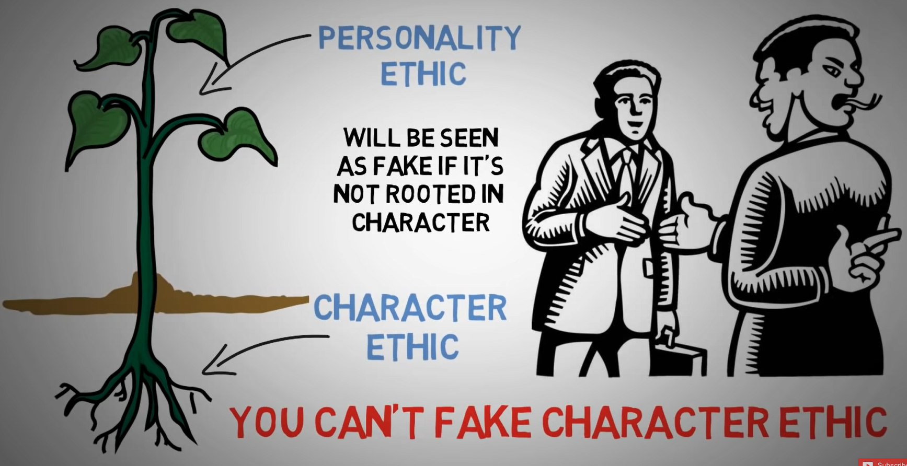
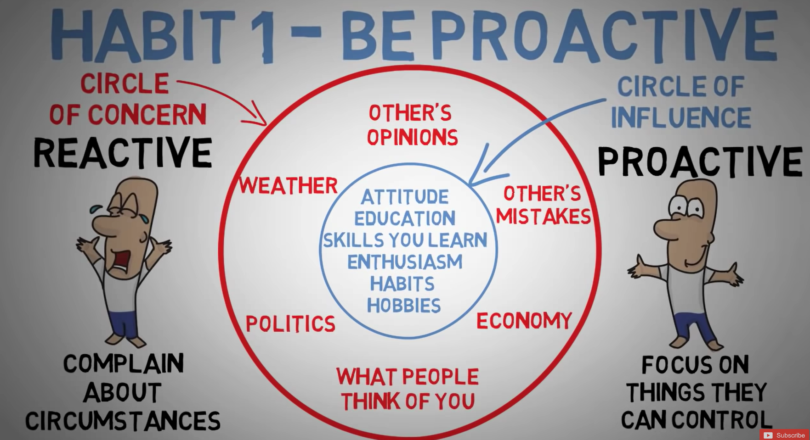
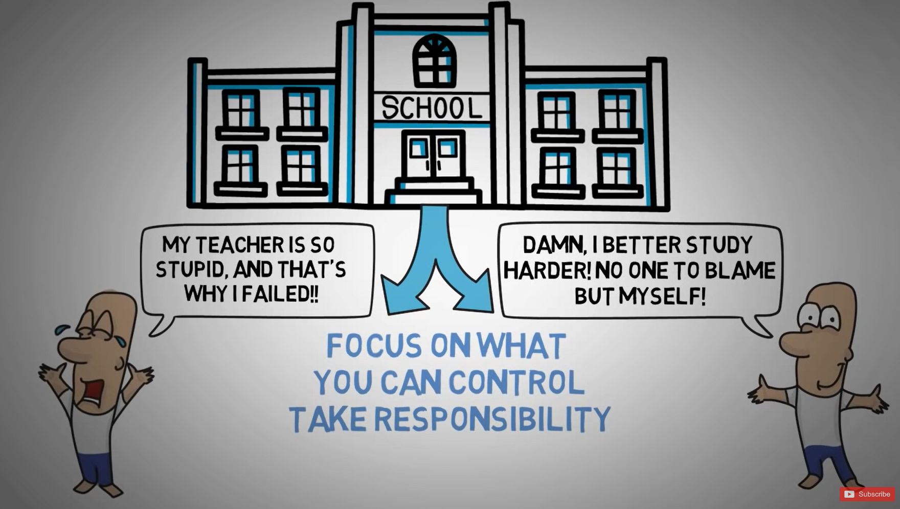
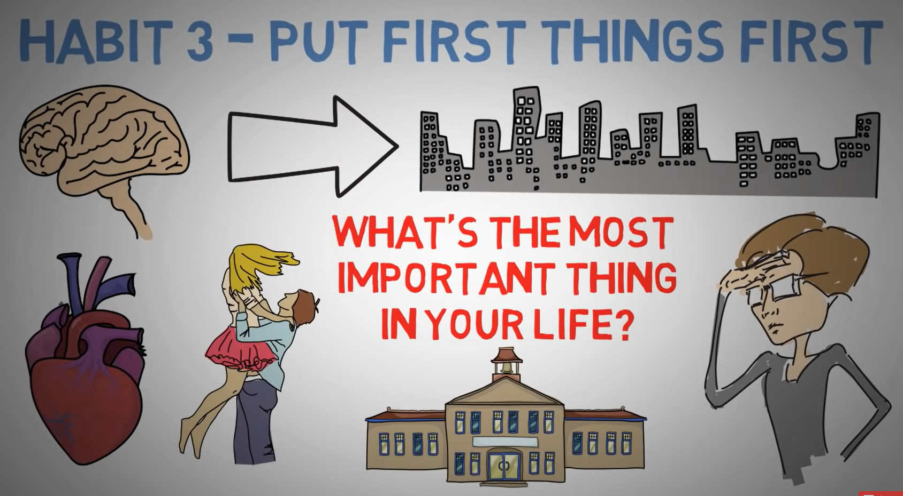
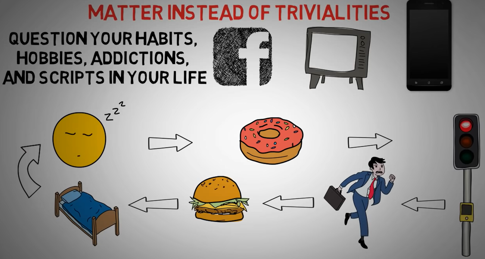
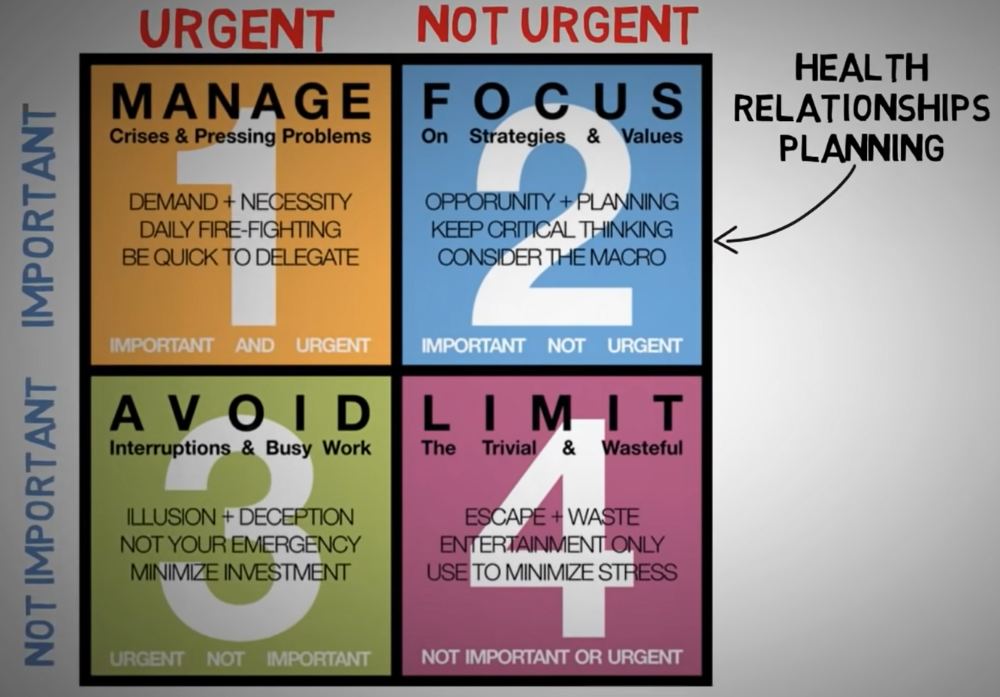
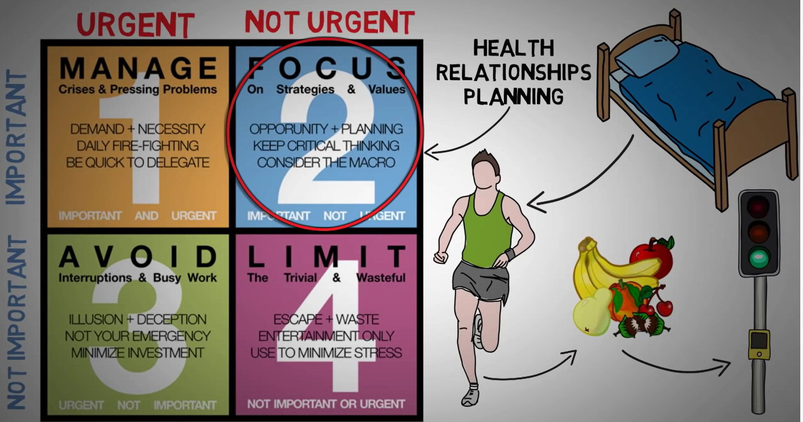
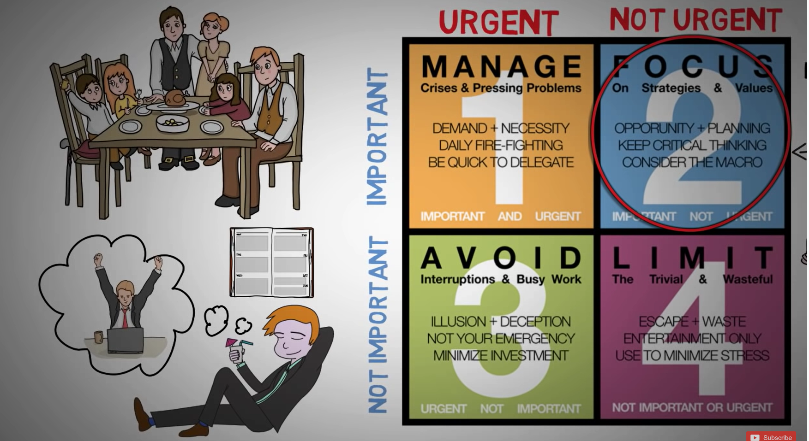
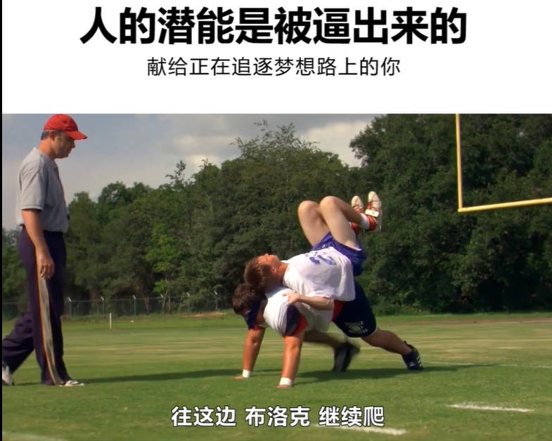

## Table of contents

{: .no_toc .text-delta }

1. TOC
{: toc }


# The 7 Habits of Highly Effective People

**Intro:**

- This is a book write by Stephen covey. Who was named one of the 25 most influential people in 1996. A professor at the Jon M. Huntsman School of Business at Utah State University.  
- Covey earned a Bachelor of Science degree in business administration from the University of Utah, an MBA from Harvard Business School at Harvard University, and a Doctor of Religious Education (DRE) from Brigham Young University. He was a member of Pi Kappa Alpha fraternity. He was awarded ten honorary doctorates.

> ***Dependence*** <u>means you need others to get what you need</u>. All of us began life as an infant, depending on others for nurturing and sustenance. I may be intellectually dependent on other people's thinking; I may be emotionally dependent on other people's affirmation and validation of me. Dependence is the attitude of "you": *you* take care of me... or *you* don't come through and I blame you for the result.
>
> ***Independence*** <u>means you are pretty much free from the external influence [and] support of others. ... Independence is the attitude of "I".</u> ... It is the avowed goal of many individuals, and also many social movements, to enthrone independence as the highest level of achievement, but it is *not* the ultimate goal in effective living. There is a far more mature and more advanced level.
>
> The third and highest level in the Maturity Continuum is ***interdependence***. ... We live in an interdependent reality. <u>Interdependence is essential for good leaders; good team players; a successful marriage or family life</u>; <u>in organizations. Interdependence is the attitude of "we": *we* can co-operate; *we* can be a team; *we* can combine our talents.</u>
>
> — Stephen Covey, *The 7 habits of highly effective people* (1998)


## [**Part 1: Dependent --> Independent Self-Mastery**](https://www.youtube.com/watch?v=WFc08j9eorQ)

---



**Your Character Ethic make you who you are!**

- Your character is what forms the foundation. 
- It's where the greatest impact over the long term, is where you sow the seeds of greatness.
- There is no shortcut, focus your effort on character



**Habit 1 - Be Proactive**

- <u>Focus on what you can control, and ignore what you can't</u>!
- <u>Proactive person knows that it's their decisions determine their life not the condition</u>. 
- <u>Proactive people don't complain about things that are out of your control, like weather, politics, economy, what people think of you, other's mistake, other people's opinion</u>. And, those are called *Circle of Concern*. 
- Additionally <u>they take action to improve the things that they can control, such as your attitude, education background, your knowledge, what you read, what skills you learned, your enthusiasm, how you spend your free time and who you spend it with, your habits and hobbies and so no</u>.
- <u>Proactive people understand that sometime we may not have complete control over certain situation, but we can control how we respond to a certain situation</u>.

> [Proactivity](https://en.wikipedia.org/wiki/Proactivity) is about taking responsibility for one's reaction to one's own experiences, taking the initiative to respond positively and improve the situation. Covey discusses recognizing one's *circle of influence* and *circle of concern*. Covey discusses focusing one's responses and focusing on the center of one's influence.
>
> -- Wiki, *The 7 Habits of Highly Effective People*



**Example:**

- Two people take a test and then they both failed. One blames a teacher and gives up. The proactive one takes the responsibility and ownership studies harder and tries to improve themselves. The reactive person complains about how bad the teacher is and proactive person asks what can I do. They look at themselves first, instead of blaming and complaining. Don't focus on what you can't control, focus on what you can control, take responsibility and keep in mind as you become more and more proactive within your circle of influence, it grows bigger, and you bring more power into your life.
- Even if you only implement one habit out of these seven habits, make it this one. This one alone can have huge impact on your life. In life, you either act or you're acted upon!


**Habit 2 - Begin With The End in Mind**

- Knowing your END GOAL!
- Keep it in your mind while you're driving!
- Dream Big! Don't hold yourself back!
- Don't let self-doubt get in the way, and realize that anything is possible, define how you want your life to be right now!
- Don't let the past or anything else hold you back. Your write the script to your life! No one else, you are the programmer!

> #### Habit 2: "Begin with the end in mind"[[edit](https://en.wikipedia.org/w/index.php?title=The_7_Habits_of_Highly_Effective_People&action=edit&section=4)]
>
> Covey discusses envisioning what one wants in the future (a [personal mission statement](https://en.wikipedia.org/wiki/Personal_mission_statement)) so one can work and plan towards it, and understanding how people make important life decisions. To be effective one needs to act based on principles and constantly review one's mission statements, says Covey. Covey asks: Are you—right now—who you want to be? What do you have to say about yourself? How do you want to be remembered? If habit 1 advises changing one's life to act and be proactive, habit 2 advises that "you are the programmer". Grow and stay humble, Covey says.
>
> Covey says that all things are created twice: Before one acts, one should act in one's mind first. Before creating something, measure twice. Do not just act; think first: Is this how I want it to go, and are these the correct consequences?
>
> -- Wiki, *The 7 Habits of Highly Effective People*



**Habit 3 - Put First Things First**

-  You take the steps and actions required to make your vision a reality!
- Ask yourself, what's the most important thing for you in this moment? (it's probably your significant other, finishing school, improving your health, or your family, right? It's not checking Facebook or Instagram, so why do we spend so much time doing these useless things, right? So, we need to get into the habit of putting first thing first! Taking the time to focus on what really matters and focus on our efforts on what's going to get us to where we want to be in real life!)

**Quad Chart -- Developed by Stephen Covey**



- Categorize thing by urgency and importance 
- Quadrant I. Urgent and important (*Do*) – Things that putting out on fire, emergence, like important deadlines and crises
- Quadrant II. Not urgent but important (*Plan*) – long-term development, like your personal health, and relationship. You need to put more focus here. These are often being neglected activities, and this is where success in balance and growth are found.
- Quadrant III. Urgent but not important (*Delegate*) – distractions with deadlines, like some meeting, some phone call, or other people's emergencies.
- Quadrant IV. Not urgent and not important (*Eliminate*) – frivolous distractions --> These are a waste of time, like busy work, some emails, some phone calls and so on!



**Example 1:** 

- Joe wakes up early and exercises for 30 min, eats a healthy breakfast, leaves early for work and has a nice smooth and joyful ride. Then joe works on the important and not urgent things in Quad 2, and he works on emergencies if needed, and then he delegates Quad 3 activities and rejects Quad 4 tasks.



**Example 2:**

- Joe task a nice relaxing lunch and thinks about the rest of his day and plan his night. At the end of work day, he closes out tasks and plan thing for the next day. He gets home and prepare for healthy meal, and then maybe reads before bed!
- <u>He seems to have more time to think and reflect about his life, and he makes plans on where he wants to end up and who he wants to be</u>. Basically, what we did in habit 2 - Begin with the end in mind. 

> Covey talks about [what is important versus what is urgent](https://en.wikipedia.org/wiki/Eisenhower_matrix). Priority should be given in the following order (in brackets are the corresponding actions from the [Eisenhower matrix](https://en.wikipedia.org/wiki/Eisenhower_matrix), which [Dwight D. Eisenhower](https://en.wikipedia.org/wiki/Dwight_D._Eisenhower) attributed to a former college president):[[5\]](https://en.wikipedia.org/wiki/The_7_Habits_of_Highly_Effective_People#cite_note-5)
>
> - Quadrant I. Urgent and important (*Do*) – important deadlines and crises
> - Quadrant II. Not urgent but important (*Plan*) – long-term development
> - Quadrant III. Urgent but not important (*Delegate*) – distractions with deadlines
> - Quadrant IV. Not urgent and not important (*Eliminate*) – frivolous distractions
>
> The order is important, says Covey: after completing items in quadrant I, people should spend the majority of their time on II, but many people spend too much time in III and IV. The calls to delegate and eliminate are reminders of their relative priority.
>
> If habit 2 advises that "you are the programmer", habit 3 advises: "write the program, become a leader". Keep personal integrity by minimizing the difference between what you say versus what you do, says Covey.
>
> -- Wiki, *The 7 Habits of Highly Effective People*


## [**Part 2: Independent Self-Mastery -- > Interdependence**](https://www.youtube.com/watch?v=5LbCRx1UbWY)

Note: This is quite hard, not something every one can do!  --> So, i'll do this later when it's time!

---


This jump have something to do with speaking skills in critical conversation, Leadership (Not just taking initiative, but has the power to glue talent people working together), and some perseverance.


>### Interdependence[[edit](https://en.wikipedia.org/w/index.php?title=The_7_Habits_of_Highly_Effective_People&action=edit&section=6)]
>
>The next three habits talk about [interdependence](https://en.wikipedia.org/wiki/Interdependence) (i.e., working with others):
>
>#### Habit 4: "Think win–win"[[edit](https://en.wikipedia.org/w/index.php?title=The_7_Habits_of_Highly_Effective_People&action=edit&section=7)]
>
>Seek mutually beneficial [win–win solutions](https://en.wikipedia.org/wiki/Win–win_solution) or agreements in your relationships, says Covey. Valuing and respecting people by seeking a "win" for all is ultimately a better long-term resolution than if only one person in the situation had gotten their way. Thinking win–win isn't about being nice, nor is it a quick-fix technique; it is a character-based code for human interaction and collaboration, says Covey.
>
>#### Habit 5: "Seek first to understand, then to be understood"[[edit](https://en.wikipedia.org/w/index.php?title=The_7_Habits_of_Highly_Effective_People&action=edit&section=8)]
>
>See also: [Rogerian argument](https://en.wikipedia.org/wiki/Rogerian_argument)
>
>Use [empathetic](https://en.wikipedia.org/wiki/Empathetic) listening to genuinely [understand](https://en.wikipedia.org/wiki/Understand) a person, which compels them to reciprocate the listening and take an open mind to be influenced. This creates an atmosphere of caring, and positive problem-solving.
>
>Habit 5 is expressed in the ancient [Greek philosophy](https://en.wikipedia.org/wiki/Greek_philosophy) of three [modes of persuasion](https://en.wikipedia.org/wiki/Modes_of_persuasion):
>
>1. [Ethos](https://en.wikipedia.org/wiki/Ethos) is one's personal credibility. It's the trust that one inspires, one's "emotional bank account".
>2. [Pathos](https://en.wikipedia.org/wiki/Pathos) is the empathetic side, the alignment with the emotional trust of another person's communication.
>3. [Logos](https://en.wikipedia.org/wiki/Logos) is the [logic](https://en.wikipedia.org/wiki/Logic), the reasoning part of the presentation.
>
>The order of the concepts indicates their relative importance, says Covey.
>
>#### Habit 6: "Synergize"[[edit](https://en.wikipedia.org/w/index.php?title=The_7_Habits_of_Highly_Effective_People&action=edit&section=9)]
>
>Combine the strengths of people through positive [teamwork](https://en.wikipedia.org/wiki/Teamwork), so as to achieve goals that no one could have done alone, Covey exhorts.
>
>### Continual improvement[[edit](https://en.wikipedia.org/w/index.php?title=The_7_Habits_of_Highly_Effective_People&action=edit&section=10)]
>
>The final habit is that of [continuous improvement](https://en.wikipedia.org/wiki/Continuous_improvement) in both the personal and interpersonal spheres of influence.
>
>#### Habit 7: "Sharpen the saw"[[edit](https://en.wikipedia.org/w/index.php?title=The_7_Habits_of_Highly_Effective_People&action=edit&section=11)]
>
>See also: [Kaizen](https://en.wikipedia.org/wiki/Kaizen)
>
>Covey says that one should balance and renew one's resources, energy, and health to create a [sustainable](https://en.wikipedia.org/wiki/Sustainable), long-term, effective lifestyle. He primarily emphasizes exercise for physical renewal, good prayer, and good reading for mental renewal. He also mentions service to society for spiritual renewal.
>
>Covey explains the "upward spiral" model. Through conscience, along with meaningful and consistent progress, an upward spiral will result in growth, change, and constant improvement. In essence, one is always attempting to integrate and master the principles outlined in *The 7 Habits* at progressively higher levels at each iteration. Subsequent development on any habit will render a different experience and one will learn the principles with a deeper understanding. The upward spiral model consists of three parts: learn, commit, do. According to Covey, one must be increasingly educating the conscience in order to grow and develop on the upward spiral. The idea of renewal by education will propel one along the path of personal freedom, security, wisdom, and power, says Covey.
>
>-- Wiki, *The 7 Habits of Highly Effective People*


# Bonus:

## Bonus 1: Some interesting video about Game Theory

- 囚徒困境
  - [人们为啥总闯红灯？小企业开拓市场咋这么难？囚徒困境又是什么？李永乐老师讲解纳什均衡理论](https://www.youtube.com/watch?v=Upd1ESkn-Bo)
  - [为什么国家之间不能好好合作？道理和“石头、剪刀、布”是一样的](https://www.youtube.com/watch?v=pzh-3A2jJ8k)

- Other things:
  - [How to break away from poverty? [2019 Nobel Economics Prize explained]](https://www.youtube.com/watch?v=aBTDvlteZcs)
  - [In which way to talk can make others happy?](https://www.youtube.com/watch?v=xlmep_us15I)


## Bonus 2: Movie -- Facing the Giant

如果你不甘于平凡的自己，那就不顾一切去奔跑吧！耐心看完你会有不一样收获。



- 【面对巨人Facing the Giants】信仰战胜恐惧的励志感人片段, https://www.youtube.com/watch?v=eINRApxae_c [1:42 - 6:06]


[Transcript:](https://subslikescript.com/movie/Facing_the_Giants-805526)

```txt
I want you to do it blindfolded. 

Why?

I don't want you giving up at a certain
point when you can go further. Get down.

Jeremy, get on his back.

Get a good tight hold, Jeremy.

All right. Let's go, Brock.

Keep your knees off the ground. 
Just your hands and feet. There you go.

A little bit left.
A little bit left.

There you go.
Show me good effort.

Thataway, Brock.
You keep coming.

There you go. Come on, Brock.

Come on.

It's a good start.
Little bit left.

Little bit left. There you go, Brock.

Good strength.

You gotta be kidding me.

That's it, Brock. That's
it. Am I at the 20 yet?

** Forget the 20. You give me your best. You keep going. That's it. Don't stop. You got more in you than that.

I ain't done. I'm resting a second.

You gotta keep moving. Let's go.

** Don't quit till you got nothing left.

There you go. Keep moving. Keep moving.

Keep moving, Brock. That's it. You keep driving.

Keep your knees off the ground.
Keep driving it. Your very best.

Your very best.
Keep moving, Brock.

That's it. That's it. That's it.

Keep going. Don't quit on me. Keep going.

Keep driving it. Keep your knees off the ground. That's it.

Your very best. Don't quit on me. Your very best.

Keep driving. Keep driving.
There you go. There you go.

That's it. You keep driving.
Keep your knees off the ground.

** Don't quit till you got nothing left.

Keep moving, Brock.
That's it. That's it. That's it.

** Keep going. I want everything you got. Come on, keep going.

It hurts. Don't quit on me. Your very best.

Keep driving. Keep driving.

There you go. There you go.

He's heavy. 

I know. He's heavy. 

I'm about out of strength.

** Then you need to go shape your body to find more strength. 
But don't you give up on me, Brock. You keep going, you hear me?

You're doing good. You keep going.

Do not quit on me. You keep going.

[Brock] It hurts. 

I know it hurts. You keep going.

It's all heart from here. 30 more steps.

You keep going, Brock. Come on.

Keep going. 

[Brock] It burns.

Let it burn. 

[Brock] My arms are burning.

It's all heart. You keep going, Brock. Come on.

Come on. Keep going. You promised me your best. Your best.

Don't stop. Keep going. 

[Brock]It's too hard.

It's not too hard. You keep going. Come on, Brock.

Give me more. Give me more. Keep going.

20 more steps. 20 more.

Keep going, Brock. Give me your best. Don't quit.

No. Keep going. Keep going. Keep going.

Don't quit. Don't quit. Don't quit.

Brock Kelley, you don't quit.

Keep going. Keep going.

Go, Brock Kelley. You don't quit on me. No, you keep going.

You keep going. Go, Brock.

10 more steps. 10 more. 10 more. 10 more.

Keep going. Don't quit. Give me your heart.

I can't do it. You can. You can.

Five more. Five more.

Come on, Brock. Come on. Don't quit. Don't quit.

Come on, Brock. Two more. One more.

[Brock] That's gotta be 50. That's gotta be 50. I don't have any more.

Look up, Brock. You're in the end zone.

Brock, you are the most influential player on this team.

If you walk around defeated, so will they.

Tell me you can't give me more than what I've been seeing.

You just carried a 140-pound man across this whole field on your arms.

Brock, I need you.

God's gifted you with the ability of leadership. Don't waste it.

[Jeremy] Coach.

Can I count on you?

[Brock] Yes.

[Jeremy] Coach.

What is it, Jeremy? 

[Jeremy] I weigh 160.
```


# Reference:

- Wisdom for life, https://russjamieson.com/
- [The 7 Habits of Highly Effective People Summary](https://russjamieson.com/7-habits-highly-effective-people-stephen-covey-summary/) 
  - Part 1 Video, https://www.youtube.com/watch?v=WFc08j9eorQ
  - Part 2 Video, [https://youtu.be/5LbCRx1UbWY](https://www.youtube.com/watch?v=5LbCRx1UbWY&t=0s)
- Wiki, [*The 7 Habits of Highly Effective People*](https://en.wikipedia.org/wiki/The_7_Habits_of_Highly_Effective_People)